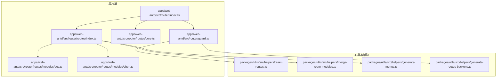
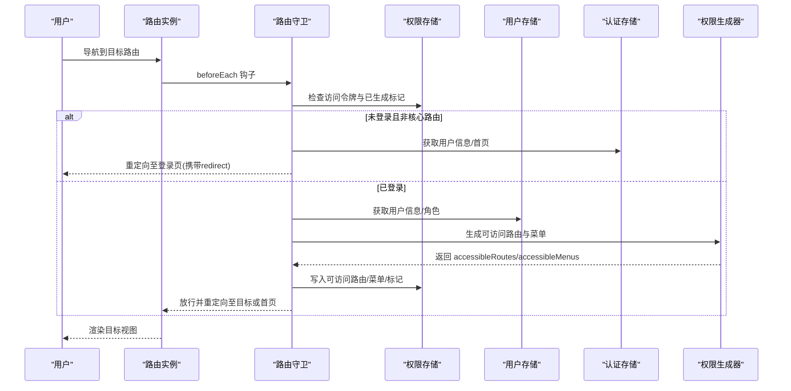
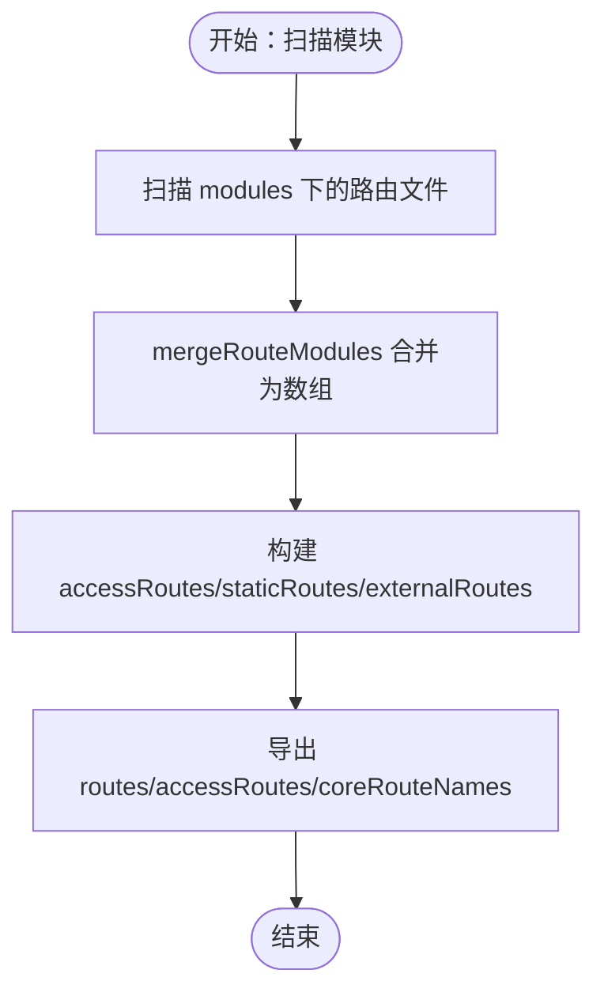
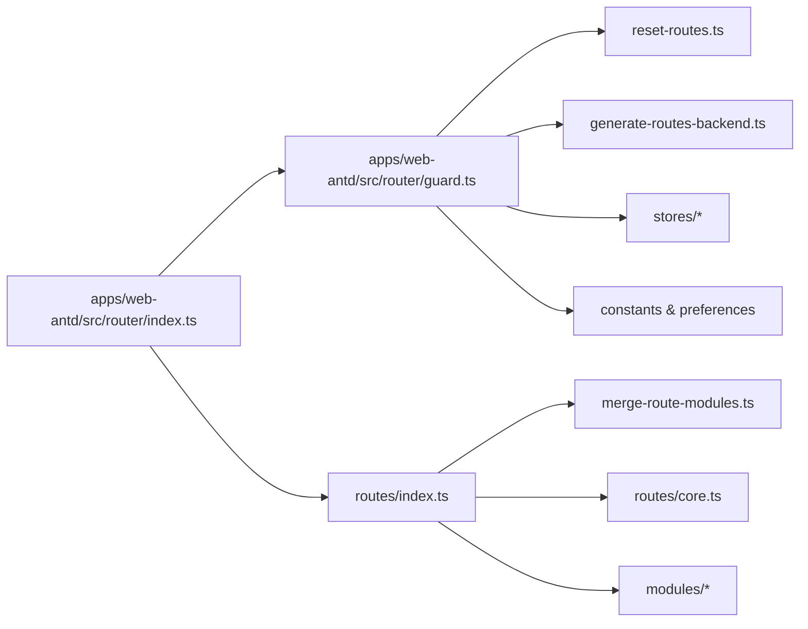

# 路由配置

<cite>
**本文引用的文件**
- [apps/web-antd/src/router/index.ts](file://apps/web-antd/src/router/index.ts)
- [apps/web-antd/src/router/guard.ts](file://apps/web-antd/src/router/guard.ts)
- [apps/web-antd/src/router/routes/core.ts](file://apps/web-antd/src/router/routes/core.ts)
- [apps/web-antd/src/router/routes/index.ts](file://apps/web-antd/src/router/routes/index.ts)
- [apps/web-antd/src/router/routes/modules/dev.ts](file://apps/web-antd/src/router/routes/modules/dev.ts)
- [apps/web-antd/src/router/routes/modules/vben.ts](file://apps/web-antd/src/router/routes/modules/vben.ts)
- [apps/web-antd/src/store/auth.ts](file://apps/web-antd/src/store/auth.ts)
- [packages/utils/src/helpers/reset-routes.ts](file://packages/utils/src/helpers/reset-routes.ts)
- [packages/utils/src/helpers/generate-menus.ts](file://packages/utils/src/helpers/generate-menus.ts)
- [packages/utils/src/helpers/merge-route-modules.ts](file://packages/utils/src/helpers/merge-route-modules.ts)
- [packages/utils/src/helpers/generate-routes-backend.ts](file://packages/utils/src/helpers/generate-routes-backend.ts)
- [packages/utils/src/helpers/generate-routes-backend.ts](file://packages/utils/src/helpers/generate-routes-backend.ts)
- [packages/effects/layouts/src/basic/menu/use-navigation.ts](file://packages/effects/layouts/src/basic/menu/use-navigation.ts)
- [docs/src/en/guide/essentials/route.md](file://docs/src/en/guide/essentials/route.md)
</cite>

## 目录
1. [简介](#简介)
2. [项目结构](#项目结构)
3. [核心组件](#核心组件)
4. [架构总览](#架构总览)
5. [详细组件分析](#详细组件分析)
6. [依赖关系分析](#依赖关系分析)
7. [性能考量](#性能考量)
8. [故障排查指南](#故障排查指南)
9. [结论](#结论)
10. [附录](#附录)

## 简介
本文件面向 Vben Admin 的路由配置体系，系统性阐述静态路由与动态路由的组织方式、核心路由与业务路由的分离策略、路由元信息（权限、菜单、图标等）的配置方法、路由懒加载与性能优化、嵌套路由设计原则与最佳实践，并通过图示与路径引用展示如何新增路由、配置参数与处理重定向。

## 项目结构
Vben Admin 在多套 Web UI 框架下共享同一套路由与权限基础设施。以 web-antd 应用为例，路由相关代码集中在 apps/web-antd/src/router 下，包含：
- 路由实例与初始化：apps/web-antd/src/router/index.ts
- 路由守卫：apps/web-antd/src/router/guard.ts
- 核心路由定义：apps/web-antd/src/router/routes/core.ts
- 路由聚合与模块化：apps/web-antd/src/router/routes/index.ts 与 modules 子目录
- 业务路由模块示例：apps/web-antd/src/router/routes/modules/dev.ts、vben.ts 等

**图表来源**
- [apps/web-antd/src/router/index.ts:1-38](file://apps/web-antd/src/router/index.ts#L1-L38)
- [apps/web-antd/src/router/guard.ts:1-133](file://apps/web-antd/src/router/guard.ts#L1-L133)
- [apps/web-antd/src/router/routes/core.ts:1-50](file://apps/web-antd/src/router/routes/core.ts#L1-L50)
- [apps/web-antd/src/router/routes/index.ts:1-60](file://apps/web-antd/src/router/routes/index.ts#L1-L60)
- [apps/web-antd/src/router/routes/modules/dev.ts:1-60](file://apps/web-antd/src/router/routes/modules/dev.ts#L1-L60)
- [apps/web-antd/src/router/routes/modules/vben.ts:1-60](file://apps/web-antd/src/router/routes/modules/vben.ts#L1-L60)
- [packages/utils/src/helpers/reset-routes.ts:1-120](file://packages/utils/src/helpers/reset-routes.ts#L1-L120)
- [packages/utils/src/helpers/merge-route-modules.ts:1-120](file://packages/utils/src/helpers/merge-route-modules.ts#L1-L120)
- [packages/utils/src/helpers/generate-menus.ts:1-120](file://packages/utils/src/helpers/generate-menus.ts#L1-L120)
- [packages/utils/src/helpers/generate-routes-backend.ts:1-120](file://packages/utils/src/helpers/generate-routes-backend.ts#L1-L120)

**章节来源**
- [apps/web-antd/src/router/index.ts:1-38](file://apps/web-antd/src/router/index.ts#L1-L38)
- [apps/web-antd/src/router/guard.ts:1-133](file://apps/web-antd/src/router/guard.ts#L1-L133)
- [apps/web-antd/src/router/routes/core.ts:1-50](file://apps/web-antd/src/router/routes/core.ts#L1-L50)
- [apps/web-antd/src/router/routes/index.ts:1-60](file://apps/web-antd/src/router/routes/index.ts#L1-L60)
- [apps/web-antd/src/router/routes/modules/dev.ts:1-60](file://apps/web-antd/src/router/routes/modules/dev.ts#L1-L60)
- [apps/web-antd/src/router/routes/modules/vben.ts:1-60](file://apps/web-antd/src/router/routes/modules/vben.ts#L1-L60)

## 核心组件
- 路由实例与历史模式
  - 通过 createRouter 创建实例，支持 hash 与 history 两种历史模式，可通过环境变量切换；内置滚动行为与可选严格斜杠策略。
  - 提供 resetRoutes 方法用于重置静态路由。
  - 参考路径：[apps/web-antd/src/router/index.ts:15-30](file://apps/web-antd/src/router/index.ts#L15-L30)

- 路由守卫
  - setupCommonGuard：统一处理页面加载进度条与已加载页面标记。
  - setupAccessGuard：核心权限守卫，区分“核心路由”、“未登录访问控制”、“动态路由生成”、“重定向逻辑”。
  - 参考路径：[apps/web-antd/src/router/guard.ts:17-119](file://apps/web-antd/src/router/guard.ts#L17-L119)

- 核心路由
  - 定义根路由、登录页、404 等基础路由，作为“核心路由名称集合”，在守卫中被豁免权限拦截。
  - 参考路径：[apps/web-antd/src/router/routes/core.ts:10-30](file://apps/web-antd/src/router/routes/core.ts#L10-L30)

- 路由聚合与模块化
  - routes/index.ts 负责合并模块化路由（动态路由）、构建静态路由与外部路由集合，并导出 accessRoutes、coreRouteNames 等。
  - mergeRouteModules 用于按约定扫描并合并模块化路由文件。
  - 参考路径：[apps/web-antd/src/router/routes/index.ts:15-46](file://apps/web-antd/src/router/routes/index.ts#L15-L46)、[packages/utils/src/helpers/merge-route-modules.ts:1-120](file://packages/utils/src/helpers/merge-route-modules.ts#L1-120)

- 工具与辅助
  - resetStaticRoutes：重置静态路由，便于在登录态变化后刷新路由表。
  - generateMenus：从路由生成菜单树，支持徽标、排序、图标等元信息映射。
  - 参考路径：[packages/utils/src/helpers/reset-routes.ts:1-120](file://packages/utils/src/helpers/reset-routes.ts#L1-L120)、[packages/utils/src/helpers/generate-menus.ts:1-120](file://packages/utils/src/helpers/generate-menus.ts#L1-L120)

**章节来源**
- [apps/web-antd/src/router/index.ts:15-38](file://apps/web-antd/src/router/index.ts#L15-L38)
- [apps/web-antd/src/router/guard.ts:17-119](file://apps/web-antd/src/router/guard.ts#L17-L119)
- [apps/web-antd/src/router/routes/core.ts:10-30](file://apps/web-antd/src/router/routes/core.ts#L10-L30)
- [apps/web-antd/src/router/routes/index.ts:15-46](file://apps/web-antd/src/router/routes/index.ts#L15-L46)
- [packages/utils/src/helpers/reset-routes.ts:1-120](file://packages/utils/src/helpers/reset-routes.ts#L1-L120)
- [packages/utils/src/helpers/generate-menus.ts:1-120](file://packages/utils/src/helpers/generate-menus.ts#L1-L120)

## 架构总览
路由系统围绕“路由实例—守卫—核心/业务路由—权限生成—菜单生成”的闭环展开。登录态变化或用户角色变更时，通过 generateAccess 动态注入可访问路由与菜单，再由 resetStaticRoutes 或路由替换完成导航。

**图表来源**
- [apps/web-antd/src/router/guard.ts:47-119](file://apps/web-antd/src/router/guard.ts#L47-L119)
- [apps/web-antd/src/store/auth.ts:1-60](file://apps/web-antd/src/store/auth.ts#L1-L60)

## 详细组件分析

### 路由模块化设计与组织
- 模块化原则
  - 核心路由集中于 core.ts，业务路由按功能域拆分至 modules 子目录，遵循“按功能域/模块”划分。
  - routes/index.ts 使用 mergeRouteModules 扫描 modules 下的路由文件，统一合并为 accessRoutes。
  - 参考路径：[apps/web-antd/src/router/routes/index.ts:15-46](file://apps/web-antd/src/router/routes/index.ts#L15-L46)、[apps/web-antd/src/router/routes/modules/dev.ts:1-60](file://apps/web-antd/src/router/routes/modules/dev.ts#L1-L60)

- 路由元信息与菜单生成
  - 元信息字段（如 authority、icon、title、order、hideInMenu 等）用于控制权限、菜单渲染与排序。
  - generate-menus 将路由转换为菜单树，支持徽标、父级链路、可见性等属性。
  - 参考路径：[packages/utils/src/helpers/generate-menus.ts:1-120](file://packages/utils/src/helpers/generate-menus.ts#L1-L120)

- 示例：开发管理模块
  - dev.ts 展示二级与多级嵌套路由的组织方式，体现“父路由承载布局，子路由承载页面”的设计。
  - 参考路径：[apps/web-antd/src/router/routes/modules/dev.ts:1-60](file://apps/web-antd/src/router/routes/modules/dev.ts#L1-L60)

**图表来源**
- [apps/web-antd/src/router/routes/index.ts:15-46](file://apps/web-antd/src/router/routes/index.ts#L15-L46)
- [packages/utils/src/helpers/merge-route-modules.ts:1-120](file://packages/utils/src/helpers/merge-route-modules.ts#L1-L120)

**章节来源**
- [apps/web-antd/src/router/routes/index.ts:15-46](file://apps/web-antd/src/router/routes/index.ts#L15-L46)
- [apps/web-antd/src/router/routes/modules/dev.ts:1-60](file://apps/web-antd/src/router/routes/modules/dev.ts#L1-L60)
- [packages/utils/src/helpers/generate-menus.ts:1-120](file://packages/utils/src/helpers/generate-menus.ts#L1-L120)

### 静态路由与动态路由
- 静态路由
  - 在启动阶段确定的路由集合，通常无需权限控制或权限影响较小。
  - 在 routes/index.ts 中通过 import.meta.glob 加载 static 目录下的路由文件，再经 mergeRouteModules 合并。
  - 参考路径：[apps/web-antd/src/router/routes/index.ts:41-52](file://apps/web-antd/src/router/routes/index.ts#L41-L52)

- 动态路由
  - 登录后根据用户角色动态生成，通过 generateAccess 注入到路由表中。
  - 守卫在首次访问时生成并缓存，避免重复计算。
  - 参考路径：[apps/web-antd/src/router/guard.ts:94-118](file://apps/web-antd/src/router/guard.ts#L94-L118)

- 外部路由
  - 用于独立页面或嵌入场景，不强制加载主布局。
  - 参考路径：[apps/web-antd/src/router/routes/index.ts:48-51](file://apps/web-antd/src/router/routes/index.ts#L48-L51)

**章节来源**
- [apps/web-antd/src/router/routes/index.ts:41-52](file://apps/web-antd/src/router/routes/index.ts#L41-L52)
- [apps/web-antd/src/router/guard.ts:94-118](file://apps/web-antd/src/router/guard.ts#L94-L118)

### 路由元信息配置
- 元信息字段
  - authority：权限标识，决定是否放行与菜单显示。
  - icon/title/order：菜单渲染与排序。
  - hideInMenu/show：控制菜单显隐。
  - ignoreAccess：可绕过权限拦截（如验证码页）。
  - 参考路径：[packages/utils/src/helpers/generate-menus.ts:1-120](file://packages/utils/src/helpers/generate-menus.ts#L1-L120)

- 菜单生成流程
  - 从路由集合生成菜单树，支持徽标、排序、父子关系、可见性等。
  - 参考路径：[packages/utils/src/helpers/generate-menus.ts:1-120](file://packages/utils/src/helpers/generate-menus.ts#L1-L120)

**章节来源**
- [packages/utils/src/helpers/generate-menus.ts:1-120](file://packages/utils/src/helpers/generate-menus.ts#L1-L120)

### 路由懒加载与性能优化
- 懒加载实现
  - 使用 import() 动态导入组件，结合路由 record 的 component/children 实现按需加载。
  - 参考路径：[apps/web-antd/src/router/routes/modules/dev.ts:1-60](file://apps/web-antd/src/router/routes/modules/dev.ts#L1-L60)

- 性能优化建议
  - 合理拆分模块，避免单模块过大。
  - 对不常用页面采用异步组件与路由级懒加载。
  - 利用 keep-alive 缓存页面状态（在布局层配合使用）。
  - 参考路径：[apps/web-antd/src/router/routes/modules/vben.ts:1-60](file://apps/web-antd/src/router/routes/modules/vben.ts#L1-L60)

**章节来源**
- [apps/web-antd/src/router/routes/modules/dev.ts:1-60](file://apps/web-antd/src/router/routes/modules/dev.ts#L1-L60)
- [apps/web-antd/src/router/routes/modules/vben.ts:1-60](file://apps/web-antd/src/router/routes/modules/vben.ts#L1-L60)

### 嵌套路由设计原则与最佳实践
- 设计原则
  - 父路由负责布局容器，子路由负责具体页面；保持层级清晰，避免超过三级嵌套。
  - 使用 meta 字段控制菜单与权限，确保父子路由一致的权限语义。
  - 参考路径：[apps/web-antd/src/router/routes/modules/dev.ts:1-60](file://apps/web-antd/src/router/routes/modules/dev.ts#L1-L60)

- 最佳实践
  - 为每个模块建立独立的路由文件，便于维护与复用。
  - 统一命名规范与目录结构，减少心智负担。
  - 对需要缓存的页面，结合 keep-alive 与路由 key 策略。
  - 参考路径：[apps/web-antd/src/router/routes/modules/vben.ts:1-60](file://apps/web-antd/src/router/routes/modules/vben.ts#L1-L60)

**章节来源**
- [apps/web-antd/src/router/routes/modules/dev.ts:1-60](file://apps/web-antd/src/router/routes/modules/dev.ts#L1-L60)
- [apps/web-antd/src/router/routes/modules/vben.ts:1-60](file://apps/web-antd/src/router/routes/modules/vben.ts#L1-L60)

### 新增路由、参数配置与重定向
- 新增路由步骤
  - 在 modules 下新建路由文件，按 Vue Router 规范定义 record 数组。
  - 在 routes/index.ts 中确保 mergeRouteModules 能扫描到该文件。
  - 若为菜单项，补充 meta.icon、title、order 等字段。
  - 参考路径：[apps/web-antd/src/router/routes/modules/dev.ts:1-60](file://apps/web-antd/src/router/routes/modules/dev.ts#L1-L60)、[apps/web-antd/src/router/routes/index.ts:15-46](file://apps/web-antd/src/router/routes/index.ts#L15-L46)

- 路由参数配置
  - 动态参数使用 :id 等占位符；查询参数通过 query 传递。
  - 参考路径：[apps/web-antd/src/router/guard.ts:74-84](file://apps/web-antd/src/router/guard.ts#L74-L84)

- 处理重定向
  - 登录成功后根据 redirect 参数或用户首页进行重定向；默认首页优先取用户 homePath。
  - 参考路径：[apps/web-antd/src/router/guard.ts:109-117](file://apps/web-antd/src/router/guard.ts#L109-L117)

**章节来源**
- [apps/web-antd/src/router/routes/modules/dev.ts:1-60](file://apps/web-antd/src/router/routes/modules/dev.ts#L1-L60)
- [apps/web-antd/src/router/routes/index.ts:15-46](file://apps/web-antd/src/router/routes/index.ts#L15-L46)
- [apps/web-antd/src/router/guard.ts:74-84](file://apps/web-antd/src/router/guard.ts#L74-L84)
- [apps/web-antd/src/router/guard.ts:109-117](file://apps/web-antd/src/router/guard.ts#L109-L117)

## 依赖关系分析
- 组件耦合与职责
  - 路由实例仅负责注册与历史模式，不承担权限判断。
  - 路由守卫集中处理登录态、权限生成与重定向。
  - 工具函数负责路由与菜单的生成、合并与重置。
- 外部依赖
  - vue-router：路由核心能力。
  - @vben/constants、@vben/preferences、@vben/stores：常量、偏好与状态管理。
  - 参考路径：[apps/web-antd/src/router/guard.ts:3-9](file://apps/web-antd/src/router/guard.ts#L3-L9)

**图表来源**
- [apps/web-antd/src/router/guard.ts:1-133](file://apps/web-antd/src/router/guard.ts#L1-L133)
- [apps/web-antd/src/router/index.ts:1-38](file://apps/web-antd/src/router/index.ts#L1-L38)
- [apps/web-antd/src/router/routes/index.ts:1-60](file://apps/web-antd/src/router/routes/index.ts#L1-L60)
- [packages/utils/src/helpers/reset-routes.ts:1-120](file://packages/utils/src/helpers/reset-routes.ts#L1-L120)
- [packages/utils/src/helpers/generate-routes-backend.ts:1-120](file://packages/utils/src/helpers/generate-routes-backend.ts#L1-L120)
- [packages/utils/src/helpers/merge-route-modules.ts:1-120](file://packages/utils/src/helpers/merge-route-modules.ts#L1-L120)

**章节来源**
- [apps/web-antd/src/router/guard.ts:1-133](file://apps/web-antd/src/router/guard.ts#L1-L133)
- [apps/web-antd/src/router/index.ts:1-38](file://apps/web-antd/src/router/index.ts#L1-L38)
- [apps/web-antd/src/router/routes/index.ts:1-60](file://apps/web-antd/src/router/routes/index.ts#L1-L60)

## 性能考量
- 模块化与懒加载
  - 将大模块拆分为多个小模块，结合 import() 实现按需加载，降低首屏体积。
- 路由生成缓存
  - 首次生成后标记 isAccessChecked，避免重复计算。
- 进度条与滚动行为
  - 通过守卫统一控制页面加载进度条与滚动位置，提升用户体验。
- 参考路径：[apps/web-antd/src/router/guard.ts:17-41](file://apps/web-antd/src/router/guard.ts#L17-L41)、[apps/web-antd/src/router/index.ts:22-27](file://apps/web-antd/src/router/index.ts#L22-L27)

**章节来源**
- [apps/web-antd/src/router/guard.ts:17-41](file://apps/web-antd/src/router/guard.ts#L17-L41)
- [apps/web-antd/src/router/index.ts:22-27](file://apps/web-antd/src/router/index.ts#L22-L27)

## 故障排查指南
- 登录后无法进入业务页面
  - 检查用户角色是否正确下发，确认 generateAccess 是否返回可访问路由。
  - 参考路径：[apps/web-antd/src/router/guard.ts:94-118](file://apps/web-antd/src/router/guard.ts#L94-L118)

- 重定向异常
  - 核对 redirect 参数与默认首页配置，确保登录后能回到原目标页。
  - 参考路径：[apps/web-antd/src/router/guard.ts:109-117](file://apps/web-antd/src/router/guard.ts#L109-L117)

- 菜单不显示或顺序错乱
  - 检查 meta 字段（icon、title、order、hideInMenu）是否正确配置。
  - 参考路径：[packages/utils/src/helpers/generate-menus.ts:1-120](file://packages/utils/src/helpers/generate-menus.ts#L1-L120)

- 路由刷新丢失
  - 确认 resetStaticRoutes 是否在登录态变化后调用。
  - 参考路径：[apps/web-antd/src/router/index.ts:32](file://apps/web-antd/src/router/index.ts#L32)

**章节来源**
- [apps/web-antd/src/router/guard.ts:94-118](file://apps/web-antd/src/router/guard.ts#L94-L118)
- [apps/web-antd/src/router/guard.ts:109-117](file://apps/web-antd/src/router/guard.ts#L109-L117)
- [packages/utils/src/helpers/generate-menus.ts:1-120](file://packages/utils/src/helpers/generate-menus.ts#L1-L120)
- [apps/web-antd/src/router/index.ts:32](file://apps/web-antd/src/router/index.ts#L32)

## 结论
Vben Admin 的路由体系以“模块化 + 权限驱动 + 菜单自动生成”为核心，通过 core 与 modules 的清晰分离、守卫中的动态生成与重定向机制，实现了高扩展性与易维护性。配合懒加载与缓存策略，可在保证体验的同时控制包体与性能。

## 附录
- 文档参考：[docs/src/en/guide/essentials/route.md](file://docs/src/en/guide/essentials/route.md)
- 路由类型与菜单自动生成说明见文档对应章节。