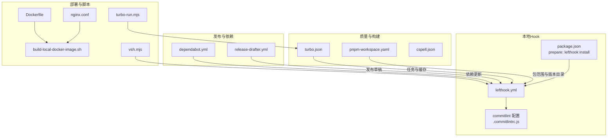
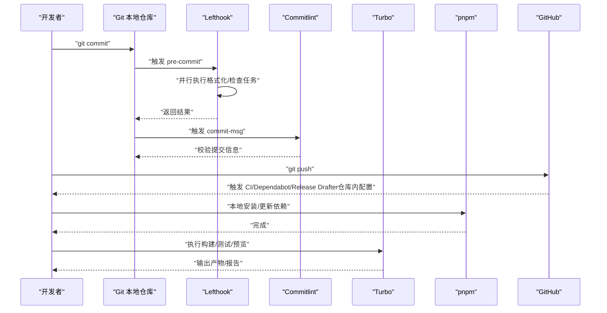
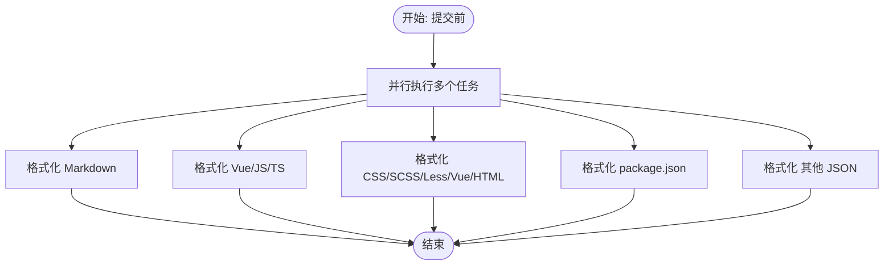
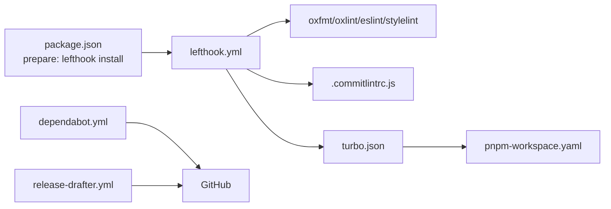

# Git Hooks与自动化流程

<cite>
**本文引用的文件**
- [lefthook.yml](file://lefthook.yml)
- [package.json](file://package.json)
- [.commitlintrc.js](file://.commitlintrc.js)
- [turbo.json](file://turbo.json)
- [pnpm-workspace.yaml](file://pnpm-workspace.yaml)
- [cspell.json](file://cspell.json)
- [.github/dependabot.yml](file://.github/dependabot.yml)
- [.github/release-drafter.yml](file://.github/release-drafter.yml)
- [scripts/deploy/Dockerfile](file://scripts/deploy/Dockerfile)
- [scripts/deploy/nginx.conf](file://scripts/deploy/nginx.conf)
- [scripts/deploy/build-local-docker-image.sh](file://scripts/deploy/build-local-docker-image.sh)
- [scripts/vsh/bin/vsh.mjs](file://scripts/vsh/bin/vsh.mjs)
- [scripts/turbo-run/bin/turbo-run.mjs](file://scripts/turbo-run/bin/turbo-run.mjs)
</cite>

## 目录

1. [简介](#简介)
2. [项目结构](#项目结构)
3. [核心组件](#核心组件)
4. [架构总览](#架构总览)
5. [详细组件分析](#详细组件分析)
6. [依赖关系分析](#依赖关系分析)
7. [性能考量](#性能考量)
8. [故障排除指南](#故障排除指南)
9. [结论](#结论)
10. [附录](#附录)

## 简介

本文件系统性阐述本仓库的Git Hooks与自动化流程，重点覆盖以下方面：

- Lefthook在本地提交前与提交信息阶段的配置与执行策略
- 提交后合并钩子用于自动安装依赖
- GitHub Actions生态中的依赖更新与发布草稿机制（基于仓库内现有配置）
- 与外部工具链的集成：代码检查、格式化、拼写检查、类型检查、端到端测试、构建与部署脚本
- 自定义钩子脚本的开发与维护建议
- 最佳实践与常见问题排查

## 项目结构

围绕Git Hooks与自动化流程的关键文件分布如下：

- 本地Hook：lefthook.yml、package.json（prepare钩子安装Lefthook）、.commitlintrc.js（提交信息校验）
- 工作流与发布：.github/dependabot.yml、.github/release-drafter.yml
- 质量工具：turbo.json（任务缓存与依赖声明）、pnpm-workspace.yaml（Monorepo范围与版本目录）、cspell.json（拼写检查词典）
- 部署与脚本：scripts/deploy/\*、scripts/vsh/bin/vsh.mjs、scripts/turbo-run/bin/turbo-run.mjs

图表来源

- [lefthook.yml:1-77](file://lefthook.yml#L1-L77)
- [package.json:57-57](file://package.json#L57-L57)
- [.commitlintrc.js:1-2](file://.commitlintrc.js#L1-L2)
- [turbo.json:15-48](file://turbo.json#L15-L48)
- [pnpm-workspace.yaml:1-193](file://pnpm-workspace.yaml#L1-L193)
- [.github/dependabot.yml:1-18](file://.github/dependabot.yml#L1-L18)
- [.github/release-drafter.yml:1-62](file://.github/release-drafter.yml#L1-L62)
- [scripts/deploy/Dockerfile](file://scripts/deploy/Dockerfile)
- [scripts/deploy/nginx.conf](file://scripts/deploy/nginx.conf)
- [scripts/deploy/build-local-docker-image.sh](file://scripts/deploy/build-local-docker-image.sh)
- [scripts/vsh/bin/vsh.mjs](file://scripts/vsh/bin/vsh.mjs)
- [scripts/turbo-run/bin/turbo-run.mjs](file://scripts/turbo-run/bin/turbo-run.mjs)

章节来源

- [lefthook.yml:1-77](file://lefthook.yml#L1-L77)
- [package.json:27-66](file://package.json#L27-L66)
- [.commitlintrc.js:1-2](file://.commitlintrc.js#L1-L2)
- [turbo.json:1-49](file://turbo.json#L1-L49)
- [pnpm-workspace.yaml:1-193](file://pnpm-workspace.yaml#L1-L193)
- [.github/dependabot.yml:1-18](file://.github/dependabot.yml#L1-L18)
- [.github/release-drafter.yml:1-62](file://.github/release-drafter.yml#L1-L62)

## 核心组件

- Lefthook本地Hook引擎：负责在提交前、提交信息、合并后等阶段执行命令或脚本，涵盖格式化、静态检查、样式检查、包管理器审计等
- 提交信息校验：通过commitlint对提交信息进行规范约束
- Monorepo构建与缓存：Turbo统一调度构建、预览、类型检查等任务，并声明全局依赖与输出
- 依赖管理与版本目录：pnpm-workspace定义包范围，catalog集中管理版本
- 拼写检查：cspell配置常用词汇与忽略路径
- 发布与依赖更新：Dependabot定期检查依赖与GitHub Actions更新；Release Drafter按标签生成变更日志草稿

章节来源

- [lefthook.yml:44-77](file://lefthook.yml#L44-L77)
- [.commitlintrc.js:1-2](file://.commitlintrc.js#L1-L2)
- [turbo.json:15-48](file://turbo.json#L15-L48)
- [pnpm-workspace.yaml:1-193](file://pnpm-workspace.yaml#L1-L193)
- [cspell.json:1-92](file://cspell.json#L1-L92)
- [.github/dependabot.yml:1-18](file://.github/dependabot.yml#L1-L18)
- [.github/release-drafter.yml:1-62](file://.github/release-drafter.yml#L1-L62)

## 架构总览

下图展示从开发者本地提交到CI/CD流水线的关键交互与职责边界。

图表来源

- [lefthook.yml:44-77](file://lefthook.yml#L44-L77)
- [.commitlintrc.js:1-2](file://.commitlintrc.js#L1-L2)
- [turbo.json:15-48](file://turbo.json#L15-L48)
- [pnpm-workspace.yaml:1-193](file://pnpm-workspace.yaml#L1-L193)
- [.github/dependabot.yml:1-18](file://.github/dependabot.yml#L1-L18)
- [.github/release-drafter.yml:1-62](file://.github/release-drafter.yml#L1-L62)

## 详细组件分析

### Lefthook 配置与执行流程

- 触发时机
  - 提交前：pre-commit，支持并行执行多条命令，按文件类型分组
  - 提交信息：commit-msg，调用commitlint校验编辑的提交信息
  - 合并后：post-merge，自动执行pnpm install以同步依赖
- 关键能力
  - 代码格式化：oxfmt
  - 静态检查：oxlint、eslint
  - 样式检查：stylelint
  - 包管理器审计：可扩展（示例中注释了安全审计任务）
  - 文档与JSON格式化：针对特定文件类型
- 并行与文件过滤
  - parallel: true 支持并行执行
  - glob/exclude 控制文件匹配范围
  - staged_files 等变量传递当前暂存区文件集合

图表来源

- [lefthook.yml:44-67](file://lefthook.yml#L44-L67)

章节来源

- [lefthook.yml:44-77](file://lefthook.yml#L44-L77)

### 提交信息校验（commit-msg）

- 使用 commitlint 对提交信息进行校验
- 配置来源于 @vben/commitlint-config，便于统一团队规范
- 在 commit-msg 钩子中读取编辑器输入并进行验证

章节来源

- [.commitlintrc.js:1-2](file://.commitlintrc.js#L1-L2)
- [lefthook.yml:73-77](file://lefthook.yml#L73-L77)

### 提交后合并（post-merge）

- 执行 pnpm install，确保新合并的依赖被正确安装
- 适合在多人协作、频繁合并分支时保持环境一致性

章节来源

- [lefthook.yml:68-72](file://lefthook.yml#L68-L72)

### 质量工具与Monorepo构建

- Turbo
  - 声明全局依赖与输出，提升构建缓存命中率
  - 定义 build、preview、typecheck、dev 等任务
- pnpm-workspace
  - 定义包范围与 catalog 版本目录，统一依赖版本
- cspell
  - 维护常用词汇表与忽略路径，保障文档与注释拼写一致

章节来源

- [turbo.json:15-48](file://turbo.json#L15-L48)
- [pnpm-workspace.yaml:1-193](file://pnpm-workspace.yaml#L1-L193)
- [cspell.json:1-92](file://cspell.json#L1-L92)

### 发布与依赖更新（GitHub 生态）

- Dependabot
  - 定期检查 npm 与 GitHub Actions 的非破坏性更新
  - 分组策略降低更新频率与风险
- Release Drafter
  - 基于标签与PR分类自动生成变更日志草稿
  - 可按类别折叠，便于阅读

章节来源

- [.github/dependabot.yml:1-18](file://.github/dependabot.yml#L1-L18)
- [.github/release-drafter.yml:1-62](file://.github/release-drafter.yml#L1-L62)

### 自定义钩子脚本开发与维护

- 推荐做法
  - 将复杂逻辑拆分为独立脚本，便于复用与调试
  - 使用变量（如 {staged_files}）传递上下文
  - 通过 glob/exclude 精准控制文件范围
  - 在本地先验证脚本行为，再加入Lefthook
- 维护要点
  - 保持脚本幂等与可重复执行
  - 明确失败退出码，避免静默失败
  - 与团队约定脚本命名与目录结构

章节来源

- [lefthook.yml:44-67](file://lefthook.yml#L44-L67)

### 与外部服务的集成

- 代码检查与格式化
  - oxfmt、oxlint、eslint、stylelint 作为本地Hook任务执行
- 类型检查与拼写检查
  - turbo typecheck 与 cspell lint 作为项目级任务
- 端到端测试
  - turbo run test:e2e 由Turbo调度执行
- 构建与部署
  - turbo build 驱动各应用打包
  - scripts/deploy 提供本地Docker镜像构建与Nginx配置

章节来源

- [package.json:27-66](file://package.json#L27-L66)
- [turbo.json:15-48](file://turbo.json#L15-L48)
- [scripts/deploy/build-local-docker-image.sh](file://scripts/deploy/build-local-docker-image.sh)
- [scripts/deploy/Dockerfile](file://scripts/deploy/Dockerfile)
- [scripts/deploy/nginx.conf](file://scripts/deploy/nginx.conf)

## 依赖关系分析

- Lefthook 依赖
  - 通过 package.json 的 prepare 脚本自动安装
  - 在 pre-commit 中调用格式化与检查工具
- Turbo 与 pnpm
  - Turbo 任务依赖 pnpm 工作区范围与版本目录
  - Turbo 声明全局依赖与输出，减少重复计算
- GitHub Actions 生态
  - Dependabot 与 Release Drafter 由仓库内配置驱动

图表来源

- [package.json:57-57](file://package.json#L57-L57)
- [lefthook.yml:44-77](file://lefthook.yml#L44-L77)
- [.commitlintrc.js:1-2](file://.commitlintrc.js#L1-L2)
- [turbo.json:15-48](file://turbo.json#L15-L48)
- [pnpm-workspace.yaml:1-193](file://pnpm-workspace.yaml#L1-L193)
- [.github/dependabot.yml:1-18](file://.github/dependabot.yml#L1-L18)
- [.github/release-drafter.yml:1-62](file://.github/release-drafter.yml#L1-L62)

章节来源

- [package.json:57-57](file://package.json#L57-L57)
- [lefthook.yml:44-77](file://lefthook.yml#L44-L77)
- [turbo.json:15-48](file://turbo.json#L15-L48)
- [pnpm-workspace.yaml:1-193](file://pnpm-workspace.yaml#L1-L193)
- [.github/dependabot.yml:1-18](file://.github/dependabot.yml#L1-L18)
- [.github/release-drafter.yml:1-62](file://.github/release-drafter.yml#L1-L62)

## 性能考量

- 并行执行
  - pre-commit 使用 parallel: true，充分利用多核CPU
- 文件范围控制
  - 通过 glob/exclude 精准匹配，避免对无关文件执行检查
- 缓存与增量构建
  - Turbo 声明 outputs 与 globalDependencies，提升缓存命中率
- 依赖安装
  - post-merge 自动安装，避免手动遗漏导致的性能回退

章节来源

- [lefthook.yml:44-67](file://lefthook.yml#L44-L67)
- [turbo.json:3-13](file://turbo.json#L3-L13)
- [turbo.json:18-23](file://turbo.json#L18-L23)

## 故障排除指南

- Lefthook 未安装或未生效
  - 确认 package.json 的 prepare 脚本已执行
  - 手动运行 lefthook install 进行安装
- 提交被拒绝（commit-msg 失败）
  - 检查提交信息是否符合 commitlint 规范
  - 参考 .commitlintrc.js 的配置来源
- 格式化/检查失败
  - 在本地先单独执行对应命令定位问题
  - 检查 glob/exclude 是否正确匹配目标文件
- 依赖安装异常
  - post-merge 钩子会自动执行 pnpm install，若失败请检查网络与锁文件
- 类型检查/拼写检查报错
  - 使用 turbo run typecheck 或 cspell lint 单独验证
- 端到端测试失败
  - 使用 turbo run test:e2e 定位具体应用或场景

章节来源

- [package.json:57-57](file://package.json#L57-L57)
- [lefthook.yml:73-77](file://lefthook.yml#L73-L77)
- [turbo.json:44-46](file://turbo.json#L44-L46)
- [cspell.json:80-90](file://cspell.json#L80-L90)

## 结论

本仓库通过 Lefthook 将代码质量控制前置到本地提交阶段，结合 Turbo 的构建与缓存、pnpm 的Monorepo管理以及 GitHub 的 Dependabot 与 Release Drafter，形成了从本地到云端的一体化自动化流程。遵循本文最佳实践与排障建议，可显著提升团队协作效率与交付质量。

## 附录

- 实际配置示例与参考路径
  - Lefthook 提交前任务与文件过滤：[lefthook.yml:44-67](file://lefthook.yml#L44-L67)
  - 提交信息校验：[lefthook.yml:73-77](file://lefthook.yml#L73-L77)、[.commitlintrc.js:1-2](file://.commitlintrc.js#L1-L2)
  - 提交后合并自动安装依赖：[lefthook.yml:68-72](file://lefthook.yml#L68-L72)
  - Turbo 任务与缓存：[turbo.json:15-48](file://turbo.json#L15-L48)
  - pnpm 工作区与版本目录：[pnpm-workspace.yaml:1-193](file://pnpm-workspace.yaml#L1-L193)
  - 拼写检查词典与忽略路径：[cspell.json:1-92](file://cspell.json#L1-L92)
  - 依赖更新与发布草稿：[.github/dependabot.yml:1-18](file://.github/dependabot.yml#L1-L18)、[.github/release-drafter.yml:1-62](file://.github/release-drafter.yml#L1-L62)
  - 本地Docker构建与Nginx配置：[scripts/deploy/build-local-docker-image.sh](file://scripts/deploy/build-local-docker-image.sh)、[scripts/deploy/Dockerfile](file://scripts/deploy/Dockerfile)、[scripts/deploy/nginx.conf](file://scripts/deploy/nginx.conf)
  - 自定义脚本入口（vsh、turbo-run）：[scripts/vsh/bin/vsh.mjs](file://scripts/vsh/bin/vsh.mjs)、[scripts/turbo-run/bin/turbo-run.mjs](file://scripts/turbo-run/bin/turbo-run.mjs)
