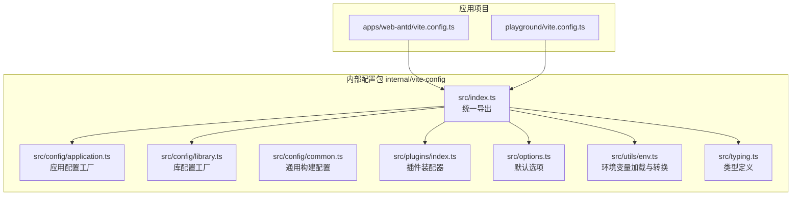
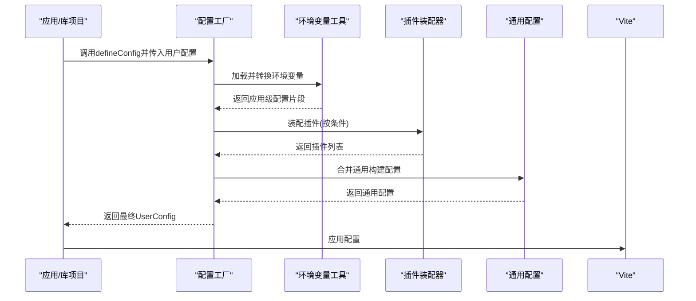
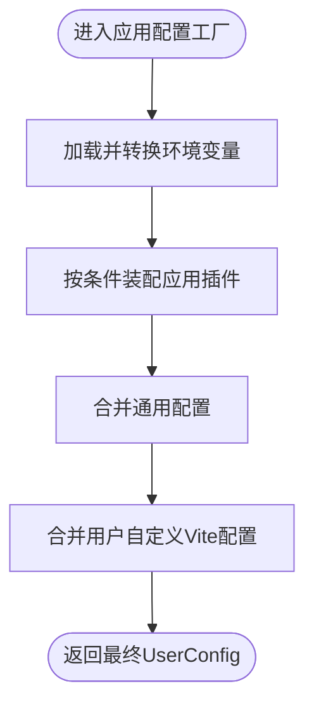
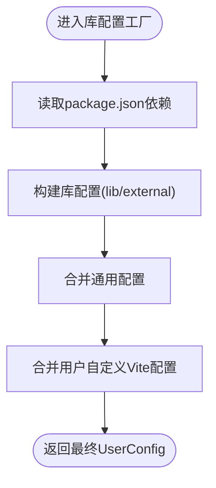
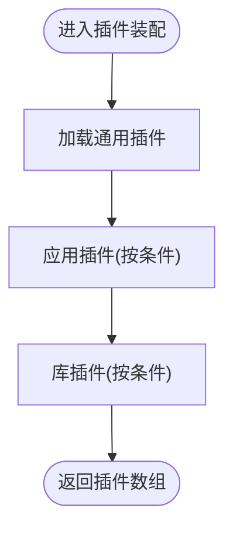
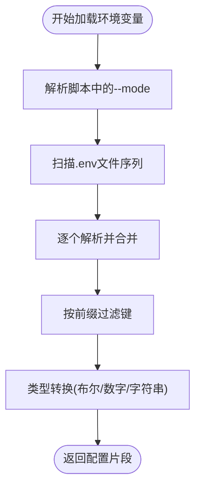
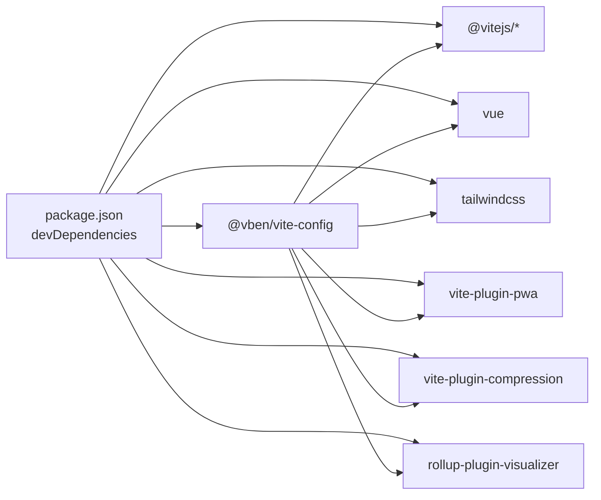

# Vite配置系统

<cite>
**本文引用的文件**
- [internal/vite-config/src/index.ts](file://internal/vite-config/src/index.ts)
- [internal/vite-config/src/config/application.ts](file://internal/vite-config/src/config/application.ts)
- [internal/vite-config/src/config/common.ts](file://internal/vite-config/src/config/common.ts)
- [internal/vite-config/src/config/library.ts](file://internal/vite-config/src/config/library.ts)
- [internal/vite-config/src/plugins/index.ts](file://internal/vite-config/src/plugins/index.ts)
- [internal/vite-config/src/options.ts](file://internal/vite-config/src/options.ts)
- [internal/vite-config/src/utils/env.ts](file://internal/vite-config/src/utils/env.ts)
- [internal/vite-config/src/typing.ts](file://internal/vite-config/src/typing.ts)
- [apps/web-antd/vite.config.ts](file://apps/web-antd/vite.config.ts)
- [playground/vite.config.ts](file://playground/vite.config.ts)
- [package.json](file://package.json)
</cite>

## 目录

1. [简介](#简介)
2. [项目结构](#项目结构)
3. [核心组件](#核心组件)
4. [架构总览](#架构总览)
5. [详细组件分析](#详细组件分析)
6. [依赖关系分析](#依赖关系分析)
7. [性能考量](#性能考量)
8. [故障排除指南](#故障排除指南)
9. [结论](#结论)
10. [附录：配置示例与最佳实践](#附录配置示例与最佳实践)

## 简介

本文件系统性梳理了该仓库中的Vite配置体系，涵盖应用配置、通用配置与库配置三类模式；深入解析开发服务器（含热重载、代理、端口）、构建优化（代码分割、Tree Shaking、压缩策略）、插件系统（内置与自定义）以及环境变量加载与转换机制；并提供可直接落地的最佳实践与故障排除建议。

## 项目结构

该配置系统以“内部包”形式集中管理，核心位于 internal/vite-config，对外通过统一入口导出能力，各应用与库项目按需调用。

图表来源

- [internal/vite-config/src/index.ts:1-6](file://internal/vite-config/src/index.ts#L1-L6)
- [internal/vite-config/src/config/application.ts:1-124](file://internal/vite-config/src/config/application.ts#L1-L124)
- [internal/vite-config/src/config/library.ts:1-60](file://internal/vite-config/src/config/library.ts#L1-L60)
- [internal/vite-config/src/config/common.ts:1-14](file://internal/vite-config/src/config/common.ts#L1-L14)
- [internal/vite-config/src/plugins/index.ts:1-254](file://internal/vite-config/src/plugins/index.ts#L1-L254)
- [internal/vite-config/src/options.ts:1-46](file://internal/vite-config/src/options.ts#L1-L46)
- [internal/vite-config/src/utils/env.ts:1-111](file://internal/vite-config/src/utils/env.ts#L1-L111)
- [internal/vite-config/src/typing.ts:1-352](file://internal/vite-config/src/typing.ts#L1-L352)
- [apps/web-antd/vite.config.ts:1-21](file://apps/web-antd/vite.config.ts#L1-L21)
- [playground/vite.config.ts:1-21](file://playground/vite.config.ts#L1-L21)

章节来源

- [internal/vite-config/src/index.ts:1-6](file://internal/vite-config/src/index.ts#L1-L6)
- [internal/vite-config/src/typing.ts:335-352](file://internal/vite-config/src/typing.ts#L335-L352)
- [package.json:79](file://package.json#L79)

## 核心组件

- 应用配置工厂：封装应用开发与构建的默认行为，自动合并通用配置与用户自定义配置，负责插件装配、CSS预处理、开发服务器与构建输出策略。
- 库配置工厂：面向库项目的构建，自动识别依赖并进行外部化处理，支持DTS生成。
- 通用配置：统一构建警告阈值、Source Map与体积报告策略。
- 插件装配器：按条件动态启用插件，覆盖Vue/Vue JSX、Tailwind、DevTools、PWA、压缩、HTML注入、ImportMap、Nitro Mock、应用加载动画、许可证注入等。
- 默认选项：提供PWA与ImportMap的默认配置。
- 环境变量工具：支持多模式.env文件加载、键前缀过滤与类型转换，输出可直接注入插件的配置项。
- 类型定义：统一约束应用/库配置与插件选项，确保扩展与维护的一致性。

章节来源

- [internal/vite-config/src/config/application.ts:17-99](file://internal/vite-config/src/config/application.ts#L17-L99)
- [internal/vite-config/src/config/library.ts:12-57](file://internal/vite-config/src/config/library.ts#L12-L57)
- [internal/vite-config/src/config/common.ts:3-11](file://internal/vite-config/src/config/common.ts#L3-L11)
- [internal/vite-config/src/plugins/index.ts:94-223](file://internal/vite-config/src/plugins/index.ts#L94-L223)
- [internal/vite-config/src/options.ts:7-46](file://internal/vite-config/src/options.ts#L7-L46)
- [internal/vite-config/src/utils/env.ts:66-108](file://internal/vite-config/src/utils/env.ts#L66-L108)
- [internal/vite-config/src/typing.ts:186-282](file://internal/vite-config/src/typing.ts#L186-L282)

## 架构总览

Vite配置系统采用“工厂+装配器+默认选项+环境变量”的分层架构。应用与库分别由对应工厂生成基础配置，再与用户自定义配置merge，最终形成完整的Vite配置对象。

图表来源

- [internal/vite-config/src/config/application.ts:17-99](file://internal/vite-config/src/config/application.ts#L17-L99)
- [internal/vite-config/src/config/library.ts:12-57](file://internal/vite-config/src/config/library.ts#L12-L57)
- [internal/vite-config/src/utils/env.ts:66-108](file://internal/vite-config/src/utils/env.ts#L66-L108)
- [internal/vite-config/src/plugins/index.ts:94-223](file://internal/vite-config/src/plugins/index.ts#L94-L223)
- [internal/vite-config/src/config/common.ts:3-11](file://internal/vite-config/src/config/common.ts#L3-L11)

## 详细组件分析

### 应用配置工厂（application）

- 功能要点
  - 异步配置工厂，支持用户自定义配置钩子，允许在运行时决定插件与Vite配置。
  - 自动加载并转换环境变量，产出应用标题、基础路径、端口、压缩类型、PWA开关等。
  - 统一装配应用插件集合，覆盖Vue/Vue JSX、Tailwind、DevTools、PWA、压缩、HTML注入、ImportMap、Nitro Mock、应用加载动画、许可证注入等。
  - 构建输出策略：自定义资源命名规则、按命令模式启用压缩参数、目标为较新的ES版本。
  - 开发服务器：host开放访问、端口来自环境变量、预热关键文件提升首开体验。
  - CSS：可注入全局SCSS与Node Package importer，按工作区根路径计算相对路径。
- 关键流程

图表来源

- [internal/vite-config/src/config/application.ts:17-99](file://internal/vite-config/src/config/application.ts#L17-L99)
- [internal/vite-config/src/utils/env.ts:66-108](file://internal/vite-config/src/utils/env.ts#L66-L108)
- [internal/vite-config/src/plugins/index.ts:94-223](file://internal/vite-config/src/plugins/index.ts#L94-L223)
- [internal/vite-config/src/config/common.ts:3-11](file://internal/vite-config/src/config/common.ts#L3-L11)

章节来源

- [internal/vite-config/src/config/application.ts:17-99](file://internal/vite-config/src/config/application.ts#L17-L99)
- [internal/vite-config/src/config/application.ts:101-121](file://internal/vite-config/src/config/application.ts#L101-L121)

### 库配置工厂（library）

- 功能要点
  - 读取包依赖与peer依赖，自动将外部依赖标记为external，避免打包进库产物。
  - 默认库入口、文件名与格式，支持构建可视化与外部化策略。
  - 与通用配置merge，确保一致的构建体验。
- 关键流程

图表来源

- [internal/vite-config/src/config/library.ts:12-57](file://internal/vite-config/src/config/library.ts#L12-L57)

章节来源

- [internal/vite-config/src/config/library.ts:12-57](file://internal/vite-config/src/config/library.ts#L12-L57)

### 通用配置（common）

- 功能要点
  - 统一chunk大小告警阈值、关闭压缩体积报告、关闭Source Map，平衡开发体验与产物体积。
- 适用场景
  - 作为应用与库配置的公共基线，避免重复配置。

章节来源

- [internal/vite-config/src/config/common.ts:3-11](file://internal/vite-config/src/config/common.ts#L3-L11)

### 插件装配器（plugins）

- 功能要点
  - 条件插件：通过condition字段按构建/开发模式、开关参数动态启用。
  - 通用插件：Vue/Vue JSX、Tailwind引用检测、Tailwind CSS、可选的Vue DevTools。
  - 应用插件：i18n、打印信息、VXE Table懒加载、Nitro Mock、应用加载动画、许可证、PWA、压缩、HTML最小化、ImportMap、归档。
  - 库插件：DTS生成（可选）。
- 关键流程

图表来源

- [internal/vite-config/src/plugins/index.ts:94-223](file://internal/vite-config/src/plugins/index.ts#L94-L223)
- [internal/vite-config/src/plugins/index.ts:228-242](file://internal/vite-config/src/plugins/index.ts#L228-L242)

章节来源

- [internal/vite-config/src/plugins/index.ts:36-89](file://internal/vite-config/src/plugins/index.ts#L36-L89)
- [internal/vite-config/src/plugins/index.ts:94-223](file://internal/vite-config/src/plugins/index.ts#L94-L223)
- [internal/vite-config/src/plugins/index.ts:228-242](file://internal/vite-config/src/plugins/index.ts#L228-L242)

### 默认选项（options）

- 功能要点
  - PWA默认清单：图标、名称、short_name等，区分开发/生产模式。
  - ImportMap默认CDN提供商与常用包映射，便于按需启用CDN加速。
- 适用场景
  - 作为插件装配器的默认参数，简化配置复杂度。

章节来源

- [internal/vite-config/src/options.ts:7-46](file://internal/vite-config/src/options.ts#L7-L46)

### 环境变量加载与转换（env）

- 功能要点
  - 多模式.env文件扫描顺序：.env、.env.local、.env.{mode}、.env.{mode}.local。
  - 支持指定前缀过滤（默认VITE*GLOB*\*），并可切换为VITE\_前缀。
  - 提供布尔/字符串/数字转换，输出标准化配置片段，供应用配置工厂消费。
- 关键流程

图表来源

- [internal/vite-config/src/utils/env.ts:21-64](file://internal/vite-config/src/utils/env.ts#L21-L64)
- [internal/vite-config/src/utils/env.ts:66-108](file://internal/vite-config/src/utils/env.ts#L66-L108)

章节来源

- [internal/vite-config/src/utils/env.ts:21-64](file://internal/vite-config/src/utils/env.ts#L21-L64)
- [internal/vite-config/src/utils/env.ts:66-108](file://internal/vite-config/src/utils/env.ts#L66-L108)

### 类型定义（typing）

- 功能要点
  - 统一约束应用/库插件选项、条件插件、ImportMap、打印、Nitro Mock、归档等配置接口。
  - 定义配置工厂的输入输出类型，确保扩展点清晰、可维护。
- 适用场景
  - 为自定义插件与用户配置提供强类型保障。

章节来源

- [internal/vite-config/src/typing.ts:186-282](file://internal/vite-config/src/typing.ts#L186-L282)
- [internal/vite-config/src/typing.ts:311-333](file://internal/vite-config/src/typing.ts#L311-L333)

### 实际使用示例（应用项目）

- 应用项目通过统一入口调用配置工厂，并在vite.server.proxy中定义API代理规则，支持WebSocket与路径重写。
- 示例路径
  - [apps/web-antd/vite.config.ts:1-21](file://apps/web-antd/vite.config.ts#L1-L21)
  - [playground/vite.config.ts:1-21](file://playground/vite.config.ts#L1-L21)

章节来源

- [apps/web-antd/vite.config.ts:3-20](file://apps/web-antd/vite.config.ts#L3-L20)
- [playground/vite.config.ts:3-20](file://playground/vite.config.ts#L3-L20)

## 依赖关系分析

- 内部包依赖
  - @vben/vite-config 作为统一入口，被各应用与库项目依赖。
  - node工具与dotenv用于环境变量解析。
  - 多种Vite生态插件用于构建期增强。
- 外部依赖
  - Vite、Vue/Vue JSX、Tailwind、PWA、压缩、可视化等。

图表来源

- [package.json:79-99](file://package.json#L79-L99)

章节来源

- [package.json:79-99](file://package.json#L79-L99)

## 性能考量

- 代码分割与Tree Shaking
  - 通过Rollup外部化策略与库配置的external机制，减少重复打包与冗余依赖。
  - 在应用配置中按命令模式启用压缩参数，有助于进一步减小产物体积。
- 构建速度
  - 开发服务器预热关键文件，缩短首次启动时间。
  - 可选依赖分析插件用于定位大体积依赖，指导拆分与替换。
- 资源命名
  - 自定义资源/入口/块命名规则，有利于缓存与CDN分发策略。
- CSS优化
  - 注入全局SCSS与Node Package importer，减少重复导入成本。

章节来源

- [internal/vite-config/src/config/application.ts:60-76](file://internal/vite-config/src/config/application.ts#L60-L76)
- [internal/vite-config/src/config/application.ts:82-89](file://internal/vite-config/src/config/application.ts#L82-L89)
- [internal/vite-config/src/plugins/index.ts:79-87](file://internal/vite-config/src/plugins/index.ts#L79-L87)
- [internal/vite-config/src/config/library.ts:43-49](file://internal/vite-config/src/config/library.ts#L43-L49)

## 故障排除指南

- 环境变量未生效
  - 检查.env文件命名与模式是否匹配，确认前缀过滤是否符合预期。
  - 章节来源
    - [internal/vite-config/src/utils/env.ts:21-64](file://internal/vite-config/src/utils/env.ts#L21-L64)
- 端口冲突或无法访问
  - 确认VITE_PORT是否正确设置，开发服务器host已设为开放访问。
  - 章节来源
    - [internal/vite-config/src/config/application.ts:79-81](file://internal/vite-config/src/config/application.ts#L79-L81)
- 代理不生效
  - 核对代理target、rewrite规则与ws开关，确保与后端服务一致。
  - 章节来源
    - [apps/web-antd/vite.config.ts:7-17](file://apps/web-antd/vite.config.ts#L7-L17)
- PWA/ImportMap/压缩未启用
  - 检查对应开关与类型配置，确认条件满足且未被用户配置覆盖。
  - 章节来源
    - [internal/vite-config/src/plugins/index.ts:167-182](file://internal/vite-config/src/plugins/index.ts#L167-L182)
    - [internal/vite-config/src/plugins/index.ts:205-209](file://internal/vite-config/src/plugins/index.ts#L205-L209)
    - [internal/vite-config/src/plugins/index.ts:184-199](file://internal/vite-config/src/plugins/index.ts#L184-L199)
- 构建体积过大
  - 使用依赖分析插件定位大体积依赖，结合external与CDN策略优化。
  - 章节来源
    - [internal/vite-config/src/plugins/index.ts:79-87](file://internal/vite-config/src/plugins/index.ts#L79-L87)
    - [internal/vite-config/src/config/library.ts:43-49](file://internal/vite-config/src/config/library.ts#L43-L49)

## 结论

该Vite配置系统通过“工厂+装配器+默认选项+环境变量”的分层设计，实现了应用与库两类场景的高效复用与扩展。配合完善的插件体系与构建优化策略，能够在开发体验与产物质量之间取得良好平衡。建议在团队内统一约定环境变量前缀与插件开关，以降低维护成本并提升一致性。

## 附录：配置示例与最佳实践

- 开发服务器与代理
  - 在应用项目中通过vite.server.proxy定义API代理，支持WebSocket与路径重写。
  - 参考路径
    - [apps/web-antd/vite.config.ts:7-17](file://apps/web-antd/vite.config.ts#L7-L17)
    - [playground/vite.config.ts:7-17](file://playground/vite.config.ts#L7-L17)
- 环境变量与开关
  - 使用VITE\_\*前缀的.env文件控制应用标题、基础路径、端口、压缩类型、PWA开关等。
  - 参考路径
    - [internal/vite-config/src/utils/env.ts:66-108](file://internal/vite-config/src/utils/env.ts#L66-L108)
- 插件启用策略
  - 按需启用i18n、Nitro Mock、PWA、ImportMap、压缩与HTML最小化等插件。
  - 参考路径
    - [internal/vite-config/src/plugins/index.ts:94-223](file://internal/vite-config/src/plugins/index.ts#L94-L223)
- 构建优化
  - 合理设置chunkSizeWarningLimit、关闭不必要的Source Map与体积报告，启用按需压缩与依赖分析。
  - 参考路径
    - [internal/vite-config/src/config/common.ts:5-10](file://internal/vite-config/src/config/common.ts#L5-L10)
    - [internal/vite-config/src/plugins/index.ts:184-199](file://internal/vite-config/src/plugins/index.ts#L184-L199)
    - [internal/vite-config/src/plugins/index.ts:79-87](file://internal/vite-config/src/plugins/index.ts#L79-L87)
