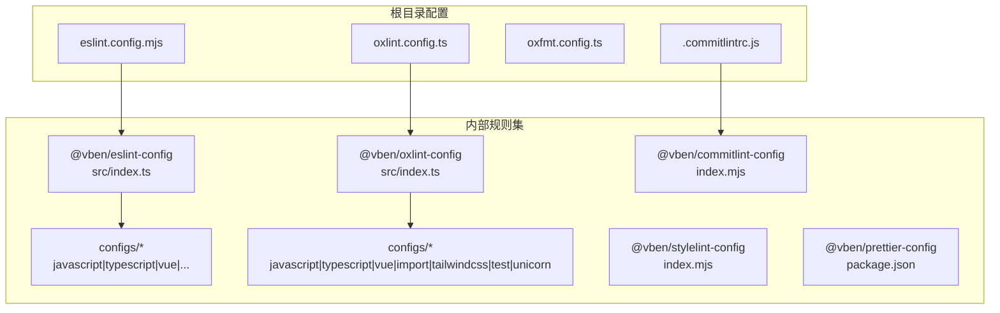
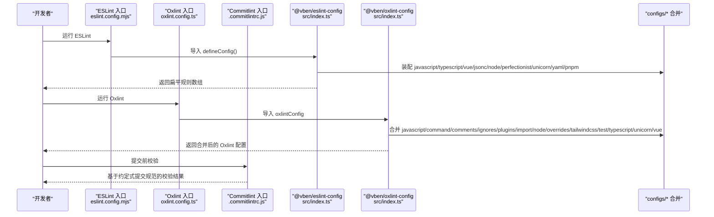
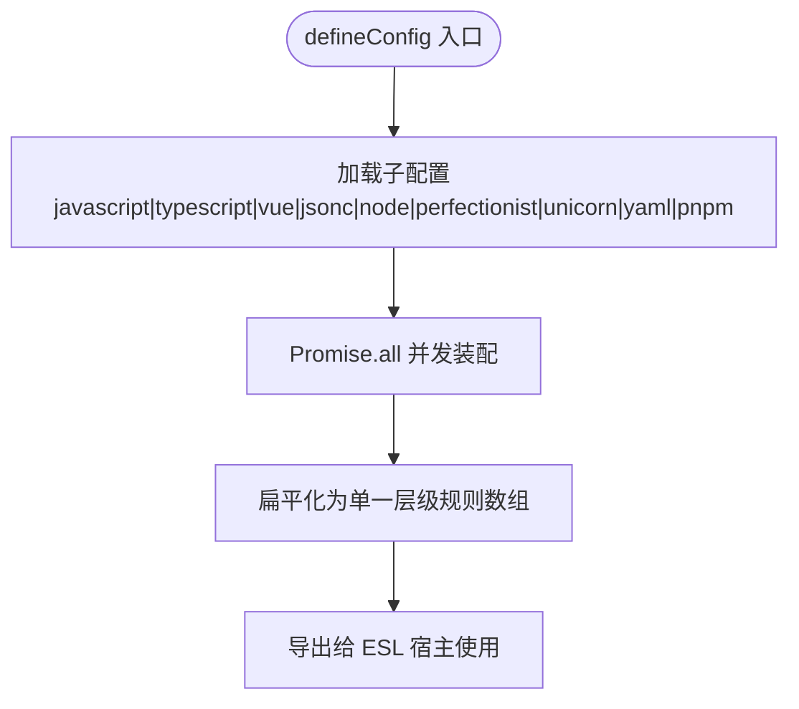
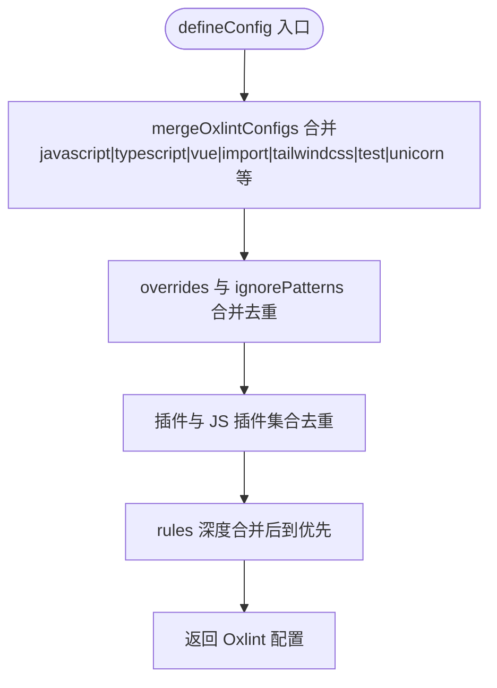
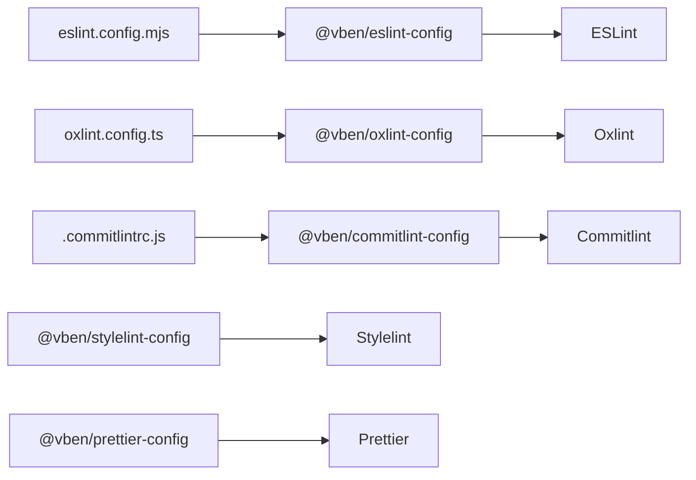

# 代码规范与Lint规则

<cite>
**本文引用的文件**
- [eslint.config.mjs](file://eslint.config.mjs)
- [oxlint.config.ts](file://oxlint.config.ts)
- [oxfmt.config.ts](file://oxfmt.config.ts)
- [.commitlintrc.js](file://.commitlintrc.js)
- [internal/lint-configs/eslint-config/src/index.ts](file://internal/lint-configs/eslint-config/src/index.ts)
- [internal/lint-configs/eslint-config/src/configs/index.ts](file://internal/lint-configs/eslint-config/src/configs/index.ts)
- [internal/lint-configs/oxlint-config/src/index.ts](file://internal/lint-configs/oxlint-config/src/index.ts)
- [internal/lint-configs/oxlint-config/src/configs/index.ts](file://internal/lint-configs/oxlint-config/src/configs/index.ts)
- [internal/lint-configs/oxlint-config/src/configs/javascript.ts](file://internal/lint-configs/oxlint-config/src/configs/javascript.ts)
- [internal/lint-configs/oxlint-config/src/configs/typescript.ts](file://internal/lint-configs/oxlint-config/src/configs/typescript.ts)
- [internal/lint-configs/oxlint-config/src/configs/vue.ts](file://internal/lint-configs/oxlint-config/src/configs/vue.ts)
- [internal/lint-configs/oxlint-config/src/configs/unicorn.ts](file://internal/lint-configs/oxlint-config/src/configs/unicorn.ts)
- [internal/lint-configs/oxlint-config/src/configs/import.ts](file://internal/lint-configs/oxlint-config/src/configs/import.ts)
- [internal/lint-configs/oxlint-config/src/configs/tailwindcss.ts](file://internal/lint-configs/oxlint-config/src/configs/tailwindcss.ts)
- [internal/lint-configs/oxlint-config/src/configs/test.ts](file://internal/lint-configs/oxlint-config/src/configs/test.ts)
- [internal/lint-configs/commitlint-config/index.mjs](file://internal/lint-configs/commitlint-config/index.mjs)
- [internal/lint-configs/commitlint-config/package.json](file://internal/lint-configs/commitlint-config/package.json)
- [internal/lint-configs/stylelint-config/index.mjs](file://internal/lint-configs/stylelint-config/index.mjs)
- [internal/lint-configs/stylelint-config/package.json](file://internal/lint-configs/stylelint-config/package.json)
- [internal/lint-configs/prettier-config/package.json](file://internal/lint-configs/prettier-config/package.json)
- [scripts/vsh/src/lint/index.ts](file://scripts/vsh/src/lint/index.ts)
- [scripts/vsh/src/index.ts](file://scripts/vsh/src/index.ts)
- [package.json](file://package.json)
</cite>

## 目录

1. [简介](#简介)
2. [项目结构](#项目结构)
3. [核心组件](#核心组件)
4. [架构总览](#架构总览)
5. [详细组件分析](#详细组件分析)
6. [依赖关系分析](#依赖关系分析)
7. [性能考量](#性能考量)
8. [故障排查指南](#故障排查指南)
9. [结论](#结论)
10. [附录](#附录)

## 简介

本文件系统性梳理本仓库的代码规范与Lint体系，覆盖以下方面：

- ESLint配置系统：统一入口与分语言/框架规则聚合
- Oxlint配置系统：Rust实现的高性能静态分析器，含命令行参数与规则集
- Commitlint提交信息规范：基于内部包的约定式提交校验
- Prettier格式化与Stylelint样式检查：格式化与样式规则的协同策略
- 自定义规则开发与维护：如何扩展与演进规则集
- 团队协作最佳实践：规则冲突解决与配置优化
- 实际配置示例与常见问题解决方案

## 项目结构

围绕代码规范与Lint的关键文件分布如下：

- ESLint统一入口：根目录配置文件指向内部可复用配置包
- Oxlint统一入口：根目录配置文件指向内部可复用配置包
- Commitlint：根目录配置文件指向内部可复用配置包
- Stylelint与Prettier：通过内部包提供默认配置
- 规则集聚合：内部lint-configs包按功能拆分并合并输出

图表来源

- [eslint.config.mjs:1-4](file://eslint.config.mjs#L1-L4)
- [oxlint.config.ts:1-6](file://oxlint.config.ts#L1-L6)
- [oxfmt.config.ts:1-27](file://oxfmt.config.ts#L1-L27)
- [.commitlintrc.js:1-2](file://.commitlintrc.js#L1-L2)
- [internal/lint-configs/eslint-config/src/index.ts:1-47](file://internal/lint-configs/eslint-config/src/index.ts#L1-L47)
- [internal/lint-configs/oxlint-config/src/index.ts:1-22](file://internal/lint-configs/oxlint-config/src/index.ts#L1-L22)
- [internal/lint-configs/commitlint-config/index.mjs:1-200](file://internal/lint-configs/commitlint-config/index.mjs#L1-L200)

章节来源

- [eslint.config.mjs:1-4](file://eslint.config.mjs#L1-L4)
- [oxlint.config.ts:1-6](file://oxlint.config.ts#L1-L6)
- [oxfmt.config.ts:1-27](file://oxfmt.config.ts#L1-L27)
- [.commitlintrc.js:1-2](file://.commitlintrc.js#L1-L2)
- [internal/lint-configs/eslint-config/src/index.ts:1-47](file://internal/lint-configs/eslint-config/src/index.ts#L1-L47)
- [internal/lint-configs/oxlint-config/src/index.ts:1-22](file://internal/lint-configs/oxlint-config/src/index.ts#L1-L22)

## 核心组件

- ESLint统一入口：通过根目录配置导入内部包，导出扁平化的规则数组
- Oxlint统一入口：通过根目录配置导入内部包，合并多模块规则后导出
- Commitlint统一入口：通过根目录配置导入内部包，确保提交信息符合约定式规范
- Stylelint与Prettier：通过内部包提供默认配置，避免重复维护
- 规则集聚合：内部包按功能拆分（javascript、typescript、vue、import、tailwindcss、test、unicorn等），在入口处统一合并

章节来源

- [internal/lint-configs/eslint-config/src/index.ts:25-44](file://internal/lint-configs/eslint-config/src/index.ts#L25-L44)
- [internal/lint-configs/oxlint-config/src/index.ts:11-17](file://internal/lint-configs/oxlint-config/src/index.ts#L11-L17)
- [internal/lint-configs/oxlint-config/src/configs/index.ts:62-78](file://internal/lint-configs/oxlint-config/src/configs/index.ts#L62-L78)

## 架构总览

下图展示从根配置到具体规则集的装配流程，以及各工具的职责边界。

图表来源

- [eslint.config.mjs:1-4](file://eslint.config.mjs#L1-L4)
- [oxlint.config.ts:1-6](file://oxlint.config.ts#L1-L6)
- [.commitlintrc.js:1-2](file://.commitlintrc.js#L1-L2)
- [internal/lint-configs/eslint-config/src/index.ts:25-44](file://internal/lint-configs/eslint-config/src/index.ts#L25-L44)
- [internal/lint-configs/oxlint-config/src/index.ts:11-17](file://internal/lint-configs/oxlint-config/src/index.ts#L11-L17)
- [internal/lint-configs/oxlint-config/src/configs/index.ts:62-78](file://internal/lint-configs/oxlint-config/src/configs/index.ts#L62-L78)

## 详细组件分析

### ESLint 配置系统

- 统一入口：根目录配置仅一行导入与导出，保证全局一致性
- 规则装配：内部包按功能拆分为多个子配置，最终在入口处合并为扁平数组
- 支持范围：javascript、typescript、vue、jsonc、node、perfectionist、unicorn、yaml、pnpm 等
- 扩展点：支持传入额外配置作为扩展

图表来源

- [internal/lint-configs/eslint-config/src/index.ts:25-44](file://internal/lint-configs/eslint-config/src/index.ts#L25-L44)

章节来源

- [eslint.config.mjs:1-4](file://eslint.config.mjs#L1-L4)
- [internal/lint-configs/eslint-config/src/index.ts:1-47](file://internal/lint-configs/eslint-config/src/index.ts#L1-L47)
- [internal/lint-configs/eslint-config/src/configs/index.ts:1-11](file://internal/lint-configs/eslint-config/src/configs/index.ts#L1-L11)

### Oxlint 配置系统

- 统一入口：根目录配置导入内部包并以 defineConfig 包装
- 规则合并：内部包将多模块规则（javascript、typescript、vue、import、tailwindcss、test、unicorn 等）进行深度合并
- 可扩展：支持通过 extends 参数叠加或覆盖规则
- 性能：基于 Rust 的 Oxlint 在大型仓库中具备更快的诊断速度

图表来源

- [internal/lint-configs/oxlint-config/src/index.ts:11-17](file://internal/lint-configs/oxlint-config/src/index.ts#L11-L17)
- [internal/lint-configs/oxlint-config/src/configs/index.ts:19-60](file://internal/lint-configs/oxlint-config/src/configs/index.ts#L19-L60)

章节来源

- [oxlint.config.ts:1-6](file://oxlint.config.ts#L1-L6)
- [internal/lint-configs/oxlint-config/src/index.ts:1-22](file://internal/lint-configs/oxlint-config/src/index.ts#L1-L22)
- [internal/lint-configs/oxlint-config/src/configs/index.ts:1-97](file://internal/lint-configs/oxlint-config/src/configs/index.ts#L1-L97)

### JavaScript 规则要点（Oxlint）

- 分类与环境：启用 correctness 与 suspicious 分类；设置浏览器、es2021、node 环境
- 全局变量：限定 document、navigator、window 为只读
- 关键规则示例：eqeqeq、no-console、no-debugger、no-unused-expressions、prefer-const、prefer-template 等
- 与 ESLint 差异：部分规则在 Oxlint 中以不同名称呈现（如 eslint/no-unused-vars 对应 oxlint 规则）

章节来源

- [internal/lint-configs/oxlint-config/src/configs/javascript.ts:1-157](file://internal/lint-configs/oxlint-config/src/configs/javascript.ts#L1-L157)

### TypeScript 规则要点（Oxlint）

- 保守策略：当前仅启用少量类型感知规则，其余规则暂时关闭，避免大规模清理成本
- 关键规则示例：ban-ts-comment、no-var-requires、triple-slash-reference、no-non-null-assertion 等

章节来源

- [internal/lint-configs/oxlint-config/src/configs/typescript.ts:1-29](file://internal/lint-configs/oxlint-config/src/configs/typescript.ts#L1-L29)

### Vue 规则要点（Oxlint）

- 规则示例：prefer-import-from-vue，鼓励从 vue 导入 API

章节来源

- [internal/lint-configs/oxlint-config/src/configs/vue.ts:1-10](file://internal/lint-configs/oxlint-config/src/configs/vue.ts#L1-L10)

### Import 规则要点（Oxlint）

- 规则示例：import/consistent-type-specifier-style、import/first、import/no-duplicates、import/no-named-default、import/no-self-import、import/no-webpack-loader-syntax

章节来源

- [internal/lint-configs/oxlint-config/src/configs/import.ts:1-19](file://internal/lint-configs/oxlint-config/src/configs/import.ts#L1-L19)

### TailwindCSS 规则要点（Oxlint）

- 插件：集成 eslint-plugin-better-tailwindcss，启用推荐规则
- 设置：指定入口文件与自定义选择器，忽略生成目录
- 关键规则：类名顺序一致性、禁用未知类名（可与 Prettier 协同）

章节来源

- [internal/lint-configs/oxlint-config/src/configs/tailwindcss.ts:1-51](file://internal/lint-configs/oxlint-config/src/configs/tailwindcss.ts#L1-L51)

### 测试框架规则要点（Oxlint）

- Vitest：关注测试命名、聚焦测试、标题大小写、钩子顺序等
- Jest：保留部分规则开关，避免与 Vitest 冲突

章节来源

- [internal/lint-configs/oxlint-config/src/configs/test.ts:1-24](file://internal/lint-configs/oxlint-config/src/configs/test.ts#L1-L24)

### Commitlint 提交信息规范

- 入口：根目录配置文件导入内部包
- 内容：遵循约定式提交规范，确保提交信息可解析、可自动化发布

章节来源

- [.commitlintrc.js:1-2](file://.commitlintrc.js#L1-L2)
- [internal/lint-configs/commitlint-config/index.mjs:1-200](file://internal/lint-configs/commitlint-config/index.mjs#L1-L200)

### Prettier 与 Stylelint

- Prettier：通过内部包提供默认配置，统一格式化风格
- Stylelint：通过内部包提供默认配置，统一样式检查策略

章节来源

- [internal/lint-configs/prettier-config/package.json:1-200](file://internal/lint-configs/prettier-config/package.json#L1-L200)
- [internal/lint-configs/stylelint-config/index.mjs:1-200](file://internal/lint-configs/stylelint-config/index.mjs#L1-L200)
- [internal/lint-configs/stylelint-config/package.json:1-200](file://internal/lint-configs/stylelint-config/package.json#L1-L200)

### 自定义规则开发与维护

- 开发路径：在内部包的 configs 目录新增或修改规则模块，保持单一职责
- 合并策略：通过入口 index.ts 的合并函数统一装配，避免分散配置
- 版本演进：建议以“先关闭、后开启”的渐进方式引入高成本规则，降低迁移成本

章节来源

- [internal/lint-configs/eslint-config/src/configs/index.ts:1-11](file://internal/lint-configs/eslint-config/src/configs/index.ts#L1-L11)
- [internal/lint-configs/oxlint-config/src/configs/index.ts:62-78](file://internal/lint-configs/oxlint-config/src/configs/index.ts#L62-L78)

## 依赖关系分析

- 工具链依赖：ESLint、Oxlint、Commitlint、Prettier、Stylelint
- 内部包依赖：@vben/eslint-config、@vben/oxlint-config、@vben/commitlint-config、@vben/stylelint-config、@vben/prettier-config
- 脚本依赖：vsh 提供 lint 子命令，便于统一执行

图表来源

- [eslint.config.mjs:1-4](file://eslint.config.mjs#L1-L4)
- [oxlint.config.ts:1-6](file://oxlint.config.ts#L1-L6)
- [.commitlintrc.js:1-2](file://.commitlintrc.js#L1-L2)
- [internal/lint-configs/eslint-config/src/index.ts:1-47](file://internal/lint-configs/eslint-config/src/index.ts#L1-L47)
- [internal/lint-configs/oxlint-config/src/index.ts:1-22](file://internal/lint-configs/oxlint-config/src/index.ts#L1-L22)
- [internal/lint-configs/commitlint-config/package.json:1-200](file://internal/lint-configs/commitlint-config/package.json#L1-L200)
- [internal/lint-configs/stylelint-config/package.json:1-200](file://internal/lint-configs/stylelint-config/package.json#L1-L200)
- [internal/lint-configs/prettier-config/package.json:1-200](file://internal/lint-configs/prettier-config/package.json#L1-L200)

章节来源

- [package.json:1-400](file://package.json#L1-L400)
- [scripts/vsh/src/lint/index.ts:1-200](file://scripts/vsh/src/lint/index.ts#L1-L200)
- [scripts/vsh/src/index.ts:1-200](file://scripts/vsh/src/index.ts#L1-L200)

## 性能考量

- Oxlint 优势：基于 Rust 实现，诊断速度快，适合大型仓库与CI场景
- 并发装配：ESLint 内部包使用 Promise.all 并发加载子配置，提升启动效率
- 规则合并：Oxlint 采用去重与深度合并策略，减少冗余与冲突带来的开销

章节来源

- [internal/lint-configs/eslint-config/src/index.ts:41-41](file://internal/lint-configs/eslint-config/src/index.ts#L41-L41)
- [internal/lint-configs/oxlint-config/src/configs/index.ts:39-48](file://internal/lint-configs/oxlint-config/src/configs/index.ts#L39-L48)

## 故障排查指南

- ESLint 规则未生效
  - 检查根配置是否正确导入内部包
  - 确认内部包的 defineConfig 是否被调用
  - 参考：[eslint.config.mjs:1-4](file://eslint.config.mjs#L1-L4)，[internal/lint-configs/eslint-config/src/index.ts:25-44](file://internal/lint-configs/eslint-config/src/index.ts#L25-L44)
- Oxlint 规则冲突
  - 使用 extends 参数叠加配置，后到规则优先
  - 检查 mergeOxlintConfigs 的合并逻辑
  - 参考：[oxlint.config.ts:1-6](file://oxlint.config.ts#L1-L6)，[internal/lint-configs/oxlint-config/src/index.ts:11-17](file://internal/lint-configs/oxlint-config/src/index.ts#L11-L17)，[internal/lint-configs/oxlint-config/src/configs/index.ts:19-60](file://internal/lint-configs/oxlint-config/src/configs/index.ts#L19-L60)
- 提交信息不合规
  - 确认根目录配置导入了内部包
  - 参考：[.commitlintrc.js:1-2](file://.commitlintrc.js#L1-L2)，[internal/lint-configs/commitlint-config/index.mjs:1-200](file://internal/lint-configs/commitlint-config/index.mjs#L1-L200)
- 样式检查与格式化冲突
  - TailwindCSS 规则与 Prettier 的换行策略存在潜在冲突，已通过关闭特定规则避免“乒乓”问题
  - 参考：[internal/lint-configs/oxlint-config/src/configs/tailwindcss.ts:40-43](file://internal/lint-configs/oxlint-config/src/configs/tailwindcss.ts#L40-L43)
- 忽略模式不生效
  - 检查 oxfmt 的 ignorePatterns 是否覆盖目标文件
  - 参考：[oxfmt.config.ts:3-26](file://oxfmt.config.ts#L3-L26)

## 结论

本仓库通过内部包统一管理各类Lint规则，实现跨语言、跨框架的一致性与可维护性。ESLint与Oxlint分别承担语义分析与高性能诊断，配合Commitlint、Prettier与Stylelint形成完整的质量保障闭环。建议团队遵循“渐进引入、最小化冲突、统一入口”的原则持续演进规则集。

## 附录

- 实际配置示例（路径）
  - ESLint 入口：[eslint.config.mjs:1-4](file://eslint.config.mjs#L1-L4)
  - Oxlint 入口：[oxlint.config.ts:1-6](file://oxlint.config.ts#L1-L6)
  - Oxfmt 忽略模式：[oxfmt.config.ts:3-26](file://oxfmt.config.ts#L3-L26)
  - Commitlint 入口：[.commitlintrc.js:1-2](file://.commitlintrc.js#L1-L2)
- 规则集参考（路径）
  - ESLint 规则装配：[internal/lint-configs/eslint-config/src/index.ts:25-44](file://internal/lint-configs/eslint-config/src/index.ts#L25-L44)
  - Oxlint 规则装配：[internal/lint-configs/oxlint-config/src/configs/index.ts:62-78](file://internal/lint-configs/oxlint-config/src/configs/index.ts#L62-L78)
  - JavaScript 规则：[internal/lint-configs/oxlint-config/src/configs/javascript.ts:1-157](file://internal/lint-configs/oxlint-config/src/configs/javascript.ts#L1-L157)
  - TypeScript 规则：[internal/lint-configs/oxlint-config/src/configs/typescript.ts:1-29](file://internal/lint-configs/oxlint-config/src/configs/typescript.ts#L1-L29)
  - Vue 规则：[internal/lint-configs/oxlint-config/src/configs/vue.ts:1-10](file://internal/lint-configs/oxlint-config/src/configs/vue.ts#L1-L10)
  - Import 规则：[internal/lint-configs/oxlint-config/src/configs/import.ts:1-19](file://internal/lint-configs/oxlint-config/src/configs/import.ts#L1-L19)
  - TailwindCSS 规则：[internal/lint-configs/oxlint-config/src/configs/tailwindcss.ts:1-51](file://internal/lint-configs/oxlint-config/src/configs/tailwindcss.ts#L1-L51)
  - 测试规则：[internal/lint-configs/oxlint-config/src/configs/test.ts:1-24](file://internal/lint-configs/oxlint-config/src/configs/test.ts#L1-L24)
- 脚本入口（路径）
  - vsh lint 子命令：[scripts/vsh/src/lint/index.ts:1-200](file://scripts/vsh/src/lint/index.ts#L1-L200)
  - vsh 主入口：[scripts/vsh/src/index.ts:1-200](file://scripts/vsh/src/index.ts#L1-L200)
