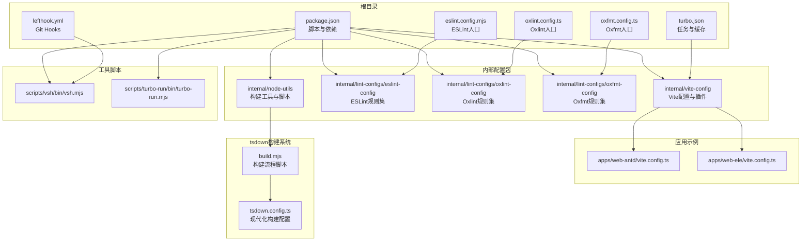
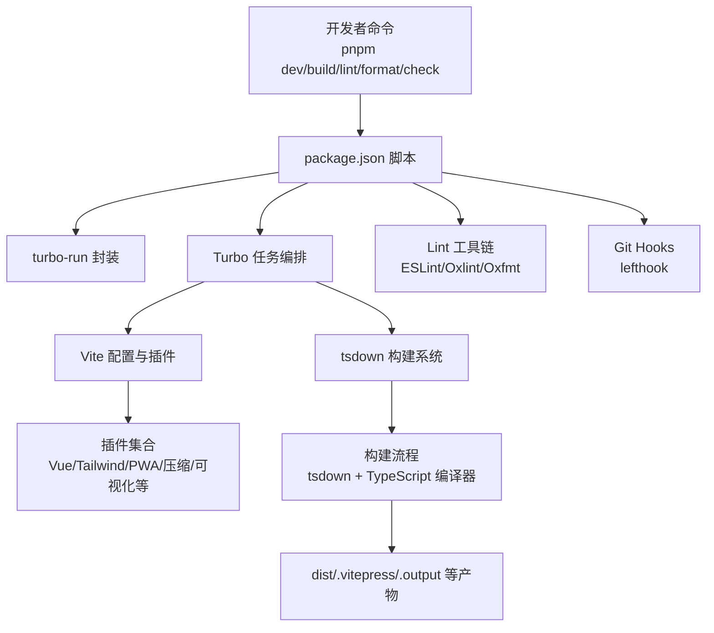
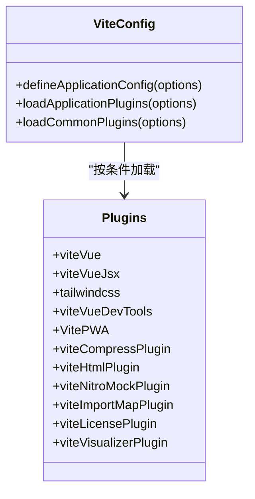
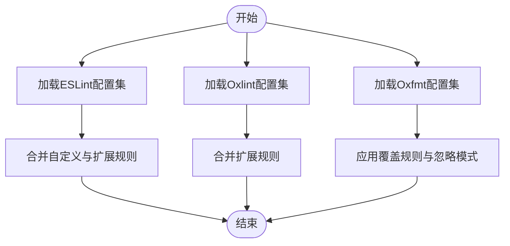
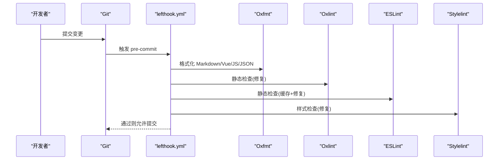
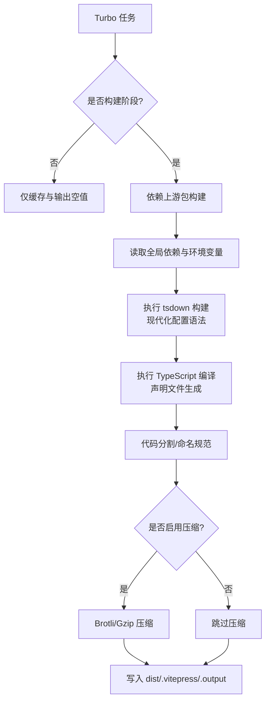
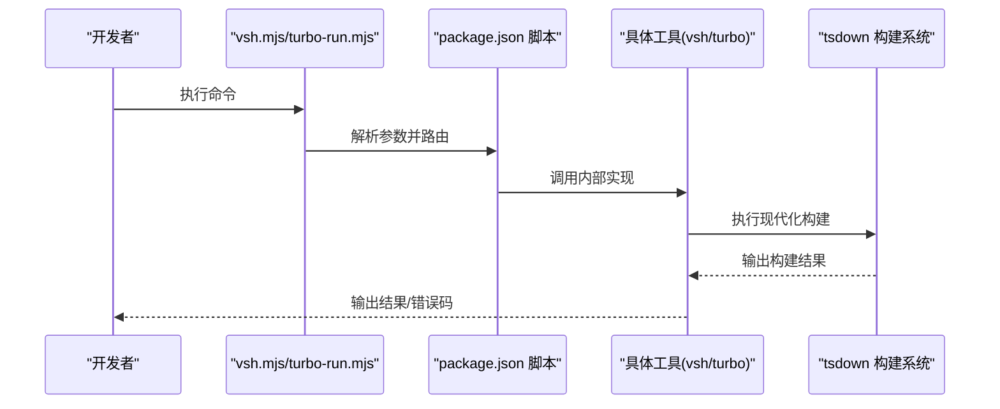
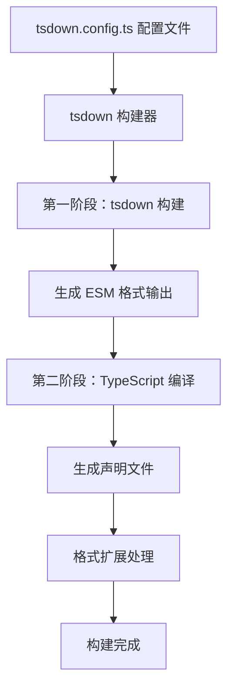
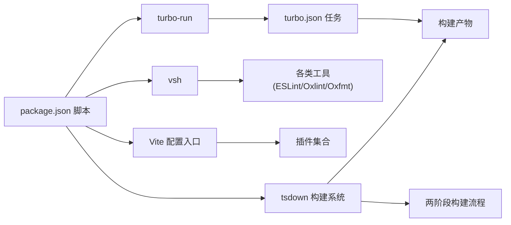

# 开发工具链

<cite>
**本文引用的文件**
- [package.json](file://package.json)
- [turbo.json](file://turbo.json)
- [eslint.config.mjs](file://eslint.config.mjs)
- [oxlint.config.ts](file://oxlint.config.ts)
- [oxfmt.config.ts](file://oxfmt.config.ts)
- [lefthook.yml](file://lefthook.yml)
- [internal/vite-config/src/index.ts](file://internal/vite-config/src/index.ts)
- [internal/vite-config/src/config/application.ts](file://internal/vite-config/src/config/application.ts)
- [internal/vite-config/src/plugins/index.ts](file://internal/vite-config/src/plugins/index.ts)
- [internal/lint-configs/eslint-config/src/index.ts](file://internal/lint-configs/eslint-config/src/index.ts)
- [internal/lint-configs/oxlint-config/src/index.ts](file://internal/lint-configs/oxlint-config/src/index.ts)
- [internal/lint-configs/oxfmt-config/src/index.ts](file://internal/lint-configs/oxfmt-config/src/index.ts)
- [scripts/vsh/bin/vsh.mjs](file://scripts/vsh/bin/vsh.mjs)
- [scripts/turbo-run/bin/turbo-run.mjs](file://scripts/turbo-run/bin/turbo-run.mjs)
- [apps/web-antd/vite.config.ts](file://apps/web-antd/vite.config.ts)
- [apps/web-ele/vite.config.ts](file://apps/web-ele/vite.config.ts)
- [internal/node-utils/scripts/build.mjs](file://internal/node-utils/scripts/build.mjs)
- [internal/node-utils/tsdown.config.ts](file://internal/node-utils/tsdown.config.ts)
- [internal/vite-config/tsdown.config.ts](file://internal/vite-config/tsdown.config.ts)
- [internal/lint-configs/eslint-config/tsdown.config.ts](file://internal/lint-configs/eslint-config/tsdown.config.ts)
- [internal/lint-configs/oxlint-config/tsdown.config.ts](file://internal/lint-configs/oxlint-config/tsdown.config.ts)
- [internal/lint-configs/oxfmt-config/tsdown.config.ts](file://internal/lint-configs/oxfmt-config/tsdown.config.ts)
- [scripts/vsh/tsdown.config.ts](file://scripts/vsh/tsdown.config.ts)
- [scripts/turbo-run/tsdown.config.ts](file://scripts/turbo-run/tsdown.config.ts)
- [packages/@core/ui-kit/form-ui/tsdown.config.ts](file://packages/@core/ui-kit/form-ui/tsdown.config.ts)
- [packages/@core/base/icons/tsdown.config.ts](file://packages/@core/base/icons/tsdown.config.ts)
</cite>

## 更新摘要

**所做更改**

- 新增 tsdown 现代化构建系统章节，详细介绍 tsdown.config.ts 配置文件
- 更新构建优化策略，增加 tsdown 构建流程说明
- 新增 internal/node-utils/scripts/build.mjs 构建脚本分析
- 更新架构总览，反映 tsdown 构建系统的集成
- 新增 tsdown 配置最佳实践和迁移指南

## 目录

1. [简介](#简介)
2. [项目结构](#项目结构)
3. [核心组件](#核心组件)
4. [架构总览](#架构总览)
5. [详细组件分析](#详细组件分析)
6. [依赖关系分析](#依赖关系分析)
7. [性能考量](#性能考量)
8. [故障排查指南](#故障排查指南)
9. [结论](#结论)
10. [附录](#附录)

## 简介

本文件面向Vben Admin的开发工具链，系统性梳理Vite配置体系（开发服务器、构建优化、插件生态）、多维Lint规则（ESLint、Oxlint、Prettier风格）、Git Hooks与自动化流程（提交前检查、格式化与质量保障）、构建优化策略（Turbo多包构建、代码分割与性能优化）、以及开发脚本与工具（部署脚本、构建脚本、辅助工具）。文档以仓库内现有实现为依据，提供最佳实践与可操作的自定义指南。

**更新** 本版本新增了 tsdown 现代化构建系统的详细分析，涵盖从传统 build.config.ts 到 tsdown.config.ts 的迁移过程，以及相关的构建脚本和配置文件。

## 项目结构

该仓库采用Monorepo组织方式，核心开发工具链由以下部分构成：

- 包管理与脚本：根目录package.json定义统一脚本与工作区；turbo.json定义缓存与任务依赖。
- Vite配置：internal/vite-config提供应用级与库级配置、插件加载器与环境变量转换。
- Lint配置：internal/lint-configs下提供ESLint、Oxlint、Oxfmt、Stylelint等配置包。
- Git Hooks：lefthook.yml定义pre-commit、post-merge、commit-msg等钩子。
- 应用示例：apps/web-antd、apps/web-ele等展示如何基于统一配置快速搭建前端应用。
- 工具脚本：scripts/vsh与scripts/turbo-run提供命令行入口与运行时封装。
- **新增** tsdown 构建系统：通过 tsdown.config.ts 文件替代传统的 build.config.ts，提供现代化的构建配置。

**图表来源**

- [package.json:1-111](file://package.json#L1-L111)
- [turbo.json:1-49](file://turbo.json#L1-L49)
- [lefthook.yml:1-77](file://lefthook.yml#L1-L77)
- [eslint.config.mjs:1-4](file://eslint.config.mjs#L1-L4)
- [oxlint.config.ts:1-6](file://oxlint.config.ts#L1-L6)
- [oxfmt.config.ts:1-27](file://oxfmt.config.ts#L1-L27)
- [internal/vite-config/src/index.ts:1-6](file://internal/vite-config/src/index.ts#L1-L6)
- [internal/lint-configs/eslint-config/src/index.ts:1-47](file://internal/lint-configs/eslint-config/src/index.ts#L1-L47)
- [internal/lint-configs/oxlint-config/src/index.ts:1-22](file://internal/lint-configs/oxlint-config/src/index.ts#L1-L22)
- [internal/lint-configs/oxfmt-config/src/index.ts:1-40](file://internal/lint-configs/oxfmt-config/src/index.ts#L1-L40)
- [scripts/vsh/bin/vsh.mjs:1-4](file://scripts/vsh/bin/vsh.mjs#L1-L4)
- [scripts/turbo-run/bin/turbo-run.mjs:1-4](file://scripts/turbo-run/bin/turbo-run.mjs#L1-L4)
- [apps/web-antd/vite.config.ts:1-21](file://apps/web-antd/vite.config.ts#L1-L21)
- [apps/web-ele/vite.config.ts:1-28](file://apps/web-ele/vite.config.ts#L1-L28)
- [internal/node-utils/scripts/build.mjs:1-38](file://internal/node-utils/scripts/build.mjs#L1-L38)
- [internal/node-utils/tsdown.config.ts:1-11](file://internal/node-utils/tsdown.config.ts#L1-L11)

**章节来源**

- [package.json:1-111](file://package.json#L1-L111)
- [turbo.json:1-49](file://turbo.json#L1-L49)

## 核心组件

- Vite配置系统
  - 应用级配置：通过defineApplicationConfig集中处理基础路径、端口、预热、CSS注入、构建输出命名与压缩等。
  - 插件体系：按条件动态加载，覆盖Vue/JSX、Tailwind、DevTools、PWA、压缩、HTML最小化、Nitro Mock、导入映射、许可证、打包可视化等。
- Lint规则配置
  - ESLint：扁平配置聚合各语言与框架规则，支持自定义扩展。
  - Oxlint：在ESLint之外提供更快的静态检查能力，支持合并与扩展。
  - Oxfmt：统一Markdown、JSON、Vue、CSS等文件的格式化风格。
- Git Hooks与自动化
  - lefthook在本地提交前执行格式化、静态检查与校验，确保质量门槛。
- 构建优化与多包管理
  - Turbo：定义任务依赖、全局依赖与缓存输出，加速多包构建与类型检查。
- **新增** tsdown 构建系统
  - 现代化配置：通过 tsdown.config.ts 文件替代传统的 build.config.ts，提供更简洁的配置语法。
  - 构建流程：internal/node-utils/scripts/build.mjs 脚本协调 tsdown 和 TypeScript 编译器。
  - 多格式支持：支持 ESM 格式输出，自动处理声明文件生成。
- 开发脚本与工具
  - 统一脚本：dev、build、lint、format、check、test等，结合turbo-run与vsh实现跨包与单包开发体验。
  - 部署脚本：Docker构建与Nginx示例，便于一键产出可部署镜像。

**章节来源**

- [internal/vite-config/src/config/application.ts:1-124](file://internal/vite-config/src/config/application.ts#L1-L124)
- [internal/vite-config/src/plugins/index.ts:1-254](file://internal/vite-config/src/plugins/index.ts#L1-L254)
- [internal/lint-configs/eslint-config/src/index.ts:1-47](file://internal/lint-configs/eslint-config/src/index.ts#L1-L47)
- [internal/lint-configs/oxlint-config/src/index.ts:1-22](file://internal/lint-configs/oxlint-config/src/index.ts#L1-L22)
- [internal/lint-configs/oxfmt-config/src/index.ts:1-40](file://internal/lint-configs/oxfmt-config/src/index.ts#L1-L40)
- [lefthook.yml:1-77](file://lefthook.yml#L1-L77)
- [turbo.json:1-49](file://turbo.json#L1-L49)
- [package.json:27-66](file://package.json#L27-L66)
- [internal/node-utils/scripts/build.mjs:1-38](file://internal/node-utils/scripts/build.mjs#L1-L38)
- [internal/node-utils/tsdown.config.ts:1-11](file://internal/node-utils/tsdown.config.ts#L1-L11)

## 架构总览

下图展示从开发者到构建产物的关键路径：脚本驱动Turbo与Vite，借助统一的Vite配置与插件体系，配合Lint与Git Hooks保障质量，**新增** tsdown 构建系统协调现代化的构建流程，最终生成可部署产物。

**图表来源**

- [package.json:27-66](file://package.json#L27-L66)
- [turbo.json:15-48](file://turbo.json#L15-L48)
- [internal/vite-config/src/plugins/index.ts:94-223](file://internal/vite-config/src/plugins/index.ts#L94-L223)
- [lefthook.yml:44-77](file://lefthook.yml#L44-L77)
- [internal/node-utils/scripts/build.mjs:1-38](file://internal/node-utils/scripts/build.mjs#L1-L38)

## 详细组件分析

### Vite配置系统

- 应用级配置要点
  - 基础路径与端口：来自环境变量转换与加载，支持多应用差异化。
  - 开发服务器：host开启、端口设置、客户端文件预热，提升首次启动速度。
  - 构建输出：对资源、入口、chunk进行命名规范，生产环境启用压缩与移除调试语句。
  - CSS处理：按应用注入全局SCSS，支持Node Package Importer与相对路径注入。
- 插件体系
  - 条件加载：根据isBuild、devtools、i18n、pwa、compress等选项动态启用。
  - 常用插件：Vue/Vue JSX、Tailwind、DevTools、PWA、压缩、HTML最小化、Nitro Mock、导入映射、许可证、打包可视化等。
  - 应用示例：web-antd与web-ele在各自vite.config.ts中复用统一配置，并追加UI框架插件与代理配置。

**图表来源**

- [internal/vite-config/src/config/application.ts:17-99](file://internal/vite-config/src/config/application.ts#L17-L99)
- [internal/vite-config/src/plugins/index.ts:94-223](file://internal/vite-config/src/plugins/index.ts#L94-L223)

**章节来源**

- [internal/vite-config/src/config/application.ts:17-124](file://internal/vite-config/src/config/application.ts#L17-L124)
- [internal/vite-config/src/plugins/index.ts:1-254](file://internal/vite-config/src/plugins/index.ts#L1-L254)
- [apps/web-antd/vite.config.ts:1-21](file://apps/web-antd/vite.config.ts#L1-L21)
- [apps/web-ele/vite.config.ts:1-28](file://apps/web-ele/vite.config.ts#L1-L28)

### Lint规则配置

- ESLint
  - 通过扁平配置聚合Vue、JavaScript、TypeScript、JSONC、Node、Perfectionist、Unicorn、YAML、pnpm等规则集，并支持自定义扩展。
- Oxlint
  - 在ESLint之外提供更快的静态检查，支持合并与扩展，适合CI或本地快速扫描。
- Oxfmt
  - 统一Markdown、JSON、Vue、CSS等文件的格式化风格，支持覆盖规则与忽略模式。

**图表来源**

- [internal/lint-configs/eslint-config/src/index.ts:25-44](file://internal/lint-configs/eslint-config/src/index.ts#L25-L44)
- [internal/lint-configs/oxlint-config/src/index.ts:11-17](file://internal/lint-configs/oxlint-config/src/index.ts#L11-L17)
- [internal/lint-configs/oxfmt-config/src/index.ts:31-36](file://internal/lint-configs/oxfmt-config/src/index.ts#L31-L36)

**章节来源**

- [eslint.config.mjs:1-4](file://eslint.config.mjs#L1-L4)
- [oxlint.config.ts:1-6](file://oxlint.config.ts#L1-L6)
- [oxfmt.config.ts:1-27](file://oxfmt.config.ts#L1-L27)
- [internal/lint-configs/eslint-config/src/index.ts:1-47](file://internal/lint-configs/eslint-config/src/index.ts#L1-L47)
- [internal/lint-configs/oxlint-config/src/index.ts:1-22](file://internal/lint-configs/oxlint-config/src/index.ts#L1-L22)
- [internal/lint-configs/oxfmt-config/src/index.ts:1-40](file://internal/lint-configs/oxfmt-config/src/index.ts#L1-L40)

### Git Hooks与自动化流程

- 钩子类型
  - pre-commit：并行执行格式化与静态检查，覆盖Vue、JS/TS、样式、JSON、package.json等文件类型。
  - post-merge：自动安装依赖，避免合并后状态不一致。
  - commit-msg：执行commitlint校验提交信息格式。
- 工具链
  - 通过lefthook调用pnpm脚本，串联Oxfmt、Oxlint、ESLint、Stylelint等工具，形成统一的本地质量门禁。

**图表来源**

- [lefthook.yml:44-77](file://lefthook.yml#L44-L77)

**章节来源**

- [lefthook.yml:1-77](file://lefthook.yml#L1-L77)

### 构建优化策略

- Turbo多包构建
  - 定义任务依赖（如build依赖上游包）、全局依赖（锁文件、tsconfig、内部配置包）与缓存输出，显著缩短构建时间。
- 代码分割与命名规范
  - 构建输出按资源、入口、chunk进行命名规范，便于CDN与缓存管理。
- 压缩与可视化
  - 生产环境启用Brotli/Gzip压缩；可选打包可视化，定位体积瓶颈。
- 预热与目标兼容
  - 开发服务器预热关键文件，提升首开体验；构建目标设定为现代浏览器特性集。
- **新增** tsdown 构建系统
  - 现代化配置语法：通过 tsdown.config.ts 文件替代传统的 build.config.ts，提供更简洁的配置语法和更好的类型支持。
  - 多格式输出：支持 ESM 格式，自动处理声明文件生成和格式扩展。
  - 构建流程优化：internal/node-utils/scripts/build.mjs 脚本协调 tsdown 和 TypeScript 编译器，实现两阶段构建流程。
  - 依赖管理：skipNodeModulesBundle 选项避免不必要的模块打包，提高构建效率。

**图表来源**

- [turbo.json:15-48](file://turbo.json#L15-L48)
- [internal/vite-config/src/config/application.ts:60-76](file://internal/vite-config/src/config/application.ts#L60-L76)
- [internal/vite-config/src/plugins/index.ts:184-199](file://internal/vite-config/src/plugins/index.ts#L184-L199)
- [internal/node-utils/scripts/build.mjs:1-38](file://internal/node-utils/scripts/build.mjs#L1-L38)

**章节来源**

- [turbo.json:1-49](file://turbo.json#L1-L49)
- [internal/vite-config/src/config/application.ts:1-124](file://internal/vite-config/src/config/application.ts#L1-L124)
- [internal/vite-config/src/plugins/index.ts:1-254](file://internal/vite-config/src/plugins/index.ts#L1-L254)
- [internal/node-utils/scripts/build.mjs:1-38](file://internal/node-utils/scripts/build.mjs#L1-L38)

### 开发脚本与工具

- 统一脚本
  - 开发：turbo-run dev；预览：turbo-run preview；构建：turbo build；类型检查：turbo run typecheck。
  - Lint与格式化：vsh lint、vsh lint --format；拼写检查：check:cspell；循环依赖与依赖检查：check:circular、check:dep。
  - 测试：单元测试与E2E测试；更新依赖：taze；发布：changeset。
- 工具入口
  - vsh.mjs与turbo-run.mjs作为命令行入口，统一调用内部实现。
- **新增** tsdown 构建工具
  - 内部工具：@vben/node-utils 包提供构建工具和脚本。
  - 配置文件：各包通过 tsdown.config.ts 定义构建配置，支持 ESM 格式输出。
  - 构建脚本：internal/node-utils/scripts/build.mjs 协调 tsdown 和 TypeScript 编译器。

**图表来源**

- [scripts/vsh/bin/vsh.mjs:1-4](file://scripts/vsh/bin/vsh.mjs#L1-L4)
- [scripts/turbo-run/bin/turbo-run.mjs:1-4](file://scripts/turbo-run/bin/turbo-run.mjs#L1-L4)
- [package.json:27-66](file://package.json#L27-L66)
- [internal/node-utils/scripts/build.mjs:1-38](file://internal/node-utils/scripts/build.mjs#L1-L38)

**章节来源**

- [package.json:27-66](file://package.json#L27-L66)
- [scripts/vsh/bin/vsh.mjs:1-4](file://scripts/vsh/bin/vsh.mjs#L1-L4)
- [scripts/turbo-run/bin/turbo-run.mjs:1-4](file://scripts/turbo-run/bin/turbo-run.mjs#L1-L4)
- [internal/node-utils/scripts/build.mjs:1-38](file://internal/node-utils/scripts/build.mjs#L1-L38)

### tsdown 现代化构建系统

**新增** Vben Admin 正在从传统的 build.config.ts 迁移到现代化的 tsdown.config.ts 配置系统。这一迁移带来了更简洁的配置语法、更好的类型支持和更高效的构建流程。

#### tsdown 配置文件结构

- 基本配置：clean、deps、dts、entry、format 等核心选项
- 依赖管理：skipNodeModulesBundle 跳过节点模块打包，neverBundle 指定永不打包的依赖
- 类型生成：dts 选项支持 tsc 解析器和 Vue 支持
- 钩子系统：build:done 钩子用于构建后的文件处理
- 格式扩展：outExtensions 函数定义不同文件类型的扩展名

#### 典型配置示例

- **基础库配置**：internal/node-utils/tsdown.config.ts 展示了最简化的配置结构
- **Vite配置包**：internal/vite-config/tsdown.config.ts 包含构建钩子和依赖管理
- **UI组件包**：packages/@core/ui-kit/form-ui/tsdown.config.ts 展示了 Vue 插件集成
- **工具包配置**：scripts/vsh/tsdown.config.ts 和 scripts/turbo-run/tsdown.config.ts

#### 构建流程优化

- **两阶段构建**：internal/node-utils/scripts/build.mjs 脚本协调 tsdown 和 TypeScript 编译器
- **声明文件生成**：通过 tsc --emitDeclarationOnly 参数单独生成类型声明
- **格式扩展处理**：自动处理 .d.ts、.mjs 等文件扩展名
- **构建钩子**：在构建完成后自动复制必要的静态资源文件

**图表来源**

- [internal/node-utils/scripts/build.mjs:1-38](file://internal/node-utils/scripts/build.mjs#L1-L38)
- [internal/node-utils/tsdown.config.ts:1-11](file://internal/node-utils/tsdown.config.ts#L1-L11)
- [internal/vite-config/tsdown.config.ts:1-42](file://internal/vite-config/tsdown.config.ts#L1-L42)
- [packages/@core/ui-kit/form-ui/tsdown.config.ts:1-22](file://packages/@core/ui-kit/form-ui/tsdown.config.ts#L1-L22)

**章节来源**

- [internal/node-utils/scripts/build.mjs:1-38](file://internal/node-utils/scripts/build.mjs#L1-L38)
- [internal/node-utils/tsdown.config.ts:1-11](file://internal/node-utils/tsdown.config.ts#L1-L11)
- [internal/vite-config/tsdown.config.ts:1-42](file://internal/vite-config/tsdown.config.ts#L1-L42)
- [internal/lint-configs/eslint-config/tsdown.config.ts:1-17](file://internal/lint-configs/eslint-config/tsdown.config.ts#L1-L17)
- [internal/lint-configs/oxlint-config/tsdown.config.ts:1-12](file://internal/lint-configs/oxlint-config/tsdown.config.ts#L1-L12)
- [internal/lint-configs/oxfmt-config/tsdown.config.ts:1-12](file://internal/lint-configs/oxfmt-config/tsdown.config.ts#L1-L12)
- [scripts/vsh/tsdown.config.ts:1-12](file://scripts/vsh/tsdown.config.ts#L1-L12)
- [scripts/turbo-run/tsdown.config.ts:1-12](file://scripts/turbo-run/tsdown.config.ts#L1-L12)
- [packages/@core/ui-kit/form-ui/tsdown.config.ts:1-22](file://packages/@core/ui-kit/form-ui/tsdown.config.ts#L1-L22)
- [packages/@core/base/icons/tsdown.config.ts:1-12](file://packages/@core/base/icons/tsdown.config.ts#L1-L12)

## 依赖关系分析

- 脚本到工具链
  - package.json脚本依赖turbo-run与vsh，后者进一步调用各工具实现。
- 配置到实现
  - Vite配置入口导出统一接口，插件按条件加载；Lint配置通过内部包聚合规则。
  - **新增** tsdown 配置文件替代传统构建配置，提供现代化的构建体验。
- 任务到产物
  - Turbo任务定义依赖与输出，确保缓存命中与增量构建。
  - **新增** tsdown 构建系统协调多阶段构建流程，提高构建效率。

**图表来源**

- [package.json:27-66](file://package.json#L27-L66)
- [turbo.json:15-48](file://turbo.json#L15-L48)
- [internal/vite-config/src/index.ts:1-6](file://internal/vite-config/src/index.ts#L1-L6)
- [internal/vite-config/src/plugins/index.ts:94-223](file://internal/vite-config/src/plugins/index.ts#L94-L223)
- [internal/node-utils/scripts/build.mjs:1-38](file://internal/node-utils/scripts/build.mjs#L1-L38)

**章节来源**

- [package.json:1-111](file://package.json#L1-L111)
- [turbo.json:1-49](file://turbo.json#L1-L49)
- [internal/vite-config/src/index.ts:1-6](file://internal/vite-config/src/index.ts#L1-L6)

## 性能考量

- 构建性能
  - 使用Turbo的任务依赖与缓存输出，减少重复构建。
  - 启用Brotli/Gzip压缩与打包可视化，定位体积热点。
  - **新增** tsdown 构建系统通过 skipNodeModulesBundle 选项避免不必要的模块打包，提高构建效率。
- 开发体验
  - 开发服务器预热关键文件，缩短首开时间。
  - 按需启用DevTools与PWA，避免不必要的开销。
- 代码质量与体积
  - 通过Lint与格式化在本地拦截低质量代码，降低后期重构成本。
  - 合理的代码分割命名策略，有利于长期维护与缓存命中。
- **新增** tsdown 构建优化
  - 两阶段构建流程：先执行 tsdown 生成基础输出，再通过 tsc 生成声明文件。
  - 自动格式扩展处理：根据配置自动处理 .d.ts、.mjs 等文件扩展名。
  - 构建钩子系统：在构建完成后自动处理静态资源文件。

## 故障排查指南

- Lint相关
  - ESLint/Stylelint报错：优先使用脚本vsh lint --fix或本地lefthook修复；确认规则集已正确聚合。
  - Oxlint报错：检查oxlint.config.ts中的合并配置，必要时临时关闭以定位问题模块。
  - Oxfmt格式化异常：检查ignorePatterns与overrides配置，确保覆盖范围符合预期。
- Vite构建
  - 构建失败或体积异常：启用打包可视化，查看具体chunk来源；核对构建输出命名与压缩配置。
  - 插件冲突：逐项禁用可疑插件（如PWA、压缩、Nitro Mock），定位冲突源。
- Git Hooks
  - 提交被拒绝：检查commit-msg钩子是否通过commitlint；确认pre-commit未遗漏文件类型。
  - 依赖安装异常：post-merge钩子会自动安装，若失败请手动执行安装并清理缓存。
- Turbo缓存
  - 缓存失效：清理缓存或调整globalDependencies，确保新增配置被纳入监听。
- **新增** tsdown 构建问题
  - 配置语法错误：检查 tsdown.config.ts 文件的语法和类型定义。
  - 构建失败：查看 internal/node-utils/scripts/build.mjs 脚本的错误输出。
  - 依赖解析问题：确认 skipNodeModulesBundle 和 neverBundle 配置是否正确。
  - 声明文件生成失败：检查 dts 配置和 tsc 编译器参数。

**章节来源**

- [lefthook.yml:44-77](file://lefthook.yml#L44-L77)
- [oxlint.config.ts:1-6](file://oxlint.config.ts#L1-L6)
- [oxfmt.config.ts:1-27](file://oxfmt.config.ts#L1-L27)
- [turbo.json:3-13](file://turbo.json#L3-L13)
- [internal/node-utils/scripts/build.mjs:1-38](file://internal/node-utils/scripts/build.mjs#L1-L38)

## 结论

本工具链以统一的Vite配置与插件体系为核心，结合Turbo多包构建、完善的Lint与Git Hooks机制，形成从开发到构建再到质量保障的闭环。**新增** tsdown 现代化构建系统的引入，进一步提升了构建效率和开发体验。通过脚本抽象与工具入口，开发者可以快速上手并定制化扩展。建议在团队内统一遵循现有规则与流程，持续优化缓存与可视化策略，以获得更佳的开发与交付体验。

**更新** 随着 tsdown 构建系统的全面推广，传统 build.config.ts 配置正在逐步被淘汰，建议新项目采用 tsdown.config.ts 配置文件，充分利用其现代化特性和更好的类型支持。

## 附录

- 最佳实践
  - 在pre-commit中保持格式化与静态检查的"零容忍"，避免污染历史提交。
  - 对大型项目启用打包可视化与体积阈值告警，定期审视依赖与代码分割。
  - 使用Turbo的全局依赖与输出配置，确保缓存稳定与增量构建高效。
  - **新增** 采用 tsdown.config.ts 替代传统 build.config.ts，享受现代化构建体验。
- 自定义指南
  - Vite：在应用层vite.config.ts中追加vite.plugins或覆盖vite.server.proxy等字段。
  - Lint：在对应配置包中扩展rules或overrides，避免直接修改工具默认行为。
  - Git Hooks：根据团队规范调整glob与runner，确保跨平台一致性。
  - **新增** tsdown：在 tsdown.config.ts 中配置 clean、deps、dts、entry、format 等选项，利用钩子系统处理构建后任务。
  - **新增** 构建脚本：通过 internal/node-utils/scripts/build.mjs 脚本协调 tsdown 和 TypeScript 编译器，实现自定义构建流程。
- **新增** 迁移指南
  - 从 build.config.ts 迁移到 tsdown.config.ts：保留原有配置逻辑，转换为 tsdown.defineConfig 语法。
  - 依赖管理：将 skipExternal 选项替换为 skipNodeModulesBundle。
  - 类型生成：启用 dts 选项并配置 tsc 解析器。
  - 构建钩子：将构建后处理逻辑迁移到 build:done 钩子中。
  - 格式扩展：使用 outExtensions 函数定义文件扩展名映射。
