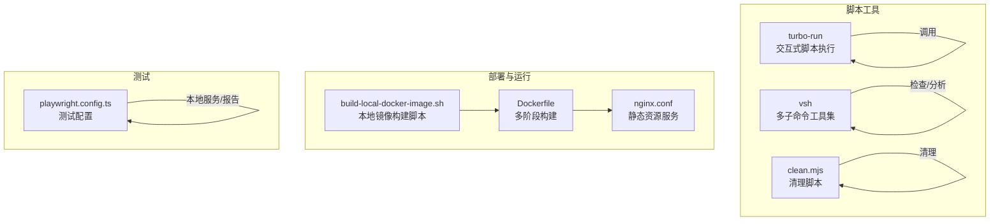
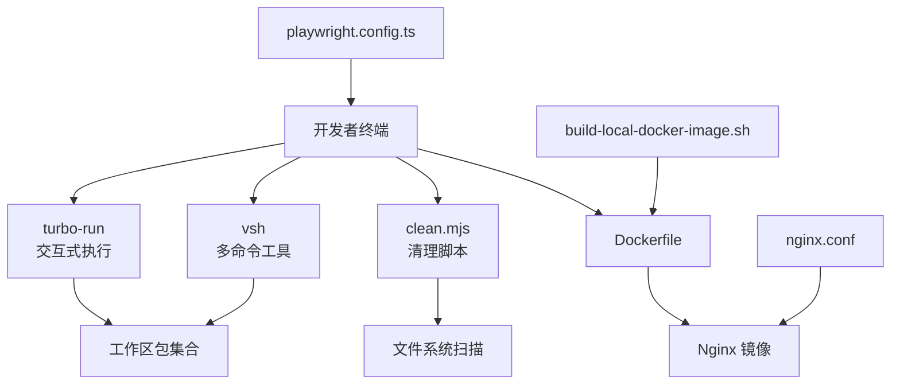
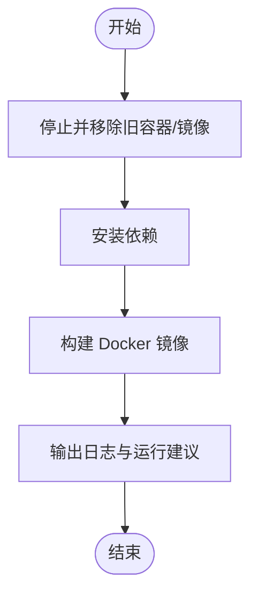
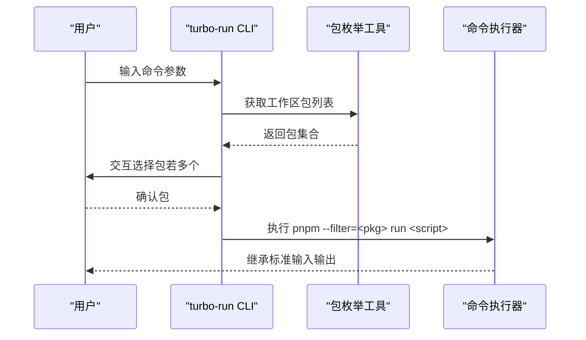
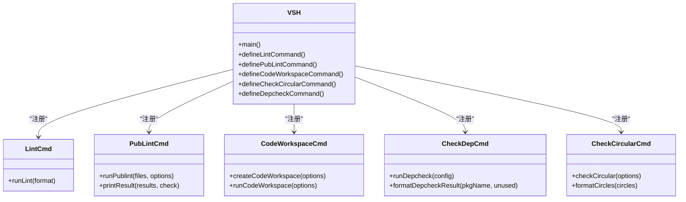
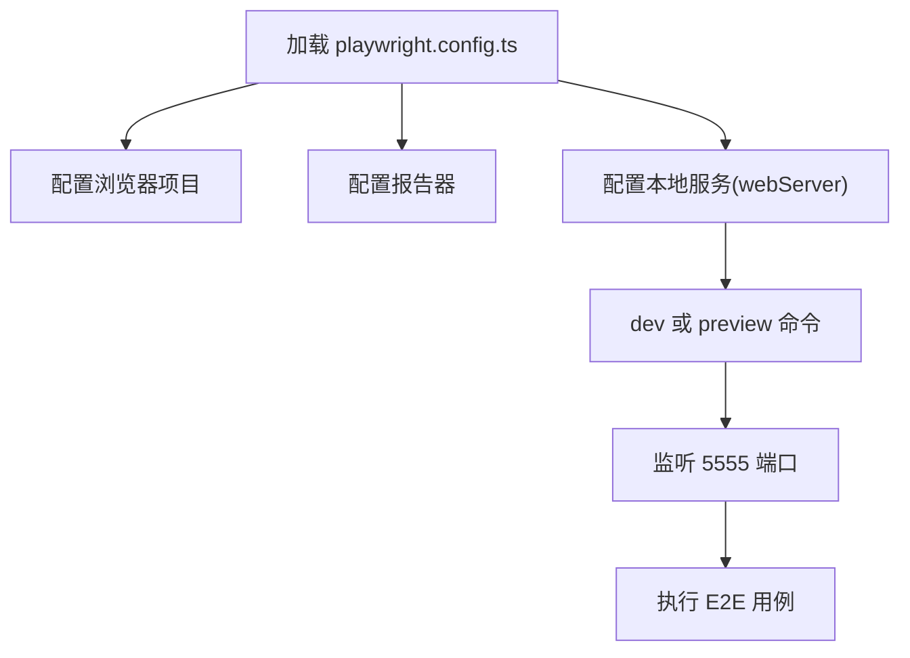
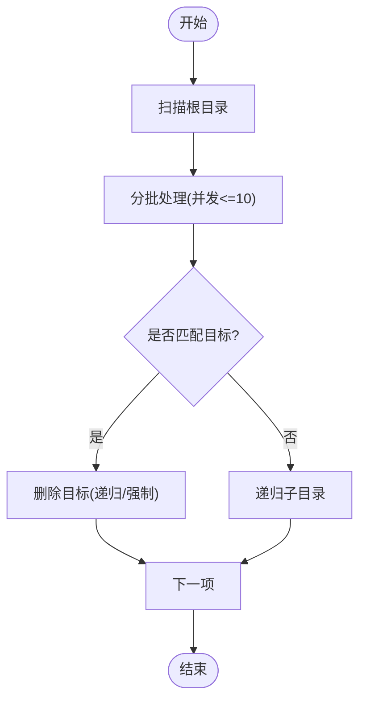
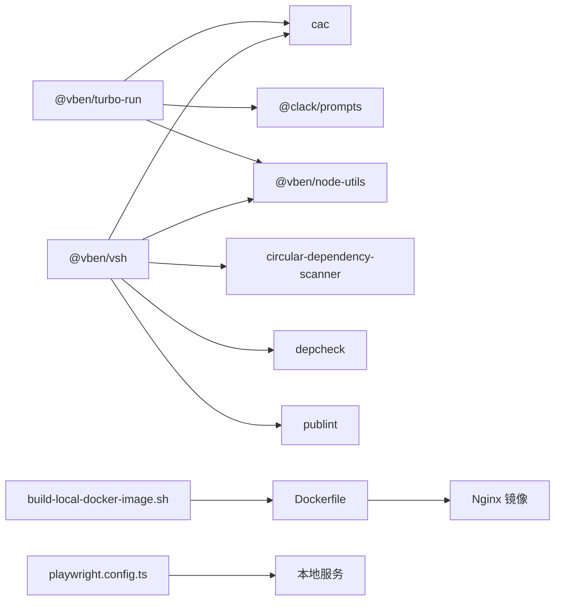

# 开发脚本与工具

<cite>
**本文引用的文件**
- [Dockerfile](file://scripts/deploy/Dockerfile)
- [build-local-docker-image.sh](file://scripts/deploy/build-local-docker-image.sh)
- [nginx.conf](file://scripts/deploy/nginx.conf)
- [index.ts](file://scripts/turbo-run/src/index.ts)
- [run.ts](file://scripts/turbo-run/src/run.ts)
- [package.json](file://scripts/turbo-run/package.json)
- [index.ts](file://scripts/vsh/src/index.ts)
- [check-dep/index.ts](file://scripts/vsh/src/check-dep/index.ts)
- [check-circular/index.ts](file://scripts/vsh/src/check-circular/index.ts)
- [lint/index.ts](file://scripts/vsh/src/lint/index.ts)
- [publint/index.ts](file://scripts/vsh/src/publint/index.ts)
- [code-workspace/index.ts](file://scripts/vsh/src/code-workspace/index.ts)
- [package.json](file://scripts/vsh/package.json)
- [clean.mjs](file://scripts/clean.mjs)
- [playwright.config.ts](file://playground/playwright.config.ts)
</cite>

## 目录
1. [简介](#简介)
2. [项目结构](#项目结构)
3. [核心组件](#核心组件)
4. [架构总览](#架构总览)
5. [详细组件分析](#详细组件分析)
6. [依赖分析](#依赖分析)
7. [性能考虑](#性能考虑)
8. [故障排查指南](#故障排查指南)
9. [结论](#结论)
10. [附录](#附录)

## 简介
本文件面向开发脚本与工具的使用者与维护者，系统性介绍以下内容：
- 部署脚本：Docker 容器化打包、Nginx 配置、本地构建流程与运行方式
- Turbo Run 工具：交互式批量执行脚本、任务选择与过滤
- VSH 工具：依赖检查、循环检测、代码规范与发布标准检查、VS Code 工作区管理
- Playwright 测试：配置与使用要点
- 其他开发辅助脚本：清理脚本的使用与扩展
- 自定义与扩展方法、最佳实践与常见问题

## 项目结构
围绕“scripts”目录下的脚本工具与“playground”目录下的端到端测试配置，形成完整的开发与交付链路。

图表来源
- [Dockerfile:1-38](file://scripts/deploy/Dockerfile#L1-L38)
- [build-local-docker-image.sh:1-56](file://scripts/deploy/build-local-docker-image.sh#L1-L56)
- [nginx.conf:1-76](file://scripts/deploy/nginx.conf#L1-L76)
- [index.ts:1-24](file://scripts/turbo-run/src/index.ts#L1-L24)
- [index.ts:1-78](file://scripts/vsh/src/index.ts#L1-L78)
- [clean.mjs:1-142](file://scripts/clean.mjs#L1-L142)
- [playwright.config.ts:1-109](file://playground/playwright.config.ts#L1-L109)

章节来源
- [Dockerfile:1-38](file://scripts/deploy/Dockerfile#L1-L38)
- [build-local-docker-image.sh:1-56](file://scripts/deploy/build-local-docker-image.sh#L1-L56)
- [nginx.conf:1-76](file://scripts/deploy/nginx.conf#L1-L76)
- [index.ts:1-24](file://scripts/turbo-run/src/index.ts#L1-L24)
- [index.ts:1-78](file://scripts/vsh/src/index.ts#L1-L78)
- [clean.mjs:1-142](file://scripts/clean.mjs#L1-L142)
- [playwright.config.ts:1-109](file://playground/playwright.config.ts#L1-L109)

## 核心组件
- 部署脚本与容器化
  - Dockerfile：基于 Node 22 slim，启用 pnpm 缓存、8GB 内存上限、多阶段 Nginx 镜像，复制构建产物与 Nginx 配置，暴露 8080 端口
  - build-local-docker-image.sh：封装停止/移除容器、移除旧镜像、安装依赖、构建镜像、日志记录与运行建议
  - nginx.conf：设置 MIME 类型、CORS 头、回退到 index.html 的 SPA 路由策略
- Turbo Run 工具
  - 交互式选择包并执行指定脚本，支持过滤拥有该脚本的包
- VSH 工具
  - 多子命令：依赖检查、循环检测、代码格式与风格检查、发布标准检查、VS Code 工作区生成
- Playwright 测试
  - 配置浏览器项目、超时、重试、报告器、本地服务启动与端口复用策略
- 清理脚本
  - 并发安全地扫描与删除 node_modules、dist、.turbo、dist.zip 等目标，支持可选删除锁文件

章节来源
- [Dockerfile:1-38](file://scripts/deploy/Dockerfile#L1-L38)
- [build-local-docker-image.sh:1-56](file://scripts/deploy/build-local-docker-image.sh#L1-L56)
- [nginx.conf:1-76](file://scripts/deploy/nginx.conf#L1-L76)
- [index.ts:1-24](file://scripts/turbo-run/src/index.ts#L1-L24)
- [run.ts:1-68](file://scripts/turbo-run/src/run.ts#L1-L68)
- [index.ts:1-78](file://scripts/vsh/src/index.ts#L1-L78)
- [check-dep/index.ts:1-194](file://scripts/vsh/src/check-dep/index.ts#L1-L194)
- [check-circular/index.ts:1-171](file://scripts/vsh/src/check-circular/index.ts#L1-L171)
- [lint/index.ts:1-55](file://scripts/vsh/src/lint/index.ts#L1-L55)
- [publint/index.ts:1-186](file://scripts/vsh/src/publint/index.ts#L1-L186)
- [code-workspace/index.ts:1-79](file://scripts/vsh/src/code-workspace/index.ts#L1-L79)
- [clean.mjs:1-142](file://scripts/clean.mjs#L1-L142)
- [playwright.config.ts:1-109](file://playground/playwright.config.ts#L1-L109)

## 架构总览
下图展示从本地开发到容器化部署的关键流程与组件关系。

图表来源
- [index.ts:1-24](file://scripts/turbo-run/src/index.ts#L1-L24)
- [run.ts:1-68](file://scripts/turbo-run/src/run.ts#L1-L68)
- [index.ts:1-78](file://scripts/vsh/src/index.ts#L1-L78)
- [clean.mjs:1-142](file://scripts/clean.mjs#L1-L142)
- [Dockerfile:1-38](file://scripts/deploy/Dockerfile#L1-L38)
- [build-local-docker-image.sh:1-56](file://scripts/deploy/build-local-docker-image.sh#L1-L56)
- [nginx.conf:1-76](file://scripts/deploy/nginx.conf#L1-L76)
- [playwright.config.ts:1-109](file://playground/playwright.config.ts#L1-L109)

## 详细组件分析

### 部署脚本与容器化
- Dockerfile 关键点
  - 多阶段构建：builder 阶段安装 pnpm、构建应用；production 阶段基于 nginx:stable-alpine 提供静态服务
  - 环境变量：设置 Node 最大堆内存、时区、Corepack 启用
  - 缓存优化：利用 pnpm store 缓存提升安装速度
  - 构建产物：复制 playground/dist 到 Nginx 根目录
- build-local-docker-image.sh 关键点
  - 自动化流程：停止/移除旧容器与镜像、安装依赖、构建镜像、输出日志与运行建议
  - 错误处理：捕获错误并写入日志文件
- nginx.conf 关键点
  - MIME 类型扩展：显式声明 mjs 支持
  - SPA 回退：try_files 将未命中路由回退到 index.html
  - CORS：允许跨域请求，支持预检返回

图表来源
- [build-local-docker-image.sh:1-56](file://scripts/deploy/build-local-docker-image.sh#L1-L56)

章节来源
- [Dockerfile:1-38](file://scripts/deploy/Dockerfile#L1-L38)
- [build-local-docker-image.sh:1-56](file://scripts/deploy/build-local-docker-image.sh#L1-L56)
- [nginx.conf:1-76](file://scripts/deploy/nginx.conf#L1-L76)

### Turbo Run 工具
- 功能概述
  - 交互式选择工作区内包含指定脚本的包，并在当前终端以继承 IO 的方式执行
  - 若仅有一个候选包则自动选择，否则通过选择器交互
- 使用场景
  - 在多包工作区中快速定位并执行某类任务（如 build、test、lint）
  - 与包内 scripts 解耦，统一入口

图表来源
- [index.ts:1-24](file://scripts/turbo-run/src/index.ts#L1-L24)
- [run.ts:1-68](file://scripts/turbo-run/src/run.ts#L1-L68)

章节来源
- [index.ts:1-24](file://scripts/turbo-run/src/index.ts#L1-L24)
- [run.ts:1-68](file://scripts/turbo-run/src/run.ts#L1-L68)
- [package.json:1-30](file://scripts/turbo-run/package.json#L1-L30)

### VSH 工具
- 命令体系
  - lint：批量执行格式化与静态检查（可选修复）
  - publint：校验 package.json 发布标准，带缓存与分级输出
  - code-workspace：生成/更新 VS Code 工作区文件，支持自动提交
  - check-dep：扫描未使用依赖与缺失依赖
  - check-circular：检测循环依赖，支持暂存区与阈值控制
- 设计要点
  - 基于 CAC 注册子命令，统一帮助与版本输出
  - 与 @vben/node-utils 协作完成包枚举、文件读写、缓存与 Git 操作
  - 对第三方库进行合理封装与错误处理

图表来源
- [index.ts:1-78](file://scripts/vsh/src/index.ts#L1-L78)
- [lint/index.ts:1-55](file://scripts/vsh/src/lint/index.ts#L1-L55)
- [publint/index.ts:1-186](file://scripts/vsh/src/publint/index.ts#L1-L186)
- [code-workspace/index.ts:1-79](file://scripts/vsh/src/code-workspace/index.ts#L1-L79)
- [check-dep/index.ts:1-194](file://scripts/vsh/src/check-dep/index.ts#L1-L194)
- [check-circular/index.ts:1-171](file://scripts/vsh/src/check-circular/index.ts#L1-L171)

章节来源
- [index.ts:1-78](file://scripts/vsh/src/index.ts#L1-L78)
- [lint/index.ts:1-55](file://scripts/vsh/src/lint/index.ts#L1-L55)
- [publint/index.ts:1-186](file://scripts/vsh/src/publint/index.ts#L1-L186)
- [code-workspace/index.ts:1-79](file://scripts/vsh/src/code-workspace/index.ts#L1-L79)
- [check-dep/index.ts:1-194](file://scripts/vsh/src/check-dep/index.ts#L1-L194)
- [check-circular/index.ts:1-171](file://scripts/vsh/src/check-circular/index.ts#L1-L171)
- [package.json:1-32](file://scripts/vsh/package.json#L1-L32)

### Playwright 测试配置与使用
- 关键配置
  - projects：默认启用 Chromium，可按需启用其他浏览器
  - reporter：list 与 HTML 报告并存，输出目录固定
  - retries：CI 环境启用重试
  - timeout/actionTimeout：测试与动作超时时间
  - webServer：根据 CI 环境选择 dev 或 preview 启动本地服务，端口 5555，支持端口复用
- 使用建议
  - 在 CI 中开启 headless 与并行限制，减少资源占用
  - 使用 trace retain-on-failure 辅助定位失败用例

图表来源
- [playwright.config.ts:1-109](file://playground/playwright.config.ts#L1-L109)

章节来源
- [playwright.config.ts:1-109](file://playground/playwright.config.ts#L1-L109)

### 其他开发辅助脚本
- 清理脚本 clean.mjs
  - 并发控制：每批最多 10 个任务，避免阻塞
  - 目标识别：递归扫描 node_modules、dist、.turbo、dist.zip 等
  - 权限与异常：对权限不足、文件不存在等进行容错处理
  - 可选删除锁文件：通过命令行参数启用

图表来源
- [clean.mjs:1-142](file://scripts/clean.mjs#L1-L142)

章节来源
- [clean.mjs:1-142](file://scripts/clean.mjs#L1-L142)

## 依赖分析
- 工具间依赖
  - turbo-run 依赖 @vben/node-utils 与 @clack/prompts，通过 CAC 提供 CLI 能力
  - vsh 依赖 @vben/node-utils、circular-dependency-scanner、depcheck、publint，提供多子命令能力
- 外部集成点
  - Docker 构建集成 pnpm 缓存与多阶段 Nginx 镜像
  - Playwright 通过 webServer 自动启动本地服务

图表来源
- [package.json:1-30](file://scripts/turbo-run/package.json#L1-L30)
- [package.json:1-32](file://scripts/vsh/package.json#L1-L32)
- [Dockerfile:1-38](file://scripts/deploy/Dockerfile#L1-L38)
- [build-local-docker-image.sh:1-56](file://scripts/deploy/build-local-docker-image.sh#L1-L56)
- [playwright.config.ts:1-109](file://playground/playwright.config.ts#L1-L109)

章节来源
- [package.json:1-30](file://scripts/turbo-run/package.json#L1-L30)
- [package.json:1-32](file://scripts/vsh/package.json#L1-L32)

## 性能考虑
- Docker 构建
  - 使用 pnpm store 缓存与 --frozen-lockfile 保证一致性与速度
  - 多阶段构建减少最终镜像体积
- VSH 子命令
  - publint 与 depcheck 使用缓存，避免重复计算
  - lint 子命令在非修复模式下并行执行多项检查
- 清理脚本
  - 通过分批与并发限制控制 I/O 压力，避免阻塞
- Playwright
  - CI 下启用 headless 与 retries，降低失败率
  - webServer 复用端口，避免重复启动成本

## 故障排查指南
- Docker 构建失败
  - 检查 pnpm store 缓存与网络连通性
  - 确认 playground/dist 是否存在以及 nginx.conf 路径正确
- 本地镜像构建脚本报错
  - 查看日志文件定位失败步骤，确认依赖安装与镜像标签
- Nginx 404 或路由异常
  - 检查 try_files 与 index 配置，确保 SPA 回退生效
  - 核对 CORS 头是否满足前端路由需求
- Turbo Run 无可用包
  - 确认目标脚本存在于至少一个包的 scripts 中
  - 检查包枚举逻辑与过滤条件
- VSH 子命令报错
  - lint：检查各工具安装与版本兼容性
  - publint：查看缓存文件与 package.json 结构
  - check-dep：调整忽略规则或升级 depcheck
  - check-circular：缩小扫描范围或调整阈值
- 清理脚本权限问题
  - 检查目录权限与文件锁定状态，必要时以管理员权限运行
- Playwright 测试失败
  - 查看 HTML 报告与 trace，确认本地服务端口与 baseURL 设置
  - 在 CI 环境启用 headless 并适当增加超时

章节来源
- [Dockerfile:1-38](file://scripts/deploy/Dockerfile#L1-L38)
- [build-local-docker-image.sh:1-56](file://scripts/deploy/build-local-docker-image.sh#L1-L56)
- [nginx.conf:1-76](file://scripts/deploy/nginx.conf#L1-L76)
- [run.ts:1-68](file://scripts/turbo-run/src/run.ts#L1-L68)
- [lint/index.ts:1-55](file://scripts/vsh/src/lint/index.ts#L1-L55)
- [publint/index.ts:1-186](file://scripts/vsh/src/publint/index.ts#L1-L186)
- [check-dep/index.ts:1-194](file://scripts/vsh/src/check-dep/index.ts#L1-L194)
- [check-circular/index.ts:1-171](file://scripts/vsh/src/check-circular/index.ts#L1-L171)
- [clean.mjs:1-142](file://scripts/clean.mjs#L1-L142)
- [playwright.config.ts:1-109](file://playground/playwright.config.ts#L1-L109)

## 结论
本仓库的脚本与工具覆盖了从本地开发、质量检查、测试验证到容器化部署的完整链路。通过模块化的 CLI 工具与可配置的构建脚本，团队可以高效地进行多包协作与标准化交付。建议在团队内推广使用这些工具，并结合 CI/CD 流水线实现自动化与一致性。

## 附录
- 实际使用示例与最佳实践
  - 部署
    - 本地构建镜像：先执行本地构建脚本，再运行容器，映射端口至 8010:8080
    - 生产部署：在 CI 中构建并推送镜像，使用 Nginx 配置提供静态服务
  - 交互式执行
    - 使用 turbo-run 选择目标包后执行常用脚本（如 build、dev、lint），减少手动筛选成本
  - 质量检查
    - 定期运行 vsh lint（非修复模式）与 vsh publint，发现问题及时修复
    - 使用 vsh check-dep 与 check-circular 定期清理冗余依赖与循环引用
  - 测试
    - 在本地使用 dev 启动服务，运行 Playwright；在 CI 中启用 headless 与重试
  - 清理
    - 定期运行 clean.mjs 清理 node_modules、dist 等，必要时加上删除锁文件参数