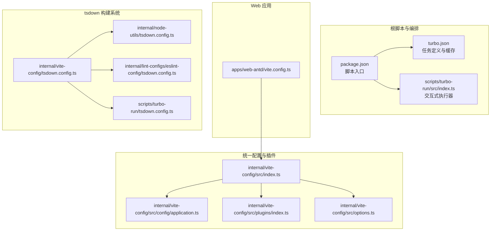
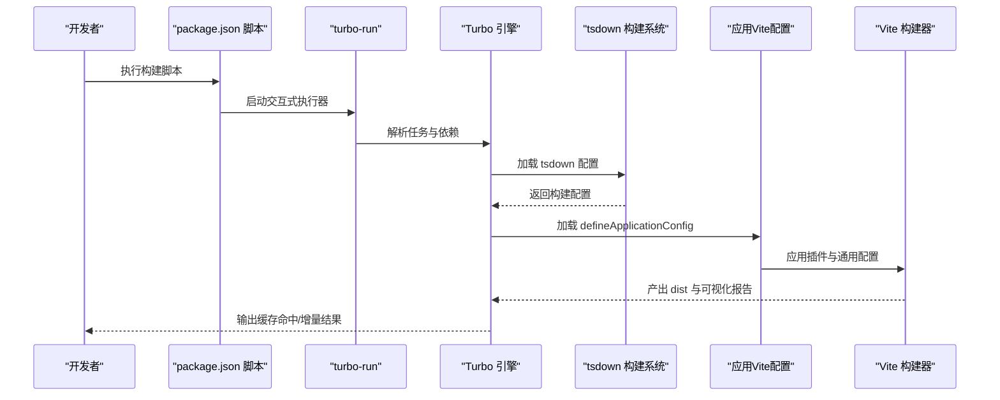
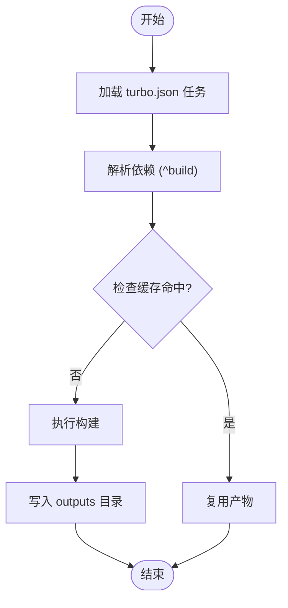
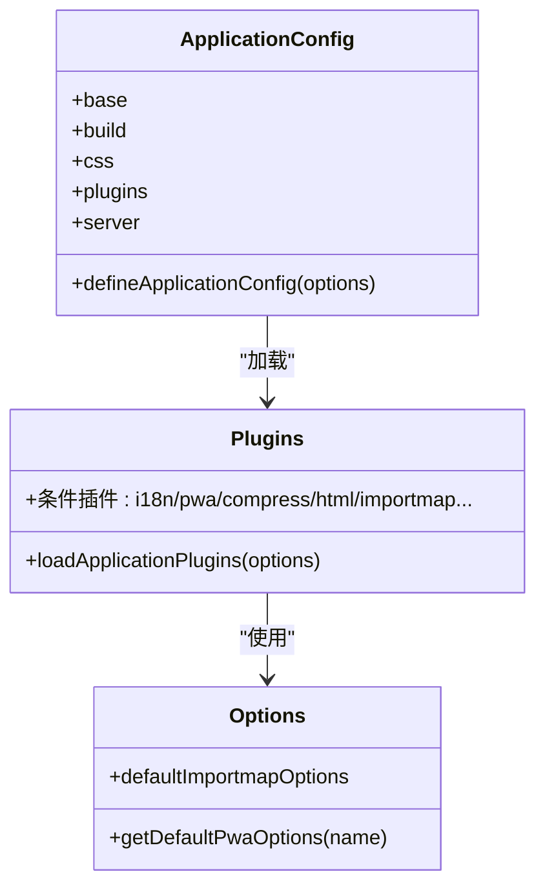
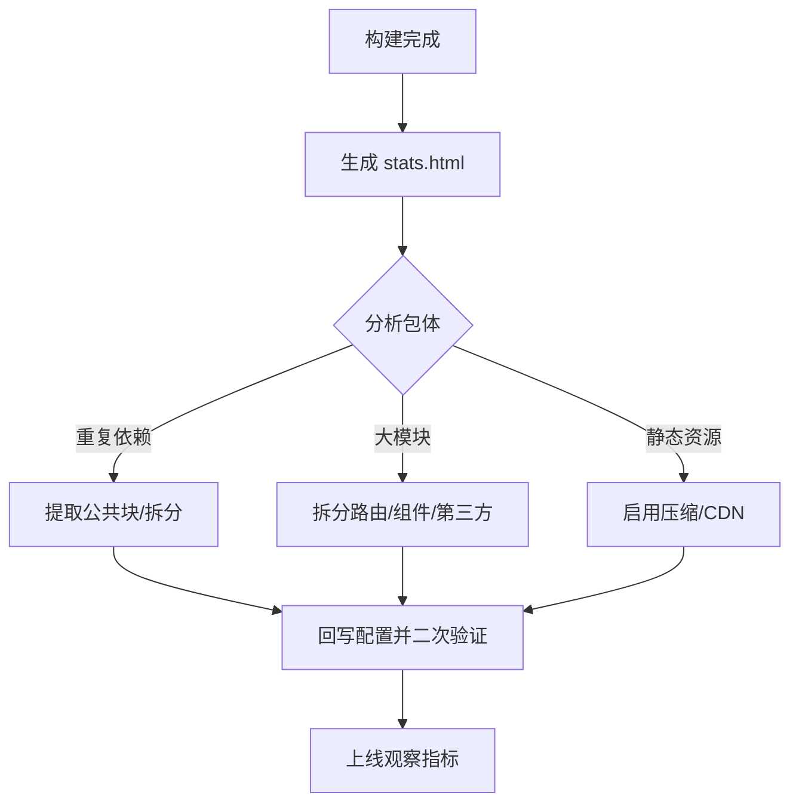
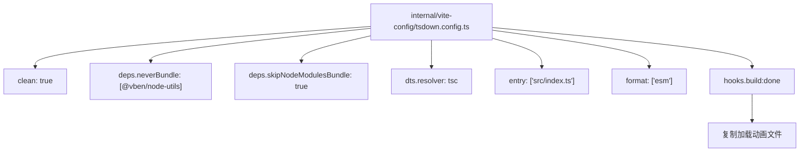
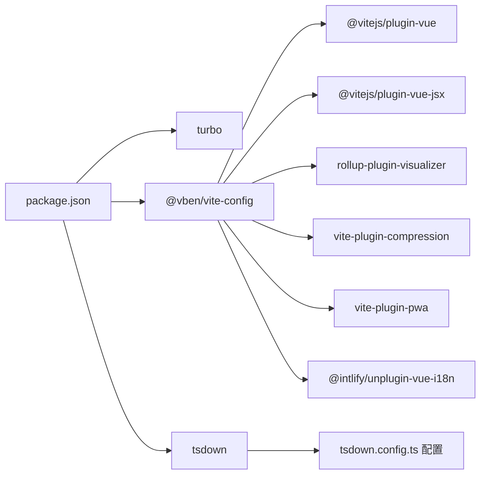

# 构建优化与性能调优

<cite>
**本文引用的文件**
- [turbo.json](file://turbo.json)
- [package.json](file://package.json)
- [apps/web-antd/vite.config.ts](file://apps/web-antd/vite.config.ts)
- [internal/vite-config/src/index.ts](file://internal/vite-config/src/index.ts)
- [internal/vite-config/src/config/application.ts](file://internal/vite-config/src/config/application.ts)
- [internal/vite-config/src/plugins/index.ts](file://internal/vite-config/src/plugins/index.ts)
- [internal/vite-config/src/options.ts](file://internal/vite-config/src/options.ts)
- [internal/vite-config/tsdown.config.ts](file://internal/vite-config/tsdown.config.ts)
- [internal/node-utils/tsdown.config.ts](file://internal/node-utils/tsdown.config.ts)
- [internal/lint-configs/eslint-config/tsdown.config.ts](file://internal/lint-configs/eslint-config/tsdown.config.ts)
- [scripts/turbo-run/src/index.ts](file://scripts/turbo-run/src/index.ts)
- [scripts/turbo-run/tsdown.config.ts](file://scripts/turbo-run/tsdown.config.ts)
</cite>

## 更新摘要
**所做更改**
- 新增 tsdown 构建系统章节，详细介绍现代化的 tsdown.config.ts 配置方案
- 更新构建配置章节，反映从传统 build.config.ts 到 tsdown.config.ts 的迁移
- 新增 tsdown 配置文件分析，涵盖依赖处理、钩子函数和构建流程
- 更新依赖分析章节，包含新的 tsdown 构建系统集成
- 新增 tsdown 构建优化策略，包括并行化、缓存和增量构建

## 目录
1. [简介](#简介)
2. [项目结构](#项目结构)
3. [核心组件](#核心组件)
4. [架构总览](#架构总览)
5. [详细组件分析](#详细组件分析)
6. [tsdown 构建系统](#tsdown-构建系统)
7. [依赖分析](#依赖分析)
8. [性能考量](#性能考量)
9. [故障排查指南](#故障排查指南)
10. [结论](#结论)
11. [附录](#附录)

## 简介
本文件面向构建优化与性能调优，系统梳理本仓库中基于 Turbo 的多包构建体系与基于 Vite 的前端应用配置，重点覆盖以下主题：
- Turbo 构建任务并行化、缓存与增量构建策略
- **新增** tsdown 构建系统现代化配置与优化策略
- Vite 插件在打包体积、资源处理与代码分割上的优化点
- 构建产物分析（Bundle 大小、依赖关系）与优化建议
- 运行时性能优化（懒加载、预加载、缓存策略）
- 不同环境下的构建配置差异与最佳实践
- 性能监控与调优流程及可复用的优化案例

## 项目结构
本仓库采用 Monorepo 结构，结合 Turbo 实现跨包并行构建与缓存；各 Web 应用通过统一的 @vben/vite-config 定义 Vite 配置，插件按需启用，确保一致性与可维护性。**新增** tsdown 构建系统为所有内部包提供现代化的 TypeScript 构建配置。

**图表来源**
- [package.json:27-66](file://package.json#L27-L66)
- [turbo.json:15-47](file://turbo.json#L15-L47)
- [scripts/turbo-run/src/index.ts:1-24](file://scripts/turbo-run/src/index.ts#L1-L24)
- [apps/web-antd/vite.config.ts:1-21](file://apps/web-antd/vite.config.ts#L1-L21)
- [internal/vite-config/src/index.ts:1-6](file://internal/vite-config/src/index.ts#L1-L6)
- [internal/vite-config/tsdown.config.ts:1-42](file://internal/vite-config/tsdown.config.ts#L1-L42)
- [internal/node-utils/tsdown.config.ts:1-11](file://internal/node-utils/tsdown.config.ts#L1-L11)
- [internal/lint-configs/eslint-config/tsdown.config.ts:1-17](file://internal/lint-configs/eslint-config/tsdown.config.ts#L1-L17)
- [scripts/turbo-run/tsdown.config.ts:1-12](file://scripts/turbo-run/tsdown.config.ts#L1-L12)

**章节来源**
- [package.json:27-66](file://package.json#L27-L66)
- [turbo.json:15-47](file://turbo.json#L15-L47)
- [apps/web-antd/vite.config.ts:1-21](file://apps/web-antd/vite.config.ts#L1-L21)
- [internal/vite-config/src/index.ts:1-6](file://internal/vite-config/src/index.ts#L1-L6)
- [internal/vite-config/tsdown.config.ts:1-42](file://internal/vite-config/tsdown.config.ts#L1-L42)
- [internal/node-utils/tsdown.config.ts:1-11](file://internal/node-utils/tsdown.config.ts#L1-L11)
- [internal/lint-configs/eslint-config/tsdown.config.ts:1-17](file://internal/lint-configs/eslint-config/tsdown.config.ts#L1-L17)
- [scripts/turbo-run/src/index.ts:1-24](file://scripts/turbo-run/src/index.ts#L1-L24)

## 核心组件
- Turbo 编排与缓存：通过 tasks 定义构建依赖、输出目录与缓存开关，实现跨包并行与增量构建。
- 统一 Vite 配置：defineApplicationConfig 聚合通用配置、插件与环境变量，按需启用压缩、PWA、可视化等能力。
- 条件插件体系：loadApplicationPlugins 基于构建/开发模式与选项动态启用插件，避免不必要的开销。
- **新增** tsdown 构建系统：统一的 TypeScript 构建配置，支持依赖处理、钩子函数和现代化构建流程。
- 应用级 Vite 配置：各应用仅注入少量差异化配置（如 Element Plus 插件、代理），保持一致性。

**章节来源**
- [turbo.json:15-47](file://turbo.json#L15-L47)
- [internal/vite-config/src/config/application.ts:17-99](file://internal/vite-config/src/config/application.ts#L17-L99)
- [internal/vite-config/src/plugins/index.ts:94-223](file://internal/vite-config/src/plugins/index.ts#L94-L223)
- [internal/vite-config/tsdown.config.ts:10-41](file://internal/vite-config/tsdown.config.ts#L10-L41)
- [apps/web-antd/vite.config.ts:5-27](file://apps/web-antd/vite.config.ts#L5-L27)

## 架构总览
下图展示从命令到构建产物的关键路径，以及 Turbo 与 Vite 的协作方式，**新增** tsdown 构建系统的集成。

**图表来源**
- [package.json:27-66](file://package.json#L27-L66)
- [scripts/turbo-run/src/index.ts:13-15](file://scripts/turbo-run/src/index.ts#L13-L15)
- [turbo.json:15-47](file://turbo.json#L15-L47)
- [internal/vite-config/tsdown.config.ts:10-41](file://internal/vite-config/tsdown.config.ts#L10-L41)
- [internal/vite-config/src/config/application.ts:17-99](file://internal/vite-config/src/config/application.ts#L17-L99)

## 详细组件分析

### Turbo 构建任务与缓存策略
- 任务定义与依赖
  - build 依赖上游包构建（^build），确保依赖顺序正确。
  - preview/build:analyze/后台服务构建等任务均声明 outputs，便于缓存命中判断。
- 缓存与增量
  - globalDependencies 将锁文件、tsconfig、内部工具与配置纳入全局依赖，保证变更触发重建。
  - dev 任务禁用缓存（cache:false）并持久化（persistent:true），提升开发体验。
- 并行化
  - 通过 npm 脚本与 turbo-run 并发调度，结合 tasks.dependsOn 实现跨包并行。

**图表来源**
- [turbo.json:15-47](file://turbo.json#L15-L47)

**章节来源**
- [turbo.json:15-47](file://turbo.json#L15-L47)
- [package.json:27-66](file://package.json#L27-L66)
- [scripts/turbo-run/src/index.ts:13-15](file://scripts/turbo-run/src/index.ts#L13-L15)

### Vite 应用配置与插件体系
- defineApplicationConfig
  - 合并通用配置与应用级 vite 扩展，设置 base、build rolldownOptions、CSS 注入与 server 预热。
  - 开启 rollup 输出命名规则与生产环境压缩开关，提升产物可控性。
- 插件加载策略
  - 条件插件：根据 isBuild、devtools、i18n、pwa、compress 等选项动态启用。
  - 生产可视化：build+visualizer 时生成 stats.html，便于分析 Bundle。
  - 资源压缩：按 compressTypes 启用 brotli/gzip 压缩，平衡体积与服务器负载。
  - PWA：默认最小化配置，可扩展 manifest。
  - HTML 压缩、ImportMap、Nitro Mock、打印信息等按需启用。
- 应用级差异
  - Element Plus 应用额外启用 unplugin-element-plus/vite 插件。
  - 其他 UI 框架应用保持最小差异化配置，集中于统一配置层。

**图表来源**
- [internal/vite-config/src/config/application.ts:17-99](file://internal/vite-config/src/config/application.ts#L17-L99)
- [internal/vite-config/src/plugins/index.ts:94-223](file://internal/vite-config/src/plugins/index.ts#L94-L223)
- [internal/vite-config/src/options.ts:28-46](file://internal/vite-config/src/options.ts#L28-L46)

**章节来源**
- [internal/vite-config/src/config/application.ts:17-99](file://internal/vite-config/src/config/application.ts#L17-L99)
- [internal/vite-config/src/plugins/index.ts:94-223](file://internal/vite-config/src/plugins/index.ts#L94-L223)
- [internal/vite-config/src/options.ts:28-46](file://internal/vite-config/src/options.ts#L28-L46)
- [apps/web-antd/vite.config.ts:5-27](file://apps/web-antd/vite.config.ts#L5-L27)

### 构建产物分析与优化
- 可视化分析
  - 在生产构建中启用可视化插件，生成 stats.html，用于查看包体构成、重复依赖与大体积模块。
- 代码分割与命名
  - 自定义 rolldown 输出命名规则，便于缓存与 CDN 分发管理。
- 资源压缩
  - 按需启用 brotli/gzip，结合服务端配置选择最优传输格式。
- 依赖优化
  - 使用 ImportMap 降低部分依赖的 CDN 引入成本（当前默认 provider 与白名单已配置，按需启用）。

**图表来源**
- [internal/vite-config/src/plugins/index.ts:79-87](file://internal/vite-config/src/plugins/index.ts#L79-L87)
- [internal/vite-config/src/config/application.ts:60-76](file://internal/vite-config/src/config/application.ts#L60-L76)
- [internal/vite-config/src/options.ts:28-46](file://internal/vite-config/src/options.ts#L28-L46)

**章节来源**
- [internal/vite-config/src/plugins/index.ts:79-87](file://internal/vite-config/src/plugins/index.ts#L79-L87)
- [internal/vite-config/src/config/application.ts:60-76](file://internal/vite-config/src/config/application.ts#L60-L76)
- [internal/vite-config/src/options.ts:28-46](file://internal/vite-config/src/options.ts#L28-L46)

### 运行时性能优化策略
- 预热与首屏
  - server.warmup 预热关键入口与核心模块，缩短首次渲染时间。
- 懒加载与代码分割
  - 路由级懒加载、组件级动态导入、表格等重型组件按需加载。
- 缓存策略
  - 产物命名含哈希，结合 CDN/浏览器缓存策略提升命中率。
- PWA 与离线
  - 默认启用 PWA，可按需扩展 service worker 与离线页面。

**章节来源**
- [internal/vite-config/src/config/application.ts:79-90](file://internal/vite-config/src/config/application.ts#L79-L90)
- [internal/vite-config/src/plugins/index.ts:167-182](file://internal/vite-config/src/plugins/index.ts#L167-L182)

### 不同环境下的构建配置差异
- 开发环境
  - devtools 可用、Nitro Mock 启用、不启用压缩与可视化。
  - server.host=true、port 可配置、warmup 预热关键文件。
- 生产环境
  - 启用压缩（brotli/gzip）、可视化、HTML 压缩、PWA 最小化配置。
  - rolldown 输出命名规范化，便于缓存与 CDN 管理。

**章节来源**
- [internal/vite-config/src/plugins/index.ts:50-89](file://internal/vite-config/src/plugins/index.ts#L50-L89)
- [internal/vite-config/src/config/application.ts:58-98](file://internal/vite-config/src/config/application.ts#L58-L98)

## tsdown 构建系统

### tsdown 配置概览
tsdown 是一个现代化的 TypeScript 构建工具，为本项目提供了统一的构建配置方案。所有内部包都采用了标准化的 tsdown.config.ts 配置文件。

### 核心配置特性
- **依赖处理**：支持 neverBundle 和 skipNodeModulesBundle 选项，优化依赖打包策略
- **类型声明**：内置 DTS 生成支持，使用 tsc 解析器
- **钩子函数**：提供 build:done 钩子，在构建完成后执行自定义操作
- **输出扩展**：支持自定义文件扩展名映射

### 配置文件分析

#### 内部 Vite 配置包

**图表来源**
- [internal/vite-config/tsdown.config.ts:10-41](file://internal/vite-config/tsdown.config.ts#L10-L41)

#### Node Utils 包
该包专注于工具函数的构建，配置相对简单：

- clean: false - 保持构建产物
- deps.skipNodeModulesBundle: true - 跳过 node_modules 打包
- entry: ['src/index.ts'] - 主入口文件
- format: ['esm'] - 输出格式为 ES Module

#### ESLint 配置包
作为 lint 配置的核心包，提供了完整的类型声明支持：

- clean: true - 清理构建目录
- deps.skipNodeModulesBundle: true - 跳过 node_modules 打包
- dts.resolver: 'tsc' - 使用 TypeScript 编译器解析
- entry: ['src/index.ts'] - 主入口文件
- format: ['esm'] - 输出格式为 ES Module
- outExtensions: 自定义 .d.ts 扩展名

#### Turbo Run 脚本包
脚本工具的构建配置：

- clean: true - 清理构建目录
- dts: true - 生成类型声明
- entry: ['src/index.ts'] - 主入口文件
- format: ['esm'] - 输出格式为 ES Module
- outExtensions: 自定义 .d.ts 扩展名

### 构建流程优化
tsdown 构建系统为项目带来了以下优化：

1. **标准化配置**：统一的构建配置模板，减少重复配置
2. **依赖优化**：智能的依赖处理策略，避免不必要的打包
3. **类型安全**：内置的 DTS 生成，确保类型声明的准确性
4. **钩子机制**：允许在构建过程中执行自定义逻辑
5. **并行构建**：与 Turbo 构建系统协同，提升整体构建效率

**章节来源**
- [internal/vite-config/tsdown.config.ts:1-42](file://internal/vite-config/tsdown.config.ts#L1-L42)
- [internal/node-utils/tsdown.config.ts:1-11](file://internal/node-utils/tsdown.config.ts#L1-L11)
- [internal/lint-configs/eslint-config/tsdown.config.ts:1-17](file://internal/lint-configs/eslint-config/tsdown.config.ts#L1-L17)
- [scripts/turbo-run/tsdown.config.ts:1-12](file://scripts/turbo-run/tsdown.config.ts#L1-L12)

## 依赖分析
- 包间依赖
  - 各应用通过 @vben/vite-config 统一加载插件与配置，减少重复与分歧。
  - **新增** 内部包通过 tsdown 构建系统统一管理，确保构建一致性。
- 外部依赖
  - 关键插件：@vitejs/plugin-vue、@vitejs/plugin-vue-jsx、rollup-plugin-visualizer、vite-plugin-compression、vite-plugin-pwa、@intlify/unplugin-vue-i18n 等。
  - **新增** tsdown 作为核心构建工具，提供现代化的 TypeScript 构建支持。
- 环境与工具
  - Turbo、turbo-run、cross-env（增大堆内存）、Node 版本约束与 pnpm 锁文件参与全局依赖。
  - **新增** tsdown 配置文件统一管理构建工具链。

**图表来源**
- [package.json:67-101](file://package.json#L67-L101)
- [internal/vite-config/src/plugins/index.ts:10-31](file://internal/vite-config/src/plugins/index.ts#L10-L31)
- [package.json:96](file://package.json#L96)

**章节来源**
- [package.json:67-101](file://package.json#L67-L101)
- [internal/vite-config/src/plugins/index.ts:10-31](file://internal/vite-config/src/plugins/index.ts#L10-L31)
- [package.json:96](file://package.json#L96)

## 性能考量
- 并行与增量
  - 利用 Turbo 的 tasks.dependsOn 与 outputs，最大化并行度，减少重复工作。
  - **新增** tsdown 构建系统支持并行构建，进一步提升构建效率。
- 插件按需启用
  - 将压缩、可视化、PWA 等仅在生产启用，避免开发阶段的额外开销。
- 产物命名与缓存
  - 通过自定义命名规则与哈希，提升缓存命中率与 CDN 效率。
- 资源与传输
  - 启用 brotli/gzip，结合服务端配置选择最优压缩算法。
- 预热与懒加载
  - 首屏预热关键模块，其余按需加载，缩短 TTI。
- **新增** tsdown 构建优化
  - 智能依赖处理，避免不必要的打包开销
  - 钩子函数支持构建后处理，如文件复制等操作
  - 类型声明生成确保构建过程的类型安全

## 故障排查指南
- 构建失败或缓存异常
  - 检查 turbo.json 中 tasks 的 dependsOn 与 outputs 是否匹配实际产物。
  - 确认 globalDependencies 是否包含影响构建的文件（锁文件、tsconfig、内部配置）。
- 插件冲突
  - 逐项关闭条件插件（如压缩、PWA、可视化）定位问题。
- 内存不足
  - 在构建脚本中设置 NODE_OPTIONS=--max-old-space-size=8192（已在脚本中配置）。
- 开发体验差
  - 确认 dev 任务 cache=false、persistent:true 已生效；检查 server.warmup 文件列表是否覆盖关键入口。
- **新增** tsdown 构建问题
  - 检查 tsdown.config.ts 配置文件语法和路径是否正确
  - 确认钩子函数执行是否正常，特别是 build:done 钩子
  - 验证依赖处理配置，确保 neverBundle 和 skipNodeModulesBundle 设置合理

**章节来源**
- [turbo.json:15-47](file://turbo.json#L15-L47)
- [package.json:28](file://package.json#L28)
- [internal/vite-config/src/config/application.ts:79-90](file://internal/vite-config/src/config/application.ts#L79-L90)
- [internal/vite-config/tsdown.config.ts:21-36](file://internal/vite-config/tsdown.config.ts#L21-L36)

## 结论
本仓库通过 Turbo 与统一 Vite 配置实现了可维护、可扩展且高性能的构建体系。**新增** tsdown 构建系统的引入进一步提升了构建效率和一致性。建议在团队内遵循"统一配置 + 条件插件 + 可视化分析 + tsdown 构建系统"的流程，持续迭代 Bundle 与运行时性能，并以缓存与预热为抓手，稳定提升用户体验。

## 附录
- 实施清单
  - 启用生产可视化并定期分析 stats.html
  - 按需启用 brotli/gzip，结合服务端配置
  - 使用 ImportMap 优化部分依赖加载（按需开启）
  - 路由/组件/表格等重型模块懒加载
  - 首屏预热关键入口与核心模块
  - 建立缓存与 CDN 策略，配合产物命名哈希
  - **新增** 推荐使用 tsdown 构建系统管理内部包
- 性能测试方法
  - 使用 Lighthouse/Chrome DevTools Performance/Network 面板进行首屏与交互性能评估
  - 对比开启/关闭压缩与可视化对构建时长与产物体积的影响
  - 通过真实用户监控（RUM）与服务端日志观测运行时表现
  - **新增** 使用 tsdown 构建时间统计工具监控构建性能