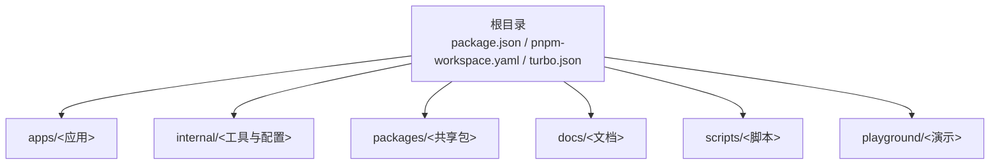
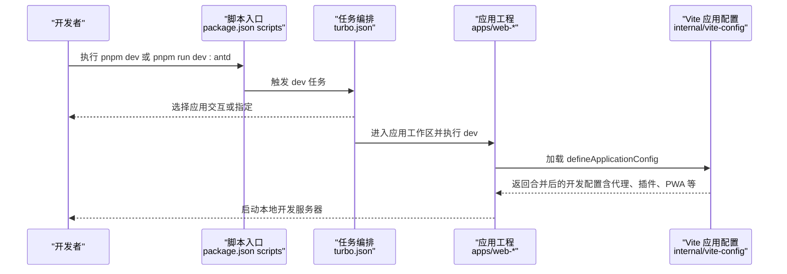
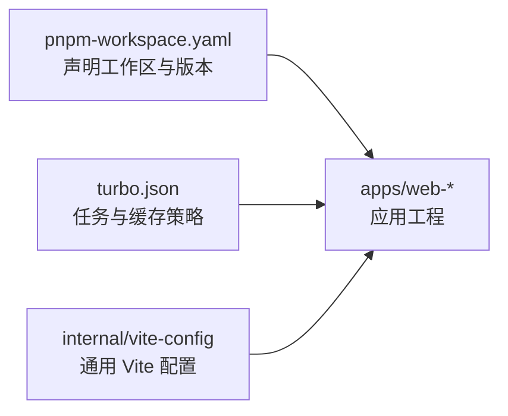

# 快速开始

<cite>
**本文引用的文件**
- [package.json](file://package.json)
- [README.md](file://README.md)
- [pnpm-workspace.yaml](file://pnpm-workspace.yaml)
- [turbo.json](file://turbo.json)
- [apps/web-antd/package.json](file://apps/web-antd/package.json)
- [apps/web-antd/vite.config.ts](file://apps/web-antd/vite.config.ts)
- [apps/web-ele/vite.config.ts](file://apps/web-ele/vite.config.ts)
- [apps/web-naive/vite.config.ts](file://apps/web-naive/vite.config.ts)
- [apps/web-tdesign/vite.config.ts](file://apps/web-tdesign/vite.config.ts)
- [apps/web-antdv-next/vite.config.ts](file://apps/web-antdv-next/vite.config.ts)
- [internal/vite-config/src/config/application.ts](file://internal/vite-config/src/config/application.ts)
- [docs/src/guide/introduction/quick-start.md](file://docs/src/guide/introduction/quick-start.md)
- [docs/src/guide/project/dir.md](file://docs/src/guide/project/dir.md)
- [apps/web-antd/src/preferences.ts](file://apps/web-antd/src/preferences.ts)
- [apps/web-ele/src/preferences.ts](file://apps/web-ele/src/preferences.ts)
- [apps/web-naive/src/preferences.ts](file://apps/web-naive/src/preferences.ts)
- [apps/web-tdesign/src/preferences.ts](file://apps/web-tdesign/src/preferences.ts)
</cite>

## 目录
1. [简介](#简介)
2. [项目结构](#项目结构)
3. [核心组件](#核心组件)
4. [架构总览](#架构总览)
5. [详细组件分析](#详细组件分析)
6. [依赖关系分析](#依赖关系分析)
7. [性能考虑](#性能考虑)
8. [故障排除指南](#故障排除指南)
9. [结论](#结论)
10. [附录](#附录)

## 简介
本指南面向初学者与进阶用户，帮助你在最短时间内完成 Vben Admin 项目的克隆、安装、启动与基础配置。你将学会：
- 环境要求与工具链选择（Node.js、包管理器）
- 项目克隆与依赖安装流程
- 开发服务器启动与多应用选择
- 不同 UI 框架（Ant Design Vue、Element Plus、Naive UI、TDesign、Ant Design Vue Next）的选择与切换
- 项目目录结构与关键配置文件的作用
- 常见问题排查与解决方案

## 项目结构
Vben Admin 采用 Monorepo 架构，使用 pnpm workspace 管理多个子应用与内部工具包。核心目录与职责概览：
- apps：多套前端应用（基于不同 UI 框架），以及后端 Mock 服务
- internal：内部工具与通用配置（Vite、ESLint、Stylelint、TypeScript 等）
- packages：可复用的业务与核心包（如 @core、stores、styles 等）
- docs：文档站点
- scripts：部署与辅助脚本
- playground：演示与测试应用
- 根目录配置：package.json、pnpm-workspace.yaml、turbo.json 等

图表来源
- [docs/src/guide/project/dir.md:1-73](file://docs/src/guide/project/dir.md#L1-L73)
- [pnpm-workspace.yaml:1-193](file://pnpm-workspace.yaml#L1-L193)

章节来源
- [docs/src/guide/project/dir.md:1-73](file://docs/src/guide/project/dir.md#L1-L73)
- [pnpm-workspace.yaml:1-193](file://pnpm-workspace.yaml#L1-L193)

## 核心组件
- 多应用前端（apps/web-*）：提供基于不同 UI 框架的完整前端工程，均使用 Vite + Vue 3 + TypeScript
- 通用 Vite 配置（internal/vite-config）：统一的开发与构建配置，包含插件、代理、PWA、国际化、导入映射等能力
- 工作区与任务编排（turbo.json + package.json scripts）：通过 Turbo 管理构建缓存与任务依赖，简化多应用开发体验
- 文档与脚手架（docs、scripts）：提供快速开始、目录说明与部署脚本

章节来源
- [package.json:27-66](file://package.json#L27-L66)
- [turbo.json:15-48](file://turbo.json#L15-L48)
- [internal/vite-config/src/config/application.ts:17-99](file://internal/vite-config/src/config/application.ts#L17-L99)

## 架构总览
下图展示了从“选择应用”到“启动开发服务器”的整体流程，以及各应用如何共享通用 Vite 配置。

图表来源
- [package.json:45-52](file://package.json#L45-L52)
- [turbo.json:38-43](file://turbo.json#L38-L43)
- [internal/vite-config/src/config/application.ts:17-99](file://internal/vite-config/src/config/application.ts#L17-L99)

章节来源
- [package.json:27-66](file://package.json#L27-L66)
- [turbo.json:15-48](file://turbo.json#L15-L48)
- [docs/src/guide/introduction/quick-start.md:75-113](file://docs/src/guide/introduction/quick-start.md#L75-L113)

## 详细组件分析

### 环境要求与工具链
- Node.js：建议使用 20.15.0 及以上版本；仓库 engines 明确了兼容范围
- 包管理器：项目默认使用 pnpm，且通过 corepack 自动安装指定版本
- Git：用于克隆仓库
- 浏览器：推荐 Chrome 80+，支持现代浏览器

章节来源
- [package.json:103-107](file://package.json#L103-L107)
- [docs/src/guide/introduction/quick-start.md:7-25](file://docs/src/guide/introduction/quick-start.md#L7-L25)

### 安装与初始化
- 克隆仓库：使用 Git 克隆官方仓库
- 安装依赖：进入项目目录后，先安装 corepack，再使用 pnpm install 完成依赖安装
- 网络问题：若无法访问 npm 源，可通过设置 COREPACK_NPM_REGISTRY 环境变量后再执行安装
- 目录限制：存放代码的目录及其父级路径不得包含中文、韩文、日文或空格，否则可能导致安装或启动异常

章节来源
- [docs/src/guide/introduction/quick-start.md:29-74](file://docs/src/guide/introduction/quick-start.md#L29-L74)
- [README.md:57-82](file://README.md#L57-L82)

### 开发服务器启动
- 交互式选择：执行 pnpm dev 后，系统会列出可选应用，按提示选择目标应用
- 指定应用：也可直接使用 pnpm run dev:antd、dev:ele、dev:naive、dev:tdesign、dev:play 等命令启动特定应用
- 默认端口：通用配置中设置了开发服务器端口与预热文件列表，启动后可在浏览器访问对应地址

章节来源
- [docs/src/guide/introduction/quick-start.md:75-113](file://docs/src/guide/introduction/quick-start.md#L75-L113)
- [internal/vite-config/src/config/application.ts:77-90](file://internal/vite-config/src/config/application.ts#L77-L90)

### UI 框架选择与切换
- 可选应用：apps/web-antd、apps/web-antdv-next、apps/web-ele、apps/web-naive、apps/web-tdesign
- 切换方式：通过 pnpm run dev:antd、dev:ele、dev:naive、dev:tdesign、dev:play 在不同应用间切换
- 代理配置：各应用的 vite.config.ts 中均配置了 /api 代理，指向本地 Mock 服务地址，便于前后端联调

章节来源
- [apps/web-antd/vite.config.ts:1-21](file://apps/web-antd/vite.config.ts#L1-L21)
- [apps/web-ele/vite.config.ts:1-28](file://apps/web-ele/vite.config.ts#L1-L28)
- [apps/web-naive/vite.config.ts:1-21](file://apps/web-naive/vite.config.ts#L1-L21)
- [apps/web-tdesign/vite.config.ts:1-21](file://apps/web-tdesign/vite.config.ts#L1-L21)
- [apps/web-antdv-next/vite.config.ts:1-21](file://apps/web-antdv-next/vite.config.ts#L1-L21)

### 项目结构说明（面向新手）
- apps/web-antd：基于 Ant Design Vue 的完整前端工程，包含路由、状态、布局、API、组件等
- apps/web-ele：基于 Element Plus 的前端工程
- apps/web-naive：基于 Naive UI 的前端工程
- apps/web-tdesign：基于 TDesign 的前端工程
- apps/web-antdv-next：基于 Ant Design Vue Next 的前端工程
- internal/vite-config：统一的 Vite 配置加载与合并逻辑，支持插件、代理、PWA、国际化等
- packages：核心与业务包（如 @core、stores、styles 等），被各应用复用
- docs：文档站点，包含快速开始、目录说明、指南等
- scripts：部署与辅助脚本（如 Docker 构建、本地脚本等）

章节来源
- [docs/src/guide/project/dir.md:1-73](file://docs/src/guide/project/dir.md#L1-L73)
- [pnpm-workspace.yaml:1-14](file://pnpm-workspace.yaml#L1-L14)

### 基本配置与环境变量
- 应用偏好设置：各应用的 preferences.ts 文件用于覆盖默认偏好（如主题模式、默认首页、权限模式等）
- 通用 Vite 配置：defineApplicationConfig 负责加载环境变量、合并通用配置、启用插件与 PWA 等
- 代理与端口：各应用的 vite.config.ts 中配置了 /api 代理与开发服务器端口

章节来源
- [apps/web-antd/src/preferences.ts:1-31](file://apps/web-antd/src/preferences.ts#L1-L31)
- [apps/web-ele/src/preferences.ts:1-14](file://apps/web-ele/src/preferences.ts#L1-L14)
- [apps/web-naive/src/preferences.ts:1-14](file://apps/web-naive/src/preferences.ts#L1-L14)
- [apps/web-tdesign/src/preferences.ts:1-14](file://apps/web-tdesign/src/preferences.ts#L1-L14)
- [internal/vite-config/src/config/application.ts:17-99](file://internal/vite-config/src/config/application.ts#L17-L99)
- [apps/web-antd/vite.config.ts:6-18](file://apps/web-antd/vite.config.ts#L6-L18)

## 依赖关系分析
- 工作区与版本同步：pnpm-workspace.yaml 声明了所有包的工作区，catalog 字段统一管理依赖版本
- 任务编排：turbo.json 定义了 build、dev、preview 等任务的依赖与缓存策略
- 应用与配置：各应用通过 internal/vite-config 提供的 defineApplicationConfig 统一加载配置

图表来源
- [pnpm-workspace.yaml:1-14](file://pnpm-workspace.yaml#L1-L14)
- [turbo.json:15-48](file://turbo.json#L15-L48)
- [internal/vite-config/src/config/application.ts:17-99](file://internal/vite-config/src/config/application.ts#L17-L99)

章节来源
- [pnpm-workspace.yaml:16-193](file://pnpm-workspace.yaml#L16-L193)
- [turbo.json:15-48](file://turbo.json#L15-L48)

## 性能考虑
- 预热与缓存：开发服务器配置了 warmup.clientFiles，提升首次启动速度
- 构建优化：生产构建开启压缩与文件名哈希，减少资源体积与缓存命中问题
- 插件与 PWA：按需启用插件与 PWA，避免不必要的开销

章节来源
- [internal/vite-config/src/config/application.ts:77-90](file://internal/vite-config/src/config/application.ts#L77-L90)

## 故障排除指南
- 安装失败或卡顿
  - 确认已安装 corepack 并使用 pnpm install
  - 若网络受限，设置 COREPACK_NPM_REGISTRY 环境变量后重试
- 目录包含中文/空格导致安装或启动异常
  - 将项目放置在不含中文、韩文、日文与空格的路径下
- 无法访问开发服务器
  - 检查端口占用与防火墙设置
  - 确认应用已正确选择并启动
- 接口代理失败
  - 确认 /api 代理指向的 Mock 服务地址可用
  - 检查 vite.config.ts 中的代理配置是否符合预期

章节来源
- [docs/src/guide/introduction/quick-start.md:46-74](file://docs/src/guide/introduction/quick-start.md#L46-L74)
- [apps/web-antd/vite.config.ts:6-18](file://apps/web-antd/vite.config.ts#L6-L18)

## 结论
通过本指南，你已经完成了 Vben Admin 的环境准备、依赖安装、开发启动与 UI 框架切换。建议在熟悉基础流程后，进一步阅读文档中的“项目更新”“主题与国际化”“权限与功能”等章节，以获得更完整的开发体验。

## 附录
- 快速命令清单
  - 克隆：git clone https://github.com/vbenjs/vue-vben-admin.git
  - 安装：cd vue-vben-admin && npm i -g corepack && pnpm install
  - 启动：pnpm dev（交互选择）或 pnpm run dev:antd/ele/naive/tdesign/play
  - 构建：pnpm build 或 pnpm run build:antd/ele/naive/tdesign

章节来源
- [README.md:57-82](file://README.md#L57-L82)
- [docs/src/guide/introduction/quick-start.md:75-113](file://docs/src/guide/introduction/quick-start.md#L75-L113)