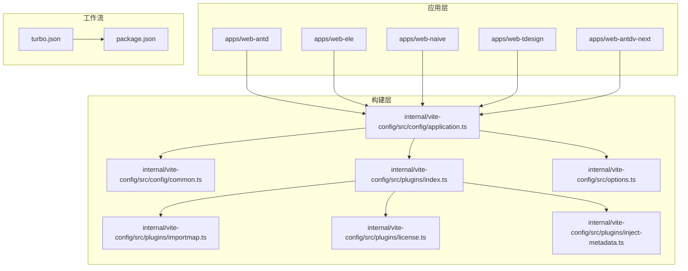
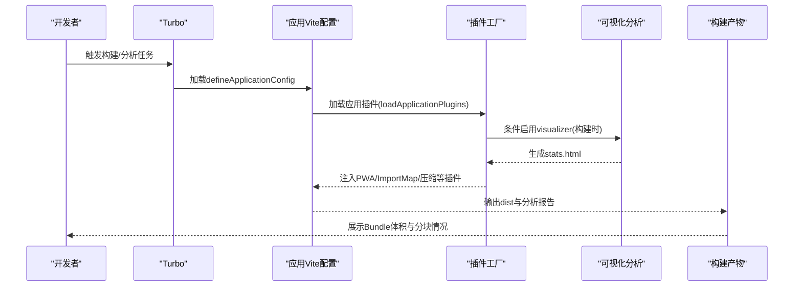
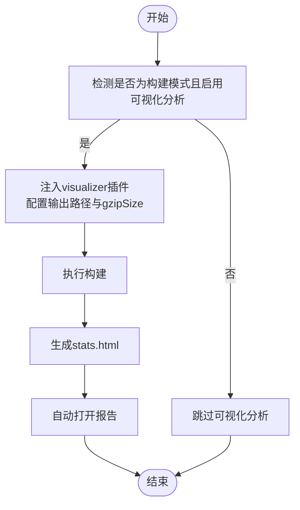
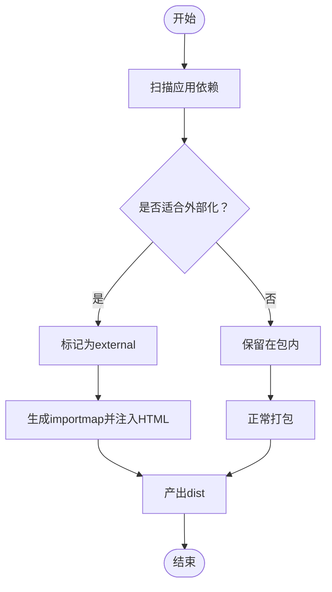
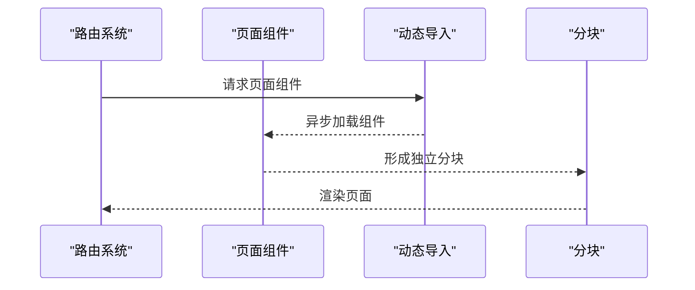
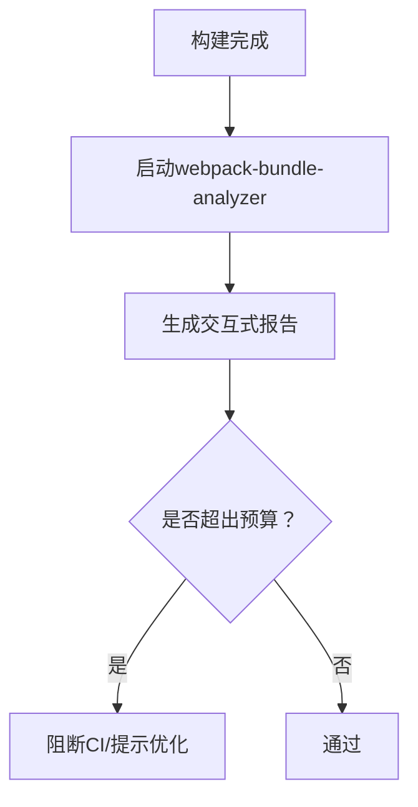
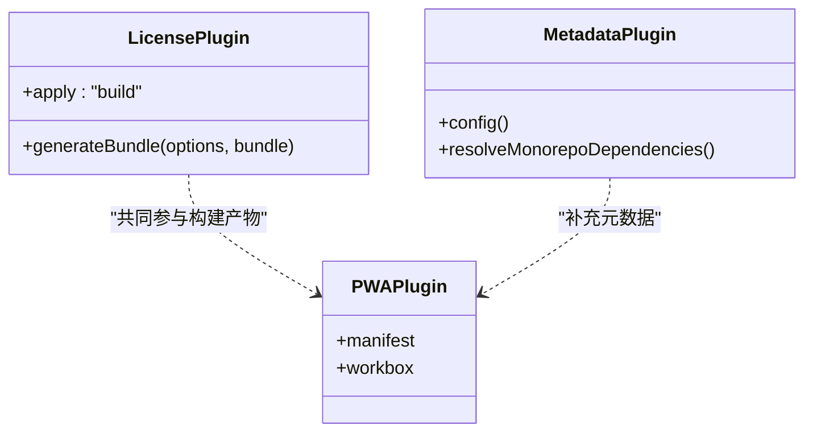
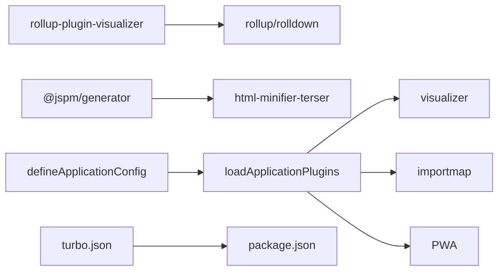

# Bundle分析与优化

<cite>
**本文引用的文件**
- [package.json](file://package.json)
- [turbo.json](file://turbo.json)
- [internal/vite-config/src/index.ts](file://internal/vite-config/src/index.ts)
- [internal/vite-config/src/config/application.ts](file://internal/vite-config/src/config/application.ts)
- [internal/vite-config/src/config/common.ts](file://internal/vite-config/src/config/common.ts)
- [internal/vite-config/src/plugins/index.ts](file://internal/vite-config/src/plugins/index.ts)
- [internal/vite-config/src/options.ts](file://internal/vite-config/src/options.ts)
- [internal/vite-config/src/plugins/importmap.ts](file://internal/vite-config/src/plugins/importmap.ts)
- [internal/vite-config/src/plugins/license.ts](file://internal/vite-config/src/plugins/license.ts)
- [internal/vite-config/src/plugins/inject-metadata.ts](file://internal/vite-config/src/plugins/inject-metadata.ts)
- [internal/vite-config/package.json](file://internal/vite-config/package.json)
- [pnpm-lock.yaml](file://pnpm-lock.yaml)
- [apps/web-antd/vite.config.ts](file://apps/web-antd/vite.config.ts)
</cite>

## 目录
1. [简介](#简介)
2. [项目结构](#项目结构)
3. [核心组件](#核心组件)
4. [架构总览](#架构总览)
5. [详细组件分析](#详细组件分析)
6. [依赖关系分析](#依赖关系分析)
7. [性能考量](#性能考量)
8. [故障排查指南](#故障排查指南)
9. [结论](#结论)
10. [附录](#附录)

## 简介
本指南聚焦于Vben Admin在多应用（web-antd、web-ele、web-naive、web-tdesign、web-antdv-next）场景下的Bundle分析与优化实践。内容涵盖：
- 使用rollup-plugin-visualizer进行Bundle可视化分析与报告解读
- 第三方依赖优化：外部化、按需引入、替代方案选择
- 代码分割最佳实践：路由级、组件级与动态导入
- Tree Shaking优化：无用代码删除与副作用处理
- Bundle体积分析：webpack-bundle-analyzer的使用与体积预算设置
- 实战案例：从分析到优化再到效果验证的完整闭环

## 项目结构
Vben Admin采用Monorepo与Turbo并行构建，各Web应用共享统一的Vite配置与插件体系。关键结构如下：
- 应用层：apps/web-*/（多UI框架适配）
- 构建层：internal/vite-config（统一的Vite配置与插件工厂）
- 工作流：turbo.json（任务编排与缓存）
- 脚本：package.json（构建与分析脚本）

图表来源
- [internal/vite-config/src/config/application.ts:17-99](file://internal/vite-config/src/config/application.ts#L17-L99)
- [internal/vite-config/src/config/common.ts:3-11](file://internal/vite-config/src/config/common.ts#L3-L11)
- [internal/vite-config/src/plugins/index.ts:94-223](file://internal/vite-config/src/plugins/index.ts#L94-L223)
- [internal/vite-config/src/options.ts:28-45](file://internal/vite-config/src/options.ts#L28-L45)
- [turbo.json:15-32](file://turbo.json#L15-L32)
- [package.json:27-66](file://package.json#L27-L66)

章节来源
- [package.json:27-66](file://package.json#L27-L66)
- [turbo.json:15-32](file://turbo.json#L15-L32)

## 核心组件
- 统一应用配置：defineApplicationConfig负责合并通用配置与应用配置，注入插件、服务器与构建参数。
- 插件工厂：loadApplicationPlugins按条件加载插件，包括rollup-plugin-visualizer、压缩、PWA、ImportMap等。
- 体积预算与警告阈值：通过chunkSizeWarningLimit与reportCompressedSize控制体积报告行为。
- 外部化与CDN：ImportMap插件在构建阶段解析依赖并注入HTML，实现第三方库外部化。

章节来源
- [internal/vite-config/src/config/application.ts:17-99](file://internal/vite-config/src/config/application.ts#L17-L99)
- [internal/vite-config/src/plugins/index.ts:94-223](file://internal/vite-config/src/plugins/index.ts#L94-L223)
- [internal/vite-config/src/config/common.ts:3-11](file://internal/vite-config/src/config/common.ts#L3-L11)
- [internal/vite-config/src/plugins/importmap.ts:44-153](file://internal/vite-config/src/plugins/importmap.ts#L44-L153)

## 架构总览
下图展示了从应用入口到最终产物的关键流程，以及Bundle分析与优化的切入点。

图表来源
- [internal/vite-config/src/config/application.ts:17-99](file://internal/vite-config/src/config/application.ts#L17-L99)
- [internal/vite-config/src/plugins/index.ts:79-87](file://internal/vite-config/src/plugins/index.ts#L79-L87)

## 详细组件分析

### 组件A：Bundle可视化分析（rollup-plugin-visualizer）
- 启用方式：在应用插件加载时，当isBuild为true且visualizer为真值时，注入visualizer插件。
- 配置要点：
  - 输出文件：默认生成至node_modules/.cache/visualizer/stats.html
  - 压缩尺寸：开启gzipSize以更贴近线上体积
  - 自动打开：open: true便于快速查看
- 报告解读建议：
  - 关注“入口”与“分块”的大小占比，定位大体积模块
  - 对比不同优化策略前后的报告，评估收益
  - 结合路由/组件维度拆分，识别可进一步拆分的模块

图表来源
- [internal/vite-config/src/plugins/index.ts:79-87](file://internal/vite-config/src/plugins/index.ts#L79-L87)

章节来源
- [internal/vite-config/src/plugins/index.ts:79-87](file://internal/vite-config/src/plugins/index.ts#L79-L87)

### 组件B：第三方依赖优化（外部化、按需引入、替代方案）
- 外部化（CDN/ImportMap）：
  - 在构建阶段通过importmap插件解析指定依赖，标记为external，并在HTML中注入importmap。
  - 默认提供esm.sh/jspm.io/jsdelivr等CDN源，便于稳定引入。
- 替代方案：
  - 优先选择ESM友好的CDN源；若网络不稳定，可关闭ImportMap或切换源。
- 按需引入：
  - 将大型第三方库（如dayjs）纳入ImportMap，减少打包体积。
  - 对UI框架组件库采用按需导入策略，避免整包引入。

图表来源
- [internal/vite-config/src/plugins/importmap.ts:100-153](file://internal/vite-config/src/plugins/importmap.ts#L100-L153)
- [internal/vite-config/src/options.ts:28-45](file://internal/vite-config/src/options.ts#L28-L45)

章节来源
- [internal/vite-config/src/plugins/importmap.ts:44-153](file://internal/vite-config/src/plugins/importmap.ts#L44-L153)
- [internal/vite-config/src/options.ts:28-45](file://internal/vite-config/src/options.ts#L28-L45)

### 组件C：代码分割最佳实践
- 路由级分割：
  - 将路由对应的页面组件使用动态导入，实现按需加载与分块。
  - 结合路由模块合并逻辑，确保动态导入的模块能被正确识别与打包。
- 组件级分割：
  - 对重型组件（如表格、编辑器）采用动态导入，仅在使用时加载。
- 动态导入的合理使用：
  - 避免过度拆分导致请求数过多；结合visualizer报告优化边界。
  - 对首屏关键路径保持较小分块，非关键路径延后加载。

图表来源
- [packages/utils/src/helpers/__tests__/merge-route-modules.test.ts:10-47](file://packages/utils/src/helpers/__tests__/merge-route-modules.test.ts#L10-L47)

章节来源
- [packages/utils/src/helpers/__tests__/merge-route-modules.test.ts:10-47](file://packages/utils/src/helpers/__tests__/merge-route-modules.test.ts#L10-L47)

### 组件D：Tree Shaking优化
- 无用代码删除：
  - 使用ESM模块格式，确保静态导入/导出结构清晰。
  - 避免sideEffects导致摇树失效；对纯工具库保持无副作用。
- 副作用处理：
  - 在package.json中明确sideEffects白名单，仅保留必要的副作用文件。
  - 对样式文件与polyfill进行显式管理，避免被误判为副作用。

章节来源
- [internal/vite-config/src/plugins/license.ts:17-61](file://internal/vite-config/src/plugins/license.ts#L17-L61)

### 组件E：Bundle体积分析与预算
- webpack-bundle-analyzer集成建议：
  - 在本地开发或CI中运行分析器，生成交互式报告，定位大体积模块。
  - 设置体积预算阈值，超过阈值触发失败，保障体积健康。
- 体积预算设置：
  - 通过chunkSizeWarningLimit控制警告阈值，结合reportCompressedSize输出压缩后体积。
  - 对关键分块设定上限，避免影响首屏性能。

图表来源
- [internal/vite-config/src/config/common.ts:3-11](file://internal/vite-config/src/config/common.ts#L3-L11)

章节来源
- [internal/vite-config/src/config/common.ts:3-11](file://internal/vite-config/src/config/common.ts#L3-L11)

### 组件F：构建产物与元数据注入
- 版权与元数据：
  - 构建完成后为入口分块注入版权信息与版本元数据，便于追踪与合规。
- PWA与压缩：
  - PWA插件按需注入清单与注册逻辑；压缩插件可选开启brotli/gzip。

图表来源
- [internal/vite-config/src/plugins/license.ts:17-61](file://internal/vite-config/src/plugins/license.ts#L17-L61)
- [internal/vite-config/src/plugins/inject-metadata.ts:70-86](file://internal/vite-config/src/plugins/inject-metadata.ts#L70-L86)

章节来源
- [internal/vite-config/src/plugins/license.ts:17-61](file://internal/vite-config/src/plugins/license.ts#L17-L61)
- [internal/vite-config/src/plugins/inject-metadata.ts:70-86](file://internal/vite-config/src/plugins/inject-metadata.ts#L70-L86)

## 依赖关系分析
- 插件依赖：
  - visualizer依赖rollup/rolldown生态，版本需与构建器匹配。
  - ImportMap插件依赖@jspm/generator与html-minifier-terser。
- 应用与配置耦合：
  - defineApplicationConfig统一注入插件与构建参数，降低应用层重复配置。
- 任务编排：
  - turbo.json定义build与build:analyze任务，确保依赖顺序与缓存命中。

图表来源
- [pnpm-lock.yaml:9687-9711](file://pnpm-lock.yaml#L9687-L9711)
- [internal/vite-config/src/plugins/index.ts:14-30](file://internal/vite-config/src/plugins/index.ts#L14-L30)
- [turbo.json:15-32](file://turbo.json#L15-L32)
- [package.json:27-66](file://package.json#L27-L66)

章节来源
- [pnpm-lock.yaml:9687-9711](file://pnpm-lock.yaml#L9687-L9711)
- [internal/vite-config/src/plugins/index.ts:14-30](file://internal/vite-config/src/plugins/index.ts#L14-L30)
- [turbo.json:15-32](file://turbo.json#L15-L32)
- [package.json:27-66](file://package.json#L27-L66)

## 性能考量
- 首屏优化：
  - 路由与组件动态导入，减少初始包体；关键资源内联或预加载。
- 缓存与压缩：
  - 开启brotli/gzip压缩，提升传输效率；合理命名与哈希策略提升缓存命中。
- 体积预算：
  - 设定chunkSizeWarningLimit与报告策略，持续监控体积变化。
- 外部化策略：
  - 对稳定、体积大的依赖采用CDN外部化，显著降低包体。

## 故障排查指南
- 可视化分析报告未生成：
  - 确认构建模式与visualizer开关；检查输出路径权限。
- ImportMap安装失败：
  - 检查CDN可用性与网络；必要时关闭ImportMap或切换源。
- 体积异常增长：
  - 使用webpack-bundle-analyzer定位大模块；审查Tree Shaking与副作用配置。
- CI构建失败：
  - 设置体积阈值与失败策略；对超限变更进行拦截与回滚。

章节来源
- [internal/vite-config/src/plugins/importmap.ts:138-144](file://internal/vite-config/src/plugins/importmap.ts#L138-L144)

## 结论
通过统一的Vite配置与插件体系，Vben Admin在多应用场景下实现了可复用的Bundle分析与优化能力。结合可视化分析、外部化、代码分割与Tree Shaking，可在保证功能完整性的同时显著优化包体与性能。建议在CI中强制体积预算与分析报告，形成持续优化闭环。

## 附录

### 实战案例：从分析到优化再到效果验证
- 步骤一：启用可视化分析
  - 在应用插件配置中开启visualizer，构建后打开stats.html，记录当前分块与体积。
- 步骤二：识别大体积模块
  - 重点关注第三方库与重型组件；结合路由/组件维度定位。
- 步骤三：实施优化策略
  - 对可外部化的依赖启用ImportMap；对组件与路由采用动态导入；清理无用代码与副作用。
- 步骤四：效果验证
  - 再次运行可视化分析，对比前后报告；使用webpack-bundle-analyzer确认关键指标下降。
  - 在CI中设置体积阈值，确保回归问题及时发现。

章节来源
- [internal/vite-config/src/plugins/index.ts:79-87](file://internal/vite-config/src/plugins/index.ts#L79-L87)
- [internal/vite-config/src/plugins/importmap.ts:44-153](file://internal/vite-config/src/plugins/importmap.ts#L44-L153)
- [internal/vite-config/src/config/common.ts:3-11](file://internal/vite-config/src/config/common.ts#L3-L11)