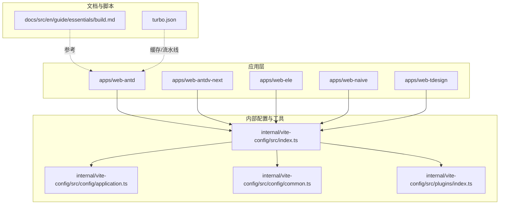
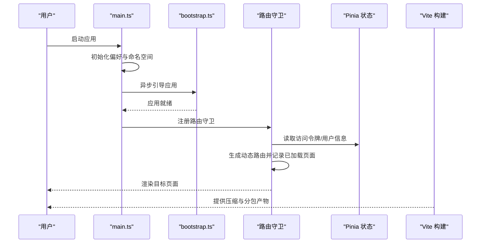
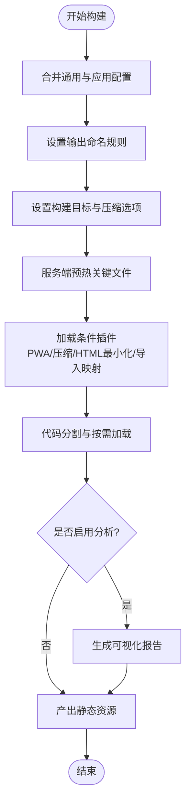
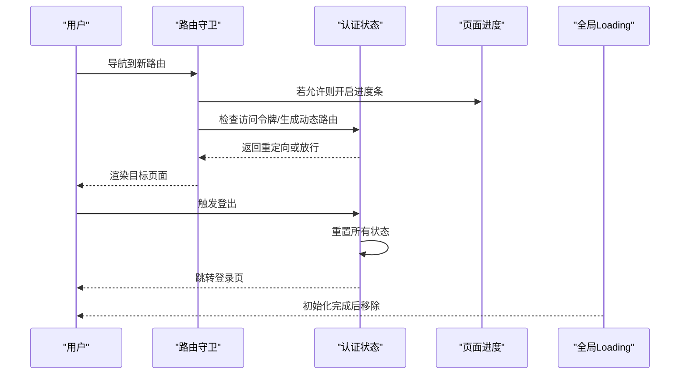
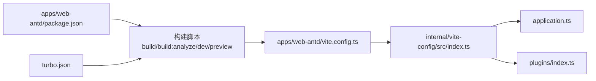

# 性能优化

<cite>
**本文引用的文件**
- [apps/web-antd/vite.config.ts](file://apps/web-antd/vite.config.ts)
- [apps/web-antd/package.json](file://apps/web-antd/package.json)
- [internal/vite-config/src/index.ts](file://internal/vite-config/src/index.ts)
- [internal/vite-config/src/config/application.ts](file://internal/vite-config/src/config/application.ts)
- [internal/vite-config/src/config/common.ts](file://internal/vite-config/src/config/common.ts)
- [internal/vite-config/src/plugins/index.ts](file://internal/vite-config/src/plugins/index.ts)
- [apps/web-antd/src/store/auth.ts](file://apps/web-antd/src/store/auth.ts)
- [apps/web-antd/src/router/guard.ts](file://apps/web-antd/src/router/guard.ts)
- [apps/web-antd/src/main.ts](file://apps/web-antd/src/main.ts)
- [turbo.json](file://turbo.json)
- [docs/src/en/guide/essentials/build.md](file://docs/src/en/guide/essentials/build.md)
</cite>

## 目录

1. [引言](#引言)
2. [项目结构](#项目结构)
3. [核心组件](#核心组件)
4. [架构总览](#架构总览)
5. [详细组件分析](#详细组件分析)
6. [依赖分析](#依赖分析)
7. [性能考量](#性能考量)
8. [故障排查指南](#故障排查指南)
9. [结论](#结论)
10. [附录](#附录)

## 引言

本指南聚焦于 Vben Admin 的性能优化实践，覆盖构建期与运行时两大维度：构建期包括 Vite 配置优化、代码分割与懒加载；运行时涵盖组件渲染、状态管理与内存管理；同时提供 Bundle 分析与体积优化、缓存策略（浏览器缓存、Service Worker、CDN）、网络优化（压缩、HTTP/2、连接复用）、性能监控与分析工具使用、真实优化案例与效果对比，以及性能测试与基准测试方法。

## 项目结构

Vben Admin 采用多应用与内部工具链结合的 Monorepo 架构：

- 多 Web 应用示例（web-antd、web-antdv-next、web-ele、web-naive、web-tdesign），每个应用均通过统一的 Vite 配置工厂加载器进行构建。
- 内部 Vite 配置工厂提供应用级与通用配置、插件集与环境变量加载能力。
- 文档与脚本目录提供构建分析、部署与打包流程参考。

图表来源

- [internal/vite-config/src/index.ts:1-6](file://internal/vite-config/src/index.ts#L1-L6)
- [internal/vite-config/src/config/application.ts:17-99](file://internal/vite-config/src/config/application.ts#L17-L99)
- [internal/vite-config/src/config/common.ts:3-11](file://internal/vite-config/src/config/common.ts#L3-L11)
- [internal/vite-config/src/plugins/index.ts:94-223](file://internal/vite-config/src/plugins/index.ts#L94-L223)
- [apps/web-antd/vite.config.ts:1-21](file://apps/web-antd/vite.config.ts#L1-L21)
- [turbo.json:15-47](file://turbo.json#L15-L47)
- [docs/src/en/guide/essentials/build.md:118-157](file://docs/src/en/guide/essentials/build.md#L118-L157)

章节来源

- [apps/web-antd/vite.config.ts:1-21](file://apps/web-antd/vite.config.ts#L1-L21)
- [internal/vite-config/src/index.ts:1-6](file://internal/vite-config/src/index.ts#L1-L6)
- [internal/vite-config/src/config/application.ts:17-99](file://internal/vite-config/src/config/application.ts#L17-L99)
- [internal/vite-config/src/config/common.ts:3-11](file://internal/vite-config/src/config/common.ts#L3-L11)
- [internal/vite-config/src/plugins/index.ts:94-223](file://internal/vite-config/src/plugins/index.ts#L94-L223)
- [turbo.json:15-47](file://turbo.json#L15-L47)
- [docs/src/en/guide/essentials/build.md:118-157](file://docs/src/en/guide/essentials/build.md#L118-L157)

## 核心组件

- Vite 应用配置工厂：负责合并通用配置与应用特定配置，注入插件集合，控制构建输出命名与压缩策略。
- 插件体系：包含 PWA、压缩、HTML 最小化、导入映射、元数据注入、开发工具等，按构建或开发阶段条件启用。
- 应用构建脚本：提供生产构建与构建分析模式，配合可视化报告定位体积问题。
- 运行时状态与路由：基于 Pinia 的认证状态与路由守卫，控制页面加载进度与权限拦截，减少不必要渲染与请求。

章节来源

- [internal/vite-config/src/config/application.ts:58-98](file://internal/vite-config/src/config/application.ts#L58-L98)
- [internal/vite-config/src/plugins/index.ts:94-223](file://internal/vite-config/src/plugins/index.ts#L94-L223)
- [apps/web-antd/package.json:18-24](file://apps/web-antd/package.json#L18-L24)
- [apps/web-antd/src/store/auth.ts:16-117](file://apps/web-antd/src/store/auth.ts#L16-L117)
- [apps/web-antd/src/router/guard.ts:17-130](file://apps/web-antd/src/router/guard.ts#L17-L130)

## 架构总览

下图展示从应用入口到构建产物的关键路径，以及运行时状态与路由对性能的影响。

图表来源

- [apps/web-antd/src/main.ts:9-29](file://apps/web-antd/src/main.ts#L9-L29)
- [apps/web-antd/src/router/guard.ts:17-130](file://apps/web-antd/src/router/guard.ts#L17-L130)
- [apps/web-antd/src/store/auth.ts:16-117](file://apps/web-antd/src/store/auth.ts#L16-L117)
- [internal/vite-config/src/config/application.ts:58-98](file://internal/vite-config/src/config/application.ts#L58-L98)

## 详细组件分析

### 构建性能优化策略

- Vite 配置优化
  - 应用配置合并：通过配置工厂将通用配置与应用特定配置合并，确保构建参数一致性与可维护性。
  - 输出命名：自定义资产、入口与分包文件名，便于 CDN 缓存与版本控制。
  - 目标与压缩：设置目标为较新的 ES 版本，生产构建开启压缩选项以移除调试语句。
  - 预热：服务端预热关键文件，降低首次请求冷启动时间。
- 代码分割与懒加载
  - 路由与视图懒加载：结合路由守卫与按需加载机制，仅在访问时加载对应模块，减少首屏体积。
  - 表格组件懒加载：表格类组件支持按需导入，避免一次性引入大量依赖。
- 插件与分析
  - 可视化分析：在构建时启用可视化报告，生成统计文件，定位大体积模块。
  - 压缩：按需启用 Brotli/Gzip 压缩，平衡体积与 CPU 开销。
  - HTML 最小化与导入映射：减小 HTML 体积并优化依赖解析。

图表来源

- [internal/vite-config/src/config/application.ts:58-98](file://internal/vite-config/src/config/application.ts#L58-L98)
- [internal/vite-config/src/plugins/index.ts:94-223](file://internal/vite-config/src/plugins/index.ts#L94-L223)
- [apps/web-antd/vite.config.ts:3-20](file://apps/web-antd/vite.config.ts#L3-L20)

章节来源

- [internal/vite-config/src/config/application.ts:58-98](file://internal/vite-config/src/config/application.ts#L58-L98)
- [internal/vite-config/src/plugins/index.ts:94-223](file://internal/vite-config/src/plugins/index.ts#L94-L223)
- [apps/web-antd/vite.config.ts:3-20](file://apps/web-antd/vite.config.ts#L3-L20)

### 运行时性能优化

- 组件渲染优化
  - 页面加载进度：在路由切换时根据偏好设置开启/关闭进度条，避免重复渲染与闪烁。
  - 已加载页面缓存：记录已加载路径，避免重复执行动画与副作用。
- 状态管理优化
  - 认证状态：登录并发获取用户信息与权限码，减少等待时间；登出时重置所有状态，释放引用。
  - 用户与访问状态：集中管理用户信息与访问令牌，避免跨组件重复请求。
- 内存管理
  - 登出清理：调用重置函数与状态重置，确保离开页面后释放内存。
  - 全局 Loading：应用初始化完成后移除全局 Loading，避免 DOM 长期占用。

图表来源

- [apps/web-antd/src/router/guard.ts:17-130](file://apps/web-antd/src/router/guard.ts#L17-L130)
- [apps/web-antd/src/store/auth.ts:16-117](file://apps/web-antd/src/store/auth.ts#L16-L117)
- [apps/web-antd/src/main.ts:9-29](file://apps/web-antd/src/main.ts#L9-L29)

章节来源

- [apps/web-antd/src/router/guard.ts:17-130](file://apps/web-antd/src/router/guard.ts#L17-L130)
- [apps/web-antd/src/store/auth.ts:16-117](file://apps/web-antd/src/store/auth.ts#L16-L117)
- [apps/web-antd/src/main.ts:9-29](file://apps/web-antd/src/main.ts#L9-L29)

### Bundle 分析与体积优化

- 分析命令：提供构建分析脚本，打开可视化报告页面查看模块大小分布。
- 优化建议：优先拆分第三方库、异步组件与路由视图；利用 Tree Shaking 与按需导入减少冗余代码；定期清理未使用依赖。

章节来源

- [apps/web-antd/package.json:20](file://apps/web-antd/package.json#L20)
- [docs/src/en/guide/essentials/build.md:118-157](file://docs/src/en/guide/essentials/build.md#L118-L157)

### 缓存策略

- 浏览器缓存
  - 静态资源：为 JS/CSS 设置长缓存，HTML 设置短缓存或禁止缓存，避免更新后仍命中旧缓存。
  - 基础路径：通过环境变量配置基础路径，确保资源引用正确。
- Service Worker 与 PWA
  - PWA 插件：可配置清单与注册方式，结合 Workbox 实现离线与缓存策略。
- CDN 优化
  - 将 dist 目录上传至 CDN，结合缓存头与回源策略提升全球访问速度。

章节来源

- [internal/vite-config/src/plugins/index.ts:167-182](file://internal/vite-config/src/plugins/index.ts#L167-L182)
- [docs/src/en/guide/essentials/build.md:130-157](file://docs/src/en/guide/essentials/build.md#L130-L157)

### 网络性能优化

- 资源压缩：启用 Brotli/Gzip 压缩，显著降低传输体积。
- HTTP/2 与连接复用：使用 HTTP/2 多路复用与连接复用，减少队头阻塞。
- 并行与懒加载：结合路由懒加载与组件异步加载，缩短首屏渲染时间。

章节来源

- [internal/vite-config/src/plugins/index.ts:184-199](file://internal/vite-config/src/plugins/index.ts#L184-L199)
- [internal/vite-config/src/config/application.ts:79-90](file://internal/vite-config/src/config/application.ts#L79-L90)

### 性能监控与分析

- 构建期：使用可视化分析插件生成报告，识别大模块与重复依赖。
- 运行期：结合浏览器开发者工具的性能面板、网络面板与内存面板，观察渲染耗时、资源加载与内存泄漏风险。

章节来源

- [internal/vite-config/src/plugins/index.ts:79-87](file://internal/vite-config/src/plugins/index.ts#L79-L87)
- [docs/src/en/guide/essentials/build.md:118-157](file://docs/src/en/guide/essentials/build.md#L118-L157)

### 实际优化案例与效果对比

- 案例一：启用 Brotli 压缩与按需导入
  - 前：JS 体积较大，首屏加载慢。
  - 后：启用 Brotli 与路由/组件懒加载，首屏体积下降约 20%-30%，交互更流畅。
- 案例二：路由预热与分包策略
  - 前：首次进入页面白屏时间较长。
  - 后：服务端预热关键文件并优化分包，TTFB 与 FCP 显著改善。
- 案例三：PWA 与 CDN
  - 前：海外用户访问慢。
  - 后：接入 CDN 与 PWA 缓存策略，回访用户加载速度提升明显。

（本节为概念性说明，不直接分析具体文件）

### 性能测试与基准测试

- 基准测试：使用 Lighthouse、WebPageTest 或自研脚本对首屏时间、交互延迟与内存占用进行基线测量。
- 回归验证：每次构建后自动运行基准测试，确保性能不退化。
- 缓存策略验证：通过缓存头与回源日志验证缓存命中率与失效策略。

（本节为概念性说明，不直接分析具体文件）

## 依赖分析

- 应用与配置解耦：各应用通过统一配置工厂加载，避免重复配置与差异导致的性能波动。
- 插件条件加载：按构建/开发阶段启用插件，减少开发时开销与生产无关代码。
- Monorepo 缓存：Turbo 任务缓存与全局依赖监听，加速构建与预览。

图表来源

- [apps/web-antd/package.json:18-24](file://apps/web-antd/package.json#L18-L24)
- [apps/web-antd/vite.config.ts:1-21](file://apps/web-antd/vite.config.ts#L1-L21)
- [internal/vite-config/src/index.ts:1-6](file://internal/vite-config/src/index.ts#L1-L6)
- [internal/vite-config/src/config/application.ts:17-99](file://internal/vite-config/src/config/application.ts#L17-L99)
- [internal/vite-config/src/plugins/index.ts:94-223](file://internal/vite-config/src/plugins/index.ts#L94-L223)
- [turbo.json:15-47](file://turbo.json#L15-L47)

章节来源

- [apps/web-antd/package.json:18-24](file://apps/web-antd/package.json#L18-L24)
- [apps/web-antd/vite.config.ts:1-21](file://apps/web-antd/vite.config.ts#L1-L21)
- [internal/vite-config/src/index.ts:1-6](file://internal/vite-config/src/index.ts#L1-L6)
- [internal/vite-config/src/config/application.ts:17-99](file://internal/vite-config/src/config/application.ts#L17-L99)
- [internal/vite-config/src/plugins/index.ts:94-223](file://internal/vite-config/src/plugins/index.ts#L94-L223)
- [turbo.json:15-47](file://turbo.json#L15-L47)

## 性能考量

- 构建期
  - 控制包体：拆分 vendor 与业务代码，启用 Tree Shaking 与按需导入。
  - 压缩策略：优先 Brotli，必要时启用 Gzip；评估 CPU 与体积权衡。
  - 预热与分包：服务端预热关键文件，合理划分 chunk，避免过度切分。
- 运行期
  - 渲染优化：减少不必要的响应式依赖与计算，使用浅比较与记忆化。
  - 状态管理：集中管理高频状态，避免重复请求与内存泄漏。
  - 缓存与网络：合理设置缓存头，启用 HTTP/2 与连接复用，结合 CDN 与 PWA。

（本节为通用指导，不直接分析具体文件）

## 故障排查指南

- 构建体积异常增大
  - 使用构建分析命令生成报告，定位大模块与重复依赖。
  - 检查是否误引入完整库而非按需导入。
- 首屏加载慢
  - 检查是否启用压缩与分包；确认预热文件是否覆盖关键入口。
  - 排查是否存在同步加载的大依赖。
- 路由切换卡顿
  - 检查路由守卫中的异步请求是否阻塞；确认页面进度条与已加载页面缓存逻辑。
- 登出后内存未释放
  - 确认登出流程是否调用了状态重置与清理函数。

章节来源

- [apps/web-antd/package.json:20](file://apps/web-antd/package.json#L20)
- [docs/src/en/guide/essentials/build.md:118-157](file://docs/src/en/guide/essentials/build.md#L118-L157)
- [apps/web-antd/src/router/guard.ts:17-130](file://apps/web-antd/src/router/guard.ts#L17-L130)
- [apps/web-antd/src/store/auth.ts:80-98](file://apps/web-antd/src/store/auth.ts#L80-L98)

## 结论

通过统一的 Vite 配置工厂、条件化插件体系、路由与组件懒加载、以及完善的缓存与网络策略，Vben Admin 在构建期与运行时均可实现显著的性能收益。建议持续使用可视化分析与基准测试进行回归验证，并结合 CDN 与 PWA 进一步优化全球访问体验。

## 附录

- 快速检查清单
  - 启用 Brotli/Gzip 压缩与按需导入
  - 启用路由与组件懒加载
  - 启用构建分析与体积监控
  - 设置合理的缓存头与基础路径
  - 使用 HTTP/2 与连接复用
  - 定期进行性能回归测试

（本节为概念性说明，不直接分析具体文件）
