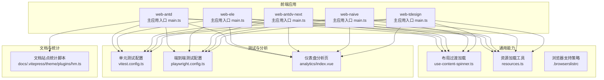
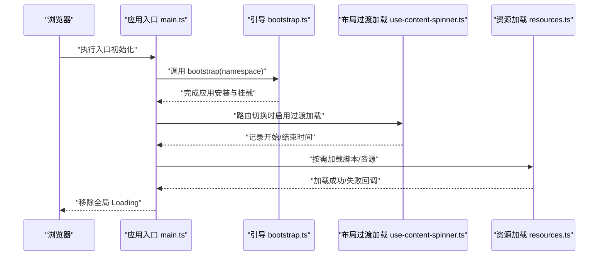
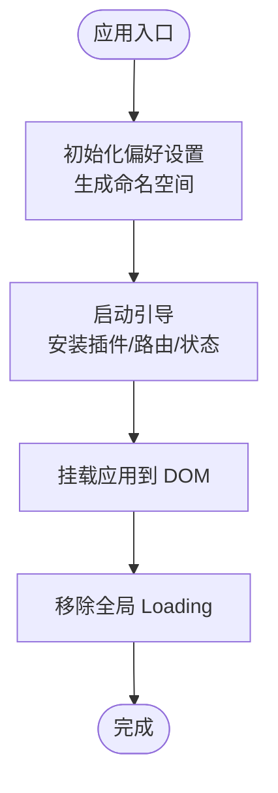
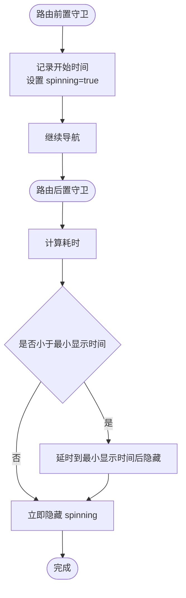
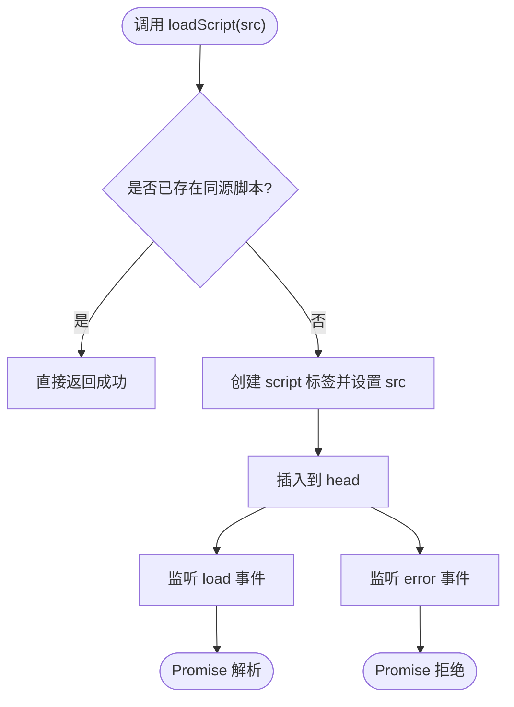
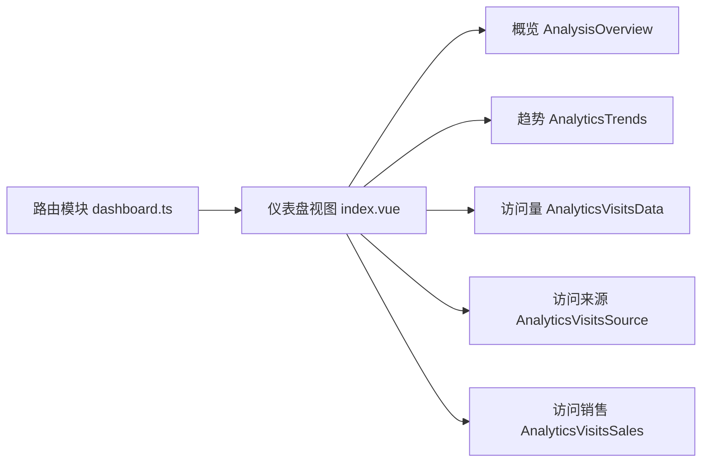
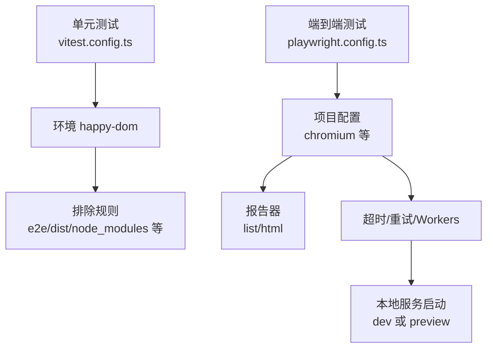
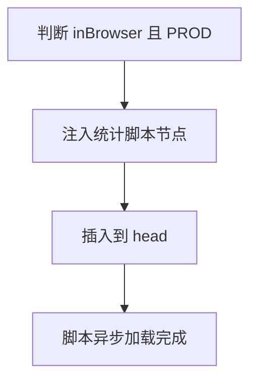
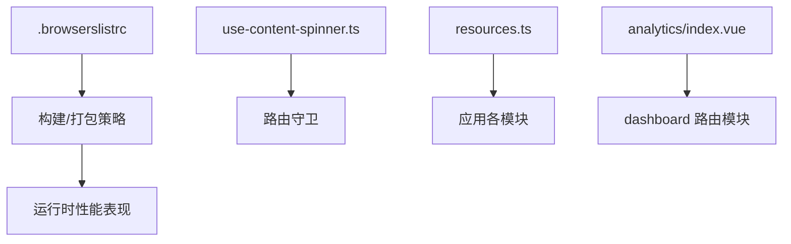

# 性能监控与分析

<cite>
**本文引用的文件**
- [package.json](file://package.json)
- [vitest.config.ts](file://vitest.config.ts)
- [playground/playwright.config.ts](file://playground/playwright.config.ts)
- [apps/web-antd/src/main.ts](file://apps/web-antd/src/main.ts)
- [apps/web-antd/src/bootstrap.ts](file://apps/web-antd/src/bootstrap.ts)
- [packages/effects/layouts/src/basic/content/use-content-spinner.ts](file://packages/effects/layouts/src/basic/content/use-content-spinner.ts)
- [packages/@core/base/shared/src/utils/resources.ts](file://packages/@core/base/shared/src/utils/resources.ts)
- [apps/web-antd/src/views/dashboard/analytics/index.vue](file://apps/web-antd/src/views/dashboard/analytics/index.vue)
- [apps/web-ele/src/views/dashboard/analytics/index.vue](file://apps/web-ele/src/views/dashboard/analytics/index.vue)
- [apps/web-antdv-next/src/views/dashboard/analytics/index.vue](file://apps/web-antdv-next/src/views/dashboard/analytics/index.vue)
- [apps/web-naive/src/views/dashboard/analytics/index.vue](file://apps/web-naive/src/views/dashboard/analytics/index.vue)
- [apps/web-tdesign/src/views/dashboard/analytics/index.vue](file://apps/web-tdesign/src/views/dashboard/analytics/index.vue)
- [playground/src/router/routes/modules/dashboard.ts](file://playground/src/router/routes/modules/dashboard.ts)
- [.browserslistrc](file://.browserslistrc)
- [docs/.vitepress/theme/plugins/hm.ts](file://docs/.vitepress/theme/plugins/hm.ts)
- [apps/backend-mock/api/system/dict/list.ts](file://apps/backend-mock/api/system/dict/list.ts)
- [apps/backend-mock/api/dev/versions/statistics.ts](file://apps/backend-mock/api/dev/versions/statistics.ts)
</cite>

## 目录

1. [引言](#引言)
2. [项目结构](#项目结构)
3. [核心组件](#核心组件)
4. [架构总览](#架构总览)
5. [详细组件分析](#详细组件分析)
6. [依赖分析](#依赖分析)
7. [性能考量](#性能考量)
8. [故障排查指南](#故障排查指南)
9. [结论](#结论)
10. [附录](#附录)

## 引言

本指南围绕 Vben Admin 的前端性能监控与分析体系展开，目标是帮助读者建立从指标定义、工具集成、数据分析到测试与优化闭环的完整能力。内容涵盖：

- 核心 Web Vitals 指标（FMP、FCP、LCP、CLS）的定义与测量思路
- 性能监控工具集成（如文档站点统计脚本）
- 性能数据分析方法（趋势、异常、根因）
- 性能测试实践（基准、压力、回归）
- 优化效果评估（A/B 对比、前后对比）
- 实际配置示例与分析案例

## 项目结构

本仓库采用多包/多应用的 Monorepo 架构，前端应用位于 apps 下的不同 UI 框架版本中，测试与分析能力分布在测试配置、布局加载与资源加载工具、仪表盘分析页等模块中。

图表来源

- [apps/web-antd/src/main.ts:1-32](file://apps/web-antd/src/main.ts#L1-L32)
- [packages/effects/layouts/src/basic/content/use-content-spinner.ts:1-50](file://packages/effects/layouts/src/basic/content/use-content-spinner.ts#L1-L50)
- [packages/@core/base/shared/src/utils/resources.ts:1-21](file://packages/@core/base/shared/src/utils/resources.ts#L1-L21)
- [vitest.config.ts:1-29](file://vitest.config.ts#L1-L29)
- [playground/playwright.config.ts:1-109](file://playground/playwright.config.ts#L1-L109)
- [apps/web-antd/src/views/dashboard/analytics/index.vue:66-90](file://apps/web-antd/src/views/dashboard/analytics/index.vue#L66-L90)
- [docs/.vitepress/theme/plugins/hm.ts:1-28](file://docs/.vitepress/theme/plugins/hm.ts#L1-L28)

章节来源

- [package.json:1-109](file://package.json#L1-L109)
- [apps/web-antd/src/main.ts:1-32](file://apps/web-antd/src/main.ts#L1-L32)
- [packages/effects/layouts/src/basic/content/use-content-spinner.ts:1-50](file://packages/effects/layouts/src/basic/content/use-content-spinner.ts#L1-L50)
- [packages/@core/base/shared/src/utils/resources.ts:1-21](file://packages/@core/base/shared/src/utils/resources.ts#L1-L21)
- [vitest.config.ts:1-29](file://vitest.config.ts#L1-L29)
- [playground/playwright.config.ts:1-109](file://playground/playwright.config.ts#L1-L109)
- [apps/web-antd/src/views/dashboard/analytics/index.vue:66-90](file://apps/web-antd/src/views/dashboard/analytics/index.vue#L66-L90)
- [.browserslistrc:1-4](file://.browserslistrc#L1-L4)
- [docs/.vitepress/theme/plugins/hm.ts:1-28](file://docs/.vitepress/theme/plugins/hm.ts#L1-L28)

## 核心组件

- 应用初始化与全局加载控制
  - 主入口负责偏好设置初始化、应用启动与全局 Loading 销毁，确保首屏渲染体验可控。
  - 布局层通过过渡加载钩子记录路由切换耗时，结合性能计时可作为内部性能观测基础。
- 资源加载工具
  - 提供按需加载脚本的封装，避免重复注入与错误处理，有助于减少首屏阻塞与提升稳定性。
- 测试与分析
  - 单元测试与端到端测试配置为性能回归与端到端体验验证提供基础。
  - 多套 UI 框架的仪表盘分析页模板，便于扩展可视化指标面板。
- 文档站点统计
  - 文档站点集成百度统计脚本，体现外部统计工具接入方式，可迁移至生产前端应用。

章节来源

- [apps/web-antd/src/main.ts:1-32](file://apps/web-antd/src/main.ts#L1-L32)
- [apps/web-antd/src/bootstrap.ts:1-85](file://apps/web-antd/src/bootstrap.ts#L1-L85)
- [packages/effects/layouts/src/basic/content/use-content-spinner.ts:1-50](file://packages/effects/layouts/src/basic/content/use-content-spinner.ts#L1-L50)
- [packages/@core/base/shared/src/utils/resources.ts:1-21](file://packages/@core/base/shared/src/utils/resources.ts#L1-L21)
- [vitest.config.ts:1-29](file://vitest.config.ts#L1-L29)
- [playground/playwright.config.ts:1-109](file://playground/playwright.config.ts#L1-L109)
- [apps/web-antd/src/views/dashboard/analytics/index.vue:66-90](file://apps/web-antd/src/views/dashboard/analytics/index.vue#L66-L90)
- [docs/.vitepress/theme/plugins/hm.ts:1-28](file://docs/.vitepress/theme/plugins/hm.ts#L1-L28)

## 架构总览

下图展示了前端应用在启动阶段的关键路径，以及与测试、分析、文档统计的关联关系。

图表来源

- [apps/web-antd/src/main.ts:1-32](file://apps/web-antd/src/main.ts#L1-L32)
- [apps/web-antd/src/bootstrap.ts:1-85](file://apps/web-antd/src/bootstrap.ts#L1-L85)
- [packages/effects/layouts/src/basic/content/use-content-spinner.ts:1-50](file://packages/effects/layouts/src/basic/content/use-content-spinner.ts#L1-L50)
- [packages/@core/base/shared/src/utils/resources.ts:1-21](file://packages/@core/base/shared/src/utils/resources.ts#L1-L21)

## 详细组件分析

### 组件一：应用初始化与全局加载控制

- 职责
  - 初始化项目偏好设置，生成命名空间以隔离数据
  - 启动应用并挂载，最后移除全局 Loading
- 关键点
  - 命名空间与版本环境组合，确保不同构建产物的配置隔离
  - 入口完成后统一销毁 Loading，避免首屏闪烁或残留

图表来源

- [apps/web-antd/src/main.ts:1-32](file://apps/web-antd/src/main.ts#L1-L32)
- [apps/web-antd/src/bootstrap.ts:1-85](file://apps/web-antd/src/bootstrap.ts#L1-L85)

章节来源

- [apps/web-antd/src/main.ts:1-32](file://apps/web-antd/src/main.ts#L1-L32)
- [apps/web-antd/src/bootstrap.ts:1-85](file://apps/web-antd/src/bootstrap.ts#L1-L85)

### 组件二：布局过渡加载与路由切换性能观测

- 职责
  - 在路由切换前后记录开始/结束时间，控制最小显示时长，平滑过渡动画
- 关键点
  - 使用高精度时间戳计算路由切换耗时
  - 与偏好设置联动，支持关闭过渡动画以降低开销

图表来源

- [packages/effects/layouts/src/basic/content/use-content-spinner.ts:1-50](file://packages/effects/layouts/src/basic/content/use-content-spinner.ts#L1-L50)

章节来源

- [packages/effects/layouts/src/basic/content/use-content-spinner.ts:1-50](file://packages/effects/layouts/src/basic/content/use-content-spinner.ts#L1-L50)

### 组件三：资源加载工具与脚本注入

- 职责
  - 封装动态脚本注入，避免重复加载与错误处理
- 关键点
  - 通过查询已存在节点避免重复注入
  - 成功/失败事件分离，便于后续埋点与告警

图表来源

- [packages/@core/base/shared/src/utils/resources.ts:1-21](file://packages/@core/base/shared/src/utils/resources.ts#L1-L21)

章节来源

- [packages/@core/base/shared/src/utils/resources.ts:1-21](file://packages/@core/base/shared/src/utils/resources.ts#L1-L21)

### 组件四：仪表盘分析页（多 UI 框架）

- 职责
  - 提供分析概览、趋势、访问量/来源/销售等卡片式图表容器
- 关键点
  - 作为性能数据可视化载体，可扩展接入 LCP/CLS/FCP 等指标面板
  - 与路由模块联动，支持固定标签页与缓存

图表来源

- [playground/src/router/routes/modules/dashboard.ts:1-39](file://playground/src/router/routes/modules/dashboard.ts#L1-L39)
- [apps/web-antd/src/views/dashboard/analytics/index.vue:66-90](file://apps/web-antd/src/views/dashboard/analytics/index.vue#L66-L90)
- [apps/web-ele/src/views/dashboard/analytics/index.vue:66-90](file://apps/web-ele/src/views/dashboard/analytics/index.vue#L66-L90)
- [apps/web-antdv-next/src/views/dashboard/analytics/index.vue:66-90](file://apps/web-antdv-next/src/views/dashboard/analytics/index.vue#L66-L90)
- [apps/web-naive/src/views/dashboard/analytics/index.vue:66-90](file://apps/web-naive/src/views/dashboard/analytics/index.vue#L66-L90)
- [apps/web-tdesign/src/views/dashboard/analytics/index.vue:66-90](file://apps/web-tdesign/src/views/dashboard/analytics/index.vue#L66-L90)

章节来源

- [playground/src/router/routes/modules/dashboard.ts:1-39](file://playground/src/router/routes/modules/dashboard.ts#L1-L39)
- [apps/web-antd/src/views/dashboard/analytics/index.vue:66-90](file://apps/web-antd/src/views/dashboard/analytics/index.vue#L66-L90)
- [apps/web-ele/src/views/dashboard/analytics/index.vue:66-90](file://apps/web-ele/src/views/dashboard/analytics/index.vue#L66-L90)
- [apps/web-antdv-next/src/views/dashboard/analytics/index.vue:66-90](file://apps/web-antdv-next/src/views/dashboard/analytics/index.vue#L66-L90)
- [apps/web-naive/src/views/dashboard/analytics/index.vue:66-90](file://apps/web-naive/src/views/dashboard/analytics/index.vue#L66-L90)
- [apps/web-tdesign/src/views/dashboard/analytics/index.vue:66-90](file://apps/web-tdesign/src/views/dashboard/analytics/index.vue#L66-L90)

### 组件五：测试配置与回归验证

- 单元测试
  - 使用 happy-dom 环境，排除 E2E 与构建目录，聚焦组件与工具函数测试
- 端到端测试
  - 配置 Chromium 设备集、报告器、超时与重试策略，支持本地开发与 CI 并行

图表来源

- [vitest.config.ts:1-29](file://vitest.config.ts#L1-L29)
- [playground/playwright.config.ts:1-109](file://playground/playwright.config.ts#L1-L109)

章节来源

- [vitest.config.ts:1-29](file://vitest.config.ts#L1-L29)
- [playground/playwright.config.ts:1-109](file://playground/playwright.config.ts#L1-L109)

### 组件六：文档站点统计脚本（外部统计接入参考）

- 职责
  - 在生产环境按需注入百度统计脚本，作为外部统计工具接入范例
- 关键点
  - 仅在浏览器且生产环境注入
  - 通过动态脚本节点避免重复注入

图表来源

- [docs/.vitepress/theme/plugins/hm.ts:1-28](file://docs/.vitepress/theme/plugins/hm.ts#L1-L28)

章节来源

- [docs/.vitepress/theme/plugins/hm.ts:1-28](file://docs/.vitepress/theme/plugins/hm.ts#L1-L28)

## 依赖分析

- 浏览器支持策略
  - 通过 browserslistrc 控制目标浏览器范围，影响打包与 polyfill 策略，间接影响运行时性能表现
- 应用与工具耦合
  - 布局过渡加载与路由紧密耦合；资源加载工具被多处按需调用，降低重复注入风险
- 测试与分析耦合
  - 分析页与路由模块解耦，便于在不同 UI 框架间复用

图表来源

- [.browserslistrc:1-4](file://.browserslistrc#L1-L4)
- [packages/effects/layouts/src/basic/content/use-content-spinner.ts:1-50](file://packages/effects/layouts/src/basic/content/use-content-spinner.ts#L1-L50)
- [packages/@core/base/shared/src/utils/resources.ts:1-21](file://packages/@core/base/shared/src/utils/resources.ts#L1-L21)
- [apps/web-antd/src/views/dashboard/analytics/index.vue:66-90](file://apps/web-antd/src/views/dashboard/analytics/index.vue#L66-L90)
- [playground/src/router/routes/modules/dashboard.ts:1-39](file://playground/src/router/routes/modules/dashboard.ts#L1-L39)

章节来源

- [.browserslistrc:1-4](file://.browserslistrc#L1-L4)
- [packages/effects/layouts/src/basic/content/use-content-spinner.ts:1-50](file://packages/effects/layouts/src/basic/content/use-content-spinner.ts#L1-L50)
- [packages/@core/base/shared/src/utils/resources.ts:1-21](file://packages/@core/base/shared/src/utils/resources.ts#L1-L21)
- [apps/web-antd/src/views/dashboard/analytics/index.vue:66-90](file://apps/web-antd/src/views/dashboard/analytics/index.vue#L66-L90)
- [playground/src/router/routes/modules/dashboard.ts:1-39](file://playground/src/router/routes/modules/dashboard.ts#L1-L39)

## 性能考量

- 指标定义与测量
  - FCP（首次内容绘制）：可通过浏览器 Performance API 或 Web Vitals 库采集
  - LCP（最大内容绘制）：适合在关键路由/页面渲染完成后触发采集
  - CLS（累积布局偏移）：在用户交互与资源加载过程中持续观察
  - FMP（首次有效绘制）：可结合首屏关键元素渲染完成时间估算
- 工具集成建议
  - 前端埋点：在路由切换与关键页面渲染完成后上报指标
  - 外部统计：参考文档站点统计脚本的注入方式，确保生产环境按需加载
- 数据分析
  - 趋势：按天/周聚合，观察指标变化
  - 异常：设定阈值与环比/同比阈值告警
  - 根因：结合路由切换耗时、资源加载耗时、第三方脚本注入时机进行定位
- 测试与回归
  - 单元测试：对关键工具函数（如资源加载）进行稳定性验证
  - 端到端测试：在真实设备/浏览器上录制关键流程，形成回归用例
- 优化评估
  - A/B 对比：分组收集指标，对比优化前后差异
  - 基准/压力：在 CI 中引入端到端指标阈值，防止回归

## 故障排查指南

- 资源加载失败
  - 现象：脚本未注入或报错
  - 排查：确认脚本 URL、CSP 策略、跨域与重复注入
  - 参考：资源加载工具的错误回调处理
- 过渡动画卡顿
  - 现象：路由切换时 Loading 显示时间过长
  - 排查：检查最小显示时间配置、路由守卫执行耗时、第三方插件初始化
- 测试不稳定
  - 现象：单元/端到端测试偶发失败
  - 排查：调整超时、重试策略，确保本地服务复用与环境一致性

章节来源

- [packages/@core/base/shared/src/utils/resources.ts:1-21](file://packages/@core/base/shared/src/utils/resources.ts#L1-L21)
- [packages/effects/layouts/src/basic/content/use-content-spinner.ts:1-50](file://packages/effects/layouts/src/basic/content/use-content-spinner.ts#L1-L50)
- [vitest.config.ts:1-29](file://vitest.config.ts#L1-L29)
- [playground/playwright.config.ts:1-109](file://playground/playwright.config.ts#L1-L109)

## 结论

本指南基于现有代码结构，梳理了 Vben Admin 在性能监控与分析方面的可落地能力：从应用初始化与路由过渡加载，到资源加载工具与测试配置，再到仪表盘分析页与文档站点统计脚本。建议在此基础上补充前端埋点与外部统计工具集成，并完善指标采集、趋势与异常分析、回归测试与优化评估流程，形成闭环的性能工程体系。

## 附录

- 相关字典与需求分类（可用于性能问题归类与溯源）
  - 字典项包含“性能测试”等分类，便于将性能问题纳入统一跟踪
  - 版本统计映射包含“性能测试”等维度，便于在迭代回顾中沉淀经验

章节来源

- [apps/backend-mock/api/system/dict/list.ts:352-404](file://apps/backend-mock/api/system/dict/list.ts#L352-L404)
- [apps/backend-mock/api/dev/versions/statistics.ts:52-91](file://apps/backend-mock/api/dev/versions/statistics.ts#L52-L91)
