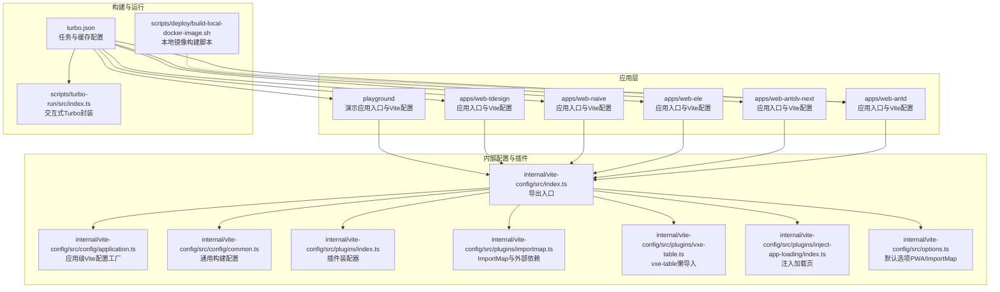
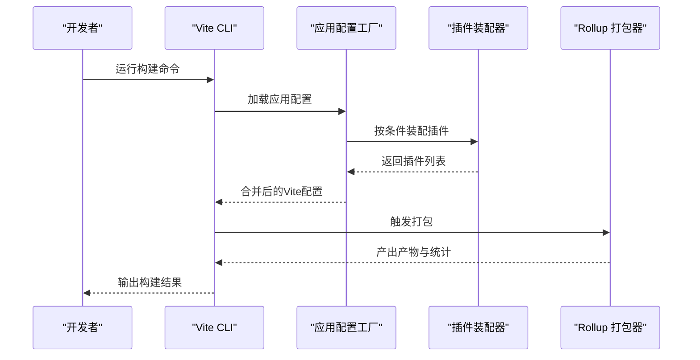
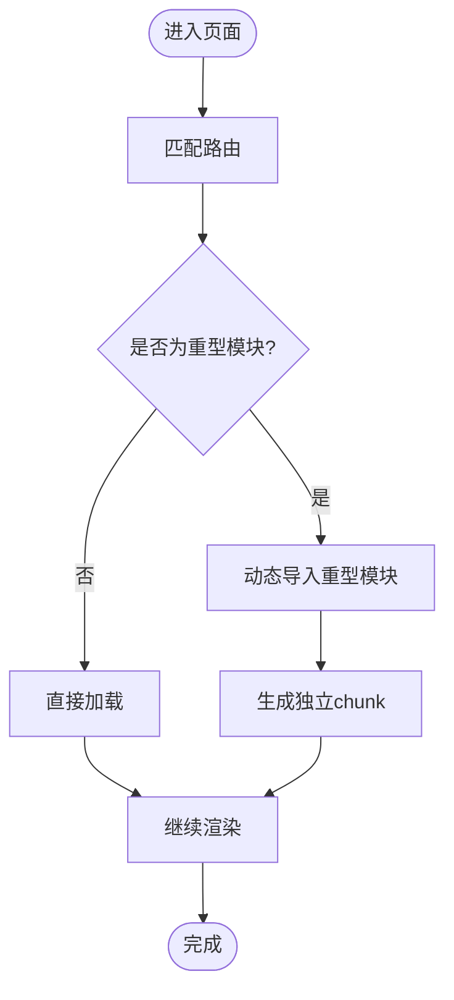
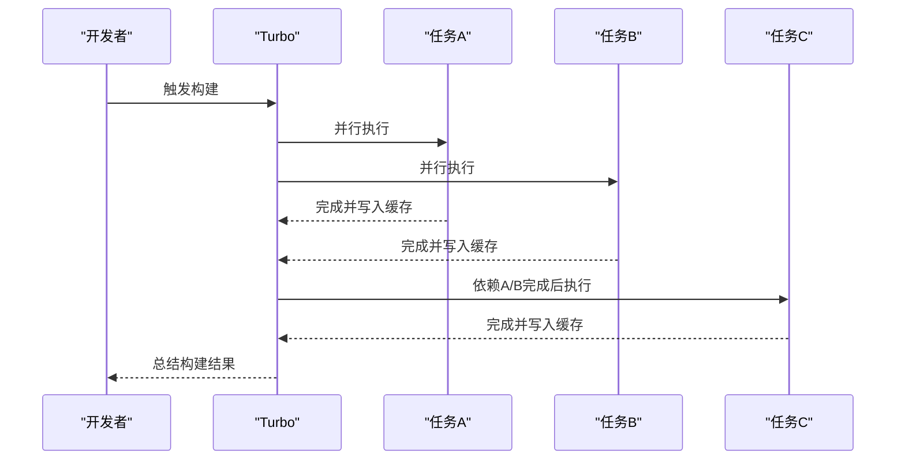
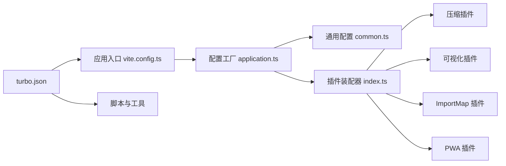

# 构建性能优化

<cite>
**本文引用的文件**
- [apps/web-antd/vite.config.ts](file://apps/web-antd/vite.config.ts)
- [apps/web-antd/package.json](file://apps/web-antd/package.json)
- [playground/vite.config.ts](file://playground/vite.config.ts)
- [turbo.json](file://turbo.json)
- [internal/vite-config/src/index.ts](file://internal/vite-config/src/index.ts)
- [internal/vite-config/src/config/application.ts](file://internal/vite-config/src/config/application.ts)
- [internal/vite-config/src/config/common.ts](file://internal/vite-config/src/config/common.ts)
- [internal/vite-config/src/options.ts](file://internal/vite-config/src/options.ts)
- [internal/vite-config/src/plugins/index.ts](file://internal/vite-config/src/plugins/index.ts)
- [internal/vite-config/src/plugins/importmap.ts](file://internal/vite-config/src/plugins/importmap.ts)
- [internal/vite-config/src/plugins/vxe-table.ts](file://internal/vite-config/src/plugins/vxe-table.ts)
- [internal/vite-config/src/plugins/inject-app-loading/index.ts](file://internal/vite-config/src/plugins/inject-app-loading/index.ts)
- [scripts/turbo-run/src/index.ts](file://scripts/turbo-run/src/index.ts)
- [scripts/deploy/build-local-docker-image.sh](file://scripts/deploy/build-local-docker-image.sh)
</cite>

## 目录
1. [引言](#引言)
2. [项目结构](#项目结构)
3. [核心组件](#核心组件)
4. [架构总览](#架构总览)
5. [详细组件分析](#详细组件分析)
6. [依赖关系分析](#依赖关系分析)
7. [性能考量](#性能考量)
8. [故障排查指南](#故障排查指南)
9. [结论](#结论)
10. [附录](#附录)

## 引言
本指南聚焦于Vben Admin在Vite与Rollup生态下的构建性能优化实践，覆盖插件配置、预构建与缓存、代码分割与懒加载、Tree Shaking与模块解析优化、产物分析、以及Turbo并行与缓存策略。文档同时给出冷启动与增量构建优化建议，并区分开发与生产环境的差异化配置思路。

## 项目结构
Vben Admin采用多应用与内部工具库的Monorepo组织方式：各Web应用共享统一的Vite配置与插件体系；构建与缓存由Turbo统一编排；部分脚本辅助本地部署与交互式执行。

图表来源
- [apps/web-antd/vite.config.ts:1-21](file://apps/web-antd/vite.config.ts#L1-L21)
- [playground/vite.config.ts:1-21](file://playground/vite.config.ts#L1-L21)
- [internal/vite-config/src/index.ts:1-6](file://internal/vite-config/src/index.ts#L1-L6)
- [internal/vite-config/src/config/application.ts:1-124](file://internal/vite-config/src/config/application.ts#L1-L124)
- [internal/vite-config/src/config/common.ts:1-14](file://internal/vite-config/src/config/common.ts#L1-L14)
- [internal/vite-config/src/plugins/index.ts:1-254](file://internal/vite-config/src/plugins/index.ts#L1-L254)
- [internal/vite-config/src/plugins/importmap.ts:1-246](file://internal/vite-config/src/plugins/importmap.ts#L1-L246)
- [internal/vite-config/src/plugins/vxe-table.ts:1-21](file://internal/vite-config/src/plugins/vxe-table.ts#L1-L21)
- [internal/vite-config/src/plugins/inject-app-loading/index.ts:1-67](file://internal/vite-config/src/plugins/inject-app-loading/index.ts#L1-L67)
- [turbo.json:1-49](file://turbo.json#L1-L49)
- [scripts/turbo-run/src/index.ts:1-24](file://scripts/turbo-run/src/index.ts#L1-L24)
- [scripts/deploy/build-local-docker-image.sh:1-56](file://scripts/deploy/build-local-docker-image.sh#L1-L56)

章节来源
- [apps/web-antd/vite.config.ts:1-21](file://apps/web-antd/vite.config.ts#L1-L21)
- [playground/vite.config.ts:1-21](file://playground/vite.config.ts#L1-L21)
- [turbo.json:1-49](file://turbo.json#L1-L49)

## 核心组件
- 应用级Vite配置工厂：集中管理构建参数、插件装配、服务与CSS处理等。
- 插件装配器：按条件启用插件，支持按需开启压缩、可视化、PWA、ImportMap、vxe-table懒导入等。
- 通用构建配置：统一产物体积警告阈值、是否生成Source Map、报告大小等。
- Turbo任务与缓存：定义任务依赖、输出目录、持久化与缓存策略。
- 交互式Turbo封装：提供命令行交互入口，便于本地调试与批量执行。

章节来源
- [internal/vite-config/src/config/application.ts:17-99](file://internal/vite-config/src/config/application.ts#L17-L99)
- [internal/vite-config/src/config/common.ts:3-11](file://internal/vite-config/src/config/common.ts#L3-L11)
- [internal/vite-config/src/plugins/index.ts:50-223](file://internal/vite-config/src/plugins/index.ts#L50-L223)
- [turbo.json:15-47](file://turbo.json#L15-L47)
- [scripts/turbo-run/src/index.ts:7-23](file://scripts/turbo-run/src/index.ts#L7-L23)

## 架构总览
Vite构建流程在应用入口通过统一配置工厂生成最终配置；插件按条件装配，生产模式下可启用压缩、可视化、ImportMap与PWA等；Turbo负责跨包任务编排与缓存命中。

图表来源
- [internal/vite-config/src/config/application.ts:17-99](file://internal/vite-config/src/config/application.ts#L17-L99)
- [internal/vite-config/src/plugins/index.ts:50-223](file://internal/vite-config/src/plugins/index.ts#L50-L223)

## 详细组件分析

### Vite构建配置优化策略
- 插件配置优化
  - 条件插件：仅在生产或特定模式启用压缩、可视化、ImportMap、PWA等，避免开发期额外开销。
  - 插件顺序：通过前置/后置钩子控制HTML注入与外部依赖解析时机。
- 预构建优化
  - 预热客户端文件，减少首次冷启动等待。
  - 使用ImportMap将稳定依赖标记为外部，降低打包体积与重复下载。
- 缓存策略
  - 生产构建关闭Source Map以减小体积与提升速度。
  - 统一产物命名规则，利于CDN缓存与长缓存策略。

章节来源
- [internal/vite-config/src/config/application.ts:58-91](file://internal/vite-config/src/config/application.ts#L58-L91)
- [internal/vite-config/src/config/common.ts:4-10](file://internal/vite-config/src/config/common.ts#L4-L10)
- [internal/vite-config/src/plugins/index.ts:70-89](file://internal/vite-config/src/plugins/index.ts#L70-L89)
- [internal/vite-config/src/plugins/importmap.ts:100-191](file://internal/vite-config/src/plugins/importmap.ts#L100-L191)

### 代码分割与懒加载
- 动态导入与路由懒加载
  - 将大型路由模块拆分为独立chunk，按需加载，显著降低首屏体积。
  - 建议对非关键路径与重型组件采用动态导入。
- 组件懒加载
  - 对重型UI库或编辑器类组件使用动态导入，结合骨架屏与占位符提升感知速度。
- vxe-table懒导入
  - 通过懒导入插件仅打包实际使用的表格组件，减少整体bundle体积。

图表来源
- [internal/vite-config/src/plugins/vxe-table.ts:5-18](file://internal/vite-config/src/plugins/vxe-table.ts#L5-L18)

章节来源
- [internal/vite-config/src/plugins/vxe-table.ts:1-21](file://internal/vite-config/src/plugins/vxe-table.ts#L1-L21)

### Rollup打包优化
- Tree Shaking
  - 确保依赖以ESM形式发布，避免打包器误判副作用导致摇树失败。
  - 在生产构建中开启最小化并移除调试语句，进一步缩小体积。
- 模块解析优化
  - 使用别名与路径映射减少解析层级，提升索引速度。
  - 对稳定第三方库采用外部化策略，配合CDN或ImportMap。
- 产物分析
  - 使用可视化插件生成依赖图谱，定位超大模块与重复依赖，针对性拆分或替换。

章节来源
- [internal/vite-config/src/config/application.ts:60-76](file://internal/vite-config/src/config/application.ts#L60-L76)
- [internal/vite-config/src/plugins/index.ts:184-198](file://internal/vite-config/src/plugins/index.ts#L184-L198)
- [internal/vite-config/src/plugins/index.ts:79-87](file://internal/vite-config/src/plugins/index.ts#L79-L87)

### Turbo构建系统
- 任务并行化
  - 通过依赖声明让下游任务在上游完成后并行执行，缩短整体构建时间。
- 缓存策略
  - 定义任务输出目录，结合全局依赖与环境变量，提高缓存命中率。
  - 开发任务禁用缓存并持久化，保证实时反馈。
- 交互式执行
  - 提供交互式命令封装，便于本地快速验证与批量执行。

图表来源
- [turbo.json:15-47](file://turbo.json#L15-L47)
- [scripts/turbo-run/src/index.ts:10-15](file://scripts/turbo-run/src/index.ts#L10-L15)

章节来源
- [turbo.json:1-49](file://turbo.json#L1-L49)
- [scripts/turbo-run/src/index.ts:1-24](file://scripts/turbo-run/src/index.ts#L1-L24)

### 构建时间分析与优化案例
- 冷启动优化
  - 预热关键入口与引导文件，减少首次请求等待。
  - 将高频依赖外部化并配合ImportMap，降低解析与打包成本。
- 增量构建优化
  - 利用Turbo缓存与任务输出目录，确保变更最小化重算。
  - 对非关键任务禁用缓存，保证开发体验与一致性。
- 产物分析
  - 在生产构建中启用可视化插件，识别超大模块与重复依赖，针对性拆分或替换。

章节来源
- [internal/vite-config/src/config/application.ts:82-89](file://internal/vite-config/src/config/application.ts#L82-L89)
- [internal/vite-config/src/plugins/index.ts:79-87](file://internal/vite-config/src/plugins/index.ts#L79-L87)
- [turbo.json:18-23](file://turbo.json#L18-L23)

### 不同环境下的构建优化策略
- 开发环境
  - 关闭Source Map与压缩，提升构建速度与可读性。
  - 启用开发工具插件与热更新，保持流畅开发体验。
  - 预热关键文件，缩短首开时间。
- 生产环境
  - 启用压缩（Brotli/Gzip）、可视化与PWA，优化传输与离线能力。
  - 外部化稳定依赖，结合ImportMap与CDN，降低打包体积。
  - 统一产物命名与chunk策略，便于长期缓存。

章节来源
- [internal/vite-config/src/config/common.ts:4-10](file://internal/vite-config/src/config/common.ts#L4-L10)
- [internal/vite-config/src/config/application.ts:27-54](file://internal/vite-config/src/config/application.ts#L27-L54)
- [internal/vite-config/src/plugins/index.ts:184-198](file://internal/vite-config/src/plugins/index.ts#L184-L198)
- [internal/vite-config/src/options.ts:31-43](file://internal/vite-config/src/options.ts#L31-L43)

## 依赖关系分析
- 应用入口依赖统一配置工厂，后者再依赖插件装配器与通用配置。
- 插件装配器根据环境与选项决定启用哪些插件，如压缩、可视化、ImportMap、PWA等。
- Turbo通过任务定义串联各应用与脚本，形成跨包并行构建流水线。

图表来源
- [apps/web-antd/vite.config.ts:1-21](file://apps/web-antd/vite.config.ts#L1-L21)
- [internal/vite-config/src/config/application.ts:17-99](file://internal/vite-config/src/config/application.ts#L17-L99)
- [internal/vite-config/src/config/common.ts:1-14](file://internal/vite-config/src/config/common.ts#L1-L14)
- [internal/vite-config/src/plugins/index.ts:50-223](file://internal/vite-config/src/plugins/index.ts#L50-L223)
- [turbo.json:15-47](file://turbo.json#L15-L47)

章节来源
- [apps/web-antd/vite.config.ts:1-21](file://apps/web-antd/vite.config.ts#L1-L21)
- [internal/vite-config/src/plugins/index.ts:1-254](file://internal/vite-config/src/plugins/index.ts#L1-L254)
- [turbo.json:1-49](file://turbo.json#L1-L49)

## 性能考量
- 构建速度
  - 减少不必要的插件与处理步骤，优先在生产构建启用压缩与分析。
  - 使用预热与外部化策略，降低解析与打包成本。
- 产物体积
  - 统一chunk命名与输出策略，结合Tree Shaking与按需导入，控制体积增长。
  - 对重型库采用懒导入与外部化，避免捆绑无关功能。
- 缓存与复用
  - 明确Turbo任务输出与缓存键，提升增量构建效率。
  - 在开发阶段禁用缓存但保持持久化，平衡速度与一致性。

## 故障排查指南
- ImportMap安装失败
  - 现象：构建时报错提示ImportMap安装失败。
  - 排查：确认网络连通性与CDN可用性；检查依赖清单与版本范围；查看日志流输出。
- 可视化插件未生成报告
  - 现象：生产构建未生成可视化报告。
  - 排查：确认生产模式与可视化开关已启用；检查输出路径权限。
- 预热文件缺失
  - 现象：首屏加载缓慢。
  - 排查：核对预热文件列表与实际文件是否存在；确保路径正确。
- Turbo缓存未命中
  - 现象：频繁全量构建。
  - 排查：检查全局依赖与环境变量是否纳入缓存键；确认任务输出目录定义完整。

章节来源
- [internal/vite-config/src/plugins/importmap.ts:138-144](file://internal/vite-config/src/plugins/importmap.ts#L138-L144)
- [internal/vite-config/src/plugins/index.ts:79-87](file://internal/vite-config/src/plugins/index.ts#L79-L87)
- [internal/vite-config/src/config/application.ts:82-89](file://internal/vite-config/src/config/application.ts#L82-L89)
- [turbo.json:14-13](file://turbo.json#L14-L13)

## 结论
通过对Vite插件的条件化装配、预热与外部化策略、Rollup的Tree Shaking与产物分析，以及Turbo的任务并行与缓存机制进行系统性优化，Vben Admin能够在开发与生产环境中获得更优的构建体验与产物质量。建议在团队内固化这些策略，并结合实际业务场景持续迭代。

## 附录
- 常用脚本与命令
  - 应用构建：参见应用包的构建脚本定义。
  - 分析构建：通过分析模式触发可视化报告。
  - 本地镜像构建：使用部署脚本一键安装依赖并构建镜像。

章节来源
- [apps/web-antd/package.json:18-24](file://apps/web-antd/package.json#L18-L24)
- [scripts/deploy/build-local-docker-image.sh:19-56](file://scripts/deploy/build-local-docker-image.sh#L19-L56)