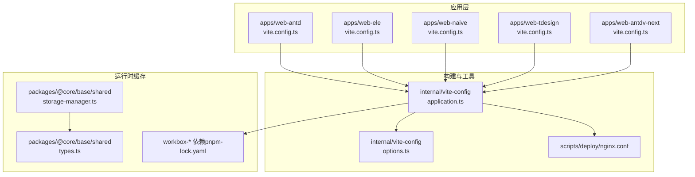
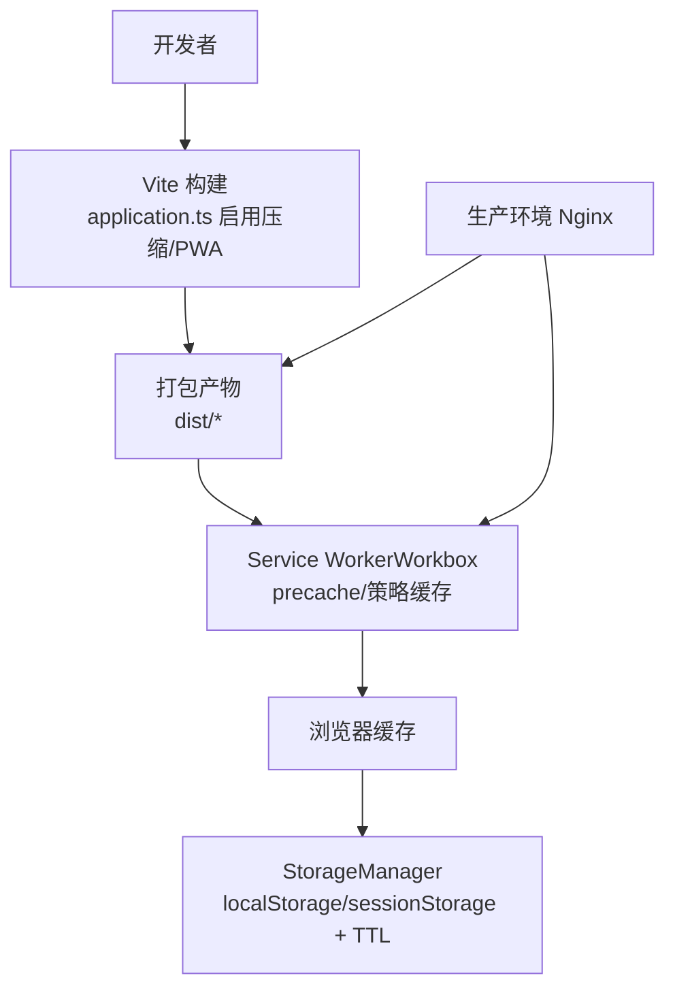
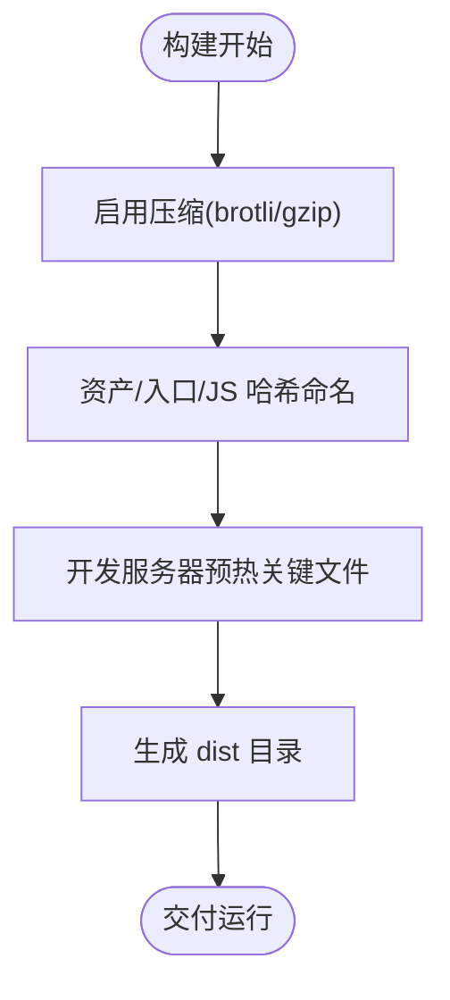
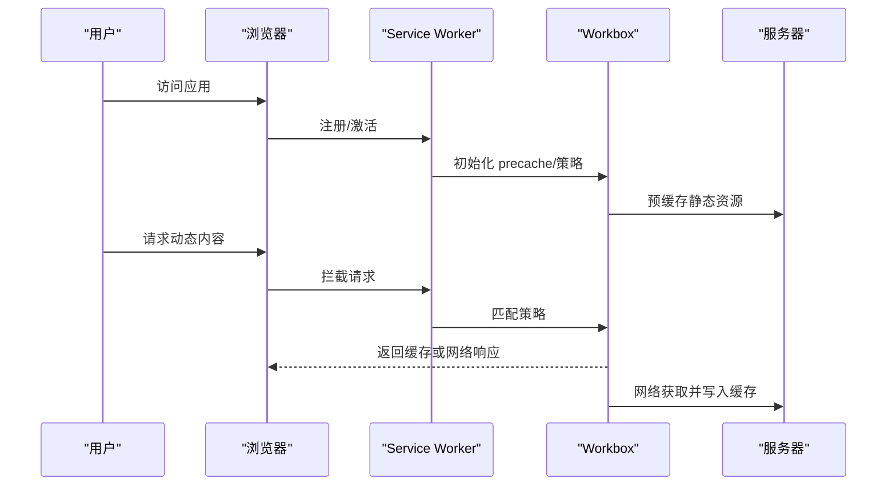
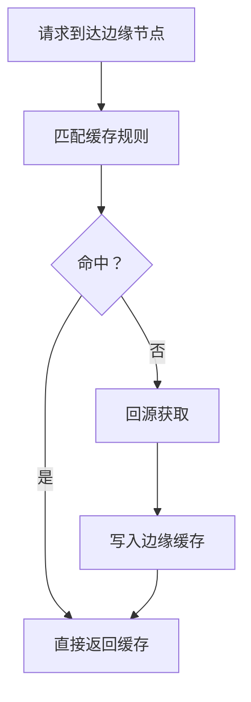
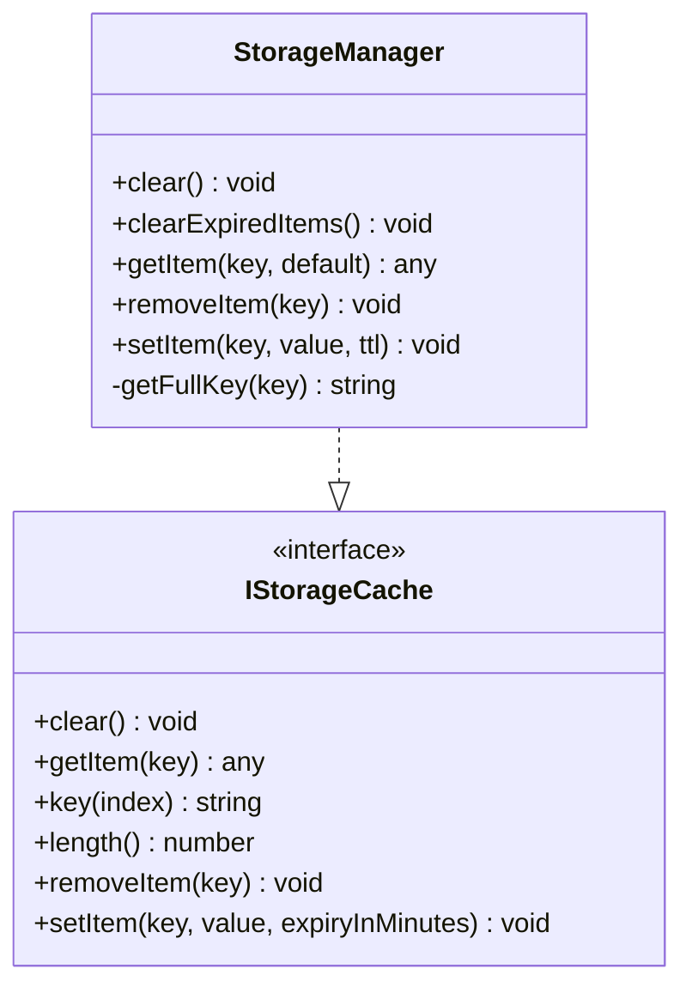

# 缓存策略

<cite>
**本文引用的文件**
- [vite.config.ts（web-antd）](file://apps/web-antd/vite.config.ts)
- [vite.config.ts（web-antdv-next）](file://apps/web-antdv-next/vite.config.ts)
- [vite.config.ts（web-ele）](file://apps/web-ele/vite.config.ts)
- [vite.config.ts（web-naive）](file://apps/web-naive/vite.config.ts)
- [vite.config.ts（web-tdesign）](file://apps/web-tdesign/vite.config.ts)
- [application.ts（内部Vite配置）](file://internal/vite-config/src/config/application.ts)
- [options.ts（内部Vite配置选项）](file://internal/vite-config/src/options.ts)
- [storage-manager.ts（存储管理器）](file://packages/@core/base/shared/src/cache/storage-manager.ts)
- [types.ts（缓存类型定义）](file://packages/@core/base/shared/src/cache/types.ts)
- [nginx.conf（部署脚本）](file://scripts/deploy/nginx.conf)
- [pnpm-lock.yaml（依赖锁定）](file://pnpm-lock.yaml)
</cite>

## 目录

1. [简介](#简介)
2. [项目结构](#项目结构)
3. [核心组件](#核心组件)
4. [架构总览](#架构总览)
5. [详细组件分析](#详细组件分析)
6. [依赖关系分析](#依赖关系分析)
7. [性能考量](#性能考量)
8. [故障排查指南](#故障排查指南)
9. [结论](#结论)
10. [附录](#附录)

## 简介

本指南围绕 Vben Admin 的缓存策略展开，覆盖浏览器端静态资源缓存、Service Worker 与 PWA、CDN 与边缘节点、以及应用内数据/组件/会话缓存，并提供可操作的配置建议与最佳实践。文档中的具体实现与配置均基于仓库现有文件进行分析与总结。

## 项目结构

Vben Admin 采用多应用（web-antd、web-ele、web-naive、web-tdesign、web-antdv-next）与内部工具链（vite-config、shared cache）的分层组织方式。前端构建由内部 Vite 配置统一生成，各应用通过各自的 vite.config.ts 进行最小化定制；缓存能力主要体现在：

- 构建期：Vite 插件链路启用压缩（brotli/gzip）、PWA 清单与 precache
- 运行期：浏览器本地存储（localStorage/sessionStorage）与 Service Worker（Workbox）

**图表来源**

- [vite.config.ts（web-antd）:1-21](file://apps/web-antd/vite.config.ts#L1-L21)
- [vite.config.ts（web-ele）:1-28](file://apps/web-ele/vite.config.ts#L1-L28)
- [vite.config.ts（web-naive）:1-21](file://apps/web-naive/vite.config.ts#L1-L21)
- [vite.config.ts（web-tdesign）:1-21](file://apps/web-tdesign/vite.config.ts#L1-L21)
- [vite.config.ts（web-antdv-next）:1-21](file://apps/web-antdv-next/vite.config.ts#L1-L21)
- [application.ts（内部Vite配置）:1-124](file://internal/vite-config/src/config/application.ts#L1-L124)
- [options.ts（内部Vite配置选项）:1-46](file://internal/vite-config/src/options.ts#L1-L46)
- [nginx.conf（部署脚本）:1-76](file://scripts/deploy/nginx.conf#L1-L76)
- [storage-manager.ts（存储管理器）:1-119](file://packages/@core/base/shared/src/cache/storage-manager.ts#L1-L119)
- [types.ts（缓存类型定义）:1-18](file://packages/@core/base/shared/src/cache/types.ts#L1-L18)
- [pnpm-lock.yaml（依赖锁定）:11174-11231](file://pnpm-lock.yaml#L11174-L11231)

**章节来源**

- [vite.config.ts（web-antd）:1-21](file://apps/web-antd/vite.config.ts#L1-L21)
- [vite.config.ts（web-ele）:1-28](file://apps/web-ele/vite.config.ts#L1-L28)
- [vite.config.ts（web-naive）:1-21](file://apps/web-naive/vite.config.ts#L1-L21)
- [vite.config.ts（web-tdesign）:1-21](file://apps/web-tdesign/vite.config.ts#L1-L21)
- [vite.config.ts（web-antdv-next）:1-21](file://apps/web-antdv-next/vite.config.ts#L1-L21)
- [application.ts（内部Vite配置）:1-124](file://internal/vite-config/src/config/application.ts#L1-L124)
- [options.ts（内部Vite配置选项）:1-46](file://internal/vite-config/src/options.ts#L1-L46)
- [nginx.conf（部署脚本）:1-76](file://scripts/deploy/nginx.conf#L1-L76)
- [storage-manager.ts（存储管理器）:1-119](file://packages/@core/base/shared/src/cache/storage-manager.ts#L1-L119)
- [types.ts（缓存类型定义）:1-18](file://packages/@core/base/shared/src/cache/types.ts#L1-L18)
- [pnpm-lock.yaml（依赖锁定）:11174-11231](file://pnpm-lock.yaml#L11174-L11231)

## 核心组件

- 应用级 Vite 配置：各应用通过 defineConfig 继承统一的内部配置，集中处理代理、插件、服务等。
- 内部 Vite 配置：统一启用压缩（brotli/gzip）、PWA、预热（warmup）等能力。
- 缓存类型与接口：定义了 localStorage/sessionStorage 类型与 TTL 接口。
- 存储管理器：封装带前缀的本地/会话存储、TTL 过期清理、序列化读写。
- Nginx 部署：提供基础静态资源服务与跨域头配置，便于本地演示与边缘部署参考。

**章节来源**

- [application.ts（内部Vite配置）:27-54](file://internal/vite-config/src/config/application.ts#L27-L54)
- [application.ts（内部Vite配置）:60-76](file://internal/vite-config/src/config/application.ts#L60-L76)
- [options.ts（内部Vite配置选项）:7-26](file://internal/vite-config/src/options.ts#L7-L26)
- [types.ts（缓存类型定义）:1-18](file://packages/@core/base/shared/src/cache/types.ts#L1-L18)
- [storage-manager.ts（存储管理器）:13-26](file://packages/@core/base/shared/src/cache/storage-manager.ts#L13-L26)
- [storage-manager.ts（存储管理器）:97-106](file://packages/@core/base/shared/src/cache/storage-manager.ts#L97-L106)
- [nginx.conf（部署脚本）:49-67](file://scripts/deploy/nginx.conf#L49-L67)

## 架构总览

下图展示了从构建到运行的缓存相关路径：构建期通过 Vite 插件链生成压缩资源与 PWA 清单；运行期通过 Service Worker（Workbox）进行 precache 与按策略缓存；浏览器本地通过 StorageManager 实现带 TTL 的持久/会话缓存；Nginx 提供静态资源服务与基础跨域支持。

**图表来源**

- [application.ts（内部Vite配置）:27-54](file://internal/vite-config/src/config/application.ts#L27-L54)
- [application.ts（内部Vite配置）:30-31](file://internal/vite-config/src/config/application.ts#L30-L31)
- [options.ts（内部Vite配置选项）:7-26](file://internal/vite-config/src/options.ts#L7-L26)
- [storage-manager.ts（存储管理器）:13-26](file://packages/@core/base/shared/src/cache/storage-manager.ts#L13-L26)
- [storage-manager.ts（存储管理器）:97-106](file://packages/@core/base/shared/src/cache/storage-manager.ts#L97-L106)
- [pnpm-lock.yaml（依赖锁定）:11174-11231](file://pnpm-lock.yaml#L11174-L11231)
- [nginx.conf（部署脚本）:49-67](file://scripts/deploy/nginx.conf#L49-L67)

## 详细组件分析

### 浏览器端静态资源缓存与压缩

- 构建期压缩：内部配置启用了 brotli 与 gzip 压缩类型，有助于减小传输体积，提升首屏与二次加载速度。
- 资源命名：构建输出对资产、入口与 JS 文件名进行了哈希化命名，有利于浏览器长期缓存与版本控制。
- 预热：开发服务器配置了 warmup 客户端文件列表，加速首次启动体验。

**图表来源**

- [application.ts（内部Vite配置）:30-31](file://internal/vite-config/src/config/application.ts#L30-L31)
- [application.ts（内部Vite配置）:63-73](file://internal/vite-config/src/config/application.ts#L63-L73)
- [application.ts（内部Vite配置）:82-89](file://internal/vite-config/src/config/application.ts#L82-L89)

**章节来源**

- [application.ts（内部Vite配置）:30-31](file://internal/vite-config/src/config/application.ts#L30-L31)
- [application.ts（内部Vite配置）:63-73](file://internal/vite-config/src/config/application.ts#L63-L73)
- [application.ts（内部Vite配置）:82-89](file://internal/vite-config/src/config/application.ts#L82-L89)

### Service Worker 与 PWA（Workbox）

- PWA 清单：内部配置提供了基础 PWA 清单字段（名称、图标等），用于安装与离线展示。
- Workbox 依赖：锁定文件中包含 workbox-\* 相关包，表明项目具备使用 Workbox 的能力基础。
- 策略建议：结合 precache 与 runtime 缓存策略，实现静态资源与 API 数据的差异化缓存；通过 expiration 控制生命周期；通过 broadcast update 通知客户端更新。

**图表来源**

- [options.ts（内部Vite配置选项）:7-26](file://internal/vite-config/src/options.ts#L7-L26)
- [pnpm-lock.yaml（依赖锁定）:11174-11231](file://pnpm-lock.yaml#L11174-L11231)

**章节来源**

- [options.ts（内部Vite配置选项）:7-26](file://internal/vite-config/src/options.ts#L7-L26)
- [pnpm-lock.yaml（依赖锁定）:11174-11231](file://pnpm-lock.yaml#L11174-L11231)

### CDN 与边缘节点配置

- Nginx 示例：仓库提供了基础 Nginx 配置，包含 MIME 类型、静态根目录、try_files 回退至 index.html、CORS 头等，适合本地演示与边缘部署参考。
- 建议：在生产环境中为不同资源类型设置合适的 Cache-Control 与 ETag；启用 gzip 或 brotli；合理划分静态资源与动态接口的缓存策略；利用 CDN 的边缘缓存与回源策略降低延迟。

**图表来源**

- [nginx.conf（部署脚本）:21-25](file://scripts/deploy/nginx.conf#L21-L25)
- [nginx.conf（部署脚本）:53-57](file://scripts/deploy/nginx.conf#L53-L57)
- [nginx.conf（部署脚本）:57-66](file://scripts/deploy/nginx.conf#L57-L66)

**章节来源**

- [nginx.conf（部署脚本）:21-25](file://scripts/deploy/nginx.conf#L21-L25)
- [nginx.conf（部署脚本）:53-57](file://scripts/deploy/nginx.conf#L53-L57)
- [nginx.conf（部署脚本）:57-66](file://scripts/deploy/nginx.conf#L57-L66)

### 应用内缓存策略

- 数据缓存：通过 StorageManager 封装 localStorage/sessionStorage，支持带 TTL 的过期清理，适用于用户偏好、筛选条件、轻量业务数据等。
- 组件缓存：可结合路由/视图级别的懒加载与缓存策略，减少重复渲染与请求。
- 会话缓存：登录态、权限信息等敏感数据建议使用 sessionStorage 并设置较短 TTL，避免长期驻留。

**图表来源**

- [storage-manager.ts（存储管理器）:13-26](file://packages/@core/base/shared/src/cache/storage-manager.ts#L13-L26)
- [storage-manager.ts（存储管理器）:61-80](file://packages/@core/base/shared/src/cache/storage-manager.ts#L61-L80)
- [storage-manager.ts（存储管理器）:97-106](file://packages/@core/base/shared/src/cache/storage-manager.ts#L97-L106)
- [types.ts（缓存类型定义）:8-15](file://packages/@core/base/shared/src/cache/types.ts#L8-L15)

**章节来源**

- [storage-manager.ts（存储管理器）:13-26](file://packages/@core/base/shared/src/cache/storage-manager.ts#L13-L26)
- [storage-manager.ts（存储管理器）:45-53](file://packages/@core/base/shared/src/cache/storage-manager.ts#L45-L53)
- [storage-manager.ts（存储管理器）:61-80](file://packages/@core/base/shared/src/cache/storage-manager.ts#L61-L80)
- [storage-manager.ts（存储管理器）:97-106](file://packages/@core/base/shared/src/cache/storage-manager.ts#L97-L106)
- [types.ts（缓存类型定义）:1-18](file://packages/@core/base/shared/src/cache/types.ts#L1-L18)

## 依赖关系分析

- 构建期依赖：Vite 插件链启用压缩与 PWA；Workbox 相关包存在于依赖锁定文件中，表明具备 Service Worker 能力。
- 运行期依赖：浏览器本地存储 API 与 Service Worker 生命周期。

**图表来源**

- [application.ts（内部Vite配置）:27-54](file://internal/vite-config/src/config/application.ts#L27-L54)
- [application.ts（内部Vite配置）:30-31](file://internal/vite-config/src/config/application.ts#L30-L31)
- [pnpm-lock.yaml（依赖锁定）:11174-11231](file://pnpm-lock.yaml#L11174-L11231)
- [storage-manager.ts（存储管理器）:13-26](file://packages/@core/base/shared/src/cache/storage-manager.ts#L13-L26)

**章节来源**

- [application.ts（内部Vite配置）:27-54](file://internal/vite-config/src/config/application.ts#L27-L54)
- [application.ts（内部Vite配置）:30-31](file://internal/vite-config/src/config/application.ts#L30-L31)
- [pnpm-lock.yaml（依赖锁定）:11174-11231](file://pnpm-lock.yaml#L11174-L11231)

## 性能考量

- 静态资源缓存：对 dist 中的静态资源启用长期缓存（如强缓存 + 哈希文件名），对 HTML 使用 no-store 避免更新后仍命中旧缓存。
- 压缩策略：优先启用 brotli，其次 gzip；仅对文本类资源启用静态压缩。
- Service Worker：使用 precache 缓存核心静态资源，runtime 使用缓存优先或网络优先策略，并设置合理的过期时间与更新机制。
- 应用内缓存：localStorage 适合持久数据，sessionStorage 适合短期会话；为缓存项设置 TTL，定期清理过期项。
- CDN 边缘：根据资源类型设置 Cache-Control 与 ETag；利用 CDN 的回源缓存与健康检查降低延迟与成本。

[本节为通用指导，无需列出具体文件来源]

## 故障排查指南

- 缓存未生效
  - 检查 HTML 是否被缓存（应避免强缓存以防止更新后仍命中旧页面）。
  - 确认静态资源是否正确生成哈希文件名并被浏览器缓存。
- Service Worker 不生效
  - 确认 PWA 清单与 precache 已启用；检查浏览器控制台是否存在注册/激活错误。
  - 核对 Workbox 相关依赖是否正确安装。
- 本地存储异常
  - 检查 StorageManager 的前缀与键空间是否冲突；确认 TTL 设置是否合理。
  - 若存储容量不足，清理过期项或减少缓存数据大小。

**章节来源**

- [application.ts（内部Vite配置）:63-73](file://internal/vite-config/src/config/application.ts#L63-L73)
- [options.ts（内部Vite配置选项）:7-26](file://internal/vite-config/src/options.ts#L7-L26)
- [pnpm-lock.yaml（依赖锁定）:11174-11231](file://pnpm-lock.yaml#L11174-L11231)
- [storage-manager.ts（存储管理器）:45-53](file://packages/@core/base/shared/src/cache/storage-manager.ts#L45-L53)

## 结论

Vben Admin 在构建期通过压缩与 PWA 能力为运行期缓存打下基础；在运行期可通过 Service Worker 与浏览器本地存储实现多层次缓存。结合 CDN 与边缘节点的缓存策略，可在不同场景下实现更优的加载性能与用户体验。建议在实际部署中根据资源特性与业务需求，细化 Cache-Control、ETag、TTL 与更新机制，并持续监控缓存命中率与性能指标。

[本节为总结性内容，无需列出具体文件来源]

## 附录

### 配置示例与最佳实践清单

- 构建期
  - 启用 brotli/gzip 压缩，确保文本类资源受益。
  - 对静态资源使用哈希文件名，配合长期缓存。
  - 开发服务器启用 warmup，加速首次启动。
- 运行期
  - PWA 清单完善，启用 precache；结合 runtime 策略缓存 API。
  - 应用内缓存：localStorage 持久数据，sessionStorage 短期会话；为缓存项设置 TTL 并定期清理。
- CDN 与边缘
  - 为不同资源类型设置合适的 Cache-Control 与 ETag。
  - 启用 gzip/brotli；合理配置回源与缓存刷新策略。
- 安全与合规
  - 对敏感数据使用 sessionStorage 并限制 TTL。
  - 对 HTML 使用 no-store，避免更新后仍命中旧页面。

**章节来源**

- [application.ts（内部Vite配置）:30-31](file://internal/vite-config/src/config/application.ts#L30-L31)
- [application.ts（内部Vite配置）:63-73](file://internal/vite-config/src/config/application.ts#L63-L73)
- [application.ts（内部Vite配置）:82-89](file://internal/vite-config/src/config/application.ts#L82-L89)
- [options.ts（内部Vite配置选项）:7-26](file://internal/vite-config/src/options.ts#L7-L26)
- [storage-manager.ts（存储管理器）:97-106](file://packages/@core/base/shared/src/cache/storage-manager.ts#L97-L106)
- [nginx.conf（部署脚本）:53-57](file://scripts/deploy/nginx.conf#L53-L57)
- [nginx.conf（部署脚本）:57-66](file://scripts/deploy/nginx.conf#L57-L66)
