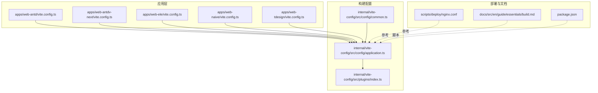
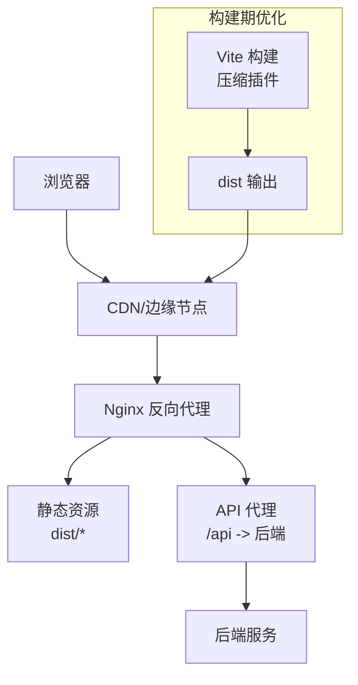
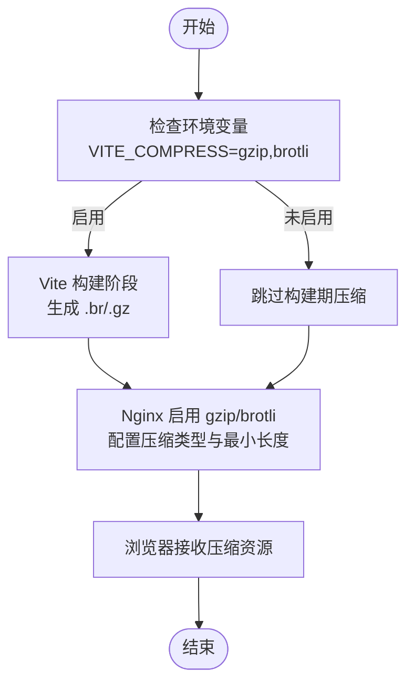
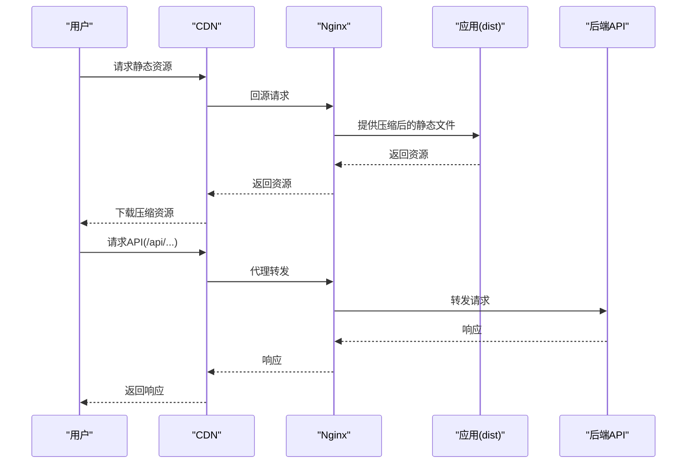
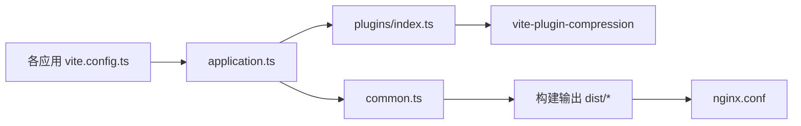

# 网络性能优化

<cite>
**本文引用的文件**
- [vite.config.ts](file://apps/web-antd/vite.config.ts)
- [vite.config.ts](file://apps/web-antdv-next/vite.config.ts)
- [vite.config.ts](file://apps/web-ele/vite.config.ts)
- [vite.config.ts](file://apps/web-naive/vite.config.ts)
- [vite.config.ts](file://apps/web-tdesign/vite.config.ts)
- [application.ts](file://internal/vite-config/src/config/application.ts)
- [common.ts](file://internal/vite-config/src/config/common.ts)
- [index.ts](file://internal/vite-config/src/plugins/index.ts)
- [build.md](file://docs/src/en/guide/essentials/build.md)
- [nginx.conf](file://scripts/deploy/nginx.conf)
- [package.json](file://package.json)
</cite>

## 目录

1. [简介](#简介)
2. [项目结构](#项目结构)
3. [核心组件](#核心组件)
4. [架构总览](#架构总览)
5. [详细组件分析](#详细组件分析)
6. [依赖关系分析](#依赖关系分析)
7. [性能考量](#性能考量)
8. [故障排查指南](#故障排查指南)
9. [结论](#结论)
10. [附录](#附录)

## 简介

本指南面向Vben Admin在生产环境中的网络性能优化实践，围绕资源压缩（Gzip/Brotli）、HTTP/2能力、连接复用与并发控制、CDN优化、以及网络监控与分析工具展开，并提供从问题识别到优化实施再到效果验证的完整案例流程。

## 项目结构

Vben Admin采用多应用与内部配置共享的Monorepo结构，前端构建通过统一的Vite配置与插件体系完成，部署侧提供Nginx示例配置。关键位置如下：

- 应用级Vite配置：各web-\*应用的vite.config.ts负责开发服务器代理等本地调试需求
- 统一构建配置：internal/vite-config提供应用构建、压缩、PWA、HTML注入等能力
- 文档与部署：docs提供构建与部署说明；scripts/deploy提供Nginx参考配置
- 包管理与脚本：package.json定义构建与预览脚本

**图表来源**

- [vite.config.ts:1-21](file://apps/web-antd/vite.config.ts#L1-L21)
- [application.ts:1-124](file://internal/vite-config/src/config/application.ts#L1-L124)
- [common.ts:1-14](file://internal/vite-config/src/config/common.ts#L1-L14)
- [index.ts:1-254](file://internal/vite-config/src/plugins/index.ts#L1-L254)
- [nginx.conf:1-76](file://scripts/deploy/nginx.conf#L1-L76)
- [build.md:1-244](file://docs/src/en/guide/essentials/build.md#L1-L244)
- [package.json:1-109](file://package.json#L1-L109)

**章节来源**

- [vite.config.ts:1-21](file://apps/web-antd/vite.config.ts#L1-L21)
- [application.ts:1-124](file://internal/vite-config/src/config/application.ts#L1-L124)
- [common.ts:1-14](file://internal/vite-config/src/config/common.ts#L1-L14)
- [index.ts:1-254](file://internal/vite-config/src/plugins/index.ts#L1-L254)
- [nginx.conf:1-76](file://scripts/deploy/nginx.conf#L1-L76)
- [build.md:1-244](file://docs/src/en/guide/essentials/build.md#L1-L244)
- [package.json:1-109](file://package.json#L1-L109)

## 核心组件

- 构建压缩插件链：在应用构建阶段按需启用Brotli或Gzip压缩，生成对应压缩文件
- Nginx压缩与缓存：在反向代理层启用Gzip/Brotli，合理设置缓存与CORS头
- 资源分发与路由：通过Vite base与路由模式配合，确保CDN与历史模式部署正确
- 预览与分析：提供本地预览与构建分析工具，辅助定位体积与加载瓶颈

**章节来源**

- [application.ts:30-54](file://internal/vite-config/src/config/application.ts#L30-L54)
- [index.ts:184-199](file://internal/vite-config/src/plugins/index.ts#L184-L199)
- [build.md:53-116](file://docs/src/en/guide/essentials/build.md#L53-L116)
- [nginx.conf:33-47](file://scripts/deploy/nginx.conf#L33-L47)

## 架构总览

下图展示了从浏览器到后端的典型网络路径，以及在构建与反向代理层的关键优化点。

**图表来源**

- [build.md:130-148](file://docs/src/en/guide/essentials/build.md#L130-L148)
- [nginx.conf:49-67](file://scripts/deploy/nginx.conf#L49-L67)
- [vite.config.ts:7-16](file://apps/web-antd/vite.config.ts#L7-L16)

## 详细组件分析

### 资源压缩优化（Gzip/Brotli）

- 构建期压缩
  - 在应用构建配置中，按需启用Brotli与Gzip压缩插件，生成.br与.gz文件
  - 通过环境变量控制启用的压缩类型
- 服务端压缩
  - Nginx示例开启Gzip与Brotli，并配置压缩类型与最小长度
  - 若使用gzip_static，可直接命中已打包的.gz文件，避免运行时压缩开销

**图表来源**

- [application.ts:30-54](file://internal/vite-config/src/config/application.ts#L30-L54)
- [index.ts:184-199](file://internal/vite-config/src/plugins/index.ts#L184-L199)
- [build.md:55-77](file://docs/src/en/guide/essentials/build.md#L55-L77)
- [nginx.conf:33-47](file://scripts/deploy/nginx.conf#L33-L47)

**章节来源**

- [application.ts:30-54](file://internal/vite-config/src/config/application.ts#L30-L54)
- [index.ts:184-199](file://internal/vite-config/src/plugins/index.ts#L184-L199)
- [build.md:53-116](file://docs/src/en/guide/essentials/build.md#L53-L116)
- [nginx.conf:33-47](file://scripts/deploy/nginx.conf#L33-L47)

### HTTP/2优化

- 多路复用与头部压缩
  - 在Nginx中启用HTTP/2可获得多路复用与HPACK头部压缩收益，减少队头阻塞
- 服务器推送（可选）
  - 对关键首屏资源可考虑使用Nginx的早期资源推送，但需谨慎评估，避免过度推送造成缓存污染
- 实施要点
  - 确保证书配置正确
  - 结合Gzip/Brotli与持久连接，最大化传输效率

[本节为概念性说明，不直接分析具体文件，故无“章节来源”]

### 连接复用与并发控制

- Keep-Alive
  - Nginx示例保留了keepalive相关注释，建议在生产环境中启用并合理设置超时
- 并发与队列
  - 控制浏览器对同一主机的最大并发连接数，避免过多并发导致拥塞
  - 合理拆分域名，使关键资源走独立连接池，提升首屏加载速度

**章节来源**

- [nginx.conf:30-32](file://scripts/deploy/nginx.conf#L30-L32)

### CDN优化

- 域名分片
  - 将静态资源分布在多个子域，突破浏览器同源并发限制
- 缓存策略
  - 对不变资源设置长缓存，对HTML设置短缓存或禁缓存，避免版本更新后陈旧内容
- 负载均衡与就近访问
  - 通过CDN实现全球加速与就近接入，降低RTT
- 资源路径与路由
  - 通过Vite的base配置与路由模式，确保CDN路径与历史模式部署一致

**图表来源**

- [build.md:130-148](file://docs/src/en/guide/essentials/build.md#L130-L148)
- [nginx.conf:49-67](file://scripts/deploy/nginx.conf#L49-L67)
- [vite.config.ts:7-16](file://apps/web-antd/vite.config.ts#L7-L16)

**章节来源**

- [build.md:130-171](file://docs/src/en/guide/essentials/build.md#L130-L171)
- [nginx.conf:49-67](file://scripts/deploy/nginx.conf#L49-L67)
- [vite.config.ts:7-16](file://apps/web-antd/vite.config.ts#L7-L16)

### 网络监控与分析

- Lighthouse
  - 分析性能、可访问性、SEO等指标，定位瓶颈
- WebPageTest
  - 在不同网络与设备条件下测试页面加载表现
- Real User Monitoring（RUM）
  - 上线后收集真实用户访问数据，持续观测性能趋势

[本节为概念性说明，不直接分析具体文件，故无“章节来源”]

### 实际优化案例（从问题到验证）

- 问题识别
  - 使用Lighthouse与WebPageTest发现首屏时间长、资源体积大、Gzip未生效
- 优化实施
  - 在构建配置中启用Brotli与Gzip（通过环境变量控制）
  - 在Nginx中开启Gzip/Brotli与gzip_static，设置合理的缓存与CORS头
  - 通过Vite base与路由模式确保CDN路径正确
- 效果验证
  - 再次使用Lighthouse与WebPageTest对比优化前后指标
  - 上线后通过RUM持续观察真实用户性能

**章节来源**

- [build.md:53-116](file://docs/src/en/guide/essentials/build.md#L53-L116)
- [nginx.conf:33-47](file://scripts/deploy/nginx.conf#L33-L47)
- [build.md:130-171](file://docs/src/en/guide/essentials/build.md#L130-L171)

## 依赖关系分析

- 应用Vite配置依赖统一的构建配置与插件体系
- 构建配置依赖插件系统，按需启用压缩与HTML注入等功能
- 部署侧Nginx配置与构建产物形成闭环，确保压缩与缓存策略落地

**图表来源**

- [vite.config.ts:1-21](file://apps/web-antd/vite.config.ts#L1-L21)
- [application.ts:17-98](file://internal/vite-config/src/config/application.ts#L17-L98)
- [index.ts:94-223](file://internal/vite-config/src/plugins/index.ts#L94-L223)
- [common.ts:3-11](file://internal/vite-config/src/config/common.ts#L3-L11)
- [nginx.conf:1-76](file://scripts/deploy/nginx.conf#L1-L76)

**章节来源**

- [vite.config.ts:1-21](file://apps/web-antd/vite.config.ts#L1-L21)
- [application.ts:17-98](file://internal/vite-config/src/config/application.ts#L17-L98)
- [index.ts:94-223](file://internal/vite-config/src/plugins/index.ts#L94-L223)
- [common.ts:3-11](file://internal/vite-config/src/config/common.ts#L3-L11)
- [nginx.conf:1-76](file://scripts/deploy/nginx.conf#L1-L76)

## 性能考量

- 构建体积与分包
  - 使用构建分析工具定位大体积依赖，结合分包策略与懒加载优化
- 压缩策略
  - 生产环境优先启用Brotli，必要时与Gzip共存；服务端gzip_static可命中已打包的.gz文件
- 缓存与回源
  - 对静态资源设置长缓存，HTML短缓存或禁缓存；合理配置ETag/Last-Modified
- 路由与基路径
  - 历史模式部署需配合服务端try_files；CDN部署需同步调整Vite base

[本节为通用指导，不直接分析具体文件，故无“章节来源”]

## 故障排查指南

- 构建期压缩未生效
  - 检查环境变量是否正确设置；确认插件启用逻辑
- 服务端未压缩或命中失败
  - 检查Nginx gzip/brotli开关与类型配置；若使用gzip_static，确认模块可用且路径正确
- 跨域与CORS
  - Nginx示例提供了CORS头配置，确保前端API地址与代理规则一致
- 资源路径错误
  - 修改Vite base与路由模式，确保CDN与历史模式部署一致

**章节来源**

- [build.md:53-116](file://docs/src/en/guide/essentials/build.md#L53-L116)
- [nginx.conf:57-66](file://scripts/deploy/nginx.conf#L57-L66)
- [build.md:150-171](file://docs/src/en/guide/essentials/build.md#L150-L171)

## 结论

通过在构建期启用Brotli/Gzip、在服务端启用压缩与合理缓存、结合CDN与路由策略，并辅以Lighthouse、WebPageTest与RUM的持续监控，Vben Admin可以在生产环境中显著提升网络性能与用户体验。

## 附录

- 关键脚本与命令
  - 构建：参见根目录脚本定义
  - 预览：参见构建与部署文档
  - 分析：参见构建分析章节

**章节来源**

- [package.json:27-66](file://package.json#L27-L66)
- [build.md:11-51](file://docs/src/en/guide/essentials/build.md#L11-L51)
- [build.md:118-128](file://docs/src/en/guide/essentials/build.md#L118-L128)
