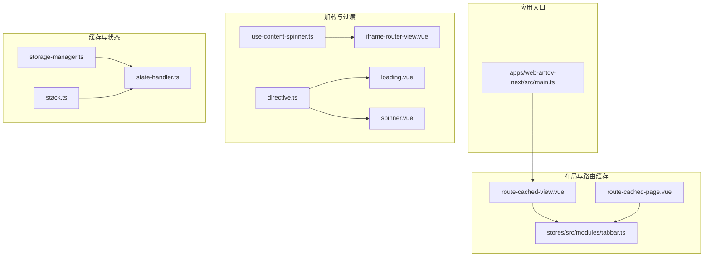
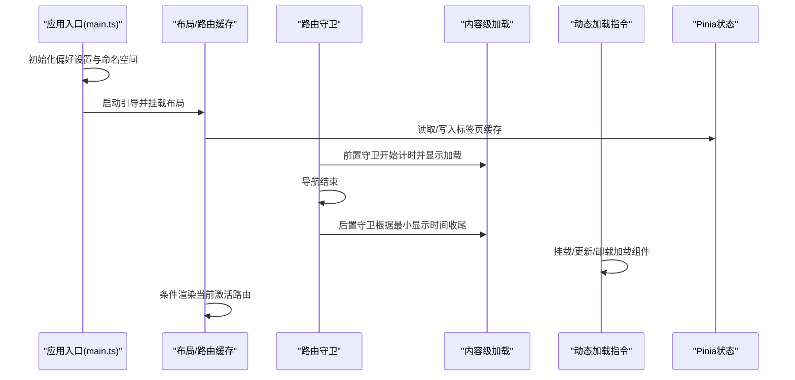
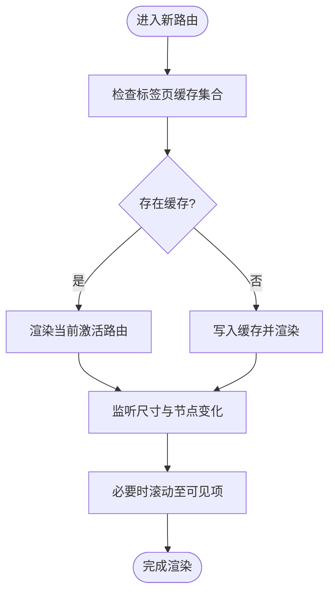
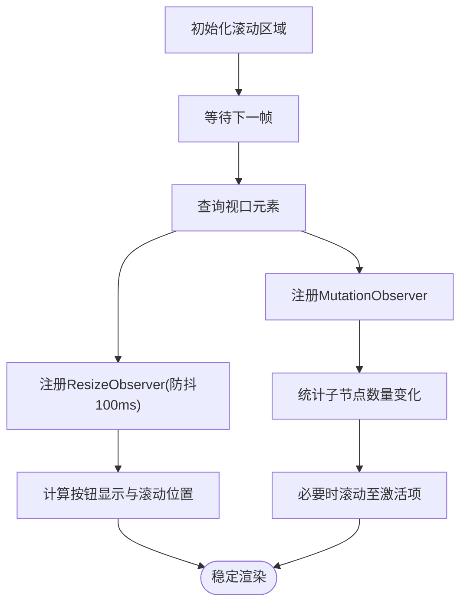
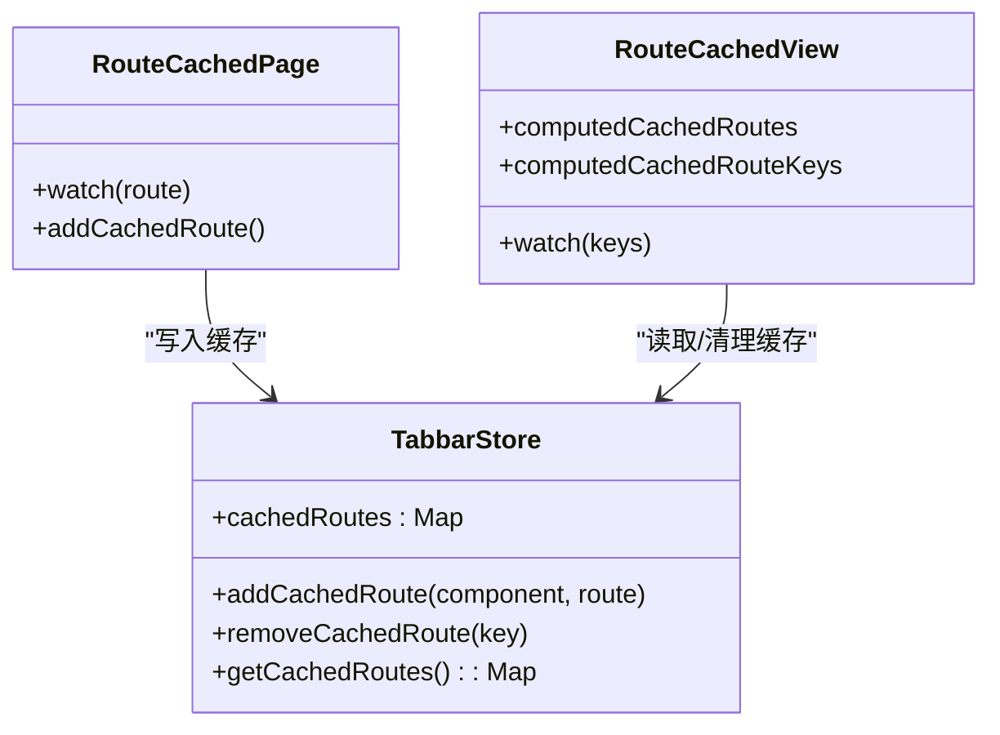
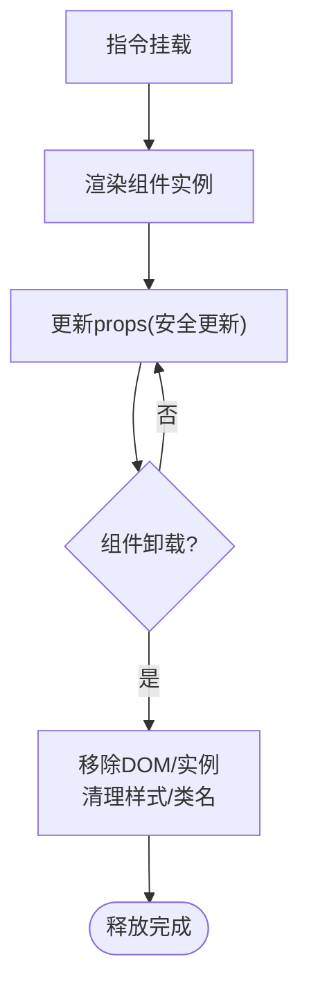
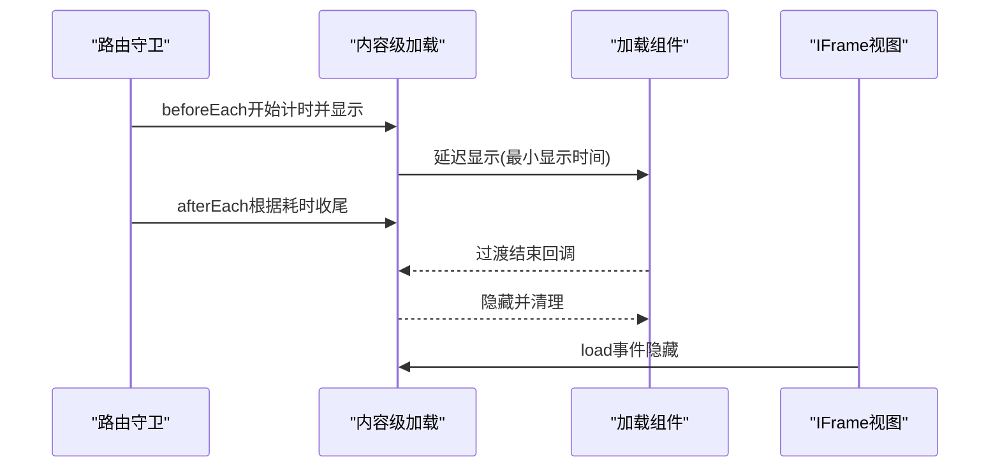
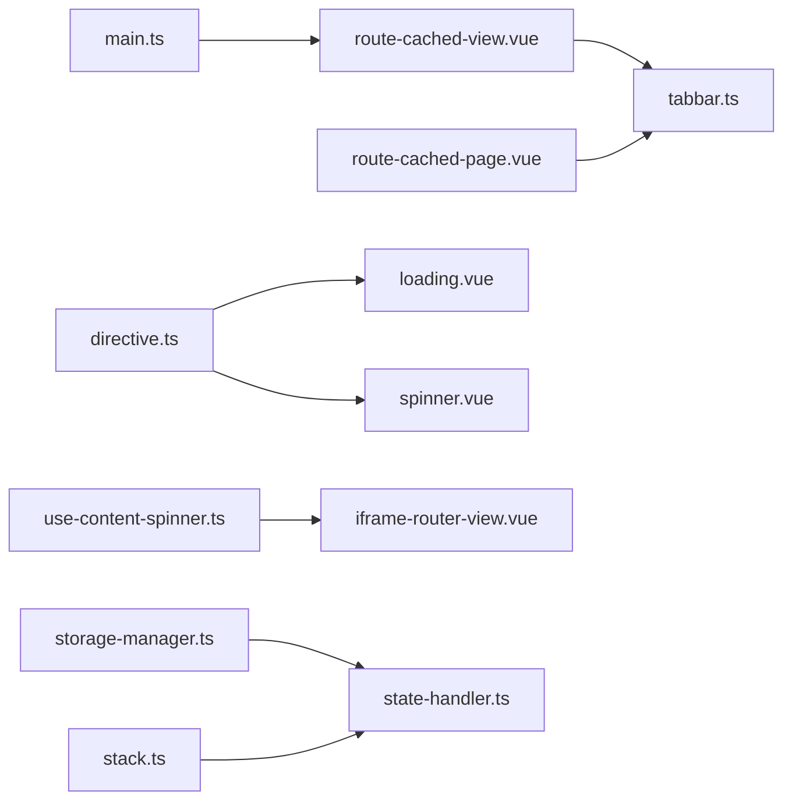

# 运行时性能优化

<cite>
**本文引用的文件**   
- [loading.vue](file://packages/@core/ui-kit/shadcn-ui/src/components/spinner/loading.vue)
- [spinner.vue](file://packages/@core/ui-kit/shadcn-ui/src/components/spinner/spinner.vue)
- [directive.ts](file://packages/effects/common-ui/src/components/loading/directive.ts)
- [use-content-spinner.ts](file://packages/effects/layouts/src/basic/content/use-content-spinner.ts)
- [iframe-router-view.vue](file://packages/effects/layouts/src/iframe/iframe-router-view.vue)
- [route-cached-view.vue](file://packages/effects/layouts/src/route-cached/route-cached-view.vue)
- [route-cached-page.vue](file://packages/effects/layouts/src/route-cached/route-cached-page.vue)
- [tabbar.ts](file://packages/stores/src/modules/tabbar.ts)
- [storage-manager.ts](file://packages/@core/base/shared/src/cache/storage-manager.ts)
- [state-handler.ts](file://packages/@core/base/shared/src/utils/state-handler.ts)
- [use-tabs-view-scroll.ts](file://packages/@core/ui-kit/tabs-ui/src/use-tabs-view-scroll.ts)
- [stack.ts](file://packages/@core/base/shared/src/utils/stack.ts)
- [form-api.ts](file://packages/@core/ui-kit/form-ui/src/form-api.ts)
- [main.ts](file://apps/web-antdv-next/src/main.ts)
- [shim-pinia.d.ts](file://packages/stores/shim-pinia.d.ts)
</cite>

## 目录
1. [引言](#引言)
2. [项目结构](#项目结构)
3. [核心组件](#核心组件)
4. [架构总览](#架构总览)
5. [详细组件分析](#详细组件分析)
6. [依赖关系分析](#依赖关系分析)
7. [性能考量与优化建议](#性能考量与优化建议)
8. [故障排查指南](#故障排查指南)
9. [结论](#结论)
10. [附录：性能监控与分析工具](#附录性能监控与分析工具)

## 引言
本指南聚焦于Vben Admin在运行时的性能优化实践，围绕以下主题展开：Vue组件渲染优化（组件懒加载、虚拟滚动与列表渲染优化）、状态管理性能（Pinia状态树设计、状态缓存与响应式优化）、内存管理（生命周期、事件监听器清理与内存泄漏预防）、计算属性与侦听器优化（缓存策略与依赖最小化）、性能监控与分析工具（Vue Devtools、性能面板与内存分析）以及常见性能瓶颈的识别与解决方案。文档以仓库中现有实现为依据，结合可视化图表帮助读者快速定位优化点。

## 项目结构
Vben Admin采用多应用与多UI框架的组织方式，核心运行时性能优化涉及如下模块：
- UI组件层：加载指示器、滚动区域、标签页等通用组件
- 布局与路由缓存：基于标签页的状态缓存与按需渲染
- 状态管理：Pinia模块与缓存工具
- 性能钩子：内容级加载动画、路由过渡控制
- 插件与指令：动态加载指令、全局初始化流程

**图表来源**
- [main.ts:1-32](file://apps/web-antdv-next/src/main.ts#L1-L32)
- [route-cached-view.vue:1-98](file://packages/effects/layouts/src/route-cached/route-cached-view.vue#L1-L98)
- [route-cached-page.vue:1-36](file://packages/effects/layouts/src/route-cached/route-cached-page.vue#L1-L36)
- [tabbar.ts:560-587](file://packages/stores/src/modules/tabbar.ts#L560-L587)
- [use-content-spinner.ts:1-50](file://packages/effects/layouts/src/basic/content/use-content-spinner.ts#L1-L50)
- [loading.vue:1-66](file://packages/@core/ui-kit/shadcn-ui/src/components/spinner/loading.vue#L1-L66)
- [spinner.vue:1-60](file://packages/@core/ui-kit/shadcn-ui/src/components/spinner/spinner.vue#L1-L60)
- [directive.ts:1-132](file://packages/effects/common-ui/src/components/loading/directive.ts#L1-L132)
- [iframe-router-view.vue:59-86](file://packages/effects/layouts/src/iframe/iframe-router-view.vue#L59-L86)
- [storage-manager.ts:1-119](file://packages/@core/base/shared/src/cache/storage-manager.ts#L1-L119)
- [state-handler.ts:1-51](file://packages/@core/base/shared/src/utils/state-handler.ts#L1-L51)
- [stack.ts:45-103](file://packages/@core/base/shared/src/utils/stack.ts#L45-L103)

**章节来源**
- [main.ts:1-32](file://apps/web-antdv-next/src/main.ts#L1-L32)
- [route-cached-view.vue:1-98](file://packages/effects/layouts/src/route-cached/route-cached-view.vue#L1-L98)
- [route-cached-page.vue:1-36](file://packages/effects/layouts/src/route-cached/route-cached-page.vue#L1-L36)
- [tabbar.ts:560-587](file://packages/stores/src/modules/tabbar.ts#L560-L587)
- [use-content-spinner.ts:1-50](file://packages/effects/layouts/src/basic/content/use-content-spinner.ts#L1-L50)
- [loading.vue:1-66](file://packages/@core/ui-kit/shadcn-ui/src/components/spinner/loading.vue#L1-L66)
- [spinner.vue:1-60](file://packages/@core/ui-kit/shadcn-ui/src/components/spinner/spinner.vue#L1-L60)
- [directive.ts:1-132](file://packages/effects/common-ui/src/components/loading/directive.ts#L1-L132)
- [iframe-router-view.vue:59-86](file://packages/effects/layouts/src/iframe/iframe-router-view.vue#L59-L86)
- [storage-manager.ts:1-119](file://packages/@core/base/shared/src/cache/storage-manager.ts#L1-L119)
- [state-handler.ts:1-51](file://packages/@core/base/shared/src/utils/state-handler.ts#L1-L51)
- [stack.ts:45-103](file://packages/@core/base/shared/src/utils/stack.ts#L45-L103)

## 核心组件
- 加载与旋转指示器：通过延时显示与条件渲染避免闪烁与频繁DOM更新，支持最小显示时间与过渡结束清理。
- 动态加载指令：提供loading与spinning指令，自动处理挂载/卸载与props更新，确保容器相对定位与资源释放。
- 内容级加载动画：基于路由守卫与性能计时，保证最小显示时间，避免路由切换抖动。
- 路由缓存与按需渲染：基于标签页缓存集合，仅渲染当前激活路由，减少重复渲染与组件重建。
- 缓存与状态工具：StorageManager提供带过期时间的本地存储；StateHandler提供条件等待与状态机能力；Stack提供去重与容量限制的栈结构。

**章节来源**
- [loading.vue:1-66](file://packages/@core/ui-kit/shadcn-ui/src/components/spinner/loading.vue#L1-L66)
- [spinner.vue:1-60](file://packages/@core/ui-kit/shadcn-ui/src/components/spinner/spinner.vue#L1-L60)
- [directive.ts:1-132](file://packages/effects/common-ui/src/components/loading/directive.ts#L1-L132)
- [use-content-spinner.ts:1-50](file://packages/effects/layouts/src/basic/content/use-content-spinner.ts#L1-L50)
- [route-cached-view.vue:1-98](file://packages/effects/layouts/src/route-cached/route-cached-view.vue#L1-L98)
- [route-cached-page.vue:1-36](file://packages/effects/layouts/src/route-cached/route-cached-page.vue#L1-L36)
- [storage-manager.ts:1-119](file://packages/@core/base/shared/src/cache/storage-manager.ts#L1-L119)
- [state-handler.ts:1-51](file://packages/@core/base/shared/src/utils/state-handler.ts#L1-L51)
- [stack.ts:45-103](file://packages/@core/base/shared/src/utils/stack.ts#L45-L103)

## 架构总览
下图展示从应用启动到路由切换、缓存与加载指示的整体流程，强调关键性能触点与优化策略。

**图表来源**
- [main.ts:1-32](file://apps/web-antdv-next/src/main.ts#L1-L32)
- [route-cached-view.vue:1-98](file://packages/effects/layouts/src/route-cached/route-cached-view.vue#L1-L98)
- [use-content-spinner.ts:1-50](file://packages/effects/layouts/src/basic/content/use-content-spinner.ts#L1-L50)
- [directive.ts:1-132](file://packages/effects/common-ui/src/components/loading/directive.ts#L1-L132)
- [tabbar.ts:560-587](file://packages/stores/src/modules/tabbar.ts#L560-L587)

## 详细组件分析

### 组件懒加载与条件渲染
- 路由缓存视图：仅渲染当前激活的缓存路由，避免重复创建与销毁组件，降低重排与重绘成本。
- 页面缓存组件：在路由变更时将VNode与路由信息写入Pinia缓存，配合视图组件按需渲染。
- 标签页滚动与自适应：通过ResizeObserver与MutationObserver监听尺寸与子节点数量变化，仅在必要时触发滚动与可见性调整。

**图表来源**
- [route-cached-view.vue:1-98](file://packages/effects/layouts/src/route-cached/route-cached-view.vue#L1-L98)
- [route-cached-page.vue:1-36](file://packages/effects/layouts/src/route-cached/route-cached-page.vue#L1-L36)
- [tabbar.ts:560-587](file://packages/stores/src/modules/tabbar.ts#L560-L587)
- [use-tabs-view-scroll.ts:40-97](file://packages/@core/ui-kit/tabs-ui/src/use-tabs-view-scroll.ts#L40-L97)

**章节来源**
- [route-cached-view.vue:1-98](file://packages/effects/layouts/src/route-cached/route-cached-view.vue#L1-L98)
- [route-cached-page.vue:1-36](file://packages/effects/layouts/src/route-cached/route-cached-page.vue#L1-L36)
- [tabbar.ts:560-587](file://packages/stores/src/modules/tabbar.ts#L560-L587)
- [use-tabs-view-scroll.ts:40-97](file://packages/@core/ui-kit/tabs-ui/src/use-tabs-view-scroll.ts#L40-L97)

### 虚拟滚动与列表渲染优化
- 标签页滚动区域：通过滚动区域组件与滚动条组件，结合阈值判断与防抖监听，仅在需要时进行滚动与可视项对齐，减少不必要的布局计算。
- 依赖最小化：仅监听视口尺寸与子节点数量变化，避免对整个DOM树进行深度观察。

**图表来源**
- [use-tabs-view-scroll.ts:40-97](file://packages/@core/ui-kit/tabs-ui/src/use-tabs-view-scroll.ts#L40-L97)

**章节来源**
- [use-tabs-view-scroll.ts:40-97](file://packages/@core/ui-kit/tabs-ui/src/use-tabs-view-scroll.ts#L40-L97)

### 列表渲染优化（基于现有实现）
- 条件渲染与过渡：在路由缓存视图中，仅对当前激活的路由进行v-show控制，避免整组列表的重复渲染。
- 缓存键管理：通过标签页键值过滤与排除列表，确保缓存集合与实际路由一致，减少无效渲染。

**章节来源**
- [route-cached-view.vue:1-98](file://packages/effects/layouts/src/route-cached/route-cached-view.vue#L1-L98)
- [tabbar.ts:560-587](file://packages/stores/src/modules/tabbar.ts#L560-L587)

### 状态管理性能优化（Pinia）
- 状态树设计：将路由缓存与标签页状态分离，使用markRaw避免不必要响应式开销。
- 缓存与清理：在路由切换时清理不再使用的缓存项，防止无限增长导致的内存压力。
- HMR兼容：通过类型声明增强开发体验与热更新稳定性。

**图表来源**
- [tabbar.ts:560-587](file://packages/stores/src/modules/tabbar.ts#L560-L587)
- [route-cached-page.vue:1-36](file://packages/effects/layouts/src/route-cached/route-cached-page.vue#L1-L36)
- [route-cached-view.vue:1-98](file://packages/effects/layouts/src/route-cached/route-cached-view.vue#L1-L98)

**章节来源**
- [tabbar.ts:560-587](file://packages/stores/src/modules/tabbar.ts#L560-L587)
- [route-cached-page.vue:1-36](file://packages/effects/layouts/src/route-cached/route-cached-page.vue#L1-L36)
- [route-cached-view.vue:1-98](file://packages/effects/layouts/src/route-cached/route-cached-view.vue#L1-L98)
- [shim-pinia.d.ts:1-9](file://packages/stores/shim-pinia.d.ts#L1-L9)

### 计算属性与侦听器优化
- 计算属性优先：将派生状态封装为计算属性，利用依赖追踪避免重复计算。
- 侦听器节流/去抖：在滚动监听场景使用防抖，降低高频事件带来的重渲染频率。
- 依赖最小化：仅监听必要的输入源，如视口尺寸与子节点数量，避免跨层级依赖。

**章节来源**
- [use-tabs-view-scroll.ts:40-97](file://packages/@core/ui-kit/tabs-ui/src/use-tabs-view-scroll.ts#L40-L97)

### 内存管理最佳实践
- 生命周期与资源释放：动态加载指令在卸载时移除DOM与实例引用，避免悬挂引用。
- 事件监听器清理：滚动区域监听器在组件卸载时断开，防止内存泄漏。
- 缓存容量控制：StorageManager与Stack工具提供容量上限与去重策略，避免无界增长。

**图表来源**
- [directive.ts:1-132](file://packages/effects/common-ui/src/components/loading/directive.ts#L1-L132)

**章节来源**
- [directive.ts:1-132](file://packages/effects/common-ui/src/components/loading/directive.ts#L1-L132)
- [storage-manager.ts:1-119](file://packages/@core/base/shared/src/cache/storage-manager.ts#L1-L119)
- [stack.ts:45-103](file://packages/@core/base/shared/src/utils/stack.ts#L45-L103)

### 加载与过渡优化
- 内容级加载动画：基于路由守卫与performance.now，确保最小显示时间，避免闪烁与抖动。
- 延迟显示与过渡结束清理：加载组件通过延时与过渡结束回调控制渲染与销毁，减少不必要的DOM操作。
- IFrame加载：在iframe场景中结合延迟显示与load事件，精准控制加载指示器的显隐。

**图表来源**
- [use-content-spinner.ts:1-50](file://packages/effects/layouts/src/basic/content/use-content-spinner.ts#L1-L50)
- [loading.vue:1-66](file://packages/@core/ui-kit/shadcn-ui/src/components/spinner/loading.vue#L1-L66)
- [spinner.vue:1-60](file://packages/@core/ui-kit/shadcn-ui/src/components/spinner/spinner.vue#L1-L60)
- [iframe-router-view.vue:59-86](file://packages/effects/layouts/src/iframe/iframe-router-view.vue#L59-L86)

**章节来源**
- [use-content-spinner.ts:1-50](file://packages/effects/layouts/src/basic/content/use-content-spinner.ts#L1-L50)
- [loading.vue:1-66](file://packages/@core/ui-kit/shadcn-ui/src/components/spinner/loading.vue#L1-L66)
- [spinner.vue:1-60](file://packages/@core/ui-kit/shadcn-ui/src/components/spinner/spinner.vue#L1-L60)
- [iframe-router-view.vue:59-86](file://packages/effects/layouts/src/iframe/iframe-router-view.vue#L59-L86)

## 依赖关系分析
- 组件依赖：加载指令依赖加载组件；路由缓存视图依赖标签页store；内容级加载依赖路由守卫。
- 工具依赖：状态处理器与栈工具为缓存与异步状态提供支撑。
- 入口依赖：应用入口负责初始化偏好设置与引导，随后挂载布局与缓存机制。

**图表来源**
- [main.ts:1-32](file://apps/web-antdv-next/src/main.ts#L1-L32)
- [route-cached-view.vue:1-98](file://packages/effects/layouts/src/route-cached/route-cached-view.vue#L1-L98)
- [route-cached-page.vue:1-36](file://packages/effects/layouts/src/route-cached/route-cached-page.vue#L1-L36)
- [tabbar.ts:560-587](file://packages/stores/src/modules/tabbar.ts#L560-L587)
- [directive.ts:1-132](file://packages/effects/common-ui/src/components/loading/directive.ts#L1-L132)
- [loading.vue:1-66](file://packages/@core/ui-kit/shadcn-ui/src/components/spinner/loading.vue#L1-L66)
- [spinner.vue:1-60](file://packages/@core/ui-kit/shadcn-ui/src/components/spinner/spinner.vue#L1-L60)
- [use-content-spinner.ts:1-50](file://packages/effects/layouts/src/basic/content/use-content-spinner.ts#L1-L50)
- [iframe-router-view.vue:59-86](file://packages/effects/layouts/src/iframe/iframe-router-view.vue#L59-L86)
- [storage-manager.ts:1-119](file://packages/@core/base/shared/src/cache/storage-manager.ts#L1-L119)
- [state-handler.ts:1-51](file://packages/@core/base/shared/src/utils/state-handler.ts#L1-L51)
- [stack.ts:45-103](file://packages/@core/base/shared/src/utils/stack.ts#L45-L103)

**章节来源**
- [main.ts:1-32](file://apps/web-antdv-next/src/main.ts#L1-L32)
- [route-cached-view.vue:1-98](file://packages/effects/layouts/src/route-cached/route-cached-view.vue#L1-L98)
- [route-cached-page.vue:1-36](file://packages/effects/layouts/src/route-cached/route-cached-page.vue#L1-L36)
- [tabbar.ts:560-587](file://packages/stores/src/modules/tabbar.ts#L560-L587)
- [directive.ts:1-132](file://packages/effects/common-ui/src/components/loading/directive.ts#L1-L132)
- [loading.vue:1-66](file://packages/@core/ui-kit/shadcn-ui/src/components/spinner/loading.vue#L1-L66)
- [spinner.vue:1-60](file://packages/@core/ui-kit/shadcn-ui/src/components/spinner/spinner.vue#L1-L60)
- [use-content-spinner.ts:1-50](file://packages/effects/layouts/src/basic/content/use-content-spinner.ts#L1-L50)
- [iframe-router-view.vue:59-86](file://packages/effects/layouts/src/iframe/iframe-router-view.vue#L59-L86)
- [storage-manager.ts:1-119](file://packages/@core/base/shared/src/cache/storage-manager.ts#L1-L119)
- [state-handler.ts:1-51](file://packages/@core/base/shared/src/utils/state-handler.ts#L1-L51)
- [stack.ts:45-103](file://packages/@core/base/shared/src/utils/stack.ts#L45-L103)

## 性能考量与优化建议
- 组件渲染
  - 使用路由缓存与按需渲染，避免整组列表重复创建。
  - 在高频滚动场景使用防抖监听，减少布局抖动。
- 状态管理
  - 对大对象使用markRaw，降低响应式追踪成本。
  - 定期清理无效缓存，控制缓存容量与去重策略。
- 内存管理
  - 卸载时清理DOM、实例与监听器，避免悬挂引用。
  - 使用StorageManager统一管理带过期时间的持久化数据。
- 计算属性与侦听器
  - 将派生状态封装为计算属性，最小化依赖范围。
  - 对高频事件使用防抖/节流，避免过度重渲染。
- 实际案例
  - 在标签页过多场景，通过滚动区域与缓存键过滤显著降低首屏与切换耗时。
  - 在iframe页面中，结合最小显示时间与load事件，提升用户体验并减少闪烁。

[本节为通用指导，无需列出具体文件来源]

## 故障排查指南
- 加载指示器异常
  - 检查最小显示时间配置与过渡结束回调是否正确执行。
  - 确认动态指令在卸载时移除了DOM与样式类名。
- 路由缓存未生效
  - 核对标签页缓存键生成规则与排除列表，确保当前路由被正确缓存。
  - 检查路由守卫是否提前返回或meta.loaded标记影响了缓存逻辑。
- 内存占用上升
  - 排查是否存在未断开的ResizeObserver/MutationObserver。
  - 检查StorageManager是否正确清理过期项与无过期项。
- 性能面板告警
  - 关注长任务与布局抖动，优先优化高频滚动与计算密集型侦听器。

**章节来源**
- [directive.ts:1-132](file://packages/effects/common-ui/src/components/loading/directive.ts#L1-L132)
- [use-content-spinner.ts:1-50](file://packages/effects/layouts/src/basic/content/use-content-spinner.ts#L1-L50)
- [route-cached-view.vue:1-98](file://packages/effects/layouts/src/route-cached/route-cached-view.vue#L1-L98)
- [storage-manager.ts:1-119](file://packages/@core/base/shared/src/cache/storage-manager.ts#L1-L119)

## 结论
通过对加载指示、路由缓存、滚动区域与状态管理等模块的系统性优化，Vben Admin在运行时具备良好的渲染性能与内存表现。建议在实际项目中持续关注高频交互场景（如标签页滚动、表格虚拟滚动、复杂表单联动），结合本指南的策略与工具进行针对性优化与监控。

[本节为总结，无需列出具体文件来源]

## 附录：性能监控与分析工具
- Vue Devtools
  - 使用组件树与时间线功能定位重渲染热点与长任务。
- 浏览器性能面板
  - 分析主线程占用、布局抖动与脚本执行时间，结合最小显示时间策略优化过渡动画。
- 内存分析
  - 使用内存快照与监听器跟踪，确认卸载路径是否清理了DOM与事件监听器。

[本节为通用指导，无需列出具体文件来源]