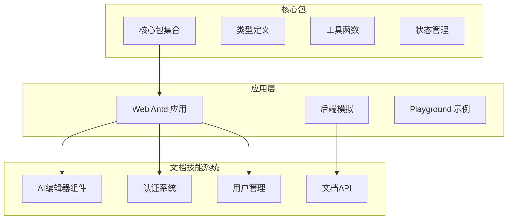
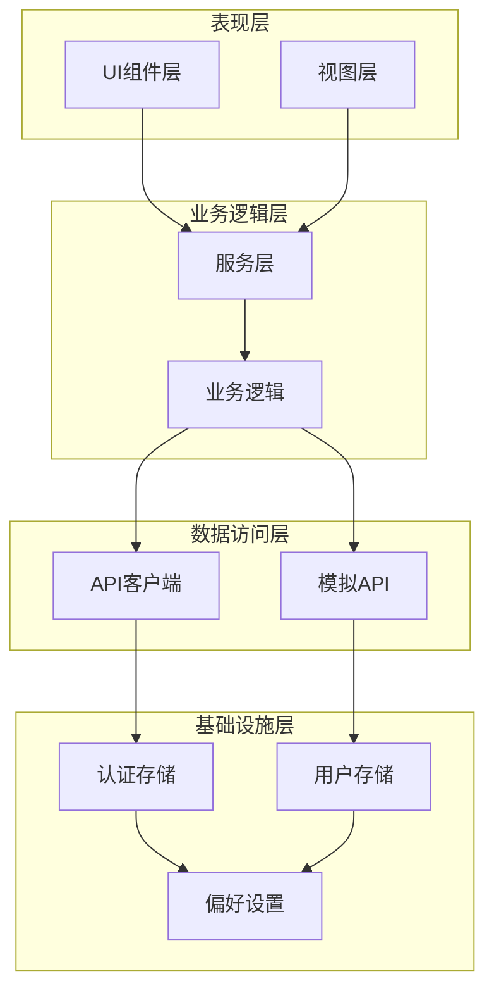
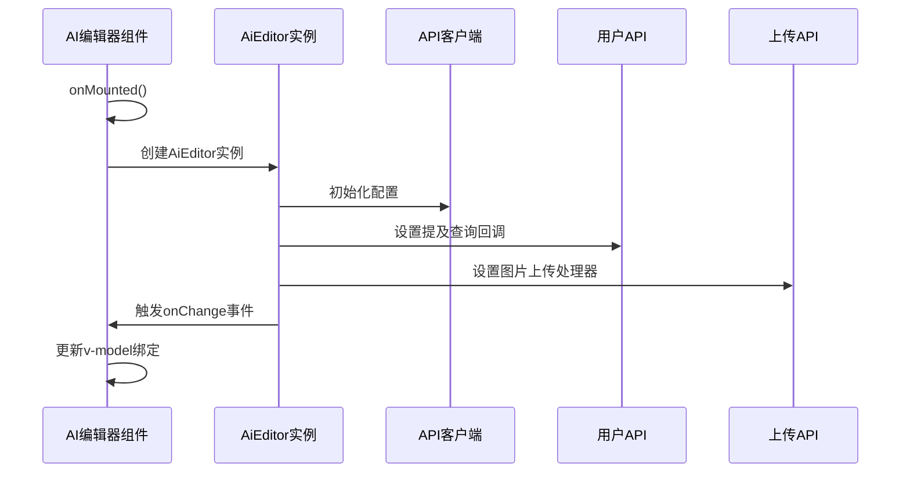
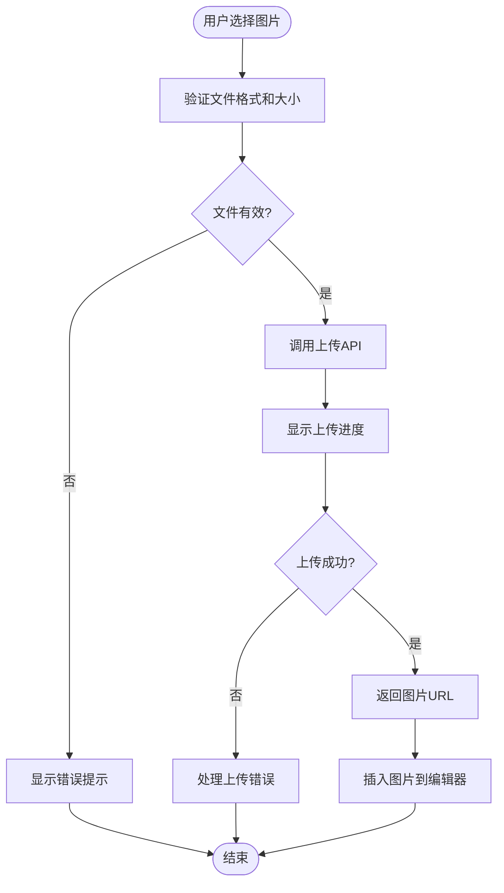
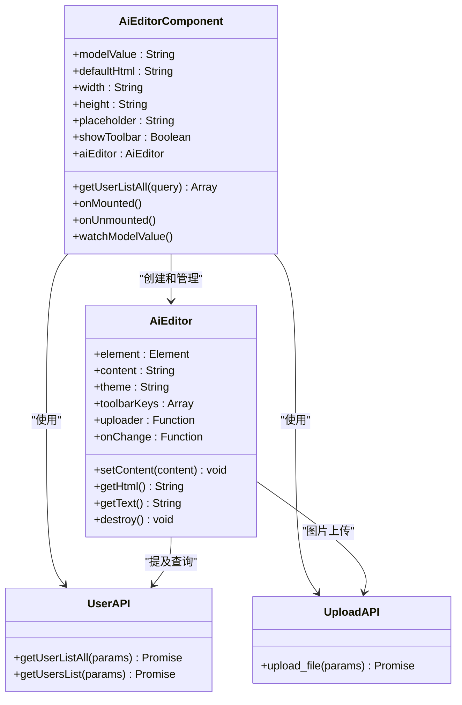
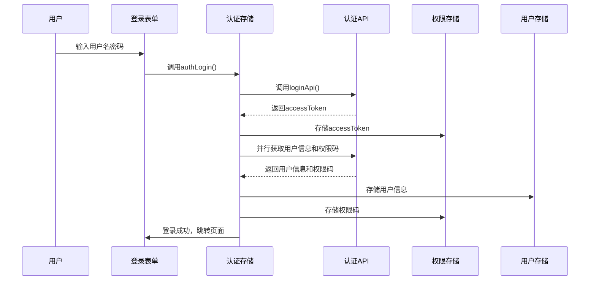
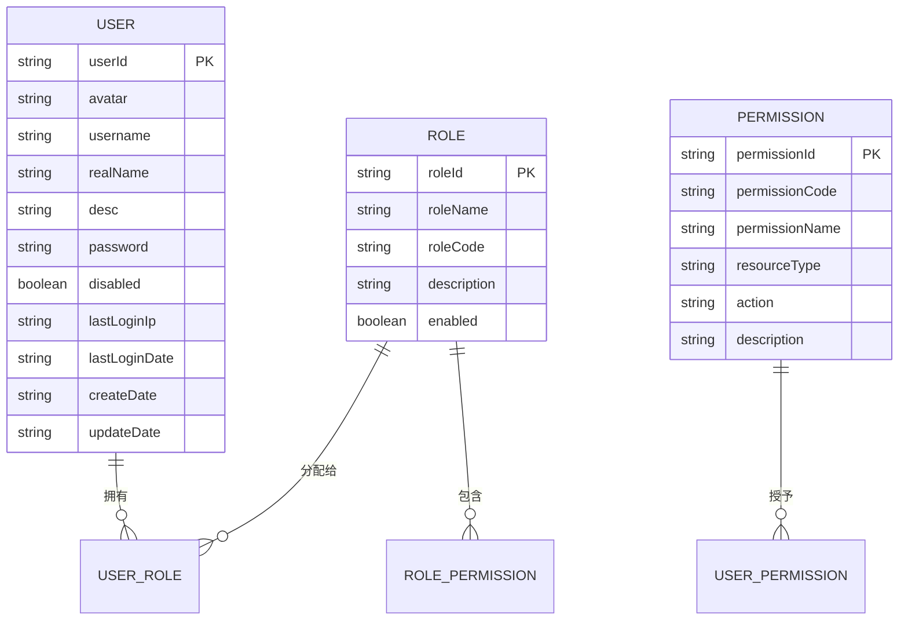
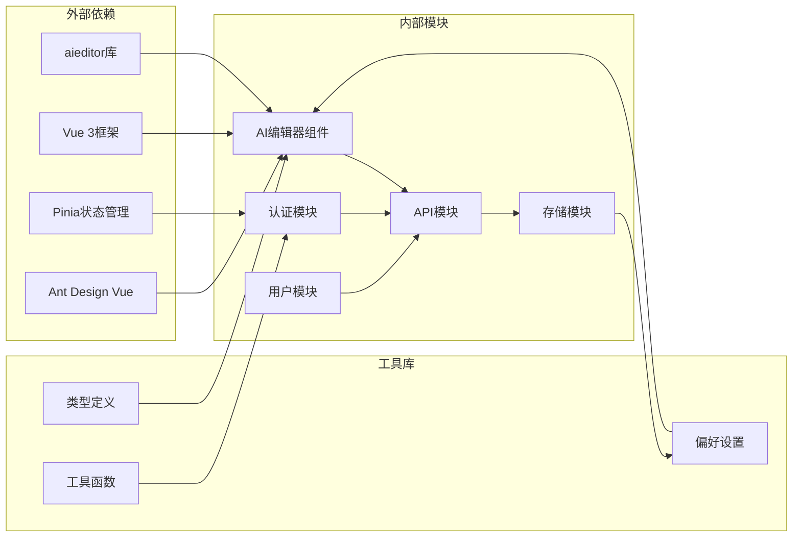

# AI文档技能系统

<cite>
**本文档引用的文件**
- [README.md](file://README.md)
- [index.vue](file://apps/web-antd/src/components/AiEditor/index.vue)
- [auth.ts](file://apps/web-antd/src/api/core/auth.ts)
- [index.ts](file://apps/web-antd/src/api/core/index.ts)
- [login.post.ts](file://apps/backend-mock/api/auth/login.post.ts)
- [auth.ts](file://apps/web-antd/src/store/auth.ts)
- [user.ts](file://apps/web-antd/src/api/system/user.ts)
- [upload.ts](file://apps/web-antd/src/api/examples/upload.ts)
- [dev.ts](file://apps/web-antd/src/router/routes/modules/dev.ts)
- [index.ts](file://apps/web-antd/src/adapter/component/index.ts)
</cite>

## 目录
1. [简介](#简介)
2. [项目结构](#项目结构)
3. [核心组件](#核心组件)
4. [架构概览](#架构概览)
5. [详细组件分析](#详细组件分析)
6. [依赖关系分析](#依赖关系分析)
7. [性能考虑](#性能考虑)
8. [故障排除指南](#故障排除指南)
9. [结论](#结论)

## 简介

AI文档技能系统是一个基于Vue 3和Vite构建的现代化前端应用，专注于提供智能文档编辑和协作功能。该系统集成了AI增强的富文本编辑器，支持实时协作、智能内容生成和文档管理功能。

本系统采用模块化架构设计，包含完整的认证授权机制、用户管理系统和文档编辑功能。通过集成第三方AI服务，为用户提供智能化的文档创作体验。

## 项目结构

项目采用多包架构，主要包含以下核心模块：

**图表来源**
- [README.md:17-32](file://README.md#L17-L32)
- [index.vue:1-153](file://apps/web-antd/src/components/AiEditor/index.vue#L1-L153)

**章节来源**
- [README.md:17-32](file://README.md#L17-L32)
- [README.md:51-54](file://README.md#L51-L54)

## 核心组件

### AI编辑器组件

AI编辑器是系统的核心组件，基于aieditor库构建，提供丰富的文档编辑功能：

- **实时协作编辑**：支持多用户同时编辑同一文档
- **智能提及功能**：集成用户搜索和提及系统
- **图片上传**：支持本地图片上传和预览
- **主题切换**：支持明暗主题模式
- **工具栏定制**：可配置的工具栏按钮集合

### 认证系统

系统提供完整的用户认证和授权机制：

- **JWT令牌管理**：支持访问令牌和刷新令牌
- **权限码系统**：动态权限控制和验证
- **会话管理**：自动登录状态管理和过期处理
- **多角色支持**：基于角色的权限分配

### 用户管理系统

集成化的用户管理功能：

- **用户查询**：支持按姓名等条件搜索用户
- **用户信息维护**：完整的用户信息管理
- **头像显示**：支持用户头像展示和更新
- **权限关联**：用户与权限的关联管理

**章节来源**
- [index.vue:7-153](file://apps/web-antd/src/components/AiEditor/index.vue#L7-L153)
- [auth.ts:1-52](file://apps/web-antd/src/api/core/auth.ts#L1-L52)
- [user.ts:1-54](file://apps/web-antd/src/api/system/user.ts#L1-L54)

## 架构概览

系统采用分层架构设计，确保各组件间的松耦合和高内聚：

**图表来源**
- [auth.ts:16-118](file://apps/web-antd/src/store/auth.ts#L16-L118)
- [index.vue:36-114](file://apps/web-antd/src/components/AiEditor/index.vue#L36-L114)

## 详细组件分析

### AI编辑器组件深度解析

AI编辑器组件实现了完整的文档编辑功能，包括以下关键特性：

#### 组件初始化流程

**图表来源**
- [index.vue:36-114](file://apps/web-antd/src/components/AiEditor/index.vue#L36-L114)
- [index.vue:131-139](file://apps/web-antd/src/components/AiEditor/index.vue#L131-L139)

#### 图片上传处理流程

**图表来源**
- [index.vue:54-87](file://apps/web-antd/src/components/AiEditor/index.vue#L54-L87)
- [upload.ts:9-24](file://apps/web-antd/src/api/examples/upload.ts#L9-L24)

#### 用户提及功能实现

AI编辑器集成了智能用户提及功能，支持通过@符号快速提及其他用户：

**图表来源**
- [index.vue:21-35](file://apps/web-antd/src/components/AiEditor/index.vue#L21-L35)
- [index.vue:131-139](file://apps/web-antd/src/components/AiEditor/index.vue#L131-L139)

**章节来源**
- [index.vue:1-153](file://apps/web-antd/src/components/AiEditor/index.vue#L1-L153)

### 认证系统组件分析

认证系统提供了完整的用户身份验证和授权机制：

#### 登录流程序列图

**图表来源**
- [auth.ts:28-78](file://apps/web-antd/src/store/auth.ts#L28-L78)
- [auth.ts:24-44](file://apps/web-antd/src/api/core/auth.ts#L24-L44)

#### 权限管理机制

系统采用基于角色的权限控制模型，支持细粒度的权限管理：

- **权限码系统**：通过`getAccessCodesApi()`获取用户权限码
- **动态路由生成**：根据权限码动态生成可访问的路由
- **组件级权限控制**：支持在组件层面进行权限验证
- **API级权限保护**：后端API接口的权限验证

**章节来源**
- [auth.ts:16-118](file://apps/web-antd/src/store/auth.ts#L16-L118)
- [auth.ts:1-52](file://apps/web-antd/src/api/core/auth.ts#L1-L52)

### 用户管理系统分析

用户管理系统提供了完整的用户生命周期管理功能：

#### 用户数据模型

**图表来源**
- [user.ts:4-18](file://apps/web-antd/src/api/system/user.ts#L4-L18)

#### 用户操作流程

系统支持多种用户操作场景：

- **用户查询**：支持按条件搜索和分页查询
- **用户创建**：提供用户注册和信息录入功能
- **用户更新**：支持用户信息的修改和更新
- **用户状态管理**：支持用户的启用和禁用操作

**章节来源**
- [user.ts:21-54](file://apps/web-antd/src/api/system/user.ts#L21-L54)

## 依赖关系分析

系统采用模块化依赖管理，确保各组件间的清晰边界：

**图表来源**
- [index.vue:8-13](file://apps/web-antd/src/components/AiEditor/index.vue#L8-L13)
- [auth.ts:13](file://apps/web-antd/src/store/auth.ts#L13)

### 关键依赖关系

系统的关键依赖关系包括：

- **AI编辑器依赖**：依赖aieditor库提供富文本编辑功能
- **认证依赖**：依赖JWT令牌进行用户身份验证
- **状态管理依赖**：依赖Pinia进行全局状态管理
- **UI框架依赖**：依赖Ant Design Vue提供组件库

**章节来源**
- [index.vue:8-13](file://apps/web-antd/src/components/AiEditor/index.vue#L8-L13)
- [auth.ts:13](file://apps/web-antd/src/store/auth.ts#L13)

## 性能考虑

系统在设计时充分考虑了性能优化：

### 编辑器性能优化

- **懒加载机制**：AI编辑器组件采用异步加载，减少初始包体积
- **内存管理**：组件卸载时自动清理编辑器实例，防止内存泄漏
- **防抖处理**：对频繁的编辑事件进行防抖处理，提升响应性能

### 数据传输优化

- **增量更新**：只传输变更的数据，减少网络传输量
- **缓存策略**：合理使用浏览器缓存和服务器缓存
- **压缩传输**：支持Gzip等压缩算法减少传输时间

### 用户体验优化

- **渐进式渲染**：优先渲染关键内容，提升首屏速度
- **骨架屏**：在数据加载时显示骨架屏提升用户体验
- **离线支持**：部分功能支持离线使用

## 故障排除指南

### 常见问题及解决方案

#### AI编辑器无法加载

**问题描述**：AI编辑器组件加载失败或显示空白

**可能原因**：
- aieditor库加载失败
- DOM元素未正确初始化
- 主题配置错误

**解决方案**：
1. 检查网络连接和CDN资源
2. 确认DOM元素存在且可访问
3. 验证主题配置是否正确

#### 用户提及功能异常

**问题描述**：@用户提及功能无法正常工作

**可能原因**：
- 用户API调用失败
- 网络请求超时
- 权限不足

**解决方案**：
1. 检查用户API接口状态
2. 验证网络连接稳定性
3. 确认用户权限配置

#### 图片上传失败

**问题描述**：编辑器中插入图片时上传失败

**可能原因**：
- 文件格式不支持
- 文件大小超出限制
- 上传接口配置错误

**解决方案**：
1. 检查文件格式和大小限制
2. 验证上传接口配置
3. 查看服务器日志获取详细错误信息

**章节来源**
- [index.vue:116-118](file://apps/web-antd/src/components/AiEditor/index.vue#L116-L118)
- [upload.ts:15-24](file://apps/web-antd/src/api/examples/upload.ts#L15-L24)

## 结论

AI文档技能系统是一个功能完整、架构清晰的现代化前端应用。系统通过集成AI增强的编辑器、完善的认证授权机制和灵活的用户管理功能，为用户提供了智能化的文档创作体验。

### 主要优势

- **技术先进性**：采用Vue 3、Vite等最新前端技术栈
- **功能完整性**：涵盖文档编辑、用户管理、权限控制等核心功能
- **扩展性强**：模块化设计便于功能扩展和维护
- **用户体验好**：提供流畅的交互体验和响应式界面

### 技术特色

- **AI集成**：深度集成了AI文档编辑功能
- **实时协作**：支持多用户实时协作编辑
- **智能提及**：提供智能的用户提及和协作功能
- **主题适配**：支持明暗主题切换

该系统为后续的功能扩展和技术升级奠定了良好的基础，是一个值得学习和参考的优秀前端项目。