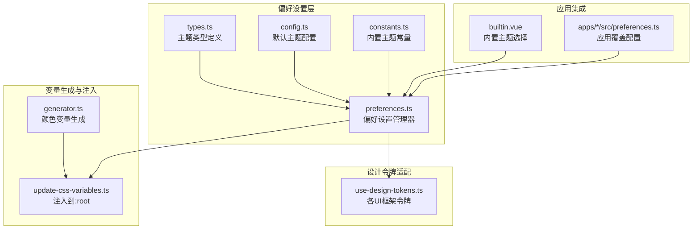
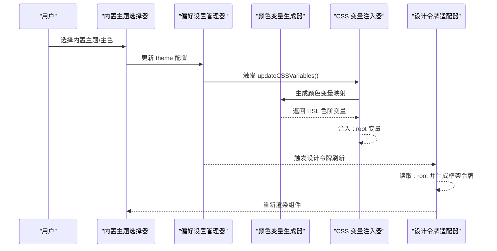
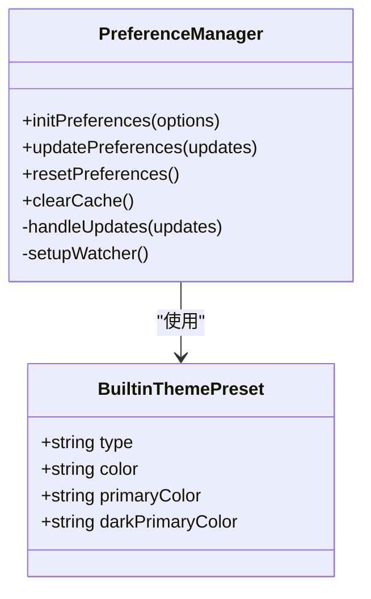
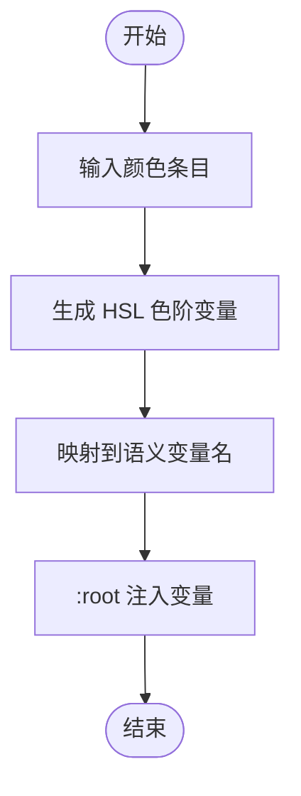
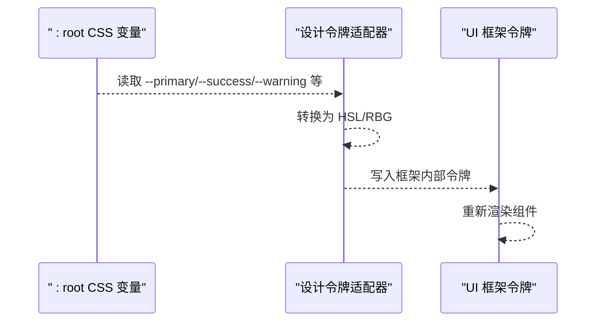
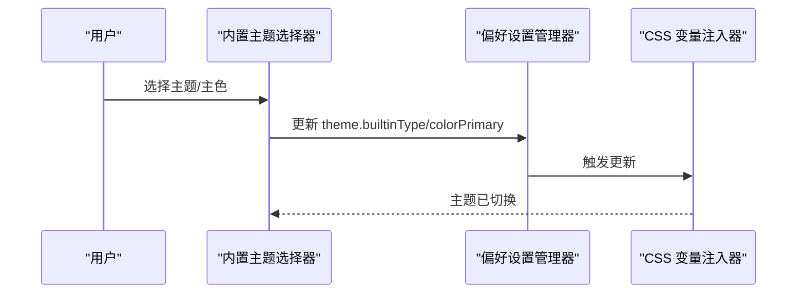
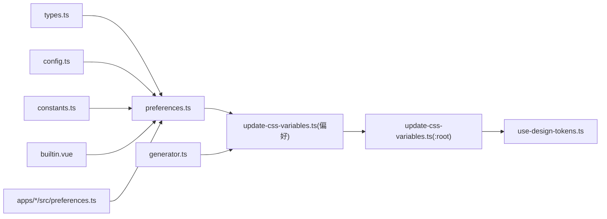

# 主题扩展开发

<cite>
**本文引用的文件**
- [update-css-variables.ts](file://packages/@core/preferences/src/update-css-variables.ts)
- [preferences.ts](file://packages/@core/preferences/src/preferences.ts)
- [constants.ts](file://packages/@core/preferences/src/constants.ts)
- [types.ts](file://packages/@core/preferences/src/types.ts)
- [config.ts](file://packages/@core/preferences/src/config.ts)
- [generator.ts](file://packages/@core/base/shared/src/color/generator.ts)
- [update-css-variables.ts](file://packages/@core/base/shared/src/utils/update-css-variables.ts)
- [use-design-tokens.ts](file://packages/effects/hooks/src/use-design-tokens.ts)
- [builtin.vue](file://packages/effects/layouts/src/widgets/preferences/blocks/theme/builtin.vue)
- [theme.md](file://docs/src/guide/in-depth/theme.md)
- [preferences.ts](file://apps/web-antd/src/preferences.ts)
- [preferences.ts](file://playground/src/preferences.ts)
- [update-css-variables.test.ts](file://packages/@core/base/shared/src/utils/__tests__/update-css-variables.test.ts)
- [versionUtils.ts](file://apps/web-antd/src/utils/versionUtils.ts)
</cite>

## 目录

1. [简介](#简介)
2. [项目结构](#项目结构)
3. [核心组件](#核心组件)
4. [架构总览](#架构总览)
5. [详细组件分析](#详细组件分析)
6. [依赖关系分析](#依赖关系分析)
7. [性能考量](#性能考量)
8. [故障排查指南](#故障排查指南)
9. [结论](#结论)
10. [附录](#附录)

## 简介

本指南面向希望深度定制与扩展主题系统的开发者，系统讲解主题系统的架构与运行机制，涵盖 CSS 变量体系、样式覆盖策略、动态主题切换、设计令牌适配、主题打包与分发、兼容性与版本管理，并提供从简单颜色调整到完整品牌主题定制的实际示例与测试验证方法。

## 项目结构

主题系统围绕“偏好设置”“CSS 变量生成与注入”“UI 框架设计令牌适配”三大支柱构建，配合内置主题常量与类型约束，形成可扩展、可维护的主题生态。

图示来源

- [preferences.ts:1-235](file://packages/@core/preferences/src/preferences.ts#L1-L235)
- [types.ts:239-262](file://packages/@core/preferences/src/types.ts#L239-L262)
- [config.ts:115-127](file://packages/@core/preferences/src/config.ts#L115-L127)
- [constants.ts:10-79](file://packages/@core/preferences/src/constants.ts#L10-L79)
- [generator.ts:11-43](file://packages/@core/base/shared/src/color/generator.ts#L11-L43)
- [update-css-variables.ts:5-33](file://packages/@core/base/shared/src/utils/update-css-variables.ts#L5-L33)
- [use-design-tokens.ts:10-75](file://packages/effects/hooks/src/use-design-tokens.ts#L10-L75)
- [builtin.vue:37-93](file://packages/effects/layouts/src/widgets/preferences/blocks/theme/builtin.vue#L37-L93)
- [preferences.ts:8-30](file://apps/web-antd/src/preferences.ts#L8-L30)

章节来源

- [preferences.ts:1-235](file://packages/@core/preferences/src/preferences.ts#L1-L235)
- [types.ts:239-262](file://packages/@core/preferences/src/types.ts#L239-L262)
- [config.ts:115-127](file://packages/@core/preferences/src/config.ts#L115-L127)
- [constants.ts:10-79](file://packages/@core/preferences/src/constants.ts#L10-L79)
- [generator.ts:11-43](file://packages/@core/base/shared/src/color/generator.ts#L11-L43)
- [update-css-variables.ts:5-33](file://packages/@core/base/shared/src/utils/update-css-variables.ts#L5-L33)
- [use-design-tokens.ts:10-75](file://packages/effects/hooks/src/use-design-tokens.ts#L10-L75)
- [builtin.vue:37-93](file://packages/effects/layouts/src/widgets/preferences/blocks/theme/builtin.vue#L37-L93)
- [preferences.ts:8-30](file://apps/web-antd/src/preferences.ts#L8-L30)

## 核心组件

- 偏好设置管理器：负责加载/合并/持久化用户主题偏好，触发 CSS 变量更新与 UI 切换。
- 主题常量与类型：统一内置主题清单、主题模式、颜色字段等类型约束。
- 颜色变量生成器：将单一主色扩展为 HSL 色阶变量，映射到语义变量名。
- CSS 变量注入器：将生成的颜色变量与尺寸变量注入到 :root，驱动全局样式。
- 设计令牌适配器：将 CSS 变量映射为各 UI 框架（Ant Design、Naive、Element Plus）的内部令牌。
- 内置主题选择器：提供主题切换 UI，联动偏好设置与 CSS 变量更新。
- 应用覆盖配置：在应用层通过 preferences.ts 覆盖默认主题参数。

章节来源

- [preferences.ts:136-152](file://packages/@core/preferences/src/preferences.ts#L136-L152)
- [constants.ts:10-79](file://packages/@core/preferences/src/constants.ts#L10-L79)
- [types.ts:239-262](file://packages/@core/preferences/src/types.ts#L239-L262)
- [generator.ts:11-43](file://packages/@core/base/shared/src/color/generator.ts#L11-L43)
- [update-css-variables.ts:5-33](file://packages/@core/base/shared/src/utils/update-css-variables.ts#L5-L33)
- [use-design-tokens.ts:10-75](file://packages/effects/hooks/src/use-design-tokens.ts#L10-L75)
- [builtin.vue:91-121](file://packages/effects/layouts/src/widgets/preferences/blocks/theme/builtin.vue#L91-L121)

## 架构总览

主题系统采用“偏好设置变更 → 计算并注入 CSS 变量 → UI 框架读取设计令牌”的链路，确保主题切换实时、一致且可扩展。

图示来源

- [builtin.vue:91-121](file://packages/effects/layouts/src/widgets/preferences/blocks/theme/builtin.vue#L91-L121)
- [preferences.ts:136-152](file://packages/@core/preferences/src/preferences.ts#L136-L152)
- [update-css-variables.ts:12-83](file://packages/@core/preferences/src/update-css-variables.ts#L12-L83)
- [generator.ts:11-43](file://packages/@core/base/shared/src/color/generator.ts#L11-L43)
- [update-css-variables.ts:5-33](file://packages/@core/base/shared/src/utils/update-css-variables.ts#L5-L33)
- [use-design-tokens.ts:36-70](file://packages/effects/hooks/src/use-design-tokens.ts#L36-L70)

## 详细组件分析

### 偏好设置与主题常量

- 偏好设置管理器负责：
  - 初始化与合并覆盖配置
  - 监听主题变更并调用 CSS 变量更新
  - 维护系统主题偏好（如自动跟随系统深色）
- 主题常量定义内置主题清单，含主色、暗色主色等字段，供偏好设置选择使用。
- 类型系统严格约束主题字段，保证配置一致性。

图示来源

- [preferences.ts:25-230](file://packages/@core/preferences/src/preferences.ts#L25-L230)
- [constants.ts:3-8](file://packages/@core/preferences/src/constants.ts#L3-L8)
- [types.ts:239-262](file://packages/@core/preferences/src/types.ts#L239-L262)

章节来源

- [preferences.ts:70-152](file://packages/@core/preferences/src/preferences.ts#L70-L152)
- [constants.ts:10-79](file://packages/@core/preferences/src/constants.ts#L10-L79)
- [types.ts:239-262](file://packages/@core/preferences/src/types.ts#L239-L262)

### 颜色变量生成与注入

- 颜色变量生成器接收一组颜色条目，基于主题色生成 HSL 色阶变量，并映射到语义变量名（如 --primary-500 → --primary）。
- CSS 变量注入器将变量写入 :root，同时支持按 ID 管理样式块，避免重复注入。

图示来源

- [generator.ts:11-43](file://packages/@core/base/shared/src/color/generator.ts#L11-L43)
- [update-css-variables.ts:5-33](file://packages/@core/base/shared/src/utils/update-css-variables.ts#L5-L33)

章节来源

- [generator.ts:11-43](file://packages/@core/base/shared/src/color/generator.ts#L11-L43)
- [update-css-variables.ts:5-33](file://packages/@core/base/shared/src/utils/update-css-variables.ts#L5-L33)

### 设计令牌适配

- 适配器从 :root 读取 CSS 变量，转换为各 UI 框架所需的内部令牌（如 Ant Design、Naive、Element Plus），并在主题变更时自动刷新。
- 该机制确保同一套 CSS 变量在不同 UI 框架下保持视觉一致性。

图示来源

- [use-design-tokens.ts:10-75](file://packages/effects/hooks/src/use-design-tokens.ts#L10-L75)
- [use-design-tokens.ts:163-321](file://packages/effects/hooks/src/use-design-tokens.ts#L163-L321)

章节来源

- [use-design-tokens.ts:10-75](file://packages/effects/hooks/src/use-design-tokens.ts#L10-L75)
- [use-design-tokens.ts:163-321](file://packages/effects/hooks/src/use-design-tokens.ts#L163-L321)

### 内置主题选择与动态切换

- 内置主题选择器提供主题列表与主色选择入口，联动偏好设置与 CSS 变量更新，实现即时切换。
- 切换逻辑考虑明/暗模式差异，自动选择对应主色。

图示来源

- [builtin.vue:91-121](file://packages/effects/layouts/src/widgets/preferences/blocks/theme/builtin.vue#L91-L121)
- [preferences.ts:136-152](file://packages/@core/preferences/src/preferences.ts#L136-L152)
- [update-css-variables.ts:12-83](file://packages/@core/preferences/src/update-css-variables.ts#L12-L83)

章节来源

- [builtin.vue:37-121](file://packages/effects/layouts/src/widgets/preferences/blocks/theme/builtin.vue#L37-L121)
- [preferences.ts:136-152](file://packages/@core/preferences/src/preferences.ts#L136-L152)
- [update-css-variables.ts:12-83](file://packages/@core/preferences/src/update-css-variables.ts#L12-L83)

### 主题变量定义与管理

- 变量命名约定：以 -- 前缀，语义化命名（如 --primary、--success、--background、--foreground、--radius、--font-size-base）。
- 作用域控制：通过 data-theme 与 .dark 类控制全局与暗色作用域；组件级覆盖通过局部 CSS 变量或框架类名实现。
- 文档提供了默认变量清单与覆盖示例，便于快速定制。

章节来源

- [theme.md:27-124](file://docs/src/guide/in-depth/theme.md#L27-L124)
- [theme.md:223-245](file://docs/src/guide/in-depth/theme.md#L223-L245)
- [theme.md:247-275](file://docs/src/guide/in-depth/theme.md#L247-L275)

### 样式定制技术实现

- CSS-in-JS：通过注入器动态写入 :root 变量，适合程序化主题切换。
- CSS 模块/预处理器：通过覆盖默认变量或在组件作用域内重写变量，实现局部定制。
- 设计令牌适配：统一由 CSS 变量驱动，减少各 UI 框架的差异化成本。

章节来源

- [update-css-variables.ts:5-33](file://packages/@core/base/shared/src/utils/update-css-variables.ts#L5-L33)
- [use-design-tokens.ts:10-75](file://packages/effects/hooks/src/use-design-tokens.ts#L10-L75)
- [theme.md:223-245](file://docs/src/guide/in-depth/theme.md#L223-L245)

### 主题打包与分发

- 应用层通过 preferences.ts 覆盖默认主题参数，形成项目级主题包。
- 内置主题常量与类型确保主题清单可扩展，便于团队共享与复用。
- 建议将主题包作为独立包发布，提供默认变量与覆盖示例，降低接入成本。

章节来源

- [constants.ts:10-79](file://packages/@core/preferences/src/constants.ts#L10-L79)
- [types.ts:239-262](file://packages/@core/preferences/src/types.ts#L239-L262)
- [preferences.ts:8-30](file://apps/web-antd/src/preferences.ts#L8-L30)

### 主题兼容性与版本管理

- 兼容性：通过设计令牌适配器与 CSS 变量体系，确保在不同 UI 框架间的一致性。
- 版本管理：建议对主题包进行语义化版本管理，变更类型包括主版本（破坏性变更）、次版本（新增功能）、修订补丁（修复）。
- 版本工具参考：仓库中存在版本号解析与比较工具，可用于主题包的版本演进与迁移提示。

章节来源

- [versionUtils.ts:22-106](file://apps/web-antd/src/utils/versionUtils.ts#L22-L106)

### 实际开发示例

- 简单颜色调整：在应用 preferences.ts 中覆盖 colorPrimary、colorSuccess、colorWarning、colorDestructive，清空缓存后生效。
- 完整品牌主题：新增内置主题类型，提供明/暗两套变量覆盖，结合 data-theme 与 .dark 选择器实现双模式适配。
- 示例路径：
  - 应用覆盖配置：[apps/web-antd/src/preferences.ts:8-30](file://apps/web-antd/src/preferences.ts#L8-L30)
  - Playground 覆盖配置：[playground/src/preferences.ts:8-13](file://playground/src/preferences.ts#L8-L13)
  - 主题变量覆盖示例：[docs/src/guide/in-depth/theme.md:223-275](file://docs/src/guide/in-depth/theme.md#L223-L275)

章节来源

- [preferences.ts:8-30](file://apps/web-antd/src/preferences.ts#L8-L30)
- [preferences.ts:8-13](file://playground/src/preferences.ts#L8-L13)
- [theme.md:223-275](file://docs/src/guide/in-depth/theme.md#L223-L275)

### 主题测试与验证

- 单元测试：对 CSS 变量注入器进行单元测试，验证注入行为与样式块更新。
- 验证要点：确认 :root 中变量正确注入、暗色模式与明色模式变量区分、UI 框架令牌读取正常。
- 测试文件：[packages/@core/base/shared/src/utils/**tests**/update-css-variables.test.ts:5-30](file://packages/@core/base/shared/src/utils/__tests__/update-css-variables.test.ts#L5-L30)

章节来源

- [update-css-variables.test.ts:5-30](file://packages/@core/base/shared/src/utils/__tests__/update-css-variables.test.ts#L5-L30)

## 依赖关系分析

主题系统内部依赖清晰，耦合度低，扩展性强。

图示来源

- [types.ts:239-262](file://packages/@core/preferences/src/types.ts#L239-L262)
- [preferences.ts:1-235](file://packages/@core/preferences/src/preferences.ts#L1-L235)
- [config.ts:115-127](file://packages/@core/preferences/src/config.ts#L115-L127)
- [constants.ts:10-79](file://packages/@core/preferences/src/constants.ts#L10-L79)
- [update-css-variables.ts:12-83](file://packages/@core/preferences/src/update-css-variables.ts#L12-L83)
- [generator.ts:11-43](file://packages/@core/base/shared/src/color/generator.ts#L11-L43)
- [update-css-variables.ts:5-33](file://packages/@core/base/shared/src/utils/update-css-variables.ts#L5-L33)
- [use-design-tokens.ts:10-75](file://packages/effects/hooks/src/use-design-tokens.ts#L10-L75)
- [builtin.vue:91-121](file://packages/effects/layouts/src/widgets/preferences/blocks/theme/builtin.vue#L91-L121)
- [preferences.ts:8-30](file://apps/web-antd/src/preferences.ts#L8-L30)

章节来源

- [preferences.ts:1-235](file://packages/@core/preferences/src/preferences.ts#L1-L235)
- [update-css-variables.ts:12-83](file://packages/@core/preferences/src/update-css-variables.ts#L12-L83)
- [use-design-tokens.ts:10-75](file://packages/effects/hooks/src/use-design-tokens.ts#L10-L75)

## 性能考量

- 变更节流：偏好设置更新采用防抖保存，减少频繁写入缓存与样式注入。
- 按需刷新：仅当主题相关字段变更时触发 CSS 变量更新与设计令牌刷新。
- 变量注入去重：通过唯一 ID 管理样式块，避免重复注入导致的重排与闪烁。
- 深色模式检测：仅在自动模式下监听系统偏好变化，避免不必要的切换。

章节来源

- [preferences.ts:37-40](file://packages/@core/preferences/src/preferences.ts#L37-L40)
- [preferences.ts:202-216](file://packages/@core/preferences/src/preferences.ts#L202-L216)
- [update-css-variables.ts:5-33](file://packages/@core/base/shared/src/utils/update-css-variables.ts#L5-L33)

## 故障排查指南

- 主题不生效：确认已清空缓存；检查 data-theme 与 .dark 是否正确设置；核对 :root 变量是否注入成功。
- 暗色模式异常：检查主题模式配置与系统偏好监听逻辑；确认暗色变量覆盖是否正确。
- UI 框架样式未更新：确认设计令牌适配器已读取最新变量；检查变量命名与映射是否一致。
- 自定义主题未出现：确认内置主题类型已在常量中注册；CSS 变量覆盖范围是否包含暗色模式选择器。

章节来源

- [preferences.ts:136-152](file://packages/@core/preferences/src/preferences.ts#L136-L152)
- [update-css-variables.ts:12-83](file://packages/@core/preferences/src/update-css-variables.ts#L12-L83)
- [use-design-tokens.ts:36-70](file://packages/effects/hooks/src/use-design-tokens.ts#L36-L70)
- [theme.md:223-245](file://docs/src/guide/in-depth/theme.md#L223-L245)

## 结论

本主题系统以 CSS 变量为核心，结合颜色变量生成、设计令牌适配与偏好设置管理，实现了跨 UI 框架、可扩展、可维护的主题体系。通过内置主题常量、类型约束与应用层覆盖配置，开发者可以快速完成从简单颜色调整到完整品牌主题的定制，并通过测试与版本管理保障长期演进的稳定性。

## 附录

- 默认主题变量清单与覆盖示例参见文档主题章节。
- 应用层覆盖配置示例：
  - Web Antd 示例：[apps/web-antd/src/preferences.ts:8-30](file://apps/web-antd/src/preferences.ts#L8-L30)
  - Playground 示例：[playground/src/preferences.ts:8-13](file://playground/src/preferences.ts#L8-L13)

章节来源

- [theme.md:27-124](file://docs/src/guide/in-depth/theme.md#L27-L124)
- [preferences.ts:8-30](file://apps/web-antd/src/preferences.ts#L8-L30)
- [preferences.ts:8-13](file://playground/src/preferences.ts#L8-L13)
