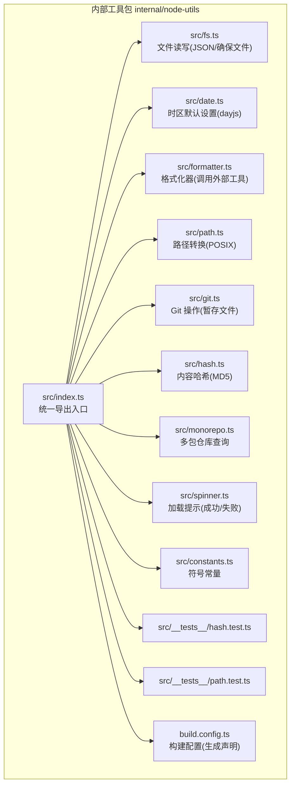
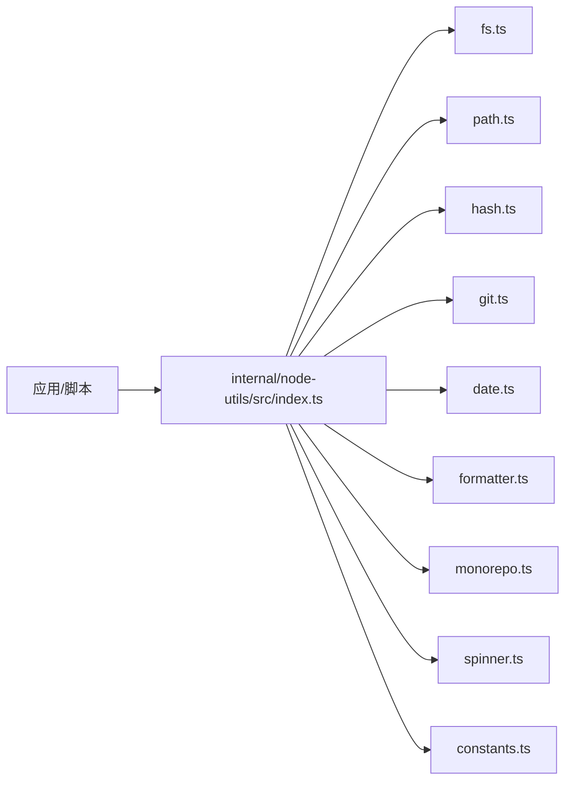
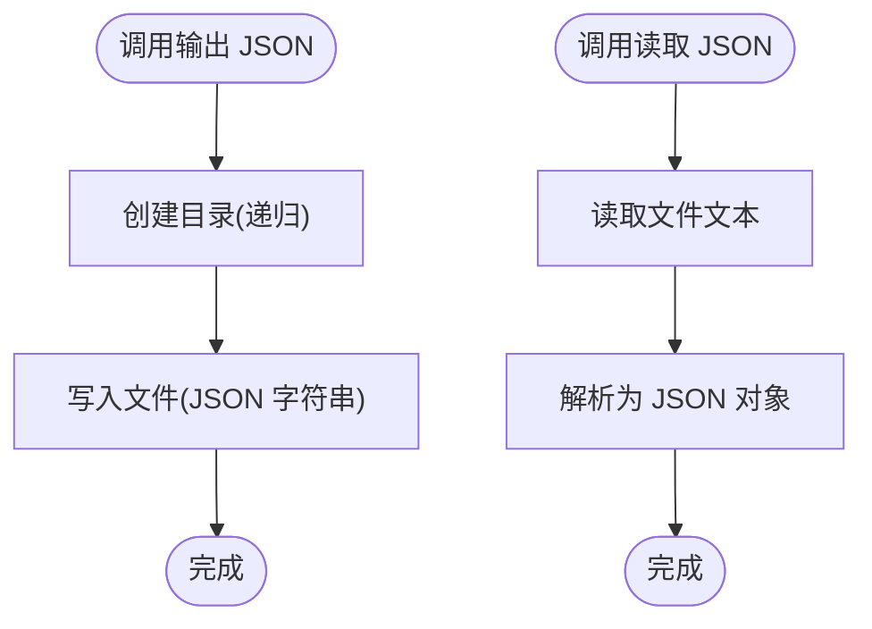
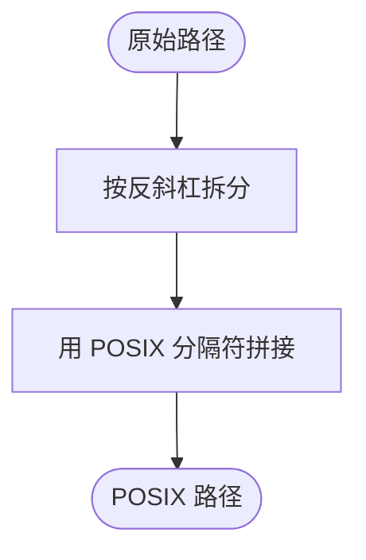
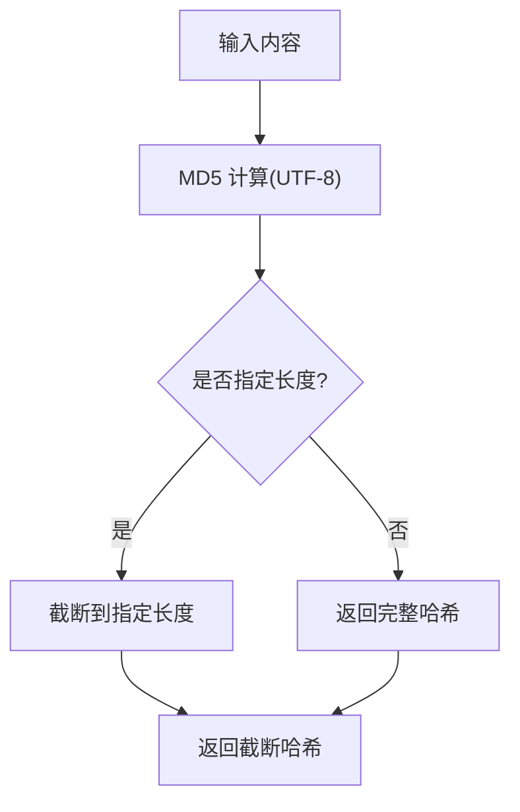
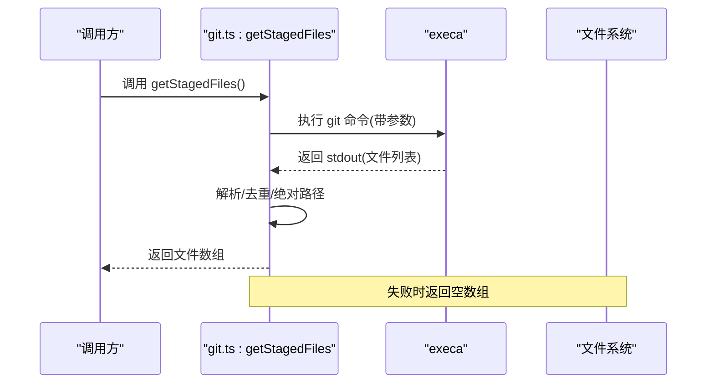
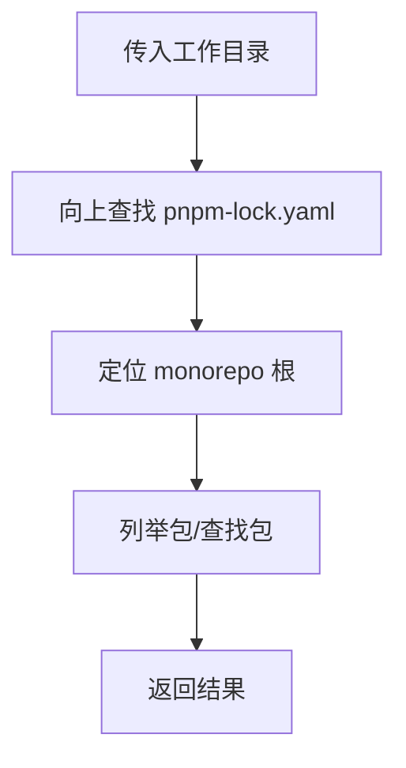
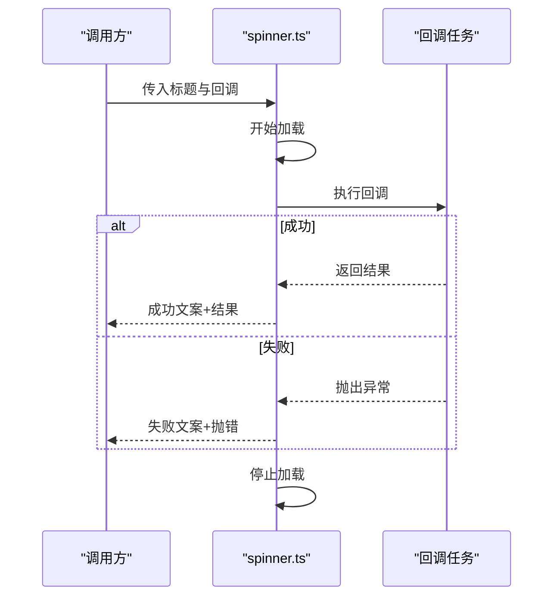
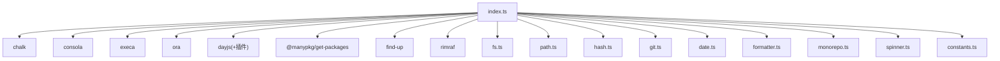

# 工具函数开发

<cite>
**本文引用的文件**
- [internal/node-utils/src/index.ts](file://internal/node-utils/src/index.ts)
- [internal/node-utils/src/fs.ts](file://internal/node-utils/src/fs.ts)
- [internal/node-utils/src/date.ts](file://internal/node-utils/src/date.ts)
- [internal/node-utils/src/formatter.ts](file://internal/node-utils/src/formatter.ts)
- [internal/node-utils/src/path.ts](file://internal/node-utils/src/path.ts)
- [internal/node-utils/src/git.ts](file://internal/node-utils/src/git.ts)
- [internal/node-utils/src/hash.ts](file://internal/node-utils/src/hash.ts)
- [internal/node-utils/src/monorepo.ts](file://internal/node-utils/src/monorepo.ts)
- [internal/node-utils/src/spinner.ts](file://internal/node-utils/src/spinner.ts)
- [internal/node-utils/src/constants.ts](file://internal/node-utils/src/constants.ts)
- [internal/node-utils/src/__tests__/hash.test.ts](file://internal/node-utils/src/__tests__/hash.test.ts)
- [internal/node-utils/src/__tests__/path.test.ts](file://internal/node-utils/src/__tests__/path.test.ts)
- [internal/node-utils/build.config.ts](file://internal/node-utils/build.config.ts)
</cite>

## 目录
1. 引言
2. 项目结构
3. 核心组件
4. 架构总览
5. 详细组件分析
6. 依赖分析
7. 性能考虑
8. 故障排查指南
9. 结论
10. 附录

## 引言
本指南面向希望在本仓库中系统化开发与维护高质量工具函数的工程师。内容覆盖设计原则（单一职责、无副作用、可测试性）、常见工具函数分类与实现要点（字符串处理、数组操作、对象处理、日期时间处理）、Node.js 工具函数（文件操作、系统命令、进程管理）、类型定义与 TypeScript 支持、测试方法与覆盖率建议、文档与发布流程，以及从简单辅助函数到复杂业务工具的实践范式与性能优化、内存管理建议。

## 项目结构
本仓库在内部包中提供了完善的 Node 工具集，核心位于 internal/node-utils，导出统一入口，按功能模块拆分文件，便于按需引入与测试。

图表来源
- [internal/node-utils/src/index.ts:1-20](file://internal/node-utils/src/index.ts#L1-L20)
- [internal/node-utils/src/fs.ts:1-40](file://internal/node-utils/src/fs.ts#L1-L40)
- [internal/node-utils/src/date.ts:1-13](file://internal/node-utils/src/date.ts#L1-L13)
- [internal/node-utils/src/formatter.ts:1-14](file://internal/node-utils/src/formatter.ts#L1-L14)
- [internal/node-utils/src/path.ts:1-12](file://internal/node-utils/src/path.ts#L1-L12)
- [internal/node-utils/src/git.ts:1-35](file://internal/node-utils/src/git.ts#L1-L35)
- [internal/node-utils/src/hash.ts:1-19](file://internal/node-utils/src/hash.ts#L1-L19)
- [internal/node-utils/src/monorepo.ts:1-47](file://internal/node-utils/src/monorepo.ts#L1-L47)
- [internal/node-utils/src/spinner.ts:1-27](file://internal/node-utils/src/spinner.ts#L1-L27)
- [internal/node-utils/src/constants.ts:1-7](file://internal/node-utils/src/constants.ts#L1-L7)
- [internal/node-utils/src/__tests__/hash.test.ts:1-53](file://internal/node-utils/src/__tests__/hash.test.ts#L1-L53)
- [internal/node-utils/src/__tests__/path.test.ts:1-68](file://internal/node-utils/src/__tests__/path.test.ts#L1-L68)
- [internal/node-utils/build.config.ts:1-8](file://internal/node-utils/build.config.ts#L1-L8)

章节来源
- [internal/node-utils/src/index.ts:1-20](file://internal/node-utils/src/index.ts#L1-L20)
- [internal/node-utils/build.config.ts:1-8](file://internal/node-utils/build.config.ts#L1-L8)

## 核心组件
- 统一导出入口：集中导出各模块能力，并透出第三方依赖（如 chalk、consola、execa），便于上层按需使用。
- 文件工具：封装 JSON 输出/读取与文件确保创建，提供错误日志与抛错策略。
- 路径工具：提供跨平台路径标准化（Windows 到 POSIX）。
- 哈希工具：基于内容生成固定算法哈希，支持截断长度。
- Git 工具：封装获取暂存文件列表等常用操作。
- 时间工具：统一时区默认值，便于全局时间处理一致性。
- 格式化器：调用外部格式化工具对单文件进行格式化并返回内容。
- 多包仓库工具：定位 monorepo 根、列举包、查找特定包。
- 加载提示：封装成功/失败文案与生命周期控制。
- 常量：提供通用符号常量。

章节来源
- [internal/node-utils/src/index.ts:1-20](file://internal/node-utils/src/index.ts#L1-L20)
- [internal/node-utils/src/fs.ts:1-40](file://internal/node-utils/src/fs.ts#L1-L40)
- [internal/node-utils/src/path.ts:1-12](file://internal/node-utils/src/path.ts#L1-L12)
- [internal/node-utils/src/hash.ts:1-19](file://internal/node-utils/src/hash.ts#L1-L19)
- [internal/node-utils/src/git.ts:1-35](file://internal/node-utils/src/git.ts#L1-L35)
- [internal/node-utils/src/date.ts:1-13](file://internal/node-utils/src/date.ts#L1-L13)
- [internal/node-utils/src/formatter.ts:1-14](file://internal/node-utils/src/formatter.ts#L1-L14)
- [internal/node-utils/src/monorepo.ts:1-47](file://internal/node-utils/src/monorepo.ts#L1-L47)
- [internal/node-utils/src/spinner.ts:1-27](file://internal/node-utils/src/spinner.ts#L1-L27)
- [internal/node-utils/src/constants.ts:1-7](file://internal/node-utils/src/constants.ts#L1-L7)

## 架构总览
工具函数模块采用“按功能拆分 + 入口聚合”的组织方式，既保证了内聚性，也方便上层按需导入。下图展示了模块间的依赖关系与使用方向。

图表来源
- [internal/node-utils/src/index.ts:1-20](file://internal/node-utils/src/index.ts#L1-L20)
- [internal/node-utils/src/fs.ts:1-40](file://internal/node-utils/src/fs.ts#L1-L40)
- [internal/node-utils/src/path.ts:1-12](file://internal/node-utils/src/path.ts#L1-L12)
- [internal/node-utils/src/hash.ts:1-19](file://internal/node-utils/src/hash.ts#L1-L19)
- [internal/node-utils/src/git.ts:1-35](file://internal/node-utils/src/git.ts#L1-L35)
- [internal/node-utils/src/date.ts:1-13](file://internal/node-utils/src/date.ts#L1-L13)
- [internal/node-utils/src/formatter.ts:1-14](file://internal/node-utils/src/formatter.ts#L1-L14)
- [internal/node-utils/src/monorepo.ts:1-47](file://internal/node-utils/src/monorepo.ts#L1-L47)
- [internal/node-utils/src/spinner.ts:1-27](file://internal/node-utils/src/spinner.ts#L1-L27)
- [internal/node-utils/src/constants.ts:1-7](file://internal/node-utils/src/constants.ts#L1-L7)

## 详细组件分析

### 文件工具（fs）
- 功能：输出 JSON、读取 JSON、确保文件存在。
- 设计要点：
  - 单一职责：每个函数只做一件事，避免耦合。
  - 错误处理：捕获异常并记录错误，必要时抛出，供调用方决定策略。
  - 可测试性：通过异步接口暴露，便于注入模拟或替换底层实现。
- 使用场景：配置文件生成、缓存数据持久化、模板渲染结果落盘。

图表来源
- [internal/node-utils/src/fs.ts:4-18](file://internal/node-utils/src/fs.ts#L4-L18)
- [internal/node-utils/src/fs.ts:31-39](file://internal/node-utils/src/fs.ts#L31-L39)

章节来源
- [internal/node-utils/src/fs.ts:1-40](file://internal/node-utils/src/fs.ts#L1-L40)

### 路径工具（path）
- 功能：将任意平台风格路径转换为 POSIX 风格，便于跨平台一致处理。
- 设计要点：
  - 无副作用：纯函数，输入输出一一对应。
  - 边界条件：空字符串、仅分隔符、混合分隔符、起止分隔符等均覆盖测试。
- 使用场景：构建产物路径拼接、Git 提交路径、打包工具链路径处理。

图表来源
- [internal/node-utils/src/path.ts:7-9](file://internal/node-utils/src/path.ts#L7-L9)

章节来源
- [internal/node-utils/src/path.ts:1-12](file://internal/node-utils/src/path.ts#L1-L12)
- [internal/node-utils/src/__tests__/path.test.ts:1-68](file://internal/node-utils/src/__tests__/path.test.ts#L1-L68)

### 哈希工具（hash）
- 功能：基于内容生成固定算法哈希，支持截断长度。
- 设计要点：
  - 单一职责：仅负责内容哈希生成。
  - 可测试性：直接对比标准库生成结果，覆盖空内容、指定长度、截断正确性。
- 使用场景：缓存键生成、变更检测、内容指纹。

图表来源
- [internal/node-utils/src/hash.ts:8-16](file://internal/node-utils/src/hash.ts#L8-L16)

章节来源
- [internal/node-utils/src/hash.ts:1-19](file://internal/node-utils/src/hash.ts#L1-L19)
- [internal/node-utils/src/__tests__/hash.test.ts:1-53](file://internal/node-utils/src/__tests__/hash.test.ts#L1-L53)

### Git 工具（git）
- 功能：获取暂存区文件列表，清理空项并去重。
- 设计要点：
  - 进程调用：通过外部命令获取变更列表，注意跨平台兼容与子模块处理。
  - 容错：失败时返回空数组，避免阻断主流程。
- 使用场景：变更扫描、提交前检查、增量构建。

图表来源
- [internal/node-utils/src/git.ts:10-32](file://internal/node-utils/src/git.ts#L10-L32)

章节来源
- [internal/node-utils/src/git.ts:1-35](file://internal/node-utils/src/git.ts#L1-L35)

### 时间工具（date）
- 功能：统一设置默认时区，提供全局时间工具实例。
- 设计要点：
  - 全局初始化：在模块加载时设置默认时区，避免分散配置。
  - 明确边界：仅提供默认时区设置与实例导出，不暴露复杂 API。
- 使用场景：统一时间显示、时区转换、日志时间戳。

章节来源
- [internal/node-utils/src/date.ts:1-13](file://internal/node-utils/src/date.ts#L1-L13)

### 格式化器（formatter）
- 功能：调用外部格式化工具对单文件进行格式化并返回内容。
- 设计要点：
  - 进程管理：继承标准输入输出，便于与 CI/CD 集成。
  - 返回值：读取格式化后的文件内容，便于后续处理。
- 使用场景：代码格式化流水线、文档格式化。

章节来源
- [internal/node-utils/src/formatter.ts:1-14](file://internal/node-utils/src/formatter.ts#L1-L14)

### 多包仓库工具（monorepo）
- 功能：定位 monorepo 根、列举包、查找指定包。
- 设计要点：
  - 路径探测：基于锁文件定位根目录，稳健可靠。
  - 同步/异步：同时提供同步与异步版本，满足不同场景。
- 使用场景：发布脚本、依赖分析、批量任务。

图表来源
- [internal/node-utils/src/monorepo.ts:13-36](file://internal/node-utils/src/monorepo.ts#L13-L36)

章节来源
- [internal/node-utils/src/monorepo.ts:1-47](file://internal/node-utils/src/monorepo.ts#L1-L47)

### 加载提示（spinner）
- 功能：封装加载状态展示，自动区分成功/失败并停止。
- 设计要点：
  - 泛型返回：包裹回调，保持返回值类型不变。
  - 生命周期：无论成功失败均停止，避免资源泄漏。
- 使用场景：长耗时任务、CI 步骤、用户反馈。

图表来源
- [internal/node-utils/src/spinner.ts:10-26](file://internal/node-utils/src/spinner.ts#L10-L26)

章节来源
- [internal/node-utils/src/spinner.ts:1-27](file://internal/node-utils/src/spinner.ts#L1-L27)

### 常量（constants）
- 功能：提供通用符号常量，统一视觉反馈。
- 设计要点：集中管理，避免魔法字符。

章节来源
- [internal/node-utils/src/constants.ts:1-7](file://internal/node-utils/src/constants.ts#L1-L7)

## 依赖分析
- 内部聚合：index.ts 作为统一出口，聚合所有功能模块，减少上层导入成本。
- 外部依赖：chalk、consola、execa、ora、dayjs、@manypkg/get-packages、find-up、rimraf 等，分别用于日志、格式化、终端旋转、时间、多包仓库、路径查找、删除等。
- 导出策略：按需导出具体函数与类型，同时导出第三方库实例，便于直接使用。

图表来源
- [internal/node-utils/src/index.ts:1-20](file://internal/node-utils/src/index.ts#L1-L20)

章节来源
- [internal/node-utils/src/index.ts:1-20](file://internal/node-utils/src/index.ts#L1-L20)

## 性能考虑
- I/O 优化
  - 文件操作：合并目录创建与写入，减少系统调用次数；对大量写入采用批量处理或流式写入。
  - JSON 读写：避免重复解析/序列化，缓存中间结果（谨慎使用，注意内存占用）。
- 进程调用
  - 复用 execa 实例或复用子进程上下文，避免频繁启动外部进程。
  - 在 CI 中合理设置环境变量与工作目录，减少路径解析开销。
- 内存管理
  - 长耗时任务使用 spinner 控制生命周期，确保 finally 中释放资源。
  - 对大文件格式化或读取，优先使用流式 API 或分块处理。
- 时间处理
  - 统一时区设置，避免重复计算与转换。
- 哈希
  - 对大内容生成哈希时，考虑分块哈希或流式哈希，降低峰值内存。

## 故障排查指南
- 文件读写错误
  - 现象：抛出异常且控制台打印错误信息。
  - 排查：确认路径权限、磁盘空间、文件是否存在；在调用方捕获后重试或降级。
- Git 命令失败
  - 现象：返回空数组，控制台打印错误。
  - 排查：检查 Git 安装与可用性、子模块配置、工作目录权限。
- 格式化失败
  - 现象：外部格式化工具报错。
  - 排查：确认工具已安装、版本兼容、文件编码。
- 多包仓库定位失败
  - 现象：无法找到根目录或包列表为空。
  - 排查：确认 pnpm-lock.yaml 存在、工作目录正确、包清单有效。

章节来源
- [internal/node-utils/src/fs.ts:14-17](file://internal/node-utils/src/fs.ts#L14-L17)
- [internal/node-utils/src/git.ts:28-31](file://internal/node-utils/src/git.ts#L28-L31)
- [internal/node-utils/src/formatter.ts:5-11](file://internal/node-utils/src/formatter.ts#L5-L11)
- [internal/node-utils/src/monorepo.ts:13-18](file://internal/node-utils/src/monorepo.ts#L13-L18)

## 结论
本仓库的工具函数模块遵循“单一职责、无副作用、可测试性”的设计原则，通过清晰的功能拆分与统一入口，为上层应用提供稳定、可复用的能力。结合完善的测试用例与构建配置，能够高效支撑从基础工具到复杂业务场景的开发需求。建议在新增工具函数时，严格遵循上述原则与实践，持续提升代码质量与可维护性。

## 附录

### 设计原则与最佳实践
- 单一职责：每个工具函数只解决一个明确问题，避免“万能函数”。
- 无副作用：尽量使用纯函数，对外部状态影响最小化；对 I/O 的副作用显式声明并在测试中模拟。
- 可测试性：提供清晰的输入输出契约，暴露必要的内部步骤以便断言；为异步操作提供超时与重试策略。
- 类型安全：为公共 API 提供 TypeScript 类型定义，确保 IDE 与编译期检查。
- 文档与示例：为每个工具函数提供简要说明、参数与返回值描述、典型用法与注意事项。

### 常用工具函数分类与实现要点
- 字符串处理
  - 路径转换：toPosixPath，处理多种分隔符与边界情况。
  - 哈希：generatorContentHash，支持截断长度。
- 数组操作
  - Git 暂存文件：getStagedFiles，解析输出并去重。
- 对象处理
  - 文件 JSON：outputJSON/readJSON，封装序列化与解析。
- 日期时间处理
  - 默认时区：dateUtil，集中设置与导出。

章节来源
- [internal/node-utils/src/path.ts:1-12](file://internal/node-utils/src/path.ts#L1-L12)
- [internal/node-utils/src/hash.ts:1-19](file://internal/node-utils/src/hash.ts#L1-L19)
- [internal/node-utils/src/git.ts:1-35](file://internal/node-utils/src/git.ts#L1-L35)
- [internal/node-utils/src/fs.ts:1-40](file://internal/node-utils/src/fs.ts#L1-L40)
- [internal/node-utils/src/date.ts:1-13](file://internal/node-utils/src/date.ts#L1-L13)

### Node.js 工具函数开发要点
- 文件操作：优先使用 promises 版本，提供错误处理与降级策略。
- 系统命令：通过 execa 调用，继承标准输入输出，设置合理的超时与工作目录。
- 进程管理：封装生命周期控制（开始/成功/失败/停止），避免资源泄漏。

章节来源
- [internal/node-utils/src/formatter.ts:1-14](file://internal/node-utils/src/formatter.ts#L1-L14)
- [internal/node-utils/src/spinner.ts:1-27](file://internal/node-utils/src/spinner.ts#L1-L27)

### TypeScript 支持与类型定义
- 构建配置：启用声明生成，确保导出类型正确发布。
- 导出类型：在入口文件统一 re-export 第三方类型，便于上层直接使用。

章节来源
- [internal/node-utils/build.config.ts:1-8](file://internal/node-utils/build.config.ts#L1-L8)
- [internal/node-utils/src/index.ts:11](file://internal/node-utils/src/index.ts#L11)

### 测试方法与覆盖率建议
- 单元测试：针对边界条件与典型场景编写用例，如路径转换、哈希长度、空内容、Git 命令失败回退。
- 覆盖率：建议核心逻辑达到较高覆盖率，关键分支与异常路径必须覆盖。
- 断言策略：使用等值断言与长度断言相结合，确保行为与预期一致。

章节来源
- [internal/node-utils/src/__tests__/hash.test.ts:1-53](file://internal/node-utils/src/__tests__/hash.test.ts#L1-L53)
- [internal/node-utils/src/__tests__/path.test.ts:1-68](file://internal/node-utils/src/__tests__/path.test.ts#L1-L68)

### 文档编写与发布流程
- 文档：为每个工具函数编写简要说明、参数与返回值、典型用法与注意事项。
- 发布：通过构建配置生成类型声明与打包产物，配合版本管理与变更集工具进行发布。

章节来源
- [internal/node-utils/build.config.ts:1-8](file://internal/node-utils/build.config.ts#L1-L8)

### 实际开发示例（范式）
- 简单辅助函数：toPosixPath、generatorContentHash、ensureFile。
- 复杂业务工具：getStagedFiles、spinner、monorepo 查询、formatter。

章节来源
- [internal/node-utils/src/path.ts:1-12](file://internal/node-utils/src/path.ts#L1-L12)
- [internal/node-utils/src/hash.ts:1-19](file://internal/node-utils/src/hash.ts#L1-L19)
- [internal/node-utils/src/fs.ts:20-29](file://internal/node-utils/src/fs.ts#L20-L29)
- [internal/node-utils/src/git.ts:10-32](file://internal/node-utils/src/git.ts#L10-L32)
- [internal/node-utils/src/spinner.ts:10-26](file://internal/node-utils/src/spinner.ts#L10-L26)
- [internal/node-utils/src/monorepo.ts:24-44](file://internal/node-utils/src/monorepo.ts#L24-L44)
- [internal/node-utils/src/formatter.ts:5-11](file://internal/node-utils/src/formatter.ts#L5-L11)