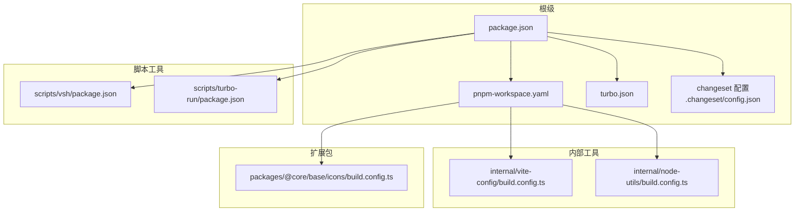
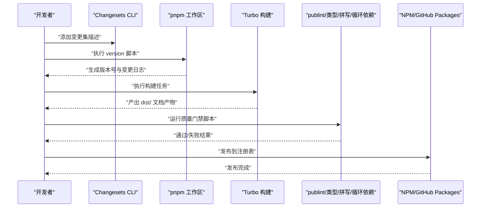
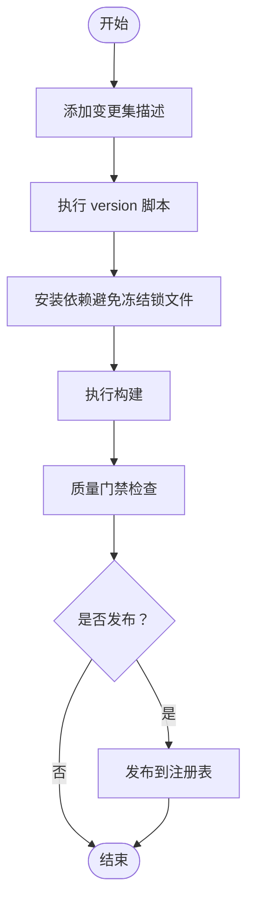
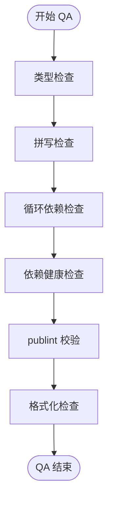
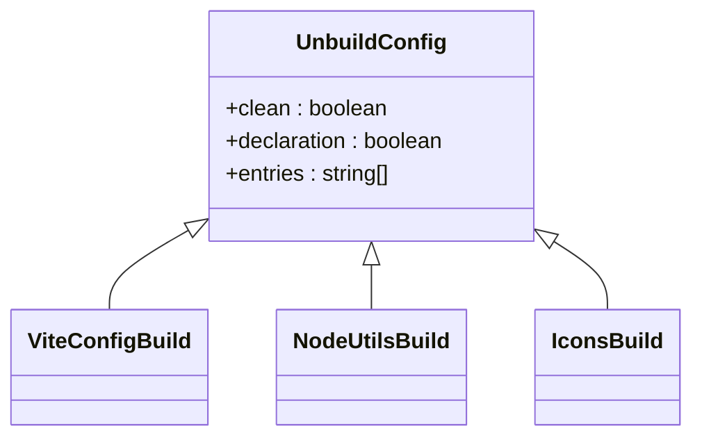
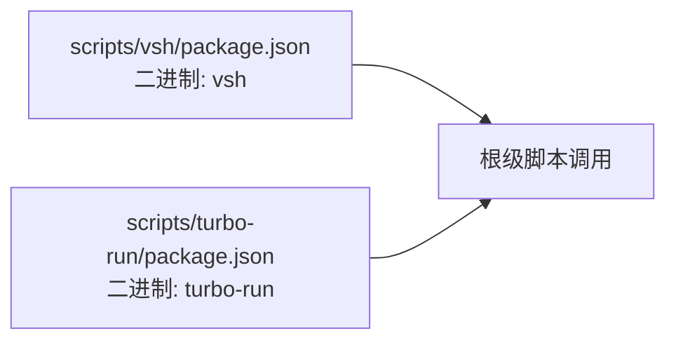
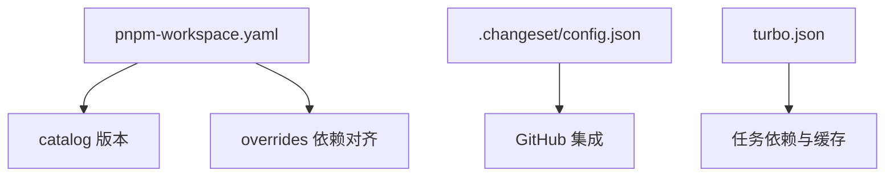

# 扩展发布与维护

<cite>
**本文引用的文件**
- [package.json](file://package.json)
- [pnpm-workspace.yaml](file://pnpm-workspace.yaml)
- [.changeset/README.md](file://.changeset/README.md)
- [.changeset/config.json](file://.changeset/config.json)
- [.github/release-drafter.yml](file://.github/release-drafter.yml)
- [.github/semantic.yml](file://.github/semantic.yml)
- [.github/dependabot.yml](file://.github/dependabot.yml)
- [turbo.json](file://turbo.json)
- [internal/vite-config/build.config.ts](file://internal/vite-config/build.config.ts)
- [internal/node-utils/build.config.ts](file://internal/node-utils/build.config.ts)
- [packages/@core/base/icons/build.config.ts](file://packages/@core/base/icons/build.config.ts)
- [scripts/vsh/package.json](file://scripts/vsh/package.json)
- [scripts/turbo-run/package.json](file://scripts/turbo-run/package.json)
</cite>

## 目录

1. [简介](#简介)
2. [项目结构](#项目结构)
3. [核心组件](#核心组件)
4. [架构总览](#架构总览)
5. [详细组件分析](#详细组件分析)
6. [依赖分析](#依赖分析)
7. [性能考虑](#性能考虑)
8. [故障排查指南](#故障排查指南)
9. [结论](#结论)
10. [附录](#附录)

## 简介

本指南面向在多包工作区中开发与维护扩展（包）的团队，围绕以下目标展开：扩展包的创建与配置、版本管理与变更集、发布前质量门禁、分发策略（私有/公共/NPM/GitHub Packages）、维护最佳实践（向后兼容、弃用警告、迁移指南）、社区贡献流程、实际发布示例与常见问题、以及持续集成与自动化发布配置。本仓库采用 pnpm 工作区、Turbo 构建、Changesets 变更集与 GitHub Actions 配合的现代化发布流水线。

## 项目结构

该仓库为多包 monorepo，采用 pnpm 工作区组织，核心目录与职责概览如下：

- apps：应用示例与演示（web-antd、web-ele、web-naive、web-tdesign、backend-mock、playground）
- docs：文档站点（VitePress）
- internal：内部工具与配置（lint-configs、node-utils、tailwind-config、tsconfig、vite-config）
- packages：可复用扩展包（如 @core/\*、effects、icons、locales、preferences、stores、styles、types、utils）
- scripts：脚本工具（turbo-run、vsh 等）
- 根级配置：package.json、pnpm-workspace.yaml、turbo.json、.changeset、.github 等

图表来源

- [package.json:1-109](file://package.json#L1-L109)
- [pnpm-workspace.yaml:1-193](file://pnpm-workspace.yaml#L1-L193)
- [turbo.json:1-49](file://turbo.json#L1-L49)
- [.changeset/config.json:1-19](file://.changeset/config.json#L1-L19)
- [internal/vite-config/build.config.ts:1-8](file://internal/vite-config/build.config.ts#L1-L8)
- [internal/node-utils/build.config.ts:1-8](file://internal/node-utils/build.config.ts#L1-L8)
- [packages/@core/base/icons/build.config.ts:1-8](file://packages/@core/base/icons/build.config.ts#L1-L8)
- [scripts/vsh/package.json:1-32](file://scripts/vsh/package.json#L1-L32)
- [scripts/turbo-run/package.json:1-30](file://scripts/turbo-run/package.json#L1-L30)

章节来源

- [package.json:1-109](file://package.json#L1-L109)
- [pnpm-workspace.yaml:1-193](file://pnpm-workspace.yaml#L1-L193)
- [turbo.json:1-49](file://turbo.json#L1-L49)

## 核心组件

- 发布脚本与任务
  - 根级 package.json 提供统一的发布与质量门禁脚本，如版本化、类型检查、拼写检查、循环依赖检查、publint 校验等。
  - 关键脚本包括：version、check、check:circular、check:dep、check:type、publint、lint、format、test:unit、test:e2e 等。
- Changesets 变更集
  - .changeset/config.json 定义了 changelog 生成器、提交策略、固定包组、快照预发布模板、访问级别、基础分支、内部依赖更新策略等。
  - .changeset/README.md 说明了变更集的作用与使用方式。
- Turbo 构建缓存与任务编排
  - turbo.json 声明全局依赖、环境变量、任务依赖关系与输出缓存，确保跨包构建一致性与增量构建效率。
- 工作区与 catalog 版本管理
  - pnpm-workspace.yaml 使用 overrides 与 catalog 统一管理依赖版本，减少重复与漂移。
- 构建配置（unbuild）
  - 各包的 build.config.ts 使用 unbuild 定义入口、清理与声明文件输出，保证包产物一致性。

章节来源

- [package.json:27-66](file://package.json#L27-L66)
- [.changeset/config.json:1-19](file://.changeset/config.json#L1-L19)
- [.changeset/README.md:1-6](file://.changeset/README.md#L1-L6)
- [turbo.json:15-47](file://turbo.json#L15-L47)
- [pnpm-workspace.yaml:16-193](file://pnpm-workspace.yaml#L16-L193)
- [internal/vite-config/build.config.ts:1-8](file://internal/vite-config/build.config.ts#L1-L8)
- [internal/node-utils/build.config.ts:1-8](file://internal/node-utils/build.config.ts#L1-L8)
- [packages/@core/base/icons/build.config.ts:1-8](file://packages/@core/base/icons/build.config.ts#L1-L8)

## 架构总览

下图展示从本地开发到发布的关键路径：开发者通过 Changesets 记录变更，执行版本化与安装，随后由 Turbo 并行构建，最后通过 publint 等质量门禁校验。

图表来源

- [package.json:37-66](file://package.json#L37-L66)
- [.changeset/config.json:1-19](file://.changeset/config.json#L1-L19)
- [turbo.json:15-47](file://turbo.json#L15-L47)

## 详细组件分析

### 组件 A：版本管理与变更集（Changesets）

- 功能要点
  - changelog 生成器与 GitHub 集成，自动产出变更日志。
  - 固定包组与内部依赖更新策略，确保内部包同步升级。
  - 快照预发布模板，便于发布候选版本。
  - 基于标签的版本解析与分类（major/minor/patch）。
- 使用建议
  - 在合并 PR 前要求添加变更集描述，避免遗漏。
  - 严格区分 breaking、feature、fix、docs、chore 等标签，确保语义化版本正确。
  - 对内部包优先使用 patch 更新策略，降低破坏性风险。

图表来源

- [package.json:64](file://package.json#L64)
- [.changeset/config.json:1-19](file://.changeset/config.json#L1-L19)

章节来源

- [.changeset/README.md:1-6](file://.changeset/README.md#L1-L6)
- [.changeset/config.json:1-19](file://.changeset/config.json#L1-L19)
- [package.json:37-66](file://package.json#L37-L66)

### 组件 B：发布前质量门禁

- 类型检查与拼写检查
  - check:type 通过 Turbo 触发类型检查；check:cspell 进行拼写校验。
- 循环依赖与依赖健康检查
  - check:circular 检测循环依赖；check:dep 分析依赖健康度。
- 包发布前检查（publint）
  - publint 脚本用于检查包导出、入口、清单字段等是否符合发布规范。
- 代码格式化与静态检查
  - lint 与 format 脚本统一风格与静态规则。

图表来源

- [package.json:38-66](file://package.json#L38-L66)

章节来源

- [package.json:38-66](file://package.json#L38-L66)

### 组件 C：构建与产物配置（unbuild）

- 统一构建入口
  - 各包的 build.config.ts 使用 unbuild 定义入口文件（src/index），并开启清理与声明文件输出。
- 适用范围
  - 内部工具（internal/vite-config、internal/node-utils）
  - 扩展包（packages/@core/base/icons）

图表来源

- [internal/vite-config/build.config.ts:1-8](file://internal/vite-config/build.config.ts#L1-L8)
- [internal/node-utils/build.config.ts:1-8](file://internal/node-utils/build.config.ts#L1-L8)
- [packages/@core/base/icons/build.config.ts:1-8](file://packages/@core/base/icons/build.config.ts#L1-L8)

章节来源

- [internal/vite-config/build.config.ts:1-8](file://internal/vite-config/build.config.ts#L1-L8)
- [internal/node-utils/build.config.ts:1-8](file://internal/node-utils/build.config.ts#L1-L8)
- [packages/@core/base/icons/build.config.ts:1-8](file://packages/@core/base/icons/build.config.ts#L1-L8)

### 组件 D：脚本工具与二进制入口

- vsh（开发与质量工具集合）
  - 提供二进制入口 vsh，封装循环依赖检查、依赖检查、publint 等能力。
  - 作为工作区内部工具，被根级脚本调用。
- turbo-run（开发与调试辅助）
  - 提供二进制入口 turbo-run，封装开发与调试流程。

图表来源

- [scripts/vsh/package.json:1-32](file://scripts/vsh/package.json#L1-L32)
- [scripts/turbo-run/package.json:1-30](file://scripts/turbo-run/package.json#L1-L30)

章节来源

- [scripts/vsh/package.json:1-32](file://scripts/vsh/package.json#L1-L32)
- [scripts/turbo-run/package.json:1-30](file://scripts/turbo-run/package.json#L1-L30)

### 组件 E：分发策略与注册表

- 公共 NPM
  - access 设置为 public，允许公开发布。
- 私有仓库与 GitHub Packages
  - 可通过 .npmrc 或 CI 配置切换 registry，实现私有发布或 GitHub Packages 发布。
- 版本与标签
  - Changesets 支持快照预发布标签模板，便于先行版发布与回滚。

章节来源

- [.changeset/config.json:14-16](file://.changeset/config.json#L14-L16)
- [.changeset/config.json:9-11](file://.changeset/config.json#L9-L11)

### 组件 F：社区贡献与规范

- 提交信息约定
  - .github/semantic.yml 限制可用的提交类型，确保语义化提交。
- 自动化发布草稿
  - .github/release-drafter.yml 基于标签自动生成发布说明草稿，提升发布效率。
- 依赖自动更新
  - .github/dependabot.yml 定期扫描依赖更新，降低安全与兼容风险。

章节来源

- [.github/semantic.yml:1-14](file://.github/semantic.yml#L1-L14)
- [.github/release-drafter.yml:1-62](file://.github/release-drafter.yml#L1-L62)
- [.github/dependabot.yml:1-18](file://.github/dependabot.yml#L1-L18)

## 依赖分析

- 工作区与 catalog
  - pnpm-workspace.yaml 的 overrides 与 catalog 统一版本，减少冲突与升级成本。
- Changesets 与 GitHub 集成
  - changelog-github 插件与 GitHub 仓库绑定，自动生成变更日志。
- Turbo 缓存与任务依赖
  - 通过 globalDependencies 与 tasks.dependsOn，确保构建一致性与缓存命中率。

图表来源

- [pnpm-workspace.yaml:16-193](file://pnpm-workspace.yaml#L16-L193)
- [.changeset/config.json:1-19](file://.changeset/config.json#L1-L19)
- [turbo.json:3-47](file://turbo.json#L3-L47)

章节来源

- [pnpm-workspace.yaml:16-193](file://pnpm-workspace.yaml#L16-L193)
- [.changeset/config.json:1-19](file://.changeset/config.json#L1-L19)
- [turbo.json:3-47](file://turbo.json#L3-L47)

## 性能考虑

- Turbo 并行构建与缓存
  - 通过 dependsOn 与 outputs 精准控制缓存，避免不必要的重构建。
- unbuild 构建开销
  - 清理与声明文件输出会增加构建时间，建议仅在需要时启用。
- 依赖版本集中管理
  - catalog 与 overrides 降低版本漂移，减少重复下载与编译。

## 故障排查指南

- 发布前失败
  - publint 失败：检查导出入口、package.json 字段与声明文件完整性。
  - 类型检查失败：修复类型错误或调整 tsconfig。
  - 循环依赖：使用 vsh check-circular 定位模块环。
- Changesets 相关
  - 未生成版本：确认已添加变更集描述且执行 version 脚本。
  - 版本不一致：检查内部包更新策略与 fixed 配置。
- CI/CD 相关
  - 依赖更新未触发：检查 dependabot 分组与更新类型配置。
  - 发布说明异常：核对 release drafter 的分类与标签映射。

章节来源

- [package.json:38-66](file://package.json#L38-L66)
- [.changeset/config.json:1-19](file://.changeset/config.json#L1-L19)
- [.github/dependabot.yml:1-18](file://.github/dependabot.yml#L1-L18)
- [.github/release-drafter.yml:12-62](file://.github/release-drafter.yml#L12-L62)

## 结论

本指南基于仓库现有配置，总结了扩展发布与维护的关键流程与最佳实践。通过 Changesets 实现语义化版本与变更日志，借助 Turbo 与 unbuild 保障构建一致性与产物质量，并以 publint、类型检查、拼写检查与循环依赖检查构成发布前质量门禁。结合 GitHub Actions 与 Dependabot，可进一步完善自动化发布与依赖维护。

## 附录

### A. 扩展包创建与配置步骤

- 创建包目录与入口
  - 在 packages 下新建包目录，定义 src/index 作为入口。
- 配置构建
  - 参考现有 build.config.ts，设置 clean、declaration、entries。
- 配置清单
  - 在包内 package.json 中定义 name、version、main/module/exports、files 等字段。
- 加入工作区
  - 在 pnpm-workspace.yaml 中将包纳入工作区管理。

章节来源

- [packages/@core/base/icons/build.config.ts:1-8](file://packages/@core/base/icons/build.config.ts#L1-L8)
- [pnpm-workspace.yaml:1-14](file://pnpm-workspace.yaml#L1-L14)

### B. 版本管理与发布流程（示例步骤）

- 新增变更集描述
  - 使用 changeset 添加本次变更的描述与影响范围。
- 执行版本化
  - 运行 version 脚本生成版本号与变更日志，并安装依赖。
- 构建与质量门禁
  - 执行构建与各类检查（publint、类型、拼写、循环依赖）。
- 发布
  - 将包发布至公共 NPM 或私有/企业注册表。

章节来源

- [package.json:37-66](file://package.json#L37-L66)
- [.changeset/config.json:1-19](file://.changeset/config.json#L1-L19)

### C. 分发策略选择

- 公共 NPM：适用于开源扩展，access 设为 public。
- 私有/企业注册表：适用于内部扩展，需在 CI 中配置认证与 registry。
- GitHub Packages：适合与 GitHub 仓库强关联的扩展，便于统一管理。

章节来源

- [.changeset/config.json:14-16](file://.changeset/config.json#L14-L16)

### D. 维护最佳实践

- 向后兼容
  - 优先采用补丁或小版本升级，避免破坏性变更。
- 弃用警告
  - 在变更前引入弃用警告，提供迁移指引与截止日期。
- 迁移指南
  - 在变更日志中提供清晰的迁移步骤与示例链接。

章节来源

- [.changeset/config.json:37-54](file://.changeset/config.json#L37-L54)

### E. 社区贡献流程

- 提交类型
  - 使用限定的提交类型，保持语义化提交。
- 标签分类
  - 通过标签自动分类变更，驱动版本与发布说明生成。
- 依赖更新
  - 依赖自动更新由 Dependabot 管理，减少安全与兼容风险。

章节来源

- [.github/semantic.yml:1-14](file://.github/semantic.yml#L1-L14)
- [.github/release-drafter.yml:12-62](file://.github/release-drafter.yml#L12-L62)
- [.github/dependabot.yml:1-18](file://.github/dependabot.yml#L1-L18)

### F. 持续集成与自动化发布

- 变更集触发
  - 通过 Changesets 生成版本与变更日志。
- 构建与缓存
  - Turbo 并行构建，利用缓存减少耗时。
- 质量门禁
  - 在 CI 中执行 publint、类型检查、拼写检查与单元测试。
- 发布
  - 将包发布到目标注册表，生成发布说明草稿。

章节来源

- [package.json:27-66](file://package.json#L27-L66)
- [turbo.json:15-47](file://turbo.json#L15-L47)
- [.changeset/config.json:1-19](file://.changeset/config.json#L1-L19)
- [.github/release-drafter.yml:1-62](file://.github/release-drafter.yml#L1-L62)
