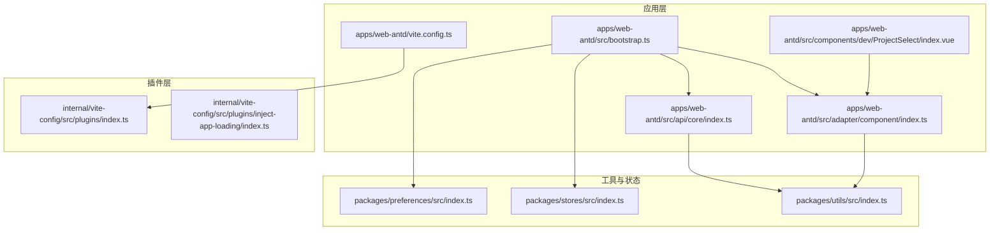
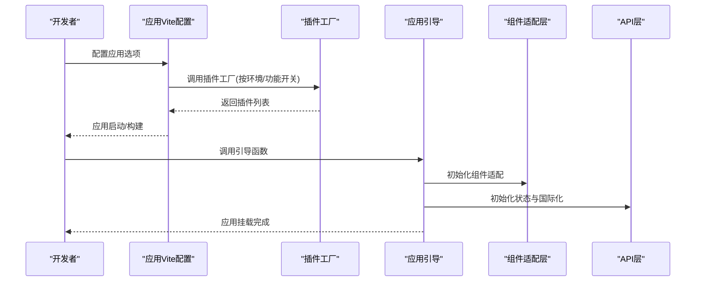
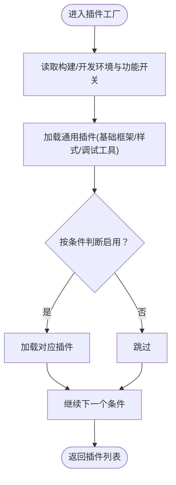
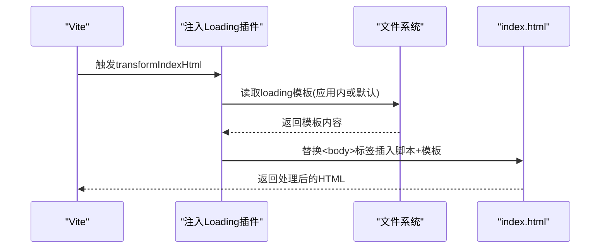
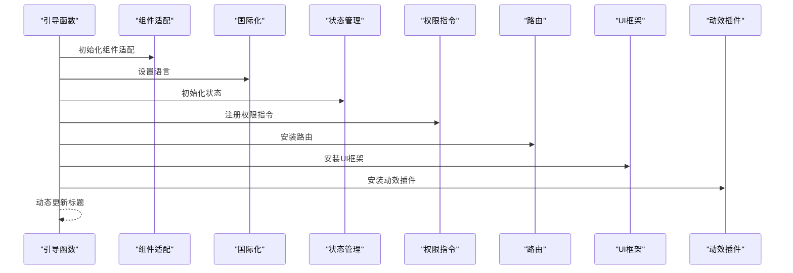
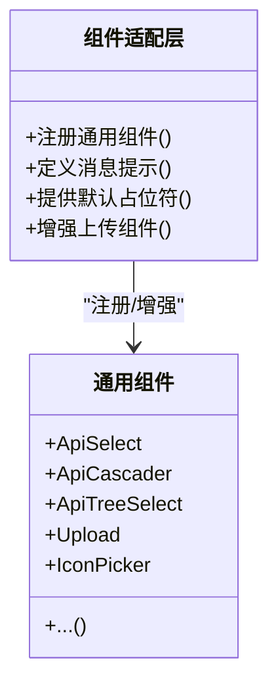
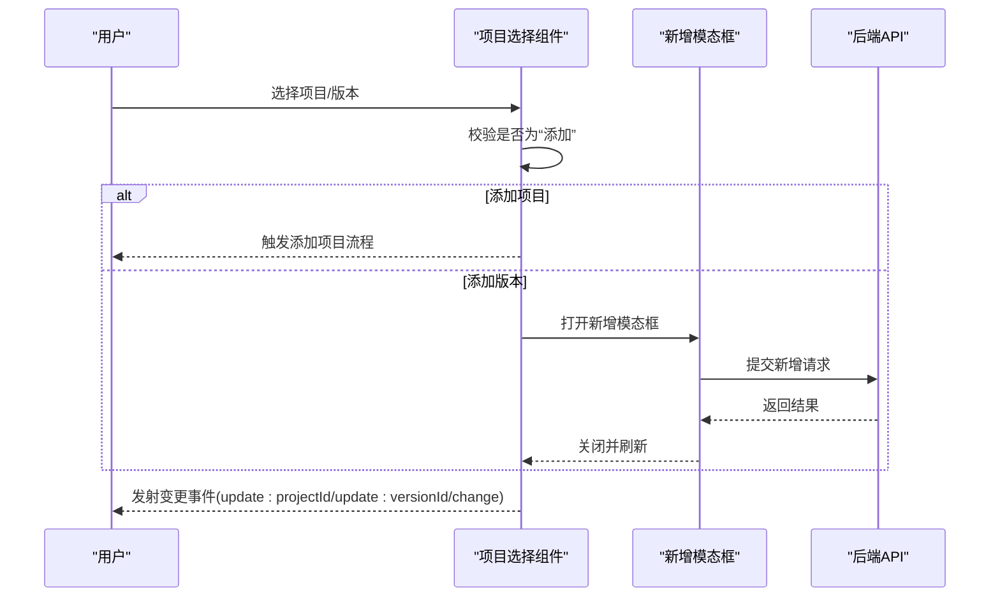
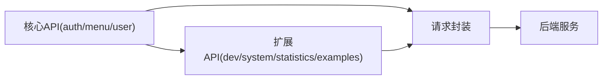
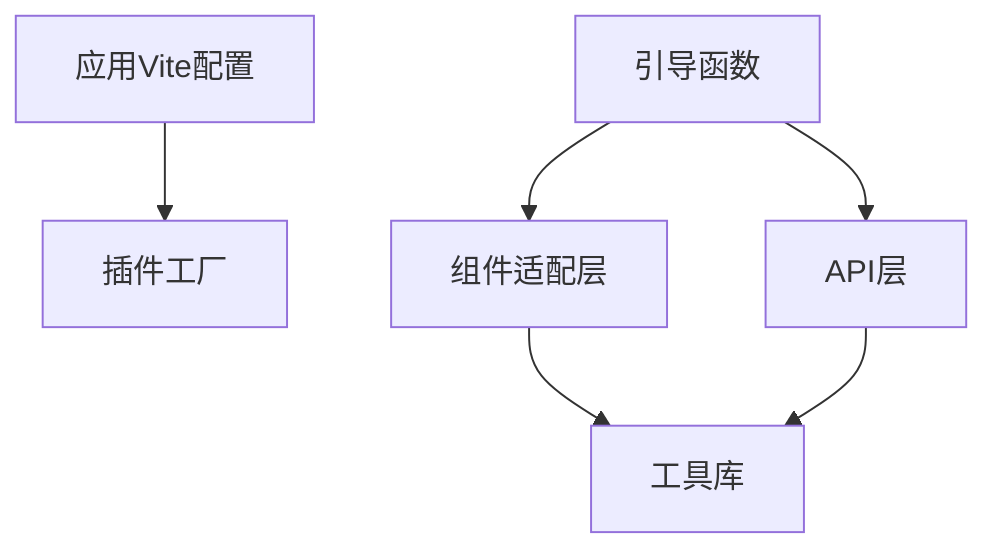

# 扩展开发

<cite>
**本文档引用的文件**
- [apps/web-antd/vite.config.ts](file://apps/web-antd/vite.config.ts)
- [internal/vite-config/src/plugins/index.ts](file://internal/vite-config/src/plugins/index.ts)
- [internal/vite-config/src/plugins/inject-app-loading/index.ts](file://internal/vite-config/src/plugins/inject-app-loading/index.ts)
- [apps/web-antd/src/bootstrap.ts](file://apps/web-antd/src/bootstrap.ts)
- [apps/web-antd/src/adapter/component/index.ts](file://apps/web-antd/src/adapter/component/index.ts)
- [apps/web-antd/src/components/dev/ProjectSelect/index.vue](file://apps/web-antd/src/components/dev/ProjectSelect/index.vue)
- [packages/utils/src/index.ts](file://packages/utils/src/index.ts)
- [packages/stores/src/index.ts](file://packages/stores/src/index.ts)
- [packages/preferences/src/index.ts](file://packages/preferences/src/index.ts)
- [apps/web-antd/src/api/core/index.ts](file://apps/web-antd/src/api/core/index.ts)
</cite>

## 目录

1. [简介](#简介)
2. [项目结构](#项目结构)
3. [核心组件](#核心组件)
4. [架构总览](#架构总览)
5. [详细组件分析](#详细组件分析)
6. [依赖分析](#依赖分析)
7. [性能考虑](#性能考虑)
8. [故障排查指南](#故障排查指南)
9. [结论](#结论)
10. [附录](#附录)

## 简介

本指南面向希望在 Vben Admin 基础上进行“扩展开发”的工程师与技术作者，系统讲解如何基于现有插件体系、组件适配层、API 层与工具库，实现可复用、可维护、可发布的扩展能力。内容覆盖：

- Vite 插件与构建插件的创建与组合
- 开发工具插件（如 Vue DevTools、PWA、压缩、HTML 注入等）的启用与定制
- 自定义组件的开发流程（设计原则、API 设计、文档编写）
- 第三方服务集成（API 接入、SDK 集成、数据同步）
- 自定义 Hook 与 Composables 的开发（状态逻辑抽象与复用）
- 主题扩展与样式定制的高级技巧
- 工具函数与辅助库的开发方法
- 实际扩展开发示例与最佳实践
- 扩展发布流程与维护建议

## 项目结构

Vben Admin 采用多应用与多 UI 框架并存的组织方式，核心扩展点集中在以下位置：

- 应用级 Vite 配置：apps/\*/vite.config.ts
- Vite 插件工厂：internal/vite-config/src/plugins/index.ts
- 应用引导与插件装配：apps/\*/src/bootstrap.ts
- 组件适配层：apps/\*/src/adapter/component/index.ts
- API 层：apps/_/src/api/_
- 工具与状态：packages/utils、packages/stores、packages/preferences
- 示例组件：apps/_/src/components/dev/_

**图示来源**

- [apps/web-antd/vite.config.ts:1-21](file://apps/web-antd/vite.config.ts#L1-L21)
- [internal/vite-config/src/plugins/index.ts:1-254](file://internal/vite-config/src/plugins/index.ts#L1-L254)
- [internal/vite-config/src/plugins/inject-app-loading/index.ts:1-67](file://internal/vite-config/src/plugins/inject-app-loading/index.ts#L1-L67)
- [apps/web-antd/src/bootstrap.ts:1-85](file://apps/web-antd/src/bootstrap.ts#L1-L85)
- [apps/web-antd/src/adapter/component/index.ts:1-608](file://apps/web-antd/src/adapter/component/index.ts#L1-L608)
- [apps/web-antd/src/api/core/index.ts:1-4](file://apps/web-antd/src/api/core/index.ts#L1-L4)
- [apps/web-antd/src/components/dev/ProjectSelect/index.vue:1-136](file://apps/web-antd/src/components/dev/ProjectSelect/index.vue#L1-L136)
- [packages/utils/src/index.ts:1-5](file://packages/utils/src/index.ts#L1-L5)
- [packages/stores/src/index.ts:1-4](file://packages/stores/src/index.ts#L1-L4)
- [packages/preferences/src/index.ts:1-18](file://packages/preferences/src/index.ts#L1-L18)

**章节来源**

- [apps/web-antd/vite.config.ts:1-21](file://apps/web-antd/vite.config.ts#L1-L21)
- [internal/vite-config/src/plugins/index.ts:1-254](file://internal/vite-config/src/plugins/index.ts#L1-L254)
- [apps/web-antd/src/bootstrap.ts:1-85](file://apps/web-antd/src/bootstrap.ts#L1-L85)
- [apps/web-antd/src/adapter/component/index.ts:1-608](file://apps/web-antd/src/adapter/component/index.ts#L1-L608)
- [apps/web-antd/src/api/core/index.ts:1-4](file://apps/web-antd/src/api/core/index.ts#L1-L4)
- [packages/utils/src/index.ts:1-5](file://packages/utils/src/index.ts#L1-L5)
- [packages/stores/src/index.ts:1-4](file://packages/stores/src/index.ts#L1-L4)
- [packages/preferences/src/index.ts:1-18](file://packages/preferences/src/index.ts#L1-L18)

## 核心组件

- Vite 插件工厂：提供按环境与功能开关动态加载插件的能力，支持 i18n、PWA、压缩、HTML 注入、Nitro Mock、导入映射、归档等。
- 应用引导：统一注册指令、国际化、权限指令、UI 框架、状态管理、路由、动态标题等。
- 组件适配层：将 UI 框架组件与表单/选择器/上传等通用能力解耦，提供统一的组件注册与消息提示定义。
- API 层：按领域拆分模块，集中导出，便于扩展新接口或替换实现。
- 工具与状态：导出常用工具、Pinia Store 与偏好设置覆盖入口。

**章节来源**

- [internal/vite-config/src/plugins/index.ts:32-223](file://internal/vite-config/src/plugins/index.ts#L32-L223)
- [apps/web-antd/src/bootstrap.ts:20-82](file://apps/web-antd/src/bootstrap.ts#L20-L82)
- [apps/web-antd/src/adapter/component/index.ts:526-608](file://apps/web-antd/src/adapter/component/index.ts#L526-L608)
- [apps/web-antd/src/api/core/index.ts:1-4](file://apps/web-antd/src/api/core/index.ts#L1-L4)
- [packages/utils/src/index.ts:1-5](file://packages/utils/src/index.ts#L1-L5)
- [packages/stores/src/index.ts:1-4](file://packages/stores/src/index.ts#L1-L4)
- [packages/preferences/src/index.ts:11-13](file://packages/preferences/src/index.ts#L11-L13)

## 架构总览

下图展示从应用配置到运行时装配的关键路径，以及插件工厂如何按条件启用不同功能。

**图示来源**

- [apps/web-antd/vite.config.ts:3-20](file://apps/web-antd/vite.config.ts#L3-L20)
- [internal/vite-config/src/plugins/index.ts:94-223](file://internal/vite-config/src/plugins/index.ts#L94-L223)
- [apps/web-antd/src/bootstrap.ts:20-82](file://apps/web-antd/src/bootstrap.ts#L20-L82)
- [apps/web-antd/src/adapter/component/index.ts:526-608](file://apps/web-antd/src/adapter/component/index.ts#L526-L608)
- [apps/web-antd/src/api/core/index.ts:1-4](file://apps/web-antd/src/api/core/index.ts#L1-L4)

## 详细组件分析

### Vite 插件系统与扩展开发

- 条件插件加载：通过条件数组按需启用插件，避免不必要的开销。
- 应用型插件：支持 i18n、PWA、压缩、HTML 注入、Nitro Mock、导入映射、归档、注入应用 Loading 等。
- 库型插件：在构建库时启用 DTS 生成等。
- 开发工具插件：如 Vue DevTools、可视化分析器等仅在开发阶段启用。

**图示来源**

- [internal/vite-config/src/plugins/index.ts:36-45](file://internal/vite-config/src/plugins/index.ts#L36-L45)
- [internal/vite-config/src/plugins/index.ts:50-89](file://internal/vite-config/src/plugins/index.ts#L50-L89)
- [internal/vite-config/src/plugins/index.ts:94-223](file://internal/vite-config/src/plugins/index.ts#L94-L223)

**章节来源**

- [internal/vite-config/src/plugins/index.ts:32-223](file://internal/vite-config/src/plugins/index.ts#L32-L223)

### 开发工具插件：应用 Loading 注入

- 作用：在构建产物中注入应用 Loading HTML 片段，并根据主题缓存自动切换深色模式，提升首屏体验一致性。
- 关键点：支持应用内自定义模板；在 transformIndexHtml 阶段注入脚本与模板内容。

**图示来源**

- [internal/vite-config/src/plugins/inject-app-loading/index.ts:14-49](file://internal/vite-config/src/plugins/inject-app-loading/index.ts#L14-L49)
- [internal/vite-config/src/plugins/inject-app-loading/index.ts:54-64](file://internal/vite-config/src/plugins/inject-app-loading/index.ts#L54-L64)

**章节来源**

- [internal/vite-config/src/plugins/inject-app-loading/index.ts:1-67](file://internal/vite-config/src/plugins/inject-app-loading/index.ts#L1-L67)

### 应用引导与插件装配

- 统一注册：指令、国际化、权限指令、UI 框架、状态管理、路由、动态标题等。
- 插件扩展：通过引导函数注册自研插件（如动效、图表等），保持装配顺序与职责清晰。

**图示来源**

- [apps/web-antd/src/bootstrap.ts:20-82](file://apps/web-antd/src/bootstrap.ts#L20-L82)

**章节来源**

- [apps/web-antd/src/bootstrap.ts:1-85](file://apps/web-antd/src/bootstrap.ts#L1-L85)

### 组件适配层与自定义组件开发

- 组件注册：将 UI 框架组件与通用组件（如 ApiSelect、Upload、IconPicker 等）统一注册到全局共享状态。
- 能力增强：为上传组件提供预览、裁剪、尺寸校验、占位符注入等能力。
- 设计原则：通过高阶组件包装与默认属性注入，降低调用方心智负担；保持 API 一致性和可扩展性。

**图示来源**

- [apps/web-antd/src/adapter/component/index.ts:526-608](file://apps/web-antd/src/adapter/component/index.ts#L526-L608)
- [apps/web-antd/src/adapter/component/index.ts:526-589](file://apps/web-antd/src/adapter/component/index.ts#L526-L589)

**章节来源**

- [apps/web-antd/src/adapter/component/index.ts:1-608](file://apps/web-antd/src/adapter/component/index.ts#L1-L608)

### 自定义组件开发示例：项目/版本级联选择

- 场景：提供“项目-版本”两级联动选择，支持添加项目/版本的快捷入口。
- 关键点：使用 v-model 与事件发射，结合模态框触发新增流程；初始化选项与默认值，处理用户交互。

**图示来源**

- [apps/web-antd/src/components/dev/ProjectSelect/index.vue:14-135](file://apps/web-antd/src/components/dev/ProjectSelect/index.vue#L14-L135)

**章节来源**

- [apps/web-antd/src/components/dev/ProjectSelect/index.vue:1-136](file://apps/web-antd/src/components/dev/ProjectSelect/index.vue#L1-L136)

### API 层与第三方服务集成

- 分层设计：将认证、菜单、用户等核心 API 模块化，便于替换与扩展。
- 领域扩展：新增业务模块（如 dev、system、statistics）时，遵循现有目录结构与导出规范。
- 数据同步：通过统一的请求封装与拦截器，实现鉴权、重试、错误处理与日志上报。

**图示来源**

- [apps/web-antd/src/api/core/index.ts:1-4](file://apps/web-antd/src/api/core/index.ts#L1-L4)

**章节来源**

- [apps/web-antd/src/api/core/index.ts:1-4](file://apps/web-antd/src/api/core/index.ts#L1-L4)

### 自定义 Hook 与 Composables 开发

- 抽象策略：将跨页面/跨组件的状态逻辑抽取为 Composables，如加载状态、分页查询、表单校验、主题切换等。
- 复用原则：保持输入输出稳定、副作用可控、可测试性强；通过工具库与状态层配合使用。
- 与 UI 适配层协作：在组件层通过 Composables 管理复杂交互，减少模板与脚本的重复逻辑。

[本节为概念性指导，不直接分析具体文件]

### 主题扩展与样式定制

- 偏好设置覆盖：通过偏好设置入口对默认主题、布局、语言等进行覆盖，避免直接修改核心包。
- 样式注入：利用插件在构建阶段注入 HTML 或样式片段，确保首屏一致性。
- 深色模式：通过缓存主题信息在刷新时保持一致的视觉体验。

**章节来源**

- [packages/preferences/src/index.ts:11-13](file://packages/preferences/src/index.ts#L11-L13)
- [internal/vite-config/src/plugins/inject-app-loading/index.ts:26-31](file://internal/vite-config/src/plugins/inject-app-loading/index.ts#L26-L31)

### 工具函数与辅助库开发

- 工具聚合：将常用工具导出到统一入口，便于按需引入与版本管理。
- 状态导出：Pinia Store 与 hooks 导出，便于在应用层快速装配。

**章节来源**

- [packages/utils/src/index.ts:1-5](file://packages/utils/src/index.ts#L1-L5)
- [packages/stores/src/index.ts:1-4](file://packages/stores/src/index.ts#L1-L4)

## 依赖分析

- 应用配置依赖插件工厂：应用通过 defineConfig 调用插件工厂，按环境与功能开关决定启用哪些插件。
- 引导函数依赖适配层与 API 层：引导函数负责装配 UI、状态、路由与国际化，依赖适配层提供的组件能力与 API 层提供的接口。
- 组件适配层依赖工具库：上传增强、图标选择、消息提示等能力依赖工具库与 UI 组件库。

**图示来源**

- [apps/web-antd/vite.config.ts:3-20](file://apps/web-antd/vite.config.ts#L3-L20)
- [internal/vite-config/src/plugins/index.ts:94-223](file://internal/vite-config/src/plugins/index.ts#L94-L223)
- [apps/web-antd/src/bootstrap.ts:20-82](file://apps/web-antd/src/bootstrap.ts#L20-L82)
- [apps/web-antd/src/adapter/component/index.ts:526-608](file://apps/web-antd/src/adapter/component/index.ts#L526-L608)
- [apps/web-antd/src/api/core/index.ts:1-4](file://apps/web-antd/src/api/core/index.ts#L1-L4)
- [packages/utils/src/index.ts:1-5](file://packages/utils/src/index.ts#L1-L5)

**章节来源**

- [apps/web-antd/vite.config.ts:1-21](file://apps/web-antd/vite.config.ts#L1-L21)
- [internal/vite-config/src/plugins/index.ts:1-254](file://internal/vite-config/src/plugins/index.ts#L1-L254)
- [apps/web-antd/src/bootstrap.ts:1-85](file://apps/web-antd/src/bootstrap.ts#L1-L85)
- [apps/web-antd/src/adapter/component/index.ts:1-608](file://apps/web-antd/src/adapter/component/index.ts#L1-L608)
- [apps/web-antd/src/api/core/index.ts:1-4](file://apps/web-antd/src/api/core/index.ts#L1-L4)
- [packages/utils/src/index.ts:1-5](file://packages/utils/src/index.ts#L1-L5)

## 性能考虑

- 按需启用：仅在生产构建启用压缩与可视化分析，避免开发阶段的额外开销。
- 异步组件：对体积较大的组件采用异步加载，降低首屏包体。
- 缓存与预加载：通过插件注入与偏好设置缓存，减少重复计算与闪烁。
- 上传优化：在上传前进行尺寸校验与裁剪，减少无效请求与渲染压力。

[本节提供一般性建议，不直接分析具体文件]

## 故障排查指南

- 插件未生效：检查应用配置中对应开关是否开启，确认插件工厂条件分支是否满足。
- 首屏闪烁：确认是否正确注入 Loading 模板与主题缓存逻辑。
- 组件异常：检查组件适配层注册项与默认属性注入是否正确，关注事件发射与 v-model 同步。
- API 请求失败：核对请求封装与拦截器配置，确认鉴权与错误处理链路。

**章节来源**

- [internal/vite-config/src/plugins/inject-app-loading/index.ts:14-49](file://internal/vite-config/src/plugins/inject-app-loading/index.ts#L14-L49)
- [apps/web-antd/src/adapter/component/index.ts:526-608](file://apps/web-antd/src/adapter/component/index.ts#L526-L608)

## 结论

通过对插件工厂、应用引导、组件适配层与 API 层的系统化理解，可以在 Vben Admin 上高效地进行扩展开发。建议遵循“按需启用、统一注册、分层解耦、可测试可维护”的原则，结合工具库与偏好设置，构建高质量、可复用的扩展方案。

## 附录

- 实际扩展开发示例与最佳实践
  - 新增 Vite 插件：在插件工厂中新增条件分支，按需启用；在应用配置中开启开关。
  - 新增自定义组件：在组件适配层注册并提供默认属性与能力增强；在模板中以统一 API 使用。
  - 新增 API 模块：按领域创建文件夹与导出，复用现有请求封装；在引导函数中按需装配。
  - 新增 Hook/Composables：抽象状态逻辑，保持输入输出稳定；与工具库与状态层协作。
  - 主题与样式：通过偏好设置覆盖默认值；必要时在构建阶段注入 HTML 片段。
  - 工具与状态：在工具库聚合导出；在状态层统一装配。
  - 发布与维护：遵循变更集与工作流规范，定期检查依赖与兼容性。

[本节为概念性总结，不直接分析具体文件]
