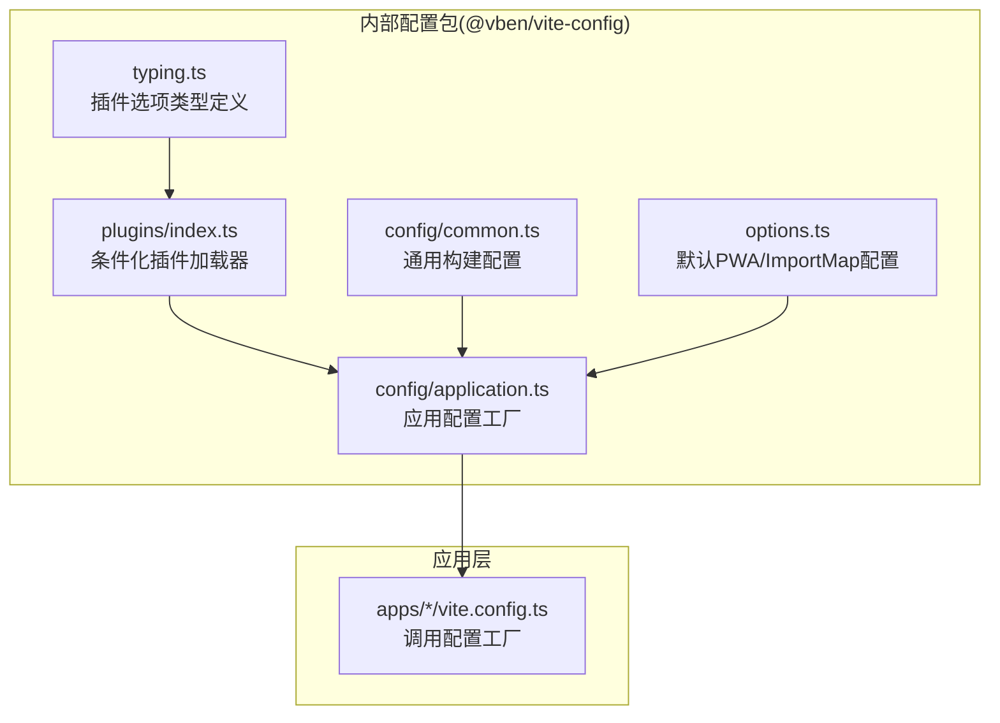
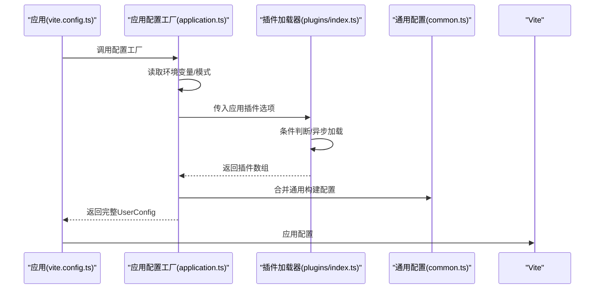
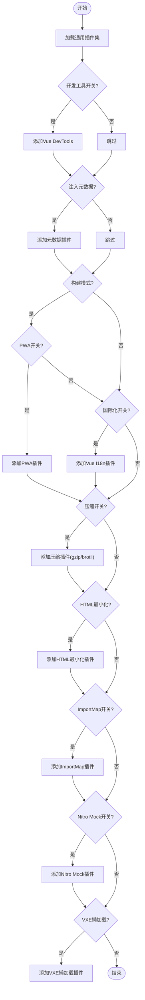
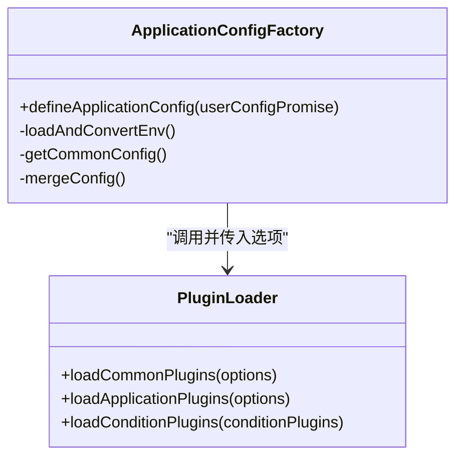
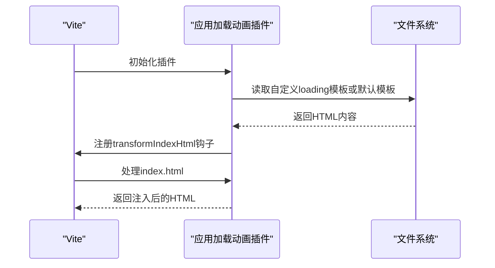
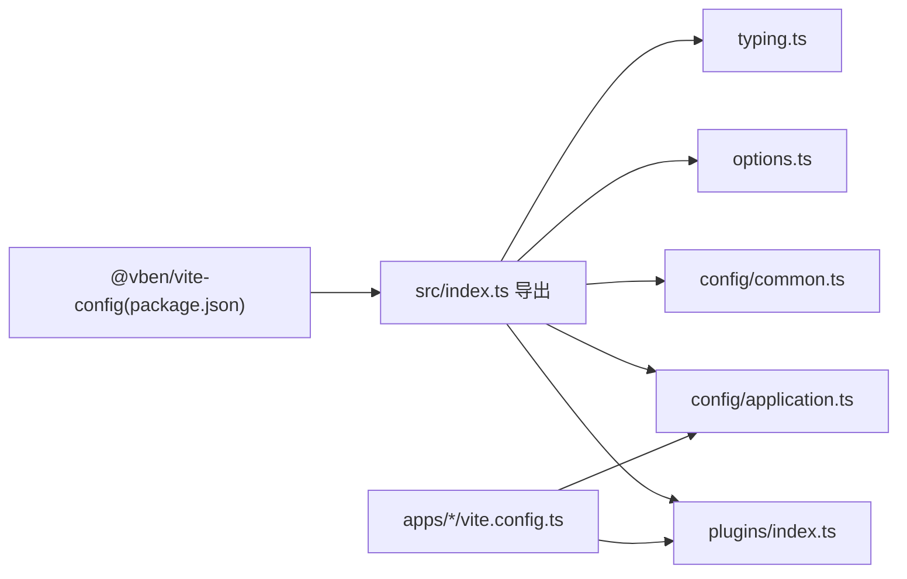

# 插件系统开发

<cite>
**本文引用的文件**
- [internal/vite-config/src/plugins/index.ts](file://internal/vite-config/src/plugins/index.ts)
- [internal/vite-config/src/config/application.ts](file://internal/vite-config/src/config/application.ts)
- [internal/vite-config/src/config/common.ts](file://internal/vite-config/src/config/common.ts)
- [internal/vite-config/src/options.ts](file://internal/vite-config/src/options.ts)
- [internal/vite-config/src/typing.ts](file://internal/vite-config/src/typing.ts)
- [internal/vite-config/src/plugins/inject-app-loading/index.ts](file://internal/vite-config/src/plugins/inject-app-loading/index.ts)
- [package.json](file://package.json)
- [apps/web-antd/vite.config.ts](file://apps/web-antd/vite.config.ts)
</cite>

## 目录
1. [简介](#简介)
2. [项目结构](#项目结构)
3. [核心组件](#核心组件)
4. [架构总览](#架构总览)
5. [详细组件分析](#详细组件分析)
6. [依赖关系分析](#依赖关系分析)
7. [性能考量](#性能考量)
8. [故障排查指南](#故障排查指南)
9. [结论](#结论)
10. [附录：插件开发示例与配置模板](#附录插件开发示例与配置模板)

## 简介
本指南面向希望在 Vben Admin 中开发与扩展 Vite 插件的工程师，系统讲解插件体系的架构设计、生命周期与钩子使用、条件化插件加载机制、以及构建期与开发期插件的实现要点。文档基于仓库内的内部配置包与应用示例，提供可直接落地的开发步骤、最佳实践与排错建议。

## 项目结构
Vben Admin 的插件体系由“内部配置包”与“应用层配置”两部分组成：
- 内部配置包：集中封装各类 Vite 插件的加载逻辑、默认配置与类型定义，统一对外暴露条件化插件工厂函数。
- 应用层配置：在各应用的 vite.config.ts 中调用内部配置包提供的工厂函数，传入应用专属选项，完成最终的 Vite 配置合并。

图表来源
- [internal/vite-config/src/plugins/index.ts:32-242](file://internal/vite-config/src/plugins/index.ts#L32-L242)
- [internal/vite-config/src/config/application.ts:17-99](file://internal/vite-config/src/config/application.ts#L17-L99)
- [internal/vite-config/src/config/common.ts:3-11](file://internal/vite-config/src/config/common.ts#L3-L11)
- [internal/vite-config/src/options.ts:7-45](file://internal/vite-config/src/options.ts#L7-L45)
- [internal/vite-config/src/typing.ts:148-282](file://internal/vite-config/src/typing.ts#L148-L282)
- [apps/web-antd/vite.config.ts](file://apps/web-antd/vite.config.ts)

章节来源
- [internal/vite-config/src/plugins/index.ts:1-254](file://internal/vite-config/src/plugins/index.ts#L1-L254)
- [internal/vite-config/src/config/application.ts:1-124](file://internal/vite-config/src/config/application.ts#L1-L124)
- [internal/vite-config/src/config/common.ts:1-14](file://internal/vite-config/src/config/common.ts#L1-L14)
- [internal/vite-config/src/options.ts:1-46](file://internal/vite-config/src/options.ts#L1-L46)
- [internal/vite-config/src/typing.ts:1-352](file://internal/vite-config/src/typing.ts#L1-L352)
- [apps/web-antd/vite.config.ts](file://apps/web-antd/vite.config.ts)

## 核心组件
- 条件化插件加载器：按运行模式（开发/构建）、功能开关与环境变量动态决定启用哪些插件，并支持异步加载。
- 应用配置工厂：负责读取环境变量、合并通用配置与应用特有配置，最终返回完整的 Vite 用户配置。
- 通用构建配置：统一设置 chunk 大小警告阈值、是否输出 Source Map、是否报告压缩体积等。
- 默认配置与类型：提供 PWA、ImportMap 等默认配置项与严格的类型约束，确保插件选项的一致性与可维护性。

章节来源
- [internal/vite-config/src/plugins/index.ts:32-242](file://internal/vite-config/src/plugins/index.ts#L32-L242)
- [internal/vite-config/src/config/application.ts:17-99](file://internal/vite-config/src/config/application.ts#L17-L99)
- [internal/vite-config/src/config/common.ts:3-11](file://internal/vite-config/src/config/common.ts#L3-L11)
- [internal/vite-config/src/options.ts:7-45](file://internal/vite-config/src/options.ts#L7-L45)
- [internal/vite-config/src/typing.ts:148-282](file://internal/vite-config/src/typing.ts#L148-L282)

## 架构总览
下图展示了从应用配置到插件加载的关键流程：应用调用配置工厂 → 工厂读取环境与模式 → 组装插件选项 → 条件化加载插件 → 合并通用配置 → 返回最终配置。

图表来源
- [internal/vite-config/src/config/application.ts:17-99](file://internal/vite-config/src/config/application.ts#L17-L99)
- [internal/vite-config/src/plugins/index.ts:32-242](file://internal/vite-config/src/plugins/index.ts#L32-L242)
- [internal/vite-config/src/config/common.ts:3-11](file://internal/vite-config/src/config/common.ts#L3-L11)

## 详细组件分析

### 条件化插件加载器
- 设计思想：将“条件判断 + 插件加载”解耦，通过 ConditionPlugin 数组统一管理，支持同步与异步插件返回，提升可扩展性。
- 关键点：
  - 异步加载：通过 await 动态 import 插件，避免不必要的初始化开销。
  - 条件开关：围绕 isBuild、devtools、i18n、pwa、compress、html、importmap、nitroMock、vxeTableLazyImport 等选项进行分支。
  - 构建期优化：在构建阶段启用压缩、可视化、归档、DTS 等插件；开发阶段启用 DevTools、Nitro Mock 等增强体验。
- 典型插件族：
  - 开发期：Vue DevTools、Nitro Mock。
  - 构建期：压缩、可视化、归档、DTS、HTML 最小化、ImportMap、PWA。
  - 通用：Vue、JSX、TailwindCSS、元数据注入、应用加载动画注入。

图表来源
- [internal/vite-config/src/plugins/index.ts:36-242](file://internal/vite-config/src/plugins/index.ts#L36-L242)

章节来源
- [internal/vite-config/src/plugins/index.ts:32-242](file://internal/vite-config/src/plugins/index.ts#L32-L242)

### 应用配置工厂
- 职责：读取环境变量与命令行模式，组装 ApplicationPluginOptions，调用插件加载器，合并通用配置，返回最终 UserConfig。
- 关键点：
  - 环境变量：通过 loadEnv 与 loadAndConvertEnv 统一转换，注入基础配置（如 appTitle、base、port）。
  - 服务器预热：配置 warmup.clientFiles，加速首次启动。
  - CSS 注入：根据 injectGlobalScss 控制全局 SCSS 注入策略，自动识别 apps 下的应用包。
  - PWA 与 ImportMap：使用默认配置与用户覆盖项组合，确保一致性。
- 与插件的关系：应用配置工厂是“插件装配中心”，所有插件选项在此汇聚并通过条件化加载器分发。

图表来源
- [internal/vite-config/src/config/application.ts:17-99](file://internal/vite-config/src/config/application.ts#L17-L99)
- [internal/vite-config/src/plugins/index.ts:50-242](file://internal/vite-config/src/plugins/index.ts#L50-L242)

章节来源
- [internal/vite-config/src/config/application.ts:17-99](file://internal/vite-config/src/config/application.ts#L17-L99)

### 通用构建配置
- 统一设置：chunkSizeWarningLimit、reportCompressedSize、sourcemap 等，避免重复配置带来的不一致。
- 与应用配置合并：通过 mergeConfig 将通用配置与应用配置叠加，确保默认行为稳定可控。

章节来源
- [internal/vite-config/src/config/common.ts:3-11](file://internal/vite-config/src/config/common.ts#L3-L11)

### 默认配置与类型
- PWA 默认配置：提供图标、名称、短名称等默认值，支持开发/生产差异化命名。
- ImportMap 默认配置：内置常用依赖的 CDN 提供商与包列表，便于快速启用。
- 类型定义：严格约束插件选项字段与默认值，减少误用风险。

章节来源
- [internal/vite-config/src/options.ts:7-45](file://internal/vite-config/src/options.ts#L7-L45)
- [internal/vite-config/src/typing.ts:148-282](file://internal/vite-config/src/typing.ts#L148-L282)

### 典型插件实现：应用加载动画注入
- 目标：在 index.html 中注入加载动画与主题缓存逻辑，保证刷新时主题一致性。
- 实现方式：通过 transformIndexHtml 钩子在 body 标签前插入脚本与 HTML 片段；支持自定义模板与回退到默认模板。
- 生命周期：enforce: 'pre' 确保在其他插件之前执行，避免被覆盖。

图表来源
- [internal/vite-config/src/plugins/inject-app-loading/index.ts:14-67](file://internal/vite-config/src/plugins/inject-app-loading/index.ts#L14-L67)

章节来源
- [internal/vite-config/src/plugins/inject-app-loading/index.ts:1-67](file://internal/vite-config/src/plugins/inject-app-loading/index.ts#L1-L67)

## 依赖关系分析
- 内部配置包导出：插件加载器、配置工厂、默认配置与类型定义。
- 应用层依赖：通过 @vben/vite-config 的导出，直接在 vite.config.ts 中调用 defineApplicationConfig 或 defineLibraryConfig。
- 外部依赖：各插件均来自官方生态或社区成熟方案，版本通过 catalog 管理，确保一致性与可升级性。

图表来源
- [package.json:23-28](file://package.json#L23-L28)
- [internal/vite-config/src/plugins/index.ts:1-31](file://internal/vite-config/src/plugins/index.ts#L1-L31)
- [internal/vite-config/src/config/application.ts:12-15](file://internal/vite-config/src/config/application.ts#L12-L15)
- [internal/vite-config/src/config/common.ts:1-11](file://internal/vite-config/src/config/common.ts#L1-L11)
- [internal/vite-config/src/options.ts:1-46](file://internal/vite-config/src/options.ts#L1-L46)
- [internal/vite-config/src/typing.ts:1-352](file://internal/vite-config/src/typing.ts#L1-L352)
- [apps/web-antd/vite.config.ts](file://apps/web-antd/vite.config.ts)

章节来源
- [package.json:1-109](file://package.json#L1-L109)
- [apps/web-antd/vite.config.ts](file://apps/web-antd/vite.config.ts)

## 性能考量
- 构建期优化
  - 压缩：按需启用 gzip/brotli，平衡体积与构建时间。
  - 可视化：仅在分析场景启用，避免影响常规构建速度。
  - DTS：库构建时按需生成，减少不必要的类型扫描。
- 开发期体验
  - DevTools：仅在开发阶段启用，提升调试效率。
  - Nitro Mock：仅在非构建模式启用，避免生产污染。
- 资源组织
  - 输出命名：统一资源命名规则，便于缓存与定位。
  - 预热：配置 warmup.clientFiles，缩短首屏等待时间。

章节来源
- [internal/vite-config/src/plugins/index.ts:184-241](file://internal/vite-config/src/plugins/index.ts#L184-L241)
- [internal/vite-config/src/config/application.ts:60-90](file://internal/vite-config/src/config/application.ts#L60-L90)

## 故障排查指南
- 插件未生效
  - 检查 isBuild 与 condition 开关是否匹配当前命令。
  - 确认插件加载顺序（enforce: 'pre'）是否正确。
- 构建失败或体积异常
  - 关闭/开启压缩与可视化插件对比定位问题。
  - 检查 PWA/ImportMap 配置是否与目标平台兼容。
- 环境变量未生效
  - 确认 loadEnv 与 loadAndConvertEnv 的调用顺序与模式。
- 加载动画未显示
  - 检查自定义模板是否存在，或回退到默认模板是否可用。

章节来源
- [internal/vite-config/src/plugins/index.ts:36-242](file://internal/vite-config/src/plugins/index.ts#L36-L242)
- [internal/vite-config/src/plugins/inject-app-loading/index.ts:14-67](file://internal/vite-config/src/plugins/inject-app-loading/index.ts#L14-L67)
- [internal/vite-config/src/config/application.ts:17-99](file://internal/vite-config/src/config/application.ts#L17-L99)

## 结论
Vben Admin 的插件系统通过“条件化加载 + 工厂化配置”的设计，实现了高度可扩展、可维护的 Vite 插件生态。开发者只需在应用层传入合适的选项，即可获得一致、可靠的构建与开发体验。遵循本文的最佳实践与排错建议，可高效完成自定义插件的开发与集成。

## 附录：插件开发示例与配置模板

### 如何创建自定义 Vite 插件（步骤指引）
- 定义插件选项类型
  - 在类型定义文件中新增接口，参考现有 IImportMap、PrintPluginOptions 等结构，确保字段清晰、默认值明确。
- 编写插件实现
  - 使用 transformIndexHtml、loadConfigInfo、resolveId 等钩子，结合 enforce 与 order 控制执行时机。
  - 对于需要条件启用的功能，提供 condition 字段并在加载器中接入。
- 注册与参数传递
  - 在插件加载器中新增条件分支，将插件加入返回数组。
  - 在应用配置工厂中新增对应选项字段，支持用户覆盖。
- 错误处理
  - 对外部文件读取、网络请求等异步操作增加 try/catch 与降级逻辑。
  - 提供详细的日志与回退方案，避免阻塞构建流程。

章节来源
- [internal/vite-config/src/typing.ts:11-352](file://internal/vite-config/src/typing.ts#L11-L352)
- [internal/vite-config/src/plugins/index.ts:32-242](file://internal/vite-config/src/plugins/index.ts#L32-L242)
- [internal/vite-config/src/plugins/inject-app-loading/index.ts:14-67](file://internal/vite-config/src/plugins/inject-app-loading/index.ts#L14-L67)

### 构建插件开发要点
- 注入应用配置
  - 在构建阶段将额外配置抽离为独立文件，便于运行时按需加载。
- 元数据处理
  - 在构建阶段收集并注入版本、时间戳、环境标识等元数据。
- 打包优化
  - 启用压缩与可视化，合理拆分 chunk，避免单文件过大。
  - 使用 DTS 生成类型声明，提升库项目的可用性。

章节来源
- [internal/vite-config/src/plugins/index.ts:184-241](file://internal/vite-config/src/plugins/index.ts#L184-L241)
- [internal/vite-config/src/config/application.ts:58-91](file://internal/vite-config/src/config/application.ts#L58-L91)

### 开发工具插件实现
- 热重载与调试
  - 在开发阶段启用 DevTools 与 Nitro Mock，提升调试效率。
- 代码转换
  - 使用 transform 钩子进行轻量转换，注意避免影响大范围文件。
- 调试支持
  - 通过打印插件输出关键信息，辅助定位问题。

章节来源
- [internal/vite-config/src/plugins/index.ts:70-88](file://internal/vite-config/src/plugins/index.ts#L70-L88)
- [internal/vite-config/src/config/application.ts:77-91](file://internal/vite-config/src/config/application.ts#L77-L91)

### 最佳实践清单
- 性能
  - 仅在必要时启用大型插件（如可视化、压缩），并限制其触发频率。
  - 合理拆分 chunk，避免重复依赖。
- 兼容性
  - ImportMap 与 PWA 配置需考虑不同 CDN 与浏览器的支持情况。
  - 对外部依赖进行降级与回退策略。
- 测试
  - 为关键插件编写单元测试与端到端测试，覆盖不同命令模式与选项组合。

### 配置模板（应用层）
- 在应用的 vite.config.ts 中调用配置工厂，传入 application 与 vite 覆盖项，即可完成插件装配与配置合并。

章节来源
- [apps/web-antd/vite.config.ts](file://apps/web-antd/vite.config.ts)