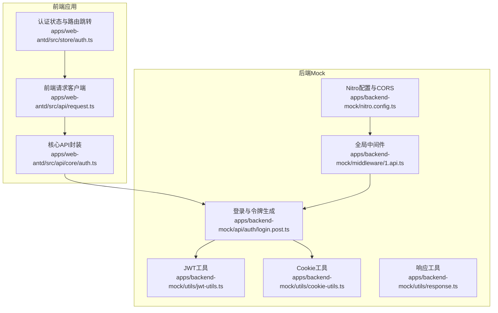
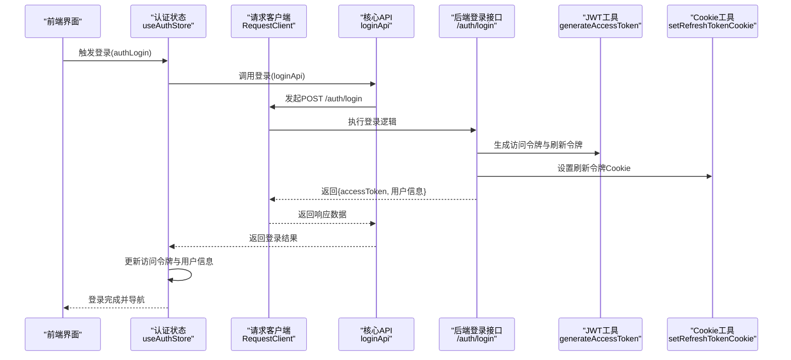
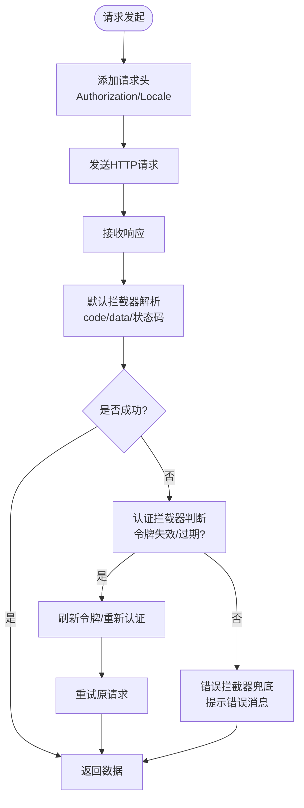
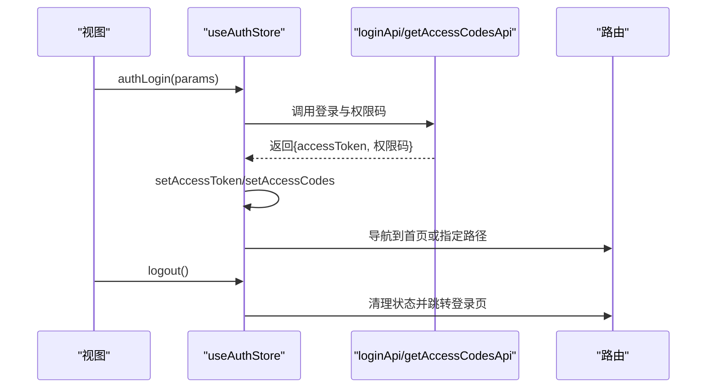
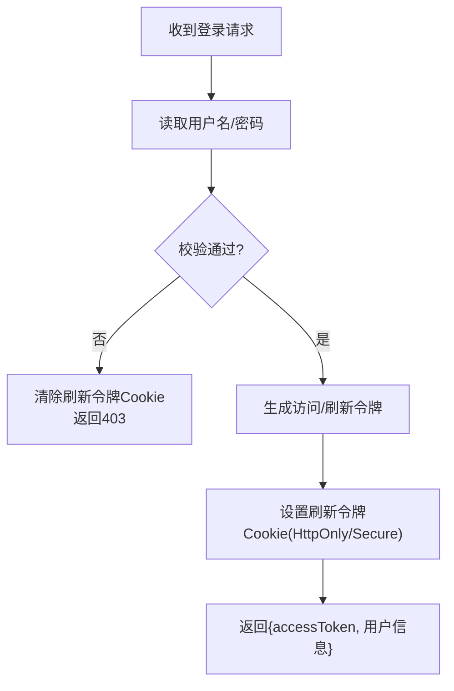
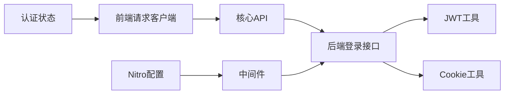

# 第三方服务集成

<cite>
**本文引用的文件**
- [nitro.config.ts](file://apps/backend-mock/nitro.config.ts)
- [1.api.ts](file://apps/backend-mock/middleware/1.api.ts)
- [login.post.ts](file://apps/backend-mock/api/auth/login.post.ts)
- [jwt-utils.ts](file://apps/backend-mock/utils/jwt-utils.ts)
- [cookie-utils.ts](file://apps/backend-mock/utils/cookie-utils.ts)
- [response.ts](file://apps/backend-mock/utils/response.ts)
- [request.ts](file://apps/web-antd/src/api/request.ts)
- [auth.ts](file://apps/web-antd/src/store/auth.ts)
- [auth.ts](file://apps/web-antd/src/api/core/auth.ts)
- [server.md](file://docs/src/en/guide/essentials/server.md)
- [third-party-login.vue](file://packages/effects/common-ui/src/ui/authentication/third-party-login.vue)
</cite>

## 目录
1. [引言](#引言)
2. [项目结构](#项目结构)
3. [核心组件](#核心组件)
4. [架构总览](#架构总览)
5. [详细组件分析](#详细组件分析)
6. [依赖关系分析](#依赖关系分析)
7. [性能考量](#性能考量)
8. [故障排查指南](#故障排查指南)
9. [结论](#结论)
10. [附录](#附录)

## 引言
本指南面向在本仓库基础上进行“第三方服务集成”的开发者，系统讲解如何对接外部服务，覆盖以下主题：
- API 接入方式：RESTful API、GraphQL、WebSocket 的集成要点与流程
- SDK 集成：SDK 选择、配置与封装策略
- 数据同步：实时同步、批量同步、增量同步的实现思路
- 认证与授权：OAuth、JWT、API 密钥的管理与最佳实践
- 错误处理与重试：统一错误处理与退避重试设计
- 监控与日志：如何在现有请求层中扩展可观测性
- 具体集成示例：支付网关、推送服务、数据分析等常见场景
- 安全考虑与最佳实践：令牌管理、CORS、中间件保护、Cookie 安全等

本指南以现有代码库中的请求层、认证与中间件为蓝本，结合文档中的请求配置说明，给出可落地的集成方案。

## 项目结构
本项目采用多应用与多框架适配的组织方式，前端通过统一的请求客户端封装 HTTP 调用；后端 Mock 使用 Nitro 框架，提供 CORS、中间件与 JWT 工具函数。下图展示与第三方服务集成相关的关键模块：

图表来源
- [request.ts:1-124](file://apps/web-antd/src/api/request.ts#L1-L124)
- [auth.ts:1-118](file://apps/web-antd/src/store/auth.ts#L1-L118)
- [auth.ts:1-52](file://apps/web-antd/src/api/core/auth.ts#L1-L52)
- [nitro.config.ts:1-21](file://apps/backend-mock/nitro.config.ts#L1-L21)
- [1.api.ts:1-31](file://apps/backend-mock/middleware/1.api.ts#L1-L31)
- [login.post.ts:1-43](file://apps/backend-mock/api/auth/login.post.ts#L1-L43)
- [jwt-utils.ts:1-115](file://apps/backend-mock/utils/jwt-utils.ts#L1-L115)
- [cookie-utils.ts:1-29](file://apps/backend-mock/utils/cookie-utils.ts#L1-L29)
- [response.ts:1-71](file://apps/backend-mock/utils/response.ts#L1-L71)

章节来源
- [nitro.config.ts:1-21](file://apps/backend-mock/nitro.config.ts#L1-L21)
- [1.api.ts:1-31](file://apps/backend-mock/middleware/1.api.ts#L1-L31)
- [login.post.ts:1-43](file://apps/backend-mock/api/auth/login.post.ts#L1-L43)
- [jwt-utils.ts:1-115](file://apps/backend-mock/utils/jwt-utils.ts#L1-L115)
- [cookie-utils.ts:1-29](file://apps/backend-mock/utils/cookie-utils.ts#L1-L29)
- [response.ts:1-71](file://apps/backend-mock/utils/response.ts#L1-L71)
- [request.ts:1-124](file://apps/web-antd/src/api/request.ts#L1-L124)
- [auth.ts:1-118](file://apps/web-antd/src/store/auth.ts#L1-L118)
- [auth.ts:1-52](file://apps/web-antd/src/api/core/auth.ts#L1-L52)
- [server.md:158-274](file://docs/src/en/guide/essentials/server.md#L158-L274)

## 核心组件
- 前端请求客户端：统一的 HTTP 客户端，负责请求头注入、响应拦截、错误处理、刷新令牌与重新认证。
- 认证状态与路由：集中管理登录、登出、用户信息与权限码获取，并在登录成功后导航。
- 后端 Mock：提供登录接口、JWT 生成与校验、Cookie 管理、CORS 与中间件保护。
- 文档参考：请求配置与拦截器的使用范式，便于扩展第三方服务的统一处理。

章节来源
- [request.ts:1-124](file://apps/web-antd/src/api/request.ts#L1-L124)
- [auth.ts:1-118](file://apps/web-antd/src/store/auth.ts#L1-L118)
- [auth.ts:1-52](file://apps/web-antd/src/api/core/auth.ts#L1-L52)
- [server.md:158-274](file://docs/src/en/guide/essentials/server.md#L158-L274)

## 架构总览
下图展示了从前端请求到后端认证再到第三方服务的整体调用链路与关键节点：

图表来源
- [auth.ts:28-78](file://apps/web-antd/src/store/auth.ts#L28-L78)
- [auth.ts:24-26](file://apps/web-antd/src/api/core/auth.ts#L24-L26)
- [login.post.ts:14-42](file://apps/backend-mock/api/auth/login.post.ts#L14-L42)
- [jwt-utils.ts:17-25](file://apps/backend-mock/utils/jwt-utils.ts#L17-L25)
- [cookie-utils.ts:13-23](file://apps/backend-mock/utils/cookie-utils.ts#L13-L23)

## 详细组件分析

### 前端请求客户端与拦截器
- 统一基座：基于 RequestClient 创建带 baseURL 的客户端实例，支持响应体转换（如 BigInt）。
- 请求拦截：自动注入 Authorization 与语言头，保证每次请求携带最新令牌。
- 响应拦截：
  - 默认拦截：按约定 code/data 字段解析响应，非成功状态抛错。
  - 认证拦截：检测令牌失效或过期，触发刷新或重新认证。
  - 错误拦截：兜底错误消息提示，支持从响应体提取错误信息。
- 刷新与重新认证：提供 doRefreshToken 与 doReAuthenticate 钩子，配合后端刷新接口与登录态清理。

图表来源
- [request.ts:26-124](file://apps/web-antd/src/api/request.ts#L26-L124)

章节来源
- [request.ts:1-124](file://apps/web-antd/src/api/request.ts#L1-L124)
- [server.md:158-274](file://docs/src/en/guide/essentials/server.md#L158-L274)

### 认证状态与路由控制
- 登录流程：调用登录 API 获取 accessToken，随后并发拉取用户信息与权限码，成功后写入状态并导航。
- 登出流程：调用登出接口，清理所有状态并跳转至登录页。
- 加载态与通知：登录过程设置加载态，成功后弹出通知。

图表来源
- [auth.ts:28-78](file://apps/web-antd/src/store/auth.ts#L28-L78)
- [auth.ts:24-51](file://apps/web-antd/src/api/core/auth.ts#L24-L51)

章节来源
- [auth.ts:1-118](file://apps/web-antd/src/store/auth.ts#L1-L118)
- [auth.ts:1-52](file://apps/web-antd/src/api/core/auth.ts#L1-L52)

### 后端认证与中间件
- 登录接口：读取用户名密码，校验失败返回 403；成功生成访问与刷新令牌，设置安全 Cookie。
- JWT 工具：生成与验证访问/刷新令牌，基于固定密钥（生产需替换）。
- Cookie 工具：设置/删除刷新令牌 Cookie，含 HttpOnly、SameSite、Secure 等安全属性。
- 中间件：对特定前缀的写操作进行拦截，演示环境下禁止修改；同时处理预检请求。
- Nitro 配置：统一开启 CORS 并允许凭据，便于跨域调用。

图表来源
- [login.post.ts:14-42](file://apps/backend-mock/api/auth/login.post.ts#L14-L42)
- [jwt-utils.ts:17-25](file://apps/backend-mock/utils/jwt-utils.ts#L17-L25)
- [cookie-utils.ts:13-23](file://apps/backend-mock/utils/cookie-utils.ts#L13-L23)
- [1.api.ts:14-30](file://apps/backend-mock/middleware/1.api.ts#L14-L30)
- [nitro.config.ts:7-19](file://apps/backend-mock/nitro.config.ts#L7-L19)

章节来源
- [login.post.ts:1-43](file://apps/backend-mock/api/auth/login.post.ts#L1-L43)
- [jwt-utils.ts:1-115](file://apps/backend-mock/utils/jwt-utils.ts#L1-L115)
- [cookie-utils.ts:1-29](file://apps/backend-mock/utils/cookie-utils.ts#L1-L29)
- [1.api.ts:1-31](file://apps/backend-mock/middleware/1.api.ts#L1-L31)
- [nitro.config.ts:1-21](file://apps/backend-mock/nitro.config.ts#L1-L21)

### GraphQL 与 WebSocket 集成要点
- GraphQL
  - 选择合适的客户端库（如官方 Apollo 或 urql），在现有 RequestClient 基础上新增 GraphQL 客户端实例。
  - 将认证头注入到 GraphQL 客户端的 HTTP/WS 层，确保每次查询携带令牌。
  - 在响应拦截器中统一处理 GraphQL 错误数组，映射为前端可读提示。
- WebSocket
  - 在握手阶段通过查询参数或自定义头部传递令牌，或在连接建立后发送鉴权消息。
  - 使用心跳与自动重连策略，结合指数退避重试，避免频繁断线。
  - 对消息进行序列化/反序列化与错误分发，统一记录日志。

（本节为概念性指导，不直接对应具体源码文件）

### SDK 集成流程
- SDK 选择：优先选择官方 TypeScript/JavaScript SDK，具备类型定义与活跃维护。
- 配置封装：在前端新建 SDK 包装层，复用现有 RequestClient 的拦截器能力，统一处理认证、错误与重试。
- 封装策略：将 SDK 方法映射为核心 API，保持命名一致与参数标准化，便于后续替换与测试。

（本节为概念性指导，不直接对应具体源码文件）

### 数据同步策略
- 实时同步：适用于 WebSocket/长连接场景，结合本地状态与增量更新，减少回放风暴。
- 批量同步：定时任务或后台任务，按批次拉取远端变更，合并到本地缓存。
- 增量同步：基于时间戳或游标，仅拉取新增/变更数据，降低网络与存储压力。
- 冲突解决：采用“最后写入获胜”或“合并策略”，必要时引入版本向量或 CRDT。

（本节为概念性指导，不直接对应具体源码文件）

### 认证与授权
- OAuth：在登录流程中接入第三方授权回调，换取访问令牌与刷新令牌，持久化到状态与 Cookie。
- JWT：沿用现有生成/验证流程，生产环境替换密钥并启用 HTTPS、安全 Cookie。
- API 密钥：通过请求头注入，或在 SDK 层统一管理；避免在前端暴露长期有效密钥。

章节来源
- [jwt-utils.ts:1-115](file://apps/backend-mock/utils/jwt-utils.ts#L1-L115)
- [cookie-utils.ts:1-29](file://apps/backend-mock/utils/cookie-utils.ts#L1-L29)
- [login.post.ts:1-43](file://apps/backend-mock/api/auth/login.post.ts#L1-L43)

### 错误处理与重试机制
- 统一错误处理：在响应拦截器中捕获业务错误与网络错误，提取 message/error 字段，统一提示。
- 重试策略：对幂等 GET 请求与临时性错误（如 5xx/超时）进行指数退避重试，限制最大次数。
- 令牌失效处理：在认证拦截器中触发刷新或重新认证，刷新成功后重试原请求。

章节来源
- [request.ts:84-114](file://apps/web-antd/src/api/request.ts#L84-L114)
- [server.md:245-266](file://docs/src/en/guide/essentials/server.md#L245-L266)

### 监控与日志
- 日志采集：在请求拦截器中记录请求/响应摘要（URL、状态码、耗时），敏感信息脱敏。
- 错误上报：对未捕获异常与认证失败事件进行上报，便于追踪。
- 性能指标：统计平均响应时间、错误率与重试次数，辅助容量规划。

（本节为概念性指导，不直接对应具体源码文件）

### 具体集成示例
- 支付网关
  - 选择 SDK，封装下单、查询、退款等方法，统一错误映射与重试。
  - 在前端核心 API 中暴露支付相关接口，复用现有拦截器。
- 推送服务
  - 使用 WebSocket 或 HTTP/2 流式推送，实现消息订阅与离线重连。
  - 在拦截器中记录推送事件与错误，便于诊断。
- 数据分析
  - 使用事件上报 SDK，批量发送埋点数据，结合本地队列与重试。
  - 在请求层统一注入用户标识与上下文信息。

（本节为概念性指导，不直接对应具体源码文件）

### 安全考虑与最佳实践
- 令牌安全：使用 HttpOnly/Secure/SameSite Cookie 存储刷新令牌；访问令牌通过 Bearer 头传递。
- CORS 与中间件：严格控制允许的来源与方法，演示环境禁写中间件可迁移为生产白名单。
- 密钥管理：生产环境使用环境变量或密钥管理服务，定期轮换。
- 输入校验：对第三方返回的数据进行严格校验与清洗，防止注入与越权。

章节来源
- [cookie-utils.ts:1-29](file://apps/backend-mock/utils/cookie-utils.ts#L1-L29)
- [1.api.ts:1-31](file://apps/backend-mock/middleware/1.api.ts#L1-L31)
- [nitro.config.ts:1-21](file://apps/backend-mock/nitro.config.ts#L1-L21)

## 依赖关系分析
- 前端请求客户端依赖状态存储与核心 API，核心 API 依赖后端登录接口。
- 后端登录接口依赖 JWT 工具与 Cookie 工具，中间件与 Nitro 配置提供 CORS 与安全头。
- 文档中的请求配置示例为前端请求客户端提供了可复用的拦截器模式。

图表来源
- [request.ts:1-124](file://apps/web-antd/src/api/request.ts#L1-L124)
- [auth.ts:1-118](file://apps/web-antd/src/store/auth.ts#L1-L118)
- [auth.ts:1-52](file://apps/web-antd/src/api/core/auth.ts#L1-L52)
- [login.post.ts:1-43](file://apps/backend-mock/api/auth/login.post.ts#L1-L43)
- [jwt-utils.ts:1-115](file://apps/backend-mock/utils/jwt-utils.ts#L1-L115)
- [cookie-utils.ts:1-29](file://apps/backend-mock/utils/cookie-utils.ts#L1-L29)
- [1.api.ts:1-31](file://apps/backend-mock/middleware/1.api.ts#L1-L31)
- [nitro.config.ts:1-21](file://apps/backend-mock/nitro.config.ts#L1-L21)

章节来源
- [request.ts:1-124](file://apps/web-antd/src/api/request.ts#L1-L124)
- [auth.ts:1-118](file://apps/web-antd/src/store/auth.ts#L1-L118)
- [auth.ts:1-52](file://apps/web-antd/src/api/core/auth.ts#L1-L52)
- [login.post.ts:1-43](file://apps/backend-mock/api/auth/login.post.ts#L1-L43)
- [jwt-utils.ts:1-115](file://apps/backend-mock/utils/jwt-utils.ts#L1-L115)
- [cookie-utils.ts:1-29](file://apps/backend-mock/utils/cookie-utils.ts#L1-L29)
- [1.api.ts:1-31](file://apps/backend-mock/middleware/1.api.ts#L1-L31)
- [nitro.config.ts:1-21](file://apps/backend-mock/nitro.config.ts#L1-L21)

## 性能考量
- 请求批量化：对高频调用进行合并与去抖，减少网络往返。
- 缓存策略：对只读数据使用内存/持久化缓存，结合失效时间与条件请求。
- 超时与重试：合理设置超时阈值与最大重试次数，避免雪崩效应。
- 传输优化：启用压缩与合理的分页大小，降低带宽占用。

（本节为一般性建议，不直接对应具体源码文件）

## 故障排查指南
- 登录失败
  - 检查用户名/密码是否正确，确认后端返回的错误码与消息。
  - 查看浏览器 Cookie 是否设置成功，确认 SameSite/Secure 配置。
- 令牌过期
  - 观察认证拦截器是否触发刷新或重新认证，检查刷新接口是否可用。
  - 确认前端状态中 accessToken 是否已更新。
- CORS 与跨域
  - 核对 Nitro 配置中的 Access-Control-Allow-* 头，确保允许来源与凭据。
  - 中间件是否拦截了写操作导致 403。
- 错误提示
  - 检查错误拦截器是否正确提取响应体中的错误信息，确认消息显示逻辑。

章节来源
- [response.ts:1-71](file://apps/backend-mock/utils/response.ts#L1-L71)
- [request.ts:105-114](file://apps/web-antd/src/api/request.ts#L105-L114)
- [nitro.config.ts:7-19](file://apps/backend-mock/nitro.config.ts#L7-L19)
- [1.api.ts:14-30](file://apps/backend-mock/middleware/1.api.ts#L14-L30)

## 结论
本指南基于现有请求客户端与认证体系，给出了第三方服务集成的完整方法论：以统一的请求层为基础，结合认证拦截器与错误处理，快速适配 RESTful、GraphQL 与 WebSocket；通过中间件与 CORS 策略保障安全；通过监控与日志提升可观测性。按照本文步骤，可在不破坏现有架构的前提下，安全、稳定地接入各类第三方服务。

## 附录
- 第三方登录入口组件：用于展示与引导第三方登录入口，可作为集成第三方认证的 UI 基础。

章节来源
- [third-party-login.vue:1-32](file://packages/effects/common-ui/src/ui/authentication/third-party-login.vue#L1-L32)