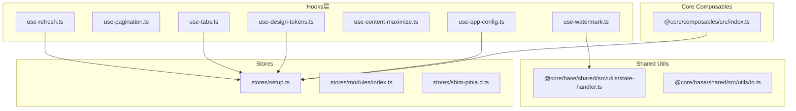
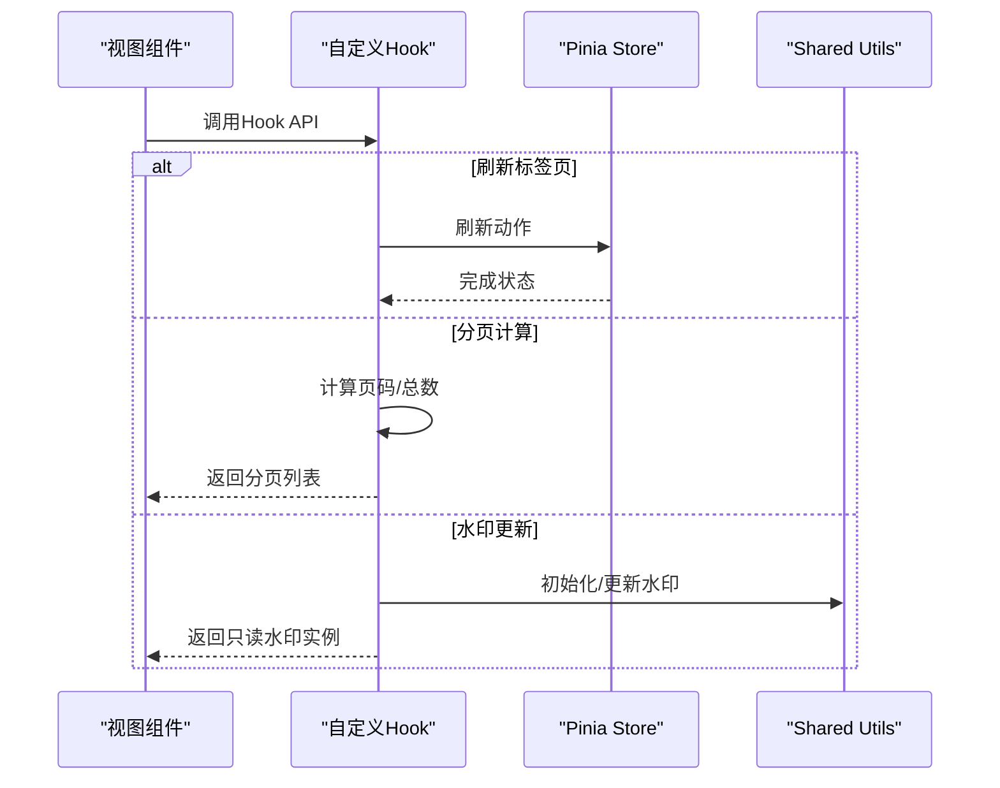
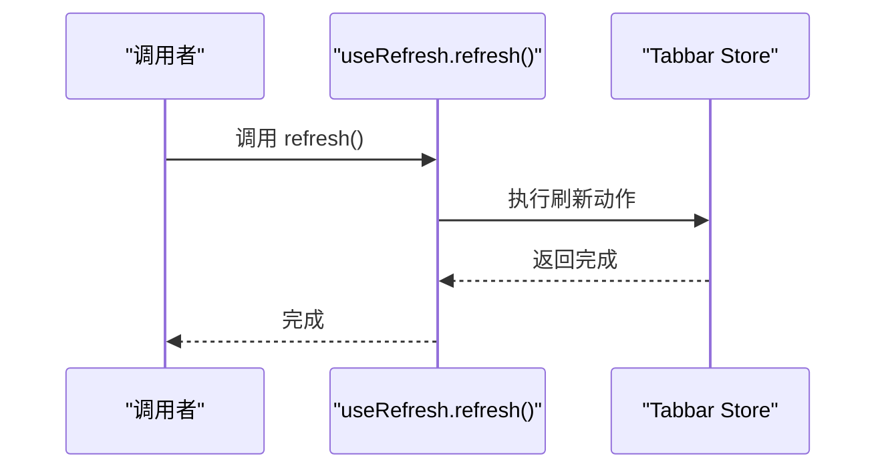
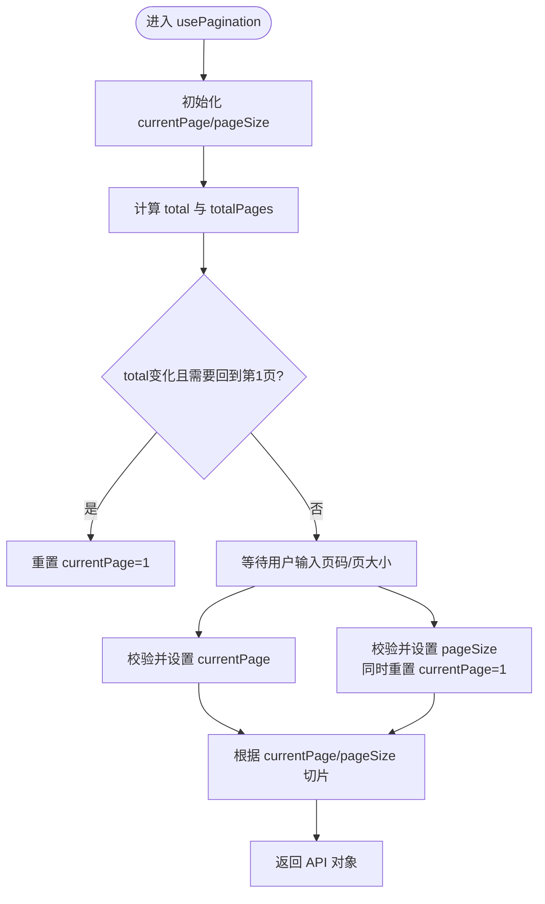
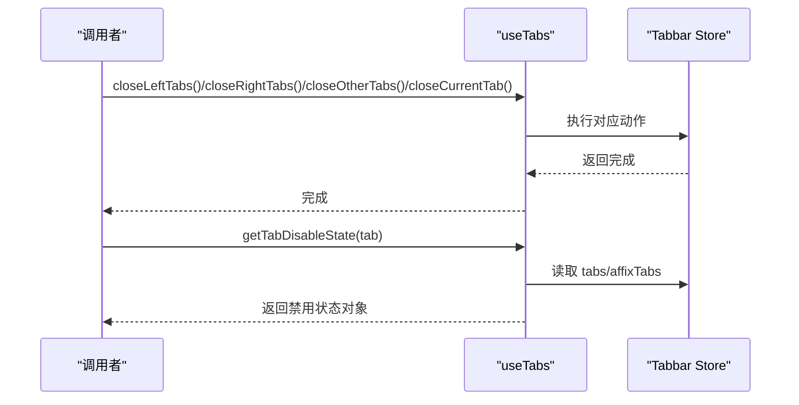
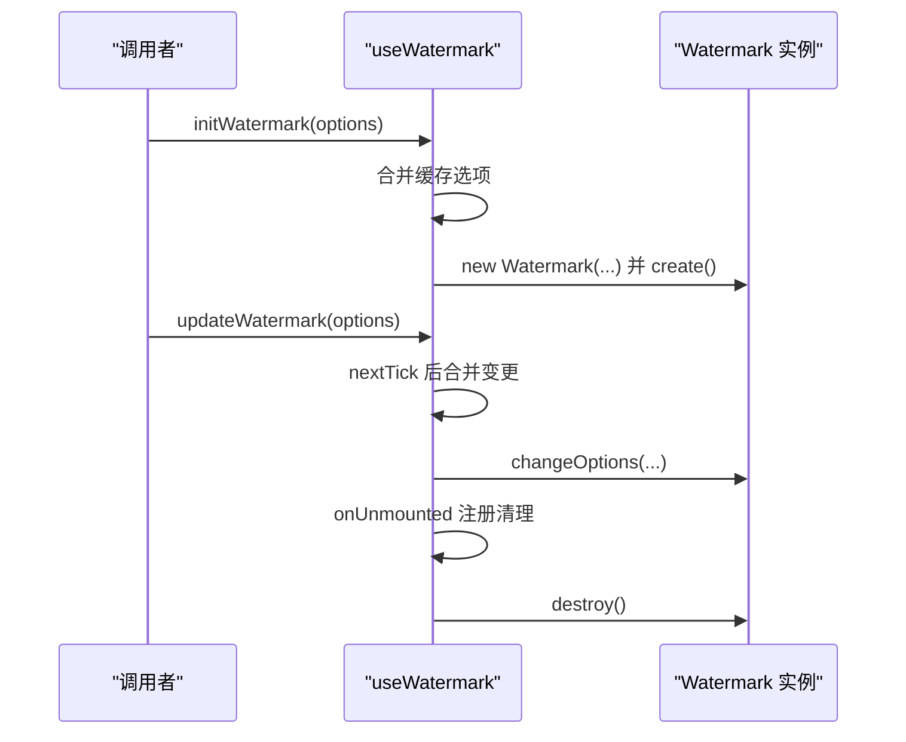
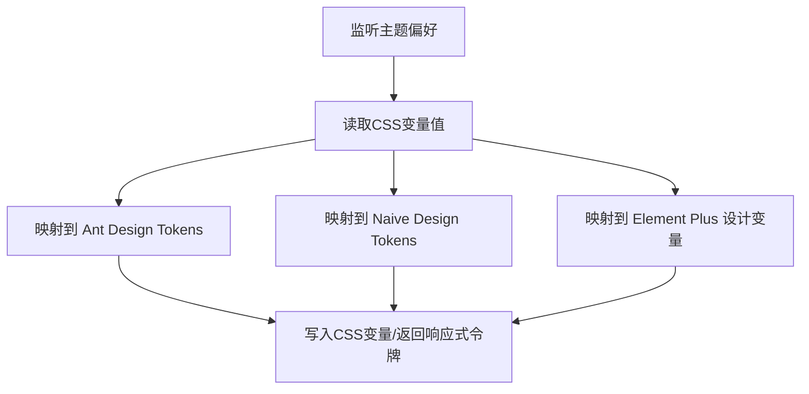
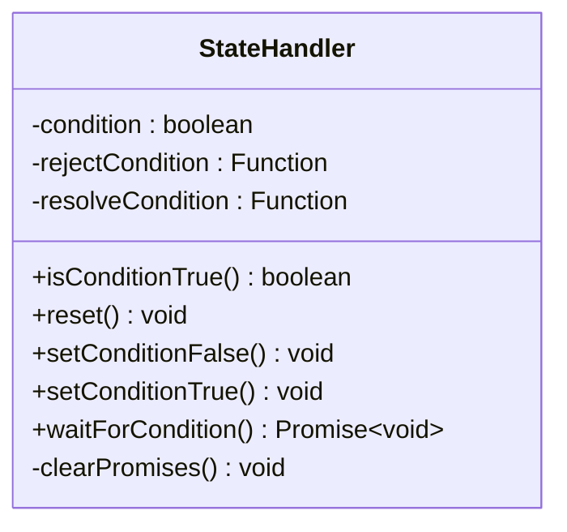
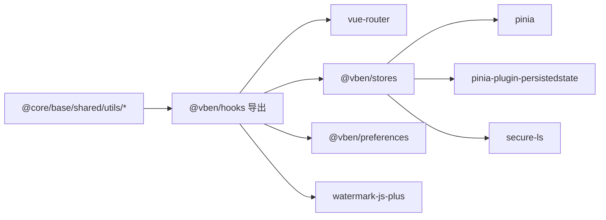

# 自定义Hook开发

<cite>
**本文引用的文件**
- [packages/effects/hooks/src/index.ts](file://packages/effects/hooks/src/index.ts)
- [packages/effects/hooks/src/use-refresh.ts](file://packages/effects/hooks/src/use-refresh.ts)
- [packages/effects/hooks/src/use-pagination.ts](file://packages/effects/hooks/src/use-pagination.ts)
- [packages/effects/hooks/src/use-tabs.ts](file://packages/effects/hooks/src/use-tabs.ts)
- [packages/effects/hooks/src/use-watermark.ts](file://packages/effects/hooks/src/use-watermark.ts)
- [packages/effects/hooks/src/use-content-maximize.ts](file://packages/effects/hooks/src/use-content-maximize.ts)
- [packages/effects/hooks/src/use-design-tokens.ts](file://packages/effects/hooks/src/use-design-tokens.ts)
- [packages/effects/hooks/src/use-app-config.ts](file://packages/effects/hooks/src/use-app-config.ts)
- [packages/@core/composables/src/index.ts](file://packages/@core/composables/src/index.ts)
- [packages/@core/base/shared/src/utils/state-handler.ts](file://packages/@core/base/shared/src/utils/state-handler.ts)
- [packages/@core/base/shared/src/utils/to.ts](file://packages/@core/base/shared/src/utils/to.ts)
- [packages/stores/src/setup.ts](file://packages/stores/src/setup.ts)
- [packages/stores/src/modules/index.ts](file://packages/stores/src/modules/index.ts)
- [packages/stores/shim-pinia.d.ts](file://packages/stores/shim-pinia.d.ts)
- [docs/src/en/guide/project/test.md](file://docs/src/en/guide/project/test.md)
- [internal/lint-configs/oxlint-config/src/configs/test.ts](file://internal/lint-configs/oxlint-config/src/configs/test.ts)
</cite>

## 目录

1. [引言](#引言)
2. [项目结构](#项目结构)
3. [核心组件](#核心组件)
4. [架构总览](#架构总览)
5. [详细组件分析](#详细组件分析)
6. [依赖分析](#依赖分析)
7. [性能考虑](#性能考虑)
8. [故障排查指南](#故障排查指南)
9. [结论](#结论)
10. [附录](#附录)

## 引言

本指南面向希望在Vue 3 Composition API生态中开发高质量自定义Hook与Composables的工程师。我们将基于仓库中的真实实现，系统讲解状态逻辑抽象的设计原则（状态提取、逻辑复用、边界处理）、Composition API的正确使用（ref、reactive、computed、watch）、异步逻辑与错误处理、副作用管理（生命周期与资源清理）、Store Composables的开发方法（状态管理、动作分发、订阅机制），并提供测试策略、调试技巧与性能优化建议。文末附带从简单到复杂的Hook开发示例路径，帮助读者快速上手。

## 项目结构

本仓库采用Monorepo组织方式，与自定义Hook和Composables相关的关键模块如下：

- hooks包：集中导出各类通用Hook，覆盖页面行为、主题与设计系统、水印、分页、标签页等场景。
- @core/composables：提供布局、命名空间、国际化等基础Composables。
- @core/base/shared/utils：提供工具类（如状态处理器、安全Promise包装）。
- stores：基于Pinia的状态管理初始化与模块化导出。
- 文档与测试规范：提供单元测试指南与测试规则配置。



**图表来源**

- [packages/effects/hooks/src/index.ts:1-9](file://packages/effects/hooks/src/index.ts#L1-L9)
- [packages/effects/hooks/src/use-refresh.ts:1-17](file://packages/effects/hooks/src/use-refresh.ts#L1-L17)
- [packages/effects/hooks/src/use-tabs.ts:1-134](file://packages/effects/hooks/src/use-tabs.ts#L1-L134)
- [packages/effects/hooks/src/use-watermark.ts:1-85](file://packages/effects/hooks/src/use-watermark.ts#L1-L85)
- [packages/effects/hooks/src/use-design-tokens.ts:1-322](file://packages/effects/hooks/src/use-design-tokens.ts#L1-L322)
- [packages/@core/composables/src/index.ts:1-14](file://packages/@core/composables/src/index.ts#L1-L14)
- [packages/@core/base/shared/src/utils/state-handler.ts:1-51](file://packages/@core/base/shared/src/utils/state-handler.ts#L1-L51)
- [packages/@core/base/shared/src/utils/to.ts:1-21](file://packages/@core/base/shared/src/utils/to.ts#L1-L21)
- [packages/stores/src/setup.ts:1-82](file://packages/stores/src/setup.ts#L1-L82)
- [packages/stores/src/modules/index.ts:1-5](file://packages/stores/src/modules/index.ts#L1-L5)
- [packages/stores/shim-pinia.d.ts:1-9](file://packages/stores/shim-pinia.d.ts#L1-L9)

**章节来源**

- [packages/effects/hooks/src/index.ts:1-9](file://packages/effects/hooks/src/index.ts#L1-L9)
- [packages/@core/composables/src/index.ts:1-14](file://packages/@core/composables/src/index.ts#L1-L14)

## 核心组件

本节聚焦于与Hook开发密切相关的“状态逻辑抽象”实践要点：

- 状态提取：将可变状态封装为可复用的响应式对象或函数，暴露稳定的API。
- 逻辑复用：通过组合多个Hook或Composables，形成更高阶的业务能力。
- 边界处理：对输入参数进行校验、异常抛出与默认值设定，确保健壮性。
- 副作用隔离：明确副作用的注册与清理时机，避免内存泄漏与重复注册。
- 异步与错误处理：统一Promise包装与错误传播，提供可控的失败路径。

上述原则在以下文件中得到体现：

- use-refresh：封装刷新逻辑，委派给Tabbar Store。
- use-pagination：封装分页状态与边界校验。
- use-tabs：封装标签页集合操作与禁用状态计算。
- use-watermark：封装水印实例化、更新与卸载清理。
- use-design-tokens：封装主题到UI框架设计令牌的映射与更新。
- use-app-config：封装应用运行时配置的读取与构造。
- @core/composables：提供布局、命名空间等基础能力。
- Shared utils：提供状态处理器与安全Promise包装。

**章节来源**

- [packages/effects/hooks/src/use-refresh.ts:1-17](file://packages/effects/hooks/src/use-refresh.ts#L1-L17)
- [packages/effects/hooks/src/use-pagination.ts:1-73](file://packages/effects/hooks/src/use-pagination.ts#L1-L73)
- [packages/effects/hooks/src/use-tabs.ts:1-134](file://packages/effects/hooks/src/use-tabs.ts#L1-L134)
- [packages/effects/hooks/src/use-watermark.ts:1-85](file://packages/effects/hooks/src/use-watermark.ts#L1-L85)
- [packages/effects/hooks/src/use-design-tokens.ts:1-322](file://packages/effects/hooks/src/use-design-tokens.ts#L1-L322)
- [packages/effects/hooks/src/use-app-config.ts:1-37](file://packages/effects/hooks/src/use-app-config.ts#L1-L37)
- [packages/@core/composables/src/index.ts:1-14](file://packages/@core/composables/src/index.ts#L1-L14)
- [packages/@core/base/shared/src/utils/state-handler.ts:1-51](file://packages/@core/base/shared/src/utils/state-handler.ts#L1-L51)
- [packages/@core/base/shared/src/utils/to.ts:1-21](file://packages/@core/base/shared/src/utils/to.ts#L1-L21)

## 架构总览

下图展示了Hook与Store、共享工具之间的交互关系，以及典型的数据流与控制流。



**图表来源**

- [packages/effects/hooks/src/use-refresh.ts:1-17](file://packages/effects/hooks/src/use-refresh.ts#L1-L17)
- [packages/effects/hooks/src/use-pagination.ts:1-73](file://packages/effects/hooks/src/use-pagination.ts#L1-L73)
- [packages/effects/hooks/src/use-watermark.ts:1-85](file://packages/effects/hooks/src/use-watermark.ts#L1-L85)
- [packages/stores/src/setup.ts:1-82](file://packages/stores/src/setup.ts#L1-L82)
- [packages/@core/base/shared/src/utils/state-handler.ts:1-51](file://packages/@core/base/shared/src/utils/state-handler.ts#L1-L51)

## 详细组件分析

### useRefresh：刷新流程的Hook

该Hook将“刷新当前路由”的行为抽象为可复用的API，内部委派给Tabbar Store完成具体动作。



**图表来源**

- [packages/effects/hooks/src/use-refresh.ts:1-17](file://packages/effects/hooks/src/use-refresh.ts#L1-L17)

**章节来源**

- [packages/effects/hooks/src/use-refresh.ts:1-17](file://packages/effects/hooks/src/use-refresh.ts#L1-L17)

### usePagination：分页状态与边界处理

该Hook封装分页状态、总页数与列表切片，并对非法页码与页大小进行边界校验，必要时抛出错误。



**图表来源**

- [packages/effects/hooks/src/use-pagination.ts:1-73](file://packages/effects/hooks/src/use-pagination.ts#L1-L73)

**章节来源**

- [packages/effects/hooks/src/use-pagination.ts:1-73](file://packages/effects/hooks/src/use-pagination.ts#L1-L73)

### useTabs：标签页集合操作与禁用状态

该Hook封装标签页的关闭、固定/取消固定、刷新、新窗口打开、按Key关闭等操作，并提供禁用状态计算逻辑，便于UI按钮的可用性控制。



**图表来源**

- [packages/effects/hooks/src/use-tabs.ts:1-134](file://packages/effects/hooks/src/use-tabs.ts#L1-L134)

**章节来源**

- [packages/effects/hooks/src/use-tabs.ts:1-134](file://packages/effects/hooks/src/use-tabs.ts#L1-L134)

### useWatermark：水印实例化、更新与清理

该Hook负责延迟导入水印库、实例化与更新选项，并在组件卸载时自动销毁，避免重复注册与内存泄漏。



**图表来源**

- [packages/effects/hooks/src/use-watermark.ts:1-85](file://packages/effects/hooks/src/use-watermark.ts#L1-L85)

**章节来源**

- [packages/effects/hooks/src/use-watermark.ts:1-85](file://packages/effects/hooks/src/use-watermark.ts#L1-L85)

### useDesignTokens：主题到设计令牌映射

该Hook监听主题偏好，将CSS变量转换为各UI框架（Antd、Naive、Element Plus）所需的设计令牌，并支持即时更新。



**图表来源**

- [packages/effects/hooks/src/use-design-tokens.ts:1-322](file://packages/effects/hooks/src/use-design-tokens.ts#L1-L322)

**章节来源**

- [packages/effects/hooks/src/use-design-tokens.ts:1-322](file://packages/effects/hooks/src/use-design-tokens.ts#L1-L322)

### useAppConfig：应用配置读取

该Hook在生产环境从全局注入的配置对象读取，在开发环境从环境变量构造应用配置。

```merrid
flowchart TD
  Env["传入 env/isProduction"] --> Prod{"isProduction?"}
  Prod -->|是| Global["window._VBEN_ADMIN_PRO_APP_CONF_"]
  Prod -->|否| FromEnv["从 env 构造配置"]
  Global --> Build["构建 ApplicationConfig"]
  FromEnv --> Build
  Build --> Return["返回配置对象"]
```

**图表来源**

- [packages/effects/hooks/src/use-app-config.ts:1-37](file://packages/effects/hooks/src/use-app-config.ts#L1-L37)

**章节来源**

- [packages/effects/hooks/src/use-app-config.ts:1-37](file://packages/effects/hooks/src/use-app-config.ts#L1-L37)

### @core/composables：基础能力组合

该模块导出布局样式、命名空间、国际化等基础Composables，作为上层Hook的基石。

**章节来源**

- [packages/@core/composables/src/index.ts:1-14](file://packages/@core/composables/src/index.ts#L1-L14)

### Shared Utils：状态处理器与安全Promise包装

- StateHandler：提供条件等待与状态切换，支持立即resolve与reject，适合异步同步化场景。
- to：将Promise包装为二元数组形式，简化try/catch与错误分支处理。



**图表来源**

- [packages/@core/base/shared/src/utils/state-handler.ts:1-51](file://packages/@core/base/shared/src/utils/state-handler.ts#L1-L51)

**章节来源**

- [packages/@core/base/shared/src/utils/state-handler.ts:1-51](file://packages/@core/base/shared/src/utils/state-handler.ts#L1-L51)
- [packages/@core/base/shared/src/utils/to.ts:1-21](file://packages/@core/base/shared/src/utils/to.ts#L1-L21)

## 依赖分析

- Hooks层依赖：
  - vue-router：用于路由与导航上下文。
  - @vben/stores：用于访问Pinia Store（如Tabbar Store）。
  - @vben/preferences：用于主题与偏好读取。
  - watermark-js-plus：用于水印功能。
  - @vueuse/core：用于通用工具（在其他模块中使用）。
- Stores层：
  - Pinia：状态容器。
  - pinia-plugin-persistedstate：持久化插件。
  - secure-ls：生产环境加密存储。
- Shared Utils：
  - 提供无副作用的纯工具函数，便于跨模块复用。



**图表来源**

- [packages/effects/hooks/src/index.ts:1-9](file://packages/effects/hooks/src/index.ts#L1-L9)
- [packages/effects/hooks/src/use-watermark.ts:1-85](file://packages/effects/hooks/src/use-watermark.ts#L1-L85)
- [packages/stores/src/setup.ts:1-82](file://packages/stores/src/setup.ts#L1-L82)
- [packages/@core/base/shared/src/utils/state-handler.ts:1-51](file://packages/@core/base/shared/src/utils/state-handler.ts#L1-L51)

**章节来源**

- [packages/effects/hooks/src/index.ts:1-9](file://packages/effects/hooks/src/index.ts#L1-L9)
- [packages/stores/src/setup.ts:1-82](file://packages/stores/src/setup.ts#L1-L82)

## 性能考虑

- 响应式粒度控制：优先使用ref封装细粒度状态，computed仅做轻量派生，避免过度依赖reactive导致不必要的重渲染。
- watch边界：对watch的触发条件进行收敛，避免在高频事件中频繁写入状态；必要时结合防抖/节流。
- 异步与懒加载：如水印初始化采用动态导入与延迟创建，减少首屏开销。
- 计算复杂度：分页等计算尽量在computed中缓存，避免重复计算。
- Store持久化：合理配置持久化键与存储介质，避免大对象频繁序列化。
- 资源清理：确保onUnmounted中释放外部资源（如水印销毁），防止内存泄漏。

## 故障排查指南

- 测试策略与规范
  - 使用Vitest进行单元测试，遵循约定式命名（.test.ts或**tests**目录）。
  - 在CI中保持测试覆盖率与通过率，确保变更不会破坏既有行为。
  - 测试规则配置参考Oxlint/Vitest规则，约束测试风格与最佳实践。
- 常见问题定位
  - 分页异常：检查页码与页大小的边界校验与默认值。
  - 标签页禁用状态不符预期：核对当前标签索引、固定标签数量与路由匹配。
  - 水印未生效或重复创建：确认动态导入顺序、nextTick时机与卸载钩子注册。
  - 主题令牌不更新：检查主题偏好监听与CSS变量读取逻辑。
- 调试技巧
  - 使用浏览器开发者工具观察响应式状态变化与渲染次数。
  - 在关键路径添加日志与断点，验证异步流程与错误分支。
  - 将复杂逻辑拆分为更小的可测试单元，提升可维护性。

**章节来源**

- [docs/src/en/guide/project/test.md:1-34](file://docs/src/en/guide/project/test.md#L1-L34)
- [internal/lint-configs/oxlint-config/src/configs/test.ts:1-23](file://internal/lint-configs/oxlint-config/src/configs/test.ts#L1-L23)

## 结论

通过在本项目中的实践，我们总结出一套可复用的Hook开发范式：以清晰的职责划分与稳定的API对外暴露为核心，配合严格的边界处理、完善的副作用管理与统一的异步/错误处理策略，能够显著提升代码质量与可维护性。结合Pinia Store与共享工具库，可以进一步实现高内聚、低耦合的状态与逻辑抽象，支撑复杂业务场景的快速演进。

## 附录

- 示例路径（从简单到复杂）
  - 数据获取与刷新：[use-refresh.ts:1-17](file://packages/effects/hooks/src/use-refresh.ts#L1-L17)
  - 列表分页与边界校验：[use-pagination.ts:1-73](file://packages/effects/hooks/src/use-pagination.ts#L1-L73)
  - 标签页集合操作与禁用状态：[use-tabs.ts:1-134](file://packages/effects/hooks/src/use-tabs.ts#L1-L134)
  - 外部资源初始化与清理：[use-watermark.ts:1-85](file://packages/effects/hooks/src/use-watermark.ts#L1-L85)
  - 主题到设计令牌映射：[use-design-tokens.ts:1-322](file://packages/effects/hooks/src/use-design-tokens.ts#L1-L322)
  - 应用配置读取：[use-app-config.ts:1-37](file://packages/effects/hooks/src/use-app-config.ts#L1-L37)
  - 基础Composables入口：[index.ts:1-14](file://packages/@core/composables/src/index.ts#L1-L14)
  - 状态处理器：[state-handler.ts:1-51](file://packages/@core/base/shared/src/utils/state-handler.ts#L1-L51)
  - 安全Promise包装：[to.ts:1-21](file://packages/@core/base/shared/src/utils/to.ts#L1-L21)
  - Store初始化与持久化：[setup.ts:1-82](file://packages/stores/src/setup.ts#L1-L82)
  - Store模块导出：[modules/index.ts:1-5](file://packages/stores/src/modules/index.ts#L1-L5)
  - Pinia HMR声明：[shim-pinia.d.ts:1-9](file://packages/stores/shim-pinia.d.ts#L1-L9)
