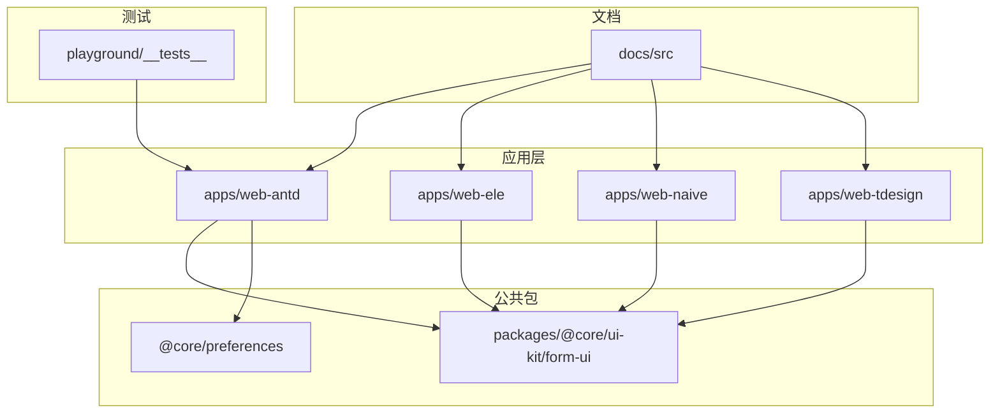
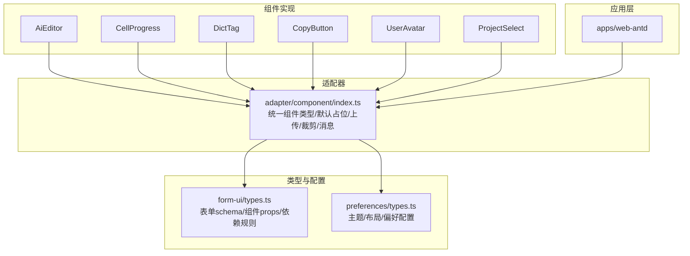
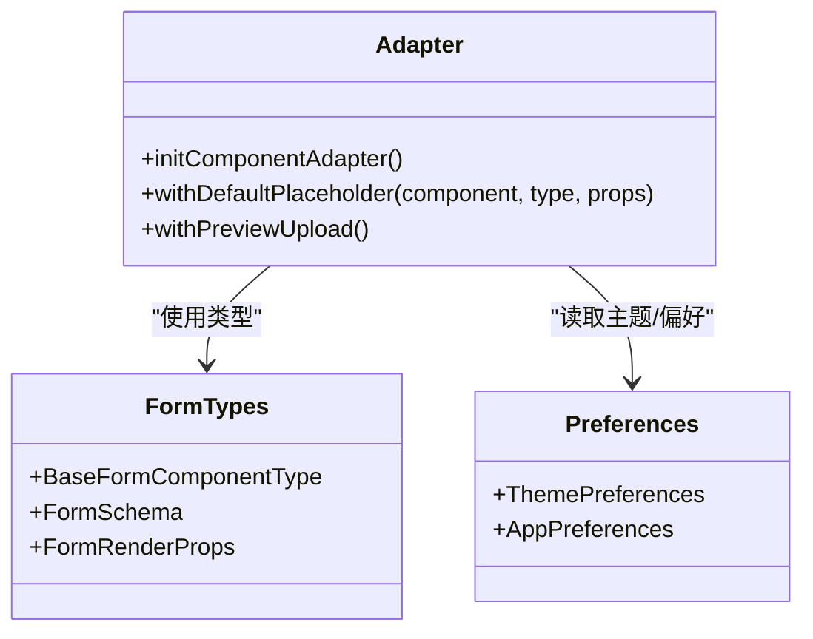
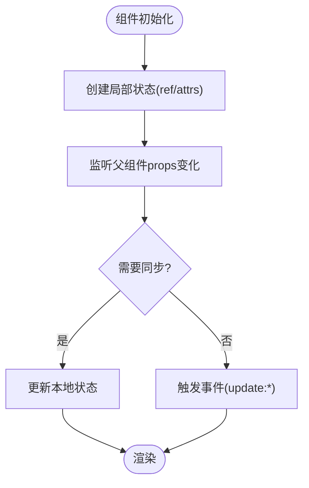
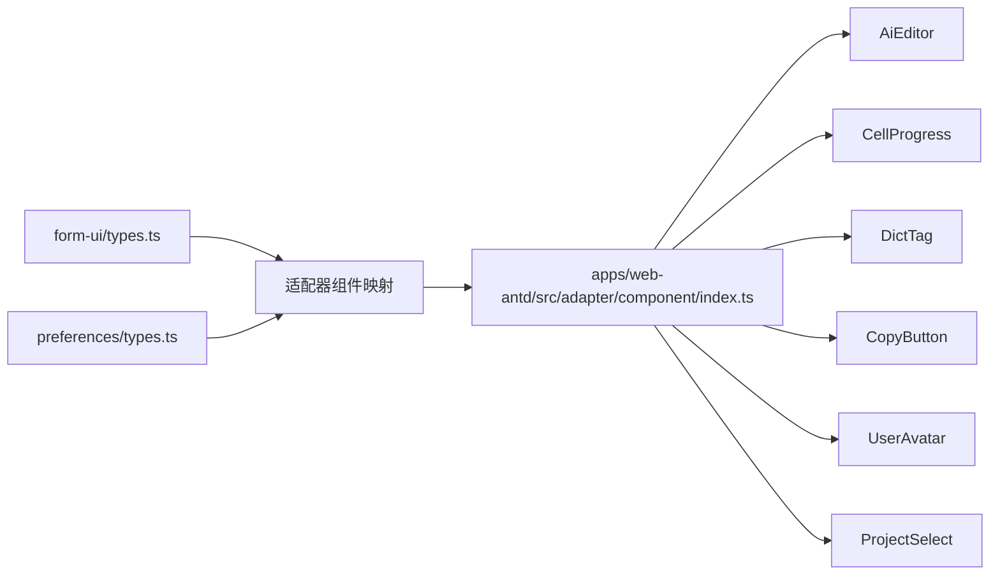

# 自定义组件开发

<cite>
**本文引用的文件**
- [README.md](file://README.md)
- [package.json](file://package.json)
- [apps/web-antd/src/components/AiEditor/index.vue](file://apps/web-antd/src/components/AiEditor/index.vue)
- [apps/web-antd/src/components/CellProgress/index.vue](file://apps/web-antd/src/components/CellProgress/index.vue)
- [apps/web-antd/src/components/DictTag/index.vue](file://apps/web-antd/src/components/DictTag/index.vue)
- [apps/web-antd/src/components/CopyButton/index.vue](file://apps/web-antd/src/components/CopyButton/index.vue)
- [apps/web-antd/src/components/UserAvatar/index.vue](file://apps/web-antd/src/components/UserAvatar/index.vue)
- [apps/web-antd/src/components/dev/ProjectSelect/index.vue](file://apps/web-antd/src/components/dev/ProjectSelect/index.vue)
- [apps/web-antd/src/adapter/component/index.ts](file://apps/web-antd/src/adapter/component/index.ts)
- [packages/@core/ui-kit/form-ui/src/types.ts](file://packages/@core/ui-kit/form-ui/src/types.ts)
- [packages/@core/preferences/src/types.ts](file://packages/@core/preferences/src/types.ts)
- [docs/src/guide/introduction/vben.md](file://docs/src/guide/introduction/vben.md)
- [docs/src/guide/in-depth/ui-framework.md](file://docs/src/guide/in-depth/ui-framework.md)
- [playground/__tests__/e2e/auth-login.spec.ts](file://playground/__tests__/e2e/auth-login.spec.ts)
</cite>

## 目录

1. [简介](#简介)
2. [项目结构](#项目结构)
3. [核心组件](#核心组件)
4. [架构总览](#架构总览)
5. [组件详解](#组件详解)
6. [依赖关系分析](#依赖关系分析)
7. [性能考量](#性能考量)
8. [故障排查指南](#故障排查指南)
9. [结论](#结论)
10. [附录](#附录)

## 简介

本指南面向希望在多UI框架（Ant Design Vue、Element Plus、Naive UI、TDesign等）下开发与适配“自定义组件”的工程师。内容覆盖组件设计原则、架构模式、API设计、适配器开发、状态与数据流、文档规范、示例教程与测试调试方法。文档以仓库现有组件与适配器为蓝本，结合类型系统与UI框架切换能力，给出可落地的实践路径。

## 项目结构

该仓库采用Monorepo组织，核心应用位于apps目录，包含多个UI框架适配版本；组件与适配层集中在各应用的src目录；公共类型与UI Kit位于packages目录；文档位于docs目录；测试位于playground与根目录测试脚本中。

图示来源

- [package.json:1-109](file://package.json#L1-L109)
- [README.md:1-158](file://README.md#L1-L158)

章节来源

- [package.json:1-109](file://package.json#L1-L109)
- [README.md:1-158](file://README.md#L1-L158)

## 核心组件

本节梳理仓库中具有代表性的自定义组件，展示其API设计、事件与插槽使用、默认值与状态管理策略。

- AiEditor（富文本编辑器）
  - 设计要点：封装第三方编辑器实例，暴露编辑器实例；通过v-model双向绑定；支持占位符、工具栏显隐、图片上传、主题切换。
  - 关键API：modelValue、defaultHtml、width、height、placeholder、showToolbar；事件：update:modelValue、update:text；方法：defineExpose暴露实例。
  - 状态管理：本地ref保存编辑器实例；watch同步父组件modelValue；生命周期内挂载/销毁。
  - 参考路径：[AiEditor/index.vue:1-153](file://apps/web-antd/src/components/AiEditor/index.vue#L1-L153)

- CellProgress（表格进度条单元格）
  - 设计要点：接收value，计算百分比与状态，格式化显示。
  - 关键API：value（Number，必填，default:0）；computed计算percent/status/format。
  - 参考路径：[CellProgress/index.vue:1-56](file://apps/web-antd/src/components/CellProgress/index.vue#L1-L56)

- DictTag（字典标签）
  - 设计要点：根据dictType与value查询本地字典，渲染带颜色的标签。
  - 关键API：dictType（String，必填）、value（必填）。
  - 参考路径：[DictTag/index.vue:1-20](file://apps/web-antd/src/components/DictTag/index.vue#L1-L20)

- CopyButton（复制按钮）
  - 设计要点：封装剪贴板能力；支持图标/文本显隐；事件：copy-success、copy-error；defineExpose暴露copy与copied。
  - 关键API：text（必填）、showIcon、showText；事件：copy-success、copy-error。
  - 参考路径：[CopyButton/index.vue:1-75](file://apps/web-antd/src/components/CopyButton/index.vue#L1-L75)

- UserAvatar（用户头像）
  - 设计要点：优先使用传入avatar/name，其次用户store，再其次偏好默认头像；配合Typography文本省略。
  - 关键API：avatar、name。
  - 参考路径：[UserAvatar/index.vue:1-33](file://apps/web-antd/src/components/UserAvatar/index.vue#L1-L33)

- ProjectSelect（项目/版本级联选择）
  - 设计要点：v-model绑定选中值；支持动态追加“添加项目/版本”选项；通过emit向外抛出projectId/versionId与change事件；集成模态弹窗。
  - 关键API：modelValue、showAddVersion、showAddProject；事件：update:projectId、update:versionId、change。
  - 参考路径：[dev/ProjectSelect/index.vue:1-136](file://apps/web-antd/src/components/dev/ProjectSelect/index.vue#L1-L136)

章节来源

- [apps/web-antd/src/components/AiEditor/index.vue:1-153](file://apps/web-antd/src/components/AiEditor/index.vue#L1-L153)
- [apps/web-antd/src/components/CellProgress/index.vue:1-56](file://apps/web-antd/src/components/CellProgress/index.vue#L1-L56)
- [apps/web-antd/src/components/DictTag/index.vue:1-20](file://apps/web-antd/src/components/DictTag/index.vue#L1-L20)
- [apps/web-antd/src/components/CopyButton/index.vue:1-75](file://apps/web-antd/src/components/CopyButton/index.vue#L1-L75)
- [apps/web-antd/src/components/UserAvatar/index.vue:1-33](file://apps/web-antd/src/components/UserAvatar/index.vue#L1-L33)
- [apps/web-antd/src/components/dev/ProjectSelect/index.vue:1-136](file://apps/web-antd/src/components/dev/ProjectSelect/index.vue#L1-L136)

## 架构总览

组件开发围绕“组件实现 + 适配器 + 类型约束 + 状态/数据流 + 文档与测试”五条主线展开。UI框架切换通过apps下的多应用实现，组件适配器负责统一组件类型、默认占位、上传预览与裁剪、消息提示等横切能力。

图示来源

- [apps/web-antd/src/adapter/component/index.ts:1-608](file://apps/web-antd/src/adapter/component/index.ts#L1-L608)
- [packages/@core/ui-kit/form-ui/src/types.ts:1-465](file://packages/@core/ui-kit/form-ui/src/types.ts#L1-L465)
- [packages/@core/preferences/src/types.ts:1-349](file://packages/@core/preferences/src/types.ts#L1-L349)

## 组件详解

### 组件分类与命名规范

- 分类维度
  - 业务组件：如AiEditor、ProjectSelect、UserAvatar等，承载具体业务能力。
  - 展示组件：如CellProgress、DictTag，专注呈现与格式化。
  - 交互组件：如CopyButton，封装常用交互行为。
- 命名规范
  - 文件夹与组件名采用帕斯卡命名，组件文件统一index.vue。
  - 目录结构：apps/web-{ui}/src/components/<组件名>/index.vue。
- 示例参考
  - [AiEditor/index.vue:1-153](file://apps/web-antd/src/components/AiEditor/index.vue#L1-L153)
  - [CellProgress/index.vue:1-56](file://apps/web-antd/src/components/CellProgress/index.vue#L1-L56)
  - [DictTag/index.vue:1-20](file://apps/web-antd/src/components/DictTag/index.vue#L1-L20)
  - [CopyButton/index.vue:1-75](file://apps/web-antd/src/components/CopyButton/index.vue#L1-L75)
  - [UserAvatar/index.vue:1-33](file://apps/web-antd/src/components/UserAvatar/index.vue#L1-L33)
  - [dev/ProjectSelect/index.vue:1-136](file://apps/web-antd/src/components/dev/ProjectSelect/index.vue#L1-L136)

章节来源

- [apps/web-antd/src/components/AiEditor/index.vue:1-153](file://apps/web-antd/src/components/AiEditor/index.vue#L1-L153)
- [apps/web-antd/src/components/CellProgress/index.vue:1-56](file://apps/web-antd/src/components/CellProgress/index.vue#L1-L56)
- [apps/web-antd/src/components/DictTag/index.vue:1-20](file://apps/web-antd/src/components/DictTag/index.vue#L1-L20)
- [apps/web-antd/src/components/CopyButton/index.vue:1-75](file://apps/web-antd/src/components/CopyButton/index.vue#L1-L75)
- [apps/web-antd/src/components/UserAvatar/index.vue:1-33](file://apps/web-antd/src/components/UserAvatar/index.vue#L1-L33)
- [apps/web-antd/src/components/dev/ProjectSelect/index.vue:1-136](file://apps/web-antd/src/components/dev/ProjectSelect/index.vue#L1-L136)

### 组件API设计

- props定义
  - 必填/可选/默认值：明确required/default；复杂类型建议提供默认值或withDefaults。
  - 示例：CellProgress的value默认0；DictTag的dictType/value必填；CopyButton的showIcon/showText默认true。
- 事件处理
  - v-model：AiEditor通过update:modelValue与update:text实现双向绑定；ProjectSelect通过update:projectId/update:versionId向外抛出。
  - 自定义事件：CopyButton提供copy-success/copy-error；ProjectSelect提供change。
- 插槽使用
  - 适配器中的Upload组件通过slots渲染默认上传按钮，支持禁用态与无插槽时的占位渲染。
- 默认值与占位
  - 适配器提供withDefaultPlaceholder高阶组件，自动注入placeholder，提升一致性与可用性。

章节来源

- [apps/web-antd/src/components/CellProgress/index.vue:24-52](file://apps/web-antd/src/components/CellProgress/index.vue#L24-L52)
- [apps/web-antd/src/components/DictTag/index.vue:5-15](file://apps/web-antd/src/components/DictTag/index.vue#L5-L15)
- [apps/web-antd/src/components/CopyButton/index.vue:9-64](file://apps/web-antd/src/components/CopyButton/index.vue#L9-L64)
- [apps/web-antd/src/components/AiEditor/index.vue:14-35](file://apps/web-antd/src/components/AiEditor/index.vue#L14-L35)
- [apps/web-antd/src/components/dev/ProjectSelect/index.vue:19-27](file://apps/web-antd/src/components/dev/ProjectSelect/index.vue#L19-L27)
- [apps/web-antd/src/adapter/component/index.ts:103-135](file://apps/web-antd/src/adapter/component/index.ts#L103-L135)

### 组件适配器开发

- 目标
  - 统一组件类型（ComponentType）；为表单/弹窗/抽屉等容器组件提供一致的组件映射与行为。
  - 提供横切能力：默认占位、上传预览与裁剪、消息提示、按钮类型别名等。
- 关键实现
  - 组件映射：将BaseFormComponentType与具体UI库组件绑定，如Input、Select、Upload等。
  - withDefaultPlaceholder：为输入类组件注入默认placeholder。
  - withPreviewUpload：增强Upload组件，支持裁剪、预览、尺寸校验、v-model同步。
  - 全局消息：通过globalShareState.defineMessage统一消息提示风格。
- UI框架兼容性
  - 通过apps/web-{ui}分别引入对应UI库组件；适配器集中管理，便于切换与复用。
- 主题适配
  - 读取preferences/theme与isDark，驱动组件主题切换（如AiEditor）。

图示来源

- [apps/web-antd/src/adapter/component/index.ts:526-608](file://apps/web-antd/src/adapter/component/index.ts#L526-L608)
- [packages/@core/ui-kit/form-ui/src/types.ts:13-268](file://packages/@core/ui-kit/form-ui/src/types.ts#L13-L268)
- [packages/@core/preferences/src/types.ts:296-349](file://packages/@core/preferences/src/types.ts#L296-L349)

章节来源

- [apps/web-antd/src/adapter/component/index.ts:1-608](file://apps/web-antd/src/adapter/component/index.ts#L1-L608)
- [packages/@core/ui-kit/form-ui/src/types.ts:1-465](file://packages/@core/ui-kit/form-ui/src/types.ts#L1-L465)
- [packages/@core/preferences/src/types.ts:1-349](file://packages/@core/preferences/src/types.ts#L1-L349)

### 组件状态管理与数据流

- 局部状态
  - AiEditor：通过ref保存实例，watch同步父组件modelValue；生命周期内挂载/销毁。
  - CopyButton：通过useClipboard钩子管理copied状态；通过defineExpose暴露copy/copied。
- 全局状态
  - preferences：读取主题、语言、布局等全局偏好；UserAvatar优先使用用户store与偏好默认头像。
- 外部状态
  - 表单场景：通过FormSchema与FormRenderProps定义字段、依赖、规则与事件；适配器统一组件映射与v-model事件绑定。
- 数据流示意

图示来源

- [apps/web-antd/src/components/AiEditor/index.vue:120-128](file://apps/web-antd/src/components/AiEditor/index.vue#L120-L128)
- [apps/web-antd/src/components/CopyButton/index.vue:46-64](file://apps/web-antd/src/components/CopyButton/index.vue#L46-L64)
- [apps/web-antd/src/components/UserAvatar/index.vue:1-33](file://apps/web-antd/src/components/UserAvatar/index.vue#L1-L33)
- [packages/@core/ui-kit/form-ui/src/types.ts:241-342](file://packages/@core/ui-kit/form-ui/src/types.ts#L241-L342)

章节来源

- [apps/web-antd/src/components/AiEditor/index.vue:1-153](file://apps/web-antd/src/components/AiEditor/index.vue#L1-L153)
- [apps/web-antd/src/components/CopyButton/index.vue:1-75](file://apps/web-antd/src/components/CopyButton/index.vue#L1-L75)
- [apps/web-antd/src/components/UserAvatar/index.vue:1-33](file://apps/web-antd/src/components/UserAvatar/index.vue#L1-L33)
- [packages/@core/ui-kit/form-ui/src/types.ts:1-465](file://packages/@core/ui-kit/form-ui/src/types.ts#L1-L465)

### 组件文档编写规范与模板

- 文档定位
  - docs/src/components 下收录组件级文档；docs/src/guide 提供架构与使用指南。
- 规范要点
  - 组件概览、安装/导入、API参考（props/events/slots）、使用示例、注意事项、变更日志。
  - 示例应覆盖基础用法、高级用法、与表单联动、与适配器集成等。
- 参考文档
  - [docs/src/guide/introduction/vben.md:1-50](file://docs/src/guide/introduction/vben.md#L1-L50)
  - [docs/src/guide/in-depth/ui-framework.md:1-18](file://docs/src/guide/in-depth/ui-framework.md#L1-L18)

章节来源

- [docs/src/guide/introduction/vben.md:1-50](file://docs/src/guide/introduction/vben.md#L1-L50)
- [docs/src/guide/in-depth/ui-framework.md:1-18](file://docs/src/guide/in-depth/ui-framework.md#L1-L18)

### 实际开发示例（从简单到复杂）

#### 示例一：创建一个展示型组件（DictTag）

- 目标：根据字典类型与值渲染带颜色的标签。
- 步骤
  - 定义props：dictType（必填）、value（必填）。
  - 计算字典行：getLocalDictRow(dictType, value)。
  - 渲染：a-tag + color/label。
- 参考路径
  - [DictTag/index.vue:1-20](file://apps/web-antd/src/components/DictTag/index.vue#L1-L20)

章节来源

- [apps/web-antd/src/components/DictTag/index.vue:1-20](file://apps/web-antd/src/components/DictTag/index.vue#L1-L20)

#### 示例二：创建一个交互型组件（CopyButton）

- 目标：封装复制到剪贴板能力，支持图标/文本显隐与事件反馈。
- 步骤
  - 定义props：text（必填）、showIcon、showText。
  - 使用useClipboard：copy/copied。
  - 定义事件：copy-success、copy-error。
  - defineExpose：暴露copy与copied。
- 参考路径
  - [CopyButton/index.vue:1-75](file://apps/web-antd/src/components/CopyButton/index.vue#L1-L75)

章节来源

- [apps/web-antd/src/components/CopyButton/index.vue:1-75](file://apps/web-antd/src/components/CopyButton/index.vue#L1-L75)

#### 示例三：创建一个业务型组件（AiEditor）

- 目标：封装第三方富文本编辑器，支持占位符、工具栏、图片上传、主题切换与双向绑定。
- 步骤
  - 引入第三方库与样式；defineEmits触发update:modelValue与update:text。
  - defineProps：modelValue、defaultHtml、width、height、placeholder、showToolbar。
  - 生命周期：onMounted创建实例，onUnmounted销毁；watch同步父组件值。
  - defineExpose：暴露实例。
- 参考路径
  - [AiEditor/index.vue:1-153](file://apps/web-antd/src/components/AiEditor/index.vue#L1-L153)

章节来源

- [apps/web-antd/src/components/AiEditor/index.vue:1-153](file://apps/web-antd/src/components/AiEditor/index.vue#L1-L153)

#### 示例四：创建一个容器联动组件（ProjectSelect）

- 目标：级联选择项目与版本，支持动态添加项目/版本并弹窗联动。
- 步骤
  - 定义props：modelValue、showAddVersion、showAddProject。
  - 定义emit：update:projectId、update:versionId、change。
  - 使用useVbenModal集成模态弹窗；在onClosed后重新初始化数据。
- 参考路径
  - [dev/ProjectSelect/index.vue:1-136](file://apps/web-antd/src/components/dev/ProjectSelect/index.vue#L1-L136)

章节来源

- [apps/web-antd/src/components/dev/ProjectSelect/index.vue:1-136](file://apps/web-antd/src/components/dev/ProjectSelect/index.vue#L1-L136)

### 组件测试与调试

- 单元测试
  - 使用Vitest运行单元测试，脚本见package.json。
- 端到端测试
  - 使用Playwright，示例：auth-login.spec.ts。
- 调试建议
  - 组件事件：通过控制台输出与事件监听确认update:\*是否正确触发。
  - 适配器行为：检查默认占位、上传裁剪、预览是否按预期工作。
  - UI框架切换：确保apps/web-{ui}中组件映射与适配器一致。

章节来源

- [package.json:61-62](file://package.json#L61-L62)
- [playground/**tests**/e2e/auth-login.spec.ts:1-21](file://playground/__tests__/e2e/auth-login.spec.ts#L1-L21)

## 依赖关系分析

图示来源

- [packages/@core/ui-kit/form-ui/src/types.ts:1-465](file://packages/@core/ui-kit/form-ui/src/types.ts#L1-L465)
- [packages/@core/preferences/src/types.ts:1-349](file://packages/@core/preferences/src/types.ts#L1-L349)
- [apps/web-antd/src/adapter/component/index.ts:1-608](file://apps/web-antd/src/adapter/component/index.ts#L1-L608)

章节来源

- [packages/@core/ui-kit/form-ui/src/types.ts:1-465](file://packages/@core/ui-kit/form-ui/src/types.ts#L1-L465)
- [packages/@core/preferences/src/types.ts:1-349](file://packages/@core/preferences/src/types.ts#L1-L349)
- [apps/web-antd/src/adapter/component/index.ts:1-608](file://apps/web-antd/src/adapter/component/index.ts#L1-L608)

## 性能考量

- 组件懒加载：适配器中大量组件采用defineAsyncComponent异步加载，降低首屏体积。
- 事件监听优化：表单场景可通过FormCommonConfig禁用不必要的input/change监听，减少抖动。
- 上传与预览：图片预览与裁剪采用延迟清理与URL revoke，避免内存泄漏。
- 主题切换：通过preferences与isDark即时切换，避免重复渲染。

## 故障排查指南

- 事件未触发
  - 检查组件是否正确发出update:\*事件；确认父组件是否监听v-model或对应事件。
- 上传异常
  - 确认beforeUpload返回值与fileList过滤逻辑；检查裁剪流程与错误提示。
- 主题不生效
  - 确认preferences/theme与组件主题映射一致；检查isDark状态变化。
- UI框架切换后组件缺失
  - 检查apps/web-{ui}中组件映射与适配器是否一致；确认依赖与样式引入。

章节来源

- [apps/web-antd/src/adapter/component/index.ts:400-447](file://apps/web-antd/src/adapter/component/index.ts#L400-L447)
- [apps/web-antd/src/components/AiEditor/index.vue:107-111](file://apps/web-antd/src/components/AiEditor/index.vue#L107-L111)
- [docs/src/guide/in-depth/ui-framework.md:1-18](file://docs/src/guide/in-depth/ui-framework.md#L1-L18)

## 结论

本指南基于仓库现有组件与适配器，总结了自定义组件开发的设计原则、API设计、适配器模式、状态与数据流、文档与测试方法。遵循组件分类与命名规范、统一的适配器接口与类型约束，可在多UI框架间平滑迁移与复用，提升团队开发效率与一致性。

## 附录

- UI框架切换指南
  - 参考：[docs/src/guide/in-depth/ui-framework.md:1-18](file://docs/src/guide/in-depth/ui-framework.md#L1-L18)
- 项目特性与浏览器支持
  - 参考：[docs/src/guide/introduction/vben.md:1-50](file://docs/src/guide/introduction/vben.md#L1-L50)
  - 参考：[README.md:115-124](file://README.md#L115-L124)
