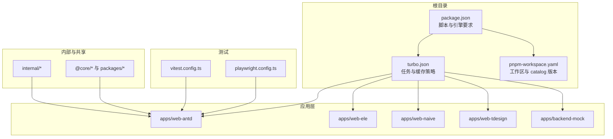
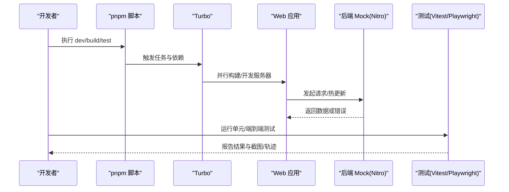
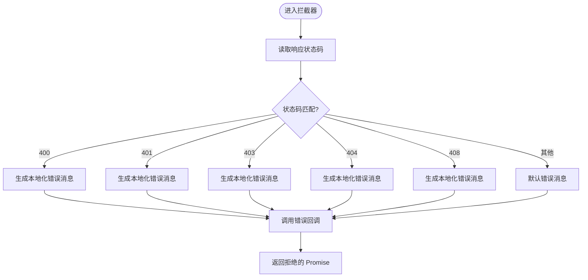
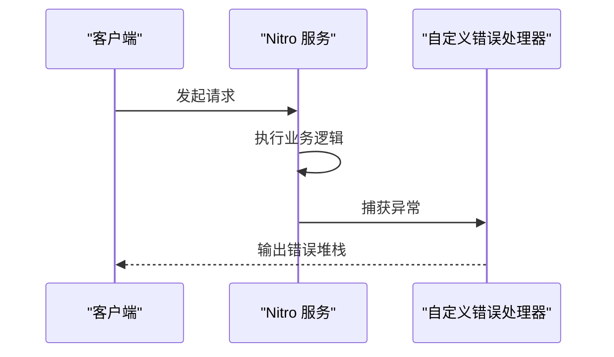
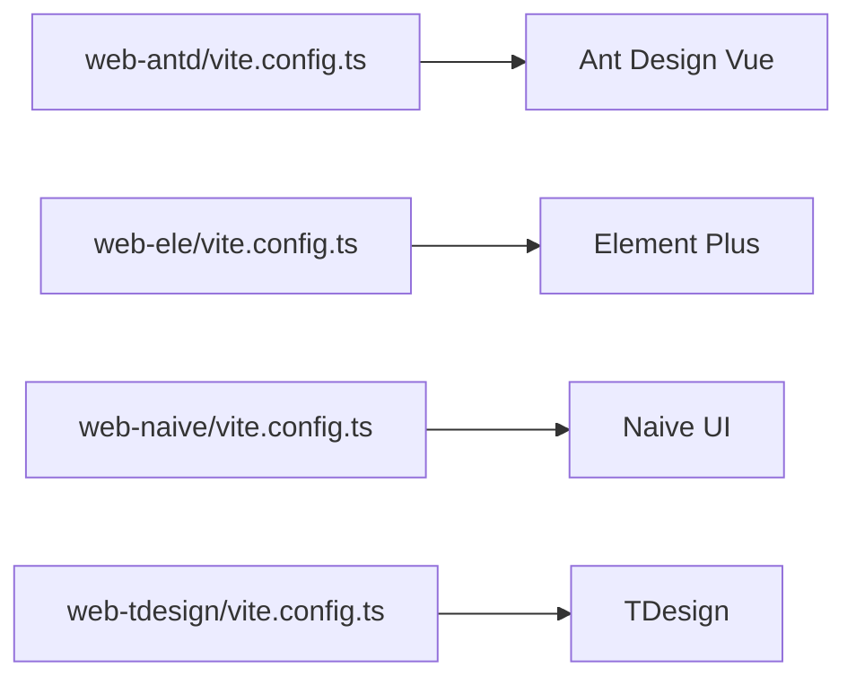
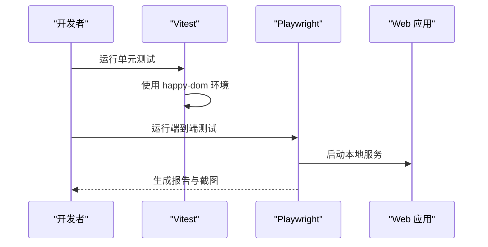
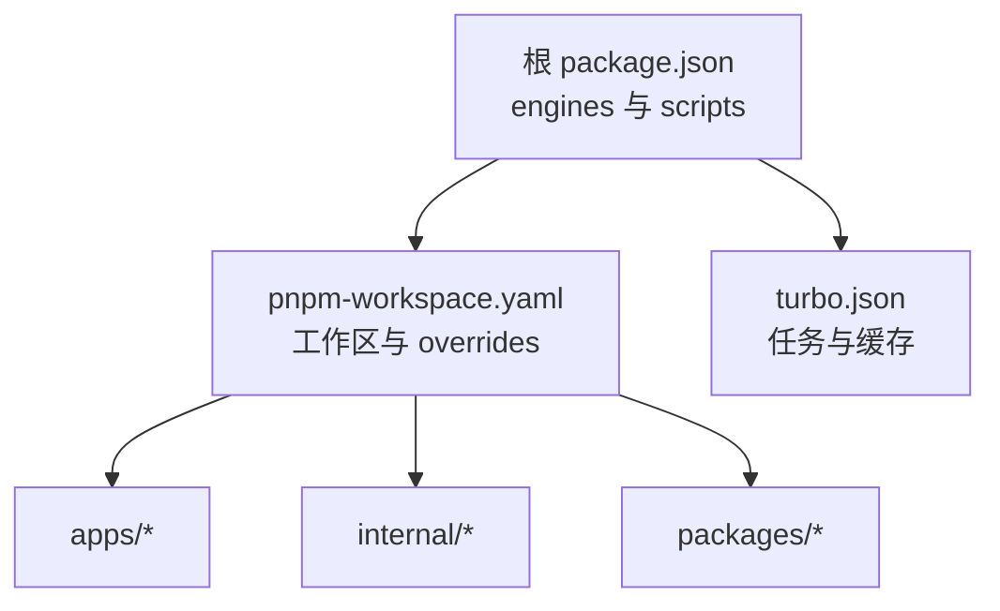

# 故障排除

<cite>
**本文引用的文件**
- [package.json](file://package.json)
- [README.md](file://README.md)
- [turbo.json](file://turbo.json)
- [pnpm-workspace.yaml](file://pnpm-workspace.yaml)
- [vitest.config.ts](file://vitest.config.ts)
- [playwright.config.ts](file://playwright.config.ts)
- [apps/backend-mock/error.ts](file://apps/backend-mock/error.ts)
- [apps/backend-mock/nitro.config.ts](file://apps/backend-mock/nitro.config.ts)
- [apps/web-antd/vite.config.ts](file://apps/web-antd/vite.config.ts)
- [apps/web-ele/vite.config.ts](file://apps/web-ele/vite.config.ts)
- [apps/web-naive/vite.config.ts](file://apps/web-naive/vite.config.ts)
- [apps/web-tdesign/vite.config.ts](file://apps/web-tdesign/vite.config.ts)
- [packages/effects/request/src/request-client/preset-interceptors.ts](file://packages/effects/request/src/request-client/preset-interceptors.ts)
- [packages/@core/base/shared/src/utils/to.ts](file://packages/@core/base/shared/src/utils/to.ts)
- [docs/src/en/guide/essentials/development.md](file://docs/src/en/guide/essentials/development.md)
</cite>

## 目录
1. [简介](#简介)
2. [项目结构](#项目结构)
3. [核心组件](#核心组件)
4. [架构总览](#架构总览)
5. [详细组件分析](#详细组件分析)
6. [依赖分析](#依赖分析)
7. [性能考虑](#性能考虑)
8. [故障排除指南](#故障排除指南)
9. [结论](#结论)
10. [附录](#附录)

## 简介
本指南面向使用 Vben Admin 的开发者与运维人员，聚焦于安装、构建、运行时异常、日志与错误追踪、环境配置、性能诊断与优化、社区支持与预防性维护等主题。文档结合仓库中的脚本、配置与示例，提供可操作的排障步骤与最佳实践。

## 项目结构
Vben Admin 采用多包工作区（pnpm workspaces）组织，根目录提供统一的开发、构建与测试脚本；各 Web 应用位于 apps 下，分别对应不同 UI 框架；内部工具与共享能力位于 internal 与 packages；测试框架包含 Vitest 单元测试与 Playwright E2E 测试；后端 Mock 使用 Nitro。

图表来源
- [package.json:1-109](file://package.json#L1-L109)
- [turbo.json:1-49](file://turbo.json#L1-L49)
- [pnpm-workspace.yaml:1-193](file://pnpm-workspace.yaml#L1-L193)

章节来源
- [package.json:1-109](file://package.json#L1-L109)
- [turbo.json:1-49](file://turbo.json#L1-L49)
- [pnpm-workspace.yaml:1-193](file://pnpm-workspace.yaml#L1-L193)

## 核心组件
- 开发与构建：通过根脚本与 Turbo 实现多包并行构建与缓存；内存上限参数用于大项目构建稳定性。
- 测试：Vitest 使用 happy-dom 环境；Playwright 配置了 Chromium 设备集与本地服务启动。
- 请求拦截与错误提示：统一 HTTP 错误码映射与错误消息生成。
- 后端 Mock：Nitro 错误处理器输出堆栈信息。
- UI 框架：多套 Web 应用分别基于 Ant Design Vue、Element Plus、Naive UI、TDesign。

章节来源
- [package.json:27-66](file://package.json#L27-L66)
- [vitest.config.ts:1-29](file://vitest.config.ts#L1-L29)
- [playwright.config.ts:1-109](file://playwright.config.ts#L1-L109)
- [packages/effects/request/src/request-client/preset-interceptors.ts:133-165](file://packages/effects/request/src/request-client/preset-interceptors.ts#L133-L165)
- [apps/backend-mock/error.ts:1-8](file://apps/backend-mock/error.ts#L1-L8)

## 架构总览
下图展示从开发到构建、测试与运行的整体流程，以及关键错误处理点。

图表来源
- [package.json:27-66](file://package.json#L27-L66)
- [turbo.json:15-46](file://turbo.json#L15-L46)
- [playwright.config.ts:97-106](file://playwright.config.ts#L97-L106)

## 详细组件分析

### 组件一：请求拦截与错误处理
- 统一处理 HTTP 状态码映射，生成本地化错误消息。
- 提供可扩展的错误回调钩子，便于业务侧自定义处理。

图表来源
- [packages/effects/request/src/request-client/preset-interceptors.ts:133-165](file://packages/effects/request/src/request-client/preset-interceptors.ts#L133-L165)

章节来源
- [packages/effects/request/src/request-client/preset-interceptors.ts:133-165](file://packages/effects/request/src/request-client/preset-interceptors.ts#L133-L165)

### 组件二：后端 Mock 错误处理
- Nitro 自定义错误处理器在服务端异常时输出堆栈，便于快速定位问题。

图表来源
- [apps/backend-mock/error.ts:1-8](file://apps/backend-mock/error.ts#L1-L8)

章节来源
- [apps/backend-mock/error.ts:1-8](file://apps/backend-mock/error.ts#L1-L8)

### 组件三：UI 框架相关 Vite 配置
- 各 Web 应用均提供独立的 Vite 配置文件，用于适配不同 UI 框架的构建与开发体验。

图表来源
- [apps/web-antd/vite.config.ts](file://apps/web-antd/vite.config.ts)
- [apps/web-ele/vite.config.ts](file://apps/web-ele/vite.config.ts)
- [apps/web-naive/vite.config.ts](file://apps/web-naive/vite.config.ts)
- [apps/web-tdesign/vite.config.ts](file://apps/web-tdesign/vite.config.ts)

章节来源
- [apps/web-antd/vite.config.ts](file://apps/web-antd/vite.config.ts)
- [apps/web-ele/vite.config.ts](file://apps/web-ele/vite.config.ts)
- [apps/web-naive/vite.config.ts](file://apps/web-naive/vite.config.ts)
- [apps/web-tdesign/vite.config.ts](file://apps/web-tdesign/vite.config.ts)

### 组件四：测试配置与运行
- Vitest 使用 happy-dom 环境，禁用脚本加载安全策略以兼容测试行为。
- Playwright 配置了 Chromium 设备集、报告器、重试策略与本地服务启动命令。

图表来源
- [vitest.config.ts:1-29](file://vitest.config.ts#L1-L29)
- [playwright.config.ts:1-109](file://playwright.config.ts#L1-L109)

章节来源
- [vitest.config.ts:1-29](file://vitest.config.ts#L1-L29)
- [playwright.config.ts:1-109](file://playwright.config.ts#L1-L109)

## 依赖分析
- 引擎与包管理器：根工程声明 Node 与 pnpm 版本范围，确保跨平台一致性。
- 工作区与 catalog：统一依赖版本，减少冲突与升级成本。
- Turbo 任务：定义构建、预览、分析、类型检查等任务与缓存策略。

图表来源
- [package.json:103-107](file://package.json#L103-L107)
- [pnpm-workspace.yaml:1-193](file://pnpm-workspace.yaml#L1-L193)
- [turbo.json:14-46](file://turbo.json#L14-L46)

章节来源
- [package.json:103-107](file://package.json#L103-L107)
- [pnpm-workspace.yaml:1-193](file://pnpm-workspace.yaml#L1-L193)
- [turbo.json:14-46](file://turbo.json#L14-L46)

## 性能考虑
- 构建内存上限：通过环境变量提升 V8 堆上限，缓解大型项目的 OOM 风险。
- 并行与缓存：Turbo 任务依赖与输出缓存显著缩短重复构建时间。
- 测试环境：happy-dom 与 Playwright 的合理配置降低测试开销与失败率。

章节来源
- [package.json:28](file://package.json#L28)
- [turbo.json:15-46](file://turbo.json#L15-L46)
- [vitest.config.ts:8-17](file://vitest.config.ts#L8-L17)

## 故障排除指南

### 一、安装与环境问题
- Node.js 版本不匹配
  - 现象：安装或构建报错，提示引擎版本不满足。
  - 排查：确认 Node 版本是否在根工程 engines 范围内。
  - 处理：升级/切换 Node 版本至满足要求。
  
  章节来源
  - [package.json:103-107](file://package.json#L103-L107)

- 包管理器不一致
  - 现象：安装失败、锁文件冲突或依赖解析异常。
  - 排查：核对 packageManager 字段与实际使用的包管理器。
  - 处理：按根工程要求使用指定版本的 pnpm，并避免混用 npm/yarn。
  
  章节来源
  - [package.json:107](file://package.json#L107)

- 依赖安装失败（网络/权限）
  - 现象：依赖下载超时、权限不足。
  - 处理：更换镜像源、检查代理设置、使用管理员权限或修复本地缓存。
  - 参考：根脚本中包含清理与重装命令，可用于恢复环境。
  
  章节来源
  - [package.json:43-60](file://package.json#L43-L60)

- 工作区包未被识别
  - 现象：本地包无法解析或构建失败。
  - 处理：确认 pnpm-workspace.yaml 中包路径正确，执行一次性安装后再尝试。
  
  章节来源
  - [pnpm-workspace.yaml:1-193](file://pnpm-workspace.yaml#L1-L193)

### 二、构建错误
- 构建内存不足（OOM）
  - 现象：构建过程中内存耗尽导致失败。
  - 处理：使用根脚本中设置的内存上限参数；必要时分包构建或关闭不必要的功能。
  
  章节来源
  - [package.json:28](file://package.json#L28)

- Turbo 缓存/任务依赖问题
  - 现象：构建卡住、产物缺失或缓存污染。
  - 处理：清理缓存、重置任务依赖或临时禁用持久化任务。
  
  章节来源
  - [turbo.json:14-46](file://turbo.json#L14-L46)

- UI 框架相关构建失败
  - 现象：特定 UI 应用构建报错。
  - 处理：检查对应 vite.config.ts 是否存在语法错误或插件冲突；回退到稳定版本依赖。
  
  章节来源
  - [apps/web-antd/vite.config.ts](file://apps/web-antd/vite.config.ts)
  - [apps/web-ele/vite.config.ts](file://apps/web-ele/vite.config.ts)
  - [apps/web-naive/vite.config.ts](file://apps/web-naive/vite.config.ts)
  - [apps/web-tdesign/vite.config.ts](file://apps/web-tdesign/vite.config.ts)

### 三、运行时异常
- 页面空白或白屏
  - 排查：查看浏览器控制台错误；检查路由守卫与权限配置。
  - 处理：根据错误定位到具体模块，逐步缩小范围。

- 请求失败与状态码异常
  - 现象：接口返回 401/403/404 等。
  - 排查：检查拦截器中的状态码映射与本地化消息生成逻辑。
  - 处理：在业务层补充自定义错误处理或刷新令牌逻辑。
  
  章节来源
  - [packages/effects/request/src/request-client/preset-interceptors.ts:133-165](file://packages/effects/request/src/request-client/preset-interceptors.ts#L133-L165)

- 后端 Mock 异常
  - 现象：服务端抛出异常且无明确错误信息。
  - 排查：确认 Nitro 错误处理器已启用并生效。
  - 处理：在开发环境开启更详细的日志记录，定位异常堆栈。
  
  章节来源
  - [apps/backend-mock/error.ts:1-8](file://apps/backend-mock/error.ts#L1-L8)
  - [apps/backend-mock/nitro.config.ts](file://apps/backend-mock/nitro.config.ts)

### 四、调试技巧与工具
- 浏览器开发者工具
  - 使用 Elements/Console/Network/Performance 面板定位样式、脚本与网络问题。
  - 在 Network 面板筛选 XHR/Fetch，观察请求头、响应体与状态码。
  
- Vue DevTools
  - 在开发环境启用内置 DevTools 插件，观察组件树、状态与事件流。
  
  章节来源
  - [docs/src/en/guide/essentials/development.md:248-256](file://docs/src/en/guide/essentials/development.md#L248-L256)

- 性能分析
  - 使用 Performance 面板录制渲染与交互过程，关注长任务与重绘。
  - 结合构建分析（如可视化分析任务）定位打包体积热点。

- 单元测试与端到端测试
  - 单测：使用 Vitest，注意 happy-dom 环境下的脚本加载行为。
  - 端到端：使用 Playwright，关注设备集、超时与重试策略。
  
  章节来源
  - [vitest.config.ts:1-29](file://vitest.config.ts#L1-L29)
  - [playwright.config.ts:1-109](file://playwright.config.ts#L1-L109)

### 五、日志分析与错误追踪
- 前端错误监控
  - 建议：在业务层封装统一的错误上报函数，结合拦截器与全局异常捕获。
  - 参考：拦截器中已提供错误回调钩子，可在此处接入上报。
  
  章节来源
  - [packages/effects/request/src/request-client/preset-interceptors.ts:133-165](file://packages/effects/request/src/request-client/preset-interceptors.ts#L133-L165)

- 后端日志分析
  - 建议：在 Nitro 层增加结构化日志输出，区分请求链路 ID 与错误上下文。
  - 当前：错误处理器会输出堆栈，可在开发阶段配合更详细的日志库使用。
  
  章节来源
  - [apps/backend-mock/error.ts:1-8](file://apps/backend-mock/error.ts#L1-L8)

### 六、环境配置问题排查
- Node.js 版本
  - 使用根工程声明的版本范围，避免与系统默认版本冲突。
  
  章节来源
  - [package.json:103-107](file://package.json#L103-L107)

- 包管理器与工作区
  - 使用 pnpm 并遵循工作区配置；如遇依赖冲突，优先使用 catalog 版本。
  
  章节来源
  - [package.json:107](file://package.json#L107)
  - [pnpm-workspace.yaml:16-193](file://pnpm-workspace.yaml#L16-L193)

- 系统依赖与浏览器
  - 推荐现代浏览器进行开发；若出现兼容性问题，检查 polyfill 与转译配置。
  
  章节来源
  - [README.md:115-124](file://README.md#L115-L124)

### 七、性能问题诊断与优化
- 构建性能
  - 使用 Turbo 任务与缓存；拆分大包、按需引入第三方库。
  - 关注构建分析报告，识别体积热点与重复依赖。
  
  章节来源
  - [turbo.json:15-46](file://turbo.json#L15-L46)

- 运行时性能
  - 减少不必要的响应式计算与深层监听；使用虚拟滚动与懒加载。
  - 利用浏览器性能面板定位长任务与布局抖动。

### 八、实际故障案例与解决步骤
- 案例一：构建 OOM
  - 症状：构建中途失败，提示内存不足。
  - 步骤：使用根脚本中的内存上限参数；分包构建；关闭非必要功能。
  
  章节来源
  - [package.json:28](file://package.json#L28)

- 案例二：401 未授权频繁弹窗
  - 症状：登录后频繁弹出未授权提示。
  - 步骤：检查拦截器状态码映射与令牌刷新逻辑；确认后端返回的认证头是否正确。
  
  章节来源
  - [packages/effects/request/src/request-client/preset-interceptors.ts:133-165](file://packages/effects/request/src/request-client/preset-interceptors.ts#L133-L165)

- 案例三：Mock 服务异常无栈信息
  - 症状：接口报错但无堆栈。
  - 步骤：确认 Nitro 错误处理器已启用；在开发环境增加结构化日志。
  
  章节来源
  - [apps/backend-mock/error.ts:1-8](file://apps/backend-mock/error.ts#L1-L8)

### 九、社区支持与问题反馈
- 文档与路线图：参考项目文档与路线图页面。
- 讨论区：使用 GitHub Discussions 进行交流。
- 提交 Issue：遵循贡献指南与提交规范。
  
章节来源
- [README.md:51-54](file://README.md#L51-L54)
- [README.md:87-114](file://README.md#L87-L114)
- [README.md:151-154](file://README.md#L151-L154)

### 十、预防性维护与健康检查
- 定期更新依赖：使用根脚本中的依赖更新命令，保持与 catalog 同步。
- 类型检查与格式化：在 CI 中执行类型检查与代码格式化，防止回归。
- 健康检查清单
  - Node/pnpm 版本校验
  - 依赖安装与锁文件一致性
  - 构建缓存清理与重建
  - 单元测试与端到端测试通过率
  - 日志与错误监控可用性
  
章节来源
- [package.json:42-60](file://package.json#L42-L60)
- [vitest.config.ts:1-29](file://vitest.config.ts#L1-L29)
- [playwright.config.ts:1-109](file://playwright.config.ts#L1-L109)

## 结论
通过根工程的统一脚本、Turbo 的任务编排、完善的测试与错误处理机制，Vben Admin 在安装、构建与运行阶段提供了较强的可维护性。建议在日常开发中结合本文提供的排障步骤与工具，建立标准化的调试与性能优化流程，持续提升交付质量与稳定性。

## 附录
- 快速命令索引
  - 开发：根脚本提供多应用开发入口与统一 dev 命令。
  - 构建：根脚本与 Turbo 任务组合实现多包并行构建。
  - 测试：单测与端到端测试配置清晰，便于集成到 CI。
  
章节来源
- [package.json:27-66](file://package.json#L27-L66)
- [turbo.json:15-46](file://turbo.json#L15-L46)
- [vitest.config.ts:1-29](file://vitest.config.ts#L1-L29)
- [playwright.config.ts:1-109](file://playwright.config.ts#L1-L109)