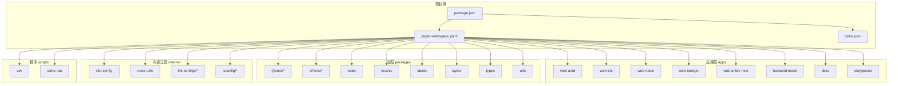
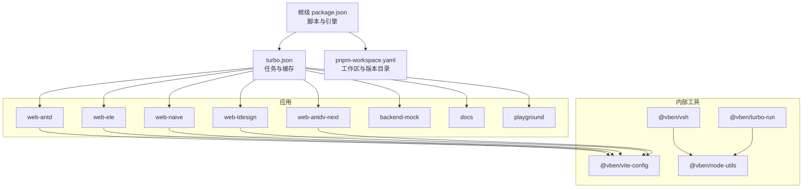
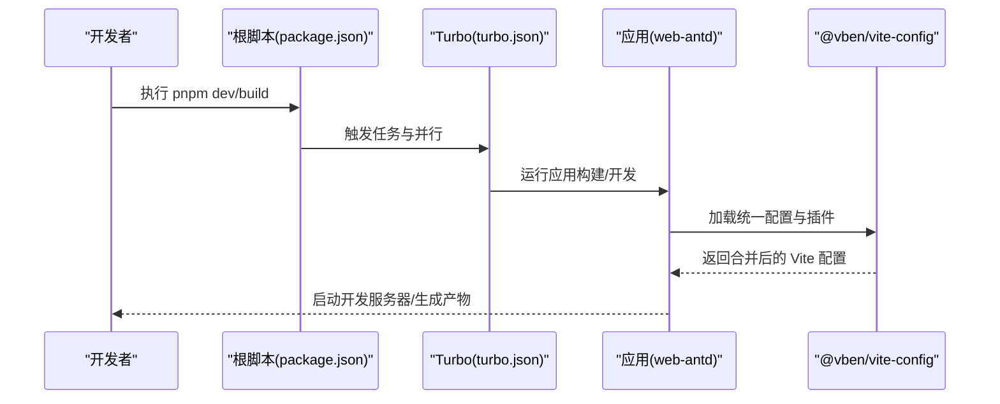
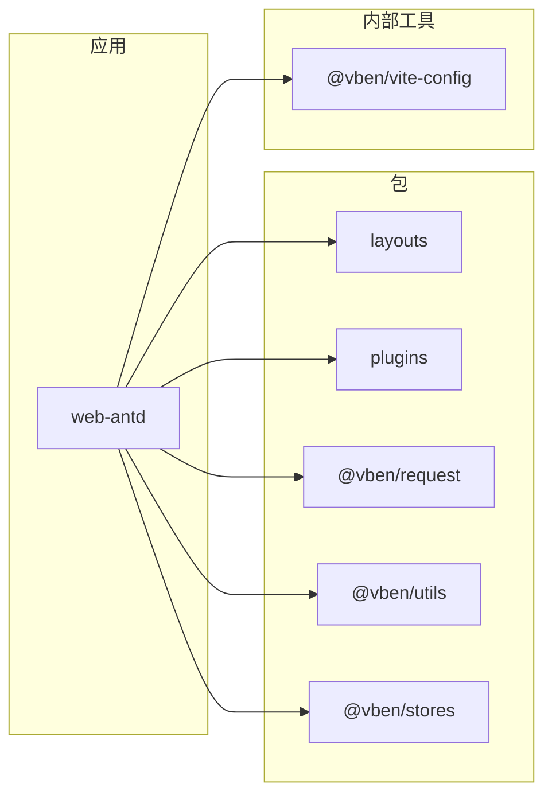

# Monorepo架构

<cite>
**本文引用的文件**
- [pnpm-workspace.yaml](file://pnpm-workspace.yaml)
- [turbo.json](file://turbo.json)
- [package.json](file://package.json)
- [README.md](file://README.md)
- [apps/web-antd/package.json](file://apps/web-antd/package.json)
- [apps/web-antd/vite.config.ts](file://apps/web-antd/vite.config.ts)
- [internal/vite-config/package.json](file://internal/vite-config/package.json)
- [internal/vite-config/src/index.ts](file://internal/vite-config/src/index.ts)
- [internal/node-utils/package.json](file://internal/node-utils/package.json)
- [internal/node-utils/src/monorepo.ts](file://internal/node-utils/src/monorepo.ts)
- [scripts/vsh/package.json](file://scripts/vsh/package.json)
- [scripts/turbo-run/package.json](file://scripts/turbo-run/package.json)
</cite>

## 目录

1. [引言](#引言)
2. [项目结构](#项目结构)
3. [核心组件](#核心组件)
4. [架构总览](#架构总览)
5. [详细组件分析](#详细组件分析)
6. [依赖分析](#依赖分析)
7. [性能考量](#性能考量)
8. [故障排查指南](#故障排查指南)
9. [结论](#结论)
10. [附录](#附录)

## 引言

本文件系统性梳理 Vben Admin 的 Monorepo 架构，围绕以下主题展开：pnpm 工作区配置如何统一管理多包与应用；Turbo 如何通过任务并行、缓存与增量构建提升构建效率；各包的脚本命令与依赖策略；以及 Vite 应用如何借助内部配置库协同工作（路径别名、插件加载、环境变量）。文末提供最佳实践建议与可视化图表，帮助开发者快速理解包间组织关系与协作方式。

## 项目结构

仓库采用 pnpm workspaces + Turbo 的典型 Monorepo 组织方式，核心目录与职责如下：

- apps：多套 Web 应用（Ant Design、Element Plus、Naive UI、TDesign 等）与后端 Mock 服务
- packages：业务与通用能力包（如 @core、effects、icons、stores、styles、types、utils 等）
- internal：内部工具与配置（vite-config、node-utils、lint-configs、tsconfig 等）
- scripts：开发辅助 CLI（vsh、turbo-run 等）
- docs：文档站点（VitePress）
- playground：示例与集成测试应用
- 根级配置：pnpm-workspace.yaml、turbo.json、package.json 等

图表来源

- [pnpm-workspace.yaml](file://pnpm-workspace.yaml)
- [package.json](file://package.json)

章节来源

- [pnpm-workspace.yaml](file://pnpm-workspace.yaml)
- [package.json](file://package.json)

## 核心组件

- pnpm 工作区（pnpm-workspace.yaml）：声明所有受控包与应用，统一版本与依赖解析范围，并通过 overrides + catalog 实现集中版本管理。
- Turbo（turbo.json）：定义全局依赖、环境变量、任务依赖与输出缓存，实现跨包并行构建与增量构建。
- 根级 package.json：统一脚本入口、引擎要求与工作流依赖，提供一键式开发与构建命令。
- 内部配置库（@vben/vite-config）：封装 Vite 配置、插件与环境加载逻辑，供各应用复用。
- 节点工具（@vben/node-utils）：提供 Monorepo 根定位、包枚举等基础能力。
- 开发脚本（@vben/vsh、@vben/turbo-run）：提供检查、提示与运行器等 CLI 能力。

章节来源

- [pnpm-workspace.yaml](file://pnpm-workspace.yaml)
- [turbo.json](file://turbo.json)
- [package.json](file://package.json)
- [internal/vite-config/package.json](file://internal/vite-config/package.json)
- [internal/node-utils/package.json](file://internal/node-utils/package.json)
- [scripts/vsh/package.json](file://scripts/vsh/package.json)
- [scripts/turbo-run/package.json](file://scripts/turbo-run/package.json)

## 架构总览

下图展示 Monorepo 的整体交互：根级脚本驱动 Turbo 并行执行任务；各应用通过 @vben/vite-config 统一加载 Vite 配置；内部工具提供通用能力；工作区统一版本与依赖解析。

图表来源

- [package.json](file://package.json)
- [turbo.json](file://turbo.json)
- [pnpm-workspace.yaml](file://pnpm-workspace.yaml)
- [internal/vite-config/package.json](file://internal/vite-config/package.json)
- [internal/node-utils/package.json](file://internal/node-utils/package.json)
- [scripts/vsh/package.json](file://scripts/vsh/package.json)
- [scripts/turbo-run/package.json](file://scripts/turbo-run/package.json)

## 详细组件分析

### pnpm 工作区配置（pnpm-workspace.yaml）

- 包含范围
  - internal/_、packages/_、apps/_、scripts/_、docs、playground 等，确保所有子包与应用被纳入工作区。
  - 对 @core 下的 base/ui-kit/forward 等子包进行细粒度控制，便于按需管理。
- 版本目录（catalog）
  - 使用 overrides + catalog 字段集中声明常用依赖版本，避免重复与漂移。
  - 通过 catalog: 与 catalog: 声明从目录读取版本，统一升级与锁定。
- 作用
  - 统一依赖解析、减少重复安装、加速安装与构建。
  - 通过目录化版本管理，降低跨包版本不一致风险。

章节来源

- [pnpm-workspace.yaml](file://pnpm-workspace.yaml)

### Turbo 构建优化（turbo.json）

- 全局依赖
  - 监听 pnpm-lock.yaml、.env._local、tsconfig_、内部工具与脚本源码变更，触发或失效缓存。
- 全局环境
  - 暴露 NODE_ENV，保证各任务使用一致的运行时环境。
- 任务定义
  - build：按拓扑顺序依赖上游包（^build），输出 dist/\*_、dist.zip、.vitepress/dist._，支持增量构建与缓存命中。
  - preview/build:analyze：同样依赖上游构建，输出产物用于预览与分析。
  - @vben/backend-mock#build：针对特定包的构建任务，输出 .nitro/** 与 .output/**。
  - test:e2e：空依赖，交由根脚本统一调度。
  - dev：禁用缓存、持久化任务，适合本地开发。
  - typecheck：无输出，仅类型检查。
- 作用
  - 通过任务依赖与输出声明，实现跨包并行与增量构建，显著缩短 CI/CD 时间。

章节来源

- [turbo.json](file://turbo.json)

### 根级脚本与依赖策略（package.json）

- 脚本入口
  - build/build:analyze/preview：委托给 turbo 或过滤器构建单个应用。
  - dev/dev:\*：分别启动 Turbo 开发或定向到具体应用。
  - test:unit/test:e2e：单元测试与端到端测试。
  - check/\*：循环依赖、依赖使用、类型检查、拼写检查等质量门禁。
  - changeset/version：基于 Changesets 的版本与发布流程。
  - update:deps：依赖升级工具。
  - catalog：批量更新 catalog 版本。
- 依赖策略
  - 开发期依赖集中于根级，配合 workspace:\* 与 catalog: 实现“集中版本 + 工作区覆盖”。
  - engines 限定 Node/PNPM 版本，确保环境一致性。
- 作用
  - 提供统一命令面，屏蔽各应用差异，提升团队协作效率。

章节来源

- [package.json](file://package.json)

### Vite 应用配置与 Monorepo 协同

- 应用层配置
  - apps/web-antd/vite.config.ts：引入 @vben/vite-config，按应用注入代理、插件与环境变量加载。
  - 应用 package.json：通过 imports 映射 #/_ 到 src/_，简化路径书写；依赖统一走 workspace:\* 或 catalog:。
- 内部配置库
  - @vben/vite-config：导出配置入口、选项与插件集合，统一加载环境变量与插件生态。
- 协同机制
  - 应用仅声明最小差异化配置，其余由内部配置库提供默认值与增强，降低重复配置成本。
  - 通过 loadAndConvertEnv 等工具函数，实现环境变量在不同包间的统一处理。

图表来源

- [package.json](file://package.json)
- [turbo.json](file://turbo.json)
- [apps/web-antd/vite.config.ts](file://apps/web-antd/vite.config.ts)
- [internal/vite-config/src/index.ts](file://internal/vite-config/src/index.ts)

章节来源

- [apps/web-antd/vite.config.ts](file://apps/web-antd/vite.config.ts)
- [apps/web-antd/package.json](file://apps/web-antd/package.json)
- [internal/vite-config/package.json](file://internal/vite-config/package.json)
- [internal/vite-config/src/index.ts](file://internal/vite-config/src/index.ts)

### 内部工具与 CLI

- @vben/node-utils
  - 提供 Monorepo 根定位、包枚举与包查询能力，支撑脚本与工具链自动化。
- @vben/vsh
  - CLI 工具集，提供循环依赖检测、依赖使用检查、格式化、发布前校验等能力。
- @vben/turbo-run
  - 开发期运行器，结合 Turbo 提供更友好的本地开发体验。
- 作用
  - 将通用能力沉淀为可复用模块，降低重复劳动，提升工程稳定性。

章节来源

- [internal/node-utils/package.json](file://internal/node-utils/package.json)
- [internal/node-utils/src/monorepo.ts](file://internal/node-utils/src/monorepo.ts)
- [scripts/vsh/package.json](file://scripts/vsh/package.json)
- [scripts/turbo-run/package.json](file://scripts/turbo-run/package.json)

## 依赖分析

- 工作区范围
  - apps/web-antd 依赖大量 @vben/\* 包（如 @vben/layouts、@vben/plugins、@vben/request 等），这些包在 packages 与 internal 中实现，形成“应用-包-工具”的分层。
- 版本与解析
  - 通过 pnpm-workspace.yaml 的 overrides + catalog，统一版本来源；应用层使用 workspace:\* 与 catalog: 两种策略，前者优先解析本地包，后者解析目录版本。
- 任务耦合
  - turbo.json 的 dependsOn 定义了构建拓扑，上游包先于下游包完成构建，确保产物可用。

图表来源

- [apps/web-antd/package.json](file://apps/web-antd/package.json)
- [internal/vite-config/package.json](file://internal/vite-config/package.json)

章节来源

- [pnpm-workspace.yaml](file://pnpm-workspace.yaml)
- [turbo.json](file://turbo.json)
- [apps/web-antd/package.json](file://apps/web-antd/package.json)

## 性能考量

- 任务并行与增量构建
  - 通过 Turbo 的任务依赖与输出声明，实现跨包并行与增量构建，显著缩短构建时间。
- 缓存策略
  - 依据全局依赖与输出目录进行缓存判定，变更更少的任务可直接命中缓存。
- 依赖去重与安装加速
  - pnpm-workspace.yaml 统一版本与解析范围，减少重复安装与 symlink 往返。
- 开发体验
  - dev 任务禁用缓存并持久化，确保热更新与调试效率。

章节来源

- [turbo.json](file://turbo.json)
- [pnpm-workspace.yaml](file://pnpm-workspace.yaml)

## 故障排查指南

- 构建失败或缓存异常
  - 检查 turbo.json 的 globalDependencies 与 outputs 是否覆盖到最新变更；必要时清理缓存后重试。
- 依赖解析错误
  - 确认 pnpm-workspace.yaml 的工作区范围是否包含相关包；核对 overrides + catalog 的版本声明是否冲突。
- 应用无法启动或代理失效
  - 检查应用 vite.config.ts 的代理配置与 @vben/vite-config 的加载顺序；确认环境变量已正确注入。
- 质量门禁失败
  - 使用 vsh 提供的检查命令（循环依赖、依赖使用、类型检查、拼写检查）逐项修复。

章节来源

- [turbo.json](file://turbo.json)
- [pnpm-workspace.yaml](file://pnpm-workspace.yaml)
- [apps/web-antd/vite.config.ts](file://apps/web-antd/vite.config.ts)
- [scripts/vsh/package.json](file://scripts/vsh/package.json)

## 结论

该 Monorepo 以 pnpm 工作区与 Turbo 为核心，结合内部配置库与工具链，实现了高内聚、低耦合且可扩展的多应用架构。通过统一版本目录、任务并行与增量构建，显著提升了开发与发布效率。建议持续完善 Changesets 发布流程与依赖更新策略，保持版本一致性与可追溯性。

## 附录

- 快速开始与参考
  - 参考根级 README 的安装与使用说明，确保 Node/PNPM 版本满足要求。
- 常用命令参考
  - 开发：pnpm dev / pnpm dev:antd / pnpm dev:docs
  - 构建：pnpm build / pnpm build:antd / pnpm build:docs
  - 测试：pnpm test:unit / pnpm test:e2e
  - 质量门禁：pnpm check / pnpm check:circular / pnpm check:dep / pnpm check:type
  - 版本与发布：pnpm changeset / pnpm version / pnpm catalog

章节来源

- [README.md](file://README.md)
- [package.json](file://package.json)
