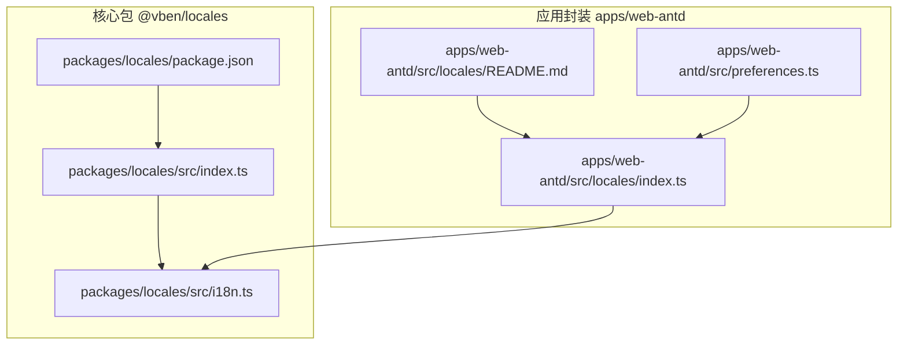
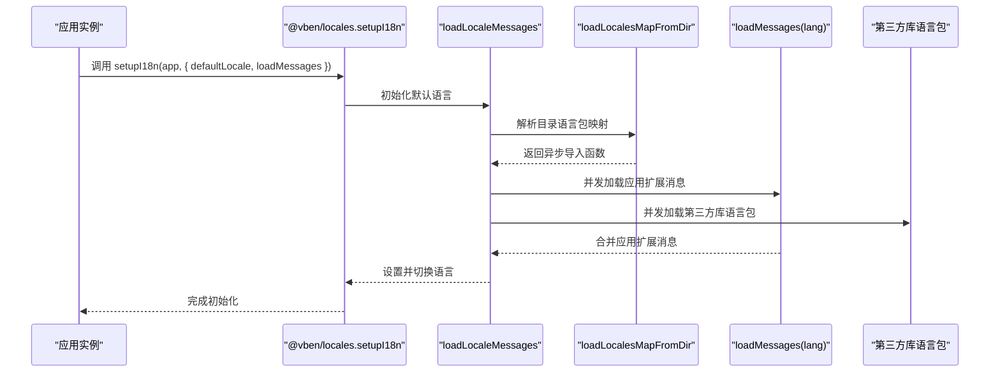
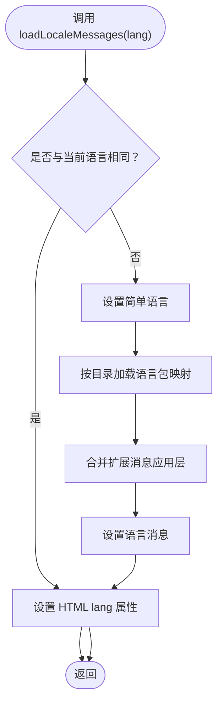
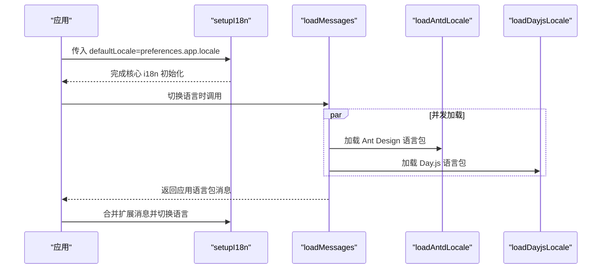
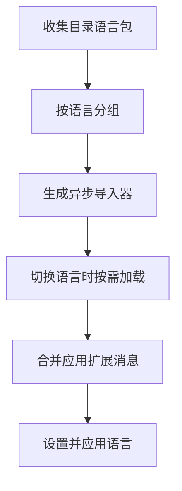
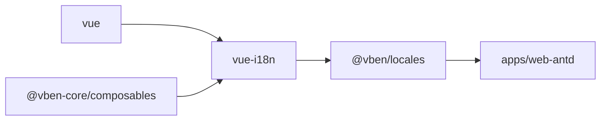

# 国际化系统

<cite>
**本文引用的文件**
- [packages/locales/package.json](file://packages/locales/package.json)
- [packages/locales/src/index.ts](file://packages/locales/src/index.ts)
- [packages/locales/src/i18n.ts](file://packages/locales/src/i18n.ts)
- [apps/web-antd/src/locales/index.ts](file://apps/web-antd/src/locales/index.ts)
- [apps/web-antd/src/locales/README.md](file://apps/web-antd/src/locales/README.md)
- [apps/web-antd/src/preferences.ts](file://apps/web-antd/src/preferences.ts)
</cite>

## 目录
1. [简介](#简介)
2. [项目结构](#项目结构)
3. [核心组件](#核心组件)
4. [架构总览](#架构总览)
5. [详细组件分析](#详细组件分析)
6. [依赖关系分析](#依赖关系分析)
7. [性能考量](#性能考量)
8. [故障排查指南](#故障排查指南)
9. [结论](#结论)
10. [附录](#附录)

## 简介
本文件系统性梳理 Vben Admin 的国际化（i18n）体系，重点涵盖以下方面：
- 配置结构与初始化流程
- 语言包组织方式与动态加载策略
- 动态语言切换机制与第三方库（如 Ant Design、Day.js）的本地化适配
- 文本资源的合并与覆盖规则
- 与路由、菜单、组件的集成方式
- 运行时动态添加新语言包的方法
- 开发最佳实践与多语言项目的维护策略

## 项目结构
Vben Admin 将国际化能力抽象为独立包，并在各 Web 应用中进行二次封装以适配具体 UI 框架与第三方库。

- 核心包：packages/locales 提供 i18n 初始化、语言包加载、动态切换等通用能力
- 应用层封装：apps/web-antd/src/locales 对核心能力进行扩展，负责加载第三方库语言包与应用自身语言包
- 偏好设置：apps/web-antd/src/preferences.ts 控制语言切换控件等偏好项

**图表来源**
- [packages/locales/package.json:1-29](file://packages/locales/package.json#L1-L29)
- [packages/locales/src/index.ts:1-31](file://packages/locales/src/index.ts#L1-L31)
- [packages/locales/src/i18n.ts:1-148](file://packages/locales/src/i18n.ts#L1-L148)
- [apps/web-antd/src/locales/index.ts:1-103](file://apps/web-antd/src/locales/index.ts#L1-L103)
- [apps/web-antd/src/locales/README.md:1-4](file://apps/web-antd/src/locales/README.md#L1-L4)
- [apps/web-antd/src/preferences.ts:1-31](file://apps/web-antd/src/preferences.ts#L1-L31)

**章节来源**
- [packages/locales/package.json:1-29](file://packages/locales/package.json#L1-L29)
- [packages/locales/src/index.ts:1-31](file://packages/locales/src/index.ts#L1-L31)
- [packages/locales/src/i18n.ts:1-148](file://packages/locales/src/i18n.ts#L1-L148)
- [apps/web-antd/src/locales/index.ts:1-103](file://apps/web-antd/src/locales/index.ts#L1-L103)
- [apps/web-antd/src/locales/README.md:1-4](file://apps/web-antd/src/locales/README.md#L1-L4)
- [apps/web-antd/src/preferences.ts:1-31](file://apps/web-antd/src/preferences.ts#L1-L31)

## 核心组件
- 核心 i18n 能力（@vben/locales）
  - 提供 i18n 实例创建、语言包加载、动态切换、缺失键告警等基础能力
  - 支持通过正则从目录批量收集语言包并生成异步导入映射
  - 支持应用层扩展消息合并（如第三方库语言包）
- 应用层封装（web-antd）
  - 负责加载 Ant Design 与 Day.js 的语言包
  - 从本地 JSON 文件加载应用自身的语言包
  - 与用户偏好设置联动，决定默认语言与是否显示语言切换控件

关键职责与接口概览：
- 初始化：setupI18n(app, options)
- 语言包加载：loadLocaleMessages(lang)、loadLocalesMapFromDir(...)
- 第三方库适配：loadAntdLocale(lang)、loadDayjsLocale(lang)
- 工具函数：$t、$te、i18n.global.t/te

**章节来源**
- [packages/locales/src/index.ts:1-31](file://packages/locales/src/index.ts#L1-L31)
- [packages/locales/src/i18n.ts:102-139](file://packages/locales/src/i18n.ts#L102-L139)
- [apps/web-antd/src/locales/index.ts:93-102](file://apps/web-antd/src/locales/index.ts#L93-L102)

## 架构总览
下图展示从应用启动到完成国际化初始化的关键交互：

**图表来源**
- [packages/locales/src/i18n.ts:102-139](file://packages/locales/src/i18n.ts#L102-L139)
- [apps/web-antd/src/locales/index.ts:33-39](file://apps/web-antd/src/locales/index.ts#L33-L39)
- [apps/web-antd/src/locales/index.ts:45-47](file://apps/web-antd/src/locales/index.ts#L45-L47)

## 详细组件分析

### 组件一：核心 i18n（@vben/locales）
- 角色定位
  - 创建 vue-i18n 实例，提供全局注入与非兼容模式
  - 通过 import.meta.glob 收集内置语言包，支持按目录结构生成语言映射
  - 提供 setI18nLanguage 设置 HTML lang 属性，便于 SEO 与辅助技术识别
  - 提供缺失键告警与自定义合并策略
- 关键流程
  - setupI18n：注册 i18n、设置默认语言、安装缺失键处理器
  - loadLocalesMapFromDir：基于正则解析目录，生成按语言分组的异步导入器
  - loadLocaleMessages：切换语言时，先设置简单语言，再加载对应语言包并合并扩展消息

**图表来源**
- [packages/locales/src/i18n.ts:123-139](file://packages/locales/src/i18n.ts#L123-L139)

**章节来源**
- [packages/locales/src/i18n.ts:16-148](file://packages/locales/src/i18n.ts#L16-L148)
- [packages/locales/src/index.ts:1-31](file://packages/locales/src/index.ts#L1-L31)

### 组件二：应用层封装（web-antd）
- 角色定位
  - 在核心能力之上，扩展第三方库语言包加载（Ant Design、Day.js）
  - 从本地 JSON 文件加载应用语言包
  - 与用户偏好设置联动，决定默认语言与是否启用语言切换控件
- 关键流程
  - setupI18n：读取偏好设置中的默认语言，传入核心 setupI18n
  - loadMessages：并发加载应用语言包与第三方库语言包
  - loadAntdLocale/loadDayjsLocale：根据语言切换 UI 组件库与日期库的本地化

**图表来源**
- [apps/web-antd/src/locales/index.ts:93-102](file://apps/web-antd/src/locales/index.ts#L93-L102)
- [apps/web-antd/src/locales/index.ts:33-39](file://apps/web-antd/src/locales/index.ts#L33-L39)
- [apps/web-antd/src/locales/index.ts:80-91](file://apps/web-antd/src/locales/index.ts#L80-L91)
- [apps/web-antd/src/locales/index.ts:53-74](file://apps/web-antd/src/locales/index.ts#L53-L74)

**章节来源**
- [apps/web-antd/src/locales/index.ts:1-103](file://apps/web-antd/src/locales/index.ts#L1-L103)
- [apps/web-antd/src/locales/README.md:1-4](file://apps/web-antd/src/locales/README.md#L1-L4)
- [apps/web-antd/src/preferences.ts:26-30](file://apps/web-antd/src/preferences.ts#L26-L30)

### 组件三：语言包组织与加载策略
- 目录结构
  - 语言包按“语言代码/模块名.json”组织，例如 zh-CN/common.json、en-US/user.json
  - 通过 import.meta.glob 收集，再由 loadLocalesMapFromDir 按语言分组生成异步导入器
- 加载策略
  - 按需异步加载：切换语言时才加载对应语言包
  - 并发加载：应用语言包与第三方库语言包并发执行，提升切换速度
  - 合并覆盖：先设置语言包，再合并应用扩展消息（如第三方库语言包）

**图表来源**
- [packages/locales/src/i18n.ts:23-90](file://packages/locales/src/i18n.ts#L23-L90)
- [apps/web-antd/src/locales/index.ts:22-39](file://apps/web-antd/src/locales/index.ts#L22-L39)

**章节来源**
- [packages/locales/src/i18n.ts:23-90](file://packages/locales/src/i18n.ts#L23-L90)
- [apps/web-antd/src/locales/index.ts:22-39](file://apps/web-antd/src/locales/index.ts#L22-L39)

### 组件四：与路由、菜单、组件的集成
- 路由与菜单
  - 路由与菜单文案建议统一走 i18n 键值，避免硬编码
  - 在路由守卫或菜单构建阶段，使用 $t 获取对应语言文案
- 组件
  - 表单、弹窗、提示等 UI 文案统一通过 $t 渲染
  - 与第三方组件库（Ant Design、Element Plus、Naive UI、TDesign）配合时，需同步切换其语言包
- 偏好设置
  - 语言切换控件可通过偏好设置开关控制显示与否
  - 默认语言来源于偏好设置，确保首次进入即为期望语言

**章节来源**
- [apps/web-antd/src/preferences.ts:26-30](file://apps/web-antd/src/preferences.ts#L26-L30)
- [apps/web-antd/src/locales/README.md:1-4](file://apps/web-antd/src/locales/README.md#L1-L4)

### 组件五：运行时动态添加新语言包
- 新增语言
  - 在对应语言目录新增 JSON 文件，保持模块名唯一
  - 无需重启应用，切换到新语言时自动按需加载
- 扩展消息
  - 通过 setupI18n 的 loadMessages 回调，可动态合并第三方库语言包或远程翻译
  - 合并顺序：先设置语言包，再合并扩展消息，保证扩展覆盖语言包

**章节来源**
- [packages/locales/src/i18n.ts:102-139](file://packages/locales/src/i18n.ts#L102-L139)
- [apps/web-antd/src/locales/index.ts:33-39](file://apps/web-antd/src/locales/index.ts#L33-L39)

## 依赖关系分析
- 核心依赖
  - vue-i18n：提供国际化能力
  - @vben-core/composables：提供 useSimpleLocale 等工具
  - vue：响应式与组件生态
- 包导出与类型
  - @vben/locales 导出 i18n 实例、$t/$te、setupI18n、loadLocaleMessages 等
  - 类型定义包含 LocaleSetupOptions、SupportedLanguagesType、ImportLocaleFn 等

**图表来源**
- [packages/locales/package.json:22-27](file://packages/locales/package.json#L22-L27)
- [packages/locales/src/index.ts:1-31](file://packages/locales/src/index.ts#L1-L31)

**章节来源**
- [packages/locales/package.json:1-29](file://packages/locales/package.json#L1-L29)
- [packages/locales/src/index.ts:1-31](file://packages/locales/src/index.ts#L1-L31)

## 性能考量
- 按需加载：仅在切换语言时加载对应语言包，减少初始体积
- 并发加载：应用语言包与第三方库语言包并发，缩短切换等待时间
- 缓存策略：浏览器缓存与打包器的动态导入缓存可进一步优化重复切换性能
- 建议
  - 合理拆分语言包模块，避免单文件过大
  - 对高频页面集中语言包，降低切换抖动

## 故障排查指南
- 未找到翻译键
  - 现象：控制台出现缺失键告警
  - 处理：检查键路径是否正确；确认语言包已加载；必要时在开发环境开启缺失键告警
- 语言切换无效
  - 现象：切换语言后文案未更新
  - 处理：确认已调用 loadLocaleMessages 或通过扩展回调合并消息；检查 HTML lang 属性是否更新
- 第三方库未切换
  - 现象：UI 组件文案未随语言切换
  - 处理：确认已调用 loadAntdLocale/loadDayjsLocale；检查语言映射是否覆盖到目标语言

**章节来源**
- [packages/locales/src/i18n.ts:110-116](file://packages/locales/src/i18n.ts#L110-L116)
- [apps/web-antd/src/locales/index.ts:80-91](file://apps/web-antd/src/locales/index.ts#L80-L91)

## 结论
Vben Admin 的国际化系统以 @vben/locales 为核心，结合应用层封装实现了：
- 清晰的语言包组织与按需加载
- 与第三方库的无缝对接
- 可扩展的消息合并机制
- 易于维护与扩展的架构设计

遵循本文档的命名约定、加载策略与最佳实践，可高效支撑多语言项目的长期演进。

## 附录
- 语言包命名约定
  - 语言代码：采用标准区域标识符，如 zh-CN、en-US
  - 模块名：按功能域划分，如 common、user、menu、form 等
  - 文件名：模块名.json，避免重复
- 嵌套对象处理
  - 使用点号路径访问嵌套键，如 common.button.ok
  - 在模板中通过 $t('common.button.ok') 渲染
- 动态添加语言
  - 新增语言目录与 JSON 文件
  - 如需扩展第三方库语言包，通过 loadMessages 回调合并