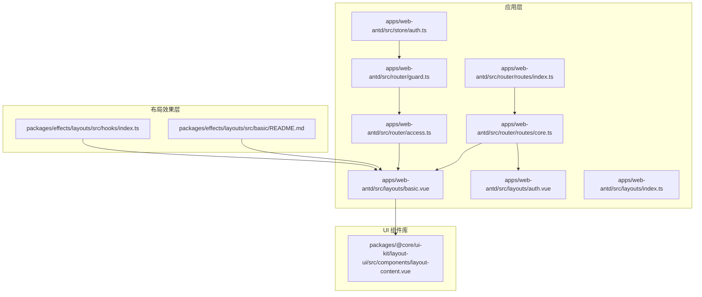
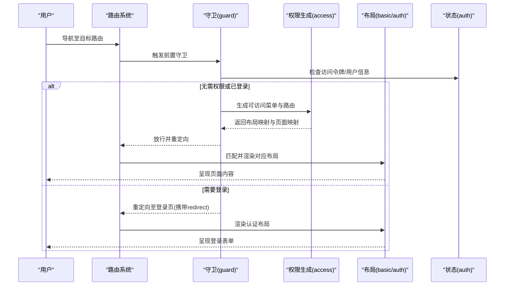
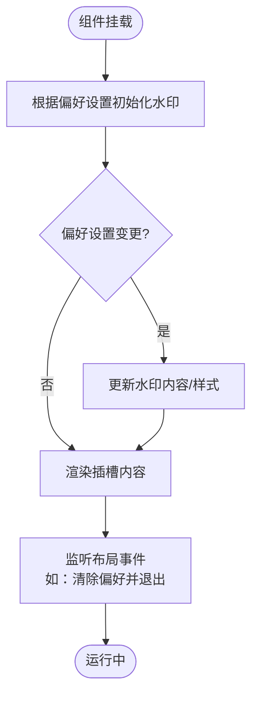
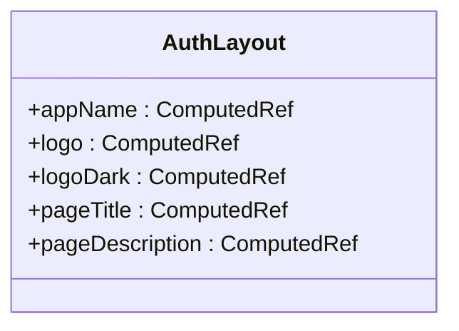
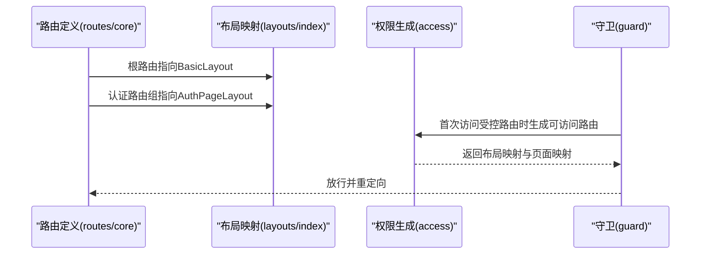
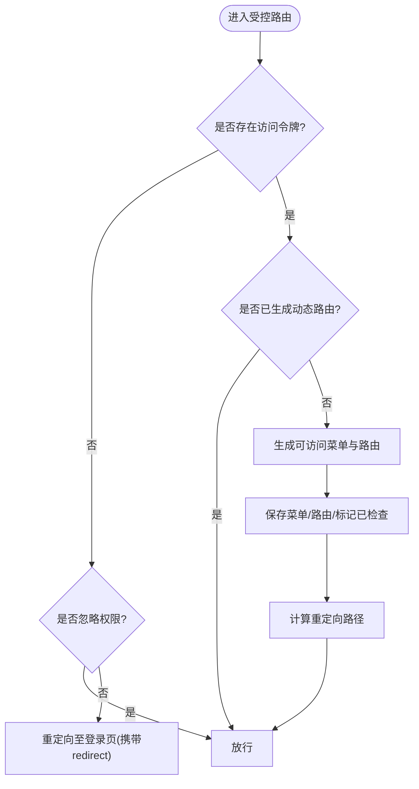
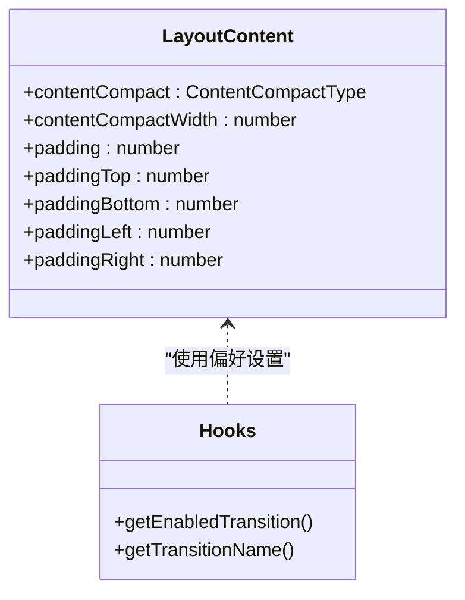
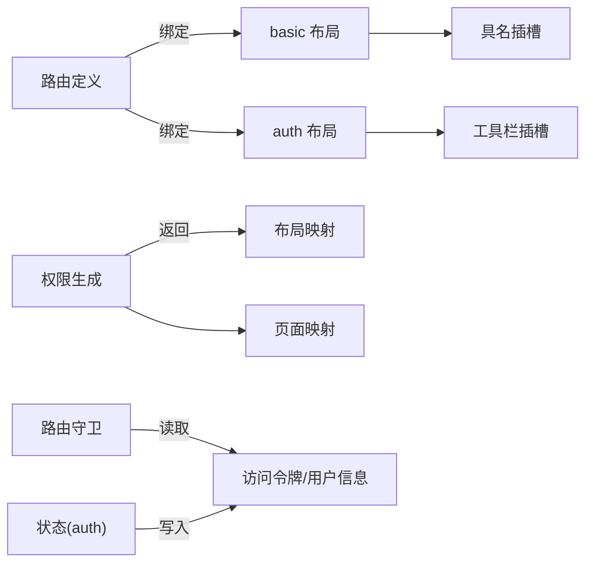

# 布局系统架构

<cite>
**本文档引用的文件**
- [apps/web-antd/src/layouts/basic.vue](file://apps/web-antd/src/layouts/basic.vue)
- [apps/web-antd/src/layouts/auth.vue](file://apps/web-antd/src/layouts/auth.vue)
- [apps/web-antd/src/layouts/index.ts](file://apps/web-antd/src/layouts/index.ts)
- [apps/web-antd/src/router/guard.ts](file://apps/web-antd/src/router/guard.ts)
- [apps/web-antd/src/router/access.ts](file://apps/web-antd/src/router/access.ts)
- [apps/web-antd/src/router/routes/core.ts](file://apps/web-antd/src/router/routes/core.ts)
- [apps/web-antd/src/router/routes/index.ts](file://apps/web-antd/src/router/routes/index.ts)
- [apps/web-antd/src/store/auth.ts](file://apps/web-antd/src/store/auth.ts)
- [packages/@core/ui-kit/layout-ui/src/components/layout-content.vue](file://packages/@core/ui-kit/layout-ui/src/components/layout-content.vue)
- [packages/effects/layouts/src/basic/README.md](file://packages/effects/layouts/src/basic/README.md)
- [packages/effects/layouts/src/hooks/index.ts](file://packages/effects/layouts/src/hooks/index.ts)
</cite>

## 目录

1. [简介](#简介)
2. [项目结构](#项目结构)
3. [核心组件](#核心组件)
4. [架构总览](#架构总览)
5. [详细组件分析](#详细组件分析)
6. [依赖关系分析](#依赖关系分析)
7. [性能考量](#性能考量)
8. [故障排查指南](#故障排查指南)
9. [结论](#结论)
10. [附录](#附录)

## 简介

本文件系统性梳理 Vben Admin 的布局系统，重点阐释以下方面：

- 基础容器设计：basic 布局作为顶层容器的设计理念与职责边界
- 认证场景适配：auth 布局针对登录/注册等认证页面的特殊处理
- 生命周期管理：布局组件与路由、状态管理的协同与生命周期要点
- 路由与布局绑定机制：根路由如何承载基础布局，认证路由如何独立于基础布局
- 动态布局切换：基于权限与路由元信息的布局选择策略
- 权限控制与路由守卫：如何通过守卫实现登录态与访问权限控制
- 插槽与内容定制：如何利用布局插槽实现头部、通知、锁屏等区域的灵活扩展

## 项目结构

布局系统主要分布在应用层的 layouts 与 router 子目录中，并通过路由与状态管理协作完成权限与导航控制。

**图表来源**

- [apps/web-antd/src/router/routes/core.ts:24-94](file://apps/web-antd/src/router/routes/core.ts#L24-L94)
- [apps/web-antd/src/layouts/basic.vue:172-206](file://apps/web-antd/src/layouts/basic.vue#L172-L206)
- [apps/web-antd/src/layouts/auth.vue:14-25](file://apps/web-antd/src/layouts/auth.vue#L14-L25)
- [apps/web-antd/src/router/guard.ts:47-118](file://apps/web-antd/src/router/guard.ts#L47-L118)
- [apps/web-antd/src/router/access.ts:18-51](file://apps/web-antd/src/router/access.ts#L18-L51)
- [packages/@core/ui-kit/layout-ui/src/components/layout-content.vue:58-64](file://packages/@core/ui-kit/layout-ui/src/components/layout-content.vue#L58-L64)
- [packages/effects/layouts/src/basic/README.md:1-8](file://packages/effects/layouts/src/basic/README.md#L1-L8)
- [packages/effects/layouts/src/hooks/index.ts:55-98](file://packages/effects/layouts/src/hooks/index.ts#L55-L98)

**章节来源**

- [apps/web-antd/src/router/routes/core.ts:24-94](file://apps/web-antd/src/router/routes/core.ts#L24-L94)
- [apps/web-antd/src/layouts/index.ts:1-7](file://apps/web-antd/src/layouts/index.ts#L1-L7)

## 核心组件

- basic 布局：作为顶层容器，承载通用头部、侧边菜单、标签页、通知、锁屏等通用 UI；通过具名插槽向外部注入用户下拉、通知面板、额外弹窗、锁屏等模块。
- auth 布局：专用于认证页面（登录、注册、忘记密码等），提供简洁的标题、描述、Logo 展示与可选工具栏插槽。
- 路由根容器：根路由使用 basic 布局作为父级容器，使所有业务页面共享统一的布局骨架。
- 认证路由组：认证路由组独立于 basic 布局，避免在登录态缺失时出现不必要的布局渲染。

**章节来源**

- [apps/web-antd/src/layouts/basic.vue:172-206](file://apps/web-antd/src/layouts/basic.vue#L172-L206)
- [apps/web-antd/src/layouts/auth.vue:14-25](file://apps/web-antd/src/layouts/auth.vue#L14-L25)
- [apps/web-antd/src/router/routes/core.ts:24-94](file://apps/web-antd/src/router/routes/core.ts#L24-L94)

## 架构总览

布局系统围绕“路由-布局-插槽”三层协作展开：

- 路由层：定义根路由与认证路由组，决定页面是否挂载基础布局或专用认证布局
- 布局层：basic/auth 提供容器与插槽，负责通用 UI 与认证 UI 的差异化呈现
- 插槽层：通过具名插槽将用户下拉、通知、锁屏、登录表单等模块注入到布局中

**图表来源**

- [apps/web-antd/src/router/guard.ts:47-118](file://apps/web-antd/src/router/guard.ts#L47-L118)
- [apps/web-antd/src/router/access.ts:18-51](file://apps/web-antd/src/router/access.ts#L18-L51)
- [apps/web-antd/src/router/routes/core.ts:24-94](file://apps/web-antd/src/router/routes/core.ts#L24-L94)
- [apps/web-antd/src/layouts/basic.vue:172-206](file://apps/web-antd/src/layouts/basic.vue#L172-L206)
- [apps/web-antd/src/layouts/auth.vue:14-25](file://apps/web-antd/src/layouts/auth.vue#L14-L25)

## 详细组件分析

### Basic 布局：基础容器与插槽体系

- 设计理念
  - 作为根路由的父级容器，统一承载头部、侧边、标签页、内容区等
  - 通过具名插槽解耦通用功能（用户下拉、通知、锁屏、登录弹窗等）
- 关键职责
  - 注入用户下拉菜单与头像、昵称、邮箱等信息
  - 提供通知中心插槽，支持标记已读、清空、批量处理
  - 提供额外弹窗插槽，用于登录过期弹窗与登录表单
  - 提供锁屏插槽，结合锁屏组件实现临时锁定
  - 响应偏好设置变化，动态更新水印内容与可见性
- 生命周期管理
  - 在组件挂载时根据偏好设置初始化水印
  - 监听偏好设置变更，动态更新或销毁水印
  - 通过事件向下传递，如“清除偏好并退出”等

**图表来源**

- [apps/web-antd/src/layouts/basic.vue:150-169](file://apps/web-antd/src/layouts/basic.vue#L150-L169)
- [apps/web-antd/src/layouts/basic.vue:172-206](file://apps/web-antd/src/layouts/basic.vue#L172-L206)

**章节来源**

- [apps/web-antd/src/layouts/basic.vue:1-207](file://apps/web-antd/src/layouts/basic.vue#L1-L207)

### Auth 布局：认证场景专用容器

- 设计理念
  - 专注于认证页面的展示一致性，避免与业务布局混用
  - 提供标题、描述、Logo 等基础信息插槽位
- 关键职责
  - 从偏好设置读取应用名称、Logo（明/暗）主题
  - 将国际化后的页面标题与描述传入布局组件
  - 保留工具栏插槽，便于扩展第三方认证入口或快捷操作

**图表来源**

- [apps/web-antd/src/layouts/auth.vue:1-26](file://apps/web-antd/src/layouts/auth.vue#L1-L26)

**章节来源**

- [apps/web-antd/src/layouts/auth.vue:1-26](file://apps/web-antd/src/layouts/auth.vue#L1-L26)

### 路由与布局绑定机制

- 根路由与基础布局
  - 根路由使用 basic 布局作为父级容器，children 为空，实际业务页面作为其子路由自动继承布局
- 认证路由组与认证布局
  - 认证路由组独立于 basic 布局，内部各子路由（登录、注册、扫码等）使用 auth 布局
- 动态路由与权限生成
  - 通过权限守卫在首次访问受控路由时生成可访问菜单与路由，并将布局映射与页面映射注入到路由生成器中

**图表来源**

- [apps/web-antd/src/router/routes/core.ts:24-94](file://apps/web-antd/src/router/routes/core.ts#L24-L94)
- [apps/web-antd/src/layouts/index.ts:1-7](file://apps/web-antd/src/layouts/index.ts#L1-L7)
- [apps/web-antd/src/router/access.ts:18-51](file://apps/web-antd/src/router/access.ts#L18-L51)

**章节来源**

- [apps/web-antd/src/router/routes/core.ts:24-94](file://apps/web-antd/src/router/routes/core.ts#L24-L94)
- [apps/web-antd/src/router/routes/index.ts:24-47](file://apps/web-antd/src/router/routes/index.ts#L24-L47)
- [apps/web-antd/src/layouts/index.ts:1-7](file://apps/web-antd/src/layouts/index.ts#L1-L7)

### 权限控制与路由守卫

- 通用守卫
  - 负责页面加载进度条、记录页面加载状态等
- 访问守卫
  - 核心路由（如登录页）绕过权限检查
  - 无访问令牌时，若目标路由允许忽略权限则放行，否则重定向至登录页并携带 redirect
  - 首次生成动态路由后，保存菜单与路由信息，并根据 homePath 或默认首页进行重定向
- 登录流程
  - 登录成功后写入访问令牌与用户信息，随后根据用户首页或默认首页跳转

**图表来源**

- [apps/web-antd/src/router/guard.ts:47-118](file://apps/web-antd/src/router/guard.ts#L47-L118)
- [apps/web-antd/src/store/auth.ts:28-78](file://apps/web-antd/src/store/auth.ts#L28-L78)

**章节来源**

- [apps/web-antd/src/router/guard.ts:1-133](file://apps/web-antd/src/router/guard.ts#L1-L133)
- [apps/web-antd/src/store/auth.ts:1-118](file://apps/web-antd/src/store/auth.ts#L1-L118)

### 动态布局切换与内容区域定制

- 动态布局切换
  - 通过权限生成阶段返回的布局映射，将页面与布局进行绑定
  - 支持 IFrameView 等特殊布局，满足内嵌场景
- 内容区域定制
  - 布局内容区组件支持紧凑模式与内边距配置，通过插槽实现覆盖层与主内容的组合
  - 布局效果层提供插槽规范与过渡动画钩子，便于统一风格与性能优化

**图表来源**

- [packages/@core/ui-kit/layout-ui/src/components/layout-content.vue:11-55](file://packages/@core/ui-kit/layout-ui/src/components/layout-content.vue#L11-L55)
- [packages/effects/layouts/src/hooks/index.ts:55-98](file://packages/effects/layouts/src/hooks/index.ts#L55-L98)

**章节来源**

- [apps/web-antd/src/router/access.ts:18-51](file://apps/web-antd/src/router/access.ts#L18-L51)
- [packages/@core/ui-kit/layout-ui/src/components/layout-content.vue:1-65](file://packages/@core/ui-kit/layout-ui/src/components/layout-content.vue#L1-L65)
- [packages/effects/layouts/src/basic/README.md:1-8](file://packages/effects/layouts/src/basic/README.md#L1-L8)
- [packages/effects/layouts/src/hooks/index.ts:55-98](file://packages/effects/layouts/src/hooks/index.ts#L55-L98)

## 依赖关系分析

- 路由与布局
  - 根路由绑定 basic 布局，认证路由组绑定 auth 布局
  - 动态路由生成时依赖布局映射与页面映射
- 布局与插槽
  - basic 布局通过具名插槽注入用户下拉、通知、锁屏、登录弹窗等
  - auth 布局通过具名插槽注入工具栏
- 状态与守卫
  - 守卫依赖访问令牌与用户信息，登录成功后写入状态并跳转

**图表来源**

- [apps/web-antd/src/router/routes/core.ts:24-94](file://apps/web-antd/src/router/routes/core.ts#L24-L94)
- [apps/web-antd/src/router/access.ts:18-51](file://apps/web-antd/src/router/access.ts#L18-L51)
- [apps/web-antd/src/router/guard.ts:47-118](file://apps/web-antd/src/router/guard.ts#L47-L118)
- [apps/web-antd/src/store/auth.ts:28-78](file://apps/web-antd/src/store/auth.ts#L28-L78)
- [apps/web-antd/src/layouts/basic.vue:172-206](file://apps/web-antd/src/layouts/basic.vue#L172-L206)
- [apps/web-antd/src/layouts/auth.vue:14-25](file://apps/web-antd/src/layouts/auth.vue#L14-L25)

**章节来源**

- [apps/web-antd/src/router/routes/index.ts:24-47](file://apps/web-antd/src/router/routes/index.ts#L24-L47)
- [apps/web-antd/src/layouts/index.ts:1-7](file://apps/web-antd/src/layouts/index.ts#L1-L7)

## 性能考量

- 进度条与动画
  - 通用守卫在首次进入页面时启动进度条，离开时停止，避免重复渲染开销
  - 布局效果层提供过渡动画开关与条件判断，减少重复动画带来的性能损耗
- 水印与资源
  - 水印按需初始化与销毁，避免不必要的 DOM 更新
- 缓存与复用
  - 页面加载状态记录，避免重复执行动画与副作用

**章节来源**

- [apps/web-antd/src/router/guard.ts:17-41](file://apps/web-antd/src/router/guard.ts#L17-L41)
- [apps/web-antd/src/layouts/basic.vue:150-169](file://apps/web-antd/src/layouts/basic.vue#L150-L169)
- [packages/effects/layouts/src/hooks/index.ts:55-98](file://packages/effects/layouts/src/hooks/index.ts#L55-L98)

## 故障排查指南

- 登录后无法跳转回原页面
  - 检查守卫是否正确携带 redirect 参数并进行重定向
  - 确认用户首页或默认首页配置是否有效
- 无权限访问被重定向至登录页
  - 确认目标路由是否标记忽略权限
  - 检查访问令牌是否正确写入与持久化
- 认证页面仍显示基础布局
  - 确认认证路由组是否正确绑定 auth 布局
  - 检查路由层级与命名是否符合预期
- 通知/用户下拉不显示
  - 检查 basic 布局插槽是否正确注入
  - 确认用户信息与偏好设置是否正确初始化

**章节来源**

- [apps/web-antd/src/router/guard.ts:47-118](file://apps/web-antd/src/router/guard.ts#L47-L118)
- [apps/web-antd/src/layouts/basic.vue:172-206](file://apps/web-antd/src/layouts/basic.vue#L172-L206)
- [apps/web-antd/src/router/routes/core.ts:24-94](file://apps/web-antd/src/router/routes/core.ts#L24-L94)

## 结论

Vben Admin 的布局系统以“路由-布局-插槽”为核心，通过根路由承载基础布局、认证路由组独立于基础布局，实现了业务与认证场景的清晰分离。配合权限守卫与动态路由生成，系统在保证一致性的前提下，提供了高度可扩展的插槽体系与灵活的内容定制能力。遵循本文档的最佳实践，可在不破坏整体架构的前提下快速扩展布局功能。

## 附录

- 最佳实践
  - 将认证相关页面置于独立的认证路由组，避免与业务布局耦合
  - 使用具名插槽注入通用模块，保持布局组件职责单一
  - 在权限生成阶段统一管理布局映射与页面映射，减少运行时分支
  - 合理使用进度条与动画开关，平衡用户体验与性能
  - 对水印、通知等可选功能按需初始化，避免不必要的资源消耗
