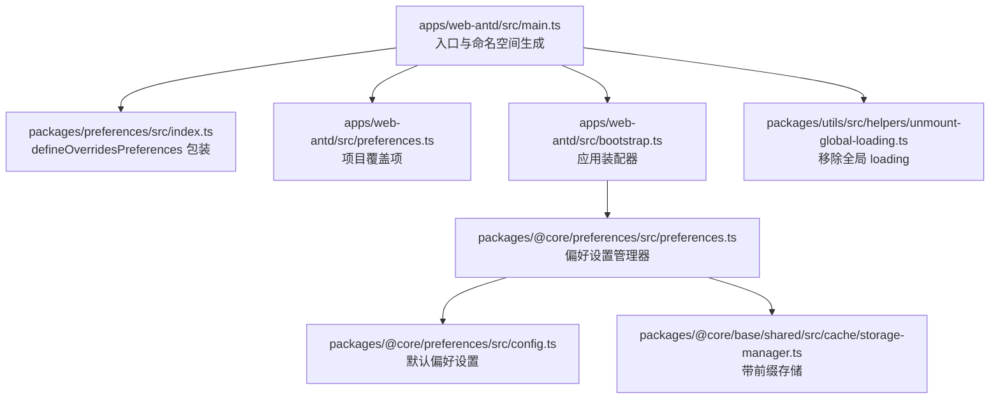
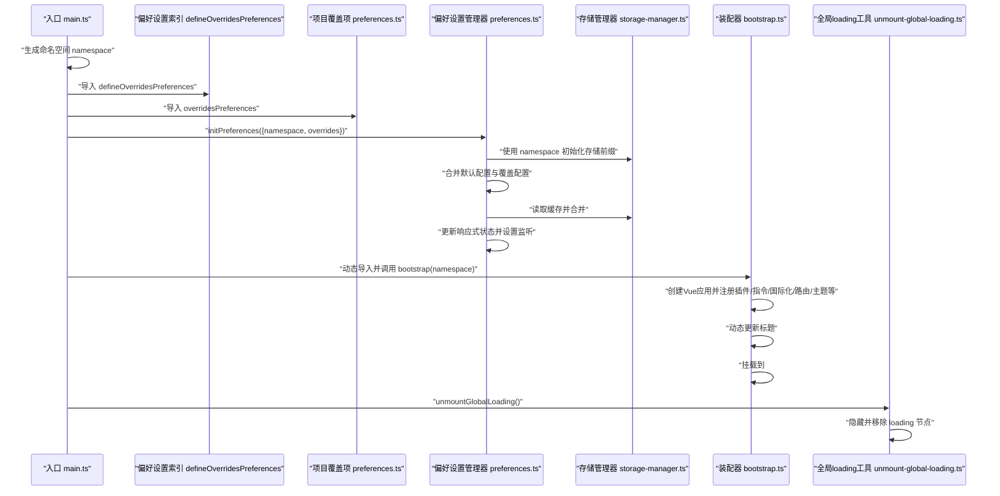
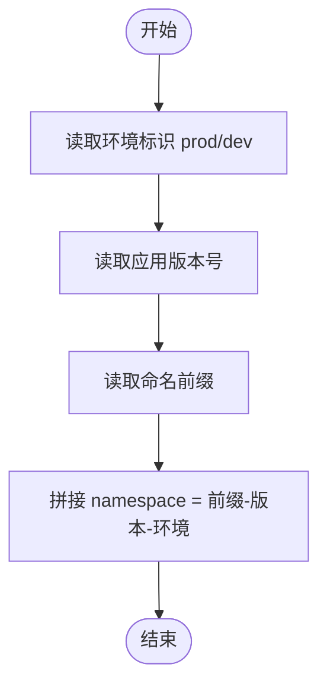
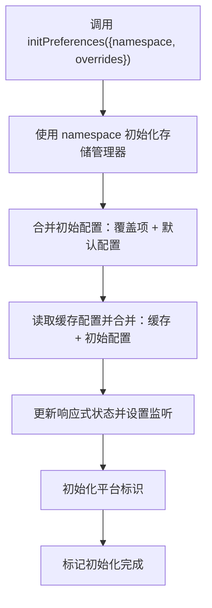
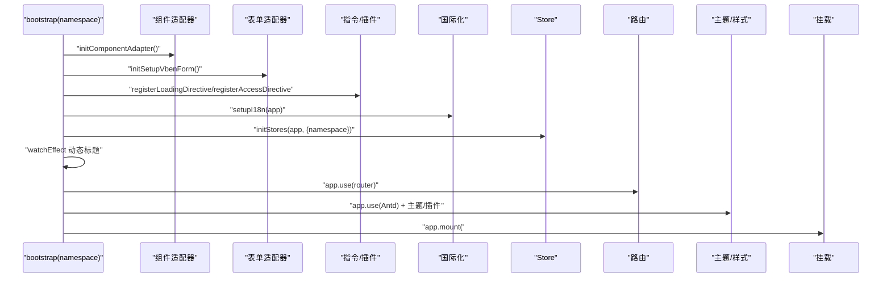
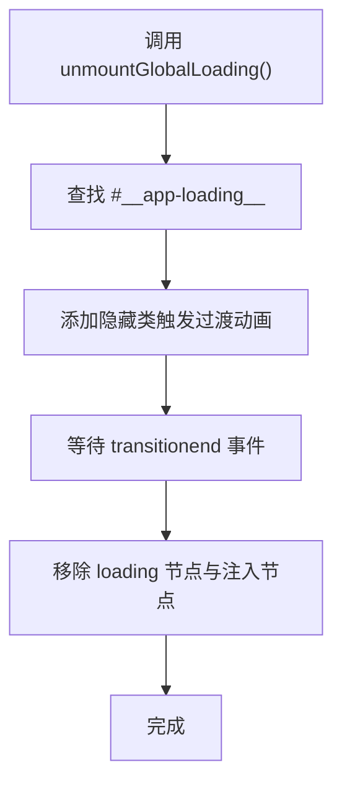
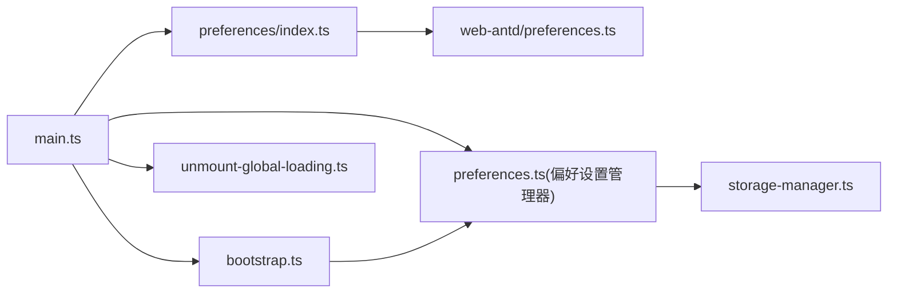

# 应用初始化流程

<cite>
**本文引用的文件**
- [apps/web-antd/src/main.ts](file://apps/web-antd/src/main.ts)
- [apps/web-antd/src/bootstrap.ts](file://apps/web-antd/src/bootstrap.ts)
- [apps/web-antd/src/preferences.ts](file://apps/web-antd/src/preferences.ts)
- [packages/preferences/src/index.ts](file://packages/preferences/src/index.ts)
- [packages/@core/preferences/src/preferences.ts](file://packages/@core/preferences/src/preferences.ts)
- [packages/@core/preferences/src/config.ts](file://packages/@core/preferences/src/config.ts)
- [packages/utils/src/helpers/unmount-global-loading.ts](file://packages/utils/src/helpers/unmount-global-loading.ts)
- [packages/@core/base/shared/src/cache/storage-manager.ts](file://packages/@core/base/shared/src/cache/storage-manager.ts)
</cite>

## 目录
1. [简介](#简介)
2. [项目结构](#项目结构)
3. [核心组件](#核心组件)
4. [架构总览](#架构总览)
5. [详细组件分析](#详细组件分析)
6. [依赖分析](#依赖分析)
7. [性能考虑](#性能考虑)
8. [故障排查指南](#故障排查指南)
9. [结论](#结论)
10. [附录](#附录)

## 简介
本文件面向开发者，系统性梳理 Vben Admin 在 Web 端（以 Ant Design 版本为例）的应用初始化流程，从入口文件 main.ts 到应用完全启动的完整生命周期。重点涵盖以下方面：
- 应用命名空间的生成规则与作用
- 偏好设置初始化流程与配置项说明
- overridesPreferences 的覆盖机制
- bootstrap 函数的装配逻辑
- 全局 loading 的移除机制
- 初始化流程图与时序图，帮助快速定位关键步骤与依赖关系

## 项目结构
本节聚焦与初始化相关的核心文件及其职责：
- apps/web-antd/src/main.ts：应用入口，负责生成命名空间、初始化偏好设置、按需加载并调用 bootstrap、最后移除全局 loading
- apps/web-antd/src/preferences.ts：项目级偏好设置覆盖项，通过 defineOverridesPreferences 定义
- apps/web-antd/src/bootstrap.ts：应用装配器，负责创建 Vue 应用、注册指令/插件、国际化、路由、主题等
- packages/preferences/src/index.ts：导出 defineOverridesPreferences 工具方法
- packages/@core/preferences/src/preferences.ts：偏好设置管理器实现，包含初始化、合并、缓存、监听等核心逻辑
- packages/@core/preferences/src/config.ts：默认偏好设置常量
- packages/utils/src/helpers/unmount-global-loading.ts：全局 loading 移除工具
- packages/@core/base/shared/src/cache/storage-manager.ts：带前缀的存储管理器，支持命名空间隔离

**图表来源**
- [apps/web-antd/src/main.ts:1-32](file://apps/web-antd/src/main.ts#L1-L32)
- [apps/web-antd/src/preferences.ts:1-31](file://apps/web-antd/src/preferences.ts#L1-L31)
- [packages/preferences/src/index.ts:1-18](file://packages/preferences/src/index.ts#L1-L18)
- [apps/web-antd/src/bootstrap.ts:1-85](file://apps/web-antd/src/bootstrap.ts#L1-L85)
- [packages/@core/preferences/src/preferences.ts:1-235](file://packages/@core/preferences/src/preferences.ts#L1-L235)
- [packages/@core/preferences/src/config.ts:1-148](file://packages/@core/preferences/src/config.ts#L1-L148)
- [packages/utils/src/helpers/unmount-global-loading.ts:1-32](file://packages/utils/src/helpers/unmount-global-loading.ts#L1-L32)
- [packages/@core/base/shared/src/cache/storage-manager.ts](file://packages/@core/base/shared/src/cache/storage-manager.ts)

**章节来源**
- [apps/web-antd/src/main.ts:1-32](file://apps/web-antd/src/main.ts#L1-L32)
- [apps/web-antd/src/bootstrap.ts:1-85](file://apps/web-antd/src/bootstrap.ts#L1-L85)
- [apps/web-antd/src/preferences.ts:1-31](file://apps/web-antd/src/preferences.ts#L1-L31)
- [packages/preferences/src/index.ts:1-18](file://packages/preferences/src/index.ts#L1-L18)
- [packages/@core/preferences/src/preferences.ts:1-235](file://packages/@core/preferences/src/preferences.ts#L1-L235)
- [packages/@core/preferences/src/config.ts:1-148](file://packages/@core/preferences/src/config.ts#L1-L148)
- [packages/utils/src/helpers/unmount-global-loading.ts:1-32](file://packages/utils/src/helpers/unmount-global-loading.ts#L1-L32)

## 核心组件
- 命名空间生成与作用
  - 规则：由环境变量组合生成，形如“命名前缀-版本-环境”，用于隔离不同项目/版本/环境下的偏好设置与缓存键
  - 作用：作为 StorageManager 的 prefix，使每个应用实例的偏好设置独立存储，避免跨项目/跨版本污染
- 偏好设置初始化
  - 通过 initPreferences(namespace, overrides) 完成：合并默认配置与覆盖配置，加载缓存并合并，建立响应式状态，设置缓存监听与平台标识
- 装配器 bootstrap
  - 负责：组件适配器初始化、表单适配器初始化、注册 v-loading 指令、国际化、Pinia Store、权限指令、Tippy、路由、Ant Design、Motion 插件、动态标题、挂载
- 全局 loading 移除
  - 通过 unmountGlobalLoading() 执行：隐藏过渡动画后移除 loading 节点及注入的 loading 元素，改善首屏闪烁体验

**章节来源**
- [apps/web-antd/src/main.ts:9-29](file://apps/web-antd/src/main.ts#L9-L29)
- [packages/@core/preferences/src/preferences.ts:70-100](file://packages/@core/preferences/src/preferences.ts#L70-L100)
- [apps/web-antd/src/bootstrap.ts:20-82](file://apps/web-antd/src/bootstrap.ts#L20-L82)
- [packages/utils/src/helpers/unmount-global-loading.ts:8-31](file://packages/utils/src/helpers/unmount-global-loading.ts#L8-L31)

## 架构总览
下面的时序图展示了从入口到应用启动的关键交互：

**图表来源**
- [apps/web-antd/src/main.ts:1-32](file://apps/web-antd/src/main.ts#L1-L32)
- [apps/web-antd/src/preferences.ts:1-31](file://apps/web-antd/src/preferences.ts#L1-L31)
- [packages/preferences/src/index.ts:1-18](file://packages/preferences/src/index.ts#L1-L18)
- [packages/@core/preferences/src/preferences.ts:70-100](file://packages/@core/preferences/src/preferences.ts#L70-L100)
- [packages/@core/base/shared/src/cache/storage-manager.ts](file://packages/@core/base/shared/src/cache/storage-manager.ts)
- [apps/web-antd/src/bootstrap.ts:20-82](file://apps/web-antd/src/bootstrap.ts#L20-L82)
- [packages/utils/src/helpers/unmount-global-loading.ts:8-31](file://packages/utils/src/helpers/unmount-global-loading.ts#L8-L31)

## 详细组件分析

### 命名空间生成与隔离机制
- 生成规则
  - 基于环境变量：生产/开发环境标识
  - 结合应用版本号与命名前缀，形成稳定且唯一的 namespace
- 隔离效果
  - 偏好设置键名前缀统一加上 namespace，避免多项目或多版本共存时的键冲突
  - 缓存键、主题键、语言键均受此前缀影响，确保数据隔离

**图表来源**
- [apps/web-antd/src/main.ts:12-14](file://apps/web-antd/src/main.ts#L12-L14)

**章节来源**
- [apps/web-antd/src/main.ts:12-14](file://apps/web-antd/src/main.ts#L12-L14)

### 偏好设置初始化流程与覆盖机制
- 覆盖项定义
  - 通过 defineOverridesPreferences 包裹项目覆盖项，仅需覆盖需要变更的部分
  - 示例覆盖项包含：主题模式、应用名称、检查更新策略、访问控制模式、默认首页路径、语言切换与时区小部件开关等
- 初始化流程
  - 使用 namespace 初始化 StorageManager，确保键前缀隔离
  - 合并顺序：覆盖项 → 默认配置 → 缓存配置（保证用户最新选择优先）
  - 建立响应式状态、设置缓存监听（防抖保存）、初始化平台标识（macOS/window）
- 关键行为
  - 主题更新时同步更新 CSS 变量
  - 颜色灰/色弱模式切换时更新根元素样式类
  - 监听系统深色模式偏好变化（自动模式下跟随）

**图表来源**
- [packages/@core/preferences/src/preferences.ts:70-100](file://packages/@core/preferences/src/preferences.ts#L70-L100)
- [packages/@core/preferences/src/preferences.ts:136-152](file://packages/@core/preferences/src/preferences.ts#L136-L152)
- [packages/@core/preferences/src/preferences.ts:182-217](file://packages/@core/preferences/src/preferences.ts#L182-L217)

**章节来源**
- [apps/web-antd/src/preferences.ts:8-30](file://apps/web-antd/src/preferences.ts#L8-L30)
- [packages/preferences/src/index.ts:11-13](file://packages/preferences/src/index.ts#L11-L13)
- [packages/@core/preferences/src/preferences.ts:70-100](file://packages/@core/preferences/src/preferences.ts#L70-L100)
- [packages/@core/preferences/src/config.ts:3-145](file://packages/@core/preferences/src/config.ts#L3-L145)

### bootstrap 装配器装配逻辑
- 组件与表单适配器初始化
  - 组件适配器与表单适配器异步初始化，确保 UI 与表单能力就绪
- 指令与插件注册
  - v-loading 指令注册（可自定义指令名）
  - 权限指令注册
  - Tippy 初始化
  - Motion 插件按需引入并注册
- 国际化与路由
  - 异步 setupI18n(app)
  - 安装路由并注册守卫
- UI 框架与主题
  - 安装 Ant Design
  - 动态标题：根据路由 meta.title 与偏好设置 app.name 组合标题
- 应用挂载
  - 将 Vue 实例挂载到 #app

**图表来源**
- [apps/web-antd/src/bootstrap.ts:20-82](file://apps/web-antd/src/bootstrap.ts#L20-L82)

**章节来源**
- [apps/web-antd/src/bootstrap.ts:20-82](file://apps/web-antd/src/bootstrap.ts#L20-L82)

### 全局 loading 的移除机制
- 触发时机
  - 应用启动完成后，入口调用 unmountGlobalLoading()
- 行为细节
  - 查找 #__app-loading__ 元素并添加隐藏类，触发过渡动画
  - 过渡结束后移除 loading 节点及所有以 data-app-loading^="inject" 开头的注入节点
  - 该机制避免首屏渲染过快导致的闪烁问题

**图表来源**
- [packages/utils/src/helpers/unmount-global-loading.ts:8-31](file://packages/utils/src/helpers/unmount-global-loading.ts#L8-L31)

**章节来源**
- [packages/utils/src/helpers/unmount-global-loading.ts:8-31](file://packages/utils/src/helpers/unmount-global-loading.ts#L8-L31)

## 依赖分析
- 入口对装配器的依赖
  - main.ts 通过动态导入的方式延迟加载 bootstrap，降低首屏包体
- 偏好设置对存储的依赖
  - 偏好设置管理器依赖 StorageManager，后者通过 prefix 实现命名空间隔离
- 装配器对偏好的依赖
  - bootstrap 中读取 preferences.app.dynamicTitle 与 app.name，用于动态标题
- 工具对 DOM 的依赖
  - unmountGlobalLoading 依赖 #__app-loading__ 与注入节点的选择器

**图表来源**
- [apps/web-antd/src/main.ts:1-32](file://apps/web-antd/src/main.ts#L1-L32)
- [apps/web-antd/src/bootstrap.ts:1-85](file://apps/web-antd/src/bootstrap.ts#L1-L85)
- [packages/preferences/src/index.ts:1-18](file://packages/preferences/src/index.ts#L1-L18)
- [apps/web-antd/src/preferences.ts:1-31](file://apps/web-antd/src/preferences.ts#L1-L31)
- [packages/@core/preferences/src/preferences.ts:1-235](file://packages/@core/preferences/src/preferences.ts#L1-L235)
- [packages/@core/base/shared/src/cache/storage-manager.ts](file://packages/@core/base/shared/src/cache/storage-manager.ts)
- [packages/utils/src/helpers/unmount-global-loading.ts:1-32](file://packages/utils/src/helpers/unmount-global-loading.ts#L1-L32)

**章节来源**
- [apps/web-antd/src/main.ts:1-32](file://apps/web-antd/src/main.ts#L1-L32)
- [apps/web-antd/src/bootstrap.ts:1-85](file://apps/web-antd/src/bootstrap.ts#L1-L85)
- [packages/@core/preferences/src/preferences.ts:1-235](file://packages/@core/preferences/src/preferences.ts#L1-L235)

## 性能考虑
- 延迟加载装配器
  - 通过动态导入 bootstrap，减少首屏脚本体积，提升首屏渲染速度
- 偏好设置缓存与防抖
  - 偏好设置更新采用防抖保存，降低频繁写入本地存储的成本
- 命名空间隔离
  - 通过 prefix 隔离不同应用/版本的缓存键，避免重复读写与冲突带来的额外开销
- 全局 loading 过渡
  - 通过过渡动画隐藏后再移除节点，避免闪烁，提升感知性能

[本节为通用建议，无需特定文件分析]

## 故障排查指南
- 偏好设置未生效
  - 检查是否正确调用 initPreferences 并传入 namespace 与 overrides
  - 确认覆盖项字段与默认配置一致，避免类型不匹配导致被忽略
  - 如需重置，请调用重置方法并清理缓存
- 命名空间导致的键冲突
  - 确认命名前缀、版本号与环境标识组合唯一
  - 若多实例部署在同一域名下，务必确保命名空间不同
- 全局 loading 无法移除
  - 确认 HTML 中存在 #__app-loading__ 节点
  - 检查是否存在注入的 loading 节点未按约定添加 data-app-loading 前缀
- 动态标题未更新
  - 确认路由 meta.title 存在且与国际化键一致
  - 确认 app.dynamicTitle 为 true

**章节来源**
- [packages/@core/preferences/src/preferences.ts:105-114](file://packages/@core/preferences/src/preferences.ts#L105-L114)
- [packages/@core/preferences/src/preferences.ts:165-177](file://packages/@core/preferences/src/preferences.ts#L165-L177)
- [packages/utils/src/helpers/unmount-global-loading.ts:8-31](file://packages/utils/src/helpers/unmount-global-loading.ts#L8-L31)
- [apps/web-antd/src/bootstrap.ts:72-79](file://apps/web-antd/src/bootstrap.ts#L72-L79)

## 结论
Vben Admin 的应用初始化流程围绕“命名空间隔离 + 偏好设置合并 + 装配器按需加载 + 全局 loading 移除”展开。通过 namespace 与 StorageManager 的配合，确保不同项目/版本/环境的偏好设置互不干扰；通过覆盖项与默认配置的合并策略，兼顾灵活性与一致性；通过动态装配与防抖缓存，优化启动性能与用户体验。

[本节为总结，无需特定文件分析]

## 附录
- 关键代码片段路径
  - 命名空间生成与入口调用：[apps/web-antd/src/main.ts:12-29](file://apps/web-antd/src/main.ts#L12-L29)
  - 偏好设置初始化与合并：[packages/@core/preferences/src/preferences.ts:70-100](file://packages/@core/preferences/src/preferences.ts#L70-L100)
  - 覆盖项定义与导出：[apps/web-antd/src/preferences.ts:8-30](file://apps/web-antd/src/preferences.ts#L8-L30)、[packages/preferences/src/index.ts:11-13](file://packages/preferences/src/index.ts#L11-L13)
  - 装配器装配逻辑：[apps/web-antd/src/bootstrap.ts:20-82](file://apps/web-antd/src/bootstrap.ts#L20-L82)
  - 全局 loading 移除：[packages/utils/src/helpers/unmount-global-loading.ts:8-31](file://packages/utils/src/helpers/unmount-global-loading.ts#L8-L31)

[本节为补充信息，无需特定文件分析]