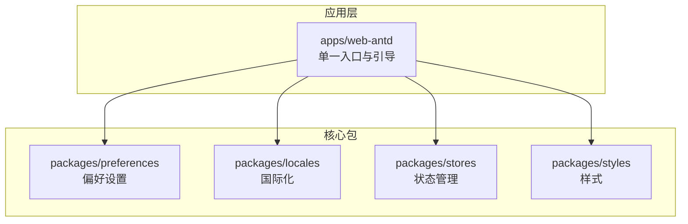
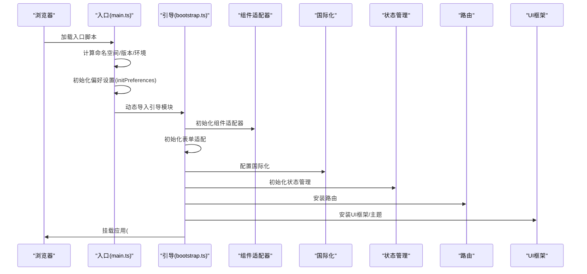
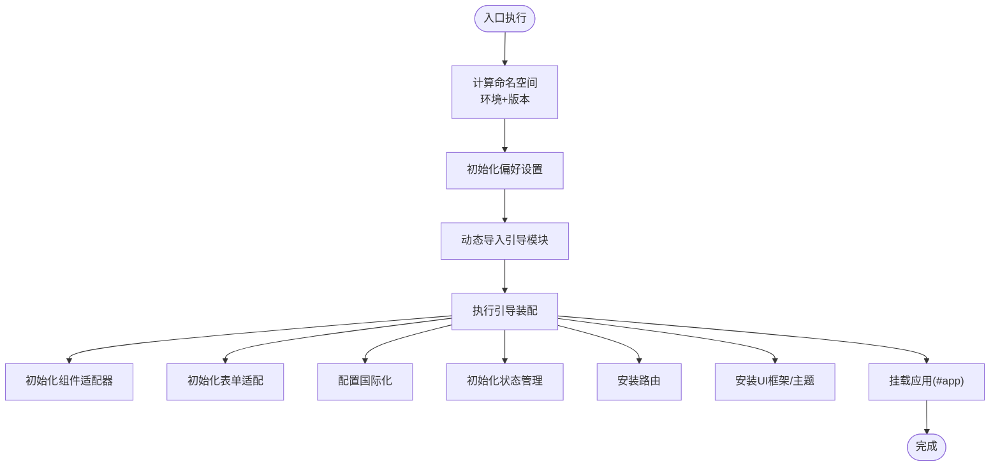
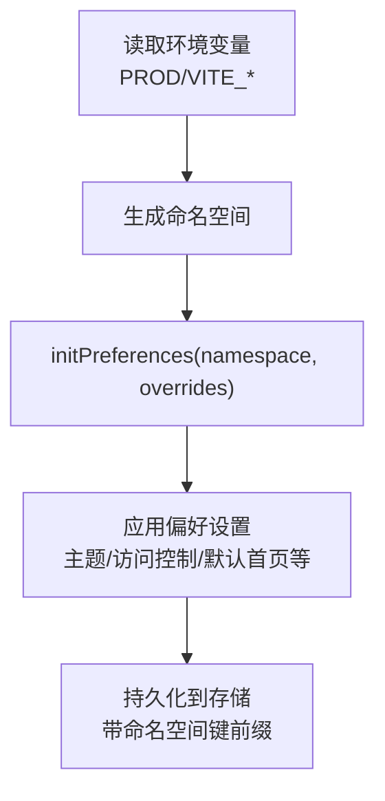
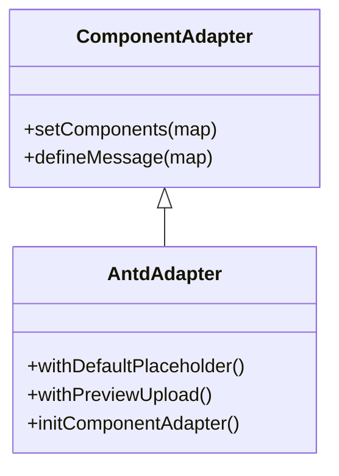
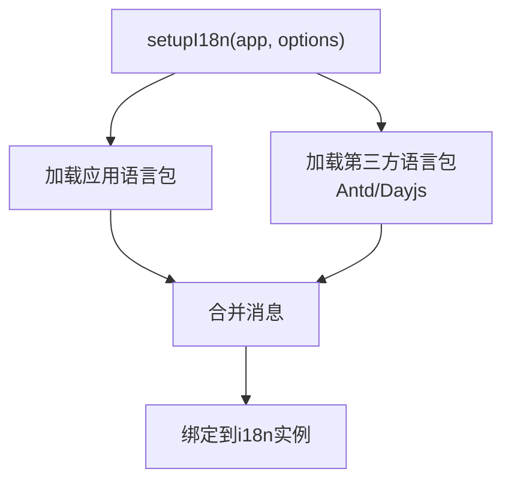
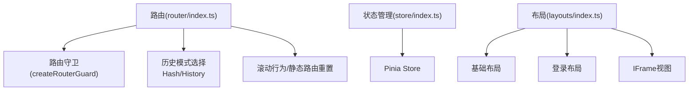
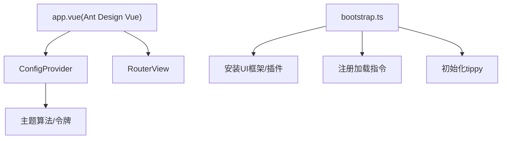
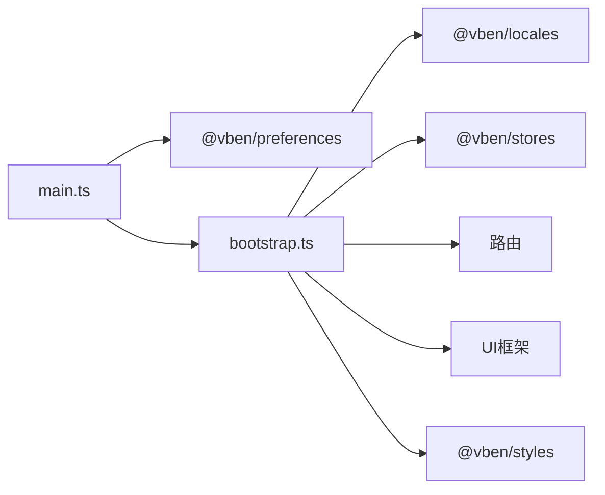

# 应用架构

<cite>
**本文引用的文件**
- [apps/web-antd/src/main.ts](file://apps/web-antd/src/main.ts)
- [apps/web-antd/src/bootstrap.ts](file://apps/web-antd/src/bootstrap.ts)
- [apps/web-antd/src/app.vue](file://apps/web-antd/src/app.vue)
- [apps/web-antd/src/adapter/component/index.ts](file://apps/web-antd/src/adapter/component/index.ts)
- [apps/web-antd/src/preferences.ts](file://apps/web-antd/src/preferences.ts)
- [apps/web-antd/src/router/index.ts](file://apps/web-antd/src/router/index.ts)
- [apps/web-antd/src/store/index.ts](file://apps/web-antd/src/store/index.ts)
- [apps/web-antd/src/locales/index.ts](file://apps/web-antd/src/locales/index.ts)
- [apps/web-antd/src/layouts/index.ts](file://apps/web-antd/src/layouts/index.ts)
- [packages/preferences/src/index.ts](file://packages/preferences/src/index.ts)
- [packages/stores/src/index.ts](file://packages/stores/src/index.ts)
- [packages/locales/src/index.ts](file://packages/locales/src/index.ts)
- [package.json](file://package.json)
</cite>

## 更新摘要

**所做更改**

- 更新项目结构描述，反映从多应用模式向单一应用模式的转变
- 移除了对 web-antdv-next 子应用的引用和相关说明
- 简化了应用架构概述，突出当前单一应用的设计
- 更新了依赖分析部分，反映当前的单一应用架构

## 目录

1. [简介](#简介)
2. [项目结构](#项目结构)
3. [核心组件](#核心组件)
4. [架构总览](#架构总览)
5. [详细组件分析](#详细组件分析)
6. [依赖分析](#依赖分析)
7. [性能考虑](#性能考虑)
8. [故障排查指南](#故障排查指南)
9. [结论](#结论)
10. [附录](#附录)

## 简介

本文件面向 Vben Admin 的单一应用架构，围绕应用初始化流程（从入口文件到装配过程）展开，系统性阐述布局与路由、状态管理、国际化配置，并重点解析通过"适配器模式"对 Ant Design Vue 等 UI 框架的统一抽象与扩展机制。同时给出应用配置体系（运行时配置、构建时配置、环境变量）、模块化设计（功能模块划分、组件组织、依赖注入）以及关键流程图与时序图，帮助开发者快速理解整体设计与落地路径。

**更新** 应用架构已从多应用模式（web-antd、web-ele、web-naive 等）简化为单一应用模式，移除了 web-antdv-next 子应用，简化了整体架构设计。

## 项目结构

Vben Admin 采用单一应用工作区 + 核心包（packages/\*）的分层组织方式：

- 应用层（apps/web-antd）：单一应用入口，包含入口、引导装配、路由、状态、国际化、布局、适配器等。
- 核心包（packages/\*）：提供跨应用复用的能力，如偏好设置、国际化、状态管理、样式、工具等。
- 文档与示例（docs、playground）：提供文档站点、组件演示与测试用例。

下图展示当前单一应用架构下的关系概览：

**图表来源**

- [apps/web-antd/src/main.ts:1-32](file://apps/web-antd/src/main.ts#L1-L32)
- [packages/preferences/src/index.ts:1-18](file://packages/preferences/src/index.ts#L1-L18)
- [packages/locales/src/index.ts:1-31](file://packages/locales/src/index.ts#L1-L31)
- [packages/stores/src/index.ts:1-4](file://packages/stores/src/index.ts#L1-L4)

**章节来源**

- [apps/web-antd/src/main.ts:1-32](file://apps/web-antd/src/main.ts#L1-L32)

## 核心组件

- 应用入口与初始化：应用入口文件负责基于环境变量计算命名空间、初始化偏好设置、按需加载引导模块并执行挂载。
- 引导装配（bootstrap）：在引导阶段完成组件适配器初始化、表单适配、国际化、状态管理、权限指令、tippy、路由安装、主题与动态标题等。
- 偏好设置与配置：通过运行时覆盖配置与命名空间隔离，支持主题、访问控制模式、默认首页等。
- 适配器（Adapter）：以统一接口适配不同 UI 框架的组件与表单，屏蔽差异，便于切换与扩展。
- 国际化：基于 vue-i18n，结合第三方组件库语言包（如 Ant Design Vue、Day.js），实现应用与生态的本地化。
- 路由与状态：路由历史策略可配置，路由守卫统一处理；状态管理通过 Pinia 统一接入。
- 布局系统：基础布局与登录布局按需懒加载，支持 iframe 视图。

**章节来源**

- [apps/web-antd/src/main.ts:9-31](file://apps/web-antd/src/main.ts#L9-L31)
- [apps/web-antd/src/bootstrap.ts:20-82](file://apps/web-antd/src/bootstrap.ts#L20-L82)
- [apps/web-antd/src/preferences.ts:8-30](file://apps/web-antd/src/preferences.ts#L8-L30)
- [apps/web-antd/src/locales/index.ts:93-102](file://apps/web-antd/src/locales/index.ts#L93-L102)
- [apps/web-antd/src/router/index.ts:15-37](file://apps/web-antd/src/router/index.ts#L15-L37)
- [apps/web-antd/src/layouts/index.ts:1-6](file://apps/web-antd/src/layouts/index.ts#L1-L6)

## 架构总览

下图展示应用初始化的端到端生命周期，从入口到装配再到挂载，贯穿偏好设置、国际化、状态管理与 UI 框架集成。

**图表来源**

- [apps/web-antd/src/main.ts:9-31](file://apps/web-antd/src/main.ts#L9-L31)
- [apps/web-antd/src/bootstrap.ts:20-82](file://apps/web-antd/src/bootstrap.ts#L20-L82)

## 详细组件分析

### 应用初始化流程（端到端）

- 入口阶段：读取生产/开发环境与应用版本，拼接命名空间，调用偏好设置初始化，随后动态导入引导模块并执行装配。
- 引导阶段：注册加载指令、国际化、状态管理、权限指令、tippy、路由、UI 插件与主题，最后挂载根节点。
- 动态标题：当启用动态标题时，监听路由元信息与偏好设置，动态组合页面标题。

**图表来源**

- [apps/web-antd/src/main.ts:9-31](file://apps/web-antd/src/main.ts#L9-L31)
- [apps/web-antd/src/bootstrap.ts:20-82](file://apps/web-antd/src/bootstrap.ts#L20-L82)

**章节来源**

- [apps/web-antd/src/main.ts:9-31](file://apps/web-antd/src/main.ts#L9-L31)
- [apps/web-antd/src/bootstrap.ts:20-82](file://apps/web-antd/src/bootstrap.ts#L20-L82)

### 偏好设置与配置系统

- 运行时配置：通过覆盖函数定义项目级偏好，如主题模式、访问控制模式、默认首页、语言切换与时区等。
- 构建时配置：通过环境变量（如应用标题、命名空间、版本、路由历史模式等）参与构建期与运行期行为。
- 命名空间隔离：入口阶段基于环境与版本生成命名空间，避免多实例或多版本共存时的键冲突。

**图表来源**

- [apps/web-antd/src/main.ts:12-20](file://apps/web-antd/src/main.ts#L12-L20)
- [apps/web-antd/src/preferences.ts:8-30](file://apps/web-antd/src/preferences.ts#L8-L30)
- [packages/preferences/src/index.ts:11-13](file://packages/preferences/src/index.ts#L11-L13)

**章节来源**

- [apps/web-antd/src/main.ts:12-20](file://apps/web-antd/src/main.ts#L12-L20)
- [apps/web-antd/src/preferences.ts:8-30](file://apps/web-antd/src/preferences.ts#L8-L30)
- [packages/preferences/src/index.ts:11-13](file://packages/preferences/src/index.ts#L11-L13)

### 适配器模式：统一 UI 框架抽象

- 设计目标：以统一的组件类型与属性约定，屏蔽 Ant Design Vue 等框架的差异，实现组件与表单的跨框架复用。
- 实现要点：
  - 组件适配器：将具体 UI 组件包装为统一的"基础表单组件"，并注入占位符、事件映射、模型绑定等通用能力。
  - 表单适配：统一表单控件的属性、事件与校验集成。
  - 全局共享状态：通过共享状态注册组件映射与消息提示，供上层组件使用。
- 单一框架适配：当前应用仅针对 Ant Design Vue 进行适配，保持对外一致的使用体验。

**图表来源**

- [apps/web-antd/src/adapter/component/index.ts:526-607](file://apps/web-antd/src/adapter/component/index.ts#L526-L607)

**章节来源**

- [apps/web-antd/src/adapter/component/index.ts:526-607](file://apps/web-antd/src/adapter/component/index.ts#L526-L607)

### 国际化配置

- 国际化核心：基于 vue-i18n，加载应用语言包与第三方组件库语言包（Ant Design Vue、Day.js）。
- 语言包加载：从目录动态加载 JSON 语言资源，支持缺失警告与默认语言回退。
- UI 本地化：根据应用偏好设置默认语言，动态切换 UI 组件库与日期库语言。

**图表来源**

- [apps/web-antd/src/locales/index.ts:93-102](file://apps/web-antd/src/locales/index.ts#L93-L102)
- [packages/locales/src/index.ts:1-31](file://packages/locales/src/index.ts#L1-L31)

**章节来源**

- [apps/web-antd/src/locales/index.ts:33-91](file://apps/web-antd/src/locales/index.ts#L33-L91)
- [packages/locales/src/index.ts:1-31](file://packages/locales/src/index.ts#L1-L31)

### 路由系统与状态管理

- 路由：支持 Hash 与 History 两种历史模式，基于环境变量选择；提供滚动行为与静态路由重置。
- 状态：通过 Pinia 统一管理，应用层仅导出模块以便按需引入。
- 布局：基础布局与登录布局按需懒加载，支持 iframe 视图。

**图表来源**

- [apps/web-antd/src/router/index.ts:15-37](file://apps/web-antd/src/router/index.ts#L15-L37)
- [apps/web-antd/src/store/index.ts:1-2](file://apps/web-antd/src/store/index.ts#L1-L2)
- [apps/web-antd/src/layouts/index.ts:1-6](file://apps/web-antd/src/layouts/index.ts#L1-L6)

**章节来源**

- [apps/web-antd/src/router/index.ts:15-37](file://apps/web-antd/src/router/index.ts#L15-L37)
- [apps/web-antd/src/store/index.ts:1-2](file://apps/web-antd/src/store/index.ts#L1-L2)
- [apps/web-antd/src/layouts/index.ts:1-6](file://apps/web-antd/src/layouts/index.ts#L1-L6)

### UI 框架集成与主题

- Ant Design Vue：在应用根组件中通过 ConfigProvider 注入主题算法与令牌，支持暗色与紧凑模式；国际化语言包按语言切换。

**图表来源**

- [apps/web-antd/src/app.vue:16-30](file://apps/web-antd/src/app.vue#L16-L30)
- [apps/web-antd/src/bootstrap.ts:53-61](file://apps/web-antd/src/bootstrap.ts#L53-L61)

**章节来源**

- [apps/web-antd/src/app.vue:16-30](file://apps/web-antd/src/app.vue#L16-L30)
- [apps/web-antd/src/bootstrap.ts:53-61](file://apps/web-antd/src/bootstrap.ts#L53-L61)

## 依赖分析

- 应用层对核心包的依赖：入口与引导阶段广泛依赖偏好设置、国际化、状态管理与样式包。
- 适配器对 UI 框架的依赖：适配器仅在 Ant Design Vue 框架上下文中生效，避免跨框架耦合。
- 路由与状态：路由与状态管理作为横切关注点，被应用层共享。

**更新** 依赖分析已简化为单一应用架构，移除了对多应用模式的依赖关系描述。

**图表来源**

- [apps/web-antd/src/main.ts:1-31](file://apps/web-antd/src/main.ts#L1-L31)
- [apps/web-antd/src/bootstrap.ts:1-82](file://apps/web-antd/src/bootstrap.ts#L1-L82)
- [packages/stores/src/index.ts:1-4](file://packages/stores/src/index.ts#L1-L4)
- [packages/locales/src/index.ts:1-31](file://packages/locales/src/index.ts#L1-L31)

**章节来源**

- [apps/web-antd/src/main.ts:1-31](file://apps/web-antd/src/main.ts#L1-L31)
- [apps/web-antd/src/bootstrap.ts:1-82](file://apps/web-antd/src/bootstrap.ts#L1-L82)
- [packages/stores/src/index.ts:1-4](file://packages/stores/src/index.ts#L1-L4)
- [packages/locales/src/index.ts:1-31](file://packages/locales/src/index.ts#L1-L31)

## 性能考虑

- 按需加载：入口与引导模块均采用动态导入，减少首屏体积。
- 组件异步：适配器内部大量使用异步组件加载，降低初始包体。
- 主题与指令：在引导阶段集中安装，避免重复初始化。
- 路由懒加载：布局与视图组件按需懒加载，提升首屏性能。

## 故障排查指南

- 偏好设置未生效：确认命名空间与覆盖配置正确，必要时清理缓存后重试。
- 国际化语言包缺失：检查语言包目录与加载函数返回值，确保第三方语言包同步加载。
- UI 框架主题异常：检查主题算法与令牌配置，确认暗色/紧凑模式开关与 UI 框架版本兼容性。
- 路由跳转失效：核对路由历史模式与基础路径配置，检查路由守卫逻辑。

**章节来源**

- [apps/web-antd/src/preferences.ts:8-30](file://apps/web-antd/src/preferences.ts#L8-L30)
- [apps/web-antd/src/locales/index.ts:33-91](file://apps/web-antd/src/locales/index.ts#L33-L91)
- [apps/web-antd/src/app.vue:16-30](file://apps/web-antd/src/app.vue#L16-L30)
- [apps/web-antd/src/router/index.ts:15-37](file://apps/web-antd/src/router/index.ts#L15-L37)

## 结论

Vben Admin 通过清晰的入口-引导-挂载生命周期、完善的偏好设置与国际化体系、以及以适配器模式实现的 UI 框架统一抽象，实现了高度模块化与可扩展的应用架构。当前采用单一应用模式，简化了整体架构设计，开发者可在不改变上层使用方式的前提下，灵活切换或扩展 UI 框架，并通过运行时配置与环境变量实现差异化部署与定制。

**更新** 应用架构已成功从多应用模式转向单一应用模式，移除了 web-antdv-next 子应用，简化了整体架构设计，降低了维护复杂度。

## 附录

- 单一应用优势：减少构建配置复杂度、简化部署流程、降低维护成本。
- 最佳实践：优先使用适配器封装 UI 差异；将跨应用通用能力沉淀至核心包；利用命名空间与覆盖配置实现多实例/多版本隔离。
- 未来演进：保持单一应用架构的简洁性，同时为可能的功能扩展预留适配器模式的空间。

**章节来源**

- [package.json:47-51](file://package.json#L47-L51)
