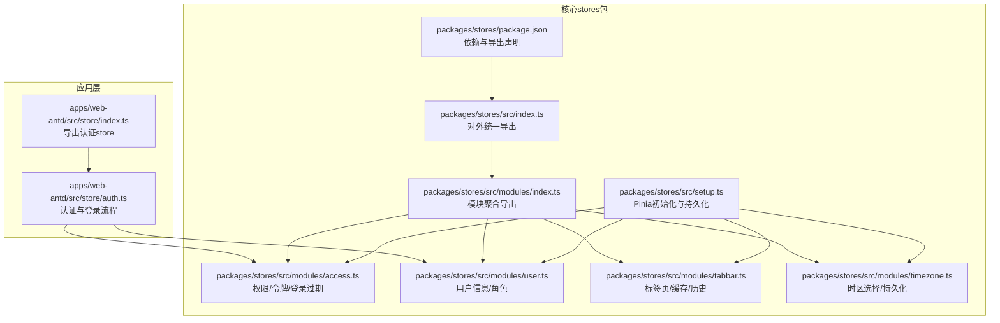
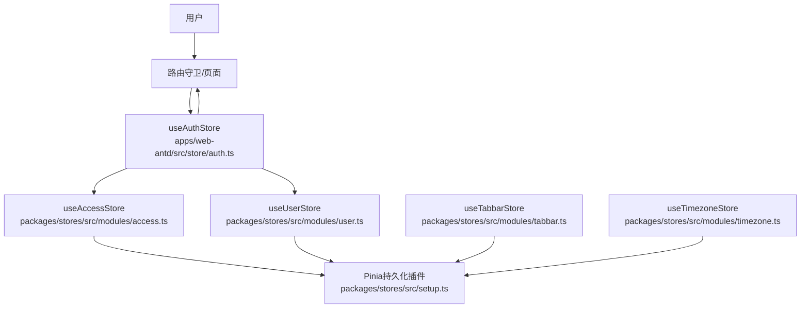
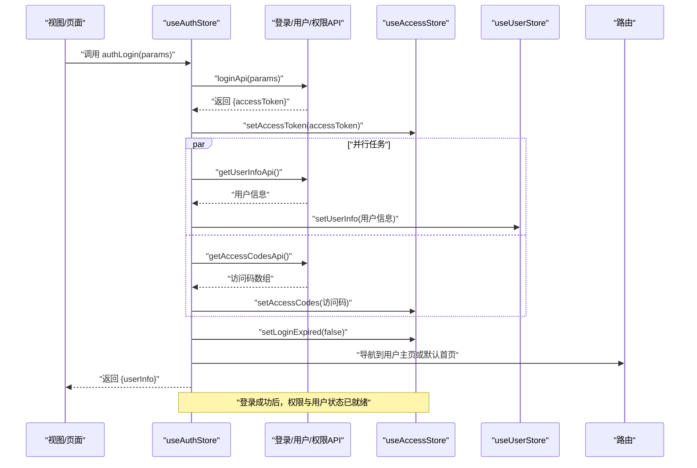
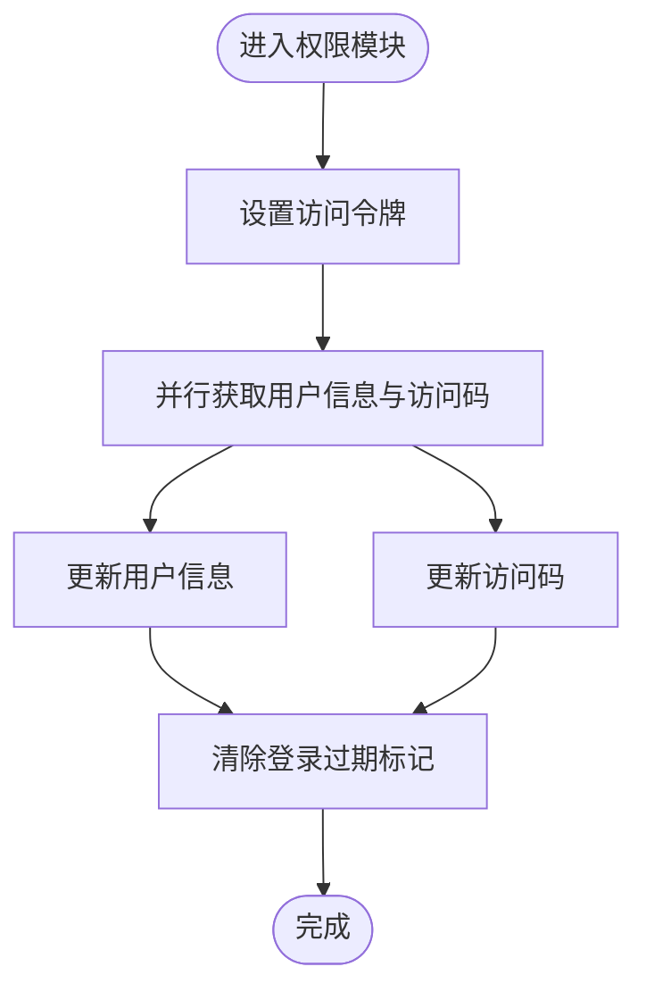
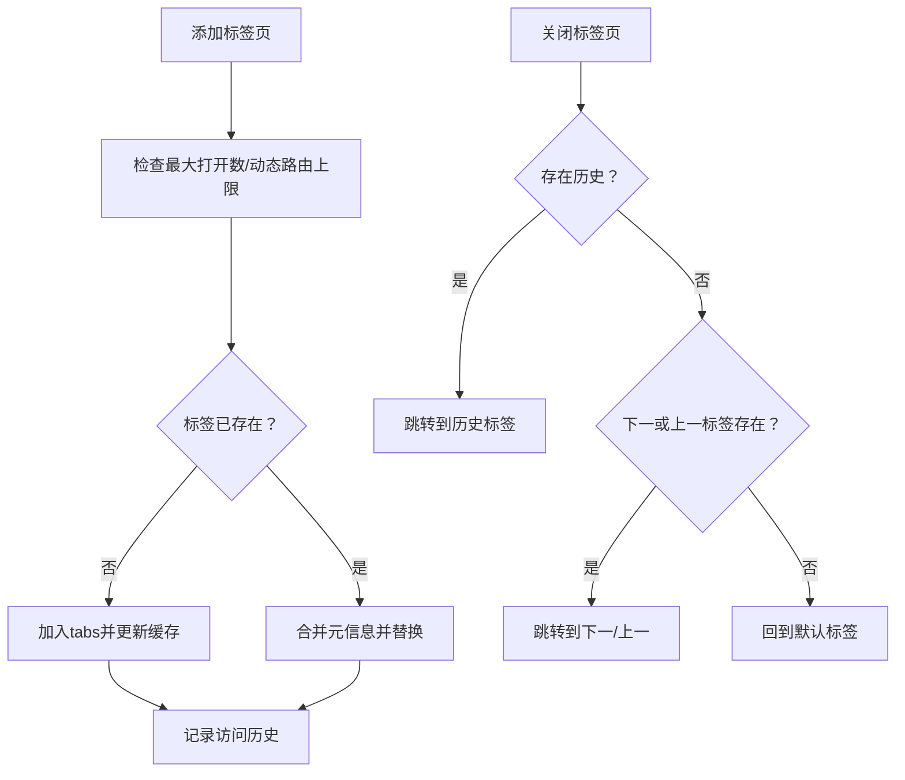
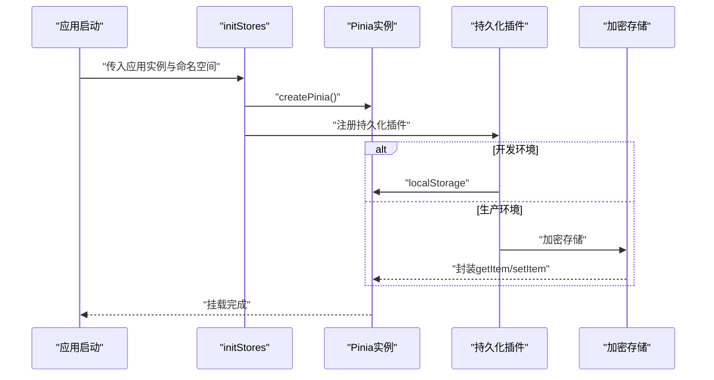
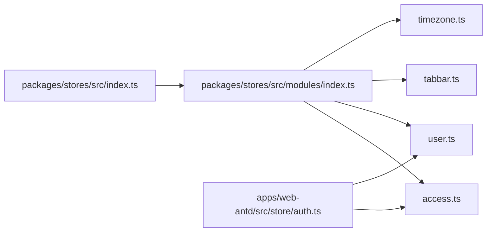

# 状态管理系统

<cite>
**本文引用的文件**
- [apps/web-antd/src/store/index.ts](file://apps/web-antd/src/store/index.ts)
- [apps/web-antd/src/store/auth.ts](file://apps/web-antd/src/store/auth.ts)
- [packages/stores/package.json](file://packages/stores/package.json)
- [packages/stores/src/index.ts](file://packages/stores/src/index.ts)
- [packages/stores/src/modules/index.ts](file://packages/stores/src/modules/index.ts)
- [packages/stores/src/modules/access.ts](file://packages/stores/src/modules/access.ts)
- [packages/stores/src/modules/user.ts](file://packages/stores/src/modules/user.ts)
- [packages/stores/src/modules/tabbar.ts](file://packages/stores/src/modules/tabbar.ts)
- [packages/stores/src/modules/timezone.ts](file://packages/stores/src/modules/timezone.ts)
- [packages/stores/src/setup.ts](file://packages/stores/src/setup.ts)
</cite>

## 目录
1. [简介](#简介)
2. [项目结构](#项目结构)
3. [核心组件](#核心组件)
4. [架构总览](#架构总览)
5. [详细组件分析](#详细组件分析)
6. [依赖关系分析](#依赖关系分析)
7. [性能考量](#性能考量)
8. [故障排查指南](#故障排查指南)
9. [结论](#结论)
10. [附录：使用示例与最佳实践](#附录使用示例与最佳实践)

## 简介
本文件系统性梳理 Vben Admin 的状态管理方案，围绕基于 Pinia 的多模块状态架构展开，重点覆盖以下方面：
- Store 模块组织方式与职责边界
- 响应式更新机制与异步处理模式
- 状态持久化策略与安全存储
- 认证状态管理（用户信息、token、权限、登录过期）
- 模块间依赖与通信机制
- 调试与监控建议
- 使用示例与性能优化建议

## 项目结构
Vben Admin 的状态管理由两部分组成：
- 应用侧 store：封装业务逻辑（如认证），负责与 API 交互、路由跳转、通知提示等。
- 核心 stores 包：提供通用的领域模型（权限、用户、标签页、时区）及统一的 Pinia 初始化与持久化配置。

图表来源
- [apps/web-antd/src/store/auth.ts:1-118](file://apps/web-antd/src/store/auth.ts#L1-L118)
- [apps/web-antd/src/store/index.ts:1-2](file://apps/web-antd/src/store/index.ts#L1-L2)
- [packages/stores/src/setup.ts:1-82](file://packages/stores/src/setup.ts#L1-L82)
- [packages/stores/src/modules/access.ts:1-130](file://packages/stores/src/modules/access.ts#L1-L130)
- [packages/stores/src/modules/user.ts:1-65](file://packages/stores/src/modules/user.ts#L1-L65)
- [packages/stores/src/modules/tabbar.ts:1-770](file://packages/stores/src/modules/tabbar.ts#L1-L770)
- [packages/stores/src/modules/timezone.ts:1-133](file://packages/stores/src/modules/timezone.ts#L1-L133)
- [packages/stores/src/modules/index.ts:1-5](file://packages/stores/src/modules/index.ts#L1-L5)
- [packages/stores/src/index.ts:1-4](file://packages/stores/src/index.ts#L1-L4)
- [packages/stores/package.json:1-33](file://packages/stores/package.json#L1-L33)

章节来源
- [apps/web-antd/src/store/index.ts:1-2](file://apps/web-antd/src/store/index.ts#L1-L2)
- [apps/web-antd/src/store/auth.ts:1-118](file://apps/web-antd/src/store/auth.ts#L1-L118)
- [packages/stores/src/index.ts:1-4](file://packages/stores/src/index.ts#L1-L4)
- [packages/stores/src/modules/index.ts:1-5](file://packages/stores/src/modules/index.ts#L1-L5)
- [packages/stores/src/setup.ts:1-82](file://packages/stores/src/setup.ts#L1-L82)
- [packages/stores/package.json:1-33](file://packages/stores/package.json#L1-L33)

## 核心组件
- 认证 Store（useAuthStore）
  - 职责：登录、登出、获取用户信息、触发路由跳转、展示通知、管理登录加载态。
  - 依赖：Access Store（权限/令牌）、User Store（用户信息）、路由、偏好设置、API。
- 权限 Store（useAccessStore）
  - 职责：维护访问码、菜单、路由、访问状态、登录过期标记、锁屏状态与密码。
  - 持久化：令牌、访问码、锁屏状态与密码等关键字段。
- 用户 Store（useUserStore）
  - 职责：维护用户信息与角色集合。
- 标签页 Store（useTabbarStore）
  - 职责：标签页增删改查、缓存策略、访问历史、刷新控制、固定标签等。
  - 持久化：标签页列表与访问历史（sessionStorage）。
- 时区 Store（useTimezoneStore）
  - 职责：时区选择、默认时区初始化、时区选项获取。
  - 持久化：时区字段。
- Pinia 初始化与持久化（initStores）
  - 职责：创建 Pinia 实例、注入持久化插件、加密存储配置、全局重置工具。

章节来源
- [apps/web-antd/src/store/auth.ts:16-118](file://apps/web-antd/src/store/auth.ts#L16-L118)
- [packages/stores/src/modules/access.ts:51-123](file://packages/stores/src/modules/access.ts#L51-L123)
- [packages/stores/src/modules/user.ts:41-58](file://packages/stores/src/modules/user.ts#L41-L58)
- [packages/stores/src/modules/tabbar.ts:75-657](file://packages/stores/src/modules/tabbar.ts#L75-L657)
- [packages/stores/src/modules/timezone.ts:62-124](file://packages/stores/src/modules/timezone.ts#L62-L124)
- [packages/stores/src/setup.ts:42-82](file://packages/stores/src/setup.ts#L42-L82)

## 架构总览
下图展示了应用层认证 Store 与核心 stores 的交互关系，以及持久化插件如何作用于各模块。

图表来源
- [apps/web-antd/src/store/auth.ts:16-118](file://apps/web-antd/src/store/auth.ts#L16-L118)
- [packages/stores/src/modules/access.ts:51-123](file://packages/stores/src/modules/access.ts#L51-L123)
- [packages/stores/src/modules/user.ts:41-58](file://packages/stores/src/modules/user.ts#L41-L58)
- [packages/stores/src/modules/tabbar.ts:75-657](file://packages/stores/src/modules/tabbar.ts#L75-L657)
- [packages/stores/src/modules/timezone.ts:62-124](file://packages/stores/src/modules/timezone.ts#L62-L124)
- [packages/stores/src/setup.ts:42-82](file://packages/stores/src/setup.ts#L42-L82)

## 详细组件分析

### 认证状态管理（useAuthStore）
- 登录流程
  - 触发登录 API 获取访问令牌。
  - 并行拉取用户信息与访问码，分别写入 User Store 与 Access Store。
  - 清理登录过期标记，按用户主页或默认首页进行路由跳转。
  - 成功后展示通知。
- 登出流程
  - 调用登出 API（忽略异常），重置所有 store，清理登录过期标记。
  - 基于当前路由构造重定向参数，跳转至登录页。
- 用户信息刷新
  - 通过用户信息 API 更新 User Store，并返回用户信息。
- 加载态与重置
  - 维护登录加载态；$reset 用于恢复初始状态。

图表来源
- [apps/web-antd/src/store/auth.ts:28-78](file://apps/web-antd/src/store/auth.ts#L28-L78)
- [packages/stores/src/modules/access.ts:76-96](file://packages/stores/src/modules/access.ts#L76-L96)
- [packages/stores/src/modules/user.ts:42-52](file://packages/stores/src/modules/user.ts#L42-L52)

章节来源
- [apps/web-antd/src/store/auth.ts:16-118](file://apps/web-antd/src/store/auth.ts#L16-L118)

### 权限与令牌（useAccessStore）
- 状态字段
  - 访问码、菜单、路由、访问令牌、刷新令牌、登录过期标记、锁屏状态与密码、访问检查标记。
- 关键动作
  - 设置访问码/菜单/路由/令牌/刷新令牌、登录过期标记、锁屏/解锁。
  - 菜单路径查询辅助函数。
- 持久化策略
  - pick 指定持久化字段：访问令牌、刷新令牌、访问码、锁屏状态与密码，确保跨会话保留必要状态。

图表来源
- [packages/stores/src/modules/access.ts:76-100](file://packages/stores/src/modules/access.ts#L76-L100)
- [packages/stores/src/modules/access.ts:102-111](file://packages/stores/src/modules/access.ts#L102-L111)

章节来源
- [packages/stores/src/modules/access.ts:51-123](file://packages/stores/src/modules/access.ts#L51-L123)

### 用户信息（useUserStore）
- 状态字段
  - 用户信息对象与用户角色数组。
- 关键动作
  - 设置用户信息时同步更新角色集合。
- 用途
  - 为界面渲染、权限判断、通知文案等提供基础数据。

章节来源
- [packages/stores/src/modules/user.ts:41-58](file://packages/stores/src/modules/user.ts#L41-L58)

### 标签页与缓存（useTabbarStore）
- 功能要点
  - 标签页增删改查、固定/取消固定、批量关闭、左右侧关闭、刷新控制、新窗口打开。
  - 缓存策略：基于 keepAlive 与 matched 路由生成缓存集合，支持排除特定标签缓存。
  - 访问历史：基于栈结构记录访问顺序，支持回退。
  - 持久化：标签页列表与访问历史保存在 sessionStorage，序列化/反序列化时重建栈实例。
- 性能注意
  - 深度监听代价高，通过 updateTime 字段触发轻量更新。
  - 刷新时临时排除目标标签缓存，避免不必要的重渲染。

图表来源
- [packages/stores/src/modules/tabbar.ts:132-197](file://packages/stores/src/modules/tabbar.ts#L132-L197)
- [packages/stores/src/modules/tabbar.ts:283-339](file://packages/stores/src/modules/tabbar.ts#L283-L339)
- [packages/stores/src/modules/tabbar.ts:612-635](file://packages/stores/src/modules/tabbar.ts#L612-L635)

章节来源
- [packages/stores/src/modules/tabbar.ts:75-657](file://packages/stores/src/modules/tabbar.ts#L75-L657)

### 时区（useTimezoneStore）
- 功能要点
  - 提供默认时区处理器与自定义处理器合并能力。
  - 初始化时区：优先从自定义处理器获取，否则使用默认选项。
  - 设置时区：持久化并更新全局 dayjs 时区。
- 持久化策略
  - pick 持久化时区字段。

章节来源
- [packages/stores/src/modules/timezone.ts:62-124](file://packages/stores/src/modules/timezone.ts#L62-L124)

### Pinia 初始化与持久化（initStores）
- 初始化流程
  - 创建 Pinia 实例。
  - 注入持久化插件，支持本地开发与生产环境不同存储介质。
  - 生产环境使用加密存储（secure-ls），通过密钥与压缩配置提升安全性。
  - 通过命名空间隔离多应用之间的持久化键。
- 全局重置
  - 提供 resetAllStores，遍历所有 store 执行 $reset，便于登出或切换用户后快速清空状态。

图表来源
- [packages/stores/src/setup.ts:42-82](file://packages/stores/src/setup.ts#L42-L82)

章节来源
- [packages/stores/src/setup.ts:1-82](file://packages/stores/src/setup.ts#L1-L82)

## 依赖关系分析
- 模块聚合导出
  - 核心 stores 通过 modules/index.ts 聚合导出，再由 src/index.ts 对外统一导出，便于应用侧按需引入。
- 应用层依赖
  - 认证 Store 在应用层直接依赖核心 stores 的权限与用户模块，形成清晰的业务-领域分层。
- 外部依赖
  - Pinia、pinia-plugin-persistedstate、secure-ls、vue、vue-router 等。

图表来源
- [packages/stores/src/index.ts:1-4](file://packages/stores/src/index.ts#L1-L4)
- [packages/stores/src/modules/index.ts:1-5](file://packages/stores/src/modules/index.ts#L1-L5)
- [apps/web-antd/src/store/auth.ts:16-118](file://apps/web-antd/src/store/auth.ts#L16-L118)

章节来源
- [packages/stores/src/index.ts:1-4](file://packages/stores/src/index.ts#L1-L4)
- [packages/stores/src/modules/index.ts:1-5](file://packages/stores/src/modules/index.ts#L1-L5)
- [packages/stores/package.json:16-31](file://packages/stores/package.json#L16-L31)

## 性能考量
- 响应式与渲染
  - 使用 Vue 响应式 ref 与 getters，避免不必要的深度监听；对频繁更新场景采用轻量字段（如 updateTime）驱动更新。
- 异步与并发
  - 登录阶段使用 Promise.all 并行获取用户信息与访问码，缩短首屏等待时间。
- 缓存与标签页
  - 标签页缓存仅针对 keepAlive 的路由，减少无效缓存；刷新时临时排除目标标签，降低重渲染成本。
- 存储与安全
  - 生产环境启用加密存储，避免明文敏感信息；持久化字段精简，减少 IO 开销。
- 调试与可观测
  - 建议在开发环境开启 Pinia Devtools，结合持久化键命名空间定位问题。

## 故障排查指南
- 登录后无权限或菜单为空
  - 检查登录流程是否正确调用并行获取用户信息与访问码；确认 Access Store 的访问码与菜单已写入。
- 登录过期导致反复跳转
  - 确认登录成功后是否调用清理登录过期标记；检查路由守卫中对登录过期的处理。
- 标签页无法关闭或刷新异常
  - 检查 keepAlive 与 matched 配置；确认刷新时排除逻辑是否生效；核对访问历史栈状态。
- 时区未生效
  - 确认初始化时区流程执行且自定义处理器返回有效时区；检查持久化字段是否正确写入。
- 登出后状态未清空
  - 确认调用 resetAllStores 并在路由跳转前执行；检查各模块 $reset 的实现。

章节来源
- [apps/web-antd/src/store/auth.ts:80-98](file://apps/web-antd/src/store/auth.ts#L80-L98)
- [packages/stores/src/modules/access.ts:91-92](file://packages/stores/src/modules/access.ts#L91-L92)
- [packages/stores/src/modules/tabbar.ts:403-431](file://packages/stores/src/modules/tabbar.ts#L403-L431)
- [packages/stores/src/modules/timezone.ts:71-101](file://packages/stores/src/modules/timezone.ts#L71-L101)
- [packages/stores/src/setup.ts:72-81](file://packages/stores/src/setup.ts#L72-L81)

## 结论
Vben Admin 的状态管理以 Pinia 为核心，采用“应用层业务逻辑 + 核心领域模型”的分层设计，配合统一的持久化与加密存储策略，实现了认证、权限、用户、标签页与时区等关键领域的稳定与可维护性。通过并行异步处理与精细化缓存策略，兼顾了用户体验与性能表现。建议在实际项目中遵循本文档的模块边界、持久化策略与调试建议，持续优化状态管理体验。

## 附录：使用示例与最佳实践
- 在应用入口初始化 Pinia 与持久化
  - 参考路径：[packages/stores/src/setup.ts:42-82](file://packages/stores/src/setup.ts#L42-L82)
- 在页面中使用认证 Store
  - 登录：调用登录方法并处理成功回调与路由跳转
    - 参考路径：[apps/web-antd/src/store/auth.ts:28-78](file://apps/web-antd/src/store/auth.ts#L28-L78)
  - 登出：调用登出方法并重置所有 store
    - 参考路径：[apps/web-antd/src/store/auth.ts:80-98](file://apps/web-antd/src/store/auth.ts#L80-L98)
- 在组件中读取用户信息与权限
  - 读取用户信息与角色
    - 参考路径：[packages/stores/src/modules/user.ts:42-52](file://packages/stores/src/modules/user.ts#L42-L52)
  - 读取访问码与菜单
    - 参考路径：[packages/stores/src/modules/access.ts:76-81](file://packages/stores/src/modules/access.ts#L76-L81)
- 管理标签页与缓存
  - 添加/关闭标签页、刷新、固定标签
    - 参考路径：[packages/stores/src/modules/tabbar.ts:132-197](file://packages/stores/src/modules/tabbar.ts#L132-L197)
    - 参考路径：[packages/stores/src/modules/tabbar.ts:283-339](file://packages/stores/src/modules/tabbar.ts#L283-L339)
    - 参考路径：[packages/stores/src/modules/tabbar.ts:403-431](file://packages/stores/src/modules/tabbar.ts#L403-L431)
- 时区设置与持久化
  - 初始化与设置时区
    - 参考路径：[packages/stores/src/modules/timezone.ts:71-101](file://packages/stores/src/modules/timezone.ts#L71-L101)
  - 持久化字段
    - 参考路径：[packages/stores/src/modules/timezone.ts:119-123](file://packages/stores/src/modules/timezone.ts#L119-L123)
- 最佳实践
  - 将登录成功后的路由跳转放在 Promise.all 完成之后，确保权限与用户信息已就绪
    - 参考路径：[apps/web-antd/src/store/auth.ts:43-61](file://apps/web-antd/src/store/auth.ts#L43-L61)
  - 登出时统一调用 resetAllStores，避免残留状态影响新用户
    - 参考路径：[apps/web-antd/src/store/auth.ts:86-87](file://apps/web-antd/src/store/auth.ts#L86-L87)
  - 仅对必要的字段进行持久化，减少存储体积与 IO
    - 参考路径：[packages/stores/src/modules/access.ts:102-111](file://packages/stores/src/modules/access.ts#L102-L111)
    - 参考路径：[packages/stores/src/modules/tabbar.ts:612-635](file://packages/stores/src/modules/tabbar.ts#L612-L635)
    - 参考路径：[packages/stores/src/modules/timezone.ts:119-123](file://packages/stores/src/modules/timezone.ts#L119-L123)