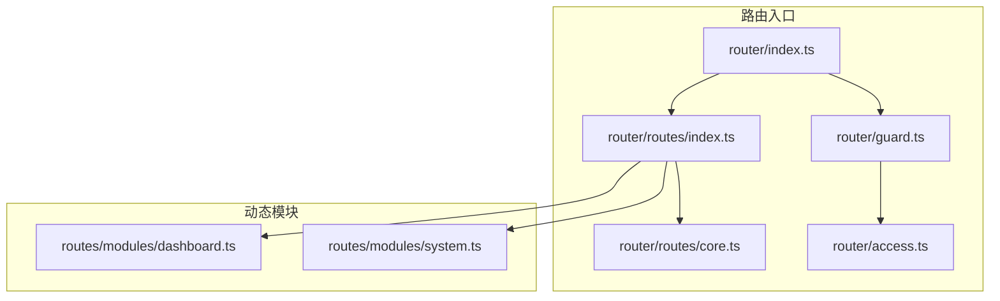
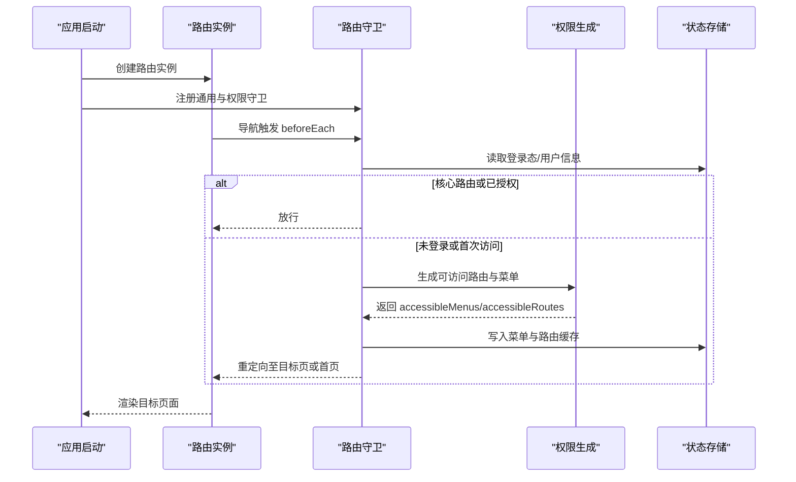
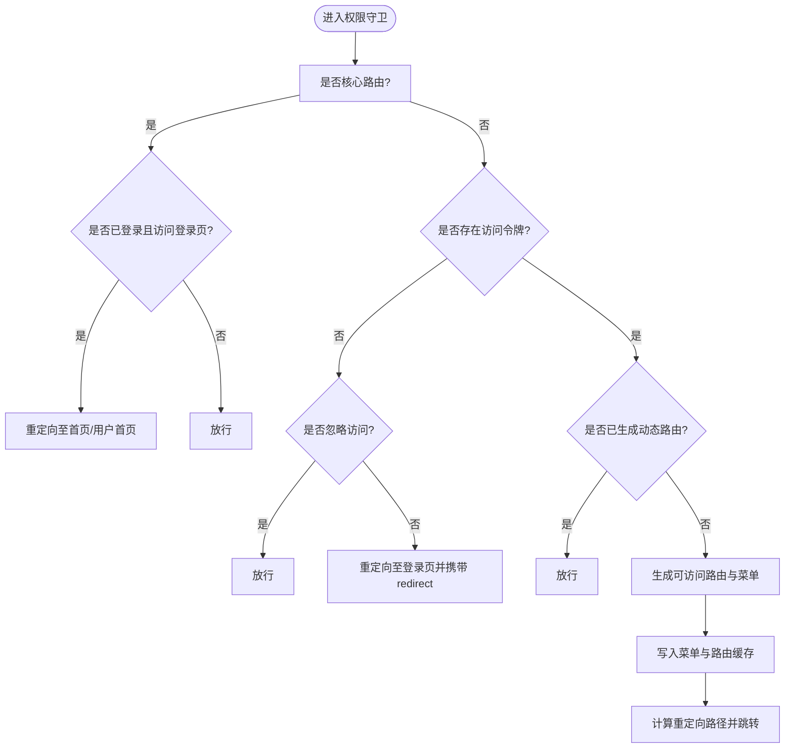
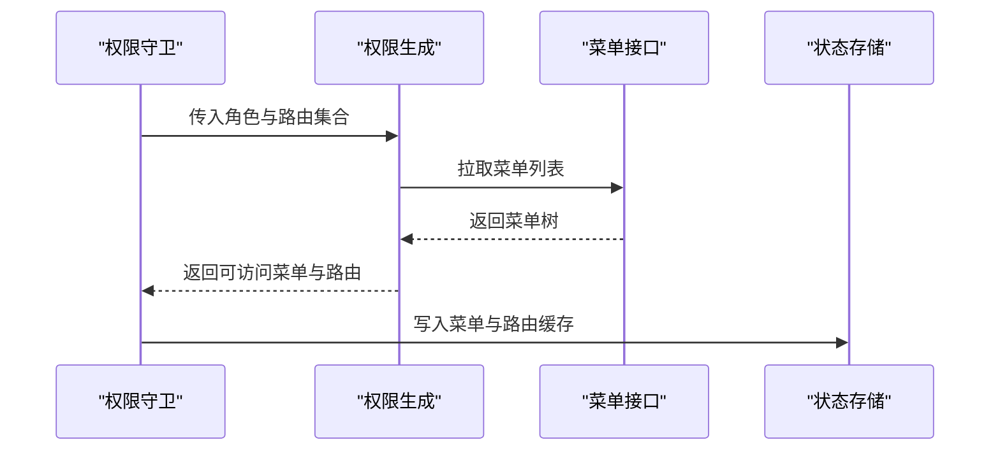
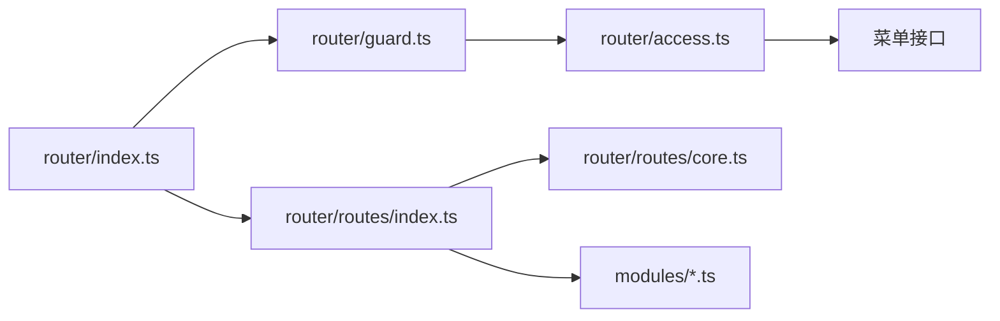

# 路由系统设计

<cite>
**本文引用的文件**
- [playground/src/router/index.ts](file://playground/src/router/index.ts)
- [playground/src/router/guard.ts](file://playground/src/router/guard.ts)
- [playground/src/router/access.ts](file://playground/src/router/access.ts)
- [playground/src/router/routes/index.ts](file://playground/src/router/routes/index.ts)
- [playground/src/router/routes/core.ts](file://playground/src/router/routes/core.ts)
- [playground/src/router/routes/modules/dashboard.ts](file://playground/src/router/routes/modules/dashboard.ts)
- [playground/src/router/routes/modules/system.ts](file://playground/src/router/routes/modules/system.ts)
- [apps/web-antd/src/router/index.ts](file://apps/web-antd/src/router/index.ts)
- [apps/web-antd/src/router/guard.ts](file://apps/web-antd/src/router/guard.ts)
- [apps/web-antd/src/router/access.ts](file://apps/web-antd/src/router/access.ts)
- [apps/web-antd/src/router/routes/index.ts](file://apps/web-antd/src/router/routes/index.ts)
</cite>

## 目录
1. [引言](#引言)
2. [项目结构](#项目结构)
3. [核心组件](#核心组件)
4. [架构总览](#架构总览)
5. [详细组件分析](#详细组件分析)
6. [依赖分析](#依赖分析)
7. [性能考虑](#性能考虑)
8. [故障排查指南](#故障排查指南)
9. [结论](#结论)
10. [附录](#附录)

## 引言
本文件面向 Vben Admin 的路由系统，系统性阐述其模块化路由设计、动态路由生成机制、路由守卫的安全策略、路由与菜单的联动关系、路由懒加载与参数处理，以及最佳实践与常见问题。内容基于 Playground 与 Web-Antd 两套前端应用的路由实现进行归纳总结，帮助开发者快速理解并高效扩展路由体系。

## 项目结构
Vben Admin 在多套前端应用中复用一致的路由架构：统一的路由入口、守卫配置、动态路由聚合与权限生成逻辑。Playground 与 Web-Antd 的路由目录结构如下：

图表来源
- [playground/src/router/index.ts:1-38](file://playground/src/router/index.ts#L1-L38)
- [playground/src/router/routes/index.ts:1-48](file://playground/src/router/routes/index.ts#L1-L48)
- [playground/src/router/routes/core.ts:1-98](file://playground/src/router/routes/core.ts#L1-L98)
- [playground/src/router/guard.ts:1-137](file://playground/src/router/guard.ts#L1-L137)
- [playground/src/router/access.ts:1-43](file://playground/src/router/access.ts#L1-L43)
- [playground/src/router/routes/modules/dashboard.ts:1-40](file://playground/src/router/routes/modules/dashboard.ts#L1-L40)
- [playground/src/router/routes/modules/system.ts:1-47](file://playground/src/router/routes/modules/system.ts#L1-L47)

章节来源
- [playground/src/router/index.ts:1-38](file://playground/src/router/index.ts#L1-L38)
- [playground/src/router/routes/index.ts:1-48](file://playground/src/router/routes/index.ts#L1-L48)
- [playground/src/router/routes/core.ts:1-98](file://playground/src/router/routes/core.ts#L1-L98)
- [apps/web-antd/src/router/index.ts:1-38](file://apps/web-antd/src/router/index.ts#L1-L38)
- [apps/web-antd/src/router/routes/index.ts:1-48](file://apps/web-antd/src/router/routes/index.ts#L1-L48)

## 核心组件
- 路由实例与历史模式
  - 通过路由入口创建 Vue Router 实例，支持 Hash 与 HTML5 History 两种历史模式，依据环境变量选择。
  - 配置滚动行为与默认首页重定向，确保良好的用户体验。
- 路由初始化与重置
  - 初始化时注入静态路由与守卫；提供重置静态路由能力，便于运行时更新。
- 守卫体系
  - 通用守卫：记录页面加载状态、按需开启进度条。
  - 权限守卫：核心路由豁免、登录态校验、动态路由生成、权限菜单注入、重定向回跳。
- 动态路由与菜单生成
  - 通过模块化收集动态路由，结合权限计算生成可访问菜单与路由。
  - 支持按需懒加载页面与布局组件，提升首屏性能。
- 菜单联动
  - 动态生成的菜单与路由保持一致，支持隐藏、排序、图标、面包屑等元信息同步。

章节来源
- [playground/src/router/index.ts:1-38](file://playground/src/router/index.ts#L1-L38)
- [playground/src/router/guard.ts:1-137](file://playground/src/router/guard.ts#L1-L137)
- [playground/src/router/access.ts:1-43](file://playground/src/router/access.ts#L1-L43)
- [playground/src/router/routes/index.ts:1-48](file://playground/src/router/routes/index.ts#L1-L48)
- [playground/src/router/routes/core.ts:1-98](file://playground/src/router/routes/core.ts#L1-L98)

## 架构总览
下图展示从路由初始化到权限校验、动态路由生成与菜单注入的整体流程：

图表来源
- [playground/src/router/index.ts:1-38](file://playground/src/router/index.ts#L1-L38)
- [playground/src/router/guard.ts:1-137](file://playground/src/router/guard.ts#L1-L137)
- [playground/src/router/access.ts:1-43](file://playground/src/router/access.ts#L1-L43)
- [apps/web-antd/src/router/guard.ts:1-133](file://apps/web-antd/src/router/guard.ts#L1-L133)
- [apps/web-antd/src/router/access.ts:1-54](file://apps/web-antd/src/router/access.ts#L1-L54)

## 详细组件分析

### 路由入口与初始化
- 历史模式选择：根据环境变量决定 Hash 或 History 模式，并支持基础路径配置。
- 静态路由注入：将核心路由、外部路由与兜底 404 合并注入。
- 进度条与滚动行为：在导航前开启进度条，在导航后关闭；支持锚点平滑滚动与位置恢复。
- 重置静态路由：提供工具方法，便于运行时替换或刷新静态路由集合。

章节来源
- [playground/src/router/index.ts:1-38](file://playground/src/router/index.ts#L1-L38)
- [apps/web-antd/src/router/index.ts:1-38](file://apps/web-antd/src/router/index.ts#L1-L38)

### 路由守卫实现
- 通用守卫
  - 记录页面加载状态，避免重复执行进入/离开动画。
  - 按偏好开启/关闭进度条，提升交互反馈。
- 权限守卫
  - 核心路由豁免：如登录页、验证码登录、二维码登录、忘记密码、注册等无需鉴权。
  - 登录态校验：无 Token 且非忽略访问时，重定向至登录页并携带 redirect 参数。
  - 首次访问生成动态路由：拉取用户信息与角色，调用权限生成器，写入菜单与路由缓存。
  - 重定向策略：优先使用来源页 redirect，其次使用用户首页或默认首页，最后回退到目标页。
  - 已授权放行：若已生成过动态路由则直接放行。

图表来源
- [playground/src/router/guard.ts:1-137](file://playground/src/router/guard.ts#L1-L137)
- [apps/web-antd/src/router/guard.ts:1-133](file://apps/web-antd/src/router/guard.ts#L1-L133)

章节来源
- [playground/src/router/guard.ts:1-137](file://playground/src/router/guard.ts#L1-L137)
- [apps/web-antd/src/router/guard.ts:1-133](file://apps/web-antd/src/router/guard.ts#L1-L133)

### 动态路由与菜单生成
- 动态路由聚合
  - 通过模块扫描收集动态路由文件，合并为完整路由表。
  - 组件键集合用于构建页面映射，便于懒加载与权限匹配。
- 权限生成
  - 读取菜单列表（异步），构建可访问菜单树与路由树。
  - 支持布局映射与页面映射，按访问模式生成最终结果。
  - 提供“无权限”占位组件，支持菜单可见但禁止访问的场景。
- 菜单联动
  - 生成的菜单与路由保持一致，元信息（图标、排序、隐藏等）同步。

图表来源
- [playground/src/router/access.ts:1-43](file://playground/src/router/access.ts#L1-L43)
- [apps/web-antd/src/router/access.ts:1-54](file://apps/web-antd/src/router/access.ts#L1-L54)

章节来源
- [playground/src/router/routes/index.ts:1-48](file://playground/src/router/routes/index.ts#L1-L48)
- [playground/src/router/access.ts:1-43](file://playground/src/router/access.ts#L1-L43)
- [apps/web-antd/src/router/access.ts:1-54](file://apps/web-antd/src/router/access.ts#L1-L54)

### 核心路由与业务路由组织
- 核心路由
  - 根路由与全局 404 路由，保证应用基础布局与兜底能力。
  - 认证相关路由（登录、验证码登录、二维码登录、忘记密码、注册）置于独立分组，无需鉴权。
- 业务路由模块
  - 仪表盘与系统管理等业务模块以独立文件组织，便于扩展与维护。
  - 子路由支持固定标签页、图标、标题、keep-alive 等元信息。

章节来源
- [playground/src/router/routes/core.ts:1-98](file://playground/src/router/routes/core.ts#L1-L98)
- [playground/src/router/routes/modules/dashboard.ts:1-40](file://playground/src/router/routes/modules/dashboard.ts#L1-L40)
- [playground/src/router/routes/modules/system.ts:1-47](file://playground/src/router/routes/modules/system.ts#L1-L47)

### 路由懒加载与参数处理
- 懒加载
  - 页面与布局组件采用动态导入，按需加载，降低首屏体积。
- 查询参数与重定向
  - 登录页接收 redirect 参数，登录成功后回跳至原目标页。
  - 首页与用户首页优先级高于目标页，确保合理的重定向顺序。
- 锚点与滚动
  - 支持锚点平滑滚动与位置恢复，改善用户体验。

章节来源
- [playground/src/router/index.ts:1-38](file://playground/src/router/index.ts#L1-L38)
- [playground/src/router/guard.ts:1-137](file://playground/src/router/guard.ts#L1-L137)
- [apps/web-antd/src/router/guard.ts:1-133](file://apps/web-antd/src/router/guard.ts#L1-L133)

## 依赖分析
- 组件耦合
  - 路由入口仅依赖路由配置与守卫；守卫依赖状态存储与权限生成；权限生成依赖菜单接口与布局/页面映射。
- 外部依赖
  - 基于 vue-router 的导航钩子与路由表结构。
  - 借助工具库进行模块合并、树遍历与组件懒加载。
- 可能的循环依赖
  - 路由与守卫之间为单向依赖，权限生成器通过回调拉取数据，避免循环。

图表来源
- [playground/src/router/index.ts:1-38](file://playground/src/router/index.ts#L1-L38)
- [playground/src/router/routes/index.ts:1-48](file://playground/src/router/routes/index.ts#L1-L48)
- [playground/src/router/guard.ts:1-137](file://playground/src/router/guard.ts#L1-L137)
- [playground/src/router/access.ts:1-43](file://playground/src/router/access.ts#L1-L43)
- [playground/src/router/routes/core.ts:1-98](file://playground/src/router/routes/core.ts#L1-L98)

章节来源
- [playground/src/router/index.ts:1-38](file://playground/src/router/index.ts#L1-L38)
- [playground/src/router/routes/index.ts:1-48](file://playground/src/router/routes/index.ts#L1-L48)
- [playground/src/router/guard.ts:1-137](file://playground/src/router/guard.ts#L1-L137)
- [playground/src/router/access.ts:1-43](file://playground/src/router/access.ts#L1-L43)

## 性能考虑
- 懒加载与按需导入：页面与布局组件均采用动态导入，减少初始包体。
- 进度条与滚动优化：导航前后对进度条进行启停控制，锚点滚动采用平滑行为，兼顾体验与性能。
- 首屏渲染：核心路由与基础布局优先加载，业务模块按需加载，缩短首屏时间。
- 路由缓存：权限生成结果与菜单缓存避免重复计算与请求。

## 故障排查指南
- 登录后无法跳回原页面
  - 检查登录页是否正确接收 redirect 参数，确认守卫中的重定向逻辑。
  - 章节来源: [playground/src/router/guard.ts:1-137](file://playground/src/router/guard.ts#L1-L137)
- 无权限页面未显示
  - 确认权限生成器是否返回了“无权限”占位组件，并检查菜单可见性配置。
  - 章节来源: [playground/src/router/access.ts:1-43](file://playground/src/router/access.ts#L1-L43)
- 动态路由不生效
  - 检查动态模块文件是否被正确扫描与合并，确认权限生成器已写入缓存。
  - 章节来源: [playground/src/router/routes/index.ts:1-48](file://playground/src/router/routes/index.ts#L1-L48)
- 历史模式异常
  - 检查环境变量与基础路径配置，确保 Hash 与 History 模式选择一致。
  - 章节来源: [playground/src/router/index.ts:1-38](file://playground/src/router/index.ts#L1-L38)

## 结论
Vben Admin 的路由系统通过模块化组织、动态路由生成与完善的守卫机制，实现了高扩展性的权限控制与菜单联动。配合懒加载与进度条优化，既保证了开发效率，也提升了用户体验。建议在扩展新模块时遵循现有目录规范与元信息约定，确保路由与菜单的一致性与可维护性。

## 附录
- 最佳实践
  - 将业务路由拆分为独立模块文件，便于维护与测试。
  - 在路由元信息中明确图标、排序、隐藏与 keep-alive 等属性，确保菜单与页面一致。
  - 对关键页面启用懒加载，控制首屏体积。
  - 在登录页与权限相关页面合理使用 ignoreAccess 与 redirect 参数。
- 常见问题
  - 路由未生效：检查模块扫描与合并逻辑，确认动态路由已注入。
  - 权限不正确：核对角色与菜单接口返回值，确保权限生成器正确写入缓存。
  - 历史模式 404：检查基础路径与服务器配置，确保 History 模式可用。