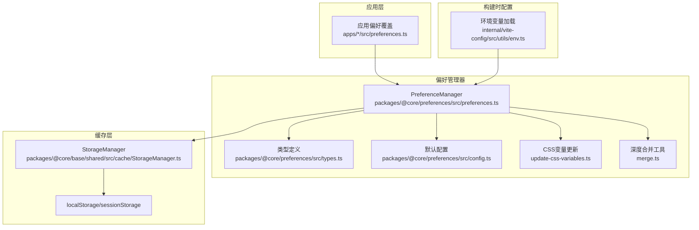
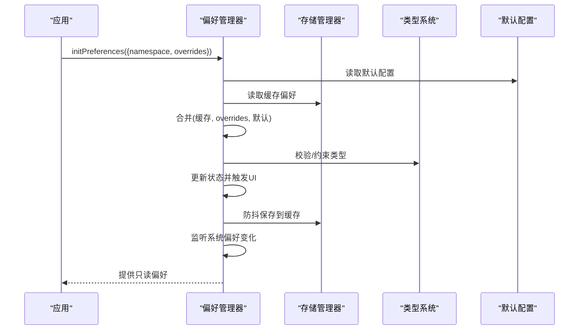
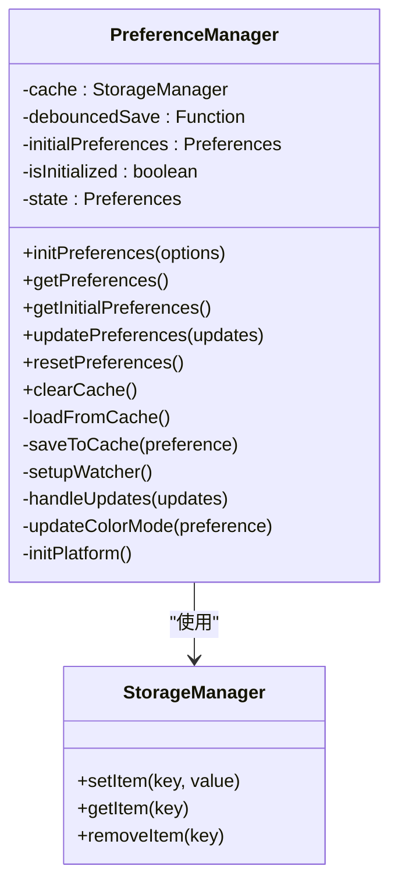
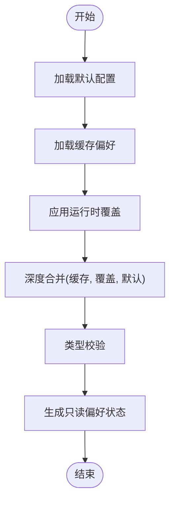
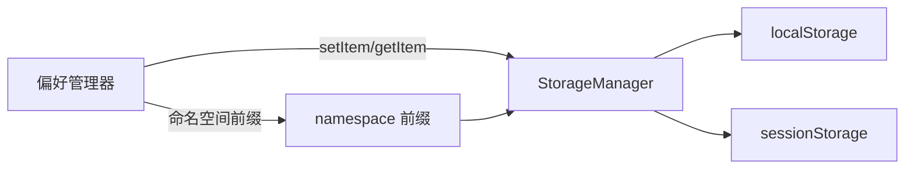
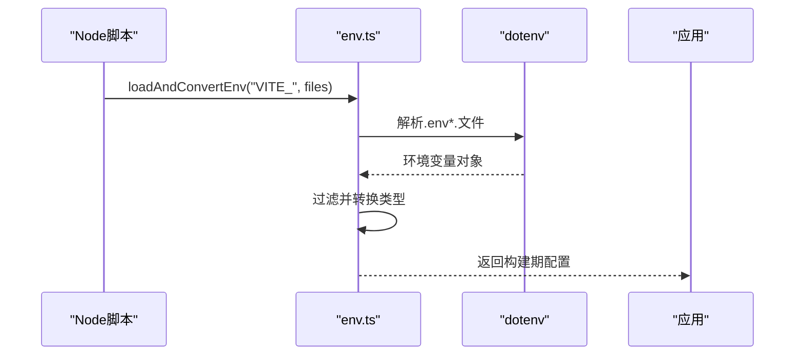
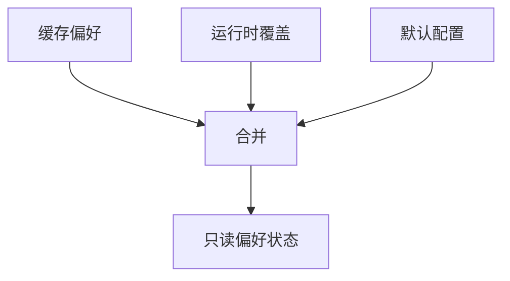
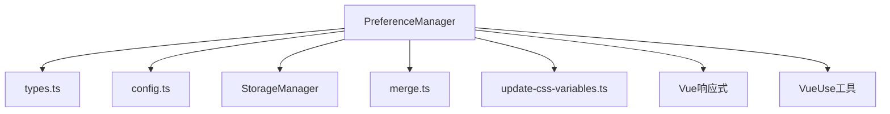

# 配置系统架构

<cite>
**本文引用的文件**
- [packages/@core/preferences/src/preferences.ts](file://packages/@core/preferences/src/preferences.ts)
- [packages/@core/preferences/src/types.ts](file://packages/@core/preferences/src/types.ts)
- [packages/@core/preferences/src/config.ts](file://packages/@core/preferences/src/config.ts)
- [packages/@core/preferences/src/update-css-variables.ts](file://packages/@core/preferences/src/update-css-variables.ts)
- [packages/@core/preferences/src/merge.ts](file://packages/@core/preferences/src/merge.ts)
- [packages/@core/base/shared/src/cache/StorageManager.ts](file://packages/@core/base/shared/src/cache/StorageManager.ts)
- [internal/vite-config/src/utils/env.ts](file://internal/vite-config/src/utils/env.ts)
- [apps/web-antd/src/preferences.ts](file://apps/web-antd/src/preferences.ts)
- [apps/web-antdv-next/src/preferences.ts](file://apps/web-antdv-next/src/preferences.ts)
- [apps/web-ele/src/preferences.ts](file://apps/web-ele/src/preferences.ts)
- [apps/web-naive/src/preferences.ts](file://apps/web-naive/src/preferences.ts)
- [apps/web-tdesign/src/preferences.ts](file://apps/web-tdesign/src/preferences.ts)
- [playground/src/preferences.ts](file://playground/src/preferences.ts)
</cite>

## 目录

1. [引言](#引言)
2. [项目结构](#项目结构)
3. [核心组件](#核心组件)
4. [架构总览](#架构总览)
5. [详细组件分析](#详细组件分析)
6. [依赖分析](#依赖分析)
7. [性能考虑](#性能考虑)
8. [故障排查指南](#故障排查指南)
9. [结论](#结论)
10. [附录](#附录)

## 引言

本文件系统性梳理 Vben Admin 的配置系统架构，重点围绕“应用偏好”的层次结构、优先级与继承关系，配置的存储机制（localStorage/sessionStorage 的使用策略）、版本与迁移思路，类型系统与验证规则、默认值处理方式，以及扩展与自定义配置项的添加流程。目标是帮助开发者在不深入源码的情况下，也能高效理解并正确使用配置系统。

## 项目结构

配置系统主要由三层构成：

- 运行时配置层：通过偏好管理器在内存中维护当前应用偏好，并持久化到浏览器缓存。
- 构建时配置层：通过 Vite 环境变量加载与转换，形成构建期可用的配置片段。
- 环境变量配置层：以 .env 文件与 import.meta.env 为代表的运行时环境变量注入。

图表来源

- [packages/@core/preferences/src/preferences.ts:25-230](file://packages/@core/preferences/src/preferences.ts#L25-L230)
- [packages/@core/preferences/src/types.ts:296-348](file://packages/@core/preferences/src/types.ts#L296-L348)
- [packages/@core/preferences/src/config.ts:3-145](file://packages/@core/preferences/src/config.ts#L3-L145)
- [packages/@core/base/shared/src/cache/StorageManager.ts](file://packages/@core/base/shared/src/cache/StorageManager.ts)
- [internal/vite-config/src/utils/env.ts:66-108](file://internal/vite-config/src/utils/env.ts#L66-L108)

章节来源

- [packages/@core/preferences/src/preferences.ts:25-230](file://packages/@core/preferences/src/preferences.ts#L25-L230)
- [packages/@core/preferences/src/types.ts:296-348](file://packages/@core/preferences/src/types.ts#L296-L348)
- [packages/@core/preferences/src/config.ts:3-145](file://packages/@core/preferences/src/config.ts#L3-L145)
- [internal/vite-config/src/utils/env.ts:18-108](file://internal/vite-config/src/utils/env.ts#L18-L108)

## 核心组件

- 偏好管理器（PreferenceManager）：负责初始化、合并、更新、持久化与监听系统偏好变化。
- 类型系统（types.ts）：定义完整的偏好结构、枚举与联合类型，确保类型安全。
- 默认配置（config.ts）：提供全量默认值，作为所有配置的基线。
- 存储管理器（StorageManager）：封装 localStorage/sessionStorage 的读写与命名空间隔离。
- 环境变量加载（env.ts）：解析 .env\* 文件，将环境变量转换为构建期配置对象。

章节来源

- [packages/@core/preferences/src/preferences.ts:25-230](file://packages/@core/preferences/src/preferences.ts#L25-L230)
- [packages/@core/preferences/src/types.ts:1-349](file://packages/@core/preferences/src/types.ts#L1-L349)
- [packages/@core/preferences/src/config.ts:3-145](file://packages/@core/preferences/src/config.ts#L3-L145)
- [packages/@core/base/shared/src/cache/StorageManager.ts](file://packages/@core/base/shared/src/cache/StorageManager.ts)
- [internal/vite-config/src/utils/env.ts:66-108](file://internal/vite-config/src/utils/env.ts#L66-L108)

## 架构总览

配置系统遵循“默认值 → 构建时配置 → 运行时覆盖 → 持久化”的层级顺序；同时在运行时根据系统偏好（如深色模式、移动端断点）进行动态调整。整体数据流如下：

图表来源

- [packages/@core/preferences/src/preferences.ts:70-100](file://packages/@core/preferences/src/preferences.ts#L70-L100)
- [packages/@core/preferences/src/config.ts:3-145](file://packages/@core/preferences/src/config.ts#L3-L145)
- [packages/@core/preferences/src/types.ts:296-348](file://packages/@core/preferences/src/types.ts#L296-L348)

## 详细组件分析

### 偏好管理器（PreferenceManager）

- 初始化与命名空间：支持按命名空间隔离不同应用或实例的偏好存储，避免冲突。
- 合并与优先级：缓存偏好 < 运行时覆盖 < 默认配置，最终生成只读状态供应用消费。
- 监听系统偏好：自动监听移动端断点与系统深色模式，按需跟随或恢复为“auto”。
- 持久化策略：将主偏好、语言、主题模式分别持久化，采用防抖保存降低写入频率。
- 视图更新：当主题或应用色彩模式变更时，即时更新 CSS 变量与 DOM 类名。

图表来源

- [packages/@core/preferences/src/preferences.ts:25-230](file://packages/@core/preferences/src/preferences.ts#L25-L230)
- [packages/@core/base/shared/src/cache/StorageManager.ts](file://packages/@core/base/shared/src/cache/StorageManager.ts)

章节来源

- [packages/@core/preferences/src/preferences.ts:25-230](file://packages/@core/preferences/src/preferences.ts#L25-L230)

### 类型系统与默认值

- 类型系统：以接口组合的方式定义 app、header、sidebar、tabbar、theme、widget 等模块的完整结构，包含枚举与联合类型，确保配置项的合法性与可维护性。
- 默认值：提供全量默认配置，覆盖所有字段，保证首次渲染与回退行为一致。
- 运行时覆盖：应用层通过 defineOverridesPreferences 定义部分覆盖，未覆盖字段自动沿用默认值。

图表来源

- [packages/@core/preferences/src/config.ts:3-145](file://packages/@core/preferences/src/config.ts#L3-L145)
- [packages/@core/preferences/src/types.ts:296-348](file://packages/@core/preferences/src/types.ts#L296-L348)
- [packages/@core/preferences/src/preferences.ts:80-89](file://packages/@core/preferences/src/preferences.ts#L80-L89)

章节来源

- [packages/@core/preferences/src/types.ts:21-348](file://packages/@core/preferences/src/types.ts#L21-L348)
- [packages/@core/preferences/src/config.ts:3-145](file://packages/@core/preferences/src/config.ts#L3-L145)

### 存储机制与命名空间

- 存储键：主偏好、语言、主题模式分别持久化，便于独立读取与更新。
- 命名空间：通过 StorageManager(prefix) 实现多实例隔离，避免跨应用/实例污染。
- 浏览器缓存：基于 localStorage/sessionStorage 的封装，提供统一的 set/get/remove 接口。
- 版本与迁移：当前实现未内置版本字段与自动迁移逻辑，建议在新增字段时通过“兼容读取 + 默认回退”策略实现平滑升级。

图表来源

- [packages/@core/preferences/src/preferences.ts:19-41](file://packages/@core/preferences/src/preferences.ts#L19-L41)
- [packages/@core/base/shared/src/cache/StorageManager.ts](file://packages/@core/base/shared/src/cache/StorageManager.ts)

章节来源

- [packages/@core/preferences/src/preferences.ts:19-41](file://packages/@core/preferences/src/preferences.ts#L19-L41)
- [packages/@core/base/shared/src/cache/StorageManager.ts](file://packages/@core/base/shared/src/cache/StorageManager.ts)

### 构建时配置与环境变量

- 配置文件加载：按模式加载 .env、.env.local、.env.{mode}、.env.{mode}.local，支持多文件合并。
- 变量匹配：仅提取以指定前缀开头的变量，避免污染。
- 类型转换：对布尔、字符串、数字等进行安全转换，提供默认回退。
- 输出对象：将环境变量映射为构建期配置对象，供插件与打包阶段使用。

图表来源

- [internal/vite-config/src/utils/env.ts:37-108](file://internal/vite-config/src/utils/env.ts#L37-L108)

章节来源

- [internal/vite-config/src/utils/env.ts:18-108](file://internal/vite-config/src/utils/env.ts#L18-L108)

### 运行时配置覆盖与优先级

- 应用层覆盖：各 Web 应用在各自 src/preferences.ts 中调用 defineOverridesPreferences，仅覆盖所需字段。
- 优先级顺序：缓存偏好 < 运行时覆盖 < 默认配置；未覆盖字段自动采用默认值。
- 清空缓存提示：当修改覆盖配置后，需清理浏览器缓存以确保新配置生效。

图表来源

- [apps/web-antd/src/preferences.ts:8-30](file://apps/web-antd/src/preferences.ts#L8-L30)
- [packages/@core/preferences/src/preferences.ts:80-89](file://packages/@core/preferences/src/preferences.ts#L80-L89)

章节来源

- [apps/web-antd/src/preferences.ts:8-30](file://apps/web-antd/src/preferences.ts#L8-L30)
- [packages/@core/preferences/src/preferences.ts:80-89](file://packages/@core/preferences/src/preferences.ts#L80-L89)

## 依赖分析

- 组件耦合：偏好管理器依赖类型系统、默认配置、存储管理器与合并工具；与视图层解耦，仅暴露只读状态。
- 外部依赖：Vue 响应式系统、VueUse 断点与防抖工具、平台检测工具。
- 潜在循环：当前文件间无直接循环依赖，但需注意在扩展时避免在类型定义中引入偏好管理器。

图表来源

- [packages/@core/preferences/src/preferences.ts:1-17](file://packages/@core/preferences/src/preferences.ts#L1-L17)
- [packages/@core/preferences/src/types.ts:1-17](file://packages/@core/preferences/src/types.ts#L1-L17)
- [packages/@core/preferences/src/config.ts:1-1](file://packages/@core/preferences/src/config.ts#L1-L1)
- [packages/@core/preferences/src/update-css-variables.ts](file://packages/@core/preferences/src/update-css-variables.ts)
- [packages/@core/preferences/src/merge.ts](file://packages/@core/preferences/src/merge.ts)

章节来源

- [packages/@core/preferences/src/preferences.ts:1-17](file://packages/@core/preferences/src/preferences.ts#L1-L17)

## 性能考虑

- 防抖保存：对偏好更新进行防抖，减少频繁写入缓存带来的性能开销。
- 深度合并：仅在必要时进行深度合并，避免不必要的计算。
- 监听粒度：仅监听与主题、移动端相关的系统偏好，降低监听成本。
- 缓存命中：优先从缓存读取，减少初始化时的计算与网络请求。

## 故障排查指南

- 配置不生效：确认已清理浏览器缓存；检查应用层覆盖文件是否正确导出覆盖对象。
- 主题/颜色模式异常：检查系统深色模式开关与偏好中的自动跟随逻辑；确认 CSS 变量更新是否触发。
- 构建期配置无效：检查 .env 文件路径与模式匹配；确认变量前缀与转换逻辑。
- 命名空间冲突：为不同应用/实例设置唯一命名空间，避免互相覆盖。

章节来源

- [packages/@core/preferences/src/preferences.ts:46-48](file://packages/@core/preferences/src/preferences.ts#L46-L48)
- [packages/@core/preferences/src/preferences.ts:136-152](file://packages/@core/preferences/src/preferences.ts#L136-L152)
- [internal/vite-config/src/utils/env.ts:18-64](file://internal/vite-config/src/utils/env.ts#L18-L64)

## 结论

Vben Admin 的配置系统以“默认值 + 运行时覆盖 + 构建时注入”的分层设计实现了高可定制性与强健的回退能力。通过类型系统与默认配置保障了类型安全与一致性，通过命名空间与防抖持久化提升了可维护性与性能。建议在扩展配置时遵循“最小覆盖、类型约束、命名空间隔离”的原则，并在新增字段时采用兼容读取与默认回退策略，以平滑实现版本演进。

## 附录

### 配置项类型系统概览

- 应用层（app）：权限模式、布局、国际化、紧凑模式、z-index 等。
- 主题层（theme）：内置主题、主色/成功/警告/破坏色、字号、圆角、明暗模式等。
- 视图层（header/sidebar/tabbar/footer/navigation/breadcrumb/logo/copyright）：显隐、尺寸、样式、交互等。
- 动画层（transition）：页面切换动画、加载进度等。
- 小部件（widget）：语言切换、主题切换、全局搜索、通知、全屏、锁屏、刷新、侧边栏切换、时区等。
- 快捷键（shortcutKeys）：全局锁屏、注销、偏好、搜索等。

章节来源

- [packages/@core/preferences/src/types.ts:21-294](file://packages/@core/preferences/src/types.ts#L21-L294)

### 扩展与自定义配置项流程

- 在类型定义中新增字段：完善类型系统，确保类型安全。
- 在默认配置中提供默认值：保证首次渲染与回退行为一致。
- 在应用层覆盖文件中声明覆盖：仅覆盖所需字段，避免冗余。
- 在偏好管理器中处理副作用：如需要联动更新 CSS 变量或 DOM 类名。
- 在持久化策略中考虑：如需独立持久化，扩展存储键与读写逻辑。
- 在构建期注入：如需通过环境变量控制，完善 env.ts 的加载与转换逻辑。

章节来源

- [packages/@core/preferences/src/types.ts:296-348](file://packages/@core/preferences/src/types.ts#L296-L348)
- [packages/@core/preferences/src/config.ts:3-145](file://packages/@core/preferences/src/config.ts#L3-L145)
- [apps/web-antd/src/preferences.ts:8-30](file://apps/web-antd/src/preferences.ts#L8-L30)
- [packages/@core/preferences/src/preferences.ts:136-152](file://packages/@core/preferences/src/preferences.ts#L136-L152)
- [packages/@core/preferences/src/preferences.ts:165-177](file://packages/@core/preferences/src/preferences.ts#L165-L177)
- [internal/vite-config/src/utils/env.ts:66-108](file://internal/vite-config/src/utils/env.ts#L66-L108)
