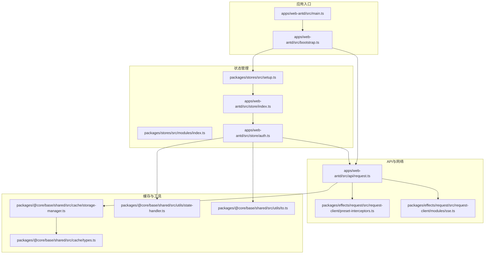
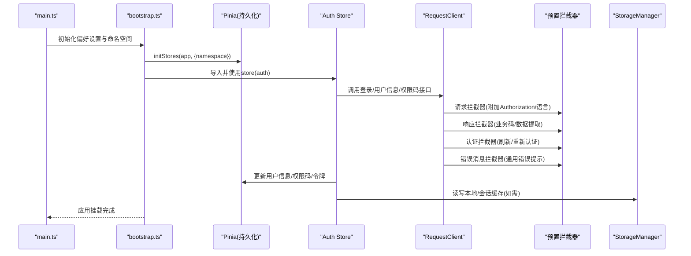
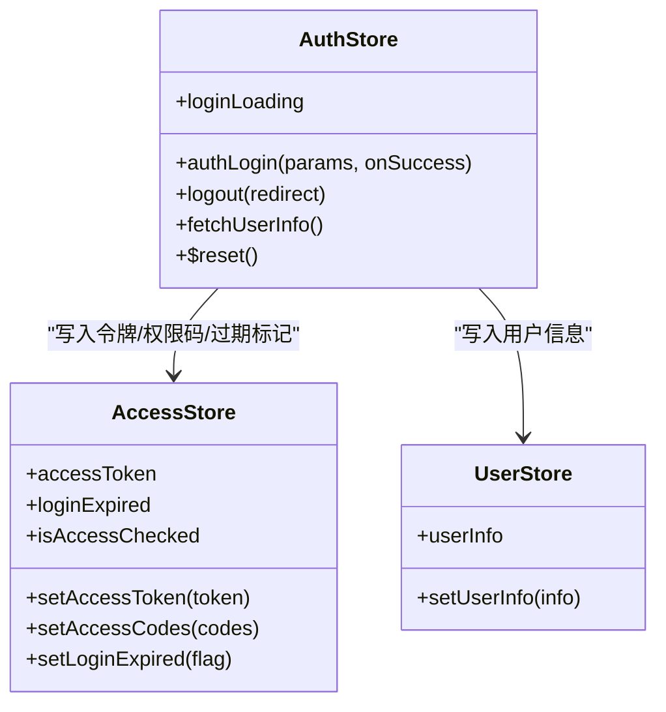
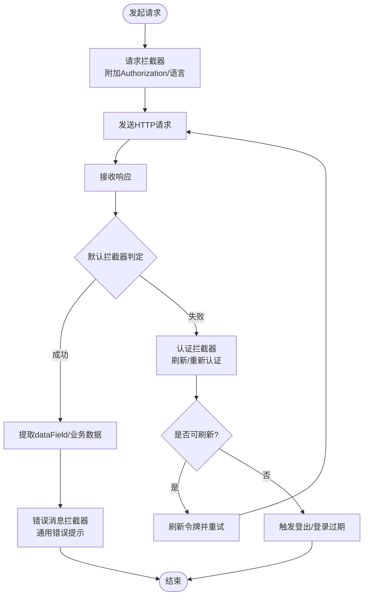
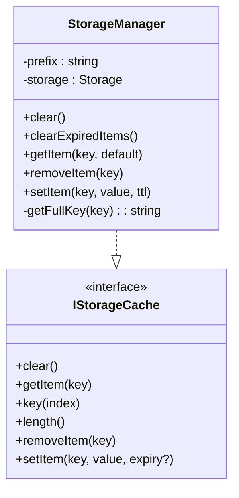
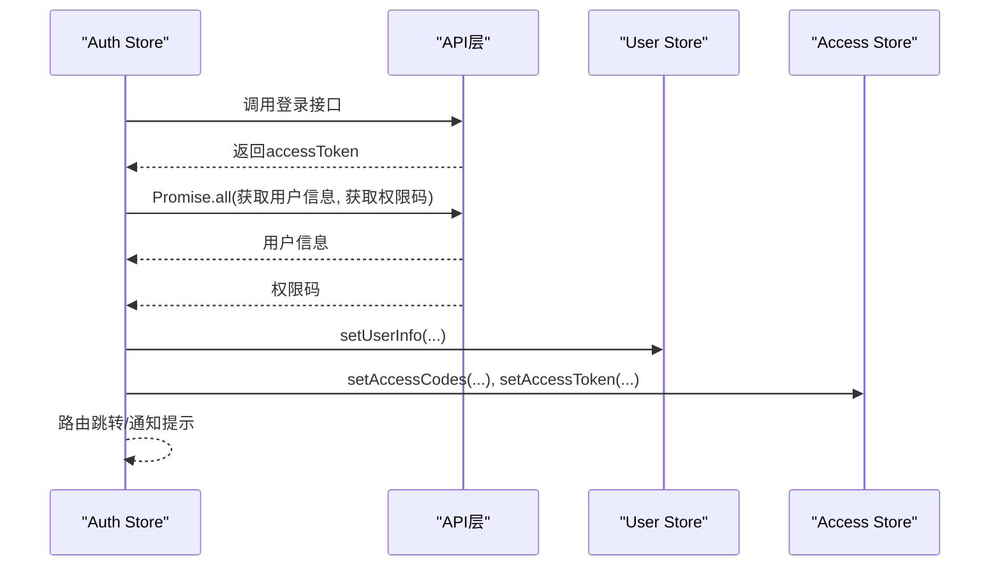
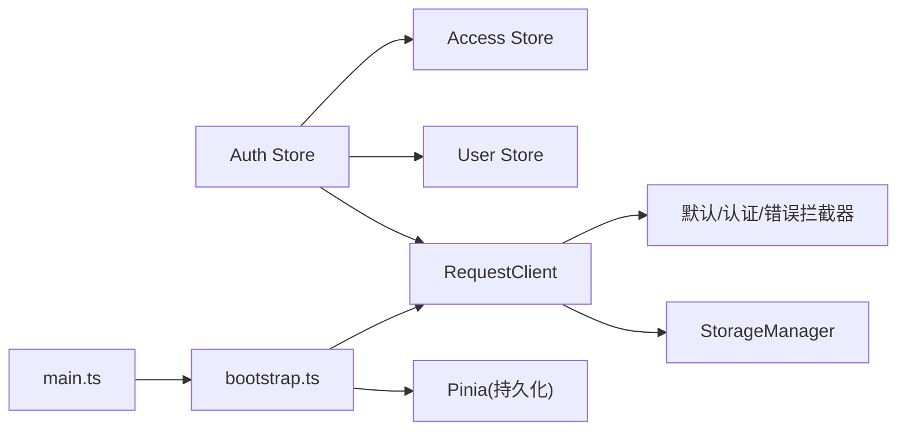
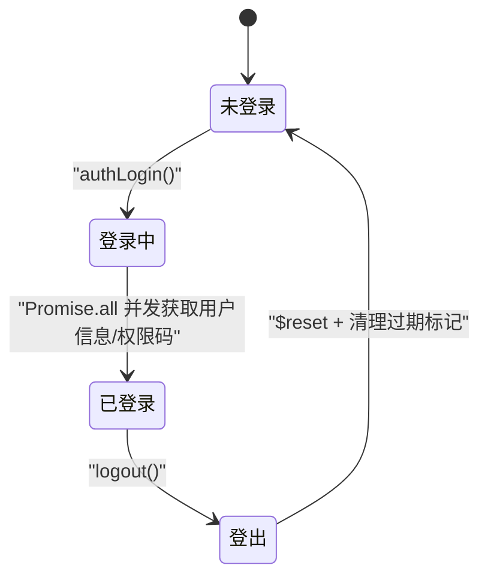

# 数据流架构

<cite>
**本文档引用的文件**
- [apps/web-antd/src/main.ts](file://apps/web-antd/src/main.ts)
- [apps/web-antd/src/bootstrap.ts](file://apps/web-antd/src/bootstrap.ts)
- [apps/web-antd/src/store/index.ts](file://apps/web-antd/src/store/index.ts)
- [apps/web-antd/src/store/auth.ts](file://apps/web-antd/src/store/auth.ts)
- [apps/web-antd/src/api/request.ts](file://apps/web-antd/src/api/request.ts)
- [packages/stores/src/setup.ts](file://packages/stores/src/setup.ts)
- [packages/stores/src/modules/index.ts](file://packages/stores/src/modules/index.ts)
- [packages/@core/base/shared/src/cache/storage-manager.ts](file://packages/@core/base/shared/src/cache/storage-manager.ts)
- [packages/@core/base/shared/src/cache/types.ts](file://packages/@core/base/shared/src/cache/types.ts)
- [packages/@core/base/shared/src/utils/state-handler.ts](file://packages/@core/base/shared/src/utils/state-handler.ts)
- [packages/@core/base/shared/src/utils/to.ts](file://packages/@core/base/shared/src/utils/to.ts)
- [packages/effects/request/src/request-client/preset-interceptors.ts](file://packages/effects/request/src/request-client/preset-interceptors.ts)
- [packages/effects/request/src/request-client/modules/sse.ts](file://packages/effects/request/src/request-client/modules/sse.ts)
</cite>

## 目录
1. [引言](#引言)
2. [项目结构](#项目结构)
3. [核心组件](#核心组件)
4. [架构总览](#架构总览)
5. [详细组件分析](#详细组件分析)
6. [依赖关系分析](#依赖关系分析)
7. [性能考量](#性能考量)
8. [故障排查指南](#故障排查指南)
9. [结论](#结论)
10. [附录](#附录)

## 引言
本文件面向Vben Admin前端数据流架构，围绕以下目标展开：状态管理（Pinia Store设计模式、状态树结构与更新机制）、API集成（HTTP客户端配置、请求/响应拦截器、错误处理）、数据缓存（本地/会话存储与内存缓存）、异步数据处理（Promise链、async/await与并发控制）、数据验证与转换（输入校验、格式化与类型安全），并辅以数据流图与状态转换图，帮助开发者快速理解数据在系统中的流转与处理方式。

## 项目结构
Vben Admin采用多包/多应用布局，核心入口位于各web-*应用的main与bootstrap文件；状态管理通过@vben/stores统一初始化；API层封装于@vben/request并提供预置拦截器；缓存与工具类位于@core/base/shared。

**图表来源**
- [apps/web-antd/src/main.ts:1-32](file://apps/web-antd/src/main.ts#L1-L32)
- [apps/web-antd/src/bootstrap.ts:1-85](file://apps/web-antd/src/bootstrap.ts#L1-L85)
- [packages/stores/src/setup.ts:1-82](file://packages/stores/src/setup.ts#L1-L82)
- [packages/stores/src/modules/index.ts:1-5](file://packages/stores/src/modules/index.ts#L1-L5)
- [apps/web-antd/src/store/index.ts:1-2](file://apps/web-antd/src/store/index.ts#L1-L2)
- [apps/web-antd/src/store/auth.ts:1-118](file://apps/web-antd/src/store/auth.ts#L1-L118)
- [apps/web-antd/src/api/request.ts:1-124](file://apps/web-antd/src/api/request.ts#L1-L124)
- [packages/effects/request/src/request-client/preset-interceptors.ts:1-45](file://packages/effects/request/src/request-client/preset-interceptors.ts#L1-L45)
- [packages/effects/request/src/request-client/modules/sse.ts:59-96](file://packages/effects/request/src/request-client/modules/sse.ts#L59-L96)
- [packages/@core/base/shared/src/cache/storage-manager.ts:1-119](file://packages/@core/base/shared/src/cache/storage-manager.ts#L1-L119)
- [packages/@core/base/shared/src/cache/types.ts:1-18](file://packages/@core/base/shared/src/cache/types.ts#L1-L18)
- [packages/@core/base/shared/src/utils/state-handler.ts:1-50](file://packages/@core/base/shared/src/utils/state-handler.ts#L1-L50)
- [packages/@core/base/shared/src/utils/to.ts:1-21](file://packages/@core/base/shared/src/utils/to.ts#L1-L21)

**章节来源**
- [apps/web-antd/src/main.ts:1-32](file://apps/web-antd/src/main.ts#L1-L32)
- [apps/web-antd/src/bootstrap.ts:1-85](file://apps/web-antd/src/bootstrap.ts#L1-L85)

## 核心组件
- 应用初始化与引导：main负责偏好设置与命名空间、调用bootstrap；bootstrap负责组件适配、i18n、Pinia初始化、权限指令、路由安装、UI框架挂载等。
- 状态管理：通过@vben/stores统一创建与持久化，应用侧仅导出store模块索引；auth store提供登录、登出、用户信息拉取与并发获取权限码。
- API与HTTP：基于@vben/request封装RequestClient，统一请求头、响应体转换、错误处理与刷新令牌流程。
- 缓存与工具：StorageManager提供带前缀与过期控制的localStorage/sessionStorage封装；StateHandler与to工具提供异步状态等待与错误安全捕获。

**章节来源**
- [apps/web-antd/src/main.ts:1-32](file://apps/web-antd/src/main.ts#L1-L32)
- [apps/web-antd/src/bootstrap.ts:1-85](file://apps/web-antd/src/bootstrap.ts#L1-L85)
- [packages/stores/src/setup.ts:1-82](file://packages/stores/src/setup.ts#L1-L82)
- [apps/web-antd/src/store/auth.ts:1-118](file://apps/web-antd/src/store/auth.ts#L1-L118)
- [apps/web-antd/src/api/request.ts:1-124](file://apps/web-antd/src/api/request.ts#L1-L124)
- [packages/@core/base/shared/src/cache/storage-manager.ts:1-119](file://packages/@core/base/shared/src/cache/storage-manager.ts#L1-L119)
- [packages/@core/base/shared/src/utils/state-handler.ts:1-50](file://packages/@core/base/shared/src/utils/state-handler.ts#L1-L50)
- [packages/@core/base/shared/src/utils/to.ts:1-21](file://packages/@core/base/shared/src/utils/to.ts#L1-L21)

## 架构总览
下图展示从应用启动到状态更新与API交互的关键路径，以及缓存与工具的协作位置。

**图表来源**
- [apps/web-antd/src/main.ts:1-32](file://apps/web-antd/src/main.ts#L1-L32)
- [apps/web-antd/src/bootstrap.ts:1-85](file://apps/web-antd/src/bootstrap.ts#L1-L85)
- [packages/stores/src/setup.ts:1-82](file://packages/stores/src/setup.ts#L1-L82)
- [apps/web-antd/src/store/auth.ts:1-118](file://apps/web-antd/src/store/auth.ts#L1-L118)
- [apps/web-antd/src/api/request.ts:1-124](file://apps/web-antd/src/api/request.ts#L1-L124)
- [packages/effects/request/src/request-client/preset-interceptors.ts:1-45](file://packages/effects/request/src/request-client/preset-interceptors.ts#L1-L45)
- [packages/@core/base/shared/src/cache/storage-manager.ts:1-119](file://packages/@core/base/shared/src/cache/storage-manager.ts#L1-L119)

## 详细组件分析

### 状态管理架构（Pinia Store）
- 设计模式
  - 使用defineStore定义功能域store，如auth store集中处理登录、登出、用户信息与权限码。
  - 通过@vben/stores统一创建Pinia实例并启用持久化插件，支持开发环境使用localStorage、生产环境使用加密存储。
- 状态树结构
  - 应用store索引导出模块集合，auth store对外暴露loginLoading、authLogin、logout、fetchUserInfo等方法与状态。
  - 用户信息与访问权限分别由user与access store维护，auth store在登录后并发拉取并写入。
- 状态更新机制
  - 登录流程采用Promise.all并发获取用户信息与权限码，随后写入对应store并触发路由跳转或通知提示。
  - 登出流程调用后端接口（若允许）并重置所有store，清除登录过期标记，回退至登录页并携带当前路由。

**图表来源**
- [apps/web-antd/src/store/auth.ts:1-118](file://apps/web-antd/src/store/auth.ts#L1-L118)
- [packages/stores/src/setup.ts:1-82](file://packages/stores/src/setup.ts#L1-L82)

**章节来源**
- [apps/web-antd/src/store/index.ts:1-2](file://apps/web-antd/src/store/index.ts#L1-L2)
- [apps/web-antd/src/store/auth.ts:1-118](file://apps/web-antd/src/store/auth.ts#L1-L118)
- [packages/stores/src/setup.ts:1-82](file://packages/stores/src/setup.ts#L1-L82)

### API集成架构（HTTP客户端与拦截器）
- HTTP客户端配置
  - 基于@vben/request的RequestClient，统一设置baseURL、transformResponse（对JSON BigInt进行字符串化处理）、responseReturn为"data"。
- 请求拦截器
  - 自动附加Authorization头（Bearer token）与Accept-Language头（来自偏好设置）。
- 响应处理
  - 默认响应拦截器：根据codeField/dataField/ successCode提取业务数据；非2xx或非成功码抛出异常。
  - 认证拦截器：当检测到令牌失效/过期时，执行重新认证或刷新令牌流程；支持“模态框提醒”或直接登出。
  - 错误消息拦截器：兜底错误处理，从响应体提取错误信息并统一提示。
- SSE支持
  - SSE模块基于fetch实现，自动设置accept头为text/event-stream，应用请求拦截器，按分片解码事件消息。

**图表来源**
- [apps/web-antd/src/api/request.ts:1-124](file://apps/web-antd/src/api/request.ts#L1-L124)
- [packages/effects/request/src/request-client/preset-interceptors.ts:1-45](file://packages/effects/request/src/request-client/preset-interceptors.ts#L1-L45)
- [packages/effects/request/src/request-client/modules/sse.ts:59-96](file://packages/effects/request/src/request-client/modules/sse.ts#L59-L96)

**章节来源**
- [apps/web-antd/src/api/request.ts:1-124](file://apps/web-antd/src/api/request.ts#L1-L124)
- [packages/effects/request/src/request-client/preset-interceptors.ts:1-45](file://packages/effects/request/src/request-client/preset-interceptors.ts#L1-L45)
- [packages/effects/request/src/request-client/modules/sse.ts:59-96](file://packages/effects/request/src/request-client/modules/sse.ts#L59-L96)

### 数据缓存策略
- 本地存储与会话存储
  - StorageManager提供带前缀的localStorage/sessionStorage封装，支持TTL过期控制与自动清理过期项。
  - 支持clear/clearExpiredItems/getItem/setItem/removeItem等操作，键名自动加上命名空间前缀。
- 内存缓存
  - 在store层面结合Pinia持久化策略，配合加密存储（生产环境）实现跨会话的内存缓存效果。
- 使用场景
  - 用户偏好、主题、语言等轻量配置适合localStorage；敏感令牌建议走服务端或加密存储。
  - 临时状态（如登录过期标记）可使用sessionStorage，随会话结束而清理。

**图表来源**
- [packages/@core/base/shared/src/cache/storage-manager.ts:1-119](file://packages/@core/base/shared/src/cache/storage-manager.ts#L1-L119)
- [packages/@core/base/shared/src/cache/types.ts:1-18](file://packages/@core/base/shared/src/cache/types.ts#L1-L18)

**章节来源**
- [packages/@core/base/shared/src/cache/storage-manager.ts:1-119](file://packages/@core/base/shared/src/cache/storage-manager.ts#L1-L119)
- [packages/@core/base/shared/src/cache/types.ts:1-18](file://packages/@core/base/shared/src/cache/types.ts#L1-L18)
- [packages/stores/src/setup.ts:1-82](file://packages/stores/src/setup.ts#L1-L82)

### 异步数据处理
- Promise链与并发控制
  - 登录流程使用Promise.all并发获取用户信息与权限码，提升首屏加载效率。
- async/await模式
  - store方法与API调用普遍采用async/await，保证代码可读性与错误捕获。
- 并发控制与状态等待
  - StateHandler提供waitForCondition/setConditionTrue/setConditionFalse能力，便于等待特定状态达成或中断。
- 错误安全捕获
  - to工具将Promise包装为二元组形式，避免try/catch重复样板代码。

**图表来源**
- [apps/web-antd/src/store/auth.ts:1-118](file://apps/web-antd/src/store/auth.ts#L1-L118)

**章节来源**
- [apps/web-antd/src/store/auth.ts:1-118](file://apps/web-antd/src/store/auth.ts#L1-L118)
- [packages/@core/base/shared/src/utils/state-handler.ts:1-50](file://packages/@core/base/shared/src/utils/state-handler.ts#L1-L50)
- [packages/@core/base/shared/src/utils/to.ts:1-21](file://packages/@core/base/shared/src/utils/to.ts#L1-L21)

### 数据验证与转换机制
- 输入验证
  - 表单层可结合Zod等schema体系进行字段级校验（参考form-ui相关工具），确保提交前的数据有效性。
- 数据格式化
  - 表单API在处理区间字段、日期范围等复合字段时，提供格式化与拆分逻辑，避免后端接收复杂结构。
- 类型安全
  - 通过Recordable等类型约束与严格模式，减少运行时类型错误；JSON BigInt解析采用字符串化策略，避免精度丢失。

**章节来源**
- [packages/@core/base/shared/src/utils/__tests__/inference.test.ts:1-55](file://packages/@core/base/shared/src/utils/__tests__/inference.test.ts#L1-L55)
- [packages/@core/ui-kit/form-ui/src/form-api.ts:531-576](file://packages/@core/ui-kit/form-ui/src/form-api.ts#L531-L576)

## 依赖关系分析
- 组件耦合与内聚
  - bootstrap集中初始化，降低入口复杂度；store与api分离，职责清晰。
- 直接与间接依赖
  - auth store依赖access与user store；api层依赖拦截器与缓存工具；缓存工具依赖浏览器Storage API。
- 外部依赖与集成点
  - @vben/request提供HTTP抽象；pinia-plugin-persistedstate实现持久化；secure-ls提供生产环境加密存储。
- 接口契约
  - API响应遵循code/data约定，拦截器按约定提取数据；错误消息拦截器统一提示。

**图表来源**
- [apps/web-antd/src/store/auth.ts:1-118](file://apps/web-antd/src/store/auth.ts#L1-L118)
- [apps/web-antd/src/api/request.ts:1-124](file://apps/web-antd/src/api/request.ts#L1-L124)
- [packages/effects/request/src/request-client/preset-interceptors.ts:1-45](file://packages/effects/request/src/request-client/preset-interceptors.ts#L1-L45)
- [packages/@core/base/shared/src/cache/storage-manager.ts:1-119](file://packages/@core/base/shared/src/cache/storage-manager.ts#L1-L119)
- [apps/web-antd/src/bootstrap.ts:1-85](file://apps/web-antd/src/bootstrap.ts#L1-L85)
- [apps/web-antd/src/main.ts:1-32](file://apps/web-antd/src/main.ts#L1-L32)

**章节来源**
- [apps/web-antd/src/store/auth.ts:1-118](file://apps/web-antd/src/store/auth.ts#L1-L118)
- [apps/web-antd/src/api/request.ts:1-124](file://apps/web-antd/src/api/request.ts#L1-L124)
- [packages/effects/request/src/request-client/preset-interceptors.ts:1-45](file://packages/effects/request/src/request-client/preset-interceptors.ts#L1-L45)
- [packages/@core/base/shared/src/cache/storage-manager.ts:1-119](file://packages/@core/base/shared/src/cache/storage-manager.ts#L1-L119)
- [apps/web-antd/src/bootstrap.ts:1-85](file://apps/web-antd/src/bootstrap.ts#L1-L85)
- [apps/web-antd/src/main.ts:1-32](file://apps/web-antd/src/main.ts#L1-L32)

## 性能考量
- 并发优化
  - 登录阶段使用Promise.all并发拉取用户信息与权限码，缩短首屏等待时间。
- 缓存策略
  - 对热点数据采用localStorage/sessionStorage缓存，结合TTL避免陈旧数据；对敏感数据使用加密存储。
- 请求优化
  - 统一拦截器减少重复逻辑，响应体转换在客户端完成，避免后端负担。
- 状态持久化
  - Pinia持久化插件按store粒度持久化，避免全量序列化带来的开销。

[本节为通用指导，无需列出具体文件来源]

## 故障排查指南
- 登录失败/无权限
  - 检查请求拦截器是否正确附加Authorization头；确认认证拦截器是否触发刷新或重新认证。
- 响应数据异常
  - 核对默认拦截器的codeField/dataField/successCode配置是否与后端一致；查看错误消息拦截器是否覆盖了业务提示。
- 令牌过期
  - 关注登录过期模式（模态框/直接登出）与刷新令牌开关；确认刷新接口可用且返回新令牌。
- 缓存问题
  - 检查StorageManager前缀与TTL设置；确认clearExpiredItems是否定期清理过期项。
- 异步状态卡住
  - 使用StateHandler的waitForCondition等待条件变化；必要时调用setConditionFalse中断等待。

**章节来源**
- [apps/web-antd/src/api/request.ts:1-124](file://apps/web-antd/src/api/request.ts#L1-L124)
- [packages/effects/request/src/request-client/preset-interceptors.ts:1-45](file://packages/effects/request/src/request-client/preset-interceptors.ts#L1-L45)
- [packages/@core/base/shared/src/cache/storage-manager.ts:1-119](file://packages/@core/base/shared/src/cache/storage-manager.ts#L1-L119)
- [packages/@core/base/shared/src/utils/state-handler.ts:1-50](file://packages/@core/base/shared/src/utils/state-handler.ts#L1-L50)

## 结论
Vben Admin的数据流架构以Pinia为核心，结合@vben/request提供的HTTP抽象与拦截器体系，形成“入口初始化—状态管理—API交互—缓存与工具”的闭环。通过并发控制、统一错误处理与持久化策略，系统在易用性与性能之间取得平衡。建议在扩展新功能时遵循现有拦截器与store设计模式，确保一致性与可维护性。

[本节为总结性内容，无需列出具体文件来源]

## 附录
- 关键流程图（登录到状态更新）

**图表来源**
- [apps/web-antd/src/store/auth.ts:1-118](file://apps/web-antd/src/store/auth.ts#L1-L118)