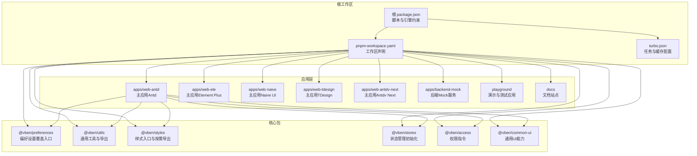
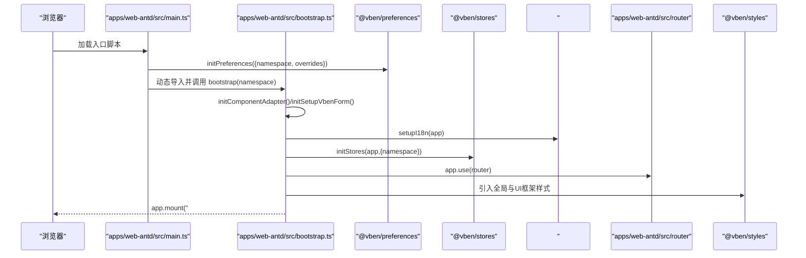
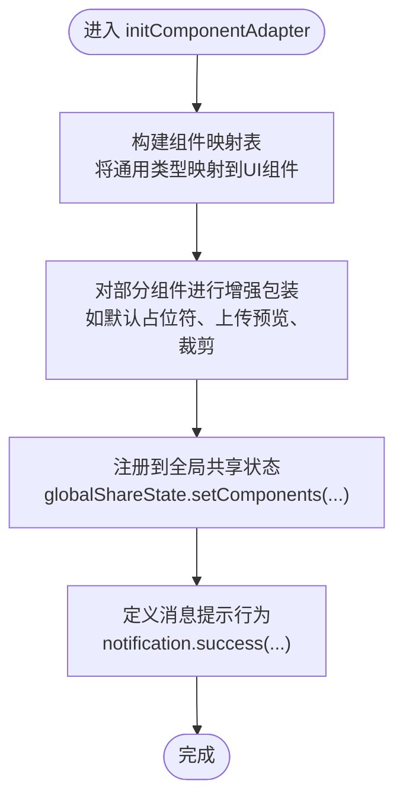
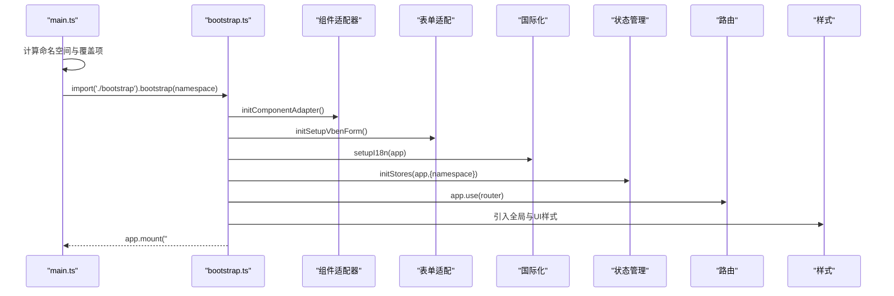
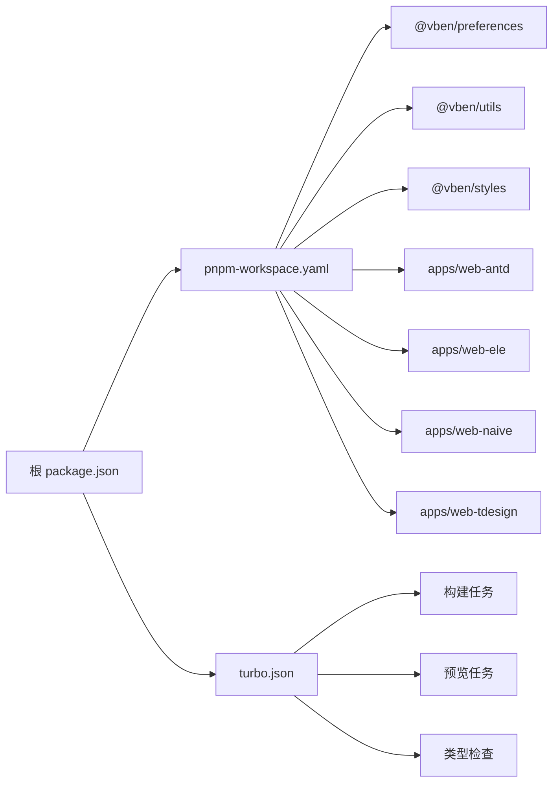

# 架构设计

<cite>
**本文档引用的文件**
- [package.json](file://package.json)
- [pnpm-workspace.yaml](file://pnpm-workspace.yaml)
- [turbo.json](file://turbo.json)
- [apps/web-antd/src/main.ts](file://apps/web-antd/src/main.ts)
- [apps/web-antd/src/bootstrap.ts](file://apps/web-antd/src/bootstrap.ts)
- [apps/web-antd/src/preferences.ts](file://apps/web-antd/src/preferences.ts)
- [apps/web-antd/src/adapter/component/index.ts](file://apps/web-antd/src/adapter/component/index.ts)
- [apps/web-antd/src/router/index.ts](file://apps/web-antd/src/router/index.ts)
- [apps/web-antd/src/store/index.ts](file://apps/web-antd/src/store/index.ts)
- [packages/preferences/src/index.ts](file://packages/preferences/src/index.ts)
- [packages/utils/package.json](file://packages/utils/package.json)
- [packages/styles/package.json](file://packages/styles/package.json)
</cite>

## 目录

1. [简介](#简介)
2. [项目结构](#项目结构)
3. [核心组件](#核心组件)
4. [架构总览](#架构总览)
5. [详细组件分析](#详细组件分析)
6. [依赖分析](#依赖分析)
7. [性能考虑](#性能考虑)
8. [故障排查指南](#故障排查指南)
9. [结论](#结论)
10. [附录](#附录)

## 简介

本文件面向Vben Admin的架构设计与实现，围绕Monorepo组织形态、包管理策略、依赖关系与构建流程展开；重点阐述应用层如何通过“组件适配器”模式支持多UI框架（Ant Design Vue、Element Plus、Naive UI、TDesign等）；说明核心包（@vben/preferences、@vben/utils、@vben/styles 等）的职责边界与协作方式；并完整梳理从 main.ts 到 bootstrap.ts 的应用初始化装配链路，以及组件系统（适配器、通用组件、业务组件）之间的关系。最后给出架构决策的技术考量与权衡，并提供架构图与组件关系图，帮助开发者快速理解系统整体设计。

## 项目结构

Vben Admin采用Monorepo组织，根目录通过 pnpm-workspace.yaml 统一声明工作区，结合 Turbo 作为任务编排引擎，实现跨应用与内部包的增量构建与缓存优化。各应用（apps/web-antd、web-ele、web-naive、web-tdesign、web-antdv-next）共享核心能力（packages/\*），并通过各自的适配器层对接不同UI框架。

图表来源

- [package.json:1-109](file://package.json#L1-L109)
- [pnpm-workspace.yaml:1-193](file://pnpm-workspace.yaml#L1-L193)
- [turbo.json:1-49](file://turbo.json#L1-L49)

章节来源

- [package.json:1-109](file://package.json#L1-L109)
- [pnpm-workspace.yaml:1-193](file://pnpm-workspace.yaml#L1-L193)
- [turbo.json:1-49](file://turbo.json#L1-L49)

## 核心组件

- @vben/preferences：提供偏好设置覆盖入口，允许应用在启动前注入命名空间与覆盖项，统一管理应用名、默认首页、访问控制模式、动态标题等。
- @vben/utils：提供通用工具与导出，如重置静态路由等，供应用层复用。
- @vben/styles：提供样式入口与按UI框架分发的导出（如 antd、ele、naive、global），实现样式隔离与按需引入。
- @vben/stores：封装状态管理初始化流程，配合命名空间实现多实例隔离。
- @vben/access：权限指令注册，统一鉴权逻辑。
- @vben/common-ui：通用UI能力（如ApiComponent、IconPicker、VCropper等），为组件适配器提供基础能力。

章节来源

- [packages/preferences/src/index.ts:1-18](file://packages/preferences/src/index.ts#L1-L18)
- [packages/utils/package.json:1-28](file://packages/utils/package.json#L1-L28)
- [packages/styles/package.json:1-38](file://packages/styles/package.json#L1-L38)

## 架构总览

下图展示从浏览器入口到应用装配的关键路径，以及与核心包的交互关系：

图表来源

- [apps/web-antd/src/main.ts:1-32](file://apps/web-antd/src/main.ts#L1-L32)
- [apps/web-antd/src/bootstrap.ts:1-85](file://apps/web-antd/src/bootstrap.ts#L1-L85)
- [apps/web-antd/src/preferences.ts:1-31](file://apps/web-antd/src/preferences.ts#L1-L31)
- [apps/web-antd/src/router/index.ts:1-38](file://apps/web-antd/src/router/index.ts#L1-L38)

章节来源

- [apps/web-antd/src/main.ts:1-32](file://apps/web-antd/src/main.ts#L1-L32)
- [apps/web-antd/src/bootstrap.ts:1-85](file://apps/web-antd/src/bootstrap.ts#L1-L85)
- [apps/web-antd/src/preferences.ts:1-31](file://apps/web-antd/src/preferences.ts#L1-L31)
- [apps/web-antd/src/router/index.ts:1-38](file://apps/web-antd/src/router/index.ts#L1-L38)

## 详细组件分析

### 组件适配器（Component Adapter）

组件适配器负责将通用组件（如 ApiSelect、ApiCascader、Upload 等）映射到具体UI框架组件（如 Ant Design Vue）。其职责包括：

- 统一组件类型与属性约定，屏蔽底层UI差异
- 提供默认占位符、默认按钮等增强体验
- 封装上传预览、图片裁剪等复杂交互
- 将适配后的组件注册到全局共享状态，供表单与其它组件使用

图表来源

- [apps/web-antd/src/adapter/component/index.ts:526-608](file://apps/web-antd/src/adapter/component/index.ts#L526-L608)

章节来源

- [apps/web-antd/src/adapter/component/index.ts:1-608](file://apps/web-antd/src/adapter/component/index.ts#L1-L608)

### 应用初始化流程（main.ts → bootstrap.ts）

- main.ts：解析命名空间、合并覆盖项、初始化偏好设置、动态导入并执行 bootstrap，最后移除全局loading。
- bootstrap.ts：初始化组件适配器与表单适配、国际化、状态管理、权限指令、路由、UI框架安装、动态标题等，最终挂载应用。

图表来源

- [apps/web-antd/src/main.ts:9-31](file://apps/web-antd/src/main.ts#L9-L31)
- [apps/web-antd/src/bootstrap.ts:20-82](file://apps/web-antd/src/bootstrap.ts#L20-L82)

章节来源

- [apps/web-antd/src/main.ts:1-32](file://apps/web-antd/src/main.ts#L1-L32)
- [apps/web-antd/src/bootstrap.ts:1-85](file://apps/web-antd/src/bootstrap.ts#L1-L85)

### 路由与守卫

- 路由历史模式由环境变量决定（hash 或 history），并提供滚动行为与静态路由重置能力。
- 路由守卫在路由初始化时创建，用于统一处理鉴权、权限与导航逻辑。

章节来源

- [apps/web-antd/src/router/index.ts:1-38](file://apps/web-antd/src/router/index.ts#L1-L38)

### 样式与主题

- @vben/styles 提供统一入口与按UI框架分发的导出，支持全局样式与框架特定样式。
- 应用在引导阶段引入全局样式与对应UI框架样式，保证主题一致性与按需加载。

章节来源

- [packages/styles/package.json:1-38](file://packages/styles/package.json#L1-L38)
- [apps/web-antd/src/bootstrap.ts:7-8](file://apps/web-antd/src/bootstrap.ts#L7-L8)

### 偏好设置与命名空间

- 应用通过 defineOverridesPreferences 覆盖默认偏好设置（如主题模式、默认首页、访问控制模式等）。
- 命名空间用于区分不同版本/环境下的偏好设置与本地存储键前缀，避免冲突。

章节来源

- [apps/web-antd/src/preferences.ts:1-31](file://apps/web-antd/src/preferences.ts#L1-L31)
- [packages/preferences/src/index.ts:1-18](file://packages/preferences/src/index.ts#L1-L18)

## 依赖分析

- 包管理策略
  - 工作区：通过 pnpm-workspace.yaml 统一管理 packages 与 apps，内部包以 workspace:\* 方式互相引用，减少重复依赖。
  - 版本目录：catalog 字段集中声明依赖版本，统一升级与审计。
- 构建与缓存
  - Turbo 任务：定义 build、preview、typecheck 等任务的依赖与输出，启用增量构建与缓存。
  - 根脚本：通过 turbo-run 与 pnpm filter 实现按应用构建与开发。
- 外部依赖
  - UI框架：Ant Design Vue、Element Plus、Naive UI、TDesign 等，通过各自应用目录的适配器对接。
  - 工具与生态：Vue 3、Vue Router、Pinia、VueUse、Axios、VXE Table 等。

图表来源

- [package.json:27-66](file://package.json#L27-L66)
- [pnpm-workspace.yaml:1-14](file://pnpm-workspace.yaml#L1-L14)
- [turbo.json:15-47](file://turbo.json#L15-L47)

章节来源

- [package.json:1-109](file://package.json#L1-L109)
- [pnpm-workspace.yaml:1-193](file://pnpm-workspace.yaml#L1-L193)
- [turbo.json:1-49](file://turbo.json#L1-L49)

## 性能考虑

- 按需加载与异步组件：组件适配器对大组件采用异步加载，降低首屏体积与提升可交互时间。
- 增量构建与缓存：Turbo 任务配置与缓存输出，减少重复构建时间，提升开发效率。
- 样式隔离与按需引入：@vben/styles 提供按UI框架导出，避免全量样式引入带来的体积膨胀。
- 命名空间与状态隔离：通过命名空间隔离多实例状态，避免跨实例污染与重复初始化开销。

## 故障排查指南

- 偏好设置不生效
  - 检查命名空间与覆盖项是否正确传递至 initPreferences。
  - 清理浏览器缓存或本地存储，确保新偏好设置生效。
- 组件适配器未生效
  - 确认 initComponentAdapter 在 bootstrap 中被调用。
  - 检查全局共享状态是否正确注册组件映射。
- 路由跳转异常
  - 核对路由历史模式配置与基础路径，确认守卫逻辑未拦截正常路由。
- 样式缺失或冲突
  - 确认引导阶段引入了全局样式与对应UI框架样式。
  - 检查样式导出路径与UI框架版本兼容性。

章节来源

- [apps/web-antd/src/preferences.ts:1-31](file://apps/web-antd/src/preferences.ts#L1-L31)
- [apps/web-antd/src/adapter/component/index.ts:526-608](file://apps/web-antd/src/adapter/component/index.ts#L526-L608)
- [apps/web-antd/src/router/index.ts:1-38](file://apps/web-antd/src/router/index.ts#L1-L38)
- [apps/web-antd/src/bootstrap.ts:7-8](file://apps/web-antd/src/bootstrap.ts#L7-L8)

## 结论

Vben Admin通过Monorepo与组件适配器模式，实现了多UI框架的统一接入与一致体验。核心包承担偏好设置、工具与样式等横切职责，应用层仅需关注适配器与业务视图，降低了耦合度与维护成本。借助 Turbo 的增量构建与 pnpm 的工作区管理，项目在规模化演进中仍保持良好的开发与发布效率。

## 附录

- 架构决策与权衡
  - 选择Monorepo：便于代码复用、版本统一与跨应用协作，但需要更强的工程治理与CI策略。
  - 组件适配器模式：屏蔽UI差异，提升可移植性，但需要持续维护映射与增强逻辑。
  - 命名空间隔离：避免多实例冲突，但需在全局状态与存储键上保持一致策略。
  - 按需样式与异步组件：优化首屏性能，但需注意运行时加载的错误处理与降级方案。
