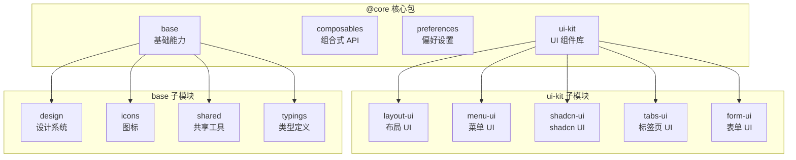
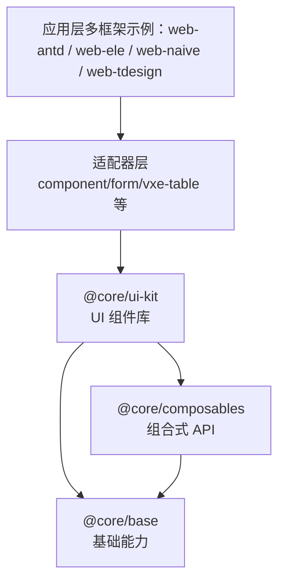
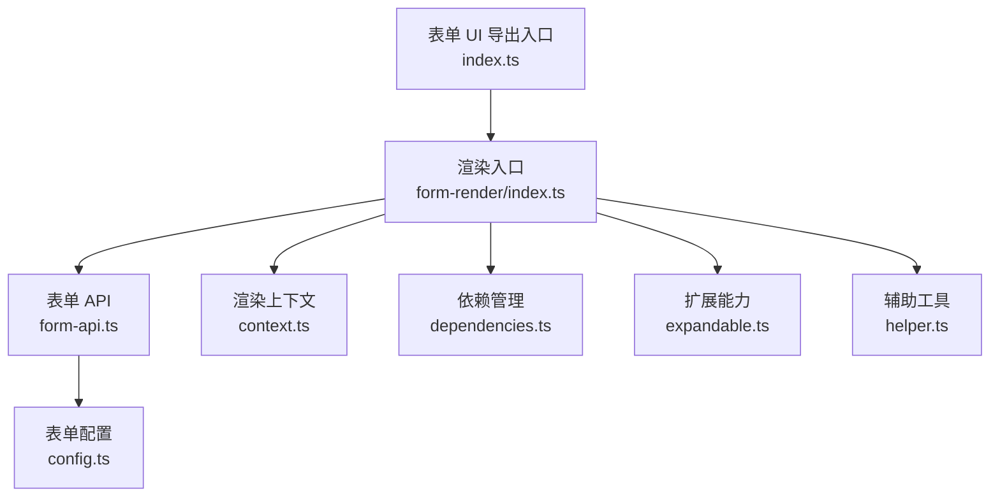
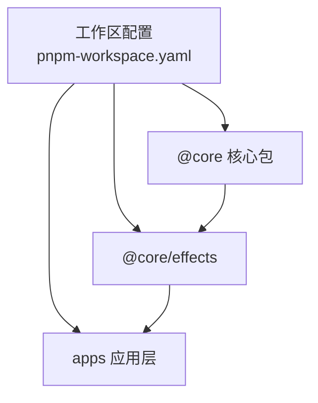

# @core 核心包

<cite>
**本文引用的文件**
- [目录说明（中文）](file://docs/src/guide/project/dir.md)
- [目录说明（英文）](file://docs/src/en/guide/project/dir.md)
- [ESLint 自定义规则（中文）](file://internal/lint-configs/eslint-config/src/custom-config.ts)
- [Oxlint TailwindCSS 配置](file://internal/lint-configs/oxlint-config/src/configs/tailwindcss.ts)
- [工作区配置](file://pnpm-workspace.yaml)
- [包管理与脚本](file://package.json)
- [表单 UI 包构建配置](file://packages/@core/ui-kit/form-ui/build.config.ts)
- [表单 UI 配置](file://packages/@core/ui-kit/form-ui/src/config.ts)
- [表单 API](file://packages/@core/ui-kit/form-ui/src/form-api.ts)
- [表单渲染上下文](file://packages/@core/ui-kit/form-ui/src/form-render/context.ts)
- [表单渲染依赖管理](file://packages/@core/ui-kit/form-ui/src/form-render/dependencies.ts)
- [表单渲染扩展能力](file://packages/@core/ui-kit/form-ui/src/form-render/expandable.ts)
- [表单渲染辅助工具](file://packages/@core/ui-kit/form-ui/src/form-render/helper.ts)
- [表单渲染入口](file://packages/@core/ui-kit/form-ui/src/form-render/index.ts)
- [表单 UI 导出入口](file://packages/@core/ui-kit/form-ui/src/index.ts)
- [偏好设置更新 CSS 变量](file://packages/@core/preferences/src/update-css-variables.ts)
- [偏好设置钩子](file://packages/@core/preferences/src/use-preferences.ts)
- [通用 UI 组件导出](file://packages/effects/common-ui/src/index.ts)
</cite>

## 目录
1. [简介](#简介)
2. [项目结构](#项目结构)
3. [核心组件](#核心组件)
4. [架构总览](#架构总览)
5. [详细组件分析](#详细组件分析)
6. [依赖分析](#依赖分析)
7. [性能考虑](#性能考虑)
8. [故障排除指南](#故障排除指南)
9. [结论](#结论)
10. [附录](#附录)

## 简介
@core 是一个面向多框架适配的前端核心包，采用 Monorepo 管理，围绕“UI Kit + Composables + Base”的分层设计，提供跨框架兼容的组件库、可复用的组合式逻辑以及基础常量与工具。其目标是让业务应用在不同 UI 框架（如 Ant Design Vue、Element Plus、Naive UI、TDesign 等）间保持一致的开发体验与行为。

## 项目结构
@core 的顶层结构由工作区配置明确声明，包含以下主要模块：
- base：基础能力层，涵盖设计系统、图标、共享工具与类型定义
- composables：组合式 API 层，抽取可复用逻辑与状态
- preferences：偏好设置层，负责主题、布局等用户偏好的持久化与动态更新
- ui-kit：UI 组件库层，提供布局、菜单、标签页、表单等通用 UI 组件，并以适配器模式支持多框架

图表来源
- [目录说明（中文）:33-45](file://docs/src/guide/project/dir.md#L33-L45)
- [工作区配置:5-8](file://pnpm-workspace.yaml#L5-L8)

章节来源
- [目录说明（中文）:33-45](file://docs/src/guide/project/dir.md#L33-L45)
- [目录说明（英文）:32-45](file://docs/src/en/guide/project/dir.md#L32-L45)
- [工作区配置:5-8](file://pnpm-workspace.yaml#L5-L8)

## 核心组件
- UI Kit：提供布局、菜单、标签页、表单等通用 UI 组件，采用适配器模式对接不同 UI 框架，保证组件行为一致性与跨框架兼容性。
- Composables：封装可复用的业务逻辑与状态，例如数据请求、权限判断、主题切换等，便于在多个页面或组件中复用。
- Base：提供核心常量、类型定义、共享工具与设计系统资源，作为上层模块的基础设施。
- Preferences：负责用户偏好的持久化与动态更新，如主题变量、布局配置等。

章节来源
- [目录说明（中文）:33-45](file://docs/src/guide/project/dir.md#L33-L45)
- [ESLint 自定义规则（中文）:60-71](file://internal/lint-configs/eslint-config/src/custom-config.ts#L60-L71)

## 架构总览
@core 的整体架构遵循“分层解耦、适配器桥接、组合式复用”的设计原则：
- 分层解耦：UI Kit、Composables、Base 各司其职，避免交叉污染
- 适配器桥接：通过适配器屏蔽底层 UI 框架差异，统一对外接口
- 组合式复用：将可复用逻辑下沉至 Composables，提升代码复用率与测试性

图表来源
- [工作区配置:5-8](file://pnpm-workspace.yaml#L5-L8)
- [ESLint 自定义规则（中文）:60-71](file://internal/lint-configs/eslint-config/src/custom-config.ts#L60-L71)

## 详细组件分析

### UI Kit 表单组件库（form-ui）
表单组件库是 UI Kit 的重要组成部分，提供统一的表单渲染与交互能力。其内部采用模块化组织，包含配置、API、渲染上下文、依赖管理、扩展能力与辅助工具等模块。

图表来源
- [表单 UI 导出入口](file://packages/@core/ui-kit/form-ui/src/index.ts)
- [表单 UI 配置](file://packages/@core/ui-kit/form-ui/src/config.ts)
- [表单 API](file://packages/@core/ui-kit/form-ui/src/form-api.ts)
- [表单渲染上下文](file://packages/@core/ui-kit/form-ui/src/form-render/context.ts)
- [表单渲染依赖管理](file://packages/@core/ui-kit/form-ui/src/form-render/dependencies.ts)
- [表单渲染扩展能力](file://packages/@core/ui-kit/form-ui/src/form-render/expandable.ts)
- [表单渲染辅助工具](file://packages/@core/ui-kit/form-ui/src/form-render/helper.ts)
- [表单渲染入口](file://packages/@core/ui-kit/form-ui/src/form-render/index.ts)

章节来源
- [表单 UI 导出入口](file://packages/@core/ui-kit/form-ui/src/index.ts)
- [表单 UI 配置](file://packages/@core/ui-kit/form-ui/src/config.ts)
- [表单 API](file://packages/@core/ui-kit/form-ui/src/form-api.ts)
- [表单渲染上下文](file://packages/@core/ui-kit/form-ui/src/form-render/context.ts)
- [表单渲染依赖管理](file://packages/@core/ui-kit/form-ui/src/form-render/dependencies.ts)
- [表单渲染扩展能力](file://packages/@core/ui-kit/form-ui/src/form-render/expandable.ts)
- [表单渲染辅助工具](file://packages/@core/ui-kit/form-ui/src/form-render/helper.ts)
- [表单渲染入口](file://packages/@core/ui-kit/form-ui/src/form-render/index.ts)

### 组合式 API（composables）
Composables 模块负责抽取可复用的业务逻辑与状态，典型场景包括：
- 数据请求与缓存策略
- 权限校验与访问控制
- 主题切换与偏好设置联动
- 表单状态管理与校验

设计原则：
- 单一职责：每个 Composable 聚焦一个领域或能力
- 无副作用：尽量返回纯函数与只读状态，必要时通过副作用钩子暴露
- 易测试：通过参数注入与依赖抽象，便于单元测试

### Base 基础模块
Base 提供核心常量、类型定义、共享工具与设计系统资源，是上层模块的基础设施。其子模块包括：
- design：设计系统资源（颜色、字体、间距等）
- icons：图标资源与工具
- shared：共享工具函数
- typings：全局类型定义

设计原则：
- 稳定性：变更需谨慎评估对上层的影响
- 低耦合：避免引入第三方框架依赖
- 可演进：通过版本化与迁移策略支持长期演进

### Preferences 偏好设置
Preferences 负责用户偏好的持久化与动态更新，典型能力包括：
- 主题变量的动态更新与回退策略
- 布局配置（侧边栏、面包屑等）的持久化
- 语言与区域设置的切换

实现要点：
- 使用 CSS 变量作为主题载体，确保运行时可热替换
- 通过钩子在应用启动阶段初始化偏好设置
- 提供统一的更新接口，避免直接操作 DOM

章节来源
- [偏好设置更新 CSS 变量](file://packages/@core/preferences/src/update-css-variables.ts)
- [偏好设置钩子](file://packages/@core/preferences/src/use-preferences.ts)

## 依赖分析
@core 的模块间依赖关系清晰，遵循“上层依赖下层、横向不耦合”的原则。工作区配置明确了各子包的边界与依赖方向。

图表来源
- [工作区配置:1-14](file://pnpm-workspace.yaml#L1-L14)
- [包管理与脚本:27-66](file://package.json#L27-L66)

章节来源
- [工作区配置:1-14](file://pnpm-workspace.yaml#L1-L14)
- [包管理与脚本:27-66](file://package.json#L27-L66)

## 性能考虑
- 渲染优化：UI Kit 通过适配器与懒加载策略减少首屏负担
- 状态管理：Composables 将状态集中管理，避免重复渲染
- 样式治理：Base 中统一的 CSS 变量与 Tailwind 扫描范围，降低样式体积
- 构建优化：通过独立包与按需导入，减少打包体积

## 故障排除指南
- ESLint 规则限制：@core 内部组件禁止引入 @vben/* 包，避免循环依赖与边界模糊
  - 参考路径：[ESLint 自定义规则（中文）:60-71](file://internal/lint-configs/eslint-config/src/custom-config.ts#L60-L71)
- Tailwind 扫描范围：统一在 @core/base/design/src/css/global.css 维护，避免样式丢失
  - 参考路径：[Oxlint TailwindCSS 配置:16-22](file://internal/lint-configs/oxlint-config/src/configs/tailwindcss.ts#L16-L22)
- 构建配置：表单 UI 包的构建配置需与工作区保持一致
  - 参考路径：[表单 UI 包构建配置](file://packages/@core/ui-kit/form-ui/build.config.ts)

章节来源
- [ESLint 自定义规则（中文）:60-71](file://internal/lint-configs/eslint-config/src/custom-config.ts#L60-L71)
- [Oxlint TailwindCSS 配置:16-22](file://internal/lint-configs/oxlint-config/src/configs/tailwindcss.ts#L16-L22)
- [表单 UI 包构建配置](file://packages/@core/ui-kit/form-ui/build.config.ts)

## 结论
@core 通过清晰的分层设计与适配器模式，实现了 UI 组件库的跨框架兼容与可复用逻辑的统一抽象。Base 提供稳定的基础能力，Preferences 实现用户偏好的动态管理，Composables 则将复杂业务下沉为可测试、可演进的组合式 API。配合工作区与代码规范约束，@core 为多应用、多框架的前端工程提供了高内聚、低耦合的核心支撑。

## 附录
- 使用建议
  - 在应用中优先引入 @core 的组合式 API 与 UI 组件，减少重复造轮子
  - 通过适配器层对接具体 UI 框架，避免直接依赖框架特定实现
  - 利用 Preferences 动态更新主题与布局，确保一致的用户体验
- 相关参考
  - 通用 UI 组件导出入口：[通用 UI 组件导出](file://packages/effects/common-ui/src/index.ts)