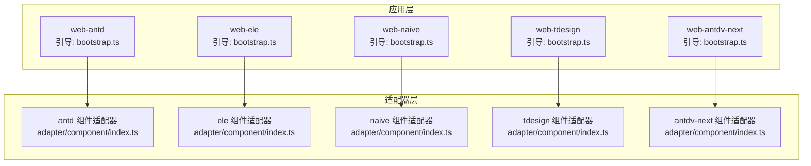
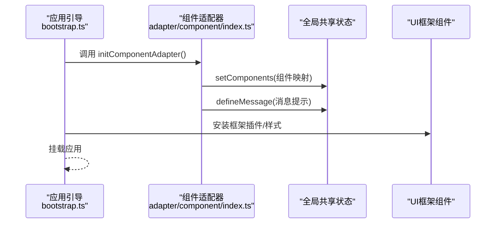
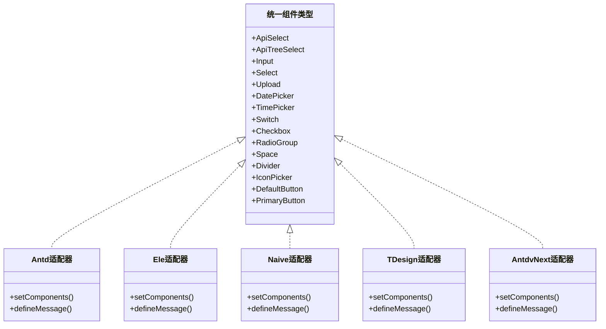
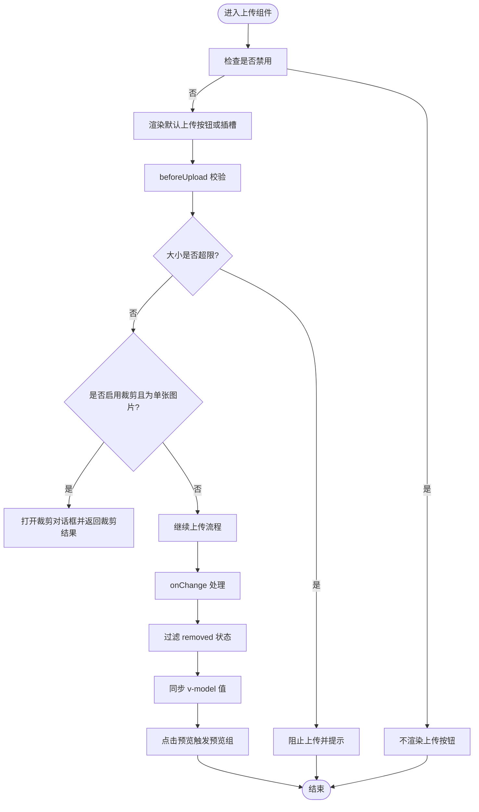
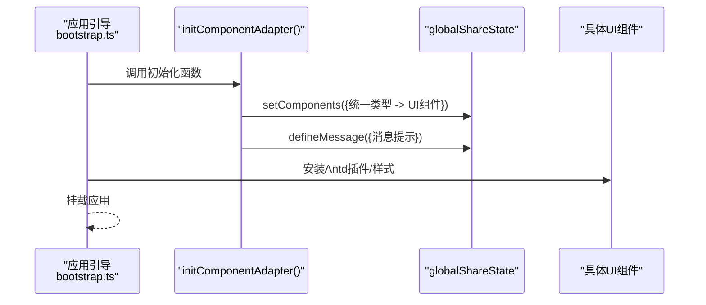
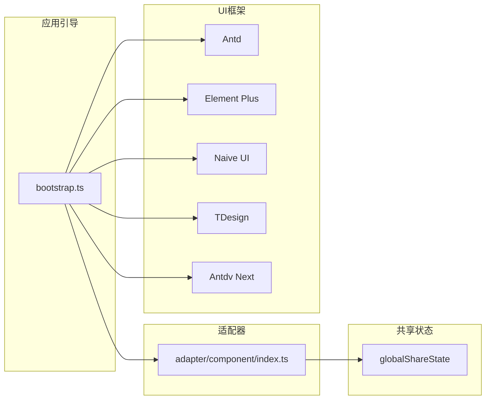

# UI组件库

<cite>
**本文档引用的文件**
- [apps/web-antd/src/adapter/component/index.ts](file://apps/web-antd/src/adapter/component/index.ts)
- [apps/web-ele/src/adapter/component/index.ts](file://apps/web-ele/src/adapter/component/index.ts)
- [apps/web-naive/src/adapter/component/index.ts](file://apps/web-naive/src/adapter/component/index.ts)
- [apps/web-tdesign/src/adapter/component/index.ts](file://apps/web-tdesign/src/adapter/component/index.ts)
- [apps/web-antdv-next/src/adapter/component/index.ts](file://apps/web-antdv-next/src/adapter/component/index.ts)
- [apps/web-antd/src/bootstrap.ts](file://apps/web-antd/src/bootstrap.ts)
- [apps/web-ele/src/bootstrap.ts](file://apps/web-ele/src/bootstrap.ts)
- [apps/web-naive/src/bootstrap.ts](file://apps/web-naive/src/bootstrap.ts)
- [apps/web-tdesign/src/bootstrap.ts](file://apps/web-tdesign/src/bootstrap.ts)
- [apps/web-antdv-next/src/bootstrap.ts](file://apps/web-antdv-next/src/bootstrap.ts)
</cite>

## 目录

1. [简介](#简介)
2. [项目结构](#项目结构)
3. [核心组件](#核心组件)
4. [架构总览](#架构总览)
5. [详细组件分析](#详细组件分析)
6. [依赖关系分析](#依赖关系分析)
7. [性能考虑](#性能考虑)
8. [故障排查指南](#故障排查指南)
9. [结论](#结论)
10. [附录](#附录)

## 简介

本项目是一个多框架兼容的UI组件库，采用“组件适配器模式”在不同前端UI框架（Ant Design Vue、Element Plus、Naive UI、TDesign）之间提供统一的组件抽象与使用体验。其设计理念是：

- 抽象层：将常用表单控件、上传、图标选择、编辑器等封装为统一的组件类型与行为约定。
- 适配层：针对不同UI框架分别实现组件映射与桥接逻辑，保证上层调用一致。
- 共享状态层：通过全局共享状态管理组件注册与消息提示等横切能力。

该设计使得同一套业务组件可以在多个UI框架间无缝切换，降低迁移成本，提升复用效率。

## 项目结构

UI组件库位于多应用工作区中，每个框架对应一个独立的应用入口，均包含：

- 适配器：负责将具体UI框架的组件映射为统一的组件类型。
- 引导启动：初始化组件适配器、表单组件、国际化、路由、状态管理等。

图表来源

- [apps/web-antd/src/bootstrap.ts:20-82](file://apps/web-antd/src/bootstrap.ts#L20-L82)
- [apps/web-ele/src/bootstrap.ts:20-77](file://apps/web-ele/src/bootstrap.ts#L20-L77)
- [apps/web-naive/src/bootstrap.ts:19-74](file://apps/web-naive/src/bootstrap.ts#L19-L74)
- [apps/web-tdesign/src/bootstrap.ts:22-76](file://apps/web-tdesign/src/bootstrap.ts#L22-L76)
- [apps/web-antdv-next/src/bootstrap.ts:19-73](file://apps/web-antdv-next/src/bootstrap.ts#L19-L73)

章节来源

- [apps/web-antd/src/bootstrap.ts:20-82](file://apps/web-antd/src/bootstrap.ts#L20-L82)
- [apps/web-ele/src/bootstrap.ts:20-77](file://apps/web-ele/src/bootstrap.ts#L20-L77)
- [apps/web-naive/src/bootstrap.ts:19-74](file://apps/web-naive/src/bootstrap.ts#L19-L74)
- [apps/web-tdesign/src/bootstrap.ts:22-76](file://apps/web-tdesign/src/bootstrap.ts#L22-L76)
- [apps/web-antdv-next/src/bootstrap.ts:19-73](file://apps/web-antdv-next/src/bootstrap.ts#L19-L73)

## 核心组件

- 组件适配器：将具体UI框架的组件映射为统一的组件类型，如 ApiSelect、ApiTreeSelect、Input、Select、Upload 等。
- 上传组件增强：在上传组件基础上增加预览、裁剪、尺寸校验、占位符等通用能力。
- 图标选择器：统一图标选择交互，支持不同框架的插槽与属性差异。
- 消息提示：通过全局共享状态定义复制成功等消息提示，适配各框架的消息组件。

章节来源

- [apps/web-antd/src/adapter/component/index.ts:526-608](file://apps/web-antd/src/adapter/component/index.ts#L526-L608)
- [apps/web-ele/src/adapter/component/index.ts:175-332](file://apps/web-ele/src/adapter/component/index.ts#L175-L332)
- [apps/web-naive/src/adapter/component/index.ts:121-232](file://apps/web-naive/src/adapter/component/index.ts#L121-L232)
- [apps/web-tdesign/src/adapter/component/index.ts:129-230](file://apps/web-tdesign/src/adapter/component/index.ts#L129-L230)
- [apps/web-antdv-next/src/adapter/component/index.ts:524-604](file://apps/web-antdv-next/src/adapter/component/index.ts#L524-L604)

## 架构总览

组件适配器模式的核心流程如下：

- 应用启动时调用适配器初始化函数，注册统一组件类型与具体UI框架组件的映射。
- 通过全局共享状态注入组件集合与消息提示策略。
- 上层业务组件（如表单、弹窗、抽屉）基于统一组件类型进行开发，无需关心底层框架差异。

图表来源

- [apps/web-antd/src/bootstrap.ts:20-82](file://apps/web-antd/src/bootstrap.ts#L20-L82)
- [apps/web-ele/src/bootstrap.ts:20-77](file://apps/web-ele/src/bootstrap.ts#L20-L77)
- [apps/web-naive/src/bootstrap.ts:19-74](file://apps/web-naive/src/bootstrap.ts#L19-L74)
- [apps/web-tdesign/src/bootstrap.ts:22-76](file://apps/web-tdesign/src/bootstrap.ts#L22-L76)
- [apps/web-antdv-next/src/bootstrap.ts:19-73](file://apps/web-antdv-next/src/bootstrap.ts#L19-L73)
- [apps/web-antd/src/adapter/component/index.ts:591-608](file://apps/web-antd/src/adapter/component/index.ts#L591-L608)
- [apps/web-ele/src/adapter/component/index.ts:313-332](file://apps/web-ele/src/adapter/component/index.ts#L313-L332)
- [apps/web-naive/src/adapter/component/index.ts:217-232](file://apps/web-naive/src/adapter/component/index.ts#L217-L232)
- [apps/web-tdesign/src/adapter/component/index.ts:213-230](file://apps/web-tdesign/src/adapter/component/index.ts#L213-L230)
- [apps/web-antdv-next/src/adapter/component/index.ts:587-604](file://apps/web-antdv-next/src/adapter/component/index.ts#L587-L604)

## 详细组件分析

### 组件适配器类图（统一组件类型）

下图展示各框架适配器中统一声明的组件类型与典型映射关系，体现“适配器模式”的核心思想：上层只依赖抽象类型，底层按需映射到具体UI组件。

图表来源

- [apps/web-antd/src/adapter/component/index.ts:494-525](file://apps/web-antd/src/adapter/component/index.ts#L494-L525)
- [apps/web-ele/src/adapter/component/index.ts:155-174](file://apps/web-ele/src/adapter/component/index.ts#L155-L174)
- [apps/web-naive/src/adapter/component/index.ts:101-120](file://apps/web-naive/src/adapter/component/index.ts#L101-L120)
- [apps/web-tdesign/src/adapter/component/index.ts:100-128](file://apps/web-tdesign/src/adapter/component/index.ts#L100-L128)
- [apps/web-antdv-next/src/adapter/component/index.ts:494-523](file://apps/web-antdv-next/src/adapter/component/index.ts#L494-L523)

章节来源

- [apps/web-antd/src/adapter/component/index.ts:494-525](file://apps/web-antd/src/adapter/component/index.ts#L494-L525)
- [apps/web-ele/src/adapter/component/index.ts:155-174](file://apps/web-ele/src/adapter/component/index.ts#L155-L174)
- [apps/web-naive/src/adapter/component/index.ts:101-120](file://apps/web-naive/src/adapter/component/index.ts#L101-L120)
- [apps/web-tdesign/src/adapter/component/index.ts:100-128](file://apps/web-tdesign/src/adapter/component/index.ts#L100-L128)
- [apps/web-antdv-next/src/adapter/component/index.ts:494-523](file://apps/web-antdv-next/src/adapter/component/index.ts#L494-L523)

### 上传组件增强（Ant Design Vue 适配器）

上传组件在原生UI组件基础上增强了以下能力：

- 占位符与默认插槽：根据 listType 渲染默认上传按钮或卡片。
- 预览组：自动识别图片并构建预览组，支持外部链接与本地预览。
- 裁剪：支持单张图片裁剪，返回裁剪后的数据URL。
- 尺寸校验：beforeUpload 中校验文件大小，超限则阻止上传并提示。
- v-model 同步：onChange 中过滤 removed 状态并同步到父组件。

图表来源

- [apps/web-antd/src/adapter/component/index.ts:137-491](file://apps/web-antd/src/adapter/component/index.ts#L137-L491)

章节来源

- [apps/web-antd/src/adapter/component/index.ts:137-491](file://apps/web-antd/src/adapter/component/index.ts#L137-L491)

### 上传组件增强（Element Plus 适配器）

Ele 适配器的上传组件同样提供默认插槽与占位符能力，但未实现预览组与裁剪增强，保持与原生组件一致的行为。

章节来源

- [apps/web-ele/src/adapter/component/index.ts:114-311](file://apps/web-ele/src/adapter/component/index.ts#L114-L311)

### 上传组件增强（Naive UI 适配器）

Naive 适配器的上传组件同样提供默认插槽与占位符能力，未实现预览组与裁剪增强。

章节来源

- [apps/web-naive/src/adapter/component/index.ts:63-215](file://apps/web-naive/src/adapter/component/index.ts#L63-L215)

### 上传组件增强（TDesign 适配器）

TDesign 适配器的上传组件同样提供默认插槽与占位符能力，未实现预览组与裁剪增强。

章节来源

- [apps/web-tdesign/src/adapter/component/index.ts:64-211](file://apps/web-tdesign/src/adapter/component/index.ts#L64-L211)

### 上传组件增强（Antdv Next 适配器）

Antdv Next 适配器的上传组件与 Ant Design Vue 适配器类似，具备占位符、预览组、裁剪与尺寸校验等增强能力。

章节来源

- [apps/web-antdv-next/src/adapter/component/index.ts:137-491](file://apps/web-antdv-next/src/adapter/component/index.ts#L137-L491)

### 组件初始化序列（以 Ant Design Vue 为例）

图表来源

- [apps/web-antd/src/bootstrap.ts:20-82](file://apps/web-antd/src/bootstrap.ts#L20-L82)
- [apps/web-antd/src/adapter/component/index.ts:591-608](file://apps/web-antd/src/adapter/component/index.ts#L591-L608)

章节来源

- [apps/web-antd/src/bootstrap.ts:20-82](file://apps/web-antd/src/bootstrap.ts#L20-L82)
- [apps/web-antd/src/adapter/component/index.ts:591-608](file://apps/web-antd/src/adapter/component/index.ts#L591-L608)

## 依赖关系分析

- 组件适配器依赖：
  - 统一组件类型：通过枚举型别名约束可用组件集合。
  - 全局共享状态：注册组件映射与消息提示。
  - 各UI框架组件：异步加载具体组件，减少首屏体积。
- 应用引导依赖：
  - 各框架安装：Antd、Element Plus、Naive UI、TDesign、Antdv Next。
  - 国际化与状态管理：setupI18n、initStores。
  - 指令与插件：v-loading、tippy、motion。

图表来源

- [apps/web-antd/src/bootstrap.ts:20-82](file://apps/web-antd/src/bootstrap.ts#L20-L82)
- [apps/web-ele/src/bootstrap.ts:20-77](file://apps/web-ele/src/bootstrap.ts#L20-L77)
- [apps/web-naive/src/bootstrap.ts:19-74](file://apps/web-naive/src/bootstrap.ts#L19-L74)
- [apps/web-tdesign/src/bootstrap.ts:22-76](file://apps/web-tdesign/src/bootstrap.ts#L22-L76)
- [apps/web-antdv-next/src/bootstrap.ts:19-73](file://apps/web-antdv-next/src/bootstrap.ts#L19-L73)
- [apps/web-antd/src/adapter/component/index.ts:591-608](file://apps/web-antd/src/adapter/component/index.ts#L591-L608)
- [apps/web-ele/src/adapter/component/index.ts:313-332](file://apps/web-ele/src/adapter/component/index.ts#L313-L332)
- [apps/web-naive/src/adapter/component/index.ts:217-232](file://apps/web-naive/src/adapter/component/index.ts#L217-L232)
- [apps/web-tdesign/src/adapter/component/index.ts:213-230](file://apps/web-tdesign/src/adapter/component/index.ts#L213-L230)
- [apps/web-antdv-next/src/adapter/component/index.ts:587-604](file://apps/web-antdv-next/src/adapter/component/index.ts#L587-L604)

章节来源

- [apps/web-antd/src/bootstrap.ts:20-82](file://apps/web-antd/src/bootstrap.ts#L20-L82)
- [apps/web-ele/src/bootstrap.ts:20-77](file://apps/web-ele/src/bootstrap.ts#L20-L77)
- [apps/web-naive/src/bootstrap.ts:19-74](file://apps/web-naive/src/bootstrap.ts#L19-L74)
- [apps/web-tdesign/src/bootstrap.ts:22-76](file://apps/web-tdesign/src/bootstrap.ts#L22-L76)
- [apps/web-antdv-next/src/bootstrap.ts:19-73](file://apps/web-antdv-next/src/bootstrap.ts#L19-L73)

## 性能考虑

- 组件懒加载：适配器中大量使用异步组件加载，仅在首次使用时引入具体UI组件，降低首屏体积与加载时间。
- 事件容错：上传组件在用户处理函数抛错时避免破坏内部 v-model 同步，保证稳定性。
- 预览与裁剪：预览组与裁剪对话框采用延迟销毁与对象URL回收，避免内存泄漏。
- 指令与插件：统一注册 v-loading 指令，减少重复实现；tippy、motion 插件按需初始化。

章节来源

- [apps/web-antd/src/adapter/component/index.ts:400-447](file://apps/web-antd/src/adapter/component/index.ts#L400-L447)
- [apps/web-antd/src/adapter/component/index.ts:286-376](file://apps/web-antd/src/adapter/component/index.ts#L286-L376)
- [apps/web-ele/src/bootstrap.ts:37-44](file://apps/web-ele/src/bootstrap.ts#L37-L44)
- [apps/web-naive/src/bootstrap.ts:37-41](file://apps/web-naive/src/bootstrap.ts#L37-L41)
- [apps/web-tdesign/src/bootstrap.ts:40-44](file://apps/web-tdesign/src/bootstrap.ts#L40-L44)
- [apps/web-antdv-next/src/bootstrap.ts:37-41](file://apps/web-antdv-next/src/bootstrap.ts#L37-L41)

## 故障排查指南

- 上传组件无法预览或报错
  - 检查文件类型与扩展名解析逻辑，确认图片判断条件覆盖 URL、type、扩展名等情况。
  - 若外部链接不可访问，尝试提供预览地址或 base64 数据。
- 裁剪功能无效
  - 确认单文件上传且为图片类型；检查裁剪对话框是否正确打开与关闭。
  - 注意裁剪后返回的数据URL，必要时进行二次处理。
- 消息提示未显示
  - 确认全局共享状态中消息提示已定义，且对应框架的消息组件已正确引入。
- 指令冲突
  - Element Plus 提供 v-loading 指令时，避免同时注册 Vben 的 v-loading 指令，防止冲突。

章节来源

- [apps/web-antd/src/adapter/component/index.ts:137-491](file://apps/web-antd/src/adapter/component/index.ts#L137-L491)
- [apps/web-ele/src/adapter/component/index.ts:313-332](file://apps/web-ele/src/adapter/component/index.ts#L313-L332)
- [apps/web-naive/src/adapter/component/index.ts:217-232](file://apps/web-naive/src/adapter/component/index.ts#L217-L232)
- [apps/web-tdesign/src/adapter/component/index.ts:213-230](file://apps/web-tdesign/src/adapter/component/index.ts#L213-L230)
- [apps/web-antdv-next/src/adapter/component/index.ts:137-491](file://apps/web-antdv-next/src/adapter/component/index.ts#L137-L491)

## 结论

本UI组件库通过组件适配器模式实现了跨框架的统一抽象与一致使用体验。适配器层将各UI框架的组件映射为统一类型，并在上传、图标选择等场景提供增强能力；引导层负责初始化与集成，确保组件在不同框架下的稳定运行。该架构便于扩展新的UI框架与组件类型，适合在多团队、多产品线的复杂项目中推广使用。

## 附录

- 组件分类与功能概览
  - 基础组件：Input、Textarea、InputNumber、Switch、Divider、Space 等。
  - 选择类组件：Select、TreeSelect、ApiSelect、ApiTreeSelect、Cascader、Checkbox、RadioGroup 等。
  - 时间类组件：DatePicker、RangePicker、TimePicker 等。
  - 上传与编辑：Upload（含预览、裁剪、尺寸校验）、AiEditor、ColorSelect、IconPicker 等。
  - 按钮：DefaultButton、PrimaryButton 等。
- 跨框架兼容性
  - Ant Design Vue、Element Plus、Naive UI、TDesign、Antdv Next 各自适配器提供统一组件类型映射与消息提示策略。
- 使用建议
  - 属性配置：优先使用统一组件类型的属性；如需框架特定属性，请参考对应适配器的映射与插槽。
  - 事件处理：注意上传组件的 onChange 与用户回调的错误隔离，避免影响 v-model 同步。
  - 样式定制：通过框架官方样式变量与全局样式模块进行定制，避免直接修改组件内部样式。
- 生命周期与性能
  - 组件懒加载与延迟销毁策略有助于降低首屏开销与内存占用。
  - 预览组与裁剪对话框在关闭时进行资源回收，确保长期运行稳定。
