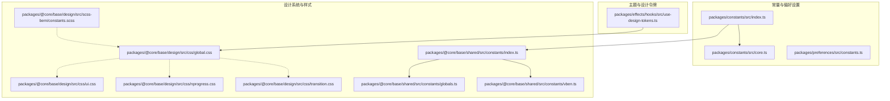
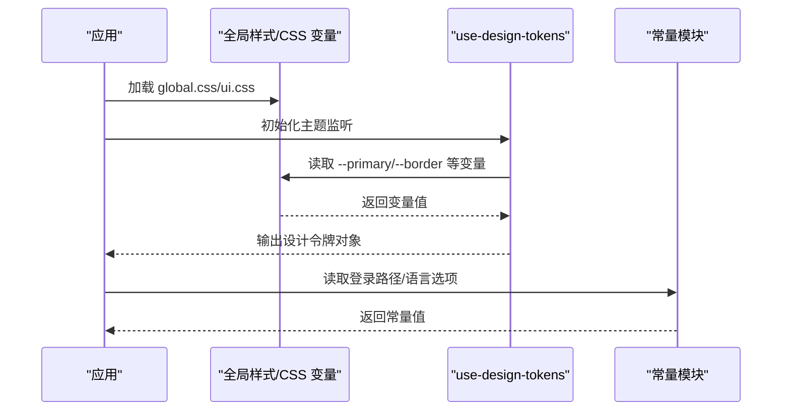
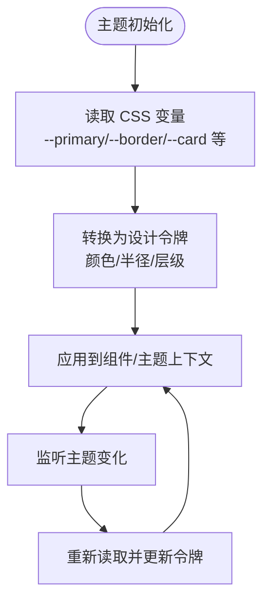
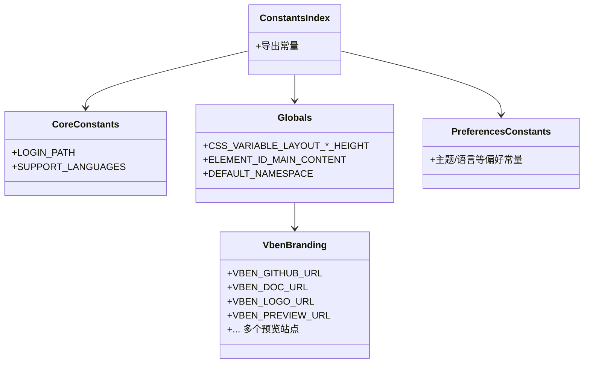
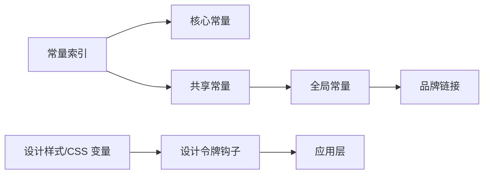

# 基础模块

<cite>
**本文引用的文件**
- [packages/constants/src/index.ts](file://packages/constants/src/index.ts)
- [packages/constants/src/core.ts](file://packages/constants/src/core.ts)
- [packages/@core/base/shared/src/constants/index.ts](file://packages/@core/base/shared/src/constants/index.ts)
- [packages/@core/base/shared/src/constants/globals.ts](file://packages/@core/base/shared/src/constants/globals.ts)
- [packages/@core/base/shared/src/constants/vben.ts](file://packages/@core/base/shared/src/constants/vben.ts)
- [packages/preferences/src/constants.ts](file://packages/preferences/src/constants.ts)
- [packages/effects/hooks/src/use-design-tokens.ts](file://packages/effects/hooks/src/use-design-tokens.ts)
- [packages/@core/base/design/src/scss-bem/constants.scss](file://packages/@core/base/design/src/scss-bem/constants.scss)
- [packages/@core/base/design/src/css/global.css](file://packages/@core/base/design/src/css/global.css)
- [packages/@core/base/design/src/css/ui.css](file://packages/@core/base/design/src/css/ui.css)
- [packages/@core/base/design/src/css/nprogress.css](file://packages/@core/base/design/src/css/nprogress.css)
- [packages/@core/base/design/src/css/transition.css](file://packages/@core/base/design/src/css/transition.css)
- [packages/@core/base/README.md](file://packages/@core/base/README.md)
</cite>

## 目录

1. [简介](#简介)
2. [项目结构](#项目结构)
3. [核心组件](#核心组件)
4. [架构总览](#架构总览)
5. [详细组件分析](#详细组件分析)
6. [依赖分析](#依赖分析)
7. [性能考虑](#性能考虑)
8. [故障排查指南](#故障排查指南)
9. [结论](#结论)
10. [附录](#附录)

## 简介

本文件面向“基础模块”的设计与实现，聚焦于以下目标：

- 解释基础模块的核心功能与设计原则：设计系统（颜色、字体、间距、阴影）、常量定义（API地址、权限标识、状态码等）、类型声明（通用接口、枚举、工具类型）。
- 提供设计系统配置与自定义指南，帮助开发者理解并扩展基础能力。

基础模块在仓库中由多个子包协同组成：常量与偏好设置、设计系统样式与变量、以及用于主题与设计令牌的钩子。这些模块共同为上层应用提供一致的设计语言与运行时配置。

## 项目结构

基础模块主要分布在以下位置：

- 常量与偏好设置：packages/constants、packages/preferences
- 设计系统与样式：packages/@core/base/design（CSS/SCSS）、packages/@core/base/shared/src/constants（CSS 变量与全局常量）
- 主题与设计令牌：packages/effects/hooks（use-design-tokens）

**图表来源**

- [packages/constants/src/index.ts:1-3](file://packages/constants/src/index.ts#L1-L3)
- [packages/constants/src/core.ts:1-24](file://packages/constants/src/core.ts#L1-L24)
- [packages/@core/base/shared/src/constants/index.ts:1-3](file://packages/@core/base/shared/src/constants/index.ts#L1-L3)
- [packages/@core/base/shared/src/constants/globals.ts:1-17](file://packages/@core/base/shared/src/constants/globals.ts#L1-L17)
- [packages/@core/base/shared/src/constants/vben.ts:1-31](file://packages/@core/base/shared/src/constants/vben.ts#L1-L31)
- [packages/@core/base/design/src/css/global.css](file://packages/@core/base/design/src/css/global.css)
- [packages/@core/base/design/src/css/ui.css](file://packages/@core/base/design/src/css/ui.css)
- [packages/@core/base/design/src/css/nprogress.css](file://packages/@core/base/design/src/css/nprogress.css)
- [packages/@core/base/design/src/css/transition.css](file://packages/@core/base/design/src/css/transition.css)
- [packages/@core/base/design/src/scss-bem/constants.scss](file://packages/@core/base/design/src/scss-bem/constants.scss)
- [packages/effects/hooks/src/use-design-tokens.ts:47-149](file://packages/effects/hooks/src/use-design-tokens.ts#L47-L149)

**章节来源**

- [packages/@core/base/README.md:1-6](file://packages/@core/base/README.md#L1-L6)
- [packages/@core/base/shared/src/constants/index.ts:1-3](file://packages/@core/base/shared/src/constants/index.ts#L1-L3)

## 核心组件

- 常量与偏好设置：统一导出登录路径、语言选项、全局 CSS 变量名、品牌链接等。
- 设计系统与样式：通过 CSS 变量、SCSS 常量与全局样式，定义颜色、字体、间距、阴影与过渡效果。
- 主题与设计令牌：从 CSS 变量中提取设计令牌，适配不同 UI 框架（如 Naive UI），并在主题切换时动态更新。

**章节来源**

- [packages/constants/src/core.ts:1-24](file://packages/constants/src/core.ts#L1-L24)
- [packages/@core/base/shared/src/constants/globals.ts:1-17](file://packages/@core/base/shared/src/constants/globals.ts#L1-L17)
- [packages/@core/base/shared/src/constants/vben.ts:1-31](file://packages/@core/base/shared/src/constants/vben.ts#L1-L31)
- [packages/@core/base/design/src/scss-bem/constants.scss](file://packages/@core/base/design/src/scss-bem/constants.scss)
- [packages/effects/hooks/src/use-design-tokens.ts:47-149](file://packages/effects/hooks/src/use-design-tokens.ts#L47-L149)

## 架构总览

基础模块的运行时交互如下：

- 应用启动时加载全局样式与 CSS 变量。
- 主题切换时，钩子读取 CSS 变量并生成设计令牌对象。
- 常量模块提供统一的登录路径、语言列表与品牌链接，供路由与国际化使用。

**图表来源**

- [packages/effects/hooks/src/use-design-tokens.ts:47-149](file://packages/effects/hooks/src/use-design-tokens.ts#L47-L149)
- [packages/@core/base/design/src/css/global.css](file://packages/@core/base/design/src/css/global.css)
- [packages/@core/base/design/src/css/ui.css](file://packages/@core/base/design/src/css/ui.css)
- [packages/constants/src/core.ts:1-24](file://packages/constants/src/core.ts#L1-L24)

## 详细组件分析

### 设计系统（颜色、字体、间距、阴影）

- CSS 变量与全局样式
  - 全局样式文件集中定义布局占位、过渡动画与进度条样式，作为设计系统的基础。
  - 全局样式与 UI 样式相互补充，确保组件级样式的一致性。
- SCSS 常量
  - SCSS 层面提供常量定义，便于在样式构建阶段进行统一管理。
- 设计令牌提取
  - 钩子从 CSS 变量中读取主色、边框、卡片、背景等关键变量，并转换为可直接使用的令牌对象。
  - 在主题切换时，钩子会重新计算并更新令牌，保证视觉一致性。

**图表来源**

- [packages/effects/hooks/src/use-design-tokens.ts:47-149](file://packages/effects/hooks/src/use-design-tokens.ts#L47-L149)
- [packages/@core/base/design/src/css/global.css](file://packages/@core/base/design/src/css/global.css)
- [packages/@core/base/design/src/css/ui.css](file://packages/@core/base/design/src/css/ui.css)

**章节来源**

- [packages/@core/base/design/src/css/global.css](file://packages/@core/base/design/src/css/global.css)
- [packages/@core/base/design/src/css/ui.css](file://packages/@core/base/design/src/css/ui.css)
- [packages/@core/base/design/src/css/nprogress.css](file://packages/@core/base/design/src/css/nprogress.css)
- [packages/@core/base/design/src/css/transition.css](file://packages/@core/base/design/src/css/transition.css)
- [packages/@core/base/design/src/scss-bem/constants.scss](file://packages/@core/base/design/src/scss-bem/constants.scss)
- [packages/effects/hooks/src/use-design-tokens.ts:47-149](file://packages/effects/hooks/src/use-design-tokens.ts#L47-L149)

### 常量定义（API 地址、权限标识、状态码）

- 登录路径与语言选项
  - 统一导出登录页面 URL 与支持的语言列表，便于路由守卫与国际化模块复用。
- 品牌与预览地址
  - 定义 GitHub 仓库、文档、Logo 与各框架预览站点地址，便于在应用中展示与跳转。
- 全局 CSS 变量名与元素 ID
  - 定义布局高度、宽度、头部/底部高度等 CSS 变量名，以及主内容区元素 ID，确保布局与样式联动一致。
- 偏好设置常量
  - 偏好设置模块提供主题、语言等偏好项的常量定义，便于跨模块共享。

**图表来源**

- [packages/constants/src/index.ts:1-3](file://packages/constants/src/index.ts#L1-L3)
- [packages/constants/src/core.ts:1-24](file://packages/constants/src/core.ts#L1-L24)
- [packages/@core/base/shared/src/constants/index.ts:1-3](file://packages/@core/base/shared/src/constants/index.ts#L1-L3)
- [packages/@core/base/shared/src/constants/globals.ts:1-17](file://packages/@core/base/shared/src/constants/globals.ts#L1-L17)
- [packages/@core/base/shared/src/constants/vben.ts:1-31](file://packages/@core/base/shared/src/constants/vben.ts#L1-L31)
- [packages/preferences/src/constants.ts](file://packages/preferences/src/constants.ts)

**章节来源**

- [packages/constants/src/core.ts:1-24](file://packages/constants/src/core.ts#L1-L24)
- [packages/@core/base/shared/src/constants/globals.ts:1-17](file://packages/@core/base/shared/src/constants/globals.ts#L1-L17)
- [packages/@core/base/shared/src/constants/vben.ts:1-31](file://packages/@core/base/shared/src/constants/vben.ts#L1-L31)
- [packages/preferences/src/constants.ts](file://packages/preferences/src/constants.ts)

### 类型定义（通用接口、枚举、工具类型）

- 语言选项接口
  - 定义语言标签的通用接口，约束标签文本与值域（如 zh-CN/en-US）。
- 建议实践
  - 将通用类型集中导出，避免重复定义；对枚举与工具类型采用明确的命名空间前缀，便于维护与查找。

**章节来源**

- [packages/constants/src/core.ts:6-9](file://packages/constants/src/core.ts#L6-L9)

### 设计系统配置与自定义指南

- 自定义 CSS 变量
  - 在全局样式中新增或覆盖 CSS 变量，即可影响设计令牌的生成与组件渲染。
- 扩展设计令牌
  - 在钩子中增加新的变量读取逻辑，将新变量映射为设计令牌字段，确保主题切换时同步生效。
- 命名规范
  - 使用语义化命名（如 --primary、--border、--card），并保持与 SCSS 常量一致，减少维护成本。

**章节来源**

- [packages/effects/hooks/src/use-design-tokens.ts:47-149](file://packages/effects/hooks/src/use-design-tokens.ts#L47-L149)
- [packages/@core/base/design/src/css/global.css](file://packages/@core/base/design/src/css/global.css)
- [packages/@core/base/design/src/scss-bem/constants.scss](file://packages/@core/base/design/src/scss-bem/constants.scss)

## 依赖分析

- 常量模块依赖共享常量（CSS 变量名、品牌信息）与偏好设置常量。
- 设计系统样式被主题钩子依赖，钩子再被应用层消费。
- 常量模块与设计系统之间无直接耦合，通过 CSS 变量间接关联。

**图表来源**

- [packages/constants/src/index.ts:1-3](file://packages/constants/src/index.ts#L1-L3)
- [packages/constants/src/core.ts:1-24](file://packages/constants/src/core.ts#L1-L24)
- [packages/@core/base/shared/src/constants/index.ts:1-3](file://packages/@core/base/shared/src/constants/index.ts#L1-L3)
- [packages/@core/base/shared/src/constants/globals.ts:1-17](file://packages/@core/base/shared/src/constants/globals.ts#L1-L17)
- [packages/@core/base/shared/src/constants/vben.ts:1-31](file://packages/@core/base/shared/src/constants/vben.ts#L1-L31)
- [packages/effects/hooks/src/use-design-tokens.ts:47-149](file://packages/effects/hooks/src/use-design-tokens.ts#L47-L149)

**章节来源**

- [packages/@core/base/shared/src/constants/index.ts:1-3](file://packages/@core/base/shared/src/constants/index.ts#L1-L3)
- [packages/@core/base/shared/src/constants/globals.ts:1-17](file://packages/@core/base/shared/src/constants/globals.ts#L1-L17)
- [packages/@core/base/shared/src/constants/vben.ts:1-31](file://packages/@core/base/shared/src/constants/vben.ts#L1-L31)
- [packages/effects/hooks/src/use-design-tokens.ts:47-149](file://packages/effects/hooks/src/use-design-tokens.ts#L47-L149)

## 性能考虑

- 设计令牌提取建议使用响应式监听与缓存策略，避免频繁读取 DOM。
- CSS 变量的读取应批量进行，减少重排与重绘。
- 常量与样式尽量集中管理，降低打包体积与重复请求。

## 故障排查指南

- 主题不生效
  - 检查全局样式是否正确加载，确认 CSS 变量是否存在且命名正确。
  - 确认钩子已监听主题变化并触发重新计算。
- 常量不生效
  - 检查常量导出路径与导入方式是否一致。
  - 确认语言选项与登录路径是否符合预期。

**章节来源**

- [packages/effects/hooks/src/use-design-tokens.ts:47-149](file://packages/effects/hooks/src/use-design-tokens.ts#L47-L149)
- [packages/constants/src/core.ts:1-24](file://packages/constants/src/core.ts#L1-L24)

## 结论

基础模块通过“常量—样式—令牌”三层协作，提供了统一的设计语言与运行时配置。开发者可在不破坏整体一致性的情况下，按需扩展 CSS 变量与设计令牌，以满足不同 UI 框架与业务场景的需求。

## 附录

- 基础模块说明：基础共享包，请勿引入 workspace 依赖。
- 常量与偏好设置：统一导出登录路径、语言选项、品牌链接与全局 CSS 变量名。
- 设计系统：通过 CSS 变量与 SCSS 常量定义颜色、字体、间距与阴影；通过钩子生成设计令牌并随主题切换更新。

**章节来源**

- [packages/@core/base/README.md:1-6](file://packages/@core/base/README.md#L1-L6)
- [packages/constants/src/index.ts:1-3](file://packages/constants/src/index.ts#L1-L3)
- [packages/@core/base/shared/src/constants/index.ts:1-3](file://packages/@core/base/shared/src/constants/index.ts#L1-L3)
