# 组合式API

<cite>
**本文引用的文件**
- [packages/@core/composables/src/index.ts](file://packages/@core/composables/src/index.ts)
- [packages/@core/composables/src/use-sortable.ts](file://packages/@core/composables/src/use-sortable.ts)
- [packages/@core/composables/src/use-layout-style.ts](file://packages/@core/composables/src/use-layout-style.ts)
- [packages/@core/composables/src/use-namespace.ts](file://packages/@core/composables/src/use-namespace.ts)
- [packages/@core/composables/src/use-scroll-lock.ts](file://packages/@core/composables/src/use-scroll-lock.ts)
- [packages/@core/composables/src/use-simple-locale/index.ts](file://packages/@core/composables/src/use-simple-locale/index.ts)
- [packages/@core/composables/src/use-is-mobile.ts](file://packages/@core/composables/src/use-is-mobile.ts)
- [packages/@core/composables/src/use-priority-value.ts](file://packages/@core/composables/src/use-priority-value.ts)
- [packages/effects/hooks/src/use-pagination.ts](file://packages/effects/hooks/src/use-pagination.ts)
- [packages/effects/hooks/src/use-refresh.ts](file://packages/effects/hooks/src/use-refresh.ts)
- [packages/effects/hooks/src/use-tabs.ts](file://packages/effects/hooks/src/use-tabs.ts)
- [packages/effects/hooks/src/use-watermark.ts](file://packages/effects/hooks/src/use-watermark.ts)
</cite>

## 目录
1. [简介](#简介)
2. [项目结构](#项目结构)
3. [核心组件](#核心组件)
4. [架构总览](#架构总览)
5. [详细组件分析](#详细组件分析)
6. [依赖分析](#依赖分析)
7. [性能考虑](#性能考虑)
8. [故障排查指南](#故障排查指南)
9. [结论](#结论)
10. [附录](#附录)

## 简介
本文件系统性梳理并阐述组合式API在本项目中的设计与实践，重点覆盖以下方面：
- 设计思想：以“可复用逻辑”为核心，将状态、副作用、行为抽取为可组合的函数，提升代码内聚性与可测试性。
- 应用范围：涵盖布局样式、交互控制、国际化、分页、标签页、滚动锁定、拖拽排序、水印等高频场景。
- 使用方式：统一导出入口，按需引入；参数配置清晰，返回值结构稳定；错误处理明确。
- 性能与内存：利用响应式与防抖、懒加载、生命周期钩子与资源释放，降低开销并避免泄漏。

## 项目结构
组合式API主要分布在两个包中：
- @core/composables：通用型组合式函数，如布局样式、命名空间、滚动锁定、移动端检测、优先级值透传、国际化等。
- effects/hooks：业务增强型组合式函数，如分页、刷新、标签页、水印等。

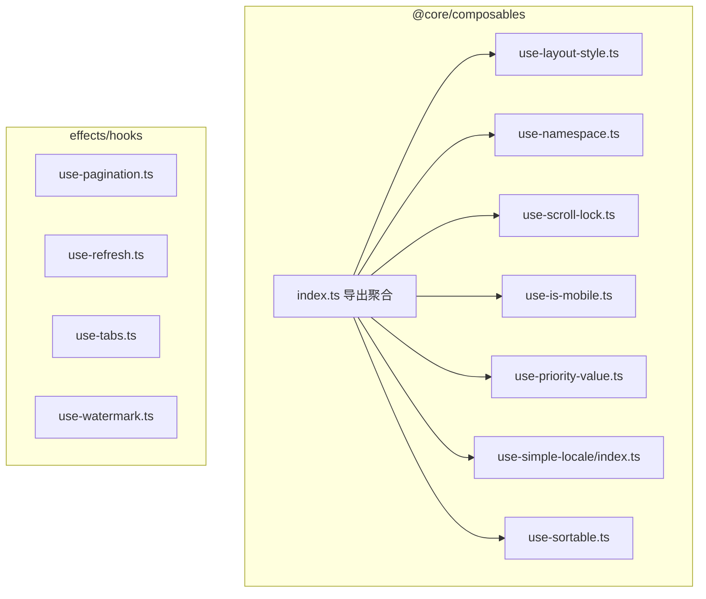

图表来源
- [packages/@core/composables/src/index.ts:1-14](file://packages/@core/composables/src/index.ts#L1-L14)
- [packages/@core/composables/src/use-layout-style.ts:1-88](file://packages/@core/composables/src/use-layout-style.ts#L1-L88)
- [packages/@core/composables/src/use-namespace.ts:1-107](file://packages/@core/composables/src/use-namespace.ts#L1-L107)
- [packages/@core/composables/src/use-scroll-lock.ts:1-55](file://packages/@core/composables/src/use-scroll-lock.ts#L1-L55)
- [packages/@core/composables/src/use-is-mobile.ts:1-8](file://packages/@core/composables/src/use-is-mobile.ts#L1-L8)
- [packages/@core/composables/src/use-priority-value.ts:1-95](file://packages/@core/composables/src/use-priority-value.ts#L1-L95)
- [packages/@core/composables/src/use-simple-locale/index.ts:1-28](file://packages/@core/composables/src/use-simple-locale/index.ts#L1-L28)
- [packages/@core/composables/src/use-sortable.ts:1-30](file://packages/@core/composables/src/use-sortable.ts#L1-L30)
- [packages/effects/hooks/src/use-pagination.ts:1-73](file://packages/effects/hooks/src/use-pagination.ts#L1-L73)
- [packages/effects/hooks/src/use-refresh.ts:1-17](file://packages/effects/hooks/src/use-refresh.ts#L1-L17)
- [packages/effects/hooks/src/use-tabs.ts:1-134](file://packages/effects/hooks/src/use-tabs.ts#L1-L134)
- [packages/effects/hooks/src/use-watermark.ts:1-85](file://packages/effects/hooks/src/use-watermark.ts#L1-L85)

章节来源
- [packages/@core/composables/src/index.ts:1-14](file://packages/@core/composables/src/index.ts#L1-L14)

## 核心组件
- 布局样式与尺寸：useLayoutContentStyle/useLayoutHeaderStyle/useLayoutFooterStyle，基于CSS变量与ResizeObserver，提供内容区可见尺寸、头部/底部高度读写能力。
- 命名空间与样式变量：useNamespace，生成BEM风格类名与CSS变量，便于主题化与样式隔离。
- 滚动锁定：useScrollLock，结合滚动条宽度与布局固定节点，安全地锁定页面滚动并处理过渡动画。
- 移动端检测：useIsMobile，基于断点判断是否移动端视图。
- 优先级值透传：usePriorityValue/usePriorityValues/useForwardPriorityValues，按插槽/attrs/props/state顺序解析最终值，支持批量透传。
- 国际化：useSimpleLocale，共享语言状态与翻译函数，支持动态切换。
- 拖拽排序：useSortable，动态导入SortableJS并初始化，返回初始化方法。
- 分页：usePagination，对列表进行分页计算，暴露当前页、总数、每页大小与分页结果，并在总数变化时自动回到第一页。
- 刷新与标签页：useRefresh、useTabs，封装标签页增删改查、固定/取消固定、刷新、新窗口打开、标题设置等。
- 水印：useWatermark，延迟初始化水印实例，支持更新选项与销毁，仅在首次挂载时注册卸载钩子。

章节来源
- [packages/@core/composables/src/use-layout-style.ts:1-88](file://packages/@core/composables/src/use-layout-style.ts#L1-L88)
- [packages/@core/composables/src/use-namespace.ts:1-107](file://packages/@core/composables/src/use-namespace.ts#L1-L107)
- [packages/@core/composables/src/use-scroll-lock.ts:1-55](file://packages/@core/composables/src/use-scroll-lock.ts#L1-L55)
- [packages/@core/composables/src/use-is-mobile.ts:1-8](file://packages/@core/composables/src/use-is-mobile.ts#L1-L8)
- [packages/@core/composables/src/use-priority-value.ts:1-95](file://packages/@core/composables/src/use-priority-value.ts#L1-L95)
- [packages/@core/composables/src/use-simple-locale/index.ts:1-28](file://packages/@core/composables/src/use-simple-locale/index.ts#L1-L28)
- [packages/@core/composables/src/use-sortable.ts:1-30](file://packages/@core/composables/src/use-sortable.ts#L1-L30)
- [packages/effects/hooks/src/use-pagination.ts:1-73](file://packages/effects/hooks/src/use-pagination.ts#L1-L73)
- [packages/effects/hooks/src/use-refresh.ts:1-17](file://packages/effects/hooks/src/use-refresh.ts#L1-L17)
- [packages/effects/hooks/src/use-tabs.ts:1-134](file://packages/effects/hooks/src/use-tabs.ts#L1-L134)
- [packages/effects/hooks/src/use-watermark.ts:1-85](file://packages/effects/hooks/src/use-watermark.ts#L1-L85)

## 架构总览
组合式API遵循“单一职责 + 聚合导出”的设计原则：
- 单个功能封装为独立组合式函数，内部使用Vue响应式与VueUse工具，确保生命周期与副作用可控。
- 通过入口文件统一导出，便于按需引入与Tree Shaking。
- 业务增强型组合式函数依赖状态存储与路由，形成“UI层 -> 组合式API -> 状态/路由”的清晰链路。

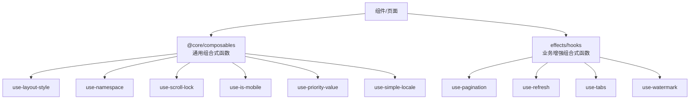

图表来源
- [packages/@core/composables/src/index.ts:1-14](file://packages/@core/composables/src/index.ts#L1-L14)
- [packages/@core/composables/src/use-layout-style.ts:1-88](file://packages/@core/composables/src/use-layout-style.ts#L1-L88)
- [packages/@core/composables/src/use-namespace.ts:1-107](file://packages/@core/composables/src/use-namespace.ts#L1-L107)
- [packages/@core/composables/src/use-scroll-lock.ts:1-55](file://packages/@core/composables/src/use-scroll-lock.ts#L1-L55)
- [packages/@core/composables/src/use-is-mobile.ts:1-8](file://packages/@core/composables/src/use-is-mobile.ts#L1-L8)
- [packages/@core/composables/src/use-priority-value.ts:1-95](file://packages/@core/composables/src/use-priority-value.ts#L1-L95)
- [packages/@core/composables/src/use-simple-locale/index.ts:1-28](file://packages/@core/composables/src/use-simple-locale/index.ts#L1-L28)
- [packages/effects/hooks/src/use-pagination.ts:1-73](file://packages/effects/hooks/src/use-pagination.ts#L1-L73)
- [packages/effects/hooks/src/use-refresh.ts:1-17](file://packages/effects/hooks/src/use-refresh.ts#L1-L17)
- [packages/effects/hooks/src/use-tabs.ts:1-134](file://packages/effects/hooks/src/use-tabs.ts#L1-L134)
- [packages/effects/hooks/src/use-watermark.ts:1-85](file://packages/effects/hooks/src/use-watermark.ts#L1-L85)

## 详细组件分析

### useLayoutContentStyle/useLayoutHeaderStyle/useLayoutFooterStyle
- 设计要点
  - 基于CSS变量维护布局关键尺寸，减少DOM查询与重排。
  - 使用ResizeObserver监听内容区尺寸变化，配合防抖降低频繁计算。
  - 提供overlayStyle与visibleDomRect，便于浮层定位与遮罩覆盖。
- 参数与返回
  - 返回：contentElement、overlayStyle、visibleDomRect。
- 错误处理
  - 在卸载阶段主动断开观察器，避免内存泄漏。
- 性能建议
  - 合理设置防抖间隔；仅在需要时启用观察器。

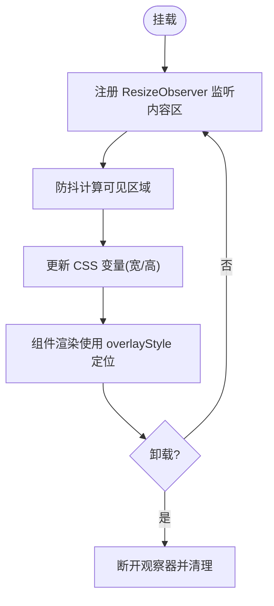

图表来源
- [packages/@core/composables/src/use-layout-style.ts:1-88](file://packages/@core/composables/src/use-layout-style.ts#L1-L88)

章节来源
- [packages/@core/composables/src/use-layout-style.ts:1-88](file://packages/@core/composables/src/use-layout-style.ts#L1-L88)

### useNamespace
- 设计要点
  - 生成BEM风格类名，支持块、元素、修饰符组合。
  - 提供CSS变量生成器，便于主题化与样式隔离。
- 参数与返回
  - 返回：b/be/bem/bm、e/em/m、is、以及cssVar/cssVarBlock系列方法。
- 使用建议
  - 在组件样式中优先使用生成的类名与CSS变量，避免硬编码。

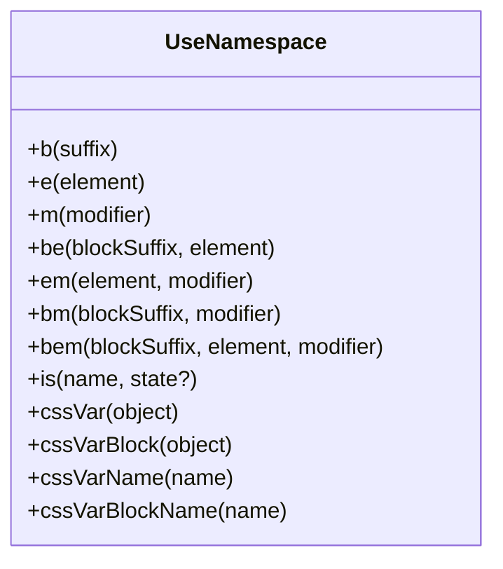

图表来源
- [packages/@core/composables/src/use-namespace.ts:1-107](file://packages/@core/composables/src/use-namespace.ts#L1-L107)

章节来源
- [packages/@core/composables/src/use-namespace.ts:1-107](file://packages/@core/composables/src/use-namespace.ts#L1-L107)

### useScrollLock
- 设计要点
  - 锁定body滚动，同时补偿滚动条宽度，避免页面跳变。
  - 对特定固定节点应用paddingRight补偿，保证布局一致性。
  - 在卸载时恢复状态，避免副作用残留。
- 参数与返回
  - 无显式参数；通过副作用完成初始化与清理。
- 性能建议
  - 仅在存在滚动条时执行补偿逻辑；尽量减少DOM查询次数。

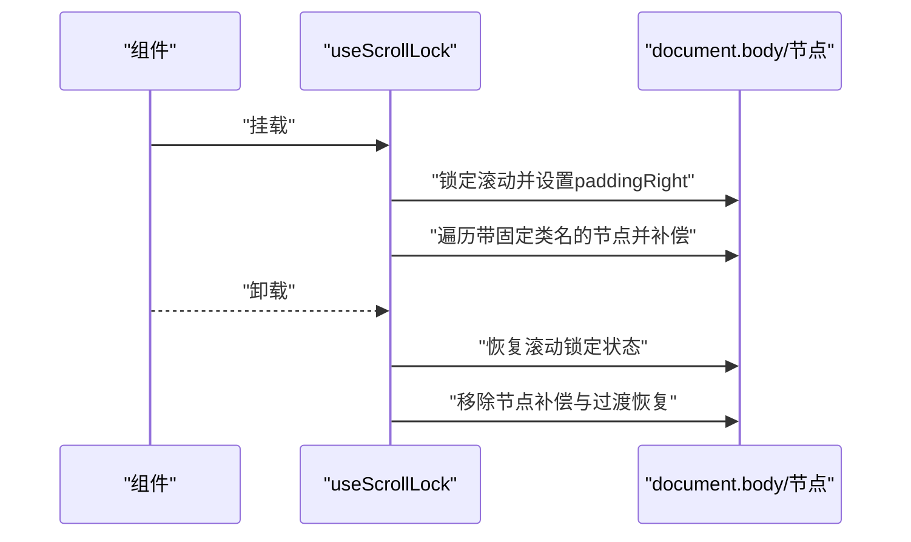

图表来源
- [packages/@core/composables/src/use-scroll-lock.ts:1-55](file://packages/@core/composables/src/use-scroll-lock.ts#L1-L55)

章节来源
- [packages/@core/composables/src/use-scroll-lock.ts:1-55](file://packages/@core/composables/src/use-scroll-lock.ts#L1-L55)

### useIsMobile
- 设计要点
  - 基于断点判断是否移动端视图，返回布尔值。
- 参数与返回
  - 返回：isMobile。
- 使用建议
  - 在布局切换、交互策略调整时使用该值。

章节来源
- [packages/@core/composables/src/use-is-mobile.ts:1-8](file://packages/@core/composables/src/use-is-mobile.ts#L1-L8)

### usePriorityValue/usePriorityValues/useForwardPriorityValues
- 设计要点
  - 解析优先级：插槽 > attrs > props > state，确保灵活性与可覆盖性。
  - 支持批量解析与一次性解包透传，便于组件属性转发。
- 参数与返回
  - 返回：单值计算结果或批量映射对象。
- 错误处理
  - 通过类型约束与解包逻辑，避免未定义值导致的异常。

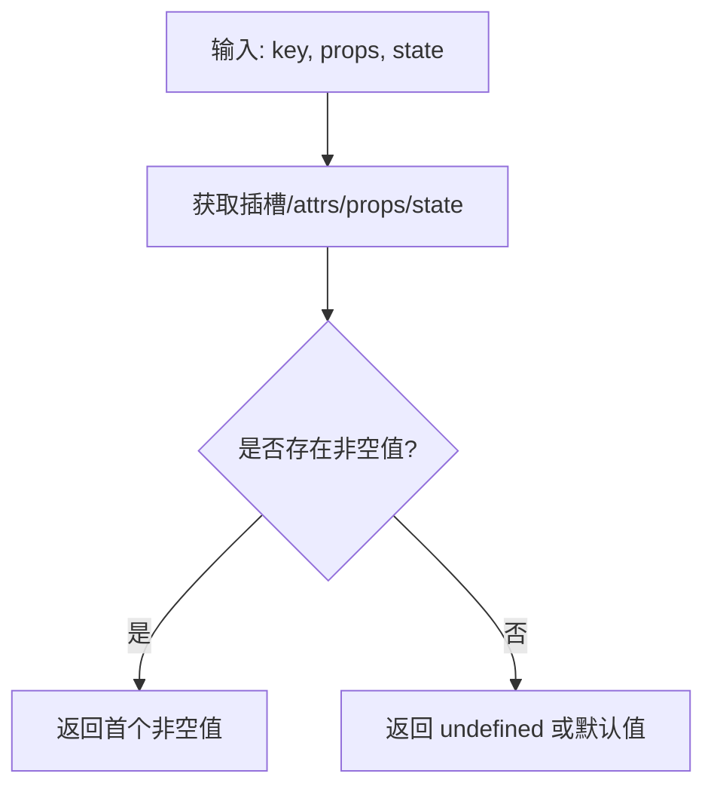

图表来源
- [packages/@core/composables/src/use-priority-value.ts:1-95](file://packages/@core/composables/src/use-priority-value.ts#L1-L95)

章节来源
- [packages/@core/composables/src/use-priority-value.ts:1-95](file://packages/@core/composables/src/use-priority-value.ts#L1-L95)

### useSimpleLocale
- 设计要点
  - 共享语言状态与翻译函数，支持动态切换语言。
  - 基于共享组合式函数，确保全局一致的语言上下文。
- 参数与返回
  - 返回：$t、currentLocale、setSimpleLocale。
- 使用建议
  - 在多语言组件中统一使用$t进行文本渲染。

章节来源
- [packages/@core/composables/src/use-simple-locale/index.ts:1-28](file://packages/@core/composables/src/use-simple-locale/index.ts#L1-L28)

### useSortable
- 设计要点
  - 动态导入SortableJS，按需加载，减少首屏体积。
  - 默认配置包含动画、延时与触摸设备适配，可扩展自定义选项。
- 参数与返回
  - 返回：initializeSortable()，用于异步初始化并返回实例。
- 性能建议
  - 在容器渲染完成后调用初始化；避免在频繁重绘时重复创建实例。

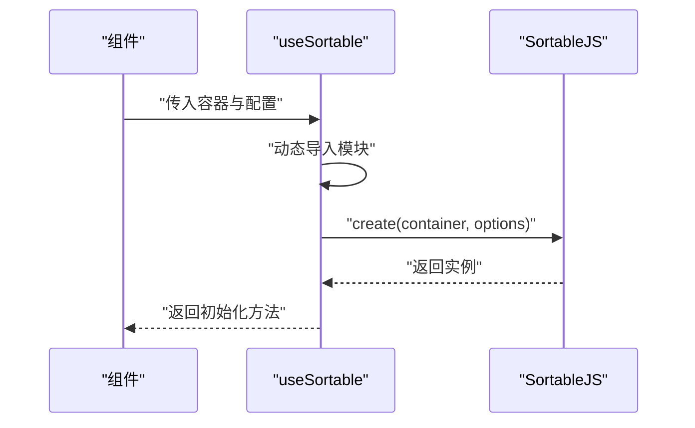

图表来源
- [packages/@core/composables/src/use-sortable.ts:1-30](file://packages/@core/composables/src/use-sortable.ts#L1-L30)

章节来源
- [packages/@core/composables/src/use-sortable.ts:1-30](file://packages/@core/composables/src/use-sortable.ts#L1-L30)

### usePagination
- 设计要点
  - 对列表进行分页切片，计算总页数与当前页。
  - 在总数变化时自动回到第一页，避免无效页码。
- 参数与返回
  - 返回：setCurrentPage、setPageSize、paginationList、total、currentPage。
- 错误处理
  - 对非法页码与页大小抛出错误，提示调用方修正参数。

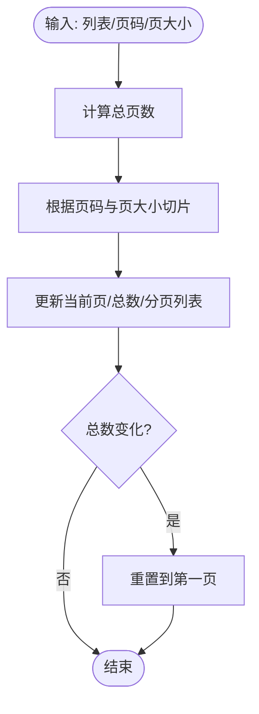

图表来源
- [packages/effects/hooks/src/use-pagination.ts:1-73](file://packages/effects/hooks/src/use-pagination.ts#L1-L73)

章节来源
- [packages/effects/hooks/src/use-pagination.ts:1-73](file://packages/effects/hooks/src/use-pagination.ts#L1-L73)

### useRefresh/useTabs
- 设计要点
  - useRefresh：通过标签栏存储刷新当前路由。
  - useTabs：封装标签页的关闭、固定/取消固定、刷新、新窗口打开、标题设置与禁用状态判断。
- 参数与返回
  - useRefresh：返回refresh方法。
  - useTabs：返回一系列标签页操作方法与禁用状态查询。
- 使用建议
  - 在路由守卫或页面生命周期中调用刷新；在菜单或按钮中绑定标签页操作。

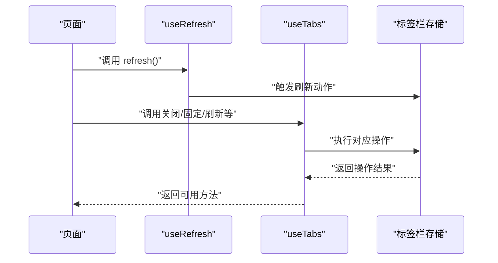

图表来源
- [packages/effects/hooks/src/use-refresh.ts:1-17](file://packages/effects/hooks/src/use-refresh.ts#L1-L17)
- [packages/effects/hooks/src/use-tabs.ts:1-134](file://packages/effects/hooks/src/use-tabs.ts#L1-L134)

章节来源
- [packages/effects/hooks/src/use-refresh.ts:1-17](file://packages/effects/hooks/src/use-refresh.ts#L1-L17)
- [packages/effects/hooks/src/use-tabs.ts:1-134](file://packages/effects/hooks/src/use-tabs.ts#L1-L134)

### useWatermark
- 设计要点
  - 延迟初始化水印实例，支持更新选项与销毁。
  - 仅在首次挂载时注册卸载钩子，避免重复注册导致的资源提前释放。
- 参数与返回
  - 返回：initWatermark、updateWatermark、destroyWatermark、只读watermark。
- 性能建议
  - 在路由切换等场景谨慎调用销毁；必要时先update再destroy。

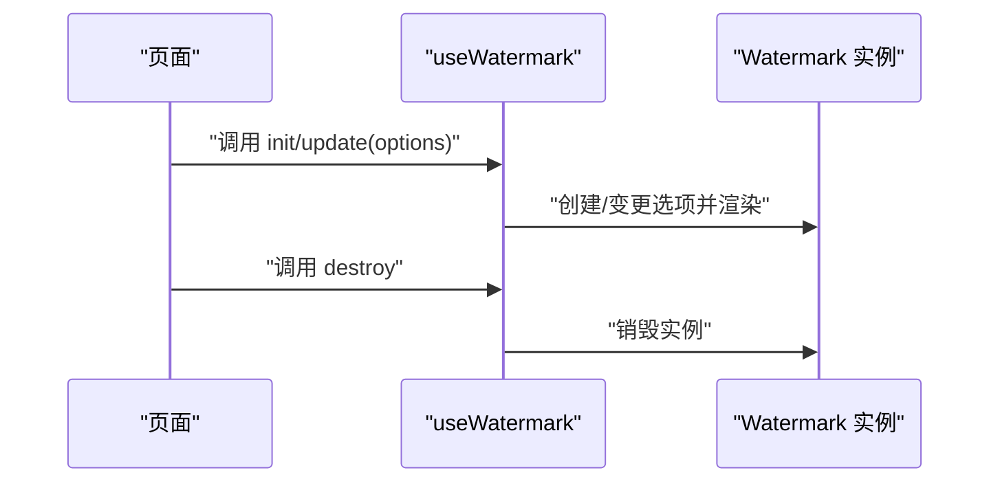

图表来源
- [packages/effects/hooks/src/use-watermark.ts:1-85](file://packages/effects/hooks/src/use-watermark.ts#L1-L85)

章节来源
- [packages/effects/hooks/src/use-watermark.ts:1-85](file://packages/effects/hooks/src/use-watermark.ts#L1-L85)

## 依赖分析
- 内部依赖
  - @core/composables内部依赖Vue响应式与@vueuse/core提供的工具函数，确保生命周期与副作用可控。
  - effects/hooks依赖vue-router与状态存储，形成“UI层 -> 组合式API -> 状态/路由”的调用链。
- 外部依赖
  - sortablejs：用于拖拽排序。
  - watermark-js-plus：用于页面水印。
  - vue-router：用于路由与标签页相关能力。
- 耦合与内聚
  - 组合式函数保持低耦合，职责单一；通过入口文件聚合导出，便于按需引入。

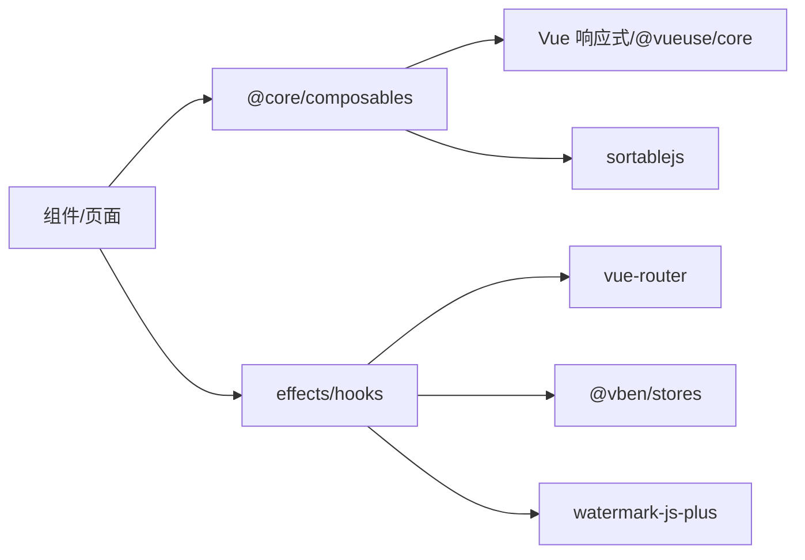

图表来源
- [packages/@core/composables/src/index.ts:1-14](file://packages/@core/composables/src/index.ts#L1-L14)
- [packages/@core/composables/src/use-sortable.ts:1-30](file://packages/@core/composables/src/use-sortable.ts#L1-L30)
- [packages/effects/hooks/src/use-watermark.ts:1-85](file://packages/effects/hooks/src/use-watermark.ts#L1-L85)
- [packages/effects/hooks/src/use-refresh.ts:1-17](file://packages/effects/hooks/src/use-refresh.ts#L1-L17)
- [packages/effects/hooks/src/use-tabs.ts:1-134](file://packages/effects/hooks/src/use-tabs.ts#L1-L134)

## 性能考虑
- 懒加载与按需导入
  - useSortable与useWatermark均采用动态导入，减少首屏体积与初次渲染压力。
- 防抖与节流
  - useLayoutContentStyle使用防抖函数处理ResizeObserver回调，降低频繁计算。
- 生命周期管理
  - useLayoutContentStyle在卸载时断开观察器；useScrollLock在卸载时恢复状态；useWatermark仅注册一次卸载钩子。
- 响应式与最小化更新
  - 通过computed与ref组合，仅在依赖变化时更新；批量透传使用一次性解包，避免多次解包开销。

## 故障排查指南
- 分页异常
  - 现象：页码越界或页大小小于1报错。
  - 排查：检查传入的页码与页大小是否合法；确认总数变化后是否自动回到第一页。
  - 参考
    - [packages/effects/hooks/src/use-pagination.ts:13-73](file://packages/effects/hooks/src/use-pagination.ts#L13-L73)
- 滚动锁定失效
  - 现象：页面滚动未被锁定或出现跳变。
  - 排查：确认是否存在滚动条；检查固定节点类名是否正确；确保在卸载时恢复状态。
  - 参考
    - [packages/@core/composables/src/use-scroll-lock.ts:1-55](file://packages/@core/composables/src/use-scroll-lock.ts#L1-L55)
- 拖拽排序不生效
  - 现象：拖拽无反应。
  - 排查：确认容器已渲染完成后再调用初始化；检查动态导入是否成功。
  - 参考
    - [packages/@core/composables/src/use-sortable.ts:1-30](file://packages/@core/composables/src/use-sortable.ts#L1-L30)
- 水印未显示或提前销毁
  - 现象：水印未渲染或在路由切换时被销毁。
  - 排查：确认仅注册一次卸载钩子；在切换路由前避免提前destroy；必要时先update再destroy。
  - 参考
    - [packages/effects/hooks/src/use-watermark.ts:1-85](file://packages/effects/hooks/src/use-watermark.ts#L1-L85)
- 标签页操作不可用
  - 现象：关闭/固定/刷新等按钮不可用。
  - 排查：检查当前标签页索引与固定标签页数量；确认禁用状态计算逻辑。
  - 参考
    - [packages/effects/hooks/src/use-tabs.ts:88-115](file://packages/effects/hooks/src/use-tabs.ts#L88-L115)

章节来源
- [packages/effects/hooks/src/use-pagination.ts:1-73](file://packages/effects/hooks/src/use-pagination.ts#L1-L73)
- [packages/@core/composables/src/use-scroll-lock.ts:1-55](file://packages/@core/composables/src/use-scroll-lock.ts#L1-L55)
- [packages/@core/composables/src/use-sortable.ts:1-30](file://packages/@core/composables/src/use-sortable.ts#L1-L30)
- [packages/effects/hooks/src/use-watermark.ts:1-85](file://packages/effects/hooks/src/use-watermark.ts#L1-L85)
- [packages/effects/hooks/src/use-tabs.ts:88-115](file://packages/effects/hooks/src/use-tabs.ts#L88-L115)

## 结论
本项目的组合式API以“可复用逻辑”为中心，围绕布局、交互、国际化、分页、标签页、滚动锁定、拖拽排序与水印等场景构建了完善的工具集。通过统一导出、清晰的参数与返回值结构、完善的生命周期管理与错误处理，既提升了开发效率，也保障了运行时性能与稳定性。建议在实际项目中遵循“单一职责、按需引入、生命周期可控”的原则，结合本文档的使用示例与最佳实践，快速落地高质量的组合式API。

## 附录
- 常用组合式函数速览
  - 布局与样式：useLayoutContentStyle、useLayoutHeaderStyle、useLayoutFooterStyle、useNamespace、useScrollLock
  - 交互与行为：useIsMobile、usePriorityValue、useSimpleLocale、useSortable
  - 业务增强：usePagination、useRefresh、useTabs、useWatermark
- 使用建议
  - 在组件中优先使用组合式函数封装可复用逻辑；对外暴露稳定的返回值结构；在生命周期钩子中妥善处理资源创建与销毁。