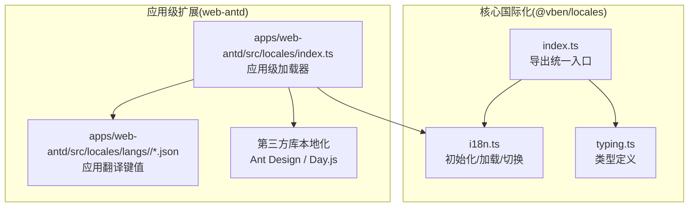
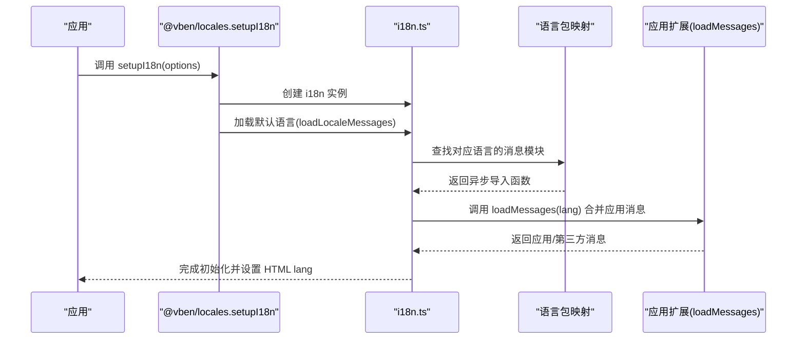
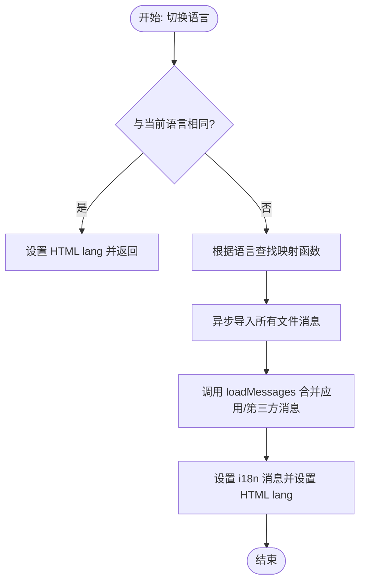
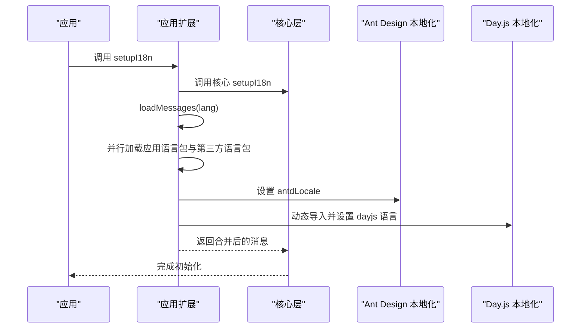
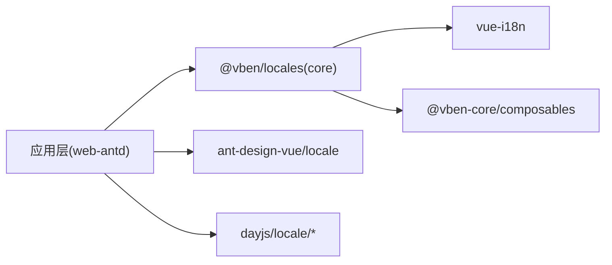

# 国际化包 (@core/locales)

<cite>
**本文引用的文件**
- [packages/locales/src/i18n.ts](file://packages/locales/src/i18n.ts)
- [packages/locales/src/index.ts](file://packages/locales/src/index.ts)
- [packages/locales/src/typing.ts](file://packages/locales/src/typing.ts)
- [apps/web-antd/src/locales/index.ts](file://apps/web-antd/src/locales/index.ts)
- [apps/web-antd/src/locales/README.md](file://apps/web-antd/src/locales/README.md)
- [apps/web-antd/src/locales/langs/zh-CN/system.json](file://apps/web-antd/src/locales/langs/zh-CN/system.json)
- [apps/web-antd/src/locales/langs/en-US/system.json](file://apps/web-antd/src/locales/langs/en-US/system.json)
</cite>

## 目录
1. [简介](#简介)
2. [项目结构](#项目结构)
3. [核心组件](#核心组件)
4. [架构总览](#架构总览)
5. [详细组件分析](#详细组件分析)
6. [依赖关系分析](#依赖关系分析)
7. [性能考量](#性能考量)
8. [故障排查指南](#故障排查指南)
9. [结论](#结论)
10. [附录](#附录)

## 简介
本文件面向国际化包(@core/locales)的使用者与维护者，系统性阐述其设计架构、多语言支持机制、语言包组织与加载策略、i18n配置（语言检测、回退、动态加载）、翻译键值对管理（命名规范、层级结构、批量导入）、日期/数字/货币等格式化的本地化处理，以及使用示例与最佳实践。目标是帮助你在不深入源码的情况下，也能高效地添加新语言、维护翻译并处理复杂的本地化需求。

## 项目结构
国际化包由“核心国际化能力”和“应用级扩展”两部分组成：
- 核心层（@vben/locales）：提供 i18n 初始化、语言包动态加载、缺失键告警、语言切换等通用能力。
- 应用层（apps/web-antd/src/locales）：基于核心层扩展第三方库（如 Ant Design、Day.js）的本地化，并按应用需求合并消息。

图表来源
- [packages/locales/src/i18n.ts:1-148](file://packages/locales/src/i18n.ts#L1-L148)
- [packages/locales/src/index.ts:1-31](file://packages/locales/src/index.ts#L1-L31)
- [packages/locales/src/typing.ts:1-26](file://packages/locales/src/typing.ts#L1-L26)
- [apps/web-antd/src/locales/index.ts:1-103](file://apps/web-antd/src/locales/index.ts#L1-L103)

章节来源
- [packages/locales/src/i18n.ts:1-148](file://packages/locales/src/i18n.ts#L1-L148)
- [packages/locales/src/index.ts:1-31](file://packages/locales/src/index.ts#L1-L31)
- [packages/locales/src/typing.ts:1-26](file://packages/locales/src/typing.ts#L1-L26)
- [apps/web-antd/src/locales/index.ts:1-103](file://apps/web-antd/src/locales/index.ts#L1-L103)
- [apps/web-antd/src/locales/README.md:1-4](file://apps/web-antd/src/locales/README.md#L1-L4)

## 核心组件
- 核心初始化与加载
  - 创建 i18n 实例，启用全局注入与非遗留模式，初始 locale 为空，messages 为空。
  - 使用 Vite 的 import.meta.glob 扫描语言包目录，构建“语言 -> 消息模块映射”，支持按需异步加载。
  - 提供 setupI18n(app, options) 完成安装与默认语言加载；提供 loadLocaleMessages(lang) 切换语言并合并应用自定义消息。
- 类型与配置
  - 支持语言类型约束（如 zh-CN、en-US），支持自定义加载函数以合并应用或服务端消息。
  - 可开启缺失键告警，便于开发期发现未翻译项。
- 应用扩展
  - 在应用层通过 loadMessages(lang) 同步加载应用语言包与第三方库语言包（Ant Design、Day.js）。
  - 语言切换时同步更新第三方库的本地化状态。

章节来源
- [packages/locales/src/i18n.ts:16-139](file://packages/locales/src/i18n.ts#L16-L139)
- [packages/locales/src/typing.ts:1-26](file://packages/locales/src/typing.ts#L1-L26)
- [apps/web-antd/src/locales/index.ts:33-100](file://apps/web-antd/src/locales/index.ts#L33-L100)

## 架构总览
整体流程：应用启动时调用 setupI18n，核心层加载默认语言包；运行时通过 loadLocaleMessages 切换语言；应用层同时加载第三方库本地化资源并保持与 i18n 语言一致。

图表来源
- [packages/locales/src/i18n.ts:102-139](file://packages/locales/src/i18n.ts#L102-L139)
- [apps/web-antd/src/locales/index.ts:93-100](file://apps/web-antd/src/locales/index.ts#L93-L100)

## 详细组件分析

### 组件一：核心国际化（@vben/locales）
- 职责
  - 初始化 vue-i18n 实例，配置全局注入与非遗留模式。
  - 基于目录扫描构建语言包映射，支持按需异步加载。
  - 提供 setupI18n 与 loadLocaleMessages，负责语言切换与消息合并。
  - 缺失键告警，便于开发期发现未翻译项。
- 关键流程
  - 目录扫描与映射：通过正则匹配语言与文件名，生成“语言 -> 导入函数”的映射表。
  - 动态加载：按语言调用映射中的导入函数，聚合文件级消息为单一对象。
  - 合并消息：先设置语言包，再合并应用/第三方提供的消息，最后设置 HTML lang 属性。
- 数据结构与复杂度
  - 映射表 O(L) 存储语言到导入函数；单次切换 O(F) 加载文件数量。
  - 消息合并为 O(M)（M 为键数量），通常远小于文件数量。

图表来源
- [packages/locales/src/i18n.ts:123-139](file://packages/locales/src/i18n.ts#L123-L139)

章节来源
- [packages/locales/src/i18n.ts:1-148](file://packages/locales/src/i18n.ts#L1-L148)
- [packages/locales/src/typing.ts:1-26](file://packages/locales/src/typing.ts#L1-L26)

### 组件二：应用级国际化（web-antd）
- 职责
  - 基于核心层扩展第三方库本地化（Ant Design、Day.js）。
  - 通过 loadMessages 同步加载应用语言包与第三方语言包。
  - 读取偏好设置作为默认语言来源。
- 关键流程
  - 并行加载应用语言包与第三方语言包，确保切换时的原子性。
  - Ant Design 通过设置 ref 值驱动组件库本地化。
  - Day.js 通过动态导入对应语言包并设置全局 locale。

图表来源
- [apps/web-antd/src/locales/index.ts:33-100](file://apps/web-antd/src/locales/index.ts#L33-L100)

章节来源
- [apps/web-antd/src/locales/index.ts:1-103](file://apps/web-antd/src/locales/index.ts#L1-L103)
- [apps/web-antd/src/locales/README.md:1-4](file://apps/web-antd/src/locales/README.md#L1-L4)

### 组件三：语言包组织与命名规范
- 目录结构
  - 语言包位于 apps/web-antd/src/locales/langs/<语言>/<模块>.json。
  - 示例：系统模块键值对位于 system.json 中，按领域拆分（如 dept、menu、role、dict）。
- 命名规范
  - 语言代码遵循标准格式（如 zh-CN、en-US）。
  - 文件名建议与业务模块一一对应，便于维护与检索。
- 层级结构
  - 键值对采用层级式命名（如 system.menu.title），便于分组与复用。
- 批量导入
  - 核心层通过 import.meta.glob 自动扫描并聚合，无需手动维护映射。

章节来源
- [apps/web-antd/src/locales/langs/zh-CN/system.json:1-107](file://apps/web-antd/src/locales/langs/zh-CN/system.json#L1-L107)
- [apps/web-antd/src/locales/langs/en-US/system.json:1-107](file://apps/web-antd/src/locales/langs/en-US/system.json#L1-L107)

## 依赖关系分析
- 内部依赖
  - @vben/locales 依赖 vue-i18n 与 @vben-core/composables（useSimpleLocale）。
  - 应用层依赖 @vben/locales，并引入 antd 与 dayjs 的本地化资源。
- 外部依赖
  - Vite 的 import.meta.glob 用于静态扫描语言包。
  - 第三方库本地化：Ant Design（locale 对象）、Day.js（locale 字符串）。

图表来源
- [packages/locales/src/i18n.ts:1-20](file://packages/locales/src/i18n.ts#L1-L20)
- [apps/web-antd/src/locales/index.ts:16-91](file://apps/web-antd/src/locales/index.ts#L16-L91)

章节来源
- [packages/locales/src/i18n.ts:1-20](file://packages/locales/src/i18n.ts#L1-L20)
- [apps/web-antd/src/locales/index.ts:16-91](file://apps/web-antd/src/locales/index.ts#L16-L91)

## 性能考量
- 按需加载
  - 语言包通过异步导入，避免一次性加载全部语言，降低首屏体积。
- 并行加载
  - 应用层在切换语言时并行加载应用语言包与第三方语言包，缩短切换等待时间。
- 缓存与去重
  - 已加载的语言包通过 i18n 全局实例缓存，避免重复加载。
- 建议
  - 将高频模块拆分为独立文件，减少单文件体积。
  - 控制缺失键告警仅在开发环境开启，避免生产环境日志噪音。

## 故障排查指南
- 未找到翻译键
  - 开启 missingWarn 后，控制台会提示缺失键及所在语言，便于定位。
  - 确认键名拼写与层级结构一致，检查对应语言包是否存在。
- 语言切换无效
  - 检查是否调用了 loadLocaleMessages 或应用层的切换逻辑。
  - 确认 HTML lang 属性已更新，第三方库本地化是否同步变更。
- 第三方库未本地化
  - 确认 Ant Design 与 Day.js 的本地化导入路径与语言代码一致。
  - 检查并行加载逻辑是否成功执行。

章节来源
- [packages/locales/src/i18n.ts:110-116](file://packages/locales/src/i18n.ts#L110-L116)
- [apps/web-antd/src/locales/index.ts:53-91](file://apps/web-antd/src/locales/index.ts#L53-L91)

## 结论
@core/locales 提供了简洁而强大的国际化基础设施：清晰的目录约定、灵活的动态加载、完善的第三方库集成与缺失键告警。结合应用层的扩展能力，可在保证性能的同时，满足复杂项目的本地化需求。建议在团队内统一语言包命名与层级规范，并建立自动化校验流程，持续提升翻译质量与一致性。

## 附录

### 使用示例与最佳实践
- 添加新语言
  - 在 apps/web-antd/src/locales/langs/<新语言>/ 下新增对应模块的 .json 文件，键值与现有语言保持一致。
  - 核心层自动扫描并支持按需加载，无需额外配置。
- 维护翻译
  - 按业务模块拆分文件，避免单文件过大。
  - 使用层级命名（如 system.menu.title）提升可读性与复用性。
- 处理复杂本地化需求
  - 若需从服务端拉取翻译，可在应用层的 loadMessages 中增加网络请求，并与本地文件合并。
  - 需要特殊格式化（日期/数字/货币）时，结合 Day.js 与浏览器 Intl API，在应用层封装格式化工具并统一调用。

章节来源
- [apps/web-antd/src/locales/README.md:1-4](file://apps/web-antd/src/locales/README.md#L1-L4)
- [apps/web-antd/src/locales/index.ts:33-39](file://apps/web-antd/src/locales/index.ts#L33-L39)