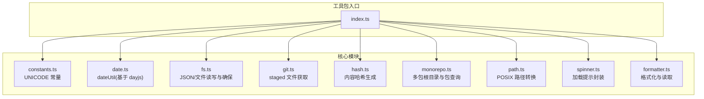
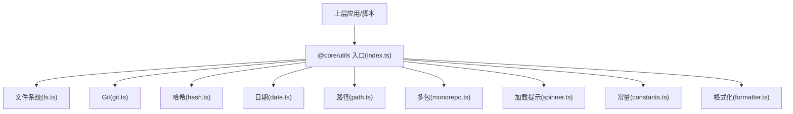
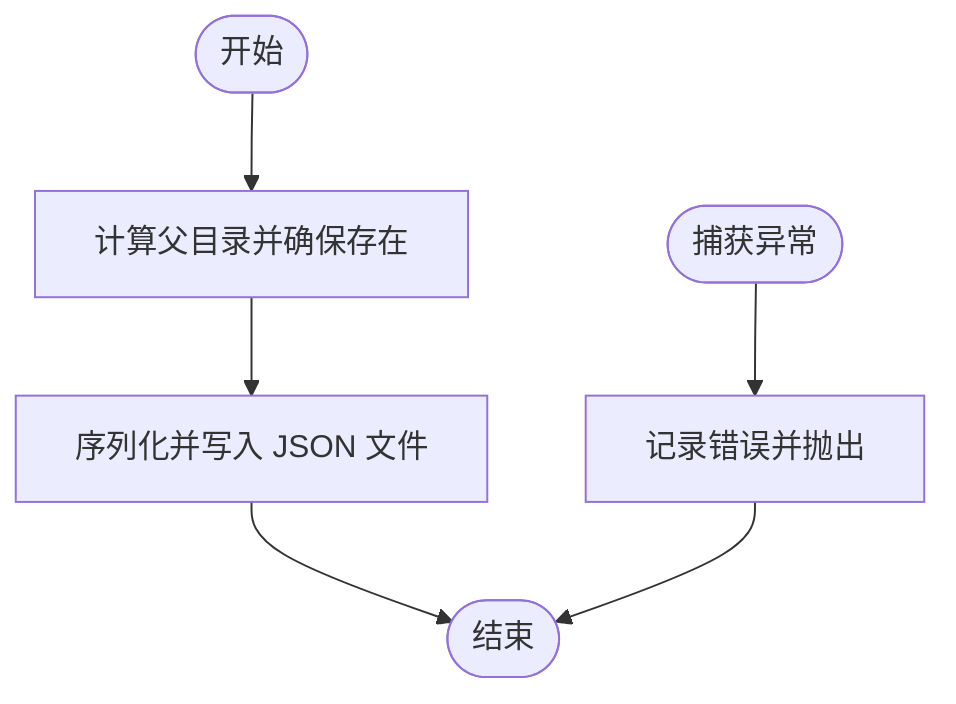
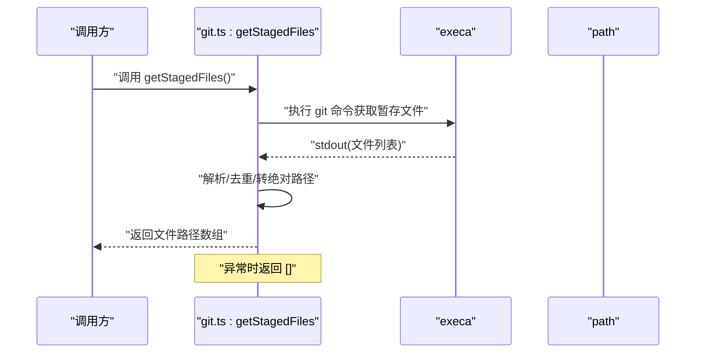
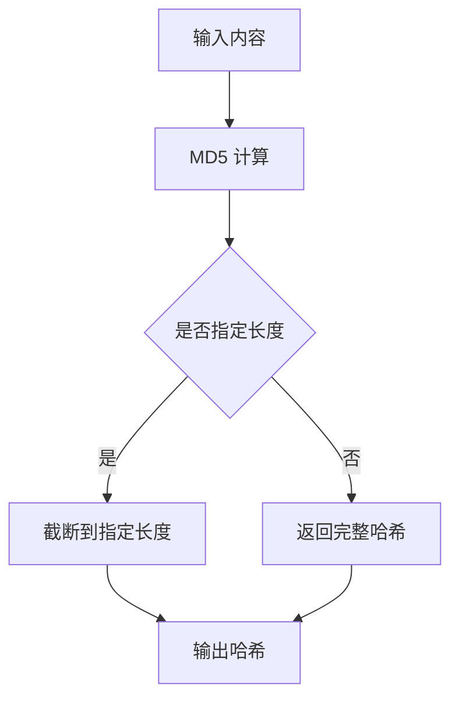
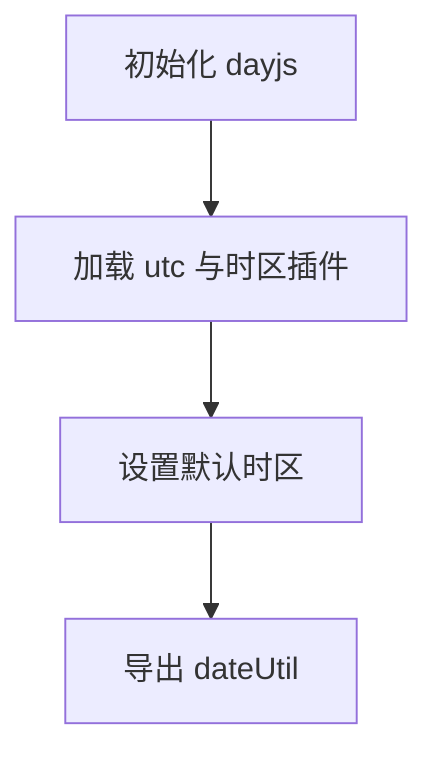
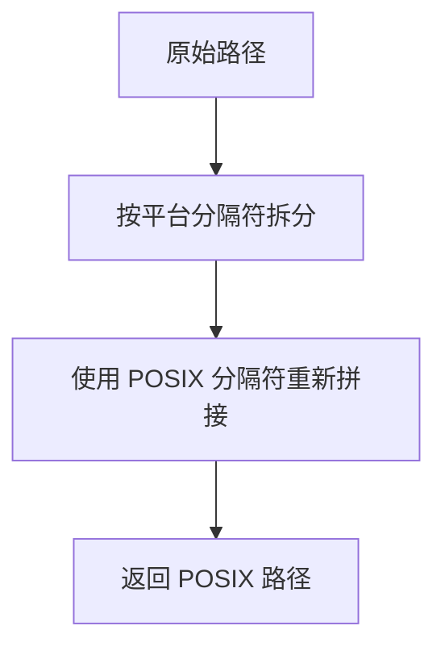
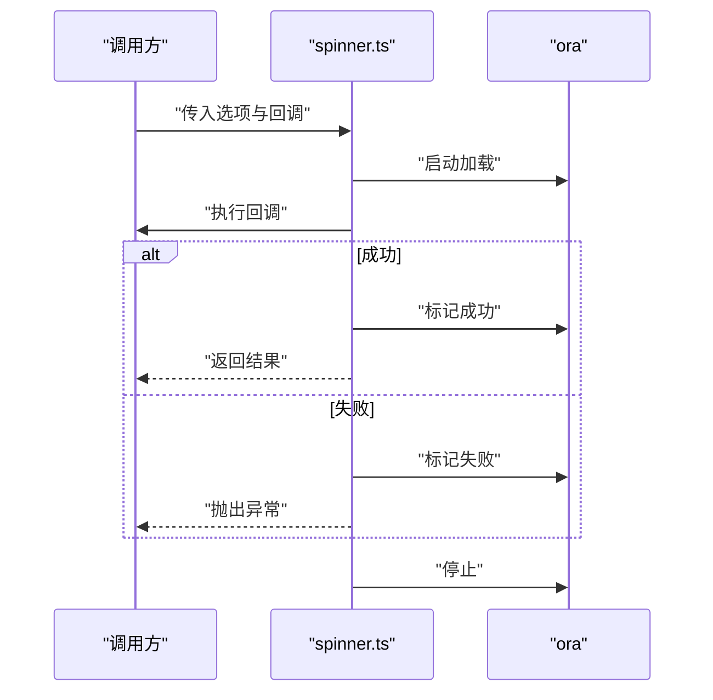
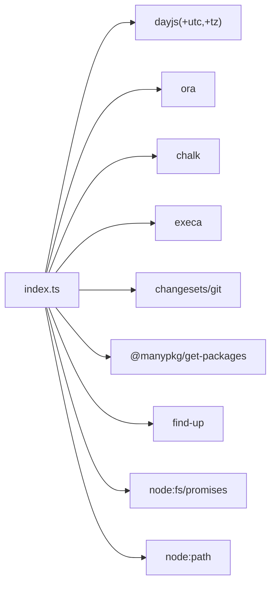

# 工具包 (@core/utils)

<cite>
**本文引用的文件**
- [index.ts](file://internal/node-utils/src/index.ts)
- [constants.ts](file://internal/node-utils/src/constants.ts)
- [date.ts](file://internal/node-utils/src/date.ts)
- [formatter.ts](file://internal/node-utils/src/formatter.ts)
- [fs.ts](file://internal/node-utils/src/fs.ts)
- [git.ts](file://internal/node-utils/src/git.ts)
- [hash.ts](file://internal/node-utils/src/hash.ts)
- [monorepo.ts](file://internal/node-utils/src/monorepo.ts)
- [path.ts](file://internal/node-utils/src/path.ts)
- [spinner.ts](file://internal/node-utils/src/spinner.ts)
- [package.json](file://package.json)
</cite>

## 目录

1. [简介](#简介)
2. [项目结构](#项目结构)
3. [核心组件](#核心组件)
4. [架构总览](#架构总览)
5. [详细组件分析](#详细组件分析)
6. [依赖分析](#依赖分析)
7. [性能考量](#性能考量)
8. [故障排查指南](#故障排查指南)
9. [结论](#结论)
10. [附录](#附录)

## 简介

本文件为工具包（@core/utils）的系统化技术文档，聚焦于内部 Node 工具库（internal/node-utils）的设计目标与组织原则，涵盖通用工具函数、类型定义与辅助方法的分类与命名规范；深入解析核心工具函数的实现，包括文件系统操作、Git 集成、哈希生成、日期时间工具、路径处理、Spinner 加载提示以及常量与类型导出；并提供使用示例与最佳实践、性能与错误处理建议，以及与项目其他核心包的集成方式与依赖关系说明。

## 项目结构

该工具包位于 internal/node-utils，采用按职责分层的模块化组织方式：每个功能域独立为一个源文件，入口 index.ts 聚合并统一导出，便于上层按需引入或全量导入。整体结构清晰、内聚度高、耦合度低，适合作为多应用与脚手架场景下的通用能力沉淀。

图表来源

- [index.ts:1-20](file://internal/node-utils/src/index.ts#L1-L20)
- [constants.ts:1-7](file://internal/node-utils/src/constants.ts#L1-L7)
- [date.ts:1-13](file://internal/node-utils/src/date.ts#L1-L13)
- [fs.ts:1-40](file://internal/node-utils/src/fs.ts#L1-L40)
- [git.ts:1-35](file://internal/node-utils/src/git.ts#L1-L35)
- [hash.ts:1-19](file://internal/node-utils/src/hash.ts#L1-L19)
- [monorepo.ts:1-47](file://internal/node-utils/src/monorepo.ts#L1-L47)
- [path.ts:1-12](file://internal/node-utils/src/path.ts#L1-L12)
- [spinner.ts:1-27](file://internal/node-utils/src/spinner.ts#L1-L27)
- [formatter.ts:1-14](file://internal/node-utils/src/formatter.ts#L1-L14)

章节来源

- [index.ts:1-20](file://internal/node-utils/src/index.ts#L1-L20)

## 核心组件

- 入口聚合导出：统一从 index.ts 导出各模块能力，并保留部分外部依赖的类型与默认导出，便于上层直接消费。
- 常量与类型：提供 UNICODE 符号常量与若干类型别名，保证日志与提示的一致性。
- 日期时间：基于 dayjs 并启用时区插件，默认时区设置，提供 dateUtil 统一日期处理入口。
- 文件系统：封装 JSON 输出/读取、文件确保创建等常用操作，内置错误捕获与抛出。
- Git 集成：复用 @changesets/git 的能力，并扩展获取暂存区变更文件列表的函数。
- 哈希生成：基于 Node 内置 crypto 生成内容哈希，支持截断长度。
- 多包管理：定位 monorepo 根目录、同步/异步枚举包、按名称查询包。
- 路径处理：将任意平台路径转换为 POSIX 风格，便于跨平台一致性。
- 加载提示：封装 ora 的 spinner，统一成功/失败文案与生命周期。
- 格式化：调用外部工具对单文件进行格式化并返回内容，便于流水线集成。

章节来源

- [index.ts:1-20](file://internal/node-utils/src/index.ts#L1-L20)
- [constants.ts:1-7](file://internal/node-utils/src/constants.ts#L1-L7)
- [date.ts:1-13](file://internal/node-utils/src/date.ts#L1-L13)
- [fs.ts:1-40](file://internal/node-utils/src/fs.ts#L1-L40)
- [git.ts:1-35](file://internal/node-utils/src/git.ts#L1-L35)
- [hash.ts:1-19](file://internal/node-utils/src/hash.ts#L1-L19)
- [monorepo.ts:1-47](file://internal/node-utils/src/monorepo.ts#L1-L47)
- [path.ts:1-12](file://internal/node-utils/src/path.ts#L1-L12)
- [spinner.ts:1-27](file://internal/node-utils/src/spinner.ts#L1-L27)
- [formatter.ts:1-14](file://internal/node-utils/src/formatter.ts#L1-L14)

## 架构总览

该工具包以“入口聚合 + 功能模块”为核心架构，通过 index.ts 对外暴露统一 API，内部模块之间保持低耦合，仅在必要处共享类型或常量。整体设计遵循单一职责与开闭原则，便于扩展与维护。

图表来源

- [index.ts:1-20](file://internal/node-utils/src/index.ts#L1-L20)
- [fs.ts:1-40](file://internal/node-utils/src/fs.ts#L1-L40)
- [git.ts:1-35](file://internal/node-utils/src/git.ts#L1-L35)
- [hash.ts:1-19](file://internal/node-utils/src/hash.ts#L1-L19)
- [date.ts:1-13](file://internal/node-utils/src/date.ts#L1-L13)
- [path.ts:1-12](file://internal/node-utils/src/path.ts#L1-L12)
- [monorepo.ts:1-47](file://internal/node-utils/src/monorepo.ts#L1-L47)
- [spinner.ts:1-27](file://internal/node-utils/src/spinner.ts#L1-L27)
- [constants.ts:1-7](file://internal/node-utils/src/constants.ts#L1-L7)
- [formatter.ts:1-14](file://internal/node-utils/src/formatter.ts#L1-L14)

## 详细组件分析

### 文件系统工具（fs.ts）

- 功能要点
  - 输出 JSON：自动创建目录、序列化数据并写入 UTF-8 文件。
  - 确保文件存在：递归创建父目录并追加空文件。
  - 读取 JSON：读取文本后解析为对象，异常时记录错误并抛出。
- 错误处理
  - 所有 I/O 操作均包裹 try/catch，打印错误并向上抛出，便于调用方统一处理。
- 性能与复杂度
  - 写入/读取为 O(n) 字符串处理，mkdir 递归为 O(h) 层级，整体受文件大小与目录层级影响。
- 使用建议
  - 在批量写入时优先合并写入策略，避免频繁 I/O。
  - 对于大型 JSON，建议分块或流式处理。

图表来源

- [fs.ts:4-18](file://internal/node-utils/src/fs.ts#L4-L18)

章节来源

- [fs.ts:1-40](file://internal/node-utils/src/fs.ts#L1-L40)

### Git 集成（git.ts）

- 功能要点
  - 复用 @changesets/git 的导出能力。
  - 自定义 getStagedFiles：执行 git 命令获取暂存区变更文件列表，解析输出并去重，最终返回绝对路径数组。
- 错误处理
  - 异常时记录错误并返回空数组，保证调用稳定性。
- 使用建议
  - 在 CI 或本地钩子中结合该函数筛选变更文件，减少不必要的处理。

图表来源

- [git.ts:10-32](file://internal/node-utils/src/git.ts#L10-L32)

章节来源

- [git.ts:1-35](file://internal/node-utils/src/git.ts#L1-L35)

### 哈希生成（hash.ts）

- 功能要点
  - 基于 MD5 生成内容哈希，支持可选截断长度。
- 性能与复杂度
  - 哈希计算近似 O(n)，受输入内容长度影响。
- 使用建议
  - 截断长度用于短标识（如缓存键），但需注意冲突概率。

图表来源

- [hash.ts:8-16](file://internal/node-utils/src/hash.ts#L8-L16)

章节来源

- [hash.ts:1-19](file://internal/node-utils/src/hash.ts#L1-L19)

### 日期时间工具（date.ts）

- 功能要点
  - 基于 dayjs 启用 utc 与时区插件，并设置默认时区。
  - 导出 dateUtil 作为统一日期处理入口。
- 使用建议
  - 在多时区场景下统一使用 dateUtil，避免本地时区差异导致的问题。

图表来源

- [date.ts:1-12](file://internal/node-utils/src/date.ts#L1-L12)

章节来源

- [date.ts:1-13](file://internal/node-utils/src/date.ts#L1-L13)

### 路径处理（path.ts）

- 功能要点
  - 将任意平台路径转换为 POSIX 风格，便于跨平台一致的路径比较与拼接。
- 使用建议
  - 在构建脚本与 CI 中统一使用 POSIX 路径，避免 Windows 与 Unix 行为差异。

图表来源

- [path.ts:7-9](file://internal/node-utils/src/path.ts#L7-L9)

章节来源

- [path.ts:1-12](file://internal/node-utils/src/path.ts#L1-L12)

### 加载提示（spinner.ts）

- 功能要点
  - 包装 ora，接收标题与回调，成功/失败分别输出对应文案并抛出异常。
  - 支持自定义成功/失败文案，finally 统一停止。
- 使用建议
  - 在耗时任务前后使用，提升可观测性与用户体验。

图表来源

- [spinner.ts:10-26](file://internal/node-utils/src/spinner.ts#L10-L26)

章节来源

- [spinner.ts:1-27](file://internal/node-utils/src/spinner.ts#L1-L27)

### 常量与类型（constants.ts）

- 功能要点
  - 提供 UNICODE 常量（勾/叉），用于命令行日志与提示。
- 使用建议
  - 在 CLI 工具中统一使用该常量，保持视觉一致性。

章节来源

- [constants.ts:1-7](file://internal/node-utils/src/constants.ts#L1-L7)

### 格式化工具（formatter.ts）

- 功能要点
  - 调用外部格式化工具对单文件进行格式化，并返回文件内容。
- 使用建议
  - 在自动化流程中配合 getStagedFiles 使用，确保提交前代码风格一致。

章节来源

- [formatter.ts:1-14](file://internal/node-utils/src/formatter.ts#L1-L14)

### 多包管理（monorepo.ts）

- 功能要点
  - 定位 monorepo 根目录（依据 pnpm-lock.yaml）。
  - 提供同步/异步获取包列表与按名称查询包的能力。
- 使用建议
  - 在发布、版本管理与跨包任务中使用，避免硬编码路径。

章节来源

- [monorepo.ts:1-47](file://internal/node-utils/src/monorepo.ts#L1-L47)

## 依赖分析

- 外部依赖
  - dayjs 及其 utc、timezone 插件：提供日期时间处理与时区支持。
  - ora 与 chalk：提供加载提示与彩色日志。
  - execa：执行外部命令（git、格式化工具）。
  - @changesets/git：Git 相关能力复用。
  - @manypkg/get-packages 与 find-up：多包仓库根目录与包枚举。
  - node:fs/promises、node:path：Node 标准库。
- 内部依赖
  - index.ts 作为聚合入口，统一导出各模块。
- 依赖关系图

图表来源

- [index.ts:1-20](file://internal/node-utils/src/index.ts#L1-L20)
- [date.ts:1-12](file://internal/node-utils/src/date.ts#L1-L12)
- [spinner.ts:1-27](file://internal/node-utils/src/spinner.ts#L1-L27)
- [git.ts:1-35](file://internal/node-utils/src/git.ts#L1-L35)
- [monorepo.ts:1-47](file://internal/node-utils/src/monorepo.ts#L1-L47)

章节来源

- [package.json:67-102](file://package.json#L67-L102)

## 性能考量

- I/O 操作
  - fs.ts 的 JSON 读写应避免频繁小块写入，建议批量合并后再写入。
  - 对超大文件优先考虑流式处理或分块策略。
- 哈希计算
  - 内容哈希适合短标识生成，若需更高安全性可考虑更强算法（如 SHA-256）。
- 进程调用
  - execa 调用外部工具（如格式化器）会带来额外开销，建议在必要时才触发。
- 时区与日期
  - 统一使用 dateUtil 并设置默认时区，减少重复初始化成本。

## 故障排查指南

- 文件系统错误
  - 症状：写入/读取报错。
  - 排查：确认路径权限、磁盘空间、文件锁；查看控制台错误日志；检查 JSON 格式。
- Git 命令失败
  - 症状：getStagedFiles 返回空数组或报错。
  - 排查：确认 Git 工作树状态、子模块配置、环境变量；检查 execa 调用权限。
- 格式化失败
  - 症状：格式化工具不可用或失败。
  - 排查：确认外部工具已安装且可执行；检查工作目录与文件权限。
- 多包根目录定位失败
  - 症状：找不到 monorepo 根或包列表为空。
  - 排查：确认 pnpm-lock.yaml 存在且可读；检查当前工作目录。

章节来源

- [fs.ts:14-17](file://internal/node-utils/src/fs.ts#L14-L17)
- [git.ts:28-31](file://internal/node-utils/src/git.ts#L28-L31)
- [formatter.ts:6-8](file://internal/node-utils/src/formatter.ts#L6-L8)
- [monorepo.ts:13-18](file://internal/node-utils/src/monorepo.ts#L13-L18)

## 结论

@core/utils（internal/node-utils）以清晰的模块化设计与稳定的外部依赖组合，提供了覆盖文件系统、Git、哈希、日期时间、路径、加载提示、格式化与多包管理的通用能力。通过入口聚合导出与完善的错误处理，该工具包能够高效支撑多应用与脚手架场景下的日常开发与运维需求。建议在实际使用中遵循本文的最佳实践与性能考量，以获得更稳定与高效的体验。

## 附录

- 命名规范与分类建议
  - 模块命名：按功能域命名（如 fs、git、hash、monorepo），保持语义明确。
  - 函数命名：动词+名词（如 ensureFile、getStagedFiles、generatorContentHash）。
  - 类型与常量：使用大驼峰（如 Package、UNICODE）并在模块内集中导出。
- 与核心包的集成
  - 与 @vben/playground、各 web 应用（web-antd、web-ele 等）的构建与脚本流程集成，作为公共工具库被复用。
  - 在 CI/CD 流程中结合 getStagedFiles 与 formatter 实现自动化校验与格式化。
