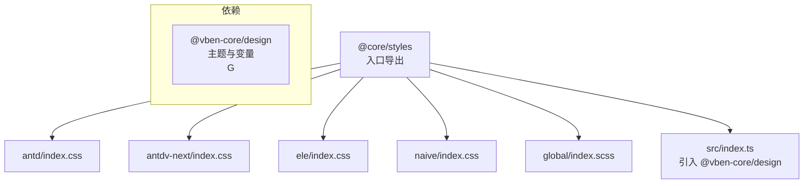
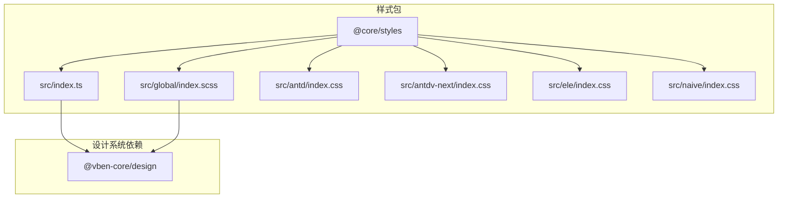
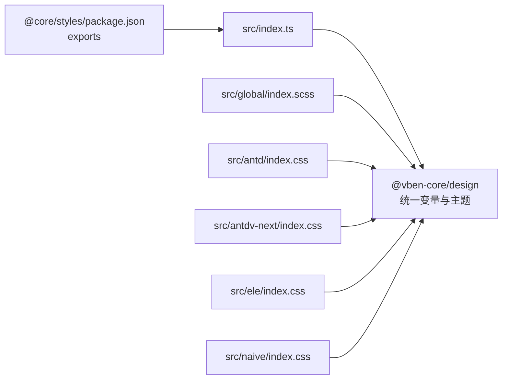

# 样式包 (@core/styles)

<cite>
**本文引用的文件**
- [packages/styles/package.json](file://packages/styles/package.json)
- [packages/styles/src/index.ts](file://packages/styles/src/index.ts)
- [packages/styles/src/antd/index.css](file://packages/styles/src/antd/index.css)
- [packages/styles/src/antdv-next/index.css](file://packages/styles/src/antdv-next/index.css)
- [packages/styles/src/ele/index.css](file://packages/styles/src/ele/index.css)
- [packages/styles/src/naive/index.css](file://packages/styles/src/naive/index.css)
- [packages/styles/src/global/index.scss](file://packages/styles/src/global/index.scss)
- [@vben-core/design 包 package.json](file://packages/@core/base/design/package.json)
</cite>

## 目录
1. [简介](#简介)
2. [项目结构](#项目结构)
3. [核心组件](#核心组件)
4. [架构总览](#架构总览)
5. [详细组件分析](#详细组件分析)
6. [依赖关系分析](#依赖关系分析)
7. [性能考量](#性能考量)
8. [故障排查指南](#故障排查指南)
9. [结论](#结论)
10. [附录](#附录)

## 简介
本文件面向样式包（@core/styles）的使用者与维护者，系统性阐述其架构设计与 CSS 组织原则，涵盖：
- 样式模块的分类与命名规范
- CSS 变量系统（主题变量、颜色系统、尺寸规范）
- 样式继承与覆盖机制（优先级与冲突处理）
- 响应式设计支持（断点与移动端适配）
- 使用示例与自定义指南（扩展样式系统、集成第三方 CSS 框架）

该样式包以“按 UI 框架分包、按作用域分层”的方式组织，通过统一的变量体系与 BEM 工具，确保跨框架一致性与可维护性。

## 项目结构
样式包位于 packages/styles，采用多入口导出，分别针对不同 UI 框架提供样式入口，并提供全局样式工具入口：
- 入口导出：./antd、./antdv-next、./ele、./naive、./global
- 主入口：src/index.ts 引入统一的设计系统基础样式
- 各 UI 框架样式：src/{framework}/index.css
- 全局工具：src/global/index.scss 引入 BEM 工具

图表来源
- [packages/styles/package.json:13-33](file://packages/styles/package.json#L13-L33)
- [packages/styles/src/index.ts:1-2](file://packages/styles/src/index.ts#L1-L2)
- [packages/styles/src/antd/index.css:1-79](file://packages/styles/src/antd/index.css#L1-L79)
- [packages/styles/src/antdv-next/index.css:1-81](file://packages/styles/src/antdv-next/index.css#L1-L81)
- [packages/styles/src/ele/index.css:1-45](file://packages/styles/src/ele/index.css#L1-L45)
- [packages/styles/src/naive/index.css:1-21](file://packages/styles/src/naive/index.css#L1-L21)
- [packages/styles/src/global/index.scss:1-2](file://packages/styles/src/global/index.scss#L1-L2)

章节来源
- [packages/styles/package.json:1-38](file://packages/styles/package.json#L1-L38)
- [packages/styles/src/index.ts:1-2](file://packages/styles/src/index.ts#L1-L2)
- [packages/styles/src/global/index.scss:1-2](file://packages/styles/src/global/index.scss#L1-L2)

## 核心组件
- 统一入口与依赖注入
  - 主入口通过引入 @vben-core/design 注入全局主题与变量体系，确保各 UI 框架共享同一套变量与规则。
- UI 框架专用样式
  - 针对 antd、antdv-next、element-plus、naive-ui 的组件库差异，提供针对性的样式重置与交互增强。
- 全局工具与 BEM
  - 通过 global/index.scss 引入 @vben-core/design/bem，提供 BEM 工具函数，便于在 SCSS 中规范类名结构。

章节来源
- [packages/styles/src/index.ts:1-2](file://packages/styles/src/index.ts#L1-L2)
- [packages/styles/src/global/index.scss:1-2](file://packages/styles/src/global/index.scss#L1-L2)
- [@vben-core/design 包 package.json:23-35](file://packages/@core/base/design/package.json#L23-L35)

## 架构总览
样式包采用“分而治之”的架构：
- 分层：按 UI 框架分层（antd/ele/naive），避免相互污染
- 分域：按作用域分域（全局工具、框架样式），职责清晰
- 变量中心化：统一由 @vben-core/design 提供变量与主题，样式包仅消费与微调

图表来源
- [packages/styles/src/index.ts:1-2](file://packages/styles/src/index.ts#L1-L2)
- [packages/styles/src/global/index.scss:1-2](file://packages/styles/src/global/index.scss#L1-L2)
- [@vben-core/design 包 package.json:23-35](file://packages/@core/base/design/package.json#L23-L35)

## 详细组件分析

### 组件：统一入口与依赖注入
- 职责
  - 引入 @vben-core/design，使样式包具备统一的主题变量、颜色与尺寸规范
- 关键点
  - 通过 package.json 的 exports 字段暴露多入口，便于按需引入
  - 主入口不直接输出样式，而是作为依赖注入的载体

章节来源
- [packages/styles/src/index.ts:1-2](file://packages/styles/src/index.ts#L1-L2)
- [packages/styles/package.json:13-33](file://packages/styles/package.json#L13-L33)

### 组件：全局样式工具（BEM）
- 职责
  - 在 SCSS 中提供 BEM 工具函数，规范类名结构，降低样式耦合
- 关键点
  - 通过 @use 引入 @vben-core/design/bem，形成统一的命名约定

章节来源
- [packages/styles/src/global/index.scss:1-2](file://packages/styles/src/global/index.scss#L1-L2)
- [@vben-core/design 包 package.json:24-27](file://packages/@core/base/design/package.json#L24-L27)

### 组件：Ant Design Vue（antd）样式
- 职责
  - 针对 antd 组件库的样式重置与交互增强，提升表单校验反馈的一致性
- 关键点
  - 使用 CSS 变量（如 --destructive、--border）表达语义化颜色与边框
  - 通过 :is(.dark *) 适配深色模式边框样式
  - 对按钮图标、标签图标等细节进行对齐与间距优化

章节来源
- [packages/styles/src/antd/index.css:1-79](file://packages/styles/src/antd/index.css#L1-L79)

### 组件：Antd Vue Next（antdv-next）样式
- 职责
  - 面向 antdv-next 的样式适配，保持与 antd 版本一致的交互体验
- 关键点
  - 针对 .ant-btn-icon 结构进行图标对齐与间距修正
  - 复用 CSS 变量与深色模式适配策略

章节来源
- [packages/styles/src/antdv-next/index.css:1-81](file://packages/styles/src/antdv-next/index.css#L1-L81)

### 组件：Element Plus（ele）样式
- 职责
  - 针对 Element Plus 的样式增强，重点在于表单校验状态的视觉反馈
- 关键点
  - 使用 CSS 变量 --el-color-danger 与内嵌边框实现错误态高对比度提示
  - 对卡片圆角、加载遮罩层级等细节进行统一

章节来源
- [packages/styles/src/ele/index.css:1-45](file://packages/styles/src/ele/index.css#L1-L45)

### 组件：Naive UI（naive）样式
- 职责
  - 针对 Naive UI 的样式增强，聚焦单选/复选与输入框的错误态边框
- 关键点
  - 使用 --n-border-error 与内联变量实现错误态边框与阴影
  - 对按钮组与分割线的视觉进行一致性调整

章节来源
- [packages/styles/src/naive/index.css:1-21](file://packages/styles/src/naive/index.css#L1-L21)

### 组件：CSS 变量系统（主题、颜色、尺寸）
- 设计原则
  - 语义化命名：变量名体现用途（如 --destructive、--border），而非具体颜色值
  - 作用域隔离：变量在对应框架样式中消费，避免跨框架污染
  - 深色模式兼容：通过 :is(.dark *) 或框架内置主题变量实现暗色适配
- 实践要点
  - 表单校验错误态：统一使用 --destructive 或等价变量
  - 边框与阴影：统一使用 --border 并配合透明度计算
  - 尺寸与圆角：通过 --radius 等变量统一圆角与间距

章节来源
- [packages/styles/src/antd/index.css:37-41](file://packages/styles/src/antd/index.css#L37-L41)
- [packages/styles/src/antd/index.css:46-67](file://packages/styles/src/antd/index.css#L46-L67)
- [packages/styles/src/ele/index.css:7-39](file://packages/styles/src/ele/index.css#L7-L39)
- [packages/styles/src/naive/index.css:1-20](file://packages/styles/src/naive/index.css#L1-L20)

### 组件：样式继承与覆盖机制
- 优先级策略
  - 深色模式选择器优先于默认样式（:is(.dark *)）
  - 错误态选择器优先于默认状态（.form-valid-error）
  - 框架特定选择器优先于通用选择器（如 .ant-btn-icon）
- 冲突解决
  - 明确作用域边界，避免跨框架样式互相覆盖
  - 使用 !important 仅在必要场景（如聚焦阴影）并保持最小化

章节来源
- [packages/styles/src/antd/index.css:37-41](file://packages/styles/src/antd/index.css#L37-L41)
- [packages/styles/src/antd/index.css:46-67](file://packages/styles/src/antd/index.css#L46-L67)
- [packages/styles/src/antdv-next/index.css:16-24](file://packages/styles/src/antdv-next/index.css#L16-L24)

### 组件：响应式设计支持
- 断点与移动端适配
  - 通过 @vben-core/design 提供的断点与布局变量，结合框架自身响应式能力实现自适应
  - 在样式包中尽量使用相对单位与 CSS 变量，减少硬编码像素值
- 建议实践
  - 在业务样式中使用 @media 查询与容器查询（如适用）
  - 避免在样式包内重复定义断点，统一从设计系统获取

章节来源
- [@vben-core/design 包 package.json:28-30](file://packages/@core/base/design/package.json#L28-L30)

## 依赖关系分析
样式包与 @vben-core/design 的关系如下：

图表来源
- [packages/styles/package.json:13-33](file://packages/styles/package.json#L13-L33)
- [packages/styles/src/index.ts:1-2](file://packages/styles/src/index.ts#L1-L2)
- [packages/styles/src/global/index.scss:1-2](file://packages/styles/src/global/index.scss#L1-L2)
- [@vben-core/design 包 package.json:23-35](file://packages/@core/base/design/package.json#L23-L35)

章节来源
- [packages/styles/package.json:13-33](file://packages/styles/package.json#L13-L33)
- [packages/styles/src/index.ts:1-2](file://packages/styles/src/index.ts#L1-L2)
- [@vben-core/design 包 package.json:23-35](file://packages/@core/base/design/package.json#L23-L35)

## 性能考量
- 按需引入
  - 通过 package.json 的多入口按需导入对应框架样式，避免不必要的体积增长
- 变量复用
  - 统一变量减少重复定义，降低构建后 CSS 体积
- 选择器优化
  - 避免过深的后代选择器，优先使用组件级类名与 BEM 规范，提升匹配效率

## 故障排查指南
- 深色模式边框不生效
  - 检查是否正确包裹在 :is(.dark *) 作用域内
  - 确认 @vben-core/design 是否已正确引入
- 表单校验错误态不显示
  - 确认 .form-valid-error 选择器是否被正确应用到父容器
  - 检查对应框架的变量名是否与样式包一致（如 --destructive）
- 图标对齐或间距异常
  - 针对 antd 与 antdv-next 的按钮图标结构差异，确认使用了正确的选择器（如 .ant-btn-icon）

章节来源
- [packages/styles/src/antd/index.css:37-41](file://packages/styles/src/antd/index.css#L37-L41)
- [packages/styles/src/antd/index.css:46-67](file://packages/styles/src/antd/index.css#L46-L67)
- [packages/styles/src/antdv-next/index.css:16-24](file://packages/styles/src/antdv-next/index.css#L16-L24)

## 结论
@core/styles 通过“按框架分包、按作用域分层”的组织方式，结合 @vben-core/design 的统一变量与主题，实现了跨 UI 框架的一致性与可维护性。建议在业务侧遵循 BEM 命名、使用语义化变量、按需引入样式入口，以获得最佳的开发与运行体验。

## 附录

### 使用示例与自定义指南
- 引入对应框架样式
  - 在应用入口引入 @core/styles/antd、@core/styles/ele、@core/styles/naive 等入口，按需选择
- 自定义变量与主题
  - 在业务样式中覆盖 @vben-core/design 的变量，或在深色模式下通过 :is(.dark *) 重写局部变量
- 集成第三方 CSS 框架
  - 建议将第三方样式置于业务层，避免与样式包变量冲突；若需深度定制，可在 global/index.scss 中引入第三方 BEM 工具或变量

章节来源
- [packages/styles/package.json:18-32](file://packages/styles/package.json#L18-L32)
- [packages/styles/src/global/index.scss:1-2](file://packages/styles/src/global/index.scss#L1-L2)