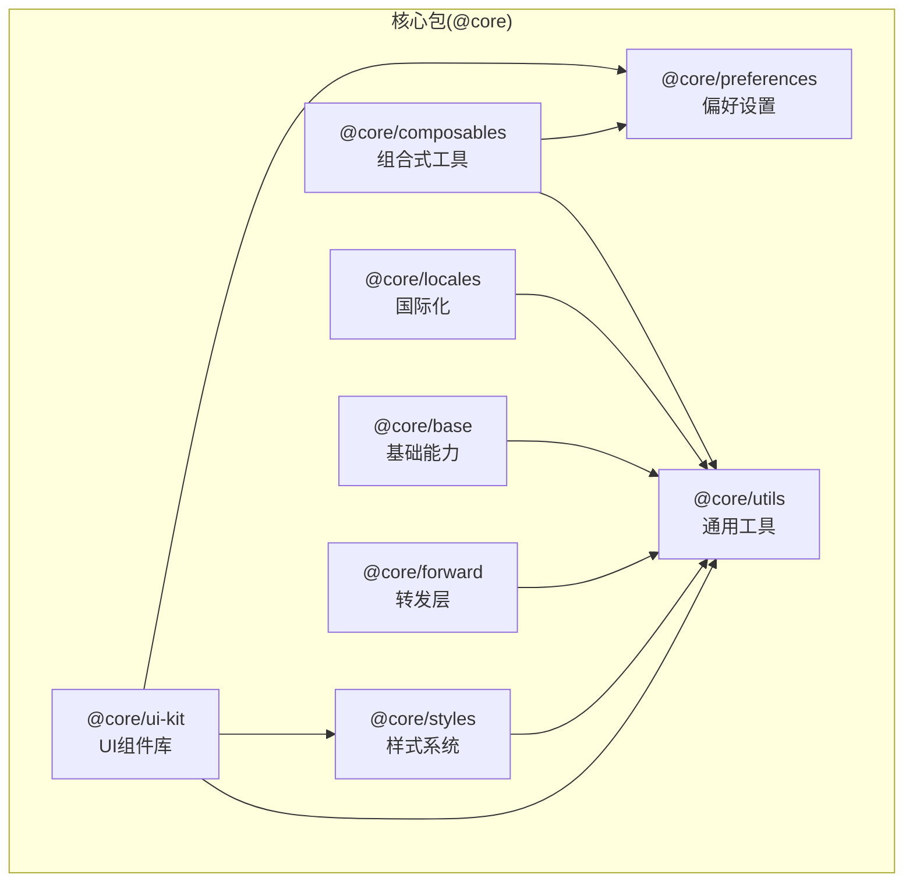
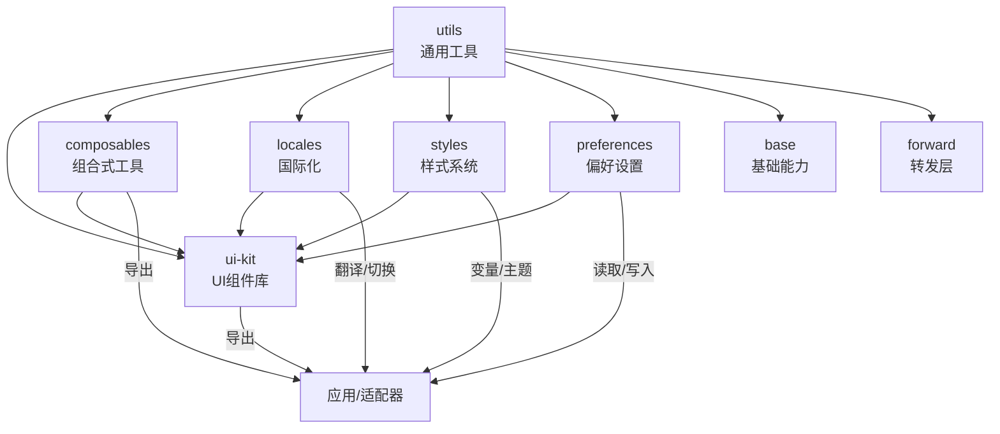
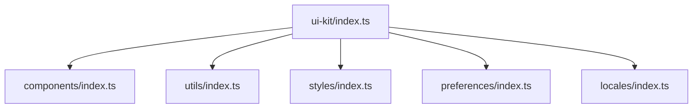
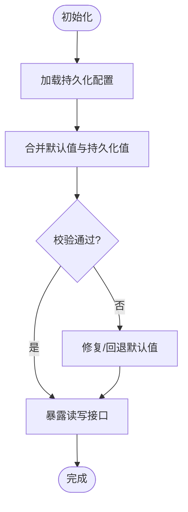
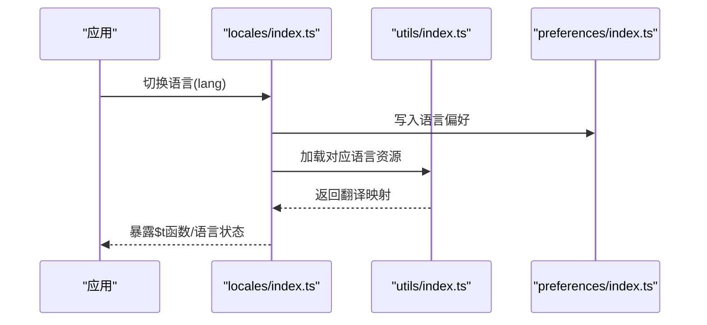
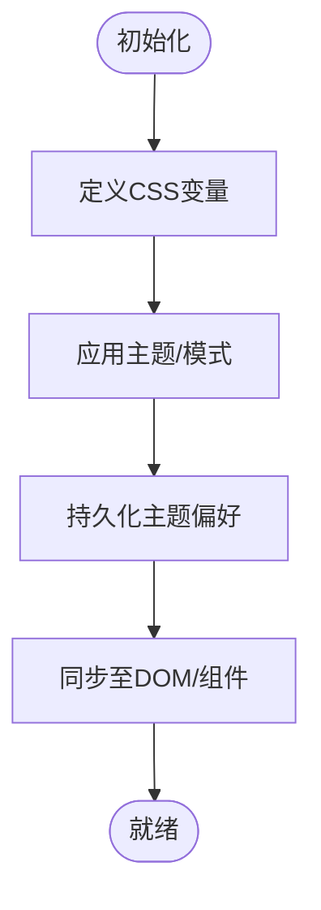
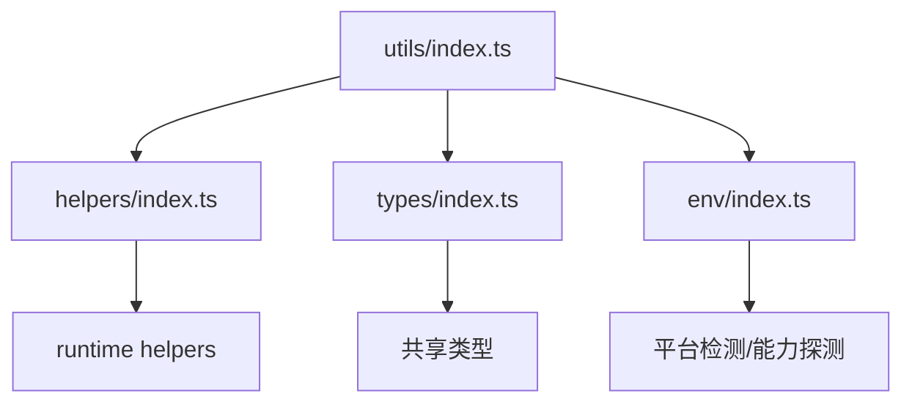
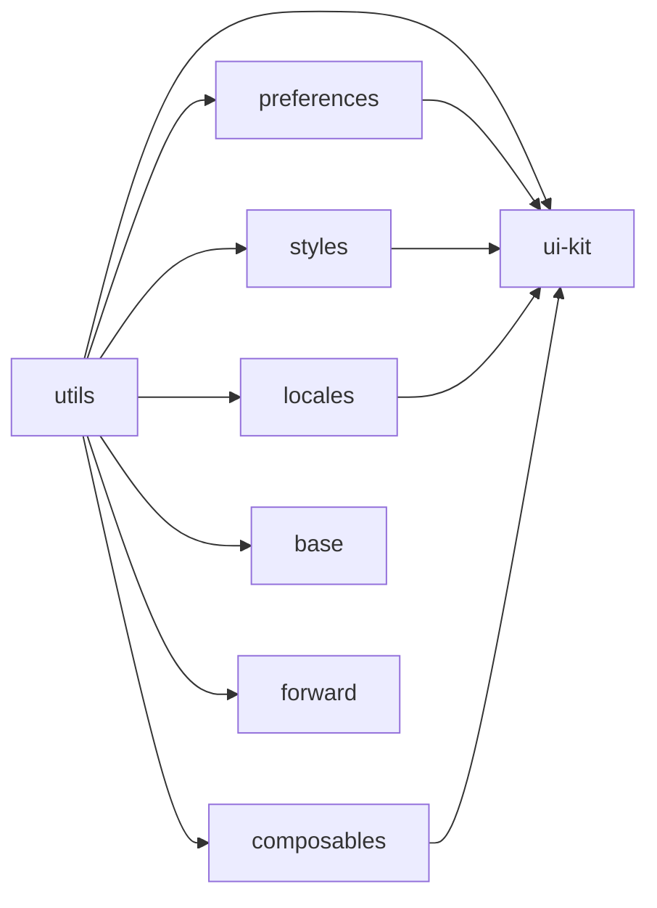

# 核心包设计

<cite>
**本文引用的文件**
- [packages/@core/README.md](file://packages/@core/README.md)
- [packages/@core/ui-kit/README.md](file://packages/@core/ui-kit/README.md)
- [packages/@core/composables/README.md](file://packages/@core/composables/README.md)
- [packages/@core/preferences/README.md](file://packages/@core/preferences/README.md)
- [packages/@core/locales/README.md](file://packages/@core/locales/README.md)
- [packages/@core/styles/README.md](file://packages/@core/styles/README.md)
- [packages/@core/utils/README.md](file://packages/@core/utils/README.md)
- [packages/@core/base/README.md](file://packages/@core/base/README.md)
- [packages/@core/forward/README.md](file://packages/@core/forward/README.md)
- [packages/@core/ui-kit/package.json](file://packages/@core/ui-kit/package.json)
- [packages/@core/composables/package.json](file://packages/@core/composables/package.json)
- [packages/@core/preferences/package.json](file://packages/@core/preferences/package.json)
- [packages/@core/locales/package.json](file://packages/@core/locales/package.json)
- [packages/@core/styles/package.json](file://packages/@core/styles/package.json)
- [packages/@core/utils/package.json](file://packages/@core/utils/package.json)
- [packages/@core/base/package.json](file://packages/@core/base/package.json)
- [packages/@core/forward/package.json](file://packages/@core/forward/package.json)
- [packages/@core/ui-kit/src/index.ts](file://packages/@core/ui-kit/src/index.ts)
- [packages/@core/composables/src/index.ts](file://packages/@core/composables/src/index.ts)
- [packages/@core/preferences/src/index.ts](file://packages/@core/preferences/src/index.ts)
- [packages/@core/locales/src/index.ts](file://packages/@core/locales/src/index.ts)
- [packages/@core/styles/src/index.ts](file://packages/@core/styles/src/index.ts)
- [packages/@core/utils/src/index.ts](file://packages/@core/utils/src/index.ts)
- [packages/@core/base/src/index.ts](file://packages/@core/base/src/index.ts)
- [packages/@core/forward/src/index.ts](file://packages/@core/forward/src/index.ts)
- [packages/@core/ui-kit/src/components/index.ts](file://packages/@core/ui-kit/src/components/index.ts)
- [packages/@core/composables/src/useToggle/index.ts](file://packages/@core/composables/src/useToggle/index.ts)
- [packages/@core/preferences/src/preferences.ts](file://packages/@core/preferences/src/preferences.ts)
- [packages/@core/locales/src/locales.ts](file://packages/@core/locales/src/locales.ts)
- [packages/@core/styles/src/cssVariables.ts](file://packages/@core/styles/src/cssVariables.ts)
- [packages/@core/utils/src/helpers/index.ts](file://packages/@core/utils/src/helpers/index.ts)
- [packages/@core/base/src/base.ts](file://packages/@core/base/src/base.ts)
- [packages/@core/forward/src/forward.ts](file://packages/@core/forward/src/forward.ts)
</cite>

## 目录

1. [引言](#引言)
2. [项目结构](#项目结构)
3. [核心组件](#核心组件)
4. [架构总览](#架构总览)
5. [详细组件分析](#详细组件分析)
6. [依赖分析](#依赖分析)
7. [性能考虑](#性能考虑)
8. [故障排查指南](#故障排查指南)
9. [结论](#结论)
10. [附录](#附录)

## 引言

本文件面向Vben Admin的“核心包”（@core）设计与实现，系统性阐述其设计理念、模块职责与协作关系。核心包以“可复用、可扩展、可维护”为目标，围绕UI Kit、Composables、Preferences、Locales、Styles、Utils以及Base/Forward等子包进行分层组织，形成统一的基础设施层，支撑上层应用与多框架适配。

## 项目结构

核心包采用Monorepo工作区组织，按功能域拆分为多个子包，并通过统一的package.json与pnpm-workspace.yaml进行版本与依赖管理。整体结构如下：



图表来源

- [packages/@core/ui-kit/package.json](file://packages/@core/ui-kit/package.json)
- [packages/@core/composables/package.json](file://packages/@core/composables/package.json)
- [packages/@core/preferences/package.json](file://packages/@core/preferences/package.json)
- [packages/@core/locales/package.json](file://packages/@core/locales/package.json)
- [packages/@core/styles/package.json](file://packages/@core/styles/package.json)
- [packages/@core/utils/package.json](file://packages/@core/utils/package.json)
- [packages/@core/base/package.json](file://packages/@core/base/package.json)
- [packages/@core/forward/package.json](file://packages/@core/forward/package.json)

章节来源

- [packages/@core/README.md](file://packages/@core/README.md)
- [pnpm-workspace.yaml](file://pnpm-workspace.yaml)

## 核心组件

- UI Kit：提供跨框架可复用的UI组件与样式基线，作为应用UI层的统一出口。
- Composables：封装可复用的业务逻辑与状态片段，提升组件内聚性与可测试性。
- Preferences：集中管理应用偏好与用户配置，支持默认值、校验与序列化。
- Locales：提供多语言资源与切换机制，统一翻译入口与命名空间。
- Styles：构建CSS变量体系与主题定制能力，确保全局样式一致性与可扩展性。
- Utils：提供类型、工具函数与辅助方法，作为所有包的通用依赖。
- Base/Forward：基础能力与转发层，向上游提供稳定接口，向下兼容不同UI框架。

章节来源

- [packages/@core/ui-kit/README.md](file://packages/@core/ui-kit/README.md)
- [packages/@core/composables/README.md](file://packages/@core/composables/README.md)
- [packages/@core/preferences/README.md](file://packages/@core/preferences/README.md)
- [packages/@core/locales/README.md](file://packages/@core/locales/README.md)
- [packages/@core/styles/README.md](file://packages/@core/styles/README.md)
- [packages/@core/utils/README.md](file://packages/@core/utils/README.md)
- [packages/@core/base/README.md](file://packages/@core/base/README.md)
- [packages/@core/forward/README.md](file://packages/@core/forward/README.md)

## 架构总览

核心包通过清晰的边界与依赖方向，形成“工具层—能力层—应用层”的分层架构。下图展示关键包之间的依赖关系与交互路径：



图表来源

- [packages/@core/ui-kit/package.json](file://packages/@core/ui-kit/package.json)
- [packages/@core/composables/package.json](file://packages/@core/composables/package.json)
- [packages/@core/preferences/package.json](file://packages/@core/preferences/package.json)
- [packages/@core/locales/package.json](file://packages/@core/locales/package.json)
- [packages/@core/styles/package.json](file://packages/@core/styles/package.json)
- [packages/@core/utils/package.json](file://packages/@core/utils/package.json)
- [packages/@core/base/package.json](file://packages/@core/base/package.json)
- [packages/@core/forward/package.json](file://packages/@core/forward/package.json)

## 详细组件分析

### UI Kit 组件分析

职责与定位

- 提供跨框架一致的UI组件集合，屏蔽底层框架差异。
- 通过统一入口导出，降低上层对具体UI库的耦合度。
- 与Styles、Preferences、Locales协同，保证主题、偏好与文案的一致性。

内部结构示意



图表来源

- [packages/@core/ui-kit/src/index.ts](file://packages/@core/ui-kit/src/index.ts)
- [packages/@core/ui-kit/src/components/index.ts](file://packages/@core/ui-kit/src/components/index.ts)

章节来源

- [packages/@core/ui-kit/README.md](file://packages/@core/ui-kit/README.md)
- [packages/@core/ui-kit/package.json](file://packages/@core/ui-kit/package.json)

### Composables 组件分析

职责与定位

- 封装可复用的组合式逻辑（如useToggle），提升组件内聚性与可测试性。
- 与Utils、Preferences协作，提供类型安全与默认行为。

内部结构示意

```mermaid
classDiagram
class UseToggle {
+toggle()
+set(value)
+setTrue()
+setFalse()
}
UseToggle --> UtilsHelpers["helpers/index.ts"]
UseToggle --> PreferencesIndex["preferences/index.ts"]
```

图表来源

- [packages/@core/composables/src/useToggle/index.ts](file://packages/@core/composables/src/useToggle/index.ts)
- [packages/@core/utils/src/helpers/index.ts](file://packages/@core/utils/src/helpers/index.ts)
- [packages/@core/preferences/src/index.ts](file://packages/@core/preferences/src/index.ts)

章节来源

- [packages/@core/composables/README.md](file://packages/@core/composables/README.md)
- [packages/@core/composables/package.json](file://packages/@core/composables/package.json)

### Preferences 组件分析

职责与定位

- 管理应用与用户偏好，提供默认值、校验与序列化能力。
- 与Base/Forward协作，确保跨环境与跨框架的稳定性。

内部结构示意



图表来源

- [packages/@core/preferences/src/preferences.ts](file://packages/@core/preferences/src/preferences.ts)
- [packages/@core/base/src/base.ts](file://packages/@core/base/src/base.ts)
- [packages/@core/forward/src/forward.ts](file://packages/@core/forward/src/forward.ts)

章节来源

- [packages/@core/preferences/README.md](file://packages/@core/preferences/README.md)
- [packages/@core/preferences/package.json](file://packages/@core/preferences/package.json)

### Locales 组件分析

职责与定位

- 提供多语言资源与切换机制，统一翻译入口与命名空间。
- 与UI Kit、Preferences协作，确保文案与主题一致性。

内部结构示意



图表来源

- [packages/@core/locales/src/locales.ts](file://packages/@core/locales/src/locales.ts)
- [packages/@core/utils/src/helpers/index.ts](file://packages/@core/utils/src/helpers/index.ts)
- [packages/@core/preferences/src/index.ts](file://packages/@core/preferences/src/index.ts)

章节来源

- [packages/@core/locales/README.md](file://packages/@core/locales/README.md)
- [packages/@core/locales/package.json](file://packages/@core/locales/package.json)

### Styles 组件分析

职责与定位

- 构建CSS变量体系与主题定制能力，确保全局样式一致性与可扩展性。
- 与UI Kit、Preferences协作，动态应用主题与变量。

内部结构示意



图表来源

- [packages/@core/styles/src/cssVariables.ts](file://packages/@core/styles/src/cssVariables.ts)
- [packages/@core/preferences/src/preferences.ts](file://packages/@core/preferences/src/preferences.ts)

章节来源

- [packages/@core/styles/README.md](file://packages/@core/styles/README.md)
- [packages/@core/styles/package.json](file://packages/@core/styles/package.json)

### Utils 组件分析

职责与定位

- 提供类型、工具函数与辅助方法，作为所有包的通用依赖。
- 保持无副作用与纯函数特性，便于测试与复用。

内部结构示意



图表来源

- [packages/@core/utils/src/index.ts](file://packages/@core/utils/src/index.ts)
- [packages/@core/utils/src/helpers/index.ts](file://packages/@core/utils/src/helpers/index.ts)

章节来源

- [packages/@core/utils/README.md](file://packages/@core/utils/README.md)
- [packages/@core/utils/package.json](file://packages/@core/utils/package.json)

### Base/Forward 组件分析

职责与定位

- Base提供跨环境的基础能力与约定；Forward负责对外接口的转发与兼容。
- 二者共同向上游提供稳定抽象，向下兼容不同UI框架与运行时。

内部结构示意

```mermaid
classDiagram
class Base {
+platformDetection()
+environmentConfig()
}
class Forward {
+proxyExports()
+adapterBridge()
}
Base --> UtilsIndex["utils/index.ts"]
Forward --> UtilsIndex
Forward --> Base
```

图表来源

- [packages/@core/base/src/base.ts](file://packages/@core/base/src/base.ts)
- [packages/@core/forward/src/forward.ts](file://packages/@core/forward/src/forward.ts)

章节来源

- [packages/@core/base/README.md](file://packages/@core/base/README.md)
- [packages/@core/forward/README.md](file://packages/@core/forward/README.md)
- [packages/@core/base/package.json](file://packages/@core/base/package.json)
- [packages/@core/forward/package.json](file://packages/@core/forward/package.json)

## 依赖分析

核心包内部依赖遵循“工具层优先、能力层解耦、应用层薄化”的原则。下图展示关键包间的直接依赖关系：



图表来源

- [packages/@core/ui-kit/package.json](file://packages/@core/ui-kit/package.json)
- [packages/@core/composables/package.json](file://packages/@core/composables/package.json)
- [packages/@core/preferences/package.json](file://packages/@core/preferences/package.json)
- [packages/@core/locales/package.json](file://packages/@core/locales/package.json)
- [packages/@core/styles/package.json](file://packages/@core/styles/package.json)
- [packages/@core/utils/package.json](file://packages/@core/utils/package.json)
- [packages/@core/base/package.json](file://packages/@core/base/package.json)
- [packages/@core/forward/package.json](file://packages/@core/forward/package.json)

章节来源

- [packages/@core/ui-kit/package.json](file://packages/@core/ui-kit/package.json)
- [packages/@core/composables/package.json](file://packages/@core/composables/package.json)
- [packages/@core/preferences/package.json](file://packages/@core/preferences/package.json)
- [packages/@core/locales/package.json](file://packages/@core/locales/package.json)
- [packages/@core/styles/package.json](file://packages/@core/styles/package.json)
- [packages/@core/utils/package.json](file://packages/@core/utils/package.json)
- [packages/@core/base/package.json](file://packages/@core/base/package.json)
- [packages/@core/forward/package.json](file://packages/@core/forward/package.json)

## 性能考虑

- 按需引入：UI Kit与Composables均提供细粒度导出，避免全量打包。
- 缓存与持久化：Preferences与Styles结合持久化策略，减少重复计算与网络请求。
- 类型驱动：通过Utils中的类型与校验，提前发现潜在问题，降低运行时开销。
- 主题变量：Styles使用CSS变量，避免频繁DOM重排与样式重绘。

## 故障排查指南

常见问题与建议

- 语言切换无效：检查locales是否正确加载资源与写入偏好；确认$t函数可用性。
- 主题不生效：检查css变量是否注入DOM；确认主题持久化与回退逻辑。
- 偏好设置异常：核对preferences的默认值与校验规则；确认序列化/反序列化过程。
- 组合式逻辑异常：检查composables的依赖链与副作用；确保与utils的类型匹配。

章节来源

- [packages/@core/locales/src/locales.ts](file://packages/@core/locales/src/locales.ts)
- [packages/@core/styles/src/cssVariables.ts](file://packages/@core/styles/src/cssVariables.ts)
- [packages/@core/preferences/src/preferences.ts](file://packages/@core/preferences/src/preferences.ts)
- [packages/@core/composables/src/useToggle/index.ts](file://packages/@core/composables/src/useToggle/index.ts)

## 结论

核心包通过明确的职责划分与清晰的依赖关系，构建了Vben Admin的统一基础设施。它既保证了跨框架与多场景的可移植性，又提供了良好的扩展性与可维护性。建议在二次开发中遵循“先工具后能力，先通用后专用”的原则，充分利用核心包提供的能力，快速搭建高质量应用。

## 附录

- 快速定位
  - UI Kit入口：[packages/@core/ui-kit/src/index.ts](file://packages/@core/ui-kit/src/index.ts)
  - Composables入口：[packages/@core/composables/src/index.ts](file://packages/@core/composables/src/index.ts)
  - Preferences入口：[packages/@core/preferences/src/index.ts](file://packages/@core/preferences/src/index.ts)
  - Locales入口：[packages/@core/locales/src/index.ts](file://packages/@core/locales/src/index.ts)
  - Styles入口：[packages/@core/styles/src/index.ts](file://packages/@core/styles/src/index.ts)
  - Utils入口：[packages/@core/utils/src/index.ts](file://packages/@core/utils/src/index.ts)
  - Base入口：[packages/@core/base/src/index.ts](file://packages/@core/base/src/index.ts)
  - Forward入口：[packages/@core/forward/src/index.ts](file://packages/@core/forward/src/index.ts)
