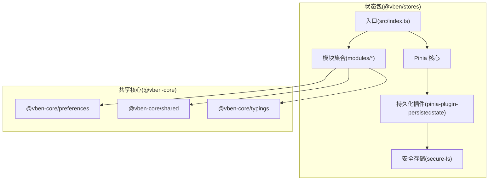
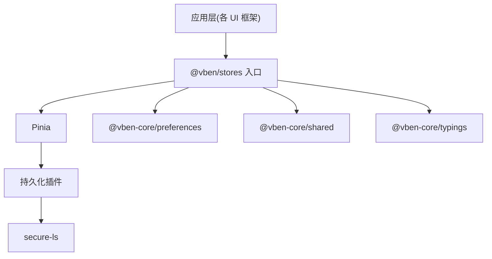
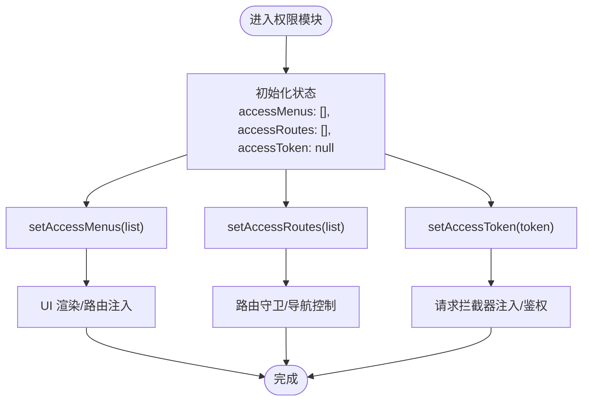
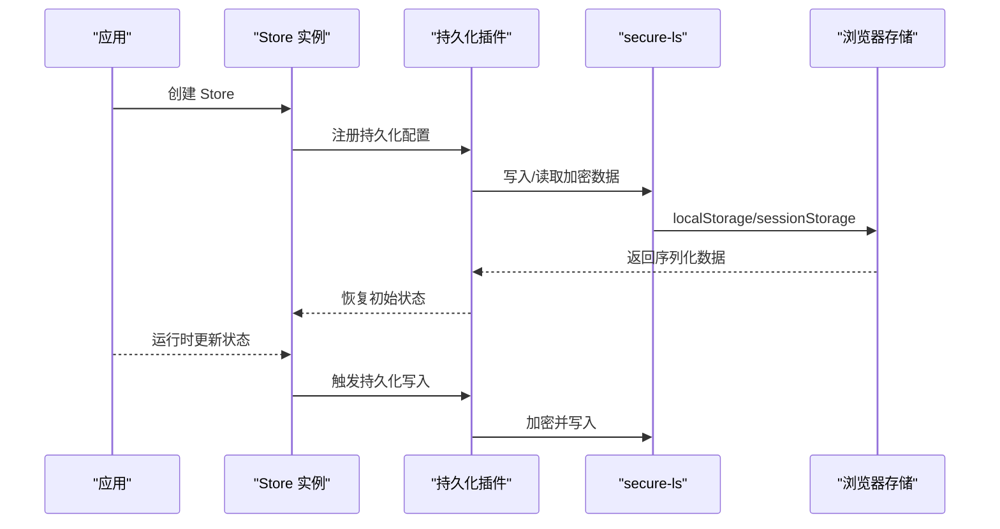
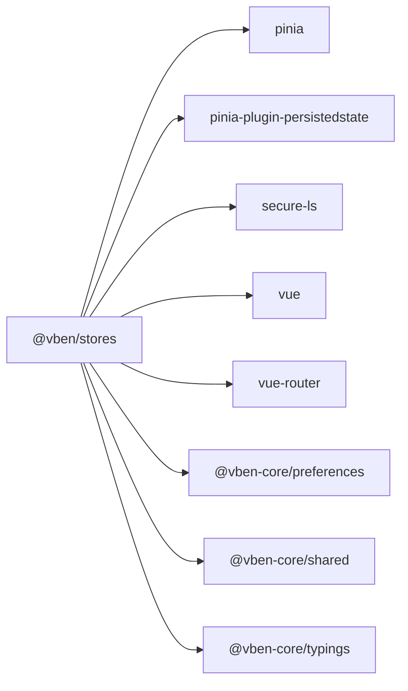

# 状态包 (@core/stores)

<cite>
**本文引用的文件**
- [packages/stores/package.json](file://packages/stores/package.json)
- [packages/stores/src/index.ts](file://packages/stores/src/index.ts)
- [packages/stores/src/modules/access.test.ts](file://packages/stores/src/modules/access.test.ts)
- [packages/@core/preferences/package.json](file://packages/@core/preferences/package.json)
- [packages/@core/shared/package.json](file://packages/@core/shared/package.json)
- [packages/@core/typings/package.json](file://packages/@core/typings/package.json)
</cite>

## 目录

1. [简介](#简介)
2. [项目结构](#项目结构)
3. [核心组件](#核心组件)
4. [架构总览](#架构总览)
5. [详细组件分析](#详细组件分析)
6. [依赖分析](#依赖分析)
7. [性能考虑](#性能考虑)
8. [故障排查指南](#故障排查指南)
9. [结论](#结论)
10. [附录](#附录)

## 简介

本文件面向状态包（@core/stores）的使用者与维护者，系统性阐述其设计理念、与 Pinia 的集成方案、Store 模块组织与命名规范、核心状态（如用户、应用配置、权限）的管理方式、状态持久化机制（localStorage/sessionStorage）、异步状态处理最佳实践（loading、错误处理、缓存），以及在不同 UI 框架中的适配与注意事项。  
本仓库中状态包以独立包形式提供，导出统一入口并内置对 Pinia 的依赖与持久化插件支持，便于在多应用（web-antd、web-ele、web-naive、web-tdesign 等）中复用。

## 项目结构

状态包位于 packages/stores，核心导出通过入口文件聚合模块与 Pinia 能力；同时依赖 @vben-core 下的共享能力包（preferences、shared、typings）。

- 入口导出：统一 re-export 模块与 Pinia 能力，便于上层按需引入。
- 持久化：通过 pinia-plugin-persistedstate 与 secure-ls 实现安全存储与恢复。
- 测试：提供模块级单元测试样例，验证 Store 行为。

图示来源

- [packages/stores/src/index.ts:1-4](file://packages/stores/src/index.ts#L1-L4)
- [packages/stores/package.json:22-31](file://packages/stores/package.json#L22-L31)
- [packages/@core/preferences/package.json:1-200](file://packages/@core/preferences/package.json#L1-L200)
- [packages/@core/shared/package.json:1-200](file://packages/@core/shared/package.json#L1-L200)
- [packages/@core/typings/package.json:1-200](file://packages/@core/typings/package.json#L1-L200)

章节来源

- [packages/stores/src/index.ts:1-4](file://packages/stores/src/index.ts#L1-L4)
- [packages/stores/package.json:1-33](file://packages/stores/package.json#L1-L33)

## 核心组件

- 统一入口导出
  - 导出模块集合与 Pinia 能力，便于上层直接从包内导入 Store 与工具函数。
- Pinia 集成
  - 通过入口 re-export 提供 defineStore、storeToRefs 等常用 API，确保一致的开发体验。
- 持久化插件
  - 依赖 pinia-plugin-persistedstate 与 secure-ls，实现状态的自动持久化与安全存储。
- 模块化组织
  - Store 按功能域拆分（如 access 权限），便于维护与扩展。
- 测试保障
  - 提供模块测试样例，覆盖关键状态更新与断言。

章节来源

- [packages/stores/src/index.ts:1-4](file://packages/stores/src/index.ts#L1-L4)
- [packages/stores/src/modules/access.test.ts:1-47](file://packages/stores/src/modules/access.test.ts#L1-L47)
- [packages/stores/package.json:22-31](file://packages/stores/package.json#L22-L31)

## 架构总览

状态包围绕 Pinia 构建，采用模块化设计，结合持久化插件实现跨页面/刷新的状态恢复；通过 @vben-core 的共享包提供偏好、类型与通用工具支撑。

图示来源

- [packages/stores/src/index.ts:1-4](file://packages/stores/src/index.ts#L1-L4)
- [packages/stores/package.json:22-31](file://packages/stores/package.json#L22-L31)
- [packages/@core/preferences/package.json:1-200](file://packages/@core/preferences/package.json#L1-L200)
- [packages/@core/shared/package.json:1-200](file://packages/@core/shared/package.json#L1-L200)
- [packages/@core/typings/package.json:1-200](file://packages/@core/typings/package.json#L1-L200)

## 详细组件分析

### 权限状态模块（access）

- 设计理念
  - 将“可访问菜单”“可访问路由”“令牌”等权限相关状态集中管理，避免分散在多个组件或服务中。
- 关键状态
  - 访问菜单列表：用于渲染侧边栏/面包屑等 UI。
  - 访问路由列表：用于动态路由注入与导航守卫。
  - 访问令牌：用于请求拦截与鉴权。
- 命名规范
  - Store 使用 useXxxStore 形态命名，模块文件以 xxx.ts 命名，便于 IDE 识别与自动补全。
- 测试要点
  - 初始化状态校验、状态更新后断言、空列表场景处理。

图示来源

- [packages/stores/src/modules/access.test.ts:6-46](file://packages/stores/src/modules/access.test.ts#L6-L46)

章节来源

- [packages/stores/src/modules/access.test.ts:1-47](file://packages/stores/src/modules/access.test.ts#L1-L47)

### 用户状态与应用配置（概念性说明）

- 用户状态
  - 包含用户信息、登录态、角色/权限集合等。建议与权限模块协同，避免重复存储。
- 应用配置
  - 主题、语言、布局偏好、全局开关等。可通过 @vben-core/preferences 提供的偏好系统统一管理。
- 建议
  - 将“用户配置”与“运行时会话”分离，前者持久化，后者仅保留在内存或短期存储。

[本节为概念性说明，不直接分析具体文件，故无章节来源]

### 状态持久化机制

- 存储介质
  - localStorage：适合长期持久化（如主题、语言、布局偏好）。
  - sessionStorage：适合短期会话（如临时筛选条件、当前页签）。
- 安全存储
  - 通过 secure-ls 对敏感数据进行加密存储，降低明文泄露风险。
- 恢复策略
  - 应用启动时优先从持久化存储恢复状态；若存储损坏或版本不兼容，回退到默认值。
- 插件集成
  - pinia-plugin-persistedstate 提供声明式持久化配置，减少样板代码。

图示来源

- [packages/stores/package.json:22-31](file://packages/stores/package.json#L22-L31)

章节来源

- [packages/stores/package.json:1-33](file://packages/stores/package.json#L1-L33)

### 异步状态处理最佳实践

- Loading 状态
  - 在发起请求前设置 loading 标志位，请求完成后清除；避免 UI 闪烁与竞态。
- 错误处理
  - 统一捕获异常，记录上下文与错误码；向用户展示可理解的提示，并提供重试入口。
- 数据缓存
  - 对热点数据设置 TTL 或基于版本号的缓存失效策略；在切换路由或刷新时优先命中缓存。
- 并发控制
  - 合理合并请求，避免重复触发；对长耗时操作提供取消能力。

[本节为通用实践说明，不直接分析具体文件，故无章节来源]

### 在不同 UI 框架中的适配与注意事项

- 通用适配
  - 在各 UI 框架（Ant Design、Element Plus、Naive UI、TDesign）中，通过统一的 @vben/stores 入口导入 Store，保持逻辑一致性。
- 注意事项
  - 不同 UI 框架的组件生命周期与事件模型略有差异，应将状态更新与 UI 更新解耦，避免直接在组件内部耦合 Store。
  - 动态路由与菜单渲染需与权限模块联动，确保“所见即所得”的权限效果。
  - 多实例或多应用场景下，注意区分存储键空间，避免冲突。

[本节为通用适配说明，不直接分析具体文件，故无章节来源]

## 依赖分析

- 直接依赖
  - Pinia：状态容器与响应式 API。
  - pinia-plugin-persistedstate：状态持久化。
  - secure-ls：安全存储。
  - vue、vue-router：运行时依赖。
- 核心共享依赖
  - @vben-core/preferences：偏好系统。
  - @vben-core/shared：通用工具与类型。
  - @vben-core/typings：类型定义。

图示来源

- [packages/stores/package.json:22-31](file://packages/stores/package.json#L22-L31)
- [packages/@core/preferences/package.json:1-200](file://packages/@core/preferences/package.json#L1-L200)
- [packages/@core/shared/package.json:1-200](file://packages/@core/shared/package.json#L1-L200)
- [packages/@core/typings/package.json:1-200](file://packages/@core/typings/package.json#L1-L200)

章节来源

- [packages/stores/package.json:1-33](file://packages/stores/package.json#L1-L33)
- [packages/@core/preferences/package.json:1-200](file://packages/@core/preferences/package.json#L1-L200)
- [packages/@core/shared/package.json:1-200](file://packages/@core/shared/package.json#L1-L200)
- [packages/@core/typings/package.json:1-200](file://packages/@core/typings/package.json#L1-L200)

## 性能考虑

- 状态粒度
  - 将大对象拆分为细粒度状态，避免不必要的响应式追踪与渲染。
- 持久化策略
  - 仅持久化必要字段；对大数组或深层对象采用分片或懒加载。
- 缓存与去抖
  - 对频繁变更的状态使用去抖/节流，减少写入频率。
- 内存占用
  - 及时清理过期缓存与监听器，防止内存泄漏。

[本节为通用性能建议，不直接分析具体文件，故无章节来源]

## 故障排查指南

- 现象：刷新后状态丢失
  - 排查：确认持久化插件是否正确注册；检查存储键名与作用域；核对 secure-ls 的初始化参数。
- 现象：权限菜单不生效
  - 排查：确认 setAccessMenus/setAccessRoutes 是否被调用；检查路由守卫与菜单渲染逻辑。
- 现象：测试失败
  - 排查：确保在测试前初始化 Pinia；使用测试专用 Store 实例；断言状态更新路径清晰。

章节来源

- [packages/stores/src/modules/access.test.ts:1-47](file://packages/stores/src/modules/access.test.ts#L1-L47)

## 结论

@core/stores 以模块化与持久化为核心，结合 Pinia 与 @vben-core 共享能力，提供了可复用、可测试、可扩展的状态管理方案。通过规范的命名与组织方式、完善的测试覆盖与最佳实践，能够在多 UI 框架与多应用场景中稳定运行。

[本节为总结性内容，不直接分析具体文件，故无章节来源]

## 附录

- 快速开始
  - 在应用中安装并初始化 @vben/stores，从入口导入所需 Store，按模块命名规范编写业务逻辑。
- 常见问题
  - 如何自定义持久化键？如何扩展新模块？请参考包内导出与测试用例，遵循现有模式。

[本节为补充性内容，不直接分析具体文件，故无章节来源]
