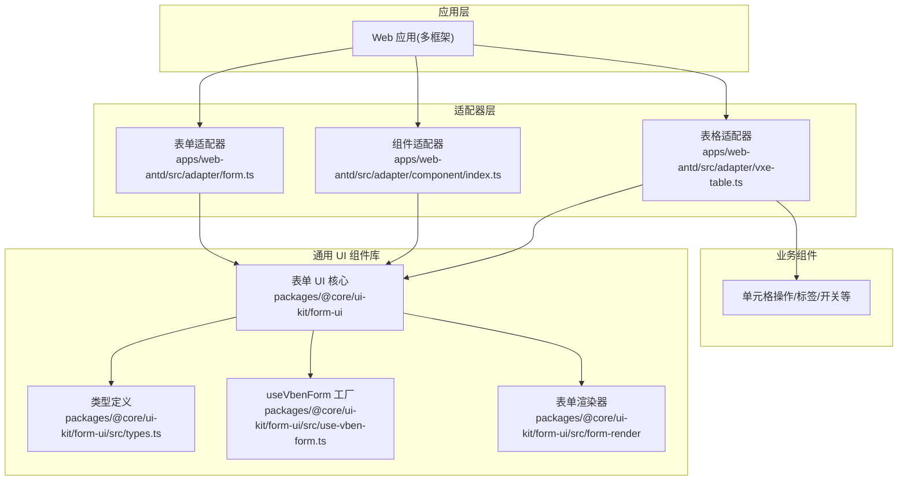
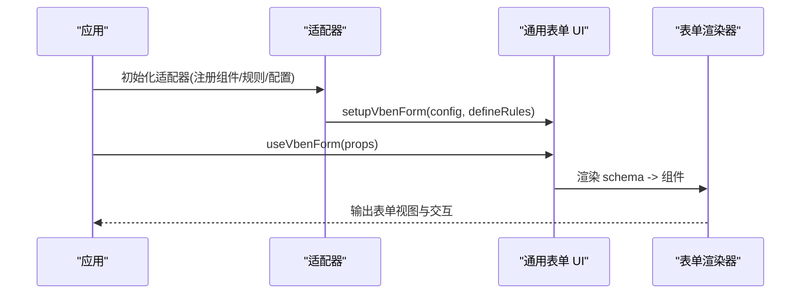
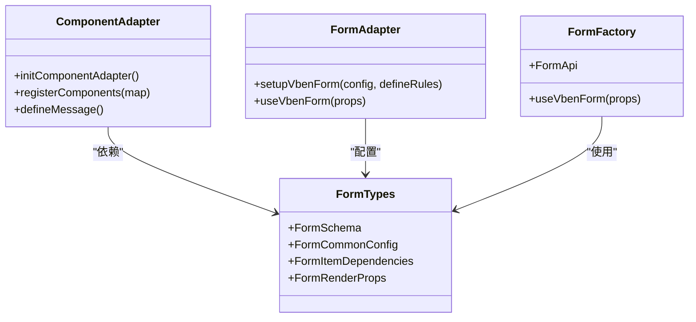
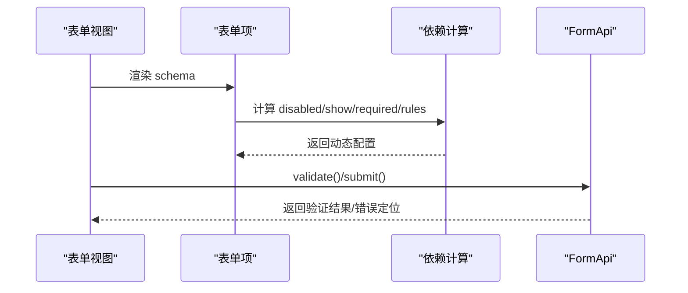
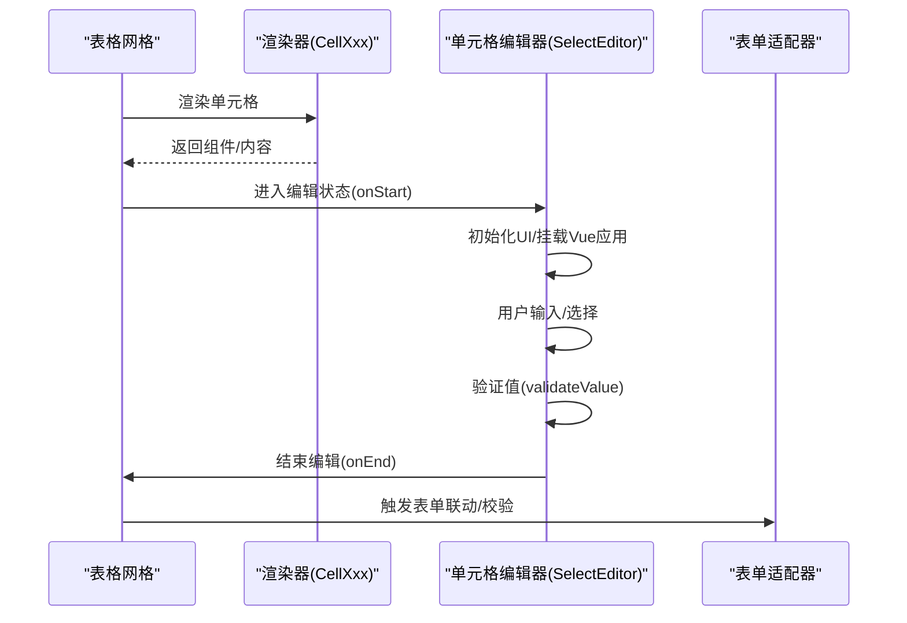
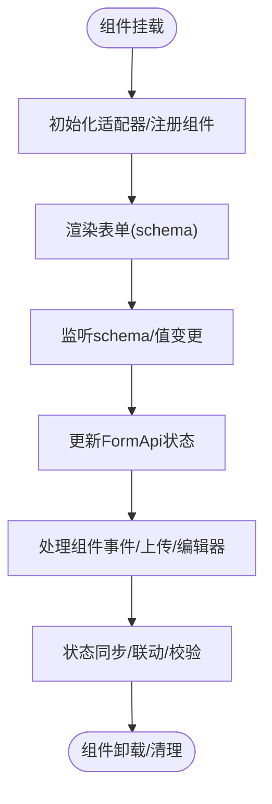
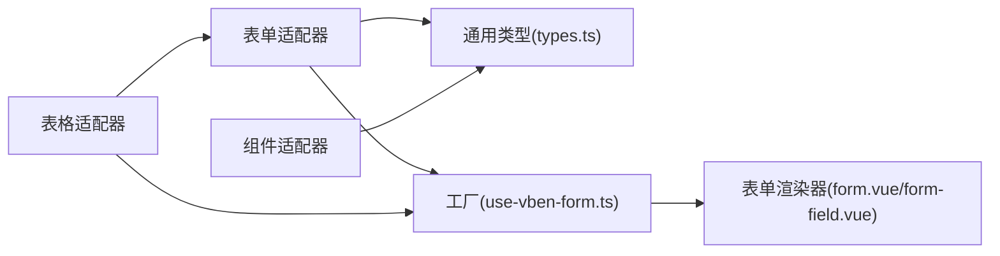

# 组件系统

<cite>
**本文档引用的文件**
- [apps/web-antd/src/adapter/component/index.ts](file://apps/web-antd/src/adapter/component/index.ts)
- [apps/web-antd/src/adapter/form.ts](file://apps/web-antd/src/adapter/form.ts)
- [apps/web-antd/src/adapter/vxe-table.ts](file://apps/web-antd/src/adapter/vxe-table.ts)
- [packages/@core/ui-kit/form-ui/src/index.ts](file://packages/@core/ui-kit/form-ui/src/index.ts)
- [packages/@core/ui-kit/form-ui/src/types.ts](file://packages/@core/ui-kit/form-ui/src/types.ts)
- [packages/@core/ui-kit/form-ui/src/use-vben-form.ts](file://packages/@core/ui-kit/form-ui/src/use-vben-form.ts)
- [packages/@core/ui-kit/form-ui/src/form-render/form.vue](file://packages/@core/ui-kit/form-ui/src/form-render/form.vue)
- [packages/@core/ui-kit/form-ui/src/form-render/form-field.vue](file://packages/@core/ui-kit/form-ui/src/form-render/form-field.vue)
- [packages/@core/ui-kit/form-ui/src/form-api.ts](file://packages/@core/ui-kit/form-ui/src/form-api.ts)
- [apps/web-antd/src/vtable/SelectEditor.ts](file://apps/web-antd/src/vtable/SelectEditor.ts)
- [.agents/skills/vue-vben-admin/references/documentation/other/vben-vxe-table.md](file://.agents/skills/vue-vben-admin/references/documentation/other/vben-vxe-table.md)
</cite>

## 目录

1. [简介](#简介)
2. [项目结构](#项目结构)
3. [核心组件](#核心组件)
4. [架构总览](#架构总览)
5. [组件详解](#组件详解)
6. [依赖关系分析](#依赖关系分析)
7. [性能考量](#性能考量)
8. [故障排查指南](#故障排查指南)
9. [结论](#结论)
10. [附录](#附录)

## 简介

本文件面向 Vben Admin 的组件系统，系统性阐述组件适配器模式的设计与落地，通用组件库的分层与使用方式，以及表单与表格两大核心子系统的实现要点。重点包括：

- 通过适配器层实现 UI 框架的统一抽象，屏蔽不同 UI 库（如 Ant Design Vue、Element Plus、Naive UI、TDesign）的差异。
- 通用组件库的分类与复用策略：基础 UI 组件、业务组件与复合组件。
- 表单组件系统：表单适配器、字段类型映射、验证机制与生命周期管理。
- 表格组件系统：VXE Table 适配器、单元格编辑器与数据绑定机制。
- 组件生命周期、事件处理与状态同步的最佳实践。

## 项目结构

组件系统围绕“适配器 + 通用 UI 组件库 + 业务组件”三层组织：

- 适配器层：针对具体 UI 框架（Antd、Element、Naive、TDesign）提供组件映射、模型属性名映射、规则国际化等适配逻辑。
- 通用 UI 组件库：提供跨框架一致的表单、表格、弹窗等能力，通过共享状态与配置中心对外暴露。
- 业务组件：基于通用组件库与适配器构建的业务场景组件，如字典标签、用户头像、操作列等。

图表来源

- [apps/web-antd/src/adapter/form.ts:1-50](file://apps/web-antd/src/adapter/form.ts#L1-L50)
- [apps/web-antd/src/adapter/component/index.ts:1-608](file://apps/web-antd/src/adapter/component/index.ts#L1-L608)
- [apps/web-antd/src/adapter/vxe-table.ts:1-119](file://apps/web-antd/src/adapter/vxe-table.ts#L1-L119)
- [packages/@core/ui-kit/form-ui/src/types.ts:1-465](file://packages/@core/ui-kit/form-ui/src/types.ts#L1-L465)
- [packages/@core/ui-kit/form-ui/src/use-vben-form.ts:1-51](file://packages/@core/ui-kit/form-ui/src/use-vben-form.ts#L1-L51)
- [packages/@core/ui-kit/form-ui/src/form-render/form.vue:140-192](file://packages/@core/ui-kit/form-ui/src/form-render/form.vue#L140-L192)
- [packages/@core/ui-kit/form-ui/src/form-render/form-field.vue:57-117](file://packages/@core/ui-kit/form-ui/src/form-render/form-field.vue#L57-L117)

章节来源

- [apps/web-antd/src/adapter/form.ts:1-50](file://apps/web-antd/src/adapter/form.ts#L1-L50)
- [apps/web-antd/src/adapter/component/index.ts:1-608](file://apps/web-antd/src/adapter/component/index.ts#L1-L608)
- [apps/web-antd/src/adapter/vxe-table.ts:1-119](file://apps/web-antd/src/adapter/vxe-table.ts#L1-L119)
- [packages/@core/ui-kit/form-ui/src/types.ts:1-465](file://packages/@core/ui-kit/form-ui/src/types.ts#L1-L465)
- [packages/@core/ui-kit/form-ui/src/use-vben-form.ts:1-51](file://packages/@core/ui-kit/form-ui/src/use-vben-form.ts#L1-L51)
- [packages/@core/ui-kit/form-ui/src/form-render/form.vue:140-192](file://packages/@core/ui-kit/form-ui/src/form-render/form.vue#L140-L192)
- [packages/@core/ui-kit/form-ui/src/form-render/form-field.vue:57-117](file://packages/@core/ui-kit/form-ui/src/form-render/form-field.vue#L57-L117)

## 核心组件

- 表单适配器：负责模型属性名映射、规则国际化、表单配置注入。
- 组件适配器：将 UI 组件库的组件统一封装为通用组件类型，并提供默认占位符、上传预览、裁剪等增强能力。
- 表格适配器：基于 VXE Table 的 renderer 注册与全局配置，提供单元格渲染器与表格行为扩展。
- 通用表单 UI：提供跨框架一致的表单渲染、依赖联动、验证与提交流程。
- 业务组件：如字典标签、用户头像、操作列等，作为表格与表单的复合组件使用。

章节来源

- [apps/web-antd/src/adapter/form.ts:11-42](file://apps/web-antd/src/adapter/form.ts#L11-L42)
- [apps/web-antd/src/adapter/component/index.ts:526-608](file://apps/web-antd/src/adapter/component/index.ts#L526-L608)
- [apps/web-antd/src/adapter/vxe-table.ts:34-104](file://apps/web-antd/src/adapter/vxe-table.ts#L34-L104)
- [packages/@core/ui-kit/form-ui/src/index.ts:1-13](file://packages/@core/ui-kit/form-ui/src/index.ts#L1-L13)

## 架构总览

组件系统采用“适配器 + 通用 UI 组件库”的双层设计：

- 适配器层：按 UI 框架维度提供组件映射与配置，保证上层业务代码无需感知底层 UI 差异。
- 通用 UI 组件库：提供统一的表单/表格 API、类型与渲染器，通过工厂函数 useVbenForm/useVbenVxeGrid 暴露能力。

图表来源

- [apps/web-antd/src/adapter/form.ts:11-42](file://apps/web-antd/src/adapter/form.ts#L11-L42)
- [packages/@core/ui-kit/form-ui/src/use-vben-form.ts:14-50](file://packages/@core/ui-kit/form-ui/src/use-vben-form.ts#L14-L50)
- [packages/@core/ui-kit/form-ui/src/form-render/form.vue:172-192](file://packages/@core/ui-kit/form-ui/src/form-render/form.vue#L172-L192)

## 组件详解

### 组件适配器模式与通用组件库

- 设计原则
  - 统一抽象：将不同 UI 框架的组件映射为统一的组件类型，屏蔽 v-model 名称差异、事件命名差异等。
  - 可插拔：通过共享状态注册组件映射，便于在不同应用中切换 UI 框架。
  - 增强能力：在通用组件基础上提供默认占位符、上传预览、裁剪等增强逻辑。
- 通用组件库
  - 类型与配置：集中定义表单 schema、通用配置、依赖联动、栅格布局等。
  - 渲染器：按 schema 动态渲染表单项，支持条件显隐、禁用、必填、规则动态计算等。
  - 生命周期：useVbenForm 工厂在组件卸载时自动清理表单状态，避免内存泄漏。

图表来源

- [apps/web-antd/src/adapter/component/index.ts:526-608](file://apps/web-antd/src/adapter/component/index.ts#L526-L608)
- [apps/web-antd/src/adapter/form.ts:11-42](file://apps/web-antd/src/adapter/form.ts#L11-L42)
- [packages/@core/ui-kit/form-ui/src/types.ts:139-342](file://packages/@core/ui-kit/form-ui/src/types.ts#L139-L342)
- [packages/@core/ui-kit/form-ui/src/use-vben-form.ts:14-50](file://packages/@core/ui-kit/form-ui/src/use-vben-form.ts#L14-L50)

章节来源

- [apps/web-antd/src/adapter/component/index.ts:526-608](file://apps/web-antd/src/adapter/component/index.ts#L526-L608)
- [apps/web-antd/src/adapter/form.ts:11-42](file://apps/web-antd/src/adapter/form.ts#L11-L42)
- [packages/@core/ui-kit/form-ui/src/types.ts:139-342](file://packages/@core/ui-kit/form-ui/src/types.ts#L139-L342)
- [packages/@core/ui-kit/form-ui/src/use-vben-form.ts:14-50](file://packages/@core/ui-kit/form-ui/src/use-vben-form.ts#L14-L50)

### 表单组件系统

- 表单适配器
  - 模型属性名映射：针对不同组件（如 Checkbox/Radio/Switch/Upload）提供 v-model 名称映射。
  - 规则国际化：内置必填、选择必填等规则的国际化文案。
- 表单渲染与依赖联动
  - schema 驱动：每个表单项由 schema 描述，包含组件类型、默认值、依赖、规则等。
  - 依赖联动：支持根据其他字段值动态计算禁用、显隐、必填、规则与组件参数。
  - 渲染器：按 schema 渲染表单项，支持 label 宽度、类名、栅格布局等通用配置。
- 验证与提交
  - 验证：支持同步/异步验证，自动滚动到首个错误字段。
  - 提交：提供 validateAndSubmitForm 与 submitForm 流程，结合 handleValuesChange 回调。

图表来源

- [packages/@core/ui-kit/form-ui/src/form-render/form-field.vue:85-117](file://packages/@core/ui-kit/form-ui/src/form-render/form-field.vue#L85-L117)
- [packages/@core/ui-kit/form-ui/src/form-api.ts:405-430](file://packages/@core/ui-kit/form-ui/src/form-api.ts#L405-L430)
- [packages/@core/ui-kit/form-ui/src/form-render/form.vue:172-192](file://packages/@core/ui-kit/form-ui/src/form-render/form.vue#L172-L192)

章节来源

- [apps/web-antd/src/adapter/form.ts:11-42](file://apps/web-antd/src/adapter/form.ts#L11-L42)
- [packages/@core/ui-kit/form-ui/src/form-render/form-field.vue:85-117](file://packages/@core/ui-kit/form-ui/src/form-render/form-field.vue#L85-L117)
- [packages/@core/ui-kit/form-ui/src/form-api.ts:405-430](file://packages/@core/ui-kit/form-ui/src/form-api.ts#L405-L430)
- [packages/@core/ui-kit/form-ui/src/form-render/form.vue:172-192](file://packages/@core/ui-kit/form-ui/src/form-render/form.vue#L172-L192)

### 表格组件系统

- VXE Table 适配器
  - 全局配置：统一 grid、proxy、renderer 等配置，禁用 VXE 内置表单配置，改用 formOptions。
  - 单元格渲染器：注册多种 CellXxx 渲染器，如图片、链接、标签、进度条、开关、操作按钮等。
  - 业务组件：字典选择/标签、用户头像/头像组、用户选择器等。
- 单元格编辑器
  - 以 SelectEditor 为例，提供编辑器生命周期（onStart/onEnd）、值获取（getValue）、DOM 元素判断（isEditorElement）、值验证（validateValue）与位置调整（adjustEditorPosition）。
- 数据绑定机制
  - 通过 useVbenVxeGrid 暴露表格能力，结合 renderer 注册与 schema 配置实现数据与 UI 的双向绑定。

图表来源

- [apps/web-antd/src/adapter/vxe-table.ts:34-104](file://apps/web-antd/src/adapter/vxe-table.ts#L34-L104)
- [apps/web-antd/src/vtable/SelectEditor.ts:141-262](file://apps/web-antd/src/vtable/SelectEditor.ts#L141-L262)
- [apps/web-antd/src/adapter/form.ts:11-42](file://apps/web-antd/src/adapter/form.ts#L11-L42)

章节来源

- [apps/web-antd/src/adapter/vxe-table.ts:34-104](file://apps/web-antd/src/adapter/vxe-table.ts#L34-L104)
- [apps/web-antd/src/vtable/SelectEditor.ts:141-262](file://apps/web-antd/src/vtable/SelectEditor.ts#L141-L262)
- [.agents/skills/vue-vben-admin/references/documentation/other/vben-vxe-table.md:27-97](file://.agents/skills/vue-vben-admin/references/documentation/other/vben-vxe-table.md#L27-L97)

### 生命周期管理、事件处理与状态同步

- 生命周期
  - 组件卸载：useVbenForm 在组件 beforeUnmount 时调用 FormApi.unmount，释放状态与订阅。
  - 表单渲染：按 schema 渲染，支持响应式 schema 更新（watch）。
- 事件处理
  - 组件事件绑定：通过 componentBindEventMap 与 modelPropNameMap 统一 v-model 事件名称。
  - 上传组件：拦截 onChange、beforeUpload、onPreview 等事件，统一处理文件列表、预览与裁剪。
- 状态同步
  - 表单值变更：通过 FormApi 维护状态，结合 handleValuesChange 回调实现外部状态同步。
  - 依赖联动：依赖计算返回动态配置，实时影响表单项的显隐、禁用、必填与规则。

图表来源

- [packages/@core/ui-kit/form-ui/src/use-vben-form.ts:24-37](file://packages/@core/ui-kit/form-ui/src/use-vben-form.ts#L24-L37)
- [packages/@core/ui-kit/form-ui/src/form-api.ts:377-403](file://packages/@core/ui-kit/form-ui/src/form-api.ts#L377-L403)
- [apps/web-antd/src/adapter/component/index.ts:400-491](file://apps/web-antd/src/adapter/component/index.ts#L400-L491)

章节来源

- [packages/@core/ui-kit/form-ui/src/use-vben-form.ts:24-37](file://packages/@core/ui-kit/form-ui/src/use-vben-form.ts#L24-L37)
- [packages/@core/ui-kit/form-ui/src/form-api.ts:377-403](file://packages/@core/ui-kit/form-ui/src/form-api.ts#L377-L403)
- [apps/web-antd/src/adapter/component/index.ts:400-491](file://apps/web-antd/src/adapter/component/index.ts#L400-L491)

## 依赖关系分析

- 适配器依赖
  - 表单适配器依赖通用表单 UI 的 setupVbenForm/useVbenForm/zod。
  - 组件适配器通过 globalShareState 注册组件映射，并提供默认占位符与上传增强。
  - 表格适配器依赖 VXE Table 的 renderer 与全局配置，同时引入表单适配器以实现联动。
- 通用 UI 组件库
  - types.ts 定义表单 schema、通用配置、依赖联动与渲染参数。
  - use-vben-form.ts 提供工厂函数与 FormApi，form.vue 与 form-field.vue 实现渲染与依赖联动。

图表来源

- [apps/web-antd/src/adapter/form.ts:8-46](file://apps/web-antd/src/adapter/form.ts#L8-L46)
- [apps/web-antd/src/adapter/component/index.ts:526-608](file://apps/web-antd/src/adapter/component/index.ts#L526-L608)
- [apps/web-antd/src/adapter/vxe-table.ts:106-118](file://apps/web-antd/src/adapter/vxe-table.ts#L106-L118)
- [packages/@core/ui-kit/form-ui/src/types.ts:241-342](file://packages/@core/ui-kit/form-ui/src/types.ts#L241-L342)
- [packages/@core/ui-kit/form-ui/src/use-vben-form.ts:14-50](file://packages/@core/ui-kit/form-ui/src/use-vben-form.ts#L14-L50)
- [packages/@core/ui-kit/form-ui/src/form-render/form.vue:172-192](file://packages/@core/ui-kit/form-ui/src/form-render/form.vue#L172-L192)
- [packages/@core/ui-kit/form-ui/src/form-render/form-field.vue:57-117](file://packages/@core/ui-kit/form-ui/src/form-render/form-field.vue#L57-L117)

章节来源

- [apps/web-antd/src/adapter/form.ts:8-46](file://apps/web-antd/src/adapter/form.ts#L8-L46)
- [apps/web-antd/src/adapter/component/index.ts:526-608](file://apps/web-antd/src/adapter/component/index.ts#L526-L608)
- [apps/web-antd/src/adapter/vxe-table.ts:106-118](file://apps/web-antd/src/adapter/vxe-table.ts#L106-L118)
- [packages/@core/ui-kit/form-ui/src/types.ts:241-342](file://packages/@core/ui-kit/form-ui/src/types.ts#L241-L342)
- [packages/@core/ui-kit/form-ui/src/use-vben-form.ts:14-50](file://packages/@core/ui-kit/form-ui/src/use-vben-form.ts#L14-L50)
- [packages/@core/ui-kit/form-ui/src/form-render/form.vue:172-192](file://packages/@core/ui-kit/form-ui/src/form-render/form.vue#L172-L192)
- [packages/@core/ui-kit/form-ui/src/form-render/form-field.vue:57-117](file://packages/@core/ui-kit/form-ui/src/form-render/form-field.vue#L57-L117)

## 性能考量

- 异步组件加载：组件适配器对大组件采用异步加载，降低首屏体积。
- 渲染优化：表单渲染器按 schema 渲染，减少不必要的 DOM 重建；依赖联动仅在触发字段变化时重新计算。
- 上传与预览：上传组件在 beforeUpload 中进行尺寸校验与裁剪，避免无效请求；预览组延迟清理，减少内存占用。
- 表格编辑器：编辑器在 onEnd 中清理 Vue 应用与 DOM，防止内存泄漏。

## 故障排查指南

- 表单 schema 缺失 fieldName
  - 症状：更新 schema 时控制台报错，字段未更新。
  - 排查：确认 schema 数组中每个项均包含有效的 fieldName。
- 验证失败与错误定位
  - 症状：提交失败但无错误提示或未定位到首个错误。
  - 排查：开启 scrollToFirstError 并检查 validate 返回的 errors。
- 上传组件异常
  - 症状：上传后未同步到 v-model 或预览失败。
  - 排查：检查 handleChange 与 fileList 的同步逻辑，确认 beforeUpload 返回值与裁剪流程。
- 表格编辑器未关闭
  - 症状：编辑器残留 DOM 或无法退出编辑。
  - 排查：确认 onEnd 是否被调用，isEditorElement 判断是否正确，validateValue 是否返回正确布尔值。

章节来源

- [packages/@core/ui-kit/form-ui/src/form-api.ts:377-403](file://packages/@core/ui-kit/form-ui/src/form-api.ts#L377-L403)
- [packages/@core/ui-kit/form-ui/src/form-api.ts:405-430](file://packages/@core/ui-kit/form-ui/src/form-api.ts#L405-L430)
- [apps/web-antd/src/adapter/component/index.ts:400-491](file://apps/web-antd/src/adapter/component/index.ts#L400-L491)
- [apps/web-antd/src/vtable/SelectEditor.ts:120-133](file://apps/web-antd/src/vtable/SelectEditor.ts#L120-L133)

## 结论

Vben Admin 的组件系统通过“适配器 + 通用 UI 组件库”的架构实现了 UI 框架的统一抽象与业务组件的高复用。表单与表格两大子系统以 schema/渲染器为核心，配合依赖联动、验证与生命周期管理，提供了稳定、可扩展且易维护的前端组件体系。开发者可在不改动业务逻辑的前提下，灵活切换 UI 框架并快速扩展新的业务组件。

## 附录

- 术语
  - 适配器：封装 UI 框架差异的模块，提供统一接口。
  - 通用组件库：跨框架一致的 UI 能力集合。
  - 业务组件：基于通用组件库与适配器构建的具体业务 UI。
- 参考文档
  - VXE Table 适配器示例与配置参考：[vben-vxe-table.md:27-97](file://.agents/skills/vue-vben-admin/references/documentation/other/vben-vxe-table.md#L27-L97)
