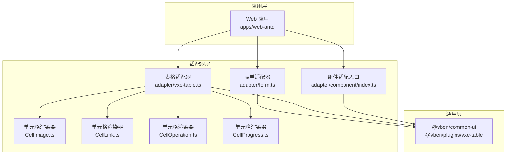
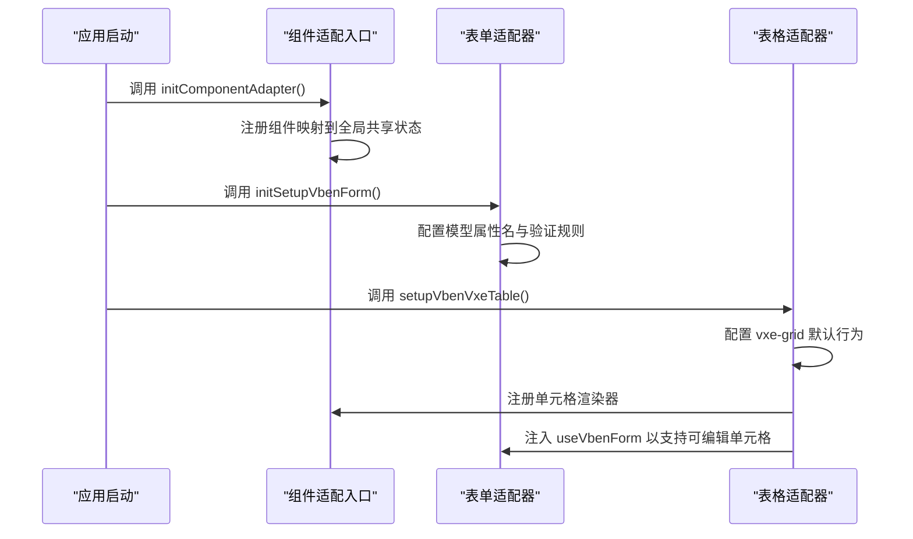
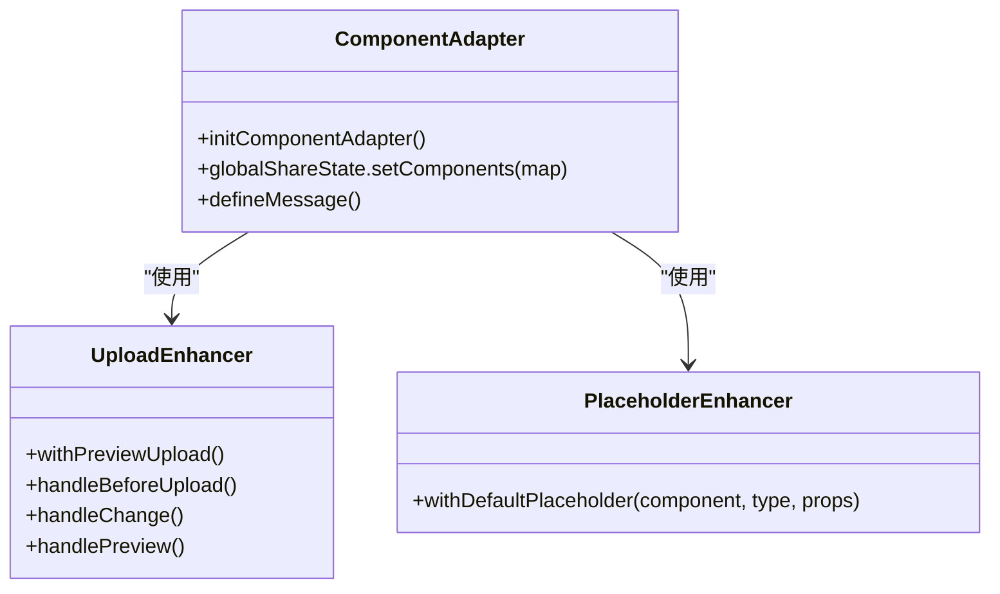
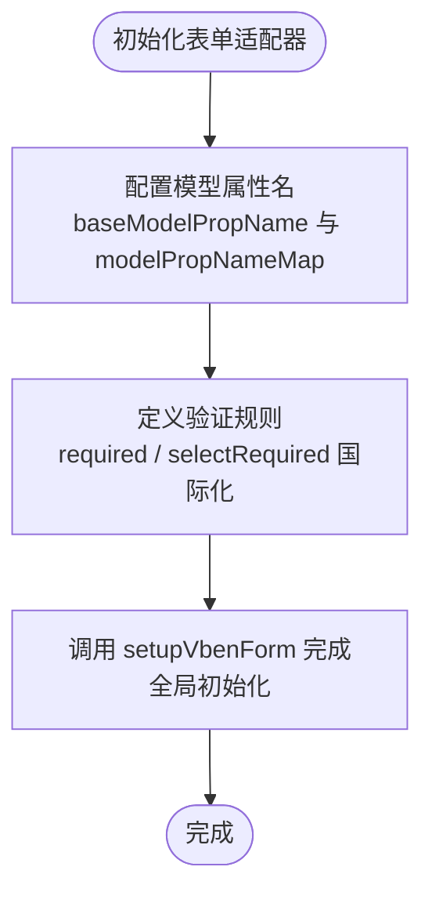
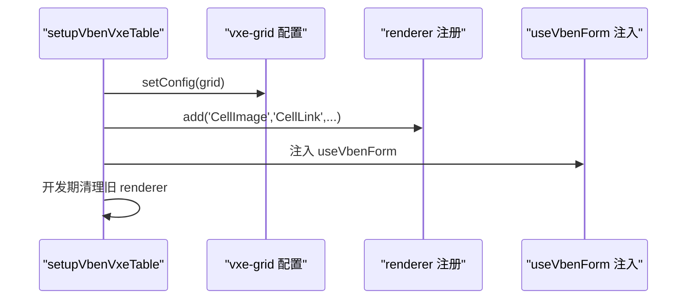
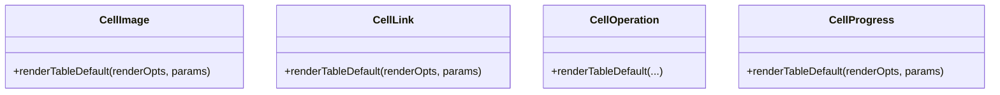
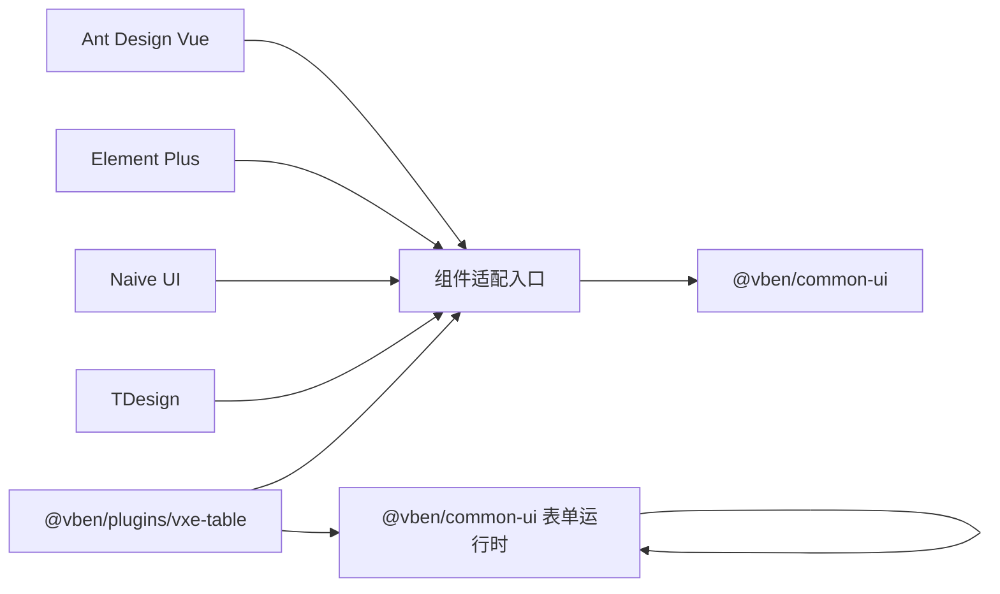

# 组件适配器模式

<cite>
**本文引用的文件**
- [apps/web-antd/src/adapter/form.ts](file://apps/web-antd/src/adapter/form.ts)
- [apps/web-antd/src/adapter/vxe-table.ts](file://apps/web-antd/src/adapter/vxe-table.ts)
- [apps/web-antd/src/adapter/component/index.ts](file://apps/web-antd/src/adapter/component/index.ts)
- [apps/web-antd/src/adapter/component/table/CellImage.ts](file://apps/web-antd/src/adapter/component/table/CellImage.ts)
- [apps/web-antd/src/adapter/component/table/CellLink.ts](file://apps/web-antd/src/adapter/component/table/CellLink.ts)
- [apps/web-antd/src/adapter/component/table/CellOperation.ts](file://apps/web-antd/src/adapter/component/table/CellOperation.ts)
- [apps/web-antd/src/adapter/component/table/CellProgress.ts](file://apps/web-antd/src/adapter/component/table/CellProgress.ts)
- [apps/web-antd/src/adapter/naive.ts](file://apps/web-antd/src/adapter/naive.ts)
- [apps/web-antd/src/adapter/tdesign.ts](file://apps/web-antd/src/adapter/tdesign.ts)
- [apps/web-antd/src/adapter/form.ts](file://apps/web-antd/src/adapter/form.ts)
- [apps/web-antd/src/adapter/vxe-table.ts](file://apps/web-antd/src/adapter/vxe-table.ts)
- [apps/web-antd/src/adapter/component/index.ts](file://apps/web-antd/src/adapter/component/index.ts)
- [apps/web-antd/src/adapter/component/table/CellImage.ts](file://apps/web-antd/src/adapter/component/table/CellImage.ts)
- [apps/web-antd/src/adapter/component/table/CellLink.ts](file://apps/web-antd/src/adapter/component/table/CellLink.ts)
- [apps/web-antd/src/adapter/component/table/CellOperation.ts](file://apps/web-antd/src/adapter/component/table/CellOperation.ts)
- [apps/web-antd/src/adapter/component/table/CellProgress.ts](file://apps/web-antd/src/adapter/component/table/CellProgress.ts)
</cite>

## 目录
1. [简介](#简介)
2. [项目结构](#项目结构)
3. [核心组件](#核心组件)
4. [架构总览](#架构总览)
5. [详细组件分析](#详细组件分析)
6. [依赖关系分析](#依赖关系分析)
7. [性能考量](#性能考量)
8. [故障排查指南](#故障排查指南)
9. [结论](#结论)
10. [附录](#附录)

## 简介
本文件系统性阐述 Vben Admin 在多 UI 框架（Ant Design Vue、Element Plus、Naive UI、TDesign）下通过“组件适配器模式”实现 UI 抽象与统一接入的设计思想与实现原理。重点覆盖：
- 组件属性映射与事件转换
- 生命周期适配与全局配置
- 表单适配器：字段类型映射、验证规则转换、数据绑定策略
- 表格适配器：单元格渲染器、列配置、数据源适配
- 适配器注册机制、动态适配与性能优化策略
- 最佳实践与扩展建议

## 项目结构
适配器位于各 Web 应用的 adapter 目录下，按功能拆分为：
- 组件适配入口：component/index.ts
- 表单适配器：form.ts
- 表格适配器：vxe-table.ts
- 表格单元格渲染器：component/table 下的若干 CellXxx 组件

图表来源
- [apps/web-antd/src/adapter/component/index.ts:526-608](file://apps/web-antd/src/adapter/component/index.ts#L526-L608)
- [apps/web-antd/src/adapter/form.ts:11-46](file://apps/web-antd/src/adapter/form.ts#L11-L46)
- [apps/web-antd/src/adapter/vxe-table.ts:34-104](file://apps/web-antd/src/adapter/vxe-table.ts#L34-L104)

章节来源
- [apps/web-antd/src/adapter/component/index.ts:526-608](file://apps/web-antd/src/adapter/component/index.ts#L526-L608)
- [apps/web-antd/src/adapter/form.ts:11-46](file://apps/web-antd/src/adapter/form.ts#L11-L46)
- [apps/web-antd/src/adapter/vxe-table.ts:34-104](file://apps/web-antd/src/adapter/vxe-table.ts#L34-L104)

## 核心组件
- 组件适配入口：负责将具体 UI 组件库（如 Ant Design Vue）的组件映射为统一的组件类型集合，并注册到全局共享状态，供表单与表格使用。
- 表单适配器：定义模型属性名约定、组件模型属性映射表、验证规则国际化适配，并初始化表单运行时环境。
- 表格适配器：集中配置 vxe-grid 默认行为、注册单元格渲染器、桥接表单适配器以支持可编辑单元格。

章节来源
- [apps/web-antd/src/adapter/component/index.ts:494-525](file://apps/web-antd/src/adapter/component/index.ts#L494-L525)
- [apps/web-antd/src/adapter/form.ts:11-46](file://apps/web-antd/src/adapter/form.ts#L11-L46)
- [apps/web-antd/src/adapter/vxe-table.ts:34-104](file://apps/web-antd/src/adapter/vxe-table.ts#L34-L104)

## 架构总览
适配器通过“统一接口 + 具体实现”的方式，屏蔽不同 UI 框架的差异，形成可替换的适配层。核心流程如下：
- 初始化阶段：调用各适配器的初始化函数，注册组件、配置表单/表格运行时。
- 使用阶段：上层业务仅面向统一的组件类型与表单/表格 API，无需关心底层 UI 框架差异。
- 扩展阶段：新增 UI 框架时，仅需实现对应适配器，保持上层不变。

图表来源
- [apps/web-antd/src/adapter/component/index.ts:526-608](file://apps/web-antd/src/adapter/component/index.ts#L526-L608)
- [apps/web-antd/src/adapter/form.ts:11-46](file://apps/web-antd/src/adapter/form.ts#L11-L46)
- [apps/web-antd/src/adapter/vxe-table.ts:34-104](file://apps/web-antd/src/adapter/vxe-table.ts#L34-L104)

## 详细组件分析

### 组件适配入口（component/index.ts）
职责与特性：
- 统一组件类型枚举：定义可用组件集合，覆盖常用输入、选择、日期、上传、图标选择等。
- 组件包装与增强：
  - 默认占位符增强：自动注入国际化占位符，减少重复配置。
  - 上传组件增强：内置预览、裁剪、尺寸校验、默认插槽生成等能力。
- 全局注册：将组件映射注册到全局共享状态，供表单/表格消费。
- 消息提示：定义复制成功等消息提示样式，统一交互反馈。

图表来源
- [apps/web-antd/src/adapter/component/index.ts:526-608](file://apps/web-antd/src/adapter/component/index.ts#L526-L608)
- [apps/web-antd/src/adapter/component/index.ts:103-135](file://apps/web-antd/src/adapter/component/index.ts#L103-L135)
- [apps/web-antd/src/adapter/component/index.ts:137-491](file://apps/web-antd/src/adapter/component/index.ts#L137-L491)

章节来源
- [apps/web-antd/src/adapter/component/index.ts:494-525](file://apps/web-antd/src/adapter/component/index.ts#L494-L525)
- [apps/web-antd/src/adapter/component/index.ts:526-608](file://apps/web-antd/src/adapter/component/index.ts#L526-L608)
- [apps/web-antd/src/adapter/component/index.ts:103-135](file://apps/web-antd/src/adapter/component/index.ts#L103-L135)
- [apps/web-antd/src/adapter/component/index.ts:137-491](file://apps/web-antd/src/adapter/component/index.ts#L137-L491)

### 表单适配器（form.ts）
职责与特性：
- 模型属性名约定：统一基础模型属性名为 value；对部分组件（复选、单选、开关、上传）提供专用模型属性映射。
- 验证规则国际化：提供 required、selectRequired 等规则的本地化错误信息。
- 初始化：通过 setupVbenForm 完成表单运行时的全局配置。

图表来源
- [apps/web-antd/src/adapter/form.ts:11-46](file://apps/web-antd/src/adapter/form.ts#L11-L46)

章节来源
- [apps/web-antd/src/adapter/form.ts:11-46](file://apps/web-antd/src/adapter/form.ts#L11-L46)

### 表格适配器（vxe-table.ts）
职责与特性：
- vxe-grid 默认配置：统一表格尺寸、边框、溢出、分页响应结构等。
- 渲染器注册：将 CellImage、CellLink、CellTag、CellSwitch、CellOperation、DictTag、UserAvatar、UserAvatarGroup、DictSelect、UserSelect、CellProgress 等注册为 vxe renderer。
- 动态适配：注入 useVbenForm，使表格可编辑单元格与表单联动。
- 热更新兼容：在开发时清理旧渲染器，避免热更新异常。

图表来源
- [apps/web-antd/src/adapter/vxe-table.ts:34-104](file://apps/web-antd/src/adapter/vxe-table.ts#L34-L104)

章节来源
- [apps/web-antd/src/adapter/vxe-table.ts:34-104](file://apps/web-antd/src/adapter/vxe-table.ts#L34-L104)

### 表格单元格渲染器（CellXxx）
- CellImage：基于 UI 组件库的 Image 组件渲染图片单元格。
- CellLink：渲染链接按钮，点击触发外部事件。
- CellOperation：渲染操作列按钮，支持内置 edit/delete 与自定义动作，带确认气泡与对齐控制。
- CellProgress：渲染进度条组件，基于行数据字段计算百分比。

图表来源
- [apps/web-antd/src/adapter/component/table/CellImage.ts:5-11](file://apps/web-antd/src/adapter/component/table/CellImage.ts#L5-L11)
- [apps/web-antd/src/adapter/component/table/CellLink.ts:3-25](file://apps/web-antd/src/adapter/component/table/CellLink.ts#L3-L25)
- [apps/web-antd/src/adapter/component/table/CellOperation.ts:23-177](file://apps/web-antd/src/adapter/component/table/CellOperation.ts#L23-L177)
- [apps/web-antd/src/adapter/component/table/CellProgress.ts:7-15](file://apps/web-antd/src/adapter/component/table/CellProgress.ts#L7-L15)

章节来源
- [apps/web-antd/src/adapter/component/table/CellImage.ts:5-11](file://apps/web-antd/src/adapter/component/table/CellImage.ts#L5-L11)
- [apps/web-antd/src/adapter/component/table/CellLink.ts:3-25](file://apps/web-antd/src/adapter/component/table/CellLink.ts#L3-L25)
- [apps/web-antd/src/adapter/component/table/CellOperation.ts:23-177](file://apps/web-antd/src/adapter/component/table/CellOperation.ts#L23-L177)
- [apps/web-antd/src/adapter/component/table/CellProgress.ts:7-15](file://apps/web-antd/src/adapter/component/table/CellProgress.ts#L7-L15)

### 不同 UI 框架适配器对比
- Ant Design Vue 适配器：组件丰富、上传增强完善、操作列确认交互体验良好。
- Element Plus 适配器：与 Antd 类似，遵循相同适配思路。
- Naive UI 适配器：提供独立的 naive.ts，遵循统一模式。
- TDesign 适配器：提供独立的 tdesign.ts，遵循统一模式。

章节来源
- [apps/web-antd/src/adapter/naive.ts](file://apps/web-antd/src/adapter/naive.ts)
- [apps/web-antd/src/adapter/tdesign.ts](file://apps/web-antd/src/adapter/tdesign.ts)

## 依赖关系分析
- 组件适配入口依赖 UI 组件库（如 Ant Design Vue）与通用 UI 工具（@vben/common-ui、@vben/plugins/vxe-table）。
- 表单适配器依赖通用表单运行时与验证库。
- 表格适配器依赖 vxe-table 插件与表单适配器提供的 useVbenForm。
- 单元格渲染器依赖 UI 组件库与本地国际化资源。

图表来源
- [apps/web-antd/src/adapter/component/index.ts:526-608](file://apps/web-antd/src/adapter/component/index.ts#L526-L608)
- [apps/web-antd/src/adapter/form.ts:11-46](file://apps/web-antd/src/adapter/form.ts#L11-L46)
- [apps/web-antd/src/adapter/vxe-table.ts:34-104](file://apps/web-antd/src/adapter/vxe-table.ts#L34-L104)

## 性能考量
- 组件懒加载：组件适配入口支持异步加载大型组件，降低首屏体积。
- 上传增强优化：预览组按需渲染、裁剪后释放临时 Blob URL、延迟清理 DOM，避免内存泄漏。
- 表格渲染器：仅注册必要渲染器，开发期清理旧渲染器，减少重复注册开销。
- 表单验证：规则函数轻量、避免复杂计算，错误信息走国际化缓存。

章节来源
- [apps/web-antd/src/adapter/component/index.ts:528-531](file://apps/web-antd/src/adapter/component/index.ts#L528-L531)
- [apps/web-antd/src/adapter/component/index.ts:286-376](file://apps/web-antd/src/adapter/component/index.ts#L286-L376)
- [apps/web-antd/src/adapter/vxe-table.ts:68-72](file://apps/web-antd/src/adapter/vxe-table.ts#L68-L72)

## 故障排查指南
- 表单验证不生效
  - 检查模型属性名映射是否正确，特别是复选、单选、开关、上传组件。
  - 确认国际化键是否存在，验证规则返回值是否为布尔或字符串。
- 上传组件预览失败
  - 检查文件类型判断逻辑与 URL 解析，确认预览组容器挂载与卸载时机。
  - 确认裁剪流程中 Blob URL 的创建与释放。
- 表格单元格不显示或报错
  - 确认渲染器已注册且名称一致。
  - 开发期注意热更新导致的渲染器冲突，必要时清理旧渲染器。
- 操作列确认弹窗被遮挡
  - 检查 getPopupContainer 的容器选择逻辑，确保弹窗在 body 中渲染。

章节来源
- [apps/web-antd/src/adapter/form.ts:18-40](file://apps/web-antd/src/adapter/form.ts#L18-L40)
- [apps/web-antd/src/adapter/component/index.ts:137-491](file://apps/web-antd/src/adapter/component/index.ts#L137-L491)
- [apps/web-antd/src/adapter/vxe-table.ts:68-72](file://apps/web-antd/src/adapter/vxe-table.ts#L68-L72)
- [apps/web-antd/src/adapter/component/table/CellOperation.ts:114-161](file://apps/web-antd/src/adapter/component/table/CellOperation.ts#L114-L161)

## 结论
通过组件适配器模式，Vben Admin 实现了对多 UI 框架的统一抽象与无缝切换。组件属性映射、事件转换与生命周期适配由适配器层集中处理，上层业务仅关注领域模型与交互语义。配合完善的表单与表格适配器，系统在可维护性、可扩展性与用户体验方面均达到较高水准。

## 附录
- 适配器注册机制
  - 组件：在组件适配入口中注册组件映射到全局共享状态。
  - 表单：通过初始化函数配置模型属性名与验证规则。
  - 表格：通过初始化函数配置 vxe-grid 默认行为并注册渲染器。
- 动态适配
  - 支持在运行时切换 UI 框架，仅需替换对应适配器文件。
- 最佳实践
  - 新增组件时优先考虑占位符增强与上传增强模式。
  - 表单验证规则尽量使用国际化键，便于多语言扩展。
  - 表格渲染器命名规范，避免与内置渲染器冲突。
  - 开发期注意热更新兼容，必要时清理旧渲染器。