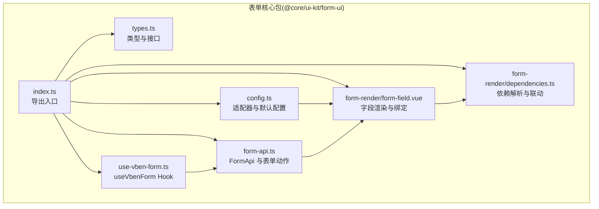
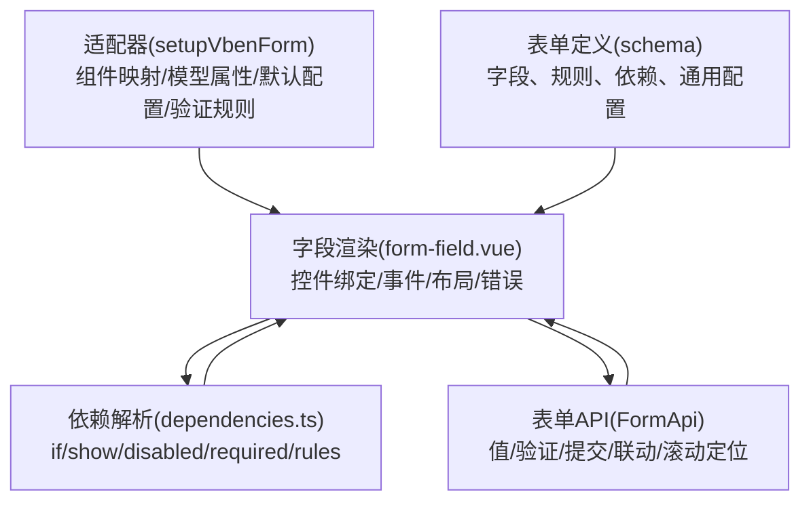
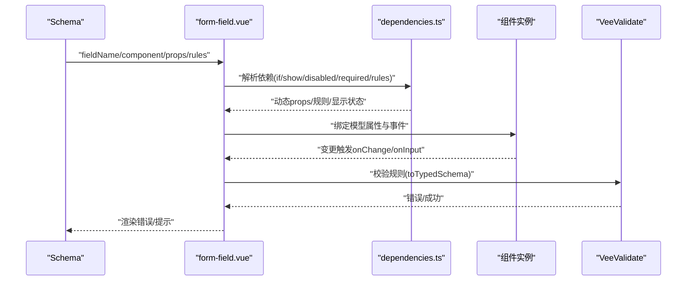
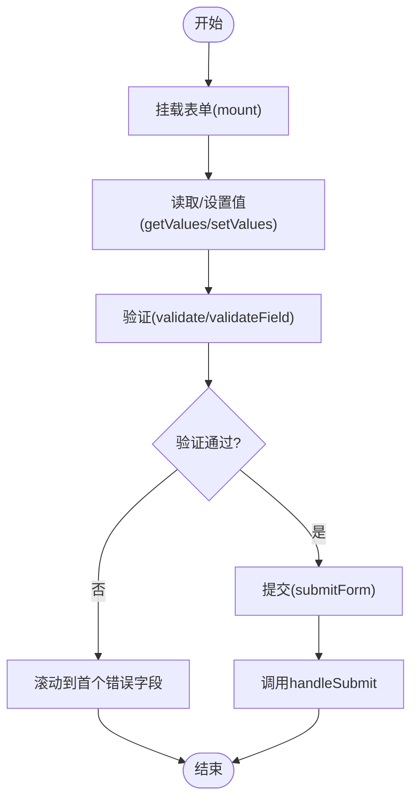
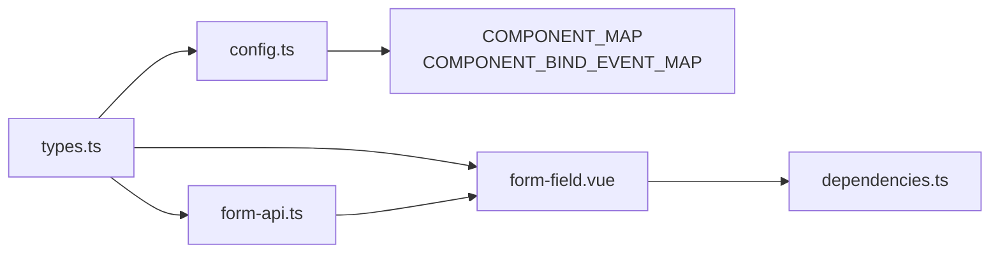

# 表单组件系统

<cite>
**本文档引用的文件**
- [packages/@core/ui-kit/form-ui/src/index.ts](file://packages/@core/ui-kit/form-ui/src/index.ts)
- [packages/@core/ui-kit/form-ui/src/types.ts](file://packages/@core/ui-kit/form-ui/src/types.ts)
- [packages/@core/ui-kit/form-ui/src/config.ts](file://packages/@core/ui-kit/form-ui/src/config.ts)
- [packages/@core/ui-kit/form-ui/src/use-vben-form.ts](file://packages/@core/ui-kit/form-ui/src/use-vben-form.ts)
- [packages/@core/ui-kit/form-ui/src/form-api.ts](file://packages/@core/ui-kit/form-ui/src/form-api.ts)
- [packages/@core/ui-kit/form-ui/src/form-render/form-field.vue](file://packages/@core/ui-kit/form-ui/src/form-render/form-field.vue)
- [packages/@core/ui-kit/form-ui/src/form-render/dependencies.ts](file://packages/@core/ui-kit/form-ui/src/form-render/dependencies.ts)
- [packages/@core/ui-kit/form-ui/__tests__/form-api.test.ts](file://packages/@core/ui-kit/form-ui/__tests__/form-api.test.ts)
- [docs/src/components/common-ui/vben-form.md](file://docs/src/components/common-ui/vben-form.md)
- [docs/src/_env/adapter/form.ts](file://docs/src/_env/adapter/form.ts)
</cite>

## 目录

1. [简介](#简介)
2. [项目结构](#项目结构)
3. [核心组件](#核心组件)
4. [架构总览](#架构总览)
5. [详细组件分析](#详细组件分析)
6. [依赖关系分析](#依赖关系分析)
7. [性能考量](#性能考量)
8. [故障排查指南](#故障排查指南)
9. [结论](#结论)
10. [附录：完整示例与最佳实践](#附录完整示例与最佳实践)

## 简介

本文件面向 Vben Admin 的表单组件系统，系统基于 Vue 3 + VeeValidate + Zod 实现，提供统一的表单适配器、字段类型映射与验证机制，支持多 UI 框架（Ant Design Vue、Naive UI、Element Plus、TDesign 等）的组件适配。文档覆盖以下主题：

- 表单架构设计与适配器机制
- 字段类型映射与验证规则
- 常见控件（输入框、选择器、日期选择器、字典选择器等）的使用方式
- 数据绑定、验证与错误处理
- 动态表单（字段动态生成、条件显示、联动逻辑）
- 表单布局、样式定制与响应式设计
- 完整示例与最佳实践

## 项目结构

表单系统主要位于 @core/ui-kit/form-ui 包中，核心文件如下：

- 入口与导出：index.ts
- 类型定义：types.ts
- 适配器与默认配置：config.ts
- 表单 Hook：use-vben-form.ts
- 表单 API：form-api.ts
- 渲染层：form-render/form-field.vue 及其依赖解析模块 dependencies.ts

图表来源

- [packages/@core/ui-kit/form-ui/src/index.ts:1-13](file://packages/@core/ui-kit/form-ui/src/index.ts#L1-L13)
- [packages/@core/ui-kit/form-ui/src/types.ts:1-465](file://packages/@core/ui-kit/form-ui/src/types.ts#L1-L465)
- [packages/@core/ui-kit/form-ui/src/config.ts:1-88](file://packages/@core/ui-kit/form-ui/src/config.ts#L1-L88)
- [packages/@core/ui-kit/form-ui/src/use-vben-form.ts:1-51](file://packages/@core/ui-kit/form-ui/src/use-vben-form.ts#L1-L51)
- [packages/@core/ui-kit/form-ui/src/form-api.ts:1-595](file://packages/@core/ui-kit/form-ui/src/form-api.ts#L1-L595)
- [packages/@core/ui-kit/form-ui/src/form-render/form-field.vue:1-404](file://packages/@core/ui-kit/form-ui/src/form-render/form-field.vue#L1-L404)
- [packages/@core/ui-kit/form-ui/src/form-render/dependencies.ts](file://packages/@core/ui-kit/form-ui/src/form-render/dependencies.ts)

章节来源

- [packages/@core/ui-kit/form-ui/src/index.ts:1-13](file://packages/@core/ui-kit/form-ui/src/index.ts#L1-L13)
- [packages/@core/ui-kit/form-ui/src/types.ts:1-465](file://packages/@core/ui-kit/form-ui/src/types.ts#L1-L465)

## 核心组件

- 表单适配器：通过 setupVbenForm 注入组件映射、模型属性名映射、默认通用配置与自定义验证规则，实现多 UI 框架的统一适配。
- 表单 Hook：useVbenForm 返回一个可复用的表单组件与 FormApi 实例，支持响应式 schema 更新与状态管理。
- 表单 API：FormApi 封装表单生命周期、值读取/设置、验证、提交、重置、联动更新等能力，并提供滚动到首个错误字段等交互增强。
- 字段渲染：form-field.vue 负责将 schema 映射为具体 UI 控件，处理必填、禁用、描述、错误提示、事件绑定与焦点管理。
- 依赖解析：dependencies.ts 解析字段依赖（if/show/disabled/required/rules/componentProps 等），支持基于其他字段值的动态联动。

章节来源

- [packages/@core/ui-kit/form-ui/src/config.ts:43-88](file://packages/@core/ui-kit/form-ui/src/config.ts#L43-L88)
- [packages/@core/ui-kit/form-ui/src/use-vben-form.ts:14-51](file://packages/@core/ui-kit/form-ui/src/use-vben-form.ts#L14-L51)
- [packages/@core/ui-kit/form-ui/src/form-api.ts:53-595](file://packages/@core/ui-kit/form-ui/src/form-api.ts#L53-L595)
- [packages/@core/ui-kit/form-ui/src/form-render/form-field.vue:1-404](file://packages/@core/ui-kit/form-ui/src/form-render/form-field.vue#L1-L404)
- [packages/@core/ui-kit/form-ui/src/form-render/dependencies.ts](file://packages/@core/ui-kit/form-ui/src/form-render/dependencies.ts)

## 架构总览

整体架构采用“适配器 + 渲染 + API”的分层设计：

- 适配器层：负责组件映射、模型属性名映射、默认配置与验证规则注册。
- 渲染层：根据 schema 动态渲染字段，绑定事件，处理必填、禁用、错误提示与布局。
- API 层：封装表单状态、联动更新、验证与提交流程，提供统一的外部 API。

图表来源

- [packages/@core/ui-kit/form-ui/src/config.ts:43-88](file://packages/@core/ui-kit/form-ui/src/config.ts#L43-L88)
- [packages/@core/ui-kit/form-ui/src/form-render/form-field.vue:1-404](file://packages/@core/ui-kit/form-ui/src/form-render/form-field.vue#L1-L404)
- [packages/@core/ui-kit/form-ui/src/form-render/dependencies.ts](file://packages/@core/ui-kit/form-ui/src/form-render/dependencies.ts)
- [packages/@core/ui-kit/form-ui/src/form-api.ts:53-595](file://packages/@core/ui-kit/form-ui/src/form-api.ts#L53-L595)

## 详细组件分析

### 表单适配器与字段类型映射

- 组件映射：COMPONENT_MAP 将组件键映射到具体组件实例；可通过全局共享状态注入自定义组件。
- 模型属性映射：COMPONENT_BIND_EVENT_MAP 将组件键映射到 v-model 的属性名（如 checked、fileList），支持 baseModelPropName 与 modelPropNameMap 的覆盖。
- 默认通用配置：DEFAULT_FORM_COMMON_CONFIG 用于设置默认禁用监听、空状态值等。
- 自定义验证规则：defineRules 注册 required、selectRequired 等规则，结合 Zod schema 实现强类型验证。

章节来源

- [packages/@core/ui-kit/form-ui/src/config.ts:27-88](file://packages/@core/ui-kit/form-ui/src/config.ts#L27-L88)
- [packages/@core/ui-kit/form-ui/src/types.ts:442-464](file://packages/@core/ui-kit/form-ui/src/types.ts#L442-L464)

### 字段渲染与数据绑定

- 字段渲染：form-field.vue 根据 schema 动态渲染组件，计算必填、禁用、标签宽度、错误提示等。
- 事件绑定：根据组件模型属性名映射，正确绑定 onUpdate 与 onChange/onInput，处理事件对象解包与空值替换。
- 错误处理：集成 VbenRenderContent、FormMessage、Tooltip 等组件展示错误信息。
- 焦点管理：支持 autofocus 与组件引用映射，便于定位与聚焦。

图表来源

- [packages/@core/ui-kit/form-ui/src/form-render/form-field.vue:165-270](file://packages/@core/ui-kit/form-ui/src/form-render/form-field.vue#L165-L270)
- [packages/@core/ui-kit/form-ui/src/form-render/dependencies.ts](file://packages/@core/ui-kit/form-ui/src/form-render/dependencies.ts)

章节来源

- [packages/@core/ui-kit/form-ui/src/form-render/form-field.vue:1-404](file://packages/@core/ui-kit/form-ui/src/form-render/form-field.vue#L1-L404)

### 表单 API 与验证流程

- 表单生命周期：mount/unmount、状态订阅、联动更新。
- 值管理：getValues/setValues、字段值设置与过滤、数组/时间范围值转换。
- 验证：validate/validateField/validateAndSubmitForm，支持滚动到首个错误字段。
- 提交：submitForm，调用 handleSubmit 回调并返回原始值。
- 联合校验：merge/submitAllForm 支持多个表单实例联合验证与合并提交。

图表来源

- [packages/@core/ui-kit/form-ui/src/form-api.ts:209-444](file://packages/@core/ui-kit/form-ui/src/form-api.ts#L209-L444)

章节来源

- [packages/@core/ui-kit/form-ui/src/form-api.ts:53-595](file://packages/@core/ui-kit/form-ui/src/form-api.ts#L53-L595)
- [packages/@core/ui-kit/form-ui/**tests**/form-api.test.ts:111-163](file://packages/@core/ui-kit/form-ui/__tests__/form-api.test.ts#L111-L163)

### 动态表单与联动逻辑

- 条件渲染：if 条件控制 DOM 删除/保留。
- 条件显示：show 控制 CSS 显示/隐藏。
- 禁用控制：disabled 控制字段禁用状态。
- 必填控制：required 动态决定是否必填。
- 规则联动：rules 支持函数返回 Zod 规则或字符串规则。
- 组件参数联动：componentProps 支持函数返回动态 props。
- 触发字段：triggerFields 指定依赖字段，trigger 指定触发时机。

章节来源

- [packages/@core/ui-kit/form-ui/src/types.ts:92-130](file://packages/@core/ui-kit/form-ui/src/types.ts#L92-L130)
- [packages/@core/ui-kit/form-ui/src/form-render/dependencies.ts](file://packages/@core/ui-kit/form-ui/src/form-render/dependencies.ts)

### 常见控件与使用要点

- 输入框：VbenInput/VbenInputPassword/VbenPinInput，支持 placeholder、禁用、必填、描述等。
- 选择器：VbenSelect，支持 options、多选、清空、必填等。
- 复选框/开关：VbenCheckbox，需使用 checked 模型属性映射。
- 上传：Upload，需使用 fileList 模型属性映射。
- 日期选择器：通过 schema 指定组件与规则，支持时间范围映射与格式化。
- 字典选择器：通过 options 或远程数据源提供字典项，结合规则与联动实现动态筛选。

章节来源

- [packages/@core/ui-kit/form-ui/src/config.ts:27-42](file://packages/@core/ui-kit/form-ui/src/config.ts#L27-L42)
- [packages/@core/ui-kit/form-ui/src/types.ts:13-22](file://packages/@core/ui-kit/form-ui/src/types.ts#L13-L22)

## 依赖关系分析

- 组件耦合：适配器与渲染层通过 COMPONENT_MAP 与 COMPONENT_BIND_EVENT_MAP 解耦；渲染层与 API 层通过 FormContext 与 FormApi 解耦。
- 外部依赖：VeeValidate（验证）、Zod（类型化规则）、Shadcn UI（基础控件与布局）。
- 可能的循环依赖：无直接循环依赖；若自定义组件通过全局状态注入，需避免在适配器初始化前访问未注册组件。

图表来源

- [packages/@core/ui-kit/form-ui/src/config.ts:1-88](file://packages/@core/ui-kit/form-ui/src/config.ts#L1-L88)
- [packages/@core/ui-kit/form-ui/src/types.ts:1-465](file://packages/@core/ui-kit/form-ui/src/types.ts#L1-L465)
- [packages/@core/ui-kit/form-ui/src/form-api.ts:1-595](file://packages/@core/ui-kit/form-ui/src/form-api.ts#L1-L595)
- [packages/@core/ui-kit/form-ui/src/form-render/form-field.vue:1-404](file://packages/@core/ui-kit/form-ui/src/form-render/form-field.vue#L1-L404)
- [packages/@core/ui-kit/form-ui/src/form-render/dependencies.ts](file://packages/@core/ui-kit/form-ui/src/form-render/dependencies.ts)

章节来源

- [packages/@core/ui-kit/form-ui/src/types.ts:1-465](file://packages/@core/ui-kit/form-ui/src/types.ts#L1-L465)

## 性能考量

- 渲染优化：字段按需渲染（if/show），减少不必要的 DOM 创建与事件绑定。
- 事件监听：默认禁用 onChange/onInput 监听以降低开销，可通过配置开启。
- 值合并策略：setValues 使用自定义合并算法，避免深度合并复杂对象（如 dayjs、Date），提升性能。
- 联动更新：仅在触发字段变化时重新计算依赖，避免全量重算。
- 验证策略：支持按字段验证与批量验证，结合滚动定位减少用户等待。

## 故障排查指南

- 组件未注册：渲染层会警告组件未注册，检查 COMPONENT_MAP 中是否已映射。
- 未挂载错误：FormApi 在未挂载时访问表单上下文会抛错，确认已通过 useVbenForm 定义的组件挂载。
- 验证失败滚动：启用 scrollToFirstError 后，若无法定位元素，检查 name 属性与组件引用映射。
- 空值重置：不同 UI 框架空值不同（如 Naive UI 为空 null），需在适配器中设置 emptyStateValue。
- schema 更新：更新 schema 时 fieldName 必须存在，否则会记录错误日志。

章节来源

- [packages/@core/ui-kit/form-ui/src/form-render/form-field.vue:74-83](file://packages/@core/ui-kit/form-ui/src/form-render/form-field.vue#L74-L83)
- [packages/@core/ui-kit/form-ui/src/form-api.ts:405-444](file://packages/@core/ui-kit/form-ui/src/form-api.ts#L405-L444)
- [packages/@core/ui-kit/form-ui/src/form-api.ts:371-403](file://packages/@core/ui-kit/form-ui/src/form-api.ts#L371-L403)

## 结论

Vben Admin 的表单系统通过“适配器 + 渲染 + API”的分层设计，实现了跨 UI 框架的统一表单体验。借助 VeeValidate 与 Zod，系统提供了强类型、可扩展的验证体系；通过依赖解析与联动机制，满足复杂业务场景下的动态表单需求。配合完善的 API 与错误处理，开发者可快速构建高质量、可维护的复杂表单界面。

## 附录：完整示例与最佳实践

- 示例参考路径（不直接展示代码内容）：
  - Ant Design Vue 适配器示例：[docs/src/components/common-ui/vben-form.md:25-80](file://docs/src/components/common-ui/vben-form.md#L25-L80)
  - Naive UI 适配器示例：[docs/src/\_env/adapter/form.ts:15-41](file://docs/src/_env/adapter/form.ts#L15-L41)
- 最佳实践建议：
  - 使用 useVbenForm 返回的 Form 与 API，集中管理 schema、验证与提交。
  - 通过 dependencies 实现条件显示与联动，避免在组件内部做过多分支判断。
  - 为复杂字段（日期、字典、上传）提供统一的组件映射与模型属性名配置。
  - 合理设置 commonConfig 与 wrapperClass，保证表单布局与响应式效果。
  - 启用 scrollToFirstError 提升用户体验，结合 compact 模式优化移动端展示。

章节来源

- [docs/src/components/common-ui/vben-form.md:25-80](file://docs/src/components/common-ui/vben-form.md#L25-L80)
- [docs/src/\_env/adapter/form.ts:15-41](file://docs/src/_env/adapter/form.ts#L15-L41)
