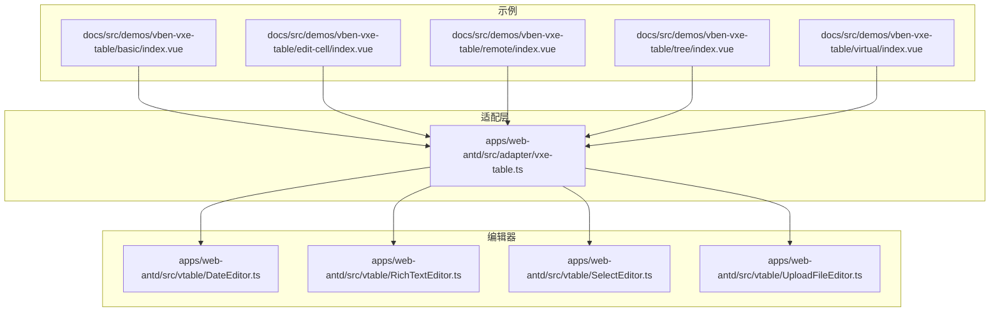
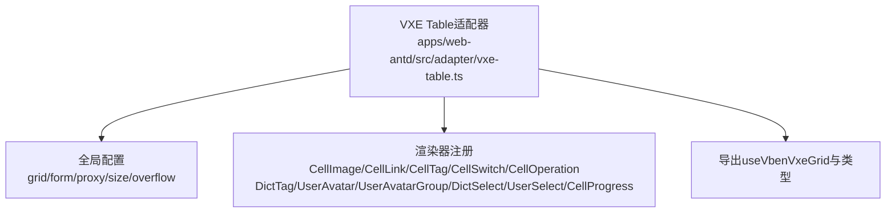
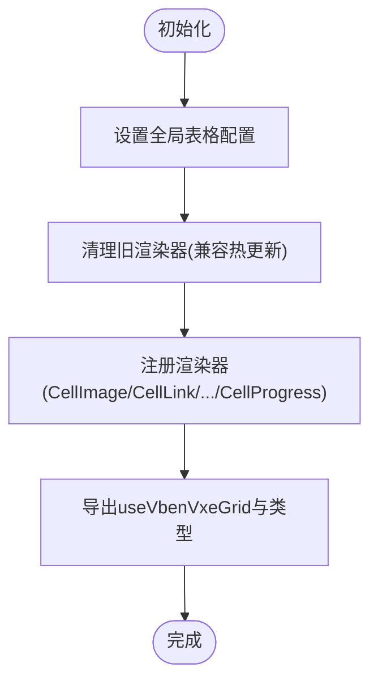
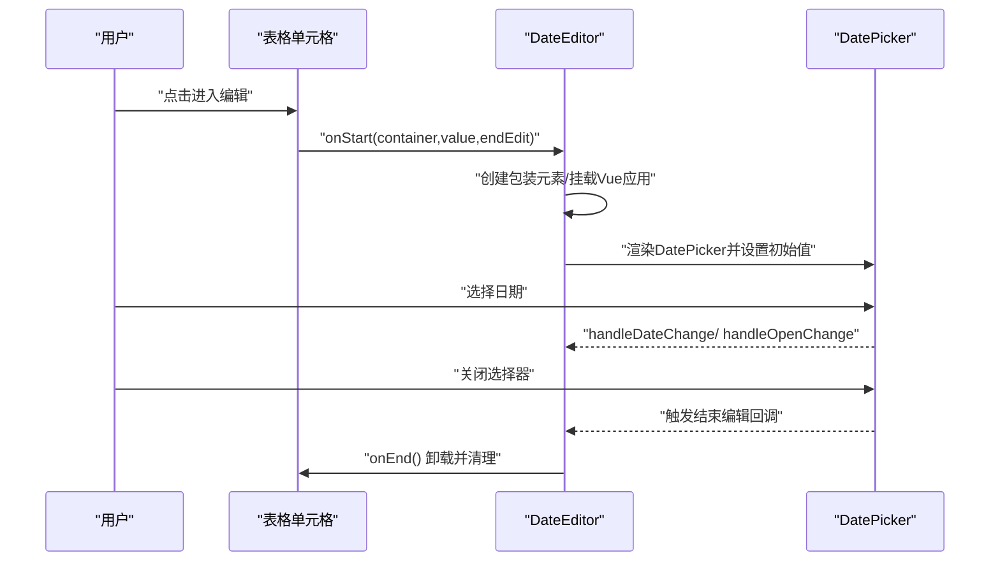
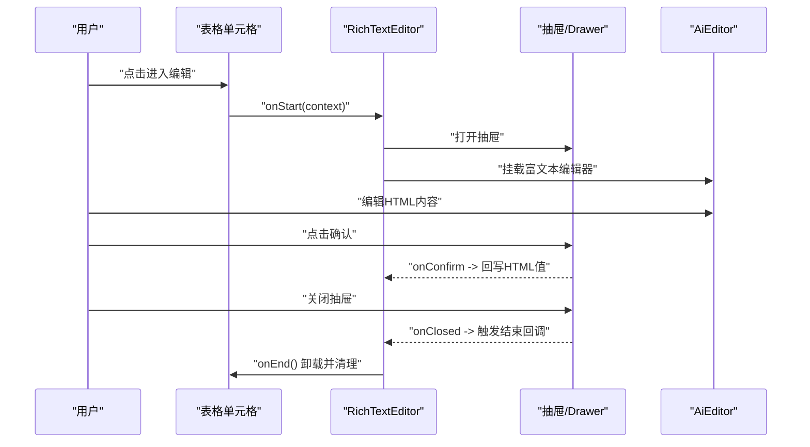
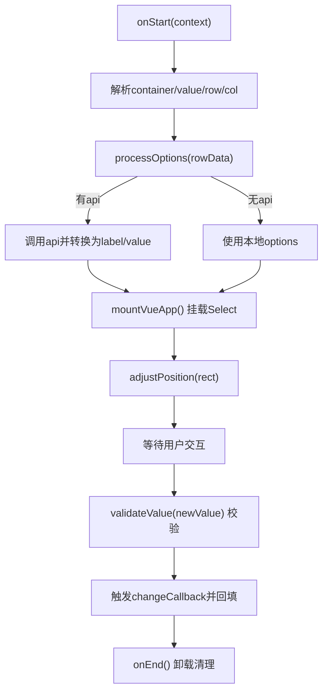
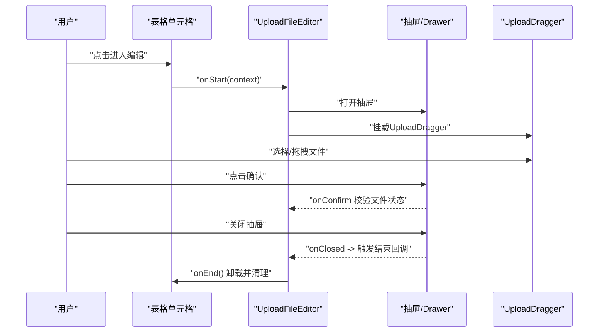
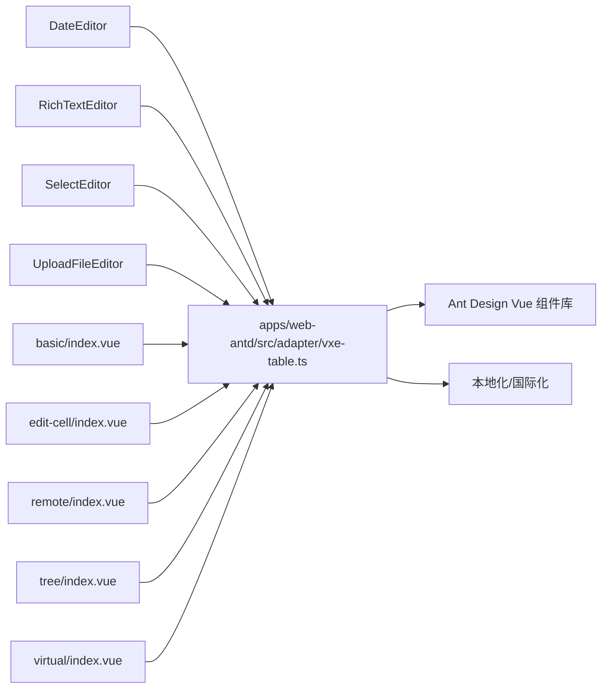

# 表格组件系统

<cite>
**本文引用的文件**
- [apps/web-antd/src/adapter/vxe-table.ts](file://apps/web-antd/src/adapter/vxe-table.ts)
- [apps/web-antd/src/vtable/DateEditor.ts](file://apps/web-antd/src/vtable/DateEditor.ts)
- [apps/web-antd/src/vtable/RichTextEditor.ts](file://apps/web-antd/src/vtable/RichTextEditor.ts)
- [apps/web-antd/src/vtable/SelectEditor.ts](file://apps/web-antd/src/vtable/SelectEditor.ts)
- [apps/web-antd/src/vtable/UploadFileEditor.ts](file://apps/web-antd/src/vtable/UploadFileEditor.ts)
- [docs/src/demos/vben-vxe-table/basic/index.vue](file://docs/src/demos/vben-vxe-table/basic/index.vue)
- [docs/src/demos/vben-vxe-table/edit-cell/index.vue](file://docs/src/demos/vben-vxe-table/edit-cell/index.vue)
- [docs/src/demos/vben-vxe-table/remote/index.vue](file://docs/src/demos/vben-vxe-table/remote/index.vue)
- [docs/src/demos/vben-vxe-table/tree/index.vue](file://docs/src/demos/vben-vxe-table/tree/index.vue)
- [docs/src/demos/vben-vxe-table/virtual/index.vue](file://docs/src/demos/vben-vxe-table/virtual/index.vue)
- [docs/src/demos/vben-vxe-table/mock-api.ts](file://docs/src/demos/vben-vxe-table/mock-api.ts)
- [docs/src/demos/vben-vxe-table/table-data.ts](file://docs/src/demos/vben-vxe-table/table-data.ts)
</cite>

## 目录

1. [简介](#简介)
2. [项目结构](#项目结构)
3. [核心组件](#核心组件)
4. [架构总览](#架构总览)
5. [详细组件分析](#详细组件分析)
6. [依赖关系分析](#依赖关系分析)
7. [性能考量](#性能考量)
8. [故障排查指南](#故障排查指南)
9. [结论](#结论)
10. [附录](#附录)

## 简介

本文件面向Vben Admin的表格组件系统，聚焦于VXE Table适配器的实现与使用、内置编辑器体系（日期、富文本、选择器、文件上传）、高级功能（虚拟滚动、树形表格、固定列与列宽调整）、数据源适配与远程分页、以及性能优化策略与大数据量处理方案。文档同时提供可直接参考的示例路径，帮助开发者快速构建高性能表格界面。

## 项目结构

围绕表格系统的相关目录与文件分布如下：

- 适配层：各UI框架下的VXE Table适配入口与全局配置
- 编辑器：基于VTable IEditor接口实现的自定义编辑器
- 示例：基础、单元格编辑、远程分页、树形、虚拟滚动等演示

图表来源

- [apps/web-antd/src/adapter/vxe-table.ts:1-119](file://apps/web-antd/src/adapter/vxe-table.ts#L1-L119)
- [apps/web-antd/src/vtable/DateEditor.ts:1-215](file://apps/web-antd/src/vtable/DateEditor.ts#L1-L215)
- [apps/web-antd/src/vtable/RichTextEditor.ts:1-265](file://apps/web-antd/src/vtable/RichTextEditor.ts#L1-L265)
- [apps/web-antd/src/vtable/SelectEditor.ts:1-381](file://apps/web-antd/src/vtable/SelectEditor.ts#L1-L381)
- [apps/web-antd/src/vtable/UploadFileEditor.ts:1-338](file://apps/web-antd/src/vtable/UploadFileEditor.ts#L1-L338)
- [docs/src/demos/vben-vxe-table/basic/index.vue:1-86](file://docs/src/demos/vben-vxe-table/basic/index.vue#L1-L86)
- [docs/src/demos/vben-vxe-table/edit-cell/index.vue:1-56](file://docs/src/demos/vben-vxe-table/edit-cell/index.vue#L1-L56)
- [docs/src/demos/vben-vxe-table/remote/index.vue:1-113](file://docs/src/demos/vben-vxe-table/remote/index.vue#L1-L113)
- [docs/src/demos/vben-vxe-table/tree/index.vue:1-81](file://docs/src/demos/vben-vxe-table/tree/index.vue#L1-L81)
- [docs/src/demos/vben-vxe-table/virtual/index.vue:1-65](file://docs/src/demos/vben-vxe-table/virtual/index.vue#L1-L65)

章节来源

- [apps/web-antd/src/adapter/vxe-table.ts:1-119](file://apps/web-antd/src/adapter/vxe-table.ts#L1-L119)
- [apps/web-antd/src/vtable/DateEditor.ts:1-215](file://apps/web-antd/src/vtable/DateEditor.ts#L1-L215)
- [apps/web-antd/src/vtable/RichTextEditor.ts:1-265](file://apps/web-antd/src/vtable/RichTextEditor.ts#L1-L265)
- [apps/web-antd/src/vtable/SelectEditor.ts:1-381](file://apps/web-antd/src/vtable/SelectEditor.ts#L1-L381)
- [apps/web-antd/src/vtable/UploadFileEditor.ts:1-338](file://apps/web-antd/src/vtable/UploadFileEditor.ts#L1-L338)
- [docs/src/demos/vben-vxe-table/basic/index.vue:1-86](file://docs/src/demos/vben-vxe-table/basic/index.vue#L1-L86)
- [docs/src/demos/vben-vxe-table/edit-cell/index.vue:1-56](file://docs/src/demos/vben-vxe-table/edit-cell/index.vue#L1-L56)
- [docs/src/demos/vben-vxe-table/remote/index.vue:1-113](file://docs/src/demos/vben-vxe-table/remote/index.vue#L1-L113)
- [docs/src/demos/vben-vxe-table/tree/index.vue:1-81](file://docs/src/demos/vben-vxe-table/tree/index.vue#L1-L81)
- [docs/src/demos/vben-vxe-table/virtual/index.vue:1-65](file://docs/src/demos/vben-vxe-table/virtual/index.vue#L1-L65)

## 核心组件

- VXE Table适配器：统一注册渲染器、全局配置、导出类型与工具函数，屏蔽UI框架差异
- 内置编辑器：日期、富文本、选择器、文件上传，均实现IEditor接口，支持在单元格内直接编辑
- 示例模块：覆盖基础表格、单元格编辑、远程分页、树形表格、虚拟滚动等典型场景

章节来源

- [apps/web-antd/src/adapter/vxe-table.ts:34-104](file://apps/web-antd/src/adapter/vxe-table.ts#L34-L104)
- [apps/web-antd/src/vtable/DateEditor.ts:19-215](file://apps/web-antd/src/vtable/DateEditor.ts#L19-L215)
- [apps/web-antd/src/vtable/RichTextEditor.ts:27-265](file://apps/web-antd/src/vtable/RichTextEditor.ts#L27-L265)
- [apps/web-antd/src/vtable/SelectEditor.ts:34-381](file://apps/web-antd/src/vtable/SelectEditor.ts#L34-L381)
- [apps/web-antd/src/vtable/UploadFileEditor.ts:36-338](file://apps/web-antd/src/vtable/UploadFileEditor.ts#L36-L338)

## 架构总览

VXE Table适配器负责：

- 全局表格配置（网格、代理、尺寸、溢出等）
- 渲染器注册（单元格组件、操作按钮、字典标签/选择、头像等）
- 导出useVbenVxeGrid与类型，供业务侧直接使用

图表来源

- [apps/web-antd/src/adapter/vxe-table.ts:34-104](file://apps/web-antd/src/adapter/vxe-table.ts#L34-L104)

章节来源

- [apps/web-antd/src/adapter/vxe-table.ts:34-104](file://apps/web-antd/src/adapter/vxe-table.ts#L34-L104)

## 详细组件分析

### VXE Table适配器

- 全局配置要点
  - 网格对齐、圆角、边框、最小高度、列宽可调
  - 表单配置禁用（使用自定义表单）
  - 代理配置启用自动加载、响应字段映射、消息提示
  - 渲染器注册与热更新兼容处理
- 渲染器注册清单
  - 单元格组件：图片、链接、标签、开关、进度条
  - 操作类：操作按钮
  - 字典与用户：字典标签/选择、用户头像/头像组
- 导出能力
  - useVbenVxeGrid：封装VXE Grid，提供store与API
  - 类型导出：与VXE Table生态保持一致

图表来源

- [apps/web-antd/src/adapter/vxe-table.ts:34-104](file://apps/web-antd/src/adapter/vxe-table.ts#L34-L104)

章节来源

- [apps/web-antd/src/adapter/vxe-table.ts:34-104](file://apps/web-antd/src/adapter/vxe-table.ts#L34-L104)

### 日期编辑器（DateEditor）

- 设计要点
  - 实现IEditor接口，生命周期：onStart/onEnd/adjustPosition/getValue/validateValue
  - 基于Ant Design Vue DatePicker，支持时间选择、本地化、弹窗容器定位
  - 通过Vue应用挂载与卸载，确保内存释放
- 关键流程
  - onStart：创建包装元素、挂载DatePicker、设置初始值与回调
  - onEnd：卸载Vue应用、移除DOM、清理引用
  - validateValue：校验日期合法性

图表来源

- [apps/web-antd/src/vtable/DateEditor.ts:116-197](file://apps/web-antd/src/vtable/DateEditor.ts#L116-L197)
- [apps/web-antd/src/vtable/DateEditor.ts:90-110](file://apps/web-antd/src/vtable/DateEditor.ts#L90-L110)
- [apps/web-antd/src/vtable/DateEditor.ts:202-213](file://apps/web-antd/src/vtable/DateEditor.ts#L202-L213)

章节来源

- [apps/web-antd/src/vtable/DateEditor.ts:19-215](file://apps/web-antd/src/vtable/DateEditor.ts#L19-L215)

### 富文本编辑器（RichTextEditor）

- 设计要点
  - 基于抽屉弹窗承载AiEditor，通过useVbenDrawer控制确认/关闭
  - onStart收集行数据与字段名，onEnd回传HTML值
  - 位置调整与包装元素管理，确保与单元格尺寸一致
- 关键流程
  - onStart：解析上下文、创建包装元素、挂载AiEditor抽屉
  - onEnd：清理资源、移除DOM、触发成功回调

图表来源

- [apps/web-antd/src/vtable/RichTextEditor.ts:123-144](file://apps/web-antd/src/vtable/RichTextEditor.ts#L123-L144)
- [apps/web-antd/src/vtable/RichTextEditor.ts:104-115](file://apps/web-antd/src/vtable/RichTextEditor.ts#L104-L115)
- [apps/web-antd/src/vtable/RichTextEditor.ts:205-216](file://apps/web-antd/src/vtable/RichTextEditor.ts#L205-L216)

章节来源

- [apps/web-antd/src/vtable/RichTextEditor.ts:27-265](file://apps/web-antd/src/vtable/RichTextEditor.ts#L27-L265)

### 选择器编辑器（SelectEditor）

- 设计要点
  - 支持静态选项与动态API两种数据源；可配置label/value/result字段
  - 通过Ant Design Vue Select实现搜索、清空、默认展开
  - 生命周期管理与位置调整，保证下拉菜单容器正确
- 关键流程
  - onStart：解析上下文、处理选项数据、挂载Select
  - validateValue：根据label字段校验输入有效性，触发change回调

图表来源

- [apps/web-antd/src/vtable/SelectEditor.ts:141-170](file://apps/web-antd/src/vtable/SelectEditor.ts#L141-L170)
- [apps/web-antd/src/vtable/SelectEditor.ts:176-196](file://apps/web-antd/src/vtable/SelectEditor.ts#L176-L196)
- [apps/web-antd/src/vtable/SelectEditor.ts:222-253](file://apps/web-antd/src/vtable/SelectEditor.ts#L222-L253)
- [apps/web-antd/src/vtable/SelectEditor.ts:267-273](file://apps/web-antd/src/vtable/SelectEditor.ts#L267-L273)

章节来源

- [apps/web-antd/src/vtable/SelectEditor.ts:34-381](file://apps/web-antd/src/vtable/SelectEditor.ts#L34-L381)

### 文件上传编辑器（UploadFileEditor）

- 设计要点
  - 基于Ant Design Vue UploadDragger，支持多文件、限制数量与大小
  - 通过抽屉承载上传界面，确认时校验所有文件上传状态
  - 值转换：URL字符串与文件列表互转
- 关键流程
  - onStart：解析上下文、初始化fileList、挂载UploadDragger
  - validateValue：校验URL前缀
  - onEnd：卸载清理

图表来源

- [apps/web-antd/src/vtable/UploadFileEditor.ts:132-155](file://apps/web-antd/src/vtable/UploadFileEditor.ts#L132-L155)
- [apps/web-antd/src/vtable/UploadFileEditor.ts:161-181](file://apps/web-antd/src/vtable/UploadFileEditor.ts#L161-L181)
- [apps/web-antd/src/vtable/UploadFileEditor.ts:195-201](file://apps/web-antd/src/vtable/UploadFileEditor.ts#L195-L201)

章节来源

- [apps/web-antd/src/vtable/UploadFileEditor.ts:36-338](file://apps/web-antd/src/vtable/UploadFileEditor.ts#L36-L338)

### 高级功能与配置

#### 虚拟滚动

- 特性：scrollY开启、gt阈值、height: 'auto'
- 场景：大数据量渲染，仅渲染可视区域
- 示例路径：[docs/src/demos/vben-vxe-table/virtual/index.vue](file://docs/src/demos/vben-vxe-table/virtual/index.vue)

章节来源

- [docs/src/demos/vben-vxe-table/virtual/index.vue:15-32](file://docs/src/demos/vben-vxe-table/virtual/index.vue#L15-L32)

#### 树形表格

- 特性：treeConfig配置parentField/rowField/transform
- 场景：层级数据展示与展开/折叠
- 示例路径：[docs/src/demos/vben-vxe-table/tree/index.vue](file://docs/src/demos/vben-vxe-table/tree/index.vue)

章节来源

- [docs/src/demos/vben-vxe-table/tree/index.vue:39-56](file://docs/src/demos/vben-vxe-table/tree/index.vue#L39-L56)

#### 固定列与列宽调整

- 特性：列配置支持fixed、min/max-width、resizable
- 场景：固定关键列、拖拽调整列宽
- 适配器已启用resizable，业务侧可在列定义中精细控制

章节来源

- [apps/web-antd/src/adapter/vxe-table.ts:42-42](file://apps/web-antd/src/adapter/vxe-table.ts#L42-L42)

#### 远程加载与分页

- 特性：proxyConfig.ajax.query按页请求；mock-api模拟分页
- 场景：服务端分页、导出、刷新
- 示例路径：
  - [docs/src/demos/vben-vxe-table/remote/index.vue](file://docs/src/demos/vben-vxe-table/remote/index.vue)
  - [docs/src/demos/vben-vxe-table/mock-api.ts](file://docs/src/demos/vben-vxe-table/mock-api.ts)

章节来源

- [docs/src/demos/vben-vxe-table/remote/index.vue:58-92](file://docs/src/demos/vben-vxe-table/remote/index.vue#L58-L92)
- [docs/src/demos/vben-vxe-table/mock-api.ts:1-200](file://docs/src/demos/vben-vxe-table/mock-api.ts#L1-L200)

#### 基础表格与事件

- 特性：columns定义、data绑定、pagerConfig关闭、sortConfig多列排序
- 场景：快速搭建表格、点击事件、动态切换样式
- 示例路径：[docs/src/demos/vben-vxe-table/basic/index.vue](file://docs/src/demos/vben-vxe-table/basic/index.vue)

章节来源

- [docs/src/demos/vben-vxe-table/basic/index.vue:19-43](file://docs/src/demos/vben-vxe-table/basic/index.vue#L19-L43)

#### 单元格编辑

- 特性：editConfig.mode='cell'、trigger='click'、列级editRender
- 场景：点击即编辑、服务端分页联动
- 示例路径：[docs/src/demos/vben-vxe-table/edit-cell/index.vue](file://docs/src/demos/vben-vxe-table/edit-cell/index.vue)

章节来源

- [docs/src/demos/vben-vxe-table/edit-cell/index.vue:17-46](file://docs/src/demos/vben-vxe-table/edit-cell/index.vue#L17-L46)

## 依赖关系分析

- 适配器依赖UI框架组件（Ant Design Vue）与国际化、本地化资源
- 编辑器依赖适配器提供的useVbenForm、useVbenDrawer等工具
- 示例依赖适配器导出的useVbenVxeGrid与类型

图表来源

- [apps/web-antd/src/adapter/vxe-table.ts:10-32](file://apps/web-antd/src/adapter/vxe-table.ts#L10-L32)
- [apps/web-antd/src/vtable/DateEditor.ts:13-15](file://apps/web-antd/src/vtable/DateEditor.ts#L13-L15)
- [apps/web-antd/src/vtable/RichTextEditor.ts:13-15](file://apps/web-antd/src/vtable/RichTextEditor.ts#L13-L15)
- [apps/web-antd/src/vtable/SelectEditor.ts:13-13](file://apps/web-antd/src/vtable/SelectEditor.ts#L13-L13)
- [apps/web-antd/src/vtable/UploadFileEditor.ts:14-23](file://apps/web-antd/src/vtable/UploadFileEditor.ts#L14-L23)
- [docs/src/demos/vben-vxe-table/basic/index.vue:6-6](file://docs/src/demos/vben-vxe-table/basic/index.vue#L6-L6)
- [docs/src/demos/vben-vxe-table/edit-cell/index.vue:4-4](file://docs/src/demos/vben-vxe-table/edit-cell/index.vue#L4-L4)
- [docs/src/demos/vben-vxe-table/remote/index.vue:8-8](file://docs/src/demos/vben-vxe-table/remote/index.vue#L8-L8)
- [docs/src/demos/vben-vxe-table/tree/index.vue:6-6](file://docs/src/demos/vben-vxe-table/tree/index.vue#L6-L6)
- [docs/src/demos/vben-vxe-table/virtual/index.vue:6-6](file://docs/src/demos/vben-vxe-table/virtual/index.vue#L6-L6)

章节来源

- [apps/web-antd/src/adapter/vxe-table.ts:10-32](file://apps/web-antd/src/adapter/vxe-table.ts#L10-L32)
- [apps/web-antd/src/vtable/DateEditor.ts:13-15](file://apps/web-antd/src/vtable/DateEditor.ts#L13-L15)
- [apps/web-antd/src/vtable/RichTextEditor.ts:13-15](file://apps/web-antd/src/vtable/RichTextEditor.ts#L13-L15)
- [apps/web-antd/src/vtable/SelectEditor.ts:13-13](file://apps/web-antd/src/vtable/SelectEditor.ts#L13-L13)
- [apps/web-antd/src/vtable/UploadFileEditor.ts:14-23](file://apps/web-antd/src/vtable/UploadFileEditor.ts#L14-L23)
- [docs/src/demos/vben-vxe-table/basic/index.vue:6-6](file://docs/src/demos/vben-vxe-table/basic/index.vue#L6-L6)
- [docs/src/demos/vben-vxe-table/edit-cell/index.vue:4-4](file://docs/src/demos/vben-vxe-table/edit-cell/index.vue#L4-L4)
- [docs/src/demos/vben-vxe-table/remote/index.vue:8-8](file://docs/src/demos/vben-vxe-table/remote/index.vue#L8-L8)
- [docs/src/demos/vben-vxe-table/tree/index.vue:6-6](file://docs/src/demos/vben-vxe-table/tree/index.vue#L6-L6)
- [docs/src/demos/vben-vxe-table/virtual/index.vue:6-6](file://docs/src/demos/vben-vxe-table/virtual/index.vue#L6-L6)

## 性能考量

- 虚拟滚动
  - 启用scrollY与合适的gt阈值，避免全量渲染
  - 示例：[docs/src/demos/vben-vxe-table/virtual/index.vue](file://docs/src/demos/vben-vxe-table/virtual/index.vue)
- 列宽与溢出
  - 合理设置minWidth与resizable，减少重排
  - 启用showOverflow避免长文本导致布局抖动
- 渲染器复用
  - 通过适配器集中注册渲染器，避免重复创建
- 编辑器生命周期
  - onStart/onEnd成对出现，确保卸载与DOM移除，防止内存泄漏
- 远程分页
  - 仅请求当前页数据，结合缓存与防抖提升交互体验
- 大数据量处理
  - 分页优先；若需全量展示，建议结合虚拟滚动与懒加载

[本节为通用指导，不直接分析具体文件]

## 故障排查指南

- 编辑器无法关闭/内存未释放
  - 检查onEnd是否被调用，确认app.unmount与DOM移除
  - 参考：[apps/web-antd/src/vtable/DateEditor.ts:90-110](file://apps/web-antd/src/vtable/DateEditor.ts#L90-L110)、[apps/web-antd/src/vtable/SelectEditor.ts:124-133](file://apps/web-antd/src/vtable/SelectEditor.ts#L124-L133)
- 日期校验失败
  - validateValue会拒绝非法日期，检查输入格式与本地化
  - 参考：[apps/web-antd/src/vtable/DateEditor.ts:202-213](file://apps/web-antd/src/vtable/DateEditor.ts#L202-L213)
- 上传文件状态异常
  - 确认所有文件均为done状态再允许确认
  - 参考：[apps/web-antd/src/vtable/UploadFileEditor.ts:232-247](file://apps/web-antd/src/vtable/UploadFileEditor.ts#L232-L247)
- 树形表格展开/折叠无效
  - 检查treeConfig配置与parentId/id字段一致性
  - 参考：[docs/src/demos/vben-vxe-table/tree/index.vue:51-55](file://docs/src/demos/vben-vxe-table/tree/index.vue#L51-L55)
- 远程分页数据不更新
  - 确认proxyConfig.ajax.query返回正确的items与total
  - 参考：[docs/src/demos/vben-vxe-table/remote/index.vue:75-83](file://docs/src/demos/vben-vxe-table/remote/index.vue#L75-L83)

章节来源

- [apps/web-antd/src/vtable/DateEditor.ts:90-110](file://apps/web-antd/src/vtable/DateEditor.ts#L90-L110)
- [apps/web-antd/src/vtable/DateEditor.ts:202-213](file://apps/web-antd/src/vtable/DateEditor.ts#L202-L213)
- [apps/web-antd/src/vtable/SelectEditor.ts:124-133](file://apps/web-antd/src/vtable/SelectEditor.ts#L124-L133)
- [apps/web-antd/src/vtable/UploadFileEditor.ts:232-247](file://apps/web-antd/src/vtable/UploadFileEditor.ts#L232-L247)
- [docs/src/demos/vben-vxe-table/tree/index.vue:51-55](file://docs/src/demos/vben-vxe-table/tree/index.vue#L51-L55)
- [docs/src/demos/vben-vxe-table/remote/index.vue:75-83](file://docs/src/demos/vben-vxe-table/remote/index.vue#L75-L83)

## 结论

Vben Admin的表格组件系统通过适配器统一对接VXE Table，并提供丰富的渲染器与自定义编辑器，覆盖日期、富文本、选择器、文件上传等常用编辑场景。配合虚拟滚动、树形表格、远程分页与列宽调整等高级特性，能够满足复杂业务对高性能表格的需求。建议在实际项目中遵循生命周期管理、合理配置代理与渲染器、结合示例路径快速落地。

[本节为总结性内容，不直接分析具体文件]

## 附录

- 示例清单与对应路径
  - 基础表格：[docs/src/demos/vben-vxe-table/basic/index.vue](file://docs/src/demos/vben-vxe-table/basic/index.vue)
  - 单元格编辑：[docs/src/demos/vben-vxe-table/edit-cell/index.vue](file://docs/src/demos/vben-vxe-table/edit-cell/index.vue)
  - 远程分页：[docs/src/demos/vben-vxe-table/remote/index.vue](file://docs/src/demos/vben-vxe-table/remote/index.vue)
  - 树形表格：[docs/src/demos/vben-vxe-table/tree/index.vue](file://docs/src/demos/vben-vxe-table/tree/index.vue)
  - 虚拟滚动：[docs/src/demos/vben-vxe-table/virtual/index.vue](file://docs/src/demos/vben-vxe-table/virtual/index.vue)
- 数据与API
  - Mock数据：[docs/src/demos/vben-vxe-table/table-data.ts](file://docs/src/demos/vben-vxe-table/table-data.ts)
  - Mock API：[docs/src/demos/vben-vxe-table/mock-api.ts](file://docs/src/demos/vben-vxe-table/mock-api.ts)
