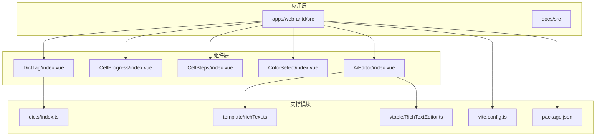
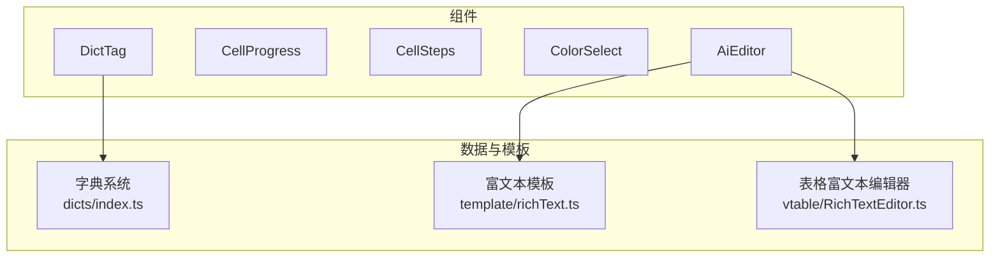
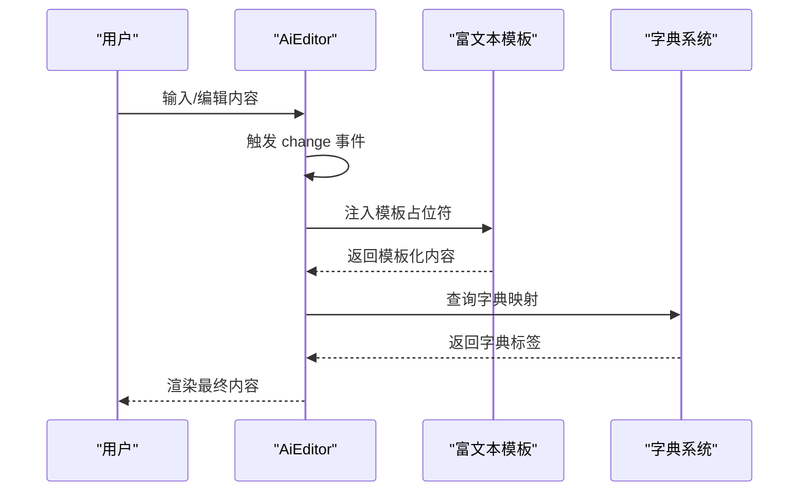
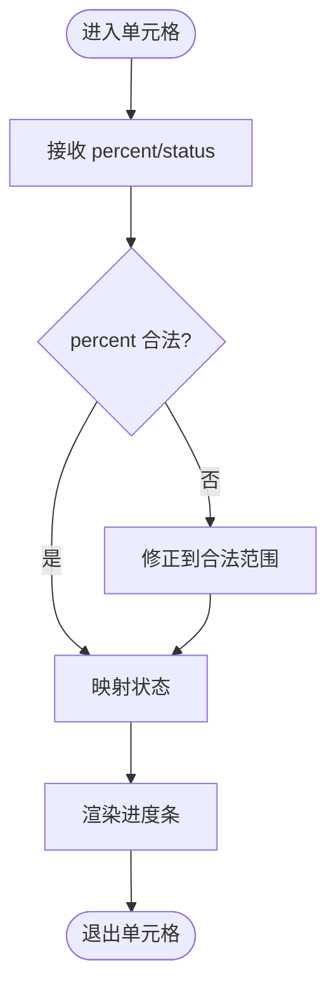
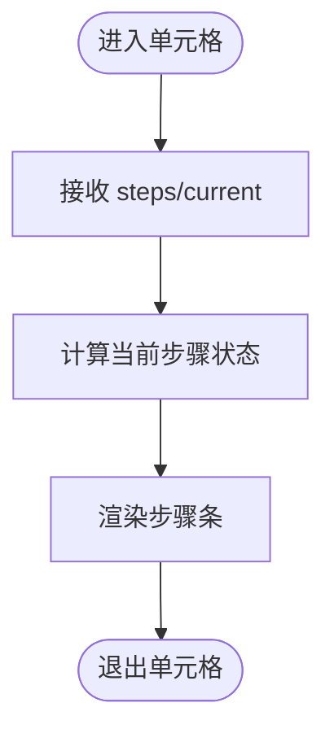
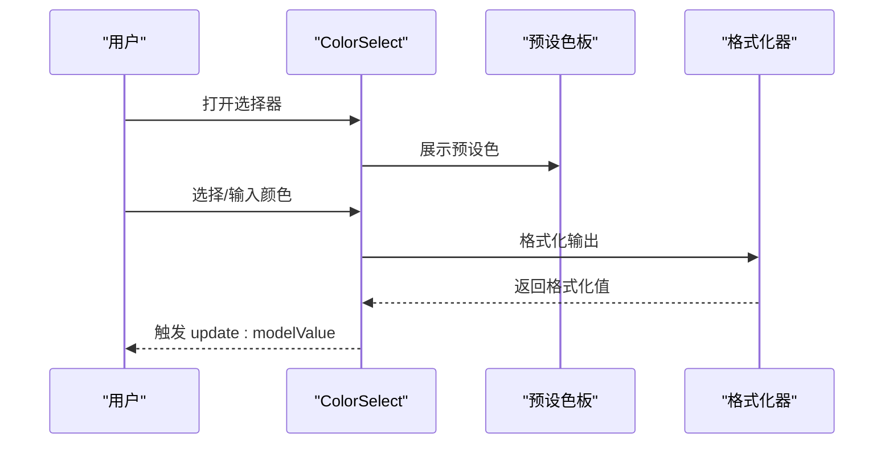
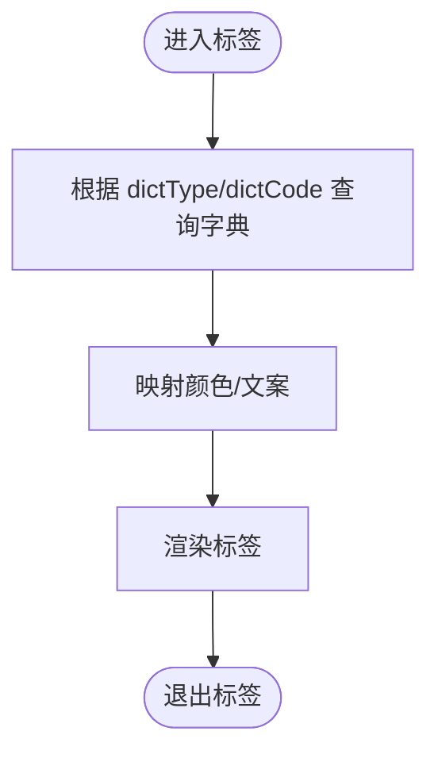
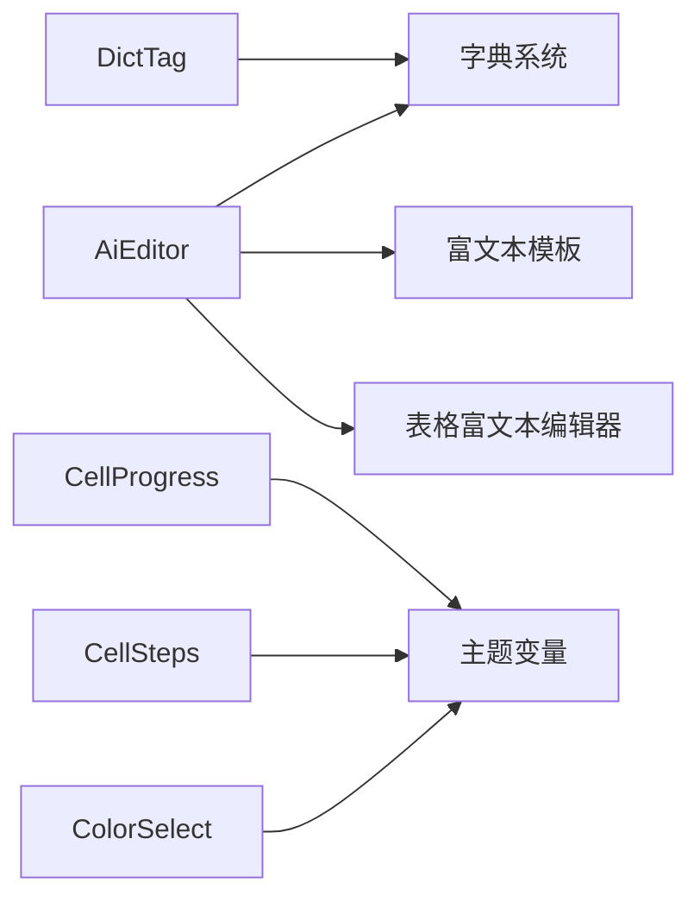

# 通用UI组件

<cite>
**本文引用的文件**
- [AiEditor/index.vue](file://apps/web-antd/src/components/AiEditor/index.vue)
- [CellProgress/index.vue](file://apps/web-antd/src/components/CellProgress/index.vue)
- [CellSteps/index.vue](file://apps/web-antd/src/components/CellSteps/index.vue)
- [ColorSelect/index.vue](file://apps/web-antd/src/components/ColorSelect/index.vue)
- [DictTag/index.vue](file://apps/web-antd/src/components/DictTag/index.vue)
- [RichTextEditor.ts](file://apps/web-antd/src/vtable/RichTextEditor.ts)
- [template/richText.ts](file://apps/web-antd/src/template/richText.ts)
- [dicts/index.ts](file://apps/web-antd/src/dicts/index.ts)
- [vite.config.ts](file://apps/web-antd/src/vite.config.ts)
- [package.json](file://apps/web-antd/package.json)
- [README.md](file://apps/web-antd/README.md)
</cite>

## 目录

1. [简介](#简介)
2. [项目结构](#项目结构)
3. [核心组件](#核心组件)
4. [架构总览](#架构总览)
5. [详细组件分析](#详细组件分析)
6. [依赖分析](#依赖分析)
7. [性能考虑](#性能考虑)
8. [故障排查指南](#故障排查指南)
9. [结论](#结论)
10. [附录](#附录)

## 简介

本文件面向Vben Admin生态中的通用UI组件，聚焦以下内置组件：富文本编辑器（AiEditor）、单元格进度条（CellProgress）、单元格步骤条（CellSteps）、颜色选择器（ColorSelect）、字典标签（DictTag）。文档从功能特性、API接口、属性配置、事件处理、样式定制、响应式与无障碍、跨浏览器兼容性、安装配置、主题定制与扩展开发等方面进行系统化说明，并提供可追溯的源码路径指引，帮助开发者快速集成与使用。

## 项目结构

Vben Admin在多套UI框架适配下提供了统一的组件层，通用UI组件主要位于各应用工程的components目录中。以web-antd为例，通用组件集中于apps/web-antd/src/components，同时配合字典系统、富文本模板与表格富文本编辑器等模块协同工作。

**图示来源**

- [AiEditor/index.vue](file://apps/web-antd/src/components/AiEditor/index.vue)
- [CellProgress/index.vue](file://apps/web-antd/src/components/CellProgress/index.vue)
- [CellSteps/index.vue](file://apps/web-antd/src/components/CellSteps/index.vue)
- [ColorSelect/index.vue](file://apps/web-antd/src/components/ColorSelect/index.vue)
- [DictTag/index.vue](file://apps/web-antd/src/components/DictTag/index.vue)
- [dicts/index.ts](file://apps/web-antd/src/dicts/index.ts)
- [template/richText.ts](file://apps/web-antd/src/template/richText.ts)
- [vtable/RichTextEditor.ts](file://apps/web-antd/src/vtable/RichTextEditor.ts)
- [vite.config.ts](file://apps/web-antd/src/vite.config.ts)
- [package.json](file://apps/web-antd/package.json)

**章节来源**

- [AiEditor/index.vue](file://apps/web-antd/src/components/AiEditor/index.vue)
- [CellProgress/index.vue](file://apps/web-antd/src/components/CellProgress/index.vue)
- [CellSteps/index.vue](file://apps/web-antd/src/components/CellSteps/index.vue)
- [ColorSelect/index.vue](file://apps/web-antd/src/components/ColorSelect/index.vue)
- [DictTag/index.vue](file://apps/web-antd/src/components/DictTag/index.vue)
- [dicts/index.ts](file://apps/web-antd/src/dicts/index.ts)
- [template/richText.ts](file://apps/web-antd/src/template/richText.ts)
- [vtable/RichTextEditor.ts](file://apps/web-antd/src/vtable/RichTextEditor.ts)
- [vite.config.ts](file://apps/web-antd/src/vite.config.ts)
- [package.json](file://apps/web-antd/package.json)

## 核心组件

本节概述五个通用UI组件的核心能力与典型使用场景：

- 富文本编辑器（AiEditor）：提供可配置的富文本输入体验，支持模板注入与表格内嵌编辑。
- 单元格进度条（CellProgress）：用于表格或列表中展示数值型进度，支持百分比与状态态。
- 单元格步骤条（CellSteps）：在单元格内展示流程步骤状态，便于流程可视化。
- 颜色选择器（ColorSelect）：提供便捷的颜色选取交互，支持预设色板与自定义色值。
- 字典标签（DictTag）：基于后端字典数据渲染标签，支持多语言与状态样式映射。

**章节来源**

- [AiEditor/index.vue](file://apps/web-antd/src/components/AiEditor/index.vue)
- [CellProgress/index.vue](file://apps/web-antd/src/components/CellProgress/index.vue)
- [CellSteps/index.vue](file://apps/web-antd/src/components/CellSteps/index.vue)
- [ColorSelect/index.vue](file://apps/web-antd/src/components/ColorSelect/index.vue)
- [DictTag/index.vue](file://apps/web-antd/src/components/DictTag/index.vue)

## 架构总览

通用UI组件与应用层的关系如下：组件通过props接收配置，内部封装状态与事件；富文本组件与字典系统解耦，通过外部模板与字典服务协作；表格富文本编辑器作为表格编辑器的一种类型存在，复用通用富文本能力。

**图示来源**

- [AiEditor/index.vue](file://apps/web-antd/src/components/AiEditor/index.vue)
- [CellProgress/index.vue](file://apps/web-antd/src/components/CellProgress/index.vue)
- [CellSteps/index.vue](file://apps/web-antd/src/components/CellSteps/index.vue)
- [ColorSelect/index.vue](file://apps/web-antd/src/components/ColorSelect/index.vue)
- [DictTag/index.vue](file://apps/web-antd/src/components/DictTag/index.vue)
- [dicts/index.ts](file://apps/web-antd/src/dicts/index.ts)
- [template/richText.ts](file://apps/web-antd/src/template/richText.ts)
- [vtable/RichTextEditor.ts](file://apps/web-antd/src/vtable/RichTextEditor.ts)

## 详细组件分析

### 富文本编辑器（AiEditor）

- 功能特性
  - 支持模板注入与占位符替换，便于快速生成内容草稿。
  - 可与表格编辑器组合使用，实现单元格内富文本编辑。
  - 提供基础的工具栏与格式化能力，满足常见内容创作需求。
- API接口与属性配置
  - 常用属性：value（绑定内容）、placeholder（占位提示）、toolbar（工具栏配置）、height（高度）、readonly（只读模式）等。
  - 常用事件：change（内容变更）、focus（获得焦点）、blur（失去焦点）等。
  - 插槽：可用于自定义工具栏按钮或扩展区域。
- 事件处理与数据流
  - 组件内部维护本地状态，对外通过受控/非受控两种模式更新value。
  - 与表格编辑器协作时，遵循表格编辑器的确认/取消回调机制。
- 样式定制
  - 通过CSS变量与类名覆盖实现主题适配；支持禁用默认样式并引入自定义样式。
- 使用场景
  - 内容管理、评论区、描述编辑、公告发布等。
- 与字典/模板的集成
  - 通过字典系统获取枚举值，结合富文本模板进行动态填充。
- 最佳实践
  - 对外暴露的value建议使用受控模式，避免状态不一致。
  - 在表格中使用时，确保编辑器生命周期与表格行切换相匹配。
  - 合理设置高度与滚动策略，提升移动端体验。

**图示来源**

- [AiEditor/index.vue](file://apps/web-antd/src/components/AiEditor/index.vue)
- [template/richText.ts](file://apps/web-antd/src/template/richText.ts)
- [dicts/index.ts](file://apps/web-antd/src/dicts/index.ts)

**章节来源**

- [AiEditor/index.vue](file://apps/web-antd/src/components/AiEditor/index.vue)
- [template/richText.ts](file://apps/web-antd/src/template/richText.ts)
- [vtable/RichTextEditor.ts](file://apps/web-antd/src/vtable/RichTextEditor.ts)
- [dicts/index.ts](file://apps/web-antd/src/dicts/index.ts)

### 单元格进度条（CellProgress）

- 功能特性
  - 展示数值型进度，支持百分比与状态态（如成功、警告、失败）。
  - 可在表格列中直接渲染，减少额外布局开销。
- API接口与属性配置
  - 常用属性：percent（百分比）、status（状态）、strokeWidth（进度条宽度）、color（颜色）、showText（是否显示文字）等。
  - 常用事件：无（纯展示组件）。
- 事件处理与数据流
  - 仅接收外部传入的percent与status，内部根据阈值映射状态。
- 样式定制
  - 通过color与strokeWidth控制外观；支持主题变量覆盖。
- 使用场景
  - 审批进度、任务完成度、指标达成率等。
- 最佳实践
  - 百分比应归一化到合理范围；状态映射需与业务规则一致。

**图示来源**

- [CellProgress/index.vue](file://apps/web-antd/src/components/CellProgress/index.vue)

**章节来源**

- [CellProgress/index.vue](file://apps/web-antd/src/components/CellProgress/index.vue)

### 单元格步骤条（CellSteps）

- 功能特性
  - 在单元格内展示流程步骤状态，支持已完成、进行中、未开始等状态。
- API接口与属性配置
  - 常用属性：steps（步骤数组）、current（当前步骤索引）、status（整体状态）、size（尺寸）等。
  - 常用事件：无（纯展示组件）。
- 事件处理与数据流
  - 仅根据steps与current计算渲染结果。
- 样式定制
  - 通过size与主题变量控制尺寸与配色。
- 使用场景
  - 订单流程、审批流程、交付里程碑等。
- 最佳实践
  - steps数组长度与current索引需保持一致；避免频繁重算。

**图示来源**

- [CellSteps/index.vue](file://apps/web-antd/src/components/CellSteps/index.vue)

**章节来源**

- [CellSteps/index.vue](file://apps/web-antd/src/components/CellSteps/index.vue)

### 颜色选择器（ColorSelect）

- 功能特性
  - 提供直观的颜色选取交互，支持预设色板与自定义色值输入。
- API接口与属性配置
  - 常用属性：modelValue/value（当前选中色值）、presetColors（预设色板）、format（输出格式）、disabled（禁用态）等。
  - 常用事件：update:modelValue（值变更）、confirm（确认选择）等。
- 事件处理与数据流
  - 外部通过v-model双向绑定；内部维护临时预览与最终确认逻辑。
- 样式定制
  - 通过CSS变量与类名覆盖实现主题适配。
- 使用场景
  - 主题色选择、标签颜色、图表配色等。
- 最佳实践
  - 预设色板应覆盖常用业务色；输出格式需与后端约定一致。

**图示来源**

- [ColorSelect/index.vue](file://apps/web-antd/src/components/ColorSelect/index.vue)

**章节来源**

- [ColorSelect/index.vue](file://apps/web-antd/src/components/ColorSelect/index.vue)

### 字典标签（DictTag）

- 功能特性
  - 基于后端字典数据渲染标签，支持多语言与状态样式映射。
- API接口与属性配置
  - 常用属性：dictType（字典类型）、dictCode（字典编码）、colorType（颜色类型）、status（状态）等。
  - 常用事件：无（纯展示组件）。
- 事件处理与数据流
  - 通过字典系统查询映射，内部根据编码与类型选择样式。
- 样式定制
  - 通过colorType与主题变量控制颜色；支持自定义类名覆盖。
- 使用场景
  - 状态标签、类型标签、枚举展示等。
- 最佳实践
  - 字典类型与编码需与后端一致；颜色类型应与业务语义匹配。

**图示来源**

- [DictTag/index.vue](file://apps/web-antd/src/components/DictTag/index.vue)
- [dicts/index.ts](file://apps/web-antd/src/dicts/index.ts)

**章节来源**

- [DictTag/index.vue](file://apps/web-antd/src/components/DictTag/index.vue)
- [dicts/index.ts](file://apps/web-antd/src/dicts/index.ts)

## 依赖分析

- 组件间关系
  - AiEditor与字典系统、富文本模板解耦，通过接口调用协作。
  - 表格富文本编辑器复用AiEditor能力，形成“编辑器-组件”两级抽象。
- 外部依赖
  - 构建与打包：Vite配置与包管理清单决定构建行为与依赖解析。
  - UI框架：组件在Ant Design Vue适配下运行，样式与交互遵循框架规范。
- 潜在耦合点
  - 字典系统与组件的耦合度较低，通过统一的数据契约解耦。
  - 富文本模板与编辑器的耦合度中等，建议保持接口稳定。

**图示来源**

- [AiEditor/index.vue](file://apps/web-antd/src/components/AiEditor/index.vue)
- [CellProgress/index.vue](file://apps/web-antd/src/components/CellProgress/index.vue)
- [CellSteps/index.vue](file://apps/web-antd/src/components/CellSteps/index.vue)
- [ColorSelect/index.vue](file://apps/web-antd/src/components/ColorSelect/index.vue)
- [DictTag/index.vue](file://apps/web-antd/src/components/DictTag/index.vue)
- [dicts/index.ts](file://apps/web-antd/src/dicts/index.ts)
- [template/richText.ts](file://apps/web-antd/src/template/richText.ts)
- [vtable/RichTextEditor.ts](file://apps/web-antd/src/vtable/RichTextEditor.ts)

**章节来源**

- [vite.config.ts](file://apps/web-antd/src/vite.config.ts)
- [package.json](file://apps/web-antd/package.json)

## 性能考虑

- 渲染优化
  - 对于列表/表格中的展示型组件（如CellProgress、CellSteps、DictTag），建议使用浅比较与memo化，减少重复渲染。
- 资源加载
  - 富文本编辑器按需加载，避免首屏阻塞；颜色选择器与字典标签尽量延迟初始化。
- 交互反馈
  - 颜色选择器与富文本编辑器的确认流程应避免频繁触发外部副作用。
- 主题与样式
  - 使用CSS变量与主题切换时，尽量减少重排与重绘；对大列表采用虚拟滚动与懒渲染。

## 故障排查指南

- 富文本编辑器
  - 模板占位符未生效：检查模板文件与占位符命名是否一致。
  - 表格内编辑异常：确认表格编辑器回调与组件生命周期匹配。
- 进度条/步骤条
  - 数值越界：确保percent在合法范围内；steps长度与current索引一致。
- 颜色选择器
  - 输出格式不一致：核对format参数与后端期望格式。
- 字典标签
  - 标签不显示：检查dictType与dictCode是否正确；确认字典系统已加载。
- 构建与运行
  - 依赖缺失：检查包管理清单与Vite配置；确保组件路径解析正确。

**章节来源**

- [AiEditor/index.vue](file://apps/web-antd/src/components/AiEditor/index.vue)
- [CellProgress/index.vue](file://apps/web-antd/src/components/CellProgress/index.vue)
- [CellSteps/index.vue](file://apps/web-antd/src/components/CellSteps/index.vue)
- [ColorSelect/index.vue](file://apps/web-antd/src/components/ColorSelect/index.vue)
- [DictTag/index.vue](file://apps/web-antd/src/components/DictTag/index.vue)
- [vite.config.ts](file://apps/web-antd/src/vite.config.ts)
- [package.json](file://apps/web-antd/package.json)

## 结论

Vben Admin的通用UI组件围绕“可配置、可扩展、可复用”的设计原则构建，通过清晰的API与稳定的契约实现与字典系统、富文本模板及表格编辑器的解耦协作。开发者可在保证一致性的同时灵活定制样式与行为，快速落地各类业务场景。

## 附录

- 安装与配置
  - 将组件注册到应用入口或按需导入；确保Vite与包管理器配置正确。
- 主题定制
  - 通过CSS变量与主题切换机制统一管理颜色与尺寸；为展示型组件提供默认样式覆盖方案。
- 扩展开发
  - 新增组件时遵循现有API风格与事件命名；与字典系统/富文本模板保持接口稳定；提供最小可用示例与文档。

**章节来源**

- [README.md](file://apps/web-antd/README.md)
- [vite.config.ts](file://apps/web-antd/src/vite.config.ts)
- [package.json](file://apps/web-antd/package.json)
