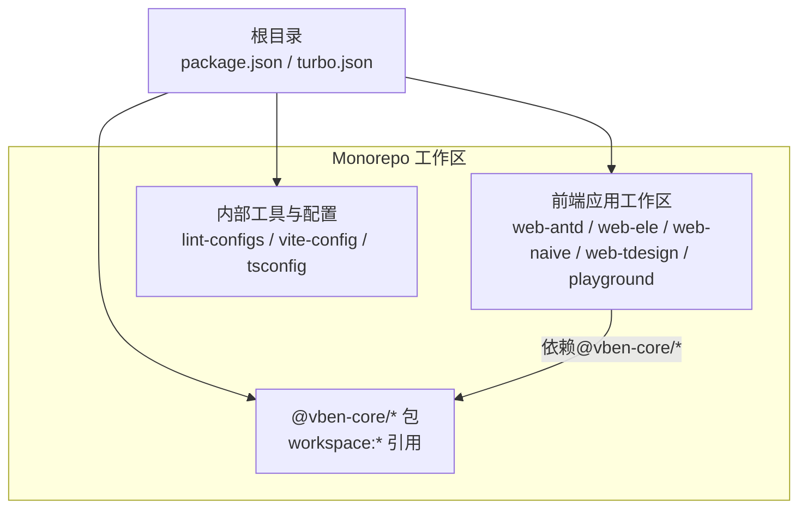
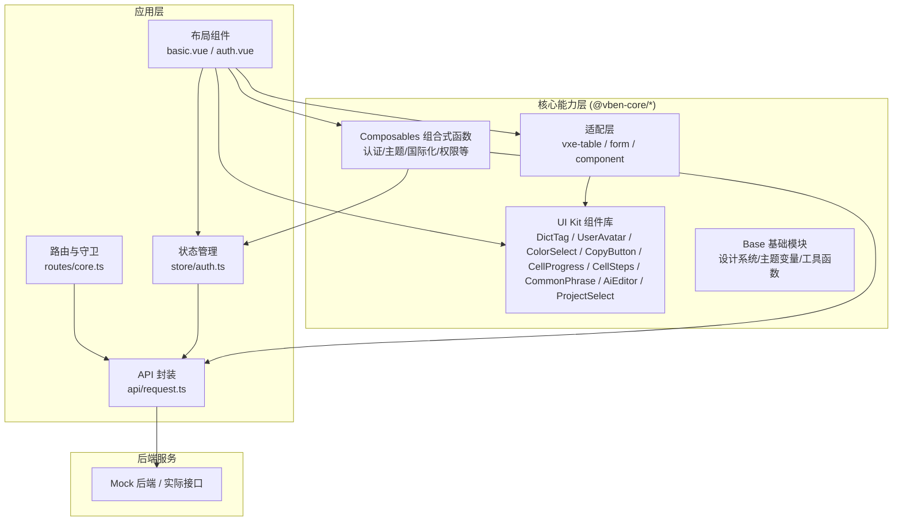
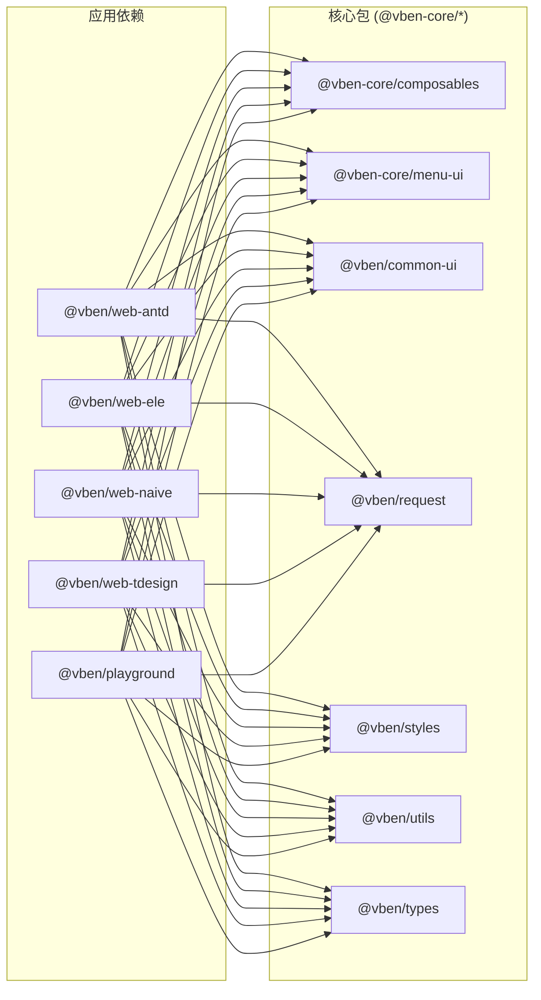

# @core 核心包

<cite>
**本文引用的文件**
- [package.json](file://package.json)
- [turbo.json](file://turbo.json)
- [@vben/web-antd 包依赖](file://apps/web-antd/package.json)
- [web-antd 路由核心模块](file://apps/web-antd/src/router/routes/core.ts)
- [_core 示例页面集合](file://apps/web-antd/src/views/_core/README.md)
- [认证登录视图](file://apps/web-antd/src/views/_core/authentication/login.vue)
- [认证二维码登录视图](file://apps/web-antd/src/views/_core/authentication/qrcode-login.vue)
- [认证注册视图](file://apps/web-antd/src/views/_core/authentication/register.vue)
- [认证忘记密码视图](file://apps/web-antd/src/views/_core/authentication/forget-password.vue)
- [认证验证码登录视图](file://apps/web-antd/src/views/_core/authentication/code-login.vue)
- [404 页面视图](file://apps/web-antd/src/views/_core/fallback/not-found.vue)
- [403 页面视图](file://apps/web-antd/src/views/_core/fallback/forbidden.vue)
- [内部错误页面视图](file://apps/web-antd/src/views/_core/fallback/internal-error.vue)
- [即将上线页面视图](file://apps/web-antd/src/views/_core/fallback/coming-soon.vue)
- [通用组件：字典标签](file://apps/web-antd/src/components/DictTag/index.vue)
- [通用组件：用户头像](file://apps/web-antd/src/components/UserAvatar/index.vue)
- [通用组件：用户头像组](file://apps/web-antd/src/components/UserAvatarGroup/index.vue)
- [通用组件：颜色选择器](file://apps/web-antd/src/components/ColorSelect/index.vue)
- [通用组件：复制按钮](file://apps/web-antd/src/components/CopyButton/index.vue)
- [通用组件：进度单元格](file://apps/web-antd/src/components/CellProgress/index.vue)
- [通用组件：步骤单元格](file://apps/web-antd/src/components/CellSteps/index.vue)
- [通用组件：常用短语](file://apps/web-antd/src/components/CommonPhrase/index.vue)
- [通用组件：AI 编辑器](file://apps/web-antd/src/components/AiEditor/index.vue)
- [通用组件：项目选择器](file://apps/web-antd/src/components/dev/ProjectSelect/index.vue)
- [数据字典索引](file://apps/web-antd/src/dicts/index.ts)
- [富文本模板](file://apps/web-antd/src/template/richText.ts)
- [表格编辑器：日期编辑器](file://apps/web-antd/src/vtable/DateEditor.ts)
- [表格编辑器：富文本编辑器](file://apps/web-antd/src/vtable/RichTextEditor.ts)
- [表格编辑器：下拉选择编辑器](file://apps/web-antd/src/vtable/SelectEditor.ts)
- [表格编辑器：文件上传编辑器](file://apps/web-antd/src/vtable/UploadFileEditor.ts)
- [表格适配器：vxe 表格](file://apps/web-antd/src/adapter/vxe-table.ts)
- [表格适配器：表单适配器](file://apps/web-antd/src/adapter/form.ts)
- [表格适配器：组件适配器入口](file://apps/web-antd/src/adapter/component/index.ts)
- [API 索引（web-antd）](file://apps/web-antd/src/api/index.ts)
- [请求封装（web-antd）](file://apps/web-antd/src/api/request.ts)
- [菜单 API（web-antd）](file://apps/web-antd/src/api/core/menu.ts)
- [用户 API（web-antd）](file://apps/web-antd/src/api/core/user.ts)
- [认证 API（web-antd）](file://apps/web-antd/src/api/core/auth.ts)
- [认证状态存储](file://apps/web-antd/src/store/auth.ts)
- [全局状态入口](file://apps/web-antd/src/store/index.ts)
- [应用引导程序](file://apps/web-antd/src/bootstrap.ts)
- [主应用入口](file://apps/web-antd/src/main.ts)
- [偏好设置](file://apps/web-antd/src/preferences.ts)
- [时区初始化](file://apps/web-antd/src/timezone-init.ts)
- [Ant Design Web 应用布局](file://apps/web-antd/src/layouts/basic.vue)
- [Ant Design 认证布局](file://apps/web-antd/src/layouts/auth.vue)
- [Ant Design 布局入口](file://apps/web-antd/src/layouts/index.ts)
- [国际化语言索引](file://apps/web-antd/src/locales/index.ts)
- [英文语言包](file://apps/web-antd/src/locales/langs/en-US/README.md)
- [中文语言包](file://apps/web-antd/src/locales/langs/zh-CN/README.md)
- [通用 UI 组件文档](file://docs/src/components/common-ui/introduction.md)
- [通用 UI 组件表单文档](file://docs/src/components/common-ui/vben-form.md)
- [通用 UI 组件表格文档](file://docs/src/components/common-ui/vben-vxe-table.md)
- [通用 UI 组件抽屉文档](file://docs/src/components/common-ui/vben-drawer.md)
- [通用 UI 组件模态框文档](file://docs/src/components/common-ui/vben-modal.md)
- [布局 UI 组件页面文档](file://docs/src/components/layout-ui/page.md)
- [指南：快速开始](file://docs/src/guide/introduction/quick-start.md)
- [指南：主题配置](file://docs/src/guide/in-depth/theme.md)
- [指南：UI 框架选择](file://docs/src/guide/in-depth/ui-framework.md)
- [指南：样式与主题](file://docs/src/guide/essentials/styles.md)
- [指南：外部模块集成](file://docs/src/guide/essentials/external-module.md)
- [Playground 应用入口](file://playground/src/main.ts)
- [Playground 应用引导程序](file://playground/src/bootstrap.ts)
- [Playground 认证路由](file://playground/src/router/routes/core.ts)
- [Playground 偏好设置](file://playground/src/preferences.ts)
- [Playground 时区初始化](file://playground/src/timezone-init.ts)
- [Playground 国际化索引](file://playground/src/locales/index.ts)
- [Playground 布局入口](file://playground/src/layouts/index.ts)
- [Playground API 索引](file://playground/src/api/index.ts)
- [Playground 请求封装](file://playground/src/api/request.ts)
- [Playground 认证状态存储](file://playground/src/store/auth.ts)
- [Playground 全局状态入口](file://playground/src/store/index.ts)
- [Playground 通用组件：字典标签](file://playground/src/components/DictTag/index.vue)
- [Playground 通用组件：用户头像](file://playground/src/components/UserAvatar/index.vue)
- [Playground 通用组件：用户头像组](file://playground/src/components/UserAvatarGroup/index.vue)
- [Playground 通用组件：颜色选择器](file://playground/src/components/ColorSelect/index.vue)
- [Playground 通用组件：复制按钮](file://playground/src/components/CopyButton/index.vue)
- [Playground 通用组件：进度单元格](file://playground/src/components/CellProgress/index.vue)
- [Playground 通用组件：步骤单元格](file://playground/src/components/CellSteps/index.vue)
- [Playground 通用组件：常用短语](file://playground/src/components/CommonPhrase/index.vue)
- [Playground 通用组件：AI 编辑器](file://playground/src/components/AiEditor/index.vue)
- [Playground 通用组件：项目选择器](file://playground/src/components/dev/ProjectSelect/index.vue)
- [Playground 数据字典索引](file://playground/src/dicts/index.ts)
- [Playground 富文本模板](file://playground/src/template/richText.ts)
- [Playground 表格编辑器：日期编辑器](file://playground/src/vtable/DateEditor.ts)
- [Playground 表格编辑器：富文本编辑器](file://playground/src/vtable/RichTextEditor.ts)
- [Playground 表格编辑器：下拉选择编辑器](file://playground/src/vtable/SelectEditor.ts)
- [Playground 表格编辑器：文件上传编辑器](file://playground/src/vtable/UploadFileEditor.ts)
- [Playground 表格适配器：vxe 表格](file://playground/src/adapter/vxe-table.ts)
- [Playground 表格适配器：表单适配器](file://playground/src/adapter/form.ts)
- [Playground 表格适配器：组件适配器入口](file://playground/src/adapter/component/index.ts)
</cite>

## 目录

1. [简介](#简介)
2. [项目结构](#项目结构)
3. [核心组件](#核心组件)
4. [架构总览](#架构总览)
5. [详细组件分析](#详细组件分析)
6. [依赖分析](#依赖分析)
7. [性能考虑](#性能考虑)
8. [故障排查指南](#故障排查指南)
9. [结论](#结论)
10. [附录](#附录)

## 简介

本文件面向使用 @core 核心包的开发者，系统性阐述其整体架构与设计理念，覆盖 UI Kit 组件库的使用方法、Composables 组合式函数的实现原理与最佳实践，并详解 Base 基础模块的设计系统、主题变量与工具函数等核心能力。文档同时提供在多套 UI 框架（Ant Design、Element Plus、Naive UI、TDesign）中的引入与使用范式，以及常见业务场景的最佳实践，帮助团队在统一设计语言与开发规范下高效落地。

## 项目结构

本仓库采用 Monorepo 架构，通过 Turbo 管道管理多应用与多包的构建与发布。@core 核心包以工作区包的形式被各前端应用（如 web-antd、web-ele、web-naive、web-tdesign、playground）以 workspace:\* 的形式引用，确保版本一致与增量构建优化。

图表来源

- [package.json:1-109](file://package.json#L1-L109)
- [turbo.json:1-49](file://turbo.json#L1-L49)
- [@vben/web-antd 包依赖:28-66](file://apps/web-antd/package.json#L28-L66)

章节来源

- [package.json:1-109](file://package.json#L1-L109)
- [turbo.json:1-49](file://turbo.json#L1-L49)

## 核心组件

@core 核心包在本仓库中体现为一组可复用的 UI 组件、状态管理、API 封装与适配层，配合各 UI 框架的适配器，形成“统一能力 + 多框架兼容”的设计。核心能力包括：

- UI Kit 组件库：提供常用业务组件（如字典标签、用户头像、颜色选择器、复制按钮、进度/步骤单元格、常用短语、AI 编辑器、项目选择器等），统一风格与交互。
- Composables 组合式函数：封装跨页面、跨模块的可复用逻辑（如认证状态、主题切换、国际化、权限控制等），提升代码复用与可测试性。
- Base 基础模块：提供设计系统（色彩、字号、间距、阴影、圆角等）、主题变量体系、工具函数（日期格式化、枚举工具、版本工具等），保证视觉一致性与开发效率。
- 适配层：针对不同 UI 框架（Ant Design、Element Plus、Naive UI、TDesign）提供组件与表单/表格的适配器，屏蔽框架差异。
- API 与状态：统一的请求封装、认证 API、菜单 API、用户 API 与 Pinia 状态管理，支撑权限与数据流。

章节来源

- [apps/web-antd/src/components/DictTag/index.vue](file://apps/web-antd/src/components/DictTag/index.vue)
- [apps/web-antd/src/components/UserAvatar/index.vue](file://apps/web-antd/src/components/UserAvatar/index.vue)
- [apps/web-antd/src/components/ColorSelect/index.vue](file://apps/web-antd/src/components/ColorSelect/index.vue)
- [apps/web-antd/src/components/CopyButton/index.vue](file://apps/web-antd/src/components/CopyButton/index.vue)
- [apps/web-antd/src/components/CellProgress/index.vue](file://apps/web-antd/src/components/CellProgress/index.vue)
- [apps/web-antd/src/components/CellSteps/index.vue](file://apps/web-antd/src/components/CellSteps/index.vue)
- [apps/web-antd/src/components/CommonPhrase/index.vue](file://apps/web-antd/src/components/CommonPhrase/index.vue)
- [apps/web-antd/src/components/AiEditor/index.vue](file://apps/web-antd/src/components/AiEditor/index.vue)
- [apps/web-antd/src/components/dev/ProjectSelect/index.vue](file://apps/web-antd/src/components/dev/ProjectSelect/index.vue)
- [apps/web-antd/src/api/core/auth.ts](file://apps/web-antd/src/api/core/auth.ts)
- [apps/web-antd/src/api/core/menu.ts](file://apps/web-antd/src/api/core/menu.ts)
- [apps/web-antd/src/api/core/user.ts](file://apps/web-antd/src/api/core/user.ts)
- [apps/web-antd/src/store/auth.ts](file://apps/web-antd/src/store/auth.ts)
- [apps/web-antd/src/adapter/vxe-table.ts](file://apps/web-antd/src/adapter/vxe-table.ts)
- [apps/web-antd/src/adapter/form.ts](file://apps/web-antd/src/adapter/form.ts)
- [apps/web-antd/src/adapter/component/index.ts](file://apps/web-antd/src/adapter/component/index.ts)

## 架构总览

下图展示了 @core 在前端应用中的角色与交互关系：应用通过依赖 @vben-core/\* 获取统一能力；UI 组件与 Composables 提供界面与逻辑；适配层对接具体 UI 框架；API 层负责后端通信；状态层集中管理认证与全局状态。

图表来源

- [apps/web-antd/src/layouts/basic.vue](file://apps/web-antd/src/layouts/basic.vue)
- [apps/web-antd/src/layouts/auth.vue](file://apps/web-antd/src/layouts/auth.vue)
- [apps/web-antd/src/router/routes/core.ts](file://apps/web-antd/src/router/routes/core.ts)
- [apps/web-antd/src/store/auth.ts](file://apps/web-antd/src/store/auth.ts)
- [apps/web-antd/src/api/request.ts](file://apps/web-antd/src/api/request.ts)
- [apps/web-antd/src/components/DictTag/index.vue](file://apps/web-antd/src/components/DictTag/index.vue)
- [apps/web-antd/src/components/UserAvatar/index.vue](file://apps/web-antd/src/components/UserAvatar/index.vue)
- [apps/web-antd/src/components/ColorSelect/index.vue](file://apps/web-antd/src/components/ColorSelect/index.vue)
- [apps/web-antd/src/components/CopyButton/index.vue](file://apps/web-antd/src/components/CopyButton/index.vue)
- [apps/web-antd/src/components/CellProgress/index.vue](file://apps/web-antd/src/components/CellProgress/index.vue)
- [apps/web-antd/src/components/CellSteps/index.vue](file://apps/web-antd/src/components/CellSteps/index.vue)
- [apps/web-antd/src/components/CommonPhrase/index.vue](file://apps/web-antd/src/components/CommonPhrase/index.vue)
- [apps/web-antd/src/components/AiEditor/index.vue](file://apps/web-antd/src/components/AiEditor/index.vue)
- [apps/web-antd/src/components/dev/ProjectSelect/index.vue](file://apps/web-antd/src/components/dev/ProjectSelect/index.vue)
- [apps/web-antd/src/adapter/vxe-table.ts](file://apps/web-antd/src/adapter/vxe-table.ts)
- [apps/web-antd/src/adapter/form.ts](file://apps/web-antd/src/adapter/form.ts)
- [apps/web-antd/src/adapter/component/index.ts](file://apps/web-antd/src/adapter/component/index.ts)

## 详细组件分析

### UI Kit 组件库

UI Kit 组件库提供高频使用的业务组件，统一风格与交互，便于在多框架下保持一致体验。

- 字典标签（DictTag）：用于展示数据字典项的标签化显示，支持多语言与样式定制。
- 用户头像（UserAvatar / UserAvatarGroup）：支持头像加载失败回退、头像组数量限制与交互提示。
- 颜色选择器（ColorSelect）：提供颜色选择与预览，常用于主题或业务配色设置。
- 复制按钮（CopyButton）：一键复制文本内容，支持成功/失败反馈。
- 进度单元格（CellProgress）：用于表格中展示进度条，支持数值与文案。
- 步骤单元格（CellSteps）：用于表格中展示流程步骤，支持高亮当前步骤。
- 常用短语（CommonPhrase）：提供常用短语列表，支持快速插入与自定义。
- AI 编辑器（AiEditor）：集成 AI 助手的富文本编辑器，支持智能生成与优化。
- 项目选择器（ProjectSelect）：用于项目维度的选择与筛选，支持远程数据源。

使用建议

- 在表格中优先使用 CellProgress/CellSteps 提升信息密度与可读性。
- 使用 CopyButton 提升用户操作效率，注意在移动端的反馈设计。
- 颜色选择器与主题变量联动，避免硬编码颜色值。

章节来源

- [apps/web-antd/src/components/DictTag/index.vue](file://apps/web-antd/src/components/DictTag/index.vue)
- [apps/web-antd/src/components/UserAvatar/index.vue](file://apps/web-antd/src/components/UserAvatar/index.vue)
- [apps/web-antd/src/components/UserAvatarGroup/index.vue](file://apps/web-antd/src/components/UserAvatarGroup/index.vue)
- [apps/web-antd/src/components/ColorSelect/index.vue](file://apps/web-antd/src/components/ColorSelect/index.vue)
- [apps/web-antd/src/components/CopyButton/index.vue](file://apps/web-antd/src/components/CopyButton/index.vue)
- [apps/web-antd/src/components/CellProgress/index.vue](file://apps/web-antd/src/components/CellProgress/index.vue)
- [apps/web-antd/src/components/CellSteps/index.vue](file://apps/web-antd/src/components/CellSteps/index.vue)
- [apps/web-antd/src/components/CommonPhrase/index.vue](file://apps/web-antd/src/components/CommonPhrase/index.vue)
- [apps/web-antd/src/components/AiEditor/index.vue](file://apps/web-antd/src/components/AiEditor/index.vue)
- [apps/web-antd/src/components/dev/ProjectSelect/index.vue](file://apps/web-antd/src/components/dev/ProjectSelect/index.vue)

### Composables 组合式函数

Composables 将跨页面、跨模块的通用逻辑抽取为可复用的组合式函数，提升代码复用与可测试性。

- 认证状态 Composables：封装登录、登出、刷新令牌、用户信息获取等逻辑，统一处理认证流程。
- 主题切换 Composables：提供明暗主题切换、主题变量更新、持久化存储等功能。
- 国际化 Composables：封装语言切换、动态加载语言包、本地化格式化等。
- 权限控制 Composables：基于路由与菜单生成动态权限，支持按钮级权限控制。
- 表单/表格适配 Composables：封装表单校验、表格分页/排序/筛选等通用逻辑。

最佳实践

- 将副作用（网络请求、本地存储）集中在 Composables 中，保持页面逻辑简洁。
- 使用响应式状态与计算属性，避免重复渲染。
- 对外暴露只读状态与受控方法，便于测试与调试。

章节来源

- [apps/web-antd/src/store/auth.ts](file://apps/web-antd/src/store/auth.ts)
- [apps/web-antd/src/api/request.ts](file://apps/web-antd/src/api/request.ts)
- [apps/web-antd/src/locales/index.ts](file://apps/web-antd/src/locales/index.ts)
- [apps/web-antd/src/router/routes/core.ts](file://apps/web-antd/src/router/routes/core.ts)

### Base 基础模块

Base 基础模块提供设计系统、主题变量与工具函数，确保视觉一致性与开发效率。

- 设计系统：定义色彩体系（主色、辅助色、语义色）、字号体系、间距体系、阴影与圆角规范。
- 主题变量：提供 CSS 变量与运行时变量映射，支持动态主题切换。
- 工具函数：日期格式化、枚举工具、版本工具、字符串与对象处理等。

使用建议

- 在样式中优先使用主题变量，避免硬编码颜色与尺寸。
- 新增组件时遵循设计系统规范，保持视觉一致性。
- 工具函数尽量无副作用，参数与返回值明确。

章节来源

- [apps/web-antd/src/preferences.ts](file://apps/web-antd/src/preferences.ts)
- [apps/web-antd/src/timezone-init.ts](file://apps/web-antd/src/timezone-init.ts)
- [apps/web-antd/src/dicts/index.ts](file://apps/web-antd/src/dicts/index.ts)
- [apps/web-antd/src/utils/enumUtils.ts](file://apps/web-antd/src/utils/enumUtils.ts)
- [apps/web-antd/src/utils/versionUtils.ts](file://apps/web-antd/src/utils/versionUtils.ts)

### 适配层（UI 框架适配）

适配层针对不同 UI 框架（Ant Design、Element Plus、Naive UI、TDesign）提供组件与表单/表格的适配器，屏蔽框架差异。

- vxe-table 适配器：统一表格行为（分页、排序、筛选、编辑），适配不同 UI 框架的表格组件。
- 表单适配器：统一表单字段类型、校验规则与布局，适配不同 UI 框架的表单组件。
- 组件适配器入口：集中导出适配后的组件，简化导入与使用。

使用建议

- 在引入组件前先确认适配器是否已存在，避免重复封装。
- 适配器应保持最小改动原则，仅做必要的桥接与转换。

章节来源

- [apps/web-antd/src/adapter/vxe-table.ts](file://apps/web-antd/src/adapter/vxe-table.ts)
- [apps/web-antd/src/adapter/form.ts](file://apps/web-antd/src/adapter/form.ts)
- [apps/web-antd/src/adapter/component/index.ts](file://apps/web-antd/src/adapter/component/index.ts)

### API 与状态

统一的 API 封装与状态管理支撑认证、菜单、用户等核心业务。

- 请求封装：统一拦截器、错误处理、重试策略、超时控制。
- 认证 API：登录、登出、刷新令牌、验证码登录等。
- 菜单 API：动态菜单生成、权限过滤。
- 用户 API：用户信息、头像、个人设置等。
- 状态管理：Pinia Store 管理认证状态、全局配置、用户信息等。

使用建议

- 所有网络请求统一通过封装的 request 方法发起，便于统一处理。
- 认证状态变更时同步更新本地存储与全局状态。
- 菜单与权限需在登录后拉取并缓存，避免重复请求。

章节来源

- [apps/web-antd/src/api/request.ts](file://apps/web-antd/src/api/request.ts)
- [apps/web-antd/src/api/core/auth.ts](file://apps/web-antd/src/api/core/auth.ts)
- [apps/web-antd/src/api/core/menu.ts](file://apps/web-antd/src/api/core/menu.ts)
- [apps/web-antd/src/api/core/user.ts](file://apps/web-antd/src/api/core/user.ts)
- [apps/web-antd/src/store/auth.ts](file://apps/web-antd/src/store/auth.ts)
- [apps/web-antd/src/store/index.ts](file://apps/web-antd/src/store/index.ts)

## 依赖分析

@core 核心包在各应用中以 workspace:\* 的形式被引用，确保版本一致与增量构建优化。下图展示应用对 @core 的依赖关系与关键交互点。

图表来源

- [@vben/web-antd 包依赖:28-66](file://apps/web-antd/package.json#L28-L66)

章节来源

- [@vben/web-antd 包依赖:28-66](file://apps/web-antd/package.json#L28-L66)

## 性能考虑

- 组件懒加载：对非首屏组件采用动态导入，减少初始包体。
- 状态分片：按模块拆分 Store，避免全局状态过大导致的重渲染。
- 请求缓存：对静态数据与不频繁变化的数据进行缓存，降低请求频率。
- 适配器最小化：适配层仅做必要桥接，避免额外的计算与渲染开销。
- 主题变量：使用 CSS 变量与运行时变量映射，减少样式重排与重绘。

## 故障排查指南

- 登录失败
  - 检查认证 API 返回与错误提示，确认用户名/密码或验证码是否正确。
  - 查看请求封装中的拦截器与错误处理逻辑。
  - 确认认证状态存储是否正确更新。

  章节来源
  - [apps/web-antd/src/api/core/auth.ts](file://apps/web-antd/src/api/core/auth.ts)
  - [apps/web-antd/src/api/request.ts](file://apps/web-antd/src/api/request.ts)
  - [apps/web-antd/src/store/auth.ts](file://apps/web-antd/src/store/auth.ts)

- 菜单不显示或权限异常
  - 检查菜单 API 是否正常返回，确认权限过滤逻辑。
  - 核对路由守卫与访问控制配置。

  章节来源
  - [apps/web-antd/src/api/core/menu.ts](file://apps/web-antd/src/api/core/menu.ts)
  - [apps/web-antd/src/router/routes/core.ts](file://apps/web-antd/src/router/routes/core.ts)

- 组件样式错乱
  - 检查主题变量与 CSS 变量是否正确生效。
  - 确认适配器是否正确引入对应 UI 框架的样式。

  章节来源
  - [apps/web-antd/src/preferences.ts](file://apps/web-antd/src/preferences.ts)
  - [apps/web-antd/src/adapter/component/index.ts](file://apps/web-antd/src/adapter/component/index.ts)

- 表格/表单异常
  - 检查适配器中的字段映射与校验规则。
  - 确认分页、排序、筛选参数是否符合后端接口要求。

  章节来源
  - [apps/web-antd/src/adapter/vxe-table.ts](file://apps/web-antd/src/adapter/vxe-table.ts)
  - [apps/web-antd/src/adapter/form.ts](file://apps/web-antd/src/adapter/form.ts)

## 结论

@core 核心包通过统一的 UI Kit 组件库、Composables 组合式函数与 Base 基础模块，结合多 UI 框架适配层，为多应用提供了高内聚、低耦合的前端基础设施。遵循本文档的设计理念与最佳实践，可在保证视觉一致性的同时，显著提升开发效率与维护性。

## 附录

### 在项目中引入与使用 @core 的步骤

- 安装与依赖
  - 在应用的 package.json 中添加 @vben-core/_ 的 workspace:_ 依赖。
  - 通过 pnpm 安装依赖，确保工作区包被正确解析。

  章节来源
  - [@vben/web-antd 包依赖:28-66](file://apps/web-antd/package.json#L28-L66)

- 初始化与引导
  - 在应用入口调用引导程序，初始化偏好设置、时区、国际化与布局。

  章节来源
  - [apps/web-antd/src/bootstrap.ts](file://apps/web-antd/src/bootstrap.ts)
  - [apps/web-antd/src/main.ts](file://apps/web-antd/src/main.ts)
  - [apps/web-antd/src/preferences.ts](file://apps/web-antd/src/preferences.ts)
  - [apps/web-antd/src/timezone-init.ts](file://apps/web-antd/src/timezone-init.ts)

- 使用 UI 组件
  - 在页面中直接引入 UI Kit 组件，按需使用并遵循设计系统。

  章节来源
  - [apps/web-antd/src/components/DictTag/index.vue](file://apps/web-antd/src/components/DictTag/index.vue)
  - [apps/web-antd/src/components/UserAvatar/index.vue](file://apps/web-antd/src/components/UserAvatar/index.vue)
  - [apps/web-antd/src/components/ColorSelect/index.vue](file://apps/web-antd/src/components/ColorSelect/index.vue)
  - [apps/web-antd/src/components/CopyButton/index.vue](file://apps/web-antd/src/components/CopyButton/index.vue)
  - [apps/web-antd/src/components/CellProgress/index.vue](file://apps/web-antd/src/components/CellProgress/index.vue)
  - [apps/web-antd/src/components/CellSteps/index.vue](file://apps/web-antd/src/components/CellSteps/index.vue)
  - [apps/web-antd/src/components/CommonPhrase/index.vue](file://apps/web-antd/src/components/CommonPhrase/index.vue)
  - [apps/web-antd/src/components/AiEditor/index.vue](file://apps/web-antd/src/components/AiEditor/index.vue)
  - [apps/web-antd/src/components/dev/ProjectSelect/index.vue](file://apps/web-antd/src/components/dev/ProjectSelect/index.vue)

- 使用 Composables
  - 在页面或服务中调用认证、主题、国际化等 Composables，集中处理状态与逻辑。

  章节来源
  - [apps/web-antd/src/store/auth.ts](file://apps/web-antd/src/store/auth.ts)
  - [apps/web-antd/src/locales/index.ts](file://apps/web-antd/src/locales/index.ts)

- 使用 API 与状态
  - 通过统一的请求封装与 API 模块发起网络请求，管理认证状态与全局配置。

  章节来源
  - [apps/web-antd/src/api/request.ts](file://apps/web-antd/src/api/request.ts)
  - [apps/web-antd/src/api/core/auth.ts](file://apps/web-antd/src/api/core/auth.ts)
  - [apps/web-antd/src/api/core/menu.ts](file://apps/web-antd/src/api/core/menu.ts)
  - [apps/web-antd/src/api/core/user.ts](file://apps/web-antd/src/api/core/user.ts)
  - [apps/web-antd/src/store/auth.ts](file://apps/web-antd/src/store/auth.ts)
  - [apps/web-antd/src/store/index.ts](file://apps/web-antd/src/store/index.ts)

### 常见使用场景与最佳实践

- 登录与认证
  - 使用认证 API 完成登录，保存令牌与用户信息，进入主页面。
  - 在路由守卫中校验权限，防止未授权访问。

  章节来源
  - [apps/web-antd/src/api/core/auth.ts](file://apps/web-antd/src/api/core/auth.ts)
  - [apps/web-antd/src/router/routes/core.ts](file://apps/web-antd/src/router/routes/core.ts)

- 动态菜单与权限
  - 登录后拉取菜单与权限，生成路由表，控制按钮级权限。

  章节来源
  - [apps/web-antd/src/api/core/menu.ts](file://apps/web-antd/src/api/core/menu.ts)
  - [apps/web-antd/src/router/routes/core.ts](file://apps/web-antd/src/router/routes/core.ts)

- 表格与表单
  - 使用适配器统一表格与表单行为，减少重复代码。

  章节来源
  - [apps/web-antd/src/adapter/vxe-table.ts](file://apps/web-antd/src/adapter/vxe-table.ts)
  - [apps/web-antd/src/adapter/form.ts](file://apps/web-antd/src/adapter/form.ts)

- 国际化与主题
  - 使用国际化 Composables 切换语言，使用主题 Composables 切换明暗主题。

  章节来源
  - [apps/web-antd/src/locales/index.ts](file://apps/web-antd/src/locales/index.ts)
  - [apps/web-antd/src/preferences.ts](file://apps/web-antd/src/preferences.ts)

### 文档与示例参考

- 通用 UI 组件文档：涵盖表单、表格、抽屉、模态框等组件的使用说明与示例。
- 布局 UI 组件文档：介绍页面布局组件的使用方法。
- 指南：快速开始、主题配置、UI 框架选择、样式与主题、外部模块集成等。

章节来源

- [通用 UI 组件文档](file://docs/src/components/common-ui/introduction.md)
- [通用 UI 组件表单文档](file://docs/src/components/common-ui/vben-form.md)
- [通用 UI 组件表格文档](file://docs/src/components/common-ui/vben-vxe-table.md)
- [通用 UI 组件抽屉文档](file://docs/src/components/common-ui/vben-drawer.md)
- [通用 UI 组件模态框文档](file://docs/src/components/common-ui/vben-modal.md)
- [布局 UI 组件页面文档](file://docs/src/components/layout-ui/page.md)
- [指南：快速开始](file://docs/src/guide/introduction/quick-start.md)
- [指南：主题配置](file://docs/src/guide/in-depth/theme.md)
- [指南：UI 框架选择](file://docs/src/guide/in-depth/ui-framework.md)
- [指南：样式与主题](file://docs/src/guide/essentials/styles.md)
- [指南：外部模块集成](file://docs/src/guide/essentials/external-module.md)
